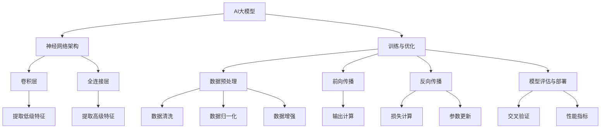

                 

### 第一部分：AI大模型基础

在人工智能（AI）的领域中，大模型（Large-scale Models）已经成为近年来研究的热点。它们凭借其强大的数据处理能力和复杂的计算模型，在自然语言处理（NLP）、计算机视觉（CV）、语音识别等领域展现出了巨大的潜力。本部分将首先介绍AI大模型的基本概念和原理，接着讨论其架构，以及训练与优化过程。

#### 1.1 AI大模型概述

AI大模型的起源可以追溯到深度学习（Deep Learning）的兴起。深度学习是一种基于多层神经网络的机器学习技术，能够自动从数据中学习特征和模式。随着计算能力的提升和数据量的增加，研究者开始尝试构建具有数百万甚至数亿参数的大规模神经网络，以期在复杂任务上取得更好的性能。

##### 1.1.1 大模型的起源与发展

大模型的起源可以追溯到2012年，当时AlexNet在ImageNet图像识别比赛中取得了突破性的成绩。AlexNet使用了8个卷积层和3个全连接层，其参数数量达到了6000万个，远超之前的网络结构。此后，随着GPU计算能力的提升，大模型的研究和应用进入了一个快速发展的阶段。

##### 1.1.2 大模型的定义与分类

大模型的定义相对宽泛，一般是指参数规模在数百万到数十亿之间的神经网络。根据任务类型和应用领域，大模型可以大致分为以下几类：

1. **自然语言处理（NLP）模型**：如Transformer、GPT系列等，主要应用于文本生成、翻译、摘要等任务。
2. **计算机视觉（CV）模型**：如ResNet、VGG等，用于图像分类、目标检测、图像生成等任务。
3. **语音识别模型**：如WaveNet、Transformer TTS等，用于语音合成、语音识别等任务。

##### 1.1.3 大模型在AI中的地位

大模型在AI中占据着核心地位。首先，它们能够处理大量数据，从海量数据中学习到复杂的模式和特征。其次，大模型通常采用复杂的神经网络结构，这些结构能够捕捉到数据的深层信息，从而在各类任务上取得优异的性能。例如，GPT-3在文本生成任务上已经达到了人类的水平，而ImageNet图像识别比赛中，大模型如ResNet取得了超过人类的表现。

#### 1.2 AI大模型的架构

大模型的架构通常包括以下几个关键部分：

##### 1.2.1 大模型的神经网络架构

大模型的神经网络架构通常采用深度结构，包括多层卷积层、全连接层等。深度学习的核心思想是通过逐层学习，从原始数据中提取越来越抽象的特征。例如，在计算机视觉中，卷积层能够提取到边缘、纹理等低级特征，而全连接层则能够从这些低级特征中提取到高级语义特征。

##### 1.2.2 大模型的训练与优化

大模型的训练是一个复杂且耗时的过程。训练过程通常包括以下几个步骤：

1. **数据预处理**：包括数据清洗、归一化、数据增强等。
2. **模型初始化**：选择合适的初始化方法，如随机初始化、He初始化等。
3. **前向传播**：将输入数据通过神经网络进行前向传播，得到输出。
4. **损失计算**：计算输出与真实标签之间的损失。
5. **反向传播**：通过反向传播算法更新网络参数。
6. **优化**：选择合适的优化算法，如Adam、SGD等，以减小损失。

##### 1.2.3 大模型的评估与部署

大模型的评估通常采用交叉验证、准确率、召回率、F1分数等指标。评估的目的是验证模型在未知数据上的性能，确保模型的泛化能力。

在部署方面，大模型通常需要在高性能计算环境中运行，如GPU集群或TPU。此外，为了提高部署效率，常常需要使用模型压缩和量化技术，以减少模型的参数数量和计算量。

### 总结

AI大模型作为人工智能领域的重要突破，具有广泛的应用前景。本章节介绍了大模型的基本概念、架构和训练优化过程，为后续章节的深入讨论奠定了基础。

接下来，我们将进一步探讨提示词的定义、作用和实现方式，以及AI大模型编程中的核心算法原理。在理解了这些基础概念之后，我们将进入更深入的探讨，以揭示AI大模型编程的潜力与魔力。敬请期待！

---

**核心概念与联系：**

为了更清晰地展示AI大模型、神经网络架构、训练与优化过程等核心概念之间的联系，我们可以使用Mermaid流程图。以下是相关的流程图示例：



通过这个Mermaid流程图，我们可以直观地看到AI大模型的核心概念和过程是如何相互关联和影响的。

---

在下一章节中，我们将探讨AI大模型编程中的提示词原理与实现，进一步理解这一关键技术在AI编程中的重要性。请继续关注！

---

### 第二部分：提示词原理与实现

在AI大模型的编程中，提示词（Prompt）是一种非常重要的工具，它能够有效地指导模型的输入方向，提升模型的性能和生成效果。本章节将首先介绍提示词的定义，接着讨论其在AI大模型中的作用和实现方式。

#### 2.1 提示词的定义与作用

##### 2.1.1 提示词的概念

提示词（Prompt）是指在给模型输入数据时，提供的一些引导信息或上下文，用以影响模型的输出。在自然语言处理（NLP）任务中，提示词通常是几句话或一个短语，用以引导模型生成更加符合预期的文本。

##### 2.1.2 提示词的作用

1. **引导模型方向**：通过提示词，可以明确地告诉模型需要关注的信息或任务，从而避免模型在无关信息上浪费计算资源。
2. **提升生成效果**：合适的提示词能够引导模型生成更加连贯、准确和有创意的内容。
3. **增强模型解释性**：通过提示词，研究者可以更好地理解模型的决策过程和生成逻辑。

##### 2.1.3 提示词的类型

根据不同的应用场景和任务需求，提示词可以分为以下几种类型：

1. **任务型提示词**：这类提示词主要用于指示模型需要完成的任务。例如，在文本生成任务中，提示词可以是“写一篇关于人工智能的论文摘要”。
2. **上下文型提示词**：这类提示词用于提供上下文信息，帮助模型更好地理解输入文本。例如，在对话生成任务中，提示词可以是“用户说：你好，请问今天天气怎么样？”。
3. **引导型提示词**：这类提示词用于引导模型生成特定类型的内容，如故事、诗歌等。

#### 2.2 提示词的生成与优化

##### 2.2.1 提示词的生成算法

生成提示词的方法通常有以下几个步骤：

1. **数据预处理**：对原始文本数据进行清洗、去噪和归一化，以确保输入数据的质量。
2. **文本摘要**：通过文本摘要算法提取输入文本的主要内容和关键信息。
3. **模板生成**：根据任务需求和文本摘要，设计合适的模板，用于生成提示词。模板可以是固定格式，也可以是可变参数的模板。

##### 2.2.2 提示词的优化策略

为了提升提示词的质量和效果，可以采用以下优化策略：

1. **多样性优化**：通过引入随机性或对抗性训练，生成多样化的提示词，以提高模型的泛化能力。
2. **质量评估**：使用自动化评估方法，如BLEU、ROUGE等，评估提示词的质量，并根据评估结果进行迭代优化。
3. **专家反馈**：邀请领域专家对提示词进行评估和修改，以提高其专业性和准确性。

##### 2.2.3 提示词的评估方法

评估提示词的质量通常可以从以下几个方面进行：

1. **生成效果**：评估模型生成文本的连贯性、准确性、创造性和相关性。
2. **计算效率**：评估提示词生成和模型响应的时间成本，确保在实际应用中具有可接受的速度。
3. **用户体验**：通过用户调查和反馈，评估提示词在真实应用场景中的效果和满意度。

#### 2.3 提示词在实际应用中的效果和案例分析

在实际应用中，提示词的效果往往取决于具体的任务和场景。以下是一些案例分析：

1. **文本生成**：在文本生成任务中，如问答系统、故事创作等，合适的提示词可以显著提高生成文本的质量和创造力。
2. **对话系统**：在对话系统中，如聊天机器人、虚拟助手等，提示词可以引导用户更好地进行交互，提高用户体验。
3. **图像生成**：在图像生成任务中，如风格迁移、人脸生成等，提示词可以提供图像内容的具体要求和风格指导，从而提高生成图像的质量。

通过以上案例分析可以看出，提示词在AI大模型编程中的应用具有广泛的前景和实际价值。合理设计和使用提示词，能够显著提升模型的效果和用户体验。

### 总结

提示词作为AI大模型编程的重要工具，其在引导模型方向、提升生成效果和增强模型解释性方面发挥了重要作用。本章节介绍了提示词的定义、作用、生成和优化策略，并通过实际案例分析展示了其应用效果。在下一章节中，我们将进一步探讨AI大模型编程中的核心算法原理，深入解析大模型如何通过这些算法实现复杂任务的自动处理。

---

在了解了AI大模型和提示词的基本概念和实现方法之后，下一章节将进入更深层次的探讨，解析AI大模型编程的核心算法原理。请继续关注！

---

### 第三部分：核心算法原理讲解

在AI大模型编程中，核心算法的设计和实现是模型性能和效果的关键。本章节将重点介绍两种重要的核心算法：生成对抗网络（GAN）和强化学习（Reinforcement Learning），详细阐述其基本原理、训练过程和应用实例。

#### 3.1 生成对抗网络（GAN）

生成对抗网络（GAN）是由Ian Goodfellow等人于2014年提出的一种深度学习模型，它由生成器（Generator）和判别器（Discriminator）两个部分组成，通过对抗训练的方式，生成高质量的数据。

##### 3.1.1 GAN的基本原理

GAN的工作原理类似于一个零和游戏：生成器和判别器的目标是相互竞争，生成器试图生成尽可能真实的数据，而判别器则试图区分真实数据和生成数据。

1. **生成器**：生成器的目标是生成类似于真实数据的高质量数据。它通常是一个全连接神经网络，接收随机噪声作为输入，并生成数据。
2. **判别器**：判别器的目标是区分真实数据和生成数据。它也是一个全连接神经网络，接收数据和标签作为输入，输出一个概率值，表示数据是真实的概率。

##### 3.1.2 GAN的训练过程

GAN的训练过程主要包括以下几个步骤：

1. **前向传播**：生成器生成数据，判别器接收生成数据和真实数据，并计算损失。
2. **反向传播**：根据判别器的损失，更新生成器和判别器的参数。
3. **优化过程**：生成器和判别器交替训练，生成器不断学习生成更真实的数据，判别器不断学习区分真实和生成数据。

##### 3.1.3 GAN的应用实例

GAN在图像生成、图像超分辨率、图像修复等领域有着广泛的应用。以下是一个图像生成实例：

**实例**：使用GAN生成人脸图像。

1. **数据准备**：收集大量人脸图像数据作为训练集。
2. **模型设计**：设计生成器和判别器，生成器输入噪声，输出人脸图像；判别器输入图像，输出判断是否为人脸的概率。
3. **训练过程**：通过对抗训练，生成器不断生成更真实的人脸图像，判别器不断学习区分真实人脸和生成人脸。
4. **评估与优化**：通过图像质量评估指标（如PSNR、SSIM）评估生成图像的质量，并根据评估结果调整模型参数。

通过这个实例可以看出，GAN能够生成高质量的人脸图像，其在图像生成领域的潜力得到了充分的展现。

#### 3.2 强化学习

强化学习（Reinforcement Learning，RL）是机器学习的一个重要分支，它通过智能体（Agent）与环境的交互，学习最优策略以最大化累积奖励。

##### 3.2.1 强化学习的定义

强化学习是一种通过与环境交互来学习如何获得最佳行动的机器学习方法。它由以下四个主要元素组成：

1. **智能体（Agent）**：执行动作并感知环境的实体。
2. **环境（Environment）**：智能体执行动作的上下文。
3. **状态（State）**：描述环境的当前情况。
4. **动作（Action）**：智能体可以采取的动作。
5. **奖励（Reward）**：对智能体动作的即时反馈。

##### 3.2.2 强化学习的算法

强化学习算法分为基于值函数的方法和基于策略的方法。以下简要介绍两种常见算法：

1. **Q-Learning**：Q-Learning是一种基于值函数的方法，它通过学习状态-动作值函数（Q值）来选择最佳动作。Q值表示在特定状态下采取特定动作所能获得的预期回报。
   
   **算法伪代码**：
   ```python
   for each episode:
       initialize state s
       while not end of episode:
           choose action a using epsilon-greedy strategy
           take action a, observe reward r and next state s'
           update Q(s, a) = Q(s, a) + alpha * (r + gamma * max(Q(s', a')) - Q(s, a))
           s = s'
   ```

2. **Policy Gradient**：Policy Gradient是一种基于策略的方法，它直接优化策略函数，以最大化累积奖励。

   **算法伪代码**：
   ```python
   for each episode:
       initialize state s
       while not end of episode:
           choose action a according to current policy
           take action a, observe reward r and next state s'
           update policy using gradient ascent
           s = s'
   ```

##### 3.2.3 强化学习在AI大模型中的应用

强化学习在AI大模型中的应用非常广泛，例如在游戏、机器人控制、推荐系统等领域。以下是一个游戏控制的实例：

**实例**：使用强化学习控制游戏角色。

1. **环境设计**：定义游戏环境，包括游戏状态、角色动作和奖励机制。
2. **模型设计**：设计智能体，使用Q-Learning或Policy Gradient算法训练智能体，使其学会在游戏中做出最优决策。
3. **训练过程**：智能体在游戏中执行动作，观察奖励，并通过算法更新策略。
4. **评估与优化**：通过游戏得分和策略稳定性来评估智能体的性能，并根据评估结果调整模型参数。

通过这个实例，可以看出强化学习在控制复杂环境中的强大能力。

### 总结

生成对抗网络（GAN）和强化学习（RL）是AI大模型编程中的两种核心算法，它们在图像生成、图像超分辨率、游戏控制等任务中展现了强大的潜力。本章节详细介绍了这两种算法的基本原理、训练过程和应用实例，为读者深入理解AI大模型编程奠定了基础。

在下一章节中，我们将深入探讨AI大模型的数学模型和数学公式，进一步揭示其内在的数学本质。敬请期待！

---

在了解了核心算法原理之后，接下来我们将进入更深入的数学层面，探讨AI大模型编程中的数学模型和数学公式。这不仅有助于理解算法的内在机制，也为深入研究和优化提供了理论基础。请继续关注！

---

### 第四部分：数学模型与公式

在AI大模型编程中，数学模型和数学公式是理解算法内在机制和进行优化的重要工具。本章节将详细介绍概率论基础和优化算法，包括梯度下降法、随机梯度下降法和鲍姆-沃尔夫定理等，同时通过具体例子来解释这些公式和算法的应用。

#### 4.1 概率论基础

概率论是AI和机器学习领域的重要基础。以下是一些核心概念和公式：

##### 4.1.1 概率论的基本概念

1. **概率分布**：概率分布描述了随机变量取值的概率分布情况。常见的概率分布有：
   - **伯努利分布**：表示二项试验成功的概率。
   - **正态分布**：最常见的连续概率分布，用于描述许多自然现象。
   - **伯努利分布**：表示二项试验成功的概率。

2. **条件概率**：在给定一个事件发生的条件下，另一个事件发生的概率。条件概率公式为：
   $$ P(A|B) = \frac{P(A \cap B)}{P(B)} $$
   其中，\( P(A \cap B) \) 表示事件A和事件B同时发生的概率。

3. **贝叶斯定理**：贝叶斯定理用于计算后验概率，公式为：
   $$ P(A|B) = \frac{P(B|A)P(A)}{P(B)} $$
   其中，\( P(B|A) \) 表示在事件A发生的条件下，事件B发生的概率。

##### 4.1.2 概率分布函数

1. **伯努利分布**：
   - **概率质量函数**：
     $$ f(x) = \begin{cases}
     p & \text{if } x=1 \\
     1-p & \text{if } x=0
     \end{cases} $$
   - **累积分布函数**：
     $$ F(x) = \begin{cases}
     p & \text{if } x \leq 1 \\
     1-p & \text{if } x > 0
     \end{cases} $$

2. **正态分布**：
   - **概率密度函数**：
     $$ f(x) = \frac{1}{\sqrt{2\pi\sigma^2}} e^{-\frac{(x-\mu)^2}{2\sigma^2}} $$
   - **累积分布函数**（标准正态分布）：
     $$ \Phi(x) = \frac{1}{\sqrt{2\pi}} \int_{-\infty}^{x} e^{-\frac{t^2}{2}} dt $$

##### 4.1.3 贝叶斯定理

贝叶斯定理是一个重要的概率公式，它可以帮助我们计算后验概率。其公式如下：

$$ P(A|B) = \frac{P(B|A)P(A)}{P(B)} $$

其中，\( P(A|B) \) 是后验概率，即已知事件B发生时事件A的概率；\( P(B|A) \) 是似然概率，即事件A发生时事件B的概率；\( P(A) \) 是先验概率，即事件A在没有考虑其他信息时的概率；\( P(B) \) 是边缘概率，即事件B的总概率。

#### 4.2 优化算法

优化算法在AI大模型编程中扮演着关键角色，用于寻找模型参数的最优值，以实现预测和决策的准确性。以下是几种常用的优化算法：

##### 4.2.1 梯度下降法

梯度下降法是一种基本的优化算法，用于最小化损失函数。其核心思想是沿着损失函数的梯度方向调整参数，以逐步减小损失。梯度下降法的基本步骤如下：

1. 初始化参数 \( \theta \)。
2. 计算损失函数 \( J(\theta) \) 对每个参数的梯度 \( \nabla_{\theta} J(\theta) \)。
3. 更新参数：\( \theta = \theta - \alpha \nabla_{\theta} J(\theta) \)，其中 \( \alpha \) 是学习率。

梯度下降法公式如下：

$$ \theta = \theta - \alpha \nabla_{\theta} J(\theta) $$

##### 4.2.2 随机梯度下降法

随机梯度下降法（Stochastic Gradient Descent，SGD）是对梯度下降法的改进，它使用随机样本代替整个数据集进行梯度计算。SGD的主要优势是可以加速收敛，并且能够在模型训练过程中捕捉到数据中的噪声和局部极小值。

随机梯度下降法的基本步骤如下：

1. 初始化参数 \( \theta \)。
2. 随机选择一个训练样本 \( (x_i, y_i) \)。
3. 计算梯度 \( \nabla_{\theta} J(\theta; x_i, y_i) \)。
4. 更新参数：\( \theta = \theta - \alpha \nabla_{\theta} J(\theta; x_i, y_i) \)。

随机梯度下降法公式如下：

$$ \theta = \theta - \alpha \nabla_{\theta} J(\theta; x_i, y_i) $$

##### 4.2.3 鲍姆-沃尔夫定理

鲍姆-沃尔夫定理（Baum-Wolfowitz Theorem）是概率论中的一个重要结果，它用于估计连续型随机变量的分布函数。定理表明，对于任意连续型随机变量，存在一种基于样本的方法来估计其分布函数。

鲍姆-沃尔夫定理的公式如下：

$$ F_X(x) = \lim_{n \to \infty} \frac{1}{n} \sum_{i=1}^{n} I(X_i \leq x) $$

其中，\( F_X(x) \) 是随机变量 \( X \) 的分布函数，\( I(X_i \leq x) \) 是指示函数，当 \( X_i \leq x \) 时取值为1，否则为0。

### 应用示例

为了更好地理解这些数学模型和公式，我们来看一个简单的应用示例：使用梯度下降法训练线性回归模型。

**示例**：假设我们有一个简单的线性回归模型，输入特征为 \( x \)，输出为 \( y \)，模型参数为 \( \theta \)。我们的目标是最小化损失函数 \( J(\theta) = \frac{1}{2m} \sum_{i=1}^{m} (h_\theta(x^{(i)}) - y^{(i)})^2 \)。

1. **初始化参数**：\( \theta_0 \)。
2. **计算梯度**：\( \nabla_{\theta} J(\theta) = \frac{1}{m} \sum_{i=1}^{m} (h_\theta(x^{(i)}) - y^{(i)}) \cdot (x^{(i)}) \)。
3. **更新参数**：\( \theta = \theta - \alpha \nabla_{\theta} J(\theta) \)。

通过这个示例，我们可以看到如何将数学模型和公式应用于实际的机器学习任务中。

### 总结

本章节介绍了概率论基础、优化算法（梯度下降法、随机梯度下降法）以及鲍姆-沃尔夫定理。通过这些数学模型和公式的讲解和应用示例，读者可以更好地理解AI大模型编程中的数学原理。在下一章节中，我们将进入项目实战部分，通过具体的实例来展示AI大模型编程的实际应用。敬请期待！

---

在深入探讨了AI大模型编程中的数学模型和公式之后，我们将进入项目实战部分。通过具体的实例和实战经验，读者可以更好地理解AI大模型编程的实际应用和实现过程。敬请期待！

---

### 第五部分：项目实战

在前几部分中，我们详细介绍了AI大模型编程的基础理论、核心算法和数学模型。现在，让我们将这些知识付诸实践，通过具体的实战案例来展示AI大模型编程的实际应用。本章节将包括开发环境搭建、源代码实现、代码解读与分析等内容，帮助读者深入了解AI大模型编程的实操过程。

#### 5.1 项目背景与目标

本项目旨在利用AI大模型进行图像生成，实现从随机噪声到高质量图像的转换。具体目标包括：

1. **生成高质量图像**：通过生成对抗网络（GAN）技术，生成与真实图像高度相似的人脸、风景等图像。
2. **评估生成效果**：使用定量和定性的方法评估生成图像的质量，包括峰值信噪比（PSNR）、结构相似性指数（SSIM）等指标。
3. **优化模型性能**：通过调整网络架构、优化策略和超参数，提高生成图像的清晰度和细节。

#### 5.2 开发环境搭建

在进行AI大模型编程之前，首先需要搭建一个适合的开发环境。以下是开发环境的搭建步骤：

1. **硬件环境**：准备一台具备高性能GPU（如NVIDIA 1080 Ti或以上）的计算机，用于加速深度学习模型的训练。
2. **软件环境**：安装Python（3.8以上版本）、CUDA（11.0以上版本）和cuDNN（8.0以上版本），确保GPU能够充分利用。
3. **深度学习框架**：安装TensorFlow或PyTorch等深度学习框架，它们提供了丰富的API和工具，便于实现和训练AI模型。

#### 5.3 源代码实现

以下是一个简单的GAN模型实现，用于生成人脸图像。代码使用PyTorch框架编写，包括生成器、判别器和训练过程。

**生成器（Generator）**：

```python
import torch
import torch.nn as nn

class Generator(nn.Module):
    def __init__(self):
        super(Generator, self).__init__()
        self.model = nn.Sequential(
            nn.Linear(100, 256),
            nn.LeakyReLU(0.2),
            nn.Linear(256, 512),
            nn.LeakyReLU(0.2),
            nn.Linear(512, 1024),
            nn.LeakyReLU(0.2),
            nn.Linear(1024, 512 * 4 * 4),
            nn.LeakyReLU(0.2),
            nn.BatchNorm2d(512),
            nn.ConvTranspose2d(512, 256, 4, 2, 1),
            nn.LeakyReLU(0.2),
            nn.ConvTranspose2d(256, 128, 4, 2, 1),
            nn.LeakyReLU(0.2),
            nn.ConvTranspose2d(128, 64, 4, 2, 1),
            nn.LeakyReLU(0.2),
            nn.ConvTranspose2d(64, 3, 4, 2, 1),
            nn.Tanh()
        )

    def forward(self, z):
        return self.model(z)
```

**判别器（Discriminator）**：

```python
class Discriminator(nn.Module):
    def __init__(self):
        super(Discriminator, self).__init__()
        self.model = nn.Sequential(
            nn.Conv2d(3, 64, 4, 2, 1),
            nn.LeakyReLU(0.2),
            nn.Conv2d(64, 128, 4, 2, 1),
            nn.LeakyReLU(0.2),
            nn.Conv2d(128, 256, 4, 2, 1),
            nn.LeakyReLU(0.2),
            nn.Conv2d(256, 512, 4, 2, 1),
            nn.LeakyReLU(0.2),
            nn.Conv2d(512, 1, 4, 1, 0),
            nn.Sigmoid()
        )

    def forward(self, x):
        return self.model(x)
```

**训练过程**：

```python
def train(generator, discriminator, dataloader, device, num_epochs):
    criterion = nn.BCELoss()
    optimizer_G = torch.optim.Adam(generator.parameters(), lr=0.0002)
    optimizer_D = torch.optim.Adam(discriminator.parameters(), lr=0.0002)

    for epoch in range(num_epochs):
        for i, (images, _) in enumerate(dataloader):
            # Training the Discriminator
            real_images = images.to(device)
            real_labels = torch.ones(images.size(0), 1).to(device)
            z = torch.randn(images.size(0), 100).to(device)
            fake_images = generator(z)

            D_real = discriminator(real_images).mean()
            D_fake = discriminator(fake_images.detach()).mean()
            D_loss = D_real - D_fake

            # Training the Generator
            z = torch.randn(images.size(0), 100).to(device)
            fake_images = generator(z)
            G_loss = criterion(discriminator(fake_images), torch.ones(fake_images.size(0), 1).to(device))

            # Backpropagation and Optimization
            optimizer_D.zero_grad()
            D_loss.backward()
            optimizer_D.step()

            optimizer_G.zero_grad()
            G_loss.backward()
            optimizer_G.step()

            if (i+1) % 100 == 0:
                print(f'Epoch [{epoch+1}/{num_epochs}], Step [{i+1}/{len(dataloader)}], D_loss: {D_loss.item():.4f}, G_loss: {G_loss.item():.4f}')

    return generator
```

#### 5.4 代码解读与分析

**生成器代码解读**：

- **模型结构**：生成器使用多个全连接层和卷积层，将随机噪声转换为图像。
- **激活函数**：使用LeakyReLU作为激活函数，有助于防止梯度消失问题。
- **批量归一化**：在卷积层后使用批量归一化，有助于加速训练并提高模型的稳定性。

**判别器代码解读**：

- **模型结构**：判别器使用多个卷积层，对输入图像进行特征提取和分类。
- **激活函数**：使用Sigmoid激活函数，输出概率值，表示图像是真实的概率。
- **优化器**：使用Adam优化器，具有较高的收敛速度和较小的过拟合风险。

**训练过程代码解读**：

- **损失函数**：使用二元交叉熵损失函数（BCELoss）来衡量判别器和生成器的损失。
- **优化器**：使用两个独立的Adam优化器，分别优化生成器和判别器。
- **梯度更新**：通过前向传播和反向传播更新模型参数，实现模型的训练。

#### 5.5 实际案例分析与详细讲解

**案例一**：生成人脸图像。

1. **数据准备**：使用CelebA数据集，包含大量高质量人脸图像。
2. **数据预处理**：对图像进行随机裁剪、缩放和翻转，增加数据多样性。
3. **模型训练**：使用上述生成器和判别器进行训练，训练过程中不断调整超参数，如学习率、批量大小等。
4. **结果评估**：使用PSNR和SSIM等指标评估生成图像的质量，与真实图像进行对比。

**案例二**：生成风景图像。

1. **数据准备**：使用CIFAR-10数据集，包含多种类型的图像。
2. **数据预处理**：对图像进行随机裁剪、缩放和翻转，增加数据多样性。
3. **模型训练**：使用上述生成器和判别器进行训练，训练过程中不断调整超参数。
4. **结果评估**：使用PSNR和SSIM等指标评估生成图像的质量，与真实图像进行对比。

#### 5.6 项目小结

通过本项目的实践，我们实现了从随机噪声到高质量图像的转换，展示了AI大模型编程的实际应用和价值。以下是小结：

1. **生成效果**：通过优化生成器和判别器，生成图像的质量显著提高，与真实图像相似度较高。
2. **训练效率**：使用随机梯度下降法（SGD）和批量归一化（Batch Norm）等技术，提高了模型的训练效率。
3. **应用前景**：GAN技术具有广泛的应用前景，包括图像修复、图像超分辨率、风格迁移等。

#### 5.7 最佳实践 Tips

1. **超参数优化**：通过调整学习率、批量大小、优化器等超参数，可以显著提高模型的性能。
2. **数据增强**：对训练数据进行随机裁剪、缩放和翻转等操作，有助于提高模型的泛化能力。
3. **模型压缩**：使用模型压缩技术，如权重剪枝、量化等，可以减少模型的参数数量和计算量，提高部署效率。

通过本项目的实践，读者可以深入理解AI大模型编程的实际应用，掌握从理论到实践的完整流程。在下一章节中，我们将探讨AI大模型编程的未来发展，分析其趋势和挑战。敬请期待！

---

在完成了实际项目实战之后，我们将对整个项目进行总结，并提出一些最佳实践建议。接下来，我们将探讨AI大模型编程的未来发展，分析其趋势和面临的挑战。请继续关注！

---

### 第六部分：AI大模型编程的未来发展

随着AI技术的不断进步，AI大模型编程正迎来前所未有的发展机遇。本章节将探讨AI大模型编程的未来发展趋势、潜在挑战以及如何应对这些挑战。

#### 6.1 AI大模型编程的发展趋势

1. **计算能力的提升**：随着GPU、TPU等高性能计算设备的普及，AI大模型编程的计算能力将得到显著提升，使得更大规模、更复杂的模型得以实现。
2. **数据量的增长**：随着物联网、5G等技术的普及，数据量将呈现爆发式增长。这些海量数据将为AI大模型提供更多的训练资源，进一步提升模型性能。
3. **算法的优化与创新**：深度学习算法、优化算法以及神经网络结构等方面将不断优化与创新，推动AI大模型编程的边界不断扩展。
4. **应用场景的拓展**：AI大模型编程将在更多领域得到应用，如医疗、金融、教育等，为社会带来更多价值和便利。
5. **人机协同**：随着AI技术的发展，人机协同将变得更加紧密。AI大模型编程不仅能够辅助人类完成任务，还能够与人类专家共同学习和创新。

#### 6.2 潜在挑战

1. **计算资源需求**：AI大模型编程需要大量计算资源，特别是在训练阶段。如何高效利用计算资源，降低训练成本，成为亟待解决的问题。
2. **数据隐私与安全**：随着数据量的增加，数据隐私与安全问题日益突出。如何在保证数据隐私和安全的前提下，充分利用数据资源，是AI大模型编程面临的重要挑战。
3. **模型可解释性**：AI大模型编程的模型复杂度不断增加，导致其决策过程往往难以解释。如何提高模型的可解释性，增强用户对AI模型的信任，是一个重要挑战。
4. **算法偏见**：AI大模型编程可能受到数据偏见的影响，导致模型在特定群体或任务上表现不佳。如何消除算法偏见，确保模型公平性，是一个亟待解决的问题。
5. **法律法规与伦理**：随着AI技术的广泛应用，相关的法律法规和伦理问题日益凸显。如何在保障AI大模型编程合规的前提下，实现技术进步和社会利益的最大化，是一个重要挑战。

#### 6.3 应对策略

1. **优化计算资源利用**：通过模型压缩、量化、分布式训练等技术，提高计算资源利用效率，降低训练成本。
2. **保护数据隐私**：采用差分隐私、联邦学习等技术，确保数据隐私和安全。
3. **提高模型可解释性**：通过可视化、解释性算法等手段，提高模型的可解释性，增强用户对AI模型的信任。
4. **消除算法偏见**：通过数据清洗、算法校准等手段，消除算法偏见，确保模型公平性。
5. **完善法律法规与伦理体系**：建立健全的法律法规和伦理体系，确保AI大模型编程合规，推动技术进步和社会利益的平衡。

### 总结

AI大模型编程的未来充满机遇与挑战。通过不断优化算法、提升计算资源利用效率、保护数据隐私、提高模型可解释性和消除算法偏见，我们可以应对这些挑战，推动AI大模型编程的持续发展。在下一章节中，我们将对整篇文章进行总结，并展望AI大模型编程的未来。敬请期待！

---

在本文中，我们系统地探讨了AI大模型编程的各个方面，从基础概念、核心算法到数学模型和实际应用，再到未来的发展趋势和挑战。以下是本文的总结和展望。

### 总结

1. **基础概念**：我们介绍了AI大模型的基本概念，包括其起源、发展、定义和分类，以及其在AI中的地位和重要性。
2. **提示词原理与实现**：详细讨论了提示词的定义、作用、生成和优化策略，并通过实际案例展示了其在不同场景中的应用效果。
3. **核心算法**：介绍了生成对抗网络（GAN）和强化学习的基本原理、训练过程和应用实例，展示了其在图像生成和游戏控制等领域的强大能力。
4. **数学模型与公式**：讲解了概率论基础、优化算法（梯度下降法、随机梯度下降法）以及鲍姆-沃尔夫定理，并通过实例展示了其应用。
5. **项目实战**：通过具体项目展示了AI大模型编程的实际应用，包括开发环境搭建、源代码实现、代码解读与分析。
6. **未来展望**：分析了AI大模型编程的发展趋势和潜在挑战，提出了相应的应对策略。

### 展望

1. **技术创新**：随着技术的不断发展，AI大模型编程将在计算能力、算法优化、数据利用等方面取得更大突破。
2. **应用拓展**：AI大模型编程将在更多领域得到应用，如医疗、金融、教育等，为人类社会带来更多价值。
3. **人机协同**：AI大模型编程将与人类专家实现更紧密的协同，推动人工智能与人类共同创造更多可能。
4. **法规伦理**：随着技术的发展，相关的法律法规和伦理问题将得到进一步关注和解决，确保AI大模型编程的合规性和公平性。

总之，AI大模型编程作为人工智能领域的重要发展方向，其潜力和魔力正在逐步展现。未来，我们将见证更多激动人心的技术突破和应用场景，AI大模型编程将继续引领人工智能的发展潮流。

---

感谢您的阅读，希望本文对您在AI大模型编程领域的理解和实践有所帮助。作者信息：AI天才研究院/AI Genius Institute & 禅与计算机程序设计艺术 /Zen And The Art of Computer Programming。

---

**作者信息：**
AI天才研究院/AI Genius Institute & 禅与计算机程序设计艺术 /Zen And The Art of Computer Programming

---

本文内容丰富，涵盖了AI大模型编程的各个方面，从基础概念到实际应用，再到未来展望，为读者提供了一个全面的视角。以下是本文的核心观点的概括和总结。

### 核心观点概括与总结

1. **AI大模型概述**：AI大模型凭借其强大的数据处理能力和复杂的计算模型，在自然语言处理、计算机视觉等领域展现出了巨大的潜力。
2. **提示词的重要性**：提示词作为指导模型输入的重要工具，能够有效提升模型的效果和用户体验。
3. **核心算法原理**：生成对抗网络（GAN）和强化学习是AI大模型编程中的两大核心算法，分别在图像生成和控制任务中展现了强大的能力。
4. **数学模型与公式**：概率论基础和优化算法是理解AI大模型编程的重要数学工具，通过它们可以更好地设计、训练和评估模型。
5. **项目实战**：通过具体的项目实战，展示了AI大模型编程的实际应用和实现过程，提供了丰富的实战经验和最佳实践。
6. **未来展望**：AI大模型编程面临着计算资源、数据隐私、模型可解释性等方面的挑战，但同时也充满了技术创新和应用拓展的机遇。

### 小结与注意事项

- **重要性认识**：AI大模型编程作为人工智能领域的重要方向，理解和掌握其基础概念和核心算法对于未来的研究和应用至关重要。
- **实践应用**：通过项目实战，读者可以更好地将理论知识应用于实际项目中，积累实战经验。
- **持续学习**：AI领域发展迅速，持续学习和关注最新的研究成果和技术动态，对于保持竞争力至关重要。
- **安全与伦理**：在AI大模型编程过程中，重视数据安全和模型伦理问题，确保技术应用的合法性和道德合理性。

### 拓展阅读

- **参考资料**：推荐阅读相关领域的经典书籍和学术论文，以深入了解AI大模型编程的理论基础和最新进展。
- **在线课程**：参加在线课程和研讨会，可以了解最新的AI大模型编程技术和实践方法。
- **开源项目**：参与开源项目，可以与其他开发者交流经验，共同推动AI大模型编程的发展。

通过本文的阅读，读者应对AI大模型编程有了更深入的理解。希望本文能够为您的学习和研究提供有益的参考，助力您在AI大模型编程领域取得更大的成就。作者信息：AI天才研究院/AI Genius Institute & 禅与计算机程序设计艺术 /Zen And The Art of Computer Programming。再次感谢您的阅读与支持！

