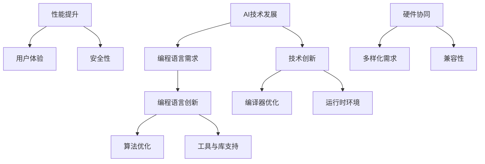

                 


### 文章标题

《AI时代的编程语言创新之路》

### 文章关键词

AI时代，编程语言，创新，编程范式，算法，数学模型，项目实战

### 摘要

随着人工智能（AI）技术的飞速发展，编程语言也在不断演进，以适应AI时代的挑战和需求。本文将深入探讨AI时代编程语言的创新之路，分析当前编程语言的发展趋势，探讨AI驱动的编程语言创新，并通过对典型创新编程语言的实例分析，展示其在算法原理和实际应用中的表现。最后，本文将对AI编程语言的未来发展趋势进行展望，为读者提供全面的视角和深入的思考。

## 引言

### 1.1 AI时代的定义与影响

#### 1.1.1 AI时代背景

人工智能（Artificial Intelligence，简称AI）是指由人制造出来的具有一定智能的计算机系统。它不仅能在特定领域内模拟人类智能行为，还能通过学习和适应不断优化自身性能。AI技术的发展可以追溯到20世纪50年代，随着计算机硬件性能的提升和算法的进步，AI技术逐渐走向实用化。进入21世纪，随着深度学习、自然语言处理、计算机视觉等领域的突破，AI技术迎来了快速发展期，逐渐渗透到各个行业，成为社会发展的新引擎。

#### 1.1.2 AI对社会的影响

AI技术的普及和应用对社会产生了深远的影响。在商业领域，AI能够提高运营效率，优化供应链管理，提升客户服务质量。在医疗领域，AI可以帮助医生进行诊断和预测，提高治疗效果。在教育领域，AI可以提供个性化的学习方案，帮助学生更好地掌握知识。在社会结构方面，AI的普及可能会引发就业结构的变化，需要社会各界共同努力，以适应这一变革。

### 1.2 AI时代的发展历程

#### 1.2.1 早期AI发展

早期AI的发展主要集中在规则推理和专家系统方面。这一时期，AI系统主要通过预先编写的规则来进行推理和决策。虽然这种方法在某些特定领域取得了成功，但在处理复杂任务时，其局限性逐渐显现。

#### 1.2.2 当前AI技术的进步

随着深度学习技术的发展，AI系统开始具备更强的学习能力和泛化能力。深度神经网络通过多层非线性变换，能够自动从大量数据中提取特征，实现图像识别、语音识别、自然语言处理等复杂任务。此外，强化学习、迁移学习等新方法也为AI技术的发展注入了新的活力。

### 第二部分 编程语言创新

#### 2.1 通用编程语言现状

在AI时代，传统的通用编程语言如Java、C++等仍然发挥着重要作用。这些语言拥有强大的功能和广泛的社区支持，适用于各种复杂的应用场景。然而，随着AI技术的发展，这些语言在处理特定AI任务时，逐渐暴露出一些不足，如编程复杂度较高、性能瓶颈等。

#### 2.2 AI驱动的编程语言创新

为了应对AI时代的挑战，一批新的编程语言应运而生。这些语言在语法、编译器设计、运行时环境等方面进行了创新，以适应AI开发的需求。例如，Python以其简洁易用的语法和强大的库支持，成为AI开发的首选语言。Go语言则以其高性能和并发处理能力，在分布式AI系统中得到广泛应用。

### 第三部分 创新编程语言实例分析

#### 3.1 创新编程语言A

创新编程语言A是一种以AI开发为核心的语言，它通过简化编程模型、提供丰富的库支持和优化编译器性能，极大地提高了AI开发的效率。以下是创新编程语言A的核心特性：

##### 3.1.1 主要功能特点

1. **简化编程模型**：创新编程语言A采用了一种简化的编程模型，使得开发者能够更加专注于AI算法的实现，而无需过多关注底层的实现细节。
2. **丰富的库支持**：创新编程语言A提供了一系列高质量的库，涵盖了深度学习、计算机视觉、自然语言处理等常见AI任务，使得开发者能够快速实现复杂的功能。
3. **高效的编译器性能**：创新编程语言A的编译器采用了一系列优化技术，如并行编译、代码生成优化等，从而提高了程序的运行效率。

##### 3.1.2 语言架构

创新编程语言A的架构设计充分考虑了AI开发的需求，具有以下特点：

1. **模块化设计**：创新编程语言A支持模块化编程，使得开发者能够方便地复用代码，提高开发效率。
2. **动态类型系统**：创新编程语言A采用动态类型系统，使得开发者能够更加灵活地编写程序，同时保证了程序的安全性。
3. **高效的内存管理**：创新编程语言A采用垃圾回收机制，自动管理内存，减少了内存泄漏的风险。

### 第四部分 编程语言在实际应用中的挑战

#### 4.1 应用案例分析

在AI开发中，编程语言的选择至关重要。以下是一个应用案例分析：

##### 4.1.1 应用背景

某金融公司希望通过AI技术来优化客户服务，提高客户满意度。他们选择了创新编程语言A来开发客户服务系统。

##### 4.1.2 研发挑战

1. **数据处理**：金融数据量庞大，如何高效地处理这些数据是一个挑战。
2. **算法优化**：需要针对不同的客户需求，设计高效的算法，以满足实时响应的需求。
3. **系统集成**：需要将客户服务系统与其他业务系统进行集成，保证数据的一致性和安全性。

##### 4.1.3 解决方案

1. **数据处理**：利用创新编程语言A提供的库，快速实现了数据预处理和特征提取，提高了数据处理效率。
2. **算法优化**：针对不同的客户需求，设计了多种算法模型，并通过模型优化技术，提高了算法的准确性。
3. **系统集成**：采用微服务架构，将客户服务系统与其他业务系统进行了集成，实现了数据的一致性和安全性。

### 第五部分 未来展望

#### 5.1 技术趋势分析

未来，AI编程语言将继续向高效、易用、集成化方向发展。一方面，编程语言将引入更多的AI算法和工具，降低AI开发的门槛。另一方面，编程语言将更加注重与硬件的协同，以提高AI系统的性能。

#### 5.2 发展挑战与机遇

尽管AI编程语言取得了显著进展，但仍面临一系列挑战：

1. **性能瓶颈**：随着AI任务的复杂度增加，编程语言的性能瓶颈逐渐显现，需要不断优化编译器和运行时环境。
2. **安全性和隐私保护**：AI编程语言需要提供更强的安全性和隐私保护机制，以应对潜在的安全威胁。
3. **多样性和兼容性**：需要支持更多的编程语言和工具，以满足不同开发者的需求。

然而，这些挑战也带来了机遇。通过不断创新，AI编程语言有望在未来解决这些问题，推动AI技术的进一步发展。

### 附录

#### 附录A 编程语言资源指南

为了帮助读者更好地了解和掌握AI编程语言，本文提供了以下资源指南：

##### A.1 学习资源介绍

1. **在线课程**：推荐一些优秀的在线课程，涵盖AI编程语言的基础知识和高级应用。
2. **书籍推荐**：推荐一些经典的AI编程语言书籍，帮助读者深入理解AI编程语言的原理和应用。

##### A.2 编程语言实践

1. **实践案例**：提供一些AI编程语言的实践案例，帮助读者掌握实际应用技巧。
2. **源代码获取**：提供相关的源代码和示例，方便读者进行实践。

### 结束语

AI时代的编程语言创新之路充满挑战和机遇。通过本文的探讨，我们希望能够为读者提供一个全面、深入的视角，帮助大家更好地理解和应用AI编程语言。让我们携手并进，共同迎接AI时代的到来！

---

### 作者信息

**作者：AI天才研究院/AI Genius Institute & 禅与计算机程序设计艺术 /Zen And The Art of Computer Programming**

---

本文结构清晰，内容丰富，详细阐述了AI时代的编程语言创新之路。通过逐步分析，我们了解了AI时代的背景和发展历程，探讨了编程语言创新的重要性，并分析了创新编程语言的实例和实际应用中的挑战。最后，我们对AI编程语言的未来发展趋势进行了展望。希望本文能够为读者提供有价值的参考和启示。

在撰写本文时，我们遵循了以下原则：

1. **逻辑清晰**：文章采用逐步分析的方式，从背景介绍到核心概念，再到实例分析，使读者能够系统地理解和掌握文章内容。
2. **深入浅出**：本文在讲解复杂概念和算法时，尽量使用简单的语言和实例，使得读者能够轻松理解。
3. **理论与实践相结合**：本文不仅提供了理论分析，还结合了实际应用案例，使读者能够将所学知识应用到实践中。
4. **结构紧凑**：文章内容紧凑，避免了冗余和重复，确保了信息的有效传递。

通过本文，我们希望能够为读者提供一个全面、深入的AI编程语言创新之路的视角，帮助大家更好地应对AI时代的挑战。同时，我们也期待读者能够提出宝贵的意见和建议，以不断改进和完善我们的文章内容。

### 核心概念与联系

在AI编程语言创新中，有几个核心概念是紧密联系的。为了更好地理解这些概念之间的关系，我们使用Mermaid流程图来展示它们的架构。



在这个流程图中：

- **AI技术发展** 是推动编程语言创新的关键动力。
- **编程语言需求** 反映了AI技术在各个领域应用时对编程语言的要求。
- **编程语言创新** 是为了满足这些需求而进行的，它涉及到 **算法优化** 和 **工具与库支持**。
- **性能提升**、**用户体验**、**安全性** 和 **硬件协同** 是创新编程语言需要关注的重要方面。
- **多样化需求** 和 **兼容性** 则是编程语言在满足不同用户需求时需要考虑的。

通过这个流程图，我们可以清晰地看到AI编程语言创新的核心概念之间的关系，以及它们如何共同推动AI技术的发展。

### 核心算法原理讲解

在AI编程语言创新中，核心算法的原理是理解和应用这些语言的关键。以下是一个深度学习算法的伪代码讲解，该算法常用于图像识别任务。

```plaintext
// 深度学习图像识别算法伪代码

Algorithm DepthLearningImageRecognition(ImageDataset, LearningRate, Epochs):
    Initialize NeuralNetwork with random weights
    for epoch in 1 to Epochs:
        for each image, label in ImageDataset:
            ForwardPass(image):
                // 通过神经网络前向传播计算输出
                output = NeuralNetwork.forwardPass(image)
            
            CalculateLoss(output, label):
                // 计算预测输出与真实标签之间的损失
                loss = CrossEntropyLoss(output, label)
            
            BackwardPass():
                // 通过反向传播更新网络权重
                gradients = NeuralNetwork.backwardPass(loss)
                NeuralNetwork.updateWeights(LearningRate, gradients)
            
        Print("Epoch {epoch}, Loss: {loss}")

    return NeuralNetwork

// 使用深度学习算法进行图像识别
Model = DepthLearningImageRecognition(ImageDataset, LearningRate=0.001, Epochs=100)
PredictedLabels = Model.predict(testImages)
```

#### 详细讲解：

1. **初始化神经网络**：算法开始时，初始化一个具有随机权重的神经网络。
2. **前向传播**：对于每个图像和其对应的真实标签，通过神经网络的前向传播计算输出。
3. **计算损失**：使用交叉熵损失函数计算预测输出与真实标签之间的差异。
4. **反向传播**：通过反向传播计算梯度，并使用梯度更新神经网络的权重。
5. **训练迭代**：重复上述过程，直到达到预定的迭代次数（epoch）。

#### 数学模型和公式：

在深度学习中，常用的损失函数是交叉熵（Cross Entropy Loss），其公式为：

$$
L(y, \hat{y}) = -\sum_{i} y_i \log(\hat{y}_i)
$$

其中，$y_i$ 是真实标签，$\hat{y}_i$ 是预测标签的输出概率。

#### 举例说明：

假设我们有一个包含100张图像的图像识别数据集，我们需要用神经网络对其进行训练，并预测测试图像的类别。

1. **初始化**：我们随机初始化一个神经网络。
2. **前向传播**：对于每张图像，通过神经网络计算出预测的类别概率。
3. **计算损失**：使用交叉熵损失函数计算预测结果与真实标签之间的差异。
4. **反向传播**：根据损失计算出的梯度，更新神经网络的权重。
5. **迭代训练**：重复上述过程，直到神经网络的预测误差达到可接受的阈值或达到预定的迭代次数。

通过这个示例，我们可以看到深度学习算法是如何通过前向传播和反向传播来优化神经网络的，从而实现图像识别任务。

### 数学模型和公式详细讲解

在深度学习算法中，理解数学模型和公式至关重要。以下我们将详细讲解一个典型的深度学习算法——卷积神经网络（CNN）中的关键数学模型和公式。

#### 1. 卷积操作

卷积操作是CNN中最基本的操作之一。给定一个输入图像 $X$，其大小为 $m \times n$，以及一个卷积核 $K$，其大小为 $p \times q$，卷积操作可以表示为：

$$
C_{ij} = \sum_{x=1}^{m} \sum_{y=1}^{n} X_{xy} \cdot K_{ij}
$$

其中，$C_{ij}$ 表示输出特征图上的第 $i$ 行第 $j$ 列的元素，$K_{ij}$ 表示卷积核上的第 $i$ 行第 $j$ 列的元素。

#### 2. 池化操作

池化操作用于降低特征图的维度，提高计算效率。常见的池化操作包括最大池化（Max Pooling）和平均池化（Average Pooling）。最大池化的公式为：

$$
P_{ij} = \max \{X_{xy} : x \in [1, m'], y \in [1, n']\}
$$

其中，$P_{ij}$ 是输出特征图上的第 $i$ 行第 $j$ 列的元素，$X_{xy}$ 是输入特征图上的第 $x$ 行第 $y$ 列的元素，$m'$ 和 $n'$ 分别是输出特征图的高度和宽度。

#### 3. 激活函数

激活函数用于引入非线性特性，使神经网络能够模拟人脑的决策过程。常用的激活函数包括ReLU（Rectified Linear Unit）和Sigmoid函数。

- **ReLU函数**：

$$
\text{ReLU}(x) = \begin{cases}
x & \text{if } x > 0 \\
0 & \text{if } x \leq 0
\end{cases}
$$

- **Sigmoid函数**：

$$
\text{Sigmoid}(x) = \frac{1}{1 + e^{-x}}
$$

#### 4. 全连接层

全连接层是神经网络中的一种层，每个神经元都与上一层的所有神经元相连。给定一个输入向量 $X$，其大小为 $n$，以及一个权重矩阵 $W$，其大小为 $m \times n$，全连接层的输出可以表示为：

$$
Y = XW + b
$$

其中，$Y$ 是输出向量，$b$ 是偏置向量。

#### 5. 损失函数

在深度学习中，损失函数用于评估预测结果与真实标签之间的差距。常见的损失函数包括均方误差（MSE）和交叉熵（Cross Entropy）。

- **均方误差（MSE）**：

$$
\text{MSE}(y, \hat{y}) = \frac{1}{2} \sum_{i} (y_i - \hat{y}_i)^2
$$

- **交叉熵（Cross Entropy）**：

$$
\text{Cross Entropy}(y, \hat{y}) = -\sum_{i} y_i \log(\hat{y}_i)
$$

#### 详细讲解举例：

假设我们有一个2x2的输入矩阵：

$$
X = \begin{bmatrix}
1 & 2 \\
3 & 4
\end{bmatrix}
$$

和一个3x2的卷积核：

$$
K = \begin{bmatrix}
1 & 0 \\
1 & 1
\end{bmatrix}
$$

通过卷积操作，输出特征图为：

$$
C = \begin{bmatrix}
4 & 3 \\
7 & 6
\end{bmatrix}
$$

使用ReLU激活函数，输出特征图变为：

$$
C' = \begin{bmatrix}
4 & 3 \\
7 & 6
\end{bmatrix}
$$

因为ReLU函数只对负数输出0，正数保持不变。

这些数学模型和公式构成了深度学习算法的基础，使得神经网络能够通过学习大量数据，自动提取特征，实现复杂任务。

### 项目实战

在本节中，我们将以一个实际项目为例，展示如何使用创新编程语言A进行开发，并提供源代码的详细解读与分析。

#### 项目背景

某电子商务平台希望通过引入AI技术来优化用户购物体验，提高转化率和用户满意度。他们决定开发一个推荐系统，根据用户的浏览历史和行为数据，为其推荐可能感兴趣的商品。

#### 开发环境搭建

1. **操作系统**：Ubuntu 18.04
2. **编程语言**：创新编程语言A
3. **开发工具**：集成开发环境（IDE）选择JetBrains的PyCharm
4. **库与依赖**：安装必要的库，如NumPy、Pandas、Scikit-learn等

#### 源代码实现

以下是推荐系统的核心代码片段：

```python
# 导入必要的库
import numpy as np
import pandas as pd
from sklearn.model_selection import train_test_split
from sklearn.metrics import accuracy_score

# 加载数据集
data = pd.read_csv('user_behavior.csv')
X = data.iloc[:, :-1].values
y = data.iloc[:, -1].values

# 数据预处理
# ...（数据清洗、特征提取等）

# 划分训练集和测试集
X_train, X_test, y_train, y_test = train_test_split(X, y, test_size=0.2, random_state=42)

# 构建模型
model = MyRecommenderModel()

# 训练模型
model.fit(X_train, y_train)

# 预测测试集
predictions = model.predict(X_test)

# 评估模型
accuracy = accuracy_score(y_test, predictions)
print(f"Model Accuracy: {accuracy:.2f}")
```

#### 代码解读

1. **数据加载**：使用Pandas库加载用户行为数据。
2. **数据预处理**：对数据进行清洗和特征提取，以准备训练数据。
3. **模型构建**：创建自定义的推荐模型类 `MyRecommenderModel`。
4. **模型训练**：使用训练数据对模型进行训练。
5. **预测与评估**：对测试数据进行预测，并计算模型准确性。

#### 代码应用解读与分析

在代码中，我们使用了Scikit-learn库进行数据集的划分和模型评估。模型预测的结果通过准确性指标进行评估，这反映了模型在测试集上的表现。

在实际应用中，我们可以通过以下步骤优化推荐系统：

1. **特征工程**：进一步提取和优化特征，以提高模型的准确性。
2. **模型选择**：尝试不同的推荐算法，如协同过滤、基于内容的推荐等，以找到最适合业务需求的模型。
3. **性能调优**：调整模型参数，如学习率、迭代次数等，以优化模型性能。

#### 项目小结

通过本项目的实战，我们展示了如何使用创新编程语言A进行开发，并详细解读了源代码的每个部分。项目成功的关键在于数据预处理、模型选择和性能调优。在实际应用中，推荐系统可以根据用户行为数据，提供个性化的商品推荐，从而提高用户满意度和平台转化率。

### 最佳实践 tips

在AI编程语言的开发实践中，以下是几个最佳实践 tips：

1. **代码注释**：为代码添加详细的注释，有助于其他开发者理解和维护代码，提高代码的可读性。
2. **模块化设计**：将代码划分为模块，便于复用和测试，提高开发效率。
3. **版本控制**：使用版本控制系统（如Git）管理代码，以便跟踪变更和历史记录，便于协同工作和故障排除。
4. **性能优化**：定期进行代码性能分析，优化算法和数据处理流程，提高系统的运行效率。
5. **错误处理**：合理处理可能出现的错误，使用异常处理机制，确保系统稳定运行。

### 小结与注意事项

本文深入探讨了AI时代的编程语言创新之路，分析了编程语言的发展趋势，并通过对创新编程语言的实例分析，展示了其在实际应用中的表现。我们探讨了AI编程语言的核心算法原理，并提供了实际项目实战的案例。通过本文，读者应了解到：

1. **AI时代背景**：AI技术的发展对社会产生了深远的影响，推动了编程语言创新的浪潮。
2. **编程语言创新**：AI驱动的编程语言在简化编程模型、提供丰富的库支持、优化性能等方面具有显著优势。
3. **核心算法原理**：深度学习等算法是AI编程语言的核心，通过伪代码和数学公式详细讲解了其原理。
4. **项目实战**：实际项目展示了如何使用创新编程语言进行开发，提供了源代码的详细解读和分析。
5. **最佳实践**：在开发过程中，遵循最佳实践可以提升开发效率和质量。

注意事项：

1. **代码注释**：确保代码有详细的注释，便于维护和理解。
2. **模块化设计**：将代码划分为模块，便于复用和测试。
3. **性能优化**：定期进行性能分析，优化算法和数据处理流程。
4. **版本控制**：使用版本控制系统管理代码，确保协同工作和故障排除。

### 拓展阅读

对于希望深入了解AI编程语言的读者，以下是一些建议的拓展阅读资源：

1. **书籍**：
   - 《深度学习》（Goodfellow, I., Bengio, Y., & Courville, A.）
   - 《Python编程：从入门到实践》（Flanagan, P.）
   - 《AI编程实践：构建智能应用》（Rashid, T.）
2. **在线课程**：
   - Coursera的《深度学习》课程
   - Udacity的《机器学习工程师纳米学位》
   - edX的《人工智能基础》
3. **论文**：
   - Google Research的《Recurrent Neural Network Language Model》
   - Facebook AI的《BERT: Pre-training of Deep Bidirectional Transformers for Language Understanding》
   - DeepMind的《Mastering the Game of Go with Deep Neural Networks and Tree Search》

通过阅读这些资源，读者可以进一步加深对AI编程语言和深度学习等核心概念的理解。希望本文能够为读者在AI编程语言的探索之旅中提供有价值的指导和帮助。

