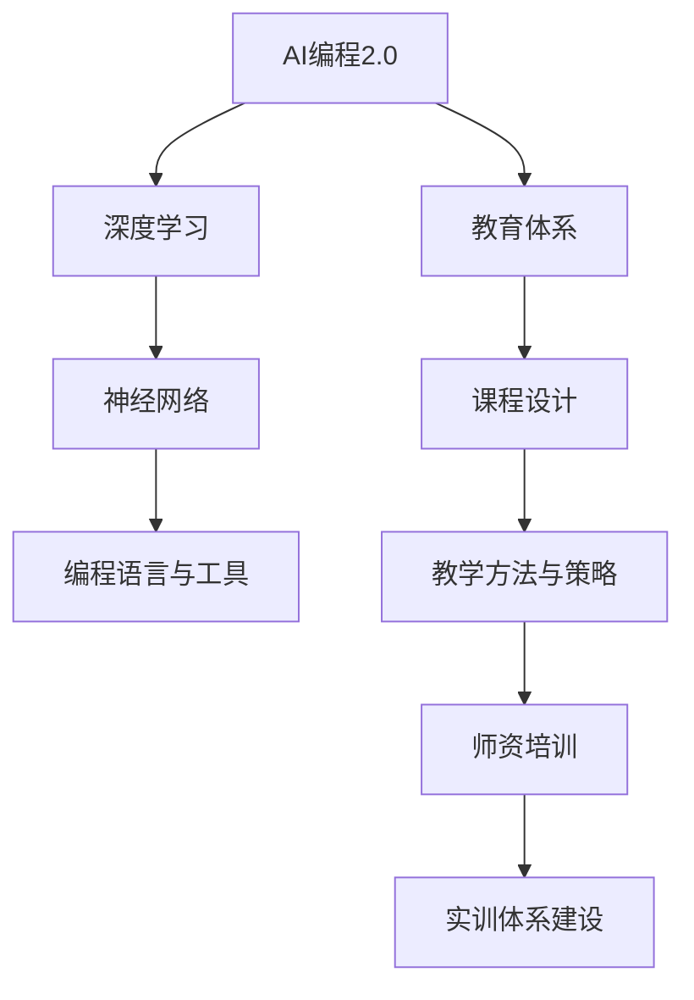

                 

# 《AI编程2.0的教育与培训体系构建》

## 关键词

- AI编程2.0
- 教育与培训
- 课程设计
- 教学资源
- 师资培训
- 实训体系建设

## 摘要

随着人工智能技术的飞速发展，AI编程2.0时代已然来临。本文旨在探讨AI编程2.0的教育与培训体系构建，从背景概述、核心概念、教育体系构建、教学资源开发、师资培训以及实训体系建设六个方面展开，为AI编程2.0时代的教育与实践提供理论指导和实践案例。

## 目录大纲

### 第一部分: AI编程2.0概述

#### 第1章: AI编程2.0时代背景及定义

##### 1.1 AI编程1.0到AI编程2.0的演进

##### 1.2 AI编程2.0的特点

##### 1.3 AI编程2.0与教育、培训的联系

#### 第2章: AI编程2.0核心概念

##### 2.1 机器学习与深度学习基础

##### 2.2 神经网络架构

##### 2.3 编程语言与工具

### 第二部分: AI编程2.0教育体系构建

#### 第3章: AI编程2.0课程设计

##### 3.1 教学目标与内容规划

##### 3.2 教学方法与策略

##### 3.3 课程实例介绍

#### 第4章: AI编程2.0教学资源开发

##### 4.1 教学材料设计与制作

##### 4.2 在线学习平台搭建

##### 4.3 教学资源共享与传播

#### 第5章: AI编程2.0师资培训

##### 5.1 师资队伍培养计划

##### 5.2 教师教学能力提升策略

##### 5.3 师资培训案例分享

### 第三部分: AI编程2.0培训体系构建

#### 第6章: 企业AI培训需求分析

##### 6.1 企业AI人才需求

##### 6.2 企业AI培训策略

##### 6.3 企业AI培训项目实例

#### 第7章: AI编程2.0实训体系建设

##### 7.1 实训项目设计与实施

##### 7.2 实训基地建设与管理

##### 7.3 实训成果评估与反馈

## 核心概念与联系

### Mermaid流程图

### 核心算法原理讲解

#### 2.1 机器学习与深度学习基础

##### 2.1.1 机器学习基本概念

- 机器学习（Machine Learning）是一门人工智能（Artificial Intelligence, AI）的分支，主要研究如何从数据中学习规律，并利用这些规律进行预测或决策。

- 机器学习的基本概念包括：模型（Model）、数据集（Dataset）、特征（Feature）、目标（Target）、评估指标（Evaluation Metric）等。

##### 2.1.2 深度学习基本原理

- 深度学习（Deep Learning）是机器学习的一种方法，其核心思想是通过多层神经网络来模拟人类大脑的学习过程。

- 深度学习的基本结构包括：输入层（Input Layer）、隐藏层（Hidden Layer）和输出层（Output Layer）。

- 常用的深度学习算法包括：反向传播算法（Backpropagation Algorithm）、卷积神经网络（Convolutional Neural Network, CNN）和循环神经网络（Recurrent Neural Network, RNN）等。

##### 2.1.3 深度学习优化算法

- 深度学习模型的优化过程主要涉及：损失函数（Loss Function）、优化器（Optimizer）和正则化（Regularization）。

- 常见的优化器包括：随机梯度下降（Stochastic Gradient Descent, SGD）、Adam优化器等。

- 正则化方法包括：L1正则化、L2正则化和Dropout等。

### 2.2 神经网络架构

- 神经网络（Neural Network）是一种模仿生物神经网络的结构和功能的计算模型。

- 神经网络的基本组成部分包括：神经元（Neuron）、层（Layer）和连接（Connection）。

- 神经网络可以分为前向传播（Forward Propagation）和反向传播（Back Propagation）两个阶段。

### 2.3 编程语言与工具

- AI编程2.0时代，常用的编程语言包括Python、C++和Java等。

- 常用的深度学习框架包括TensorFlow、PyTorch和Keras等。

- 编程工具还包括集成开发环境（IDE）、代码编辑器和版本控制系统等。

### 3.1 深度学习数学基础

##### 3.1.1 矩阵运算

- 矩阵运算包括矩阵加法、矩阵乘法、矩阵转置等。

- 矩阵乘法的公式为：$$ C = A \cdot B $$，其中A和B是两个矩阵，C是它们的乘积。

##### 3.1.2 激活函数

- 激活函数是神经网络中的一个关键组成部分，用于引入非线性特性。

- 常见的激活函数包括：sigmoid函数、ReLU函数、Tanh函数等。

- 以ReLU函数为例，其公式为：$$ f(x) = \max(0, x) $$。

##### 3.1.3 损失函数

- 损失函数用于衡量模型预测值与真实值之间的差距。

- 常见的损失函数包括：均方误差（Mean Squared Error, MSE）、交叉熵（Cross-Entropy）等。

- 以均方误差为例，其公式为：$$ Loss = \frac{1}{2} \sum_{i=1}^{n} (y_i - \hat{y}_i)^2 $$，其中$y_i$为真实值，$\hat{y}_i$为预测值。

##### 3.1.4 优化器

- 优化器用于调整模型参数，以减小损失函数。

- 常见的优化器包括：随机梯度下降（SGD）、Adam等。

- 以Adam优化器为例，其公式为：

  $$ \alpha = \frac{1}{1 - \beta_1} $$
  
  $$ \beta_2 = \frac{1}{1 - \beta_2} $$
  
  $$ \theta = \theta - \alpha \frac{\partial Loss}{\partial \theta} $$
  
  其中，$\alpha$为学习率，$\beta_1$和$\beta_2$为Adam优化器的超参数。

## 4.1 编程语言与工具

### Python

- Python是一种高级编程语言，具有简洁易读的语法，广泛应用于人工智能领域。

- Python的主要优势包括：丰富的库和框架、强大的社区支持、高效的开发效率等。

### TensorFlow

- TensorFlow是一个开源的深度学习框架，由Google开发。

- TensorFlow提供丰富的API，支持多种深度学习模型的构建和训练。

### PyTorch

- PyTorch是一个开源的深度学习框架，由Facebook开发。

- PyTorch的主要优势包括：动态计算图、简洁易用的接口、强大的GPU支持等。

### Keras

- Keras是一个高级深度学习框架，可以在TensorFlow和PyTorch之上运行。

- Keras提供简洁易用的接口，方便构建和训练深度学习模型。

### Jupyter Notebook

- Jupyter Notebook是一种交互式的计算环境，广泛应用于数据科学和人工智能领域。

- Jupyter Notebook支持多种编程语言，包括Python、R、Julia等。

## 4.2 教学资源开发

### 教学材料设计与制作

- 教学材料应包括教材、讲义、课件、实验手册等。

- 教学材料的设计与制作应注重知识体系的完整性、逻辑性和实用性。

### 在线学习平台搭建

- 在线学习平台应包括课程资源、学习进度管理、在线作业与测试等功能。

- 在线学习平台的搭建应考虑用户体验、内容更新和维护等因素。

### 教学资源共享与传播

- 教学资源应通过在线学习平台、社交媒体、学术会议等多种渠道进行共享和传播。

- 教学资源共享与传播有助于提升教学质量、扩大教育影响力。

## 5.1 师资队伍培养计划

- 师资队伍培养计划应包括培训内容、培训方式、培训周期等。

- 培训内容应涵盖最新的AI编程2.0技术、教学方法与策略等。

- 培训方式应包括线上培训、线下培训、研讨会、学术交流等。

- 培训周期应根据实际情况制定，确保教师能够持续提升教学能力。

## 5.2 教师教学能力提升策略

- 教师教学能力提升策略应包括教学技能培训、教学资源建设、教学评价与反馈等。

- 教学技能培训应注重教学方法、课堂管理、教学设计等方面的能力提升。

- 教学资源建设应注重课程资源、实验资源、教学工具等的开发与整合。

- 教学评价与反馈应注重教学质量的持续改进，促进教师教学能力的提升。

## 5.3 师资培训案例分享

### 案例一：高校师资培训计划

- 培训目标：提升教师对AI编程2.0技术的理解和应用能力。

- 培训内容：深度学习基础、神经网络架构、编程语言与工具等。

- 培训方式：线上培训、线下培训相结合。

- 培训周期：6个月。

### 案例二：企业内部师资培训计划

- 培训目标：提升企业内部教师的教学能力和项目实践经验。

- 培训内容：项目实战、教学方法与策略、教学资源建设等。

- 培训方式：内部培训、外部交流相结合。

- 培训周期：3个月。

## 6.1 企业AI培训需求分析

### 企业AI人才需求

- 企业AI人才需求应包括算法工程师、数据科学家、产品经理、技术支持等。

- 企业AI人才需求应根据企业发展阶段、业务领域和战略目标进行调整。

### 企业AI培训策略

- 企业AI培训策略应包括内部培训、外部培训、项目实践等。

- 企业AI培训策略应注重理论与实践相结合，提升员工技能和团队协作能力。

### 企业AI培训项目实例

- 项目背景：某企业希望提升其AI团队的技术能力和项目实践经验。

- 项目目标：提升算法工程师的深度学习应用能力，提高数据科学家的数据分析与建模能力。

- 项目实施：开展内部培训、组织项目实战、邀请外部专家进行讲座等。

- 项目效果：员工技术能力显著提升，项目完成质量提高，企业竞争力增强。

## 7.1 实训项目设计与实施

### 实训项目设计

- 实训项目设计应包括项目目标、项目内容、项目流程、项目评估等。

- 实训项目设计应注重理论与实践相结合，提高学生的实际操作能力。

### 实训项目实施

- 实训项目实施应包括项目启动、项目执行、项目总结等。

- 实训项目实施应注重团队协作、问题解决和实际应用。

### 实训项目评估

- 实训项目评估应包括过程评估和结果评估。

- 实训项目评估应注重学生能力的提升和项目质量的改进。

## 7.2 实训基地建设与管理

### 实训基地建设

- 实训基地建设应包括硬件设施、软件环境、实验室建设等。

- 实训基地建设应注重先进性、实用性和可扩展性。

### 实训基地管理

- 实训基地管理应包括人员管理、设备管理、安全管理等。

- 实训基地管理应注重高效运行、资源共享和持续改进。

### 实训基地案例

- 案例一：某高校AI实训基地建设

  - 硬件设施：高性能服务器、GPU设备、智能硬件等。

  - 软件环境：深度学习框架、编程工具、数据库系统等。

  - 实验室建设：划分为多个功能区域，如算法开发区、数据分析区、产品测试区等。

- 案例二：某企业AI实训基地建设

  - 硬件设施：高性能计算集群、数据中心、智能硬件等。

  - 软件环境：深度学习框架、云计算平台、物联网系统等。

  - 实验室建设：划分为研发区、测试区、培训区等。

## 7.3 实训成果评估与反馈

### 实训成果评估

- 实训成果评估应包括过程评估和结果评估。

- 实训成果评估应注重学生能力的提升、项目质量的改进和基地管理水平的提高。

### 实训成果反馈

- 实训成果反馈应包括学生反馈、教师反馈、基地管理反馈等。

- 实训成果反馈应注重发现问题和改进措施，促进实训基地的持续发展。

## 附录

### 附录A: AI编程2.0相关资源与工具

#### A.1 编程语言与框架

- Python
- TensorFlow
- PyTorch
- Keras

#### A.2 数据集与库

- Kaggle
- TensorFlow Datasets
- PyTorch Datasets
- Scikit-learn

#### A.3 在线学习平台与社区

- Coursera
- edX
- Udacity
- Kaggle
- Stack Overflow

### 附录B: AI编程2.0教育与培训体系构建相关文献

- Goodfellow, I., Bengio, Y., & Courville, A. (2016). *Deep Learning*. MIT Press.
- Ng, A. Y. (2013). *Machine Learning Yearning*. Leanpub.
- Russell, S., & Norvig, P. (2016). *Artificial Intelligence: A Modern Approach*. Prentice Hall.
- Mitchell, T. M. (1997). *Machine Learning*. McGraw-Hill.

### 附录C: AI编程2.0教育与培训体系构建最佳实践

- 制定明确的教学目标和教学内容。
- 采用多样化的教学方法和策略。
- 强化师资培训和教学资源建设。
- 关注实训体系建设，提升学生实践能力。
- 建立完善的评估和反馈机制。

### 附录D: AI编程2.0教育与培训体系构建注意事项

- 跟踪前沿技术发展，及时更新教学内容。
- 融入行业实践，注重学生实际操作能力培养。
- 加强校企合作，拓宽学生就业渠道。
- 关注学生心理健康，提供个性化辅导和支持。
- 营造良好的学术氛围，激发学生创新精神。

### 附录E: AI编程2.0教育与培训体系构建拓展阅读

- 关注国内外知名大学和科研机构的AI编程2.0课程设置和实践案例。
- 参考知名企业的人工智能培训项目和管理经验。
- 关注人工智能行业的发展和趋势，把握人才培养方向。
- 了解国际人工智能竞赛和学术会议，拓宽视野和交流渠道。

## 结束语

AI编程2.0时代已经来临，构建完善的教育与培训体系至关重要。本文从AI编程2.0概述、核心概念、教育体系构建、教学资源开发、师资培训和实训体系建设六个方面进行了深入探讨，为AI编程2.0时代的教育与实践提供了理论指导和实践案例。希望本文能够为教育工作者、培训机构和相关从业者提供有益的参考。

### 作者信息

作者：AI天才研究院/AI Genius Institute & 禅与计算机程序设计艺术/Zen And The Art of Computer Programming

