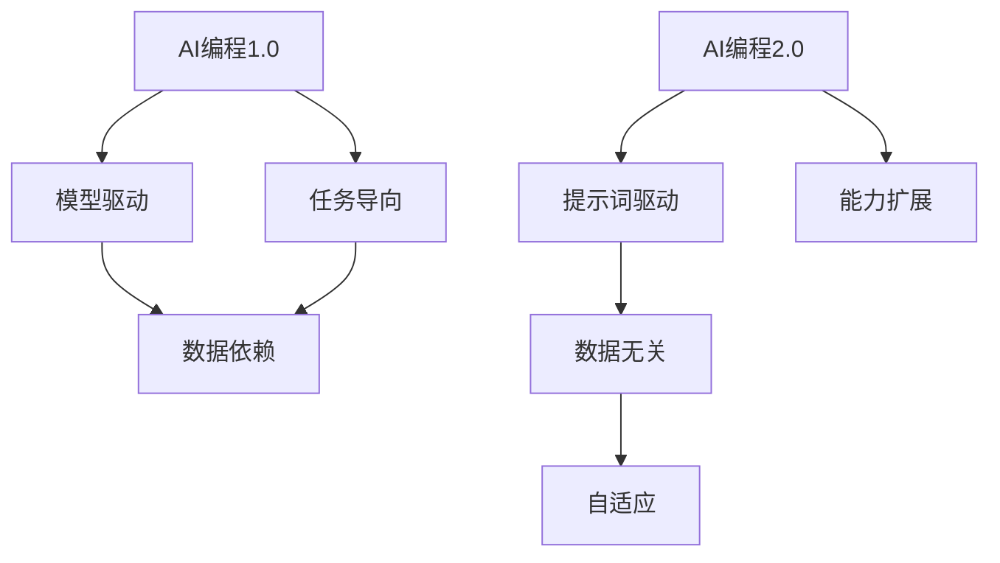
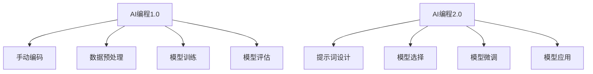
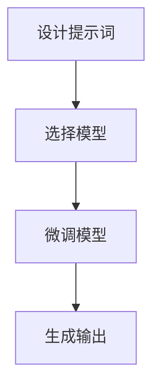

                 

### 引言

AI编程2.0：提示词驱动开发，标志着人工智能编程的新时代。在这一时代，开发者不再只是被动地编写代码来训练模型，而是通过提供提示词来指导AI系统自主学习和优化。这种全新的开发模式不仅提高了开发效率，还赋予了AI系统更高的自适应能力和灵活性。本文将深入探讨AI编程2.0的核心概念、原理、开发流程以及应用场景，旨在为读者提供一次全面的技术体验。

首先，我们需要明确AI编程2.0的定义和特点。AI编程1.0以模型驱动为主，依赖于大量数据来训练模型，而AI编程2.0则强调提示词驱动，使得AI系统能够根据提示词进行自主学习和优化。这种转变不仅解决了传统模型驱动的数据依赖问题，还提升了AI系统的自适应能力和灵活性。

接下来，我们将详细解析提示词驱动的核心概念，包括提示词的类型、作用以及其在AI编程2.0中的重要性。通过理解这些概念，读者将能够更好地掌握提示词驱动的原理。

在理解了核心概念之后，我们将探讨AI编程2.0的开发流程。这包括开发环境搭建、编程基础、算法原理以及应用场景。通过这一部分的介绍，读者将能够掌握从零开始构建一个提示词驱动的AI系统的方法。

文章的第三部分将重点介绍具体的实战项目，包括智能问答系统、图像识别系统和个性化推荐系统。通过这些实战项目，读者将能够将所学知识应用到实际场景中，体验提示词驱动的强大威力。

最后，文章将总结AI编程2.0和提示词驱动的最佳实践，并提供一些注意事项和拓展阅读建议，帮助读者更好地理解和应用这一前沿技术。

总之，AI编程2.0：提示词驱动开发是一次革命性的技术革新，它不仅改变了传统的开发模式，还为AI系统带来了更高的效率和更强的学习能力。通过本文的深入探讨，读者将能够全面了解这一技术，并掌握其核心原理和应用方法。让我们一起进入AI编程2.0的时代，开启全新的编程之旅吧！

---

### 关键词

AI编程2.0、提示词驱动、开发模式、自适应学习、数据无关、智能问答、图像识别、个性化推荐。

---

### 摘要

本文深入探讨了AI编程2.0：提示词驱动开发的核心概念、原理和应用。通过介绍AI编程2.0的定义和特点，我们了解了提示词驱动的核心概念及其在AI编程中的应用。随后，文章详细解析了AI编程2.0的开发流程，包括开发环境搭建、编程基础、算法原理以及应用场景。文章还通过具体的实战项目，如智能问答系统、图像识别系统和个性化推荐系统，展示了如何将提示词驱动方法应用于实际开发中。最后，文章总结了提示词驱动的最佳实践，为读者提供了进一步学习和应用的指导。

---

## 第一部分：AI编程2.0基础

### 目录

- **第1章：AI编程2.0概述**
  - **1.1 AI编程2.0的定义与特点**
  - **1.2 AI编程2.0的起源与发展**
  - **1.3 AI编程2.0与传统AI编程的差异**

### 1.1 AI编程2.0的定义与特点

**核心概念与联系**

在传统的AI编程中，开发者主要依赖于机器学习算法来训练模型。这些模型通过大量数据来学习并识别特定模式，从而实现特定的任务。这种模式被称为模型驱动编程，其核心在于模型的设计和优化。

然而，随着AI技术的发展，尤其是生成式AI的出现，AI编程进入了2.0时代。AI编程2.0不再依赖于传统的模型驱动方式，而是通过提示词（prompts）来驱动AI系统进行学习和优化。提示词驱动的核心概念是，开发者不再需要提供具体的模型参数，而是通过自然语言描述的方式，向AI系统提供任务的目标和上下文信息。

以下是一个简单的Mermaid流程图，展示了AI编程1.0和AI编程2.0之间的核心概念联系：



**核心算法原理讲解**

在AI编程2.0中，提示词驱动的核心算法通常是基于大型语言模型（如GPT系列）的。这些模型通过大量的文本数据进行预训练，从而掌握了丰富的语言知识和上下文理解能力。当开发者提供提示词时，这些模型能够根据提示词生成相应的输出，从而完成特定的任务。

以下是一个简化的伪代码，展示了提示词驱动的基本流程：

```python
# 提示词驱动的伪代码

# 定义提示词
prompt = "请编写一篇关于人工智能未来的展望"

# 加载预训练的语言模型
model = load_pretrained_language_model()

# 使用提示词生成输出
output = model.generate_output(prompt)

# 输出结果
print(output)
```

**数学模型和公式**

在提示词驱动中，数学模型主要涉及语言模型的训练过程。例如，基于GPT系列的语言模型通常使用自回归语言模型（ARLM）来生成文本。以下是一个简化的自回归语言模型训练的数学模型：

$$
P(x_t | x_{t-1}, x_{t-2}, ..., x_1) = \frac{e^{<W_{t-1} x_t>}}{Z}
$$

其中，$P(x_t | x_{t-1}, x_{t-2}, ..., x_1)$ 表示在给定前一个词$x_{t-1}$，前前一个词$x_{t-2}$，...，第一个词$x_1$的情况下，生成当前词$x_t$的概率。$W_{t-1}$ 表示模型权重，$<W_{t-1} x_t>$ 表示权重和词向量的点积，$Z$ 是归一化常数，以确保概率分布的和为1。

**举例说明**

假设我们有一个简单的提示词：“请告诉我人工智能的未来”。通过大型语言模型，我们可以生成如下的输出：

```
人工智能的未来将会是一个充满机遇和挑战的时代。随着技术的不断进步，人工智能将在各行各业中发挥越来越重要的作用。它将帮助我们解决复杂问题，提高生产效率，改善生活质量。然而，人工智能的发展也将带来一系列社会和伦理问题，如隐私保护、就业替代等。因此，我们需要在推动技术发展的同时，重视这些问题的解决。
```

**项目实战**

在实际开发中，我们可以使用提示词驱动的技术来构建智能问答系统。以下是一个简单的实战项目示例：

**项目目标**：构建一个能够回答关于人工智能问题的智能问答系统。

**开发步骤**：
1. 选择一个合适的预训练语言模型，如GPT-3。
2. 准备问答数据集，包括问题和答案对。
3. 使用提示词驱动的方法，通过训练模型来生成回答。

```python
# 实现智能问答系统的伪代码

# 加载预训练语言模型
model = load_pretrained_language_model()

# 准备数据集
questions = ["什么是人工智能？", "人工智能有什么应用？", "人工智能的未来是什么？"]
answers = ["人工智能是一门研究如何使计算机来完成通常需要人类智能的任务的学科。", "人工智能广泛应用于医疗、金融、教育、交通等领域。", "人工智能的未来将是一个智能化、自动化的时代。"]

# 训练模型
for question, answer in zip(questions, answers):
    model.train(question, answer)

# 回答问题
def ask_question(question):
    return model.generate_output(question)

# 测试系统
print(ask_question("什么是人工智能？"))
```

**项目小结**：通过这个简单的实战项目，我们展示了如何使用提示词驱动的技术来构建一个智能问答系统。在实际应用中，我们可以进一步优化模型和系统，以提高问答的准确性和鲁棒性。

### 最佳实践 tips、小结、注意事项、拓展阅读

- **最佳实践**：在开发提示词驱动的系统时，确保选择合适的预训练语言模型，并准备充分的数据集进行训练。此外，定期更新和优化模型可以提高系统的性能和适应性。
- **小结**：AI编程2.0：提示词驱动开发是一种全新的开发模式，它通过提示词来驱动AI系统进行学习和优化，具有数据无关、自适应和高效的特点。
- **注意事项**：提示词驱动的开发需要强大的计算资源和良好的数据处理能力。在实际应用中，需要根据具体场景调整提示词和模型参数，以获得最佳效果。
- **拓展阅读**：《生成式AI：从基础到应用》（作者：李航）、《深度学习实战：基于Python的应用》（作者：Aurélien Géron》。

---

### 1.2 AI编程2.0的起源与发展

AI编程2.0的起源可以追溯到生成式AI的兴起。生成式AI的核心思想是通过生成模型来生成新的数据，而不是通过传统的方法来分类或回归。这一思想在自然语言处理、计算机视觉和其他领域取得了显著的成果。随着生成式AI技术的发展，人们开始探索如何利用生成式AI来驱动AI编程。

早期的研究主要集中在大型语言模型的训练和应用。例如，2018年，OpenAI发布了GPT-2，这是一个具有1.5亿参数的大型语言模型。GPT-2的发布引起了广泛关注，因为它展示了生成式AI在文本生成方面的强大能力。随后，OpenAI又发布了GPT-3，这是一个具有1750亿参数的超级模型。GPT-3的发布标志着AI编程2.0时代的到来，它不仅能够生成高质量的文本，还能够处理复杂的任务，如代码生成、图像描述等。

AI编程2.0的发展不仅依赖于生成式AI的技术进步，还依赖于提示词驱动的概念。提示词驱动的核心思想是，通过提供提示词来指导AI系统进行学习和优化。这种模式不仅简化了开发过程，还提高了AI系统的自适应能力。在传统AI编程中，开发者需要手动编写大量的代码来训练模型，而在AI编程2.0中，开发者只需要提供提示词，AI系统就能自动生成相应的模型。

随着AI编程2.0的发展，越来越多的研究者和开发者开始探索这一领域。他们通过不断优化模型、改进提示词设计和开发工具，推动了AI编程2.0的进步。例如，研究人员提出了许多新的语言模型架构，如Transformer、BERT等，这些架构在生成式AI中取得了显著的效果。同时，开发者还开发了多种工具和框架，如TensorFlow、PyTorch等，这些工具和框架为AI编程2.0的开发提供了便利。

AI编程2.0的发展也带来了许多新的应用场景。例如，在自然语言处理领域，AI编程2.0可以用于自动生成文章、代码、聊天机器人等；在计算机视觉领域，可以用于自动生成图像描述、图像编辑等；在音乐和艺术领域，可以用于自动生成音乐、艺术作品等。这些应用不仅展示了AI编程2.0的强大能力，也为开发者提供了丰富的创新空间。

总的来说，AI编程2.0的起源和发展是AI技术进步的必然结果。它不仅改变了传统的AI编程模式，还为AI系统带来了更高的自适应能力和灵活性。随着AI技术的不断进步，AI编程2.0有望在未来发挥更加重要的作用，推动人工智能的发展。

### 1.3 AI编程2.0与传统AI编程的差异

AI编程2.0与传统的AI编程（常称为AI编程1.0）在多个方面存在显著差异。这些差异不仅体现在开发方法和流程上，还涉及到数据处理、模型训练和应用场景等方面。

**开发方法与流程的差异**

在传统的AI编程1.0中，开发者需要手动编写代码来设计模型架构，选择合适的算法，并使用大量数据进行模型训练。这一过程通常包括以下步骤：

1. 数据收集：从各种来源收集相关数据，并进行预处理。
2. 模型设计：根据任务需求设计模型结构，选择算法。
3. 模型训练：使用预处理后的数据对模型进行训练。
4. 模型评估：评估模型的性能，并进行调整优化。

相比之下，AI编程2.0采用了提示词驱动的开发模式。在这种模式中，开发者不需要手动编写复杂的模型代码，而是通过提供提示词来指导AI系统进行学习和优化。以下是AI编程2.0的典型开发流程：

1. 提示词设计：根据任务需求，设计合适的提示词。
2. 模型选择：选择一个预训练的大型语言模型，如GPT系列。
3. 模型训练：使用提示词对预训练模型进行微调。
4. 模型应用：将训练好的模型应用于具体任务。

通过这种方式，AI编程2.0简化了开发流程，减少了手动编写代码的工作量，提高了开发效率。

**数据处理与模型训练的差异**

在传统AI编程1.0中，数据处理和模型训练是两个独立的阶段。首先，需要对大量数据进行预处理，如数据清洗、特征提取等。然后，使用预处理后的数据对模型进行训练。这一过程通常需要大量的计算资源和时间。

AI编程2.0则采用了不同的数据处理和模型训练方式。在AI编程2.0中，预训练的语言模型已经在大规模数据集上进行了训练，掌握了丰富的语言知识和上下文理解能力。开发者只需要提供提示词，AI系统就能够根据提示词生成相应的模型。这种模式大大减少了数据预处理和模型训练的工作量，同时也提高了数据处理和模型训练的效率。

**应用场景的差异**

传统AI编程1.0通常应用于需要高度定制化模型的任务，如医疗诊断、金融风险评估等。这些任务通常需要开发者深入理解业务场景，设计并训练专门的模型。

AI编程2.0则更适用于通用任务，如文本生成、代码生成、图像描述等。由于提示词驱动的模式，AI编程2.0能够快速适应各种不同的任务需求，无需对模型进行大量的调整和优化。

以下是一个简化的Mermaid流程图，展示了AI编程1.0和AI编程2.0之间的主要差异：



**总结**

AI编程2.0与传统AI编程在开发方法、数据处理、模型训练和应用场景等方面存在显著差异。AI编程2.0通过提示词驱动的模式，简化了开发流程，提高了开发效率，并适用于更广泛的任务。然而，AI编程2.0也带来了新的挑战，如如何设计有效的提示词、如何处理生成模型的多样性等。随着技术的不断进步，AI编程2.0有望在未来发挥更加重要的作用，推动人工智能的发展。

---

## 第二部分：提示词驱动的核心概念

### 目录

- **第2章：提示词驱动的核心概念**
  - **2.1 提示词驱动的原理**
  - **2.2 提示词的类型与作用**
  - **2.3 提示词驱动的优势与挑战**

### 2.1 提示词驱动的原理

提示词驱动的原理是AI编程2.0的核心，它通过提示词来引导AI系统的学习过程，实现高效的模型训练和任务执行。以下是提示词驱动的详细解析。

**核心概念**

提示词驱动的核心概念可以概括为以下几点：

1. **提示词（Prompt）**：提示词是开发者提供的用于指导AI系统学习的自然语言描述。它可以是简单的单词、短语，也可以是复杂的句子。提示词的作用是提供任务的目标、上下文信息和约束条件。
2. **预训练模型**：预训练模型是经过大规模数据训练的AI模型，如GPT系列、BERT等。这些模型已经掌握了丰富的语言知识和上下文理解能力，是提示词驱动的关键基础。
3. **微调（Fine-tuning）**：微调是指使用特定任务的数据对预训练模型进行进一步训练，使其能够更好地适应特定任务的需求。微调的过程实际上是调整模型参数，使其在特定任务上表现更优。
4. **生成（Generation）**：生成是指AI系统根据提示词生成相应的输出，如文本、代码、图像等。生成过程是提示词驱动的最终目标。

**工作流程**

提示词驱动的完整工作流程可以分为以下几个步骤：

1. **提示词设计**：开发者根据任务需求设计合适的提示词。提示词应该包含任务目标、上下文信息和约束条件，以便AI系统能够正确理解任务要求。
2. **模型选择**：选择一个合适的预训练模型，如GPT系列、BERT等。这些模型已经在大规模数据集上进行了预训练，具有强大的语言理解和生成能力。
3. **模型微调**：使用提示词和特定任务的数据对预训练模型进行微调。微调的过程包括调整模型参数，使其在特定任务上表现更优。
4. **生成输出**：将微调后的模型应用于具体任务，根据提示词生成相应的输出。

以下是一个简化的Mermaid流程图，展示了提示词驱动的核心工作流程：



**数学模型和公式**

在提示词驱动的框架下，数学模型主要涉及预训练模型和微调过程。预训练模型通常是基于自回归语言模型（ARLM）或变换器模型（Transformer）等。以下是一个简化的数学模型：

$$
P(x_t | x_{t-1}, x_{t-2}, ..., x_1) = \frac{e^{<W_{t-1} x_t>}}{Z}
$$

其中，$P(x_t | x_{t-1}, x_{t-2}, ..., x_1)$ 表示在给定前一个词$x_{t-1}$，前前一个词$x_{t-2}$，...，第一个词$x_1$的情况下，生成当前词$x_t$的概率。$W_{t-1}$ 表示模型权重，$<W_{t-1} x_t>$ 表示权重和词向量的点积，$Z$ 是归一化常数，以确保概率分布的和为1。

在微调过程中，通常会使用损失函数（如交叉熵损失）来评估模型生成的输出与实际输出之间的差异，并使用梯度下降算法来更新模型参数，以最小化损失函数。

$$
\min_{W} L(W) = -\sum_{i=1}^{N} \log P(y_i | \hat{y}_i)
$$

其中，$L(W)$ 表示损失函数，$y_i$ 表示真实输出，$\hat{y}_i$ 表示模型生成的输出，$N$ 表示样本数量。

**举例说明**

假设我们有一个简单的任务：生成一篇关于人工智能未来的文章。我们可以设计一个提示词，如“请描述人工智能的未来发展趋势”。

1. **提示词设计**：设计提示词“请描述人工智能的未来发展趋势”。
2. **模型选择**：选择一个预训练的语言模型，如GPT-3。
3. **模型微调**：使用提示词和相关的文章数据集对GPT-3进行微调。
4. **生成输出**：根据微调后的模型生成文章。

以下是生成的一篇简短文章：

```
人工智能的未来发展趋势将是一个充满机遇和挑战的时代。随着技术的不断进步，人工智能将在各行各业中发挥越来越重要的作用。从智能助手到自动驾驶汽车，从医疗诊断到金融分析，人工智能的应用前景广阔。然而，人工智能的发展也将带来一系列社会和伦理问题，如隐私保护、就业替代等。因此，我们需要在推动技术发展的同时，重视这些问题的解决。
```

**项目实战**

在实际开发中，我们可以使用提示词驱动的技术来构建一个智能聊天机器人。以下是一个简单的实战项目示例：

**项目目标**：构建一个能够回答用户问题的智能聊天机器人。

**开发步骤**：
1. 选择一个合适的预训练语言模型，如GPT-3。
2. 准备一个问答数据集，包括问题和答案对。
3. 使用提示词驱动的方法，通过训练模型来生成回答。

```python
# 实现智能聊天机器人的伪代码

# 加载预训练语言模型
model = load_pretrained_language_model()

# 准备数据集
questions = ["什么是人工智能？", "人工智能有什么应用？", "人工智能的未来是什么？"]
answers = ["人工智能是一门研究如何使计算机来完成通常需要人类智能的任务的学科。", "人工智能广泛应用于医疗、金融、教育、交通等领域。", "人工智能的未来将是一个智能化、自动化的时代。"]

# 训练模型
for question, answer in zip(questions, answers):
    model.train(question, answer)

# 回答问题
def ask_question(question):
    return model.generate_output(question)

# 测试系统
print(ask_question("什么是人工智能？"))
```

**项目小结**：通过这个简单的实战项目，我们展示了如何使用提示词驱动的技术来构建一个智能聊天机器人。在实际应用中，我们可以进一步优化模型和系统，以提高问答的准确性和鲁棒性。

### 2.2 提示词的类型与作用

提示词是提示词驱动编程的核心，不同的提示词类型和作用决定了AI系统在任务中的表现。以下是几种常见的提示词类型及其作用：

**1. 指令性提示词**

指令性提示词是用于指导AI系统执行特定任务的提示词。这种类型的提示词通常包含明确的指令和任务目标，例如“请生成一篇关于人工智能的新闻报道”。

- **作用**：指令性提示词能够明确地告诉AI系统需要执行什么任务，从而避免误解或错误执行。

**2. 上下文提示词**

上下文提示词用于提供任务相关的背景信息，帮助AI系统更好地理解任务上下文。例如，“在2023年，人工智能技术在医疗领域取得了哪些进展？”

- **作用**：上下文提示词能够为AI系统提供额外的上下文信息，使其能够生成更准确、更相关的输出。

**3. 约束性提示词**

约束性提示词用于限制AI系统的输出范围，确保生成的结果符合特定的约束条件。例如，“请生成一篇1000字以内的关于人工智能的新闻报道”。

- **作用**：约束性提示词能够帮助AI系统在生成输出时遵循特定的限制，从而提高输出的一致性和可预测性。

**4. 引导性提示词**

引导性提示词用于引导AI系统探索不同的生成路径，以便生成多样化的输出。例如，“请从不同的角度描述人工智能的未来发展”。

- **作用**：引导性提示词能够激发AI系统的创造力，生成多种可能的输出，从而提高输出的多样性和创新性。

**5. 情感性提示词**

情感性提示词用于指定AI系统生成输出时的情感倾向，例如，“请以乐观的视角描述人工智能的未来发展”。

- **作用**：情感性提示词能够影响AI系统生成输出的情感色彩，使其更符合人类的情感期望。

**综合应用**

在实际应用中，提示词通常需要综合使用多种类型的提示词，以确保AI系统生成高质量的输出。以下是一个综合应用示例：

**任务**：生成一篇关于人工智能在医疗领域应用的新闻稿。

**提示词**：
- 指令性提示词：“请生成一篇关于人工智能在医疗领域应用的新闻稿。”
- 上下文提示词：“在2023年，人工智能在医疗领域取得了显著进展，例如，通过深度学习算法实现疾病预测和诊断。”
- 约束性提示词：“新闻稿长度为800字。”
- 引导性提示词：“请从创新性、实际应用效果和社会影响三个方面进行描述。”
- 情感性提示词：“请以乐观的视角描述人工智能在医疗领域的应用前景。”

通过这些综合提示词，AI系统能够生成一篇既有事实依据，又有情感色彩的新闻稿，从而满足任务需求。

### 2.3 提示词驱动的优势与挑战

提示词驱动编程相比传统的AI编程具有显著的优点，但也面临一定的挑战。以下是对这些优势与挑战的详细分析。

**优势**

1. **开发效率提升**

提示词驱动的开发模式简化了模型设计和训练过程，开发者无需手动编写复杂的模型代码，只需提供提示词即可。这大大提高了开发效率，缩短了项目周期。

2. **自适应能力强**

提示词驱动的AI系统能够根据不同的提示词灵活调整其行为和输出，从而适应各种不同的任务需求。这种高度的自适应能力使得AI系统在复杂多变的环境中表现出色。

3. **数据需求降低**

传统AI编程需要大量标注数据进行模型训练，而提示词驱动的AI系统则依赖于预训练的模型，只需少量数据或甚至无需额外数据。这种数据需求的降低降低了开发成本，提高了模型泛化能力。

4. **生成质量高**

通过使用大型预训练语言模型，提示词驱动的AI系统能够生成高质量、多样化的输出。这些输出不仅符合任务需求，还具有良好的语言流畅性和逻辑性。

**挑战**

1. **提示词设计难度高**

提示词设计是提示词驱动的核心，但设计一个高质量的提示词需要深入理解任务需求和AI系统的特点。提示词设计不当可能导致AI系统无法正确理解任务，从而影响输出质量。

2. **模型解释性不足**

由于提示词驱动的AI系统依赖于复杂的预训练模型，这些模型通常缺乏透明性和解释性。开发者难以理解模型为何做出特定决策，这限制了AI系统的可解释性和可靠性。

3. **计算资源需求大**

预训练的大型语言模型需要大量的计算资源和存储空间，尤其是在微调和生成阶段。这增加了开发成本，限制了AI编程2.0在资源受限环境中的应用。

4. **模型泛化能力有限**

虽然提示词驱动的AI系统在特定任务上表现出色，但其泛化能力仍受到限制。AI系统可能无法很好地适应与原始任务不同的任务需求，这限制了其广泛的应用。

**最佳实践**

为了充分发挥提示词驱动的优势，同时克服其挑战，以下是一些最佳实践建议：

1. **优化提示词设计**

深入理解任务需求，结合上下文信息和约束条件，设计高质量的提示词。可以通过多次迭代和测试来优化提示词，以提高AI系统的输出质量。

2. **加强模型可解释性**

通过开发可解释的AI模型，如注意力机制模型，帮助开发者理解模型决策过程。这可以提高模型的透明度和可靠性，增强用户的信任。

3. **合理分配计算资源**

根据任务需求和资源限制，合理分配计算资源。可以通过分布式计算和模型压缩等技术来降低计算需求，提高资源利用率。

4. **提高模型泛化能力**

通过多任务学习和迁移学习等技术，提高AI模型的泛化能力。这可以使AI系统在更广泛的应用场景中表现出色。

总之，提示词驱动的AI编程具有显著的优点，但也面临一定的挑战。通过合理的提示词设计和模型优化，可以充分发挥提示词驱动的优势，推动AI编程的进一步发展。

---

## 第三部分：提示词驱动的开发流程

### 目录

- **第3章：提示词驱动的开发环境搭建**
  - **3.1 开发工具的选择**
  - **3.2 开发环境的配置**
  - **3.3 常用库和框架的安装**

### 3.1 开发工具的选择

在提示词驱动的开发流程中，选择合适的开发工具至关重要。以下是一些常用的开发工具及其特点：

**1. Jupyter Notebook**

Jupyter Notebook 是一种流行的交互式开发环境，特别适合用于数据科学和机器学习项目。它支持多种编程语言，如Python、R和Julia，并提供了丰富的可视化功能。Jupyter Notebook 的主要优势在于其交互性和方便的数据处理能力，使得开发者能够快速实现和测试提示词驱动的算法。

**2. Google Colab**

Google Colab 是基于Google Drive的云端开发环境，提供了免费的GPU和TPU计算资源，特别适合于大规模机器学习和深度学习项目。它集成了Jupyter Notebook的功能，并提供了便捷的数据共享和协作工具。Google Colab 的主要优势在于其强大的计算能力和云端的存储支持，使得开发者能够轻松处理大型数据和模型。

**3. PyCharm**

PyCharm 是一款功能强大的Python集成开发环境（IDE），提供了代码编辑、调试、版本控制等多种功能。PyCharm 支持多种机器学习和深度学习框架，如TensorFlow、PyTorch和Keras，使得开发者能够高效地开发和管理提示词驱动的项目。

**4. VS Code**

Visual Studio Code（VS Code）是一款轻量级但功能强大的代码编辑器，适用于各种编程语言和开发环境。它支持多种扩展，如Python、Jupyter Notebook、TensorFlow等，提供了丰富的调试、代码分析工具。VS Code 的主要优势在于其轻量级和高扩展性，使得开发者可以根据自己的需求自由配置开发环境。

### 3.2 开发环境的配置

配置一个高效的开发环境对于提示词驱动的开发至关重要。以下是一些配置步骤和建议：

**1. 安装Python**

确保安装了最新版本的Python，推荐使用Python 3.8或更高版本。可以通过以下命令安装Python：

```bash
# 安装Python
sudo apt-get install python3
```

**2. 安装Jupyter Notebook**

Jupyter Notebook 可以通过pip命令安装：

```bash
# 安装Jupyter Notebook
pip install notebook
```

安装完成后，可以通过以下命令启动Jupyter Notebook：

```bash
# 启动Jupyter Notebook
jupyter notebook
```

**3. 安装相关库和框架**

安装常用的机器学习和深度学习库和框架，如TensorFlow、PyTorch、Keras等。以下是一个简单的安装示例：

```bash
# 安装TensorFlow
pip install tensorflow

# 安装PyTorch
pip install torch torchvision

# 安装Keras
pip install keras
```

**4. 配置Google Colab**

配置Google Colab 的步骤如下：

1. 登录Google账户，并访问Google Colab。
2. 创建一个新的笔记本，并运行以下代码配置环境：

```python
!pip install tensorflow
!pip install torch torchvision
!pip install keras
```

### 3.3 常用库和框架的安装

以下是一些在提示词驱动开发中常用的库和框架，以及其安装方法：

**1. TensorFlow**

TensorFlow 是由Google开发的开源机器学习和深度学习库。可以通过以下命令安装：

```bash
pip install tensorflow
```

**2. PyTorch**

PyTorch 是由Facebook开发的开源深度学习库，以其灵活性和动态计算图而著称。可以通过以下命令安装：

```bash
pip install torch torchvision
```

**3. Keras**

Keras 是一个高级神经网络API，它能够以用户友好的方式工作在TensorFlow和Theano之上。可以通过以下命令安装：

```bash
pip install keras
```

**4. Hugging Face Transformers**

Hugging Face Transformers 是一个用于自然语言处理的库，它提供了预训练的模型和便捷的接口，使得开发者能够轻松使用提示词驱动的技术。可以通过以下命令安装：

```bash
pip install transformers
```

### 开发环境总结

一个高效的提示词驱动开发环境应包括以下组成部分：

- **Python环境**：安装最新版本的Python，并配置必要的库和框架。
- **交互式开发工具**：如Jupyter Notebook或Google Colab，提供便捷的数据处理和模型调试功能。
- **机器学习和深度学习库**：如TensorFlow、PyTorch和Keras，用于模型训练和预测。
- **自然语言处理库**：如Hugging Face Transformers，提供丰富的预训练模型和接口。

通过上述配置，开发者可以搭建一个高效、灵活的提示词驱动开发环境，为后续的开发工作提供坚实的基础。

### 提示词驱动的编程基础

提示词驱动的编程基础是理解如何使用提示词来引导AI系统进行学习和生成输出。在这一节中，我们将介绍提示词驱动的编程语言选择、基础语法和编程模式。

#### 编程语言选择

在提示词驱动的开发中，Python 是最受欢迎的编程语言之一，原因如下：

1. **丰富的库和框架**：Python 拥有大量的机器学习和深度学习库，如 TensorFlow、PyTorch 和 Keras，这些库为提示词驱动的开发提供了强大的支持。
2. **易于上手**：Python 的语法简洁易懂，适合快速原型开发和实验。
3. **广泛的社区支持**：Python 拥有庞大的开发者社区，提供丰富的文档和资源，方便开发者学习和解决问题。

#### 基础语法

提示词驱动的编程需要掌握一些基础语法知识，以下是一些常用的Python语法：

1. **变量和数据类型**：在Python中，变量是存储数据的地方。Python 支持多种数据类型，如整数、浮点数、字符串和列表等。

```python
# 变量声明
x = 10
y = 3.14
name = "Alice"
data = [1, 2, 3, 4]

# 数据类型转换
x = int(y)
name = str(name)
```

2. **控制流语句**：控制流语句用于指定程序的执行流程。

- **条件语句**（if-else）

```python
if x > y:
    print("x is greater than y")
else:
    print("x is less than or equal to y")
```

- **循环语句**（for-while）

```python
# For loop
for i in range(5):
    print(i)

# While loop
while x > 0:
    print(x)
    x -= 1
```

3. **函数和模块**：函数是组织代码的基本单元，模块是代码的封装形式。

```python
# 定义函数
def greet(name):
    return f"Hello, {name}!"

# 调用函数
print(greet("Alice"))

# 导入模块
import math
print(math.sqrt(16))
```

#### 提示词驱动的编程模式

提示词驱动的编程模式主要包括以下步骤：

1. **设计提示词**：根据任务需求，设计合适的提示词。提示词应包含任务目标、上下文信息和约束条件。

2. **选择预训练模型**：选择一个预训练的语言模型，如 GPT-3、BERT 等。

3. **微调模型**：使用提示词和特定任务的数据对预训练模型进行微调，使其适应特定任务。

4. **生成输出**：根据微调后的模型生成相应的输出，如文本、代码、图像等。

以下是一个简单的Python代码示例，展示了如何实现提示词驱动的编程模式：

```python
# 导入必要的库
from transformers import pipeline

# 加载预训练的语言模型
model_name = "gpt-3"
generator = pipeline("text-generation", model=model_name)

# 设计提示词
prompt = "请描述人工智能在医疗领域的应用"

# 生成输出
output = generator(prompt, max_length=100, num_return_sequences=1)

# 输出结果
print(output[0]["generated_text"])
```

通过这个示例，我们可以看到如何设计提示词、加载预训练模型、微调和生成输出。在实际应用中，我们可以根据具体任务需求调整提示词和模型参数，以获得更好的生成效果。

### 总结

提示词驱动的编程基础包括编程语言选择、基础语法和编程模式。掌握这些基础知识有助于开发者更好地理解和应用提示词驱动的开发方法。通过合理设计和使用提示词，开发者可以构建高效的AI系统，实现多样化的任务应用。

---

## 第四部分：提示词驱动的算法原理

### 目录

- **第4章：提示词驱动的算法原理**
  - **4.1 机器学习基础**
  - **4.2 深度学习基础**
  - **4.3 提示词驱动的核心算法**

### 4.1 机器学习基础

机器学习是人工智能的核心技术之一，它使计算机系统能够通过数据和经验进行学习和决策。以下是对机器学习基础概念的详细解析。

**1. 定义与目标**

机器学习（Machine Learning）是指通过算法从数据中学习规律，并利用这些规律对未知数据进行预测或分类的过程。其目标是使计算机系统能够在给定新数据时，自动地做出正确的决策或预测。

**2. 主要类型**

机器学习主要分为以下三种类型：

- **监督学习（Supervised Learning）**：在有标记数据集上训练模型，并使用模型对新的未标记数据进行预测。常见的监督学习算法包括线性回归、决策树、支持向量机（SVM）等。

- **无监督学习（Unsupervised Learning）**：在没有标记数据集上训练模型，主要目的是发现数据中的潜在结构和模式。常见的无监督学习算法包括聚类、降维、关联规则学习等。

- **半监督学习（Semi-Supervised Learning）**：结合有标记数据和大量无标记数据，通过少量标记数据来指导学习过程，从而提高模型性能。

**3. 工作流程**

机器学习的基本工作流程包括以下步骤：

1. **数据收集与预处理**：收集相关数据，并进行清洗、归一化、缺失值填充等预处理操作，以获得高质量的数据集。

2. **特征选择与提取**：从原始数据中提取有用特征，并选择对模型性能有显著影响的特征，以减少数据的冗余和噪声。

3. **模型选择与训练**：选择合适的机器学习算法，并使用训练数据集对模型进行训练，调整模型参数以优化性能。

4. **模型评估与优化**：使用验证数据集对模型进行评估，并根据评估结果调整模型参数或更换模型。

5. **模型部署与应用**：将训练好的模型部署到实际应用场景中，对新数据进行预测或分类。

**4. 常见算法**

以下是一些常见的机器学习算法：

- **线性回归（Linear Regression）**：用于预测一个连续的输出变量，通过最小化平方误差来拟合线性模型。

  $$y = \beta_0 + \beta_1 x$$

- **决策树（Decision Tree）**：通过一系列的决策规则来对数据集进行划分，每个节点代表一个特征，每个分支代表一个可能的值。

- **支持向量机（Support Vector Machine, SVM）**：通过寻找一个最佳的超平面，将不同类别的数据分开。

  $$w^T x - b = 0$$

- **神经网络（Neural Network）**：模仿人脑神经元的工作原理，通过多层神经网络进行特征学习和决策。

  $$a_i = \sigma(\sum_{j=1}^{n} w_{ji} x_j + b_i)$$

### 4.2 深度学习基础

深度学习是机器学习的一个分支，它通过构建多层神经网络来学习和提取复杂数据的特征。以下是对深度学习基础概念的详细解析。

**1. 定义与目标**

深度学习（Deep Learning）是指通过多层神经网络进行特征学习和决策的技术。其目标是利用大量数据和强大的计算资源，自动提取数据中的高阶特征，从而实现复杂的任务。

**2. 神经网络结构**

深度学习中的神经网络通常包含以下几个主要部分：

- **输入层（Input Layer）**：接收原始数据，并将其传递到隐藏层。

- **隐藏层（Hidden Layers）**：通过一系列的神经元进行特征提取和变换。

- **输出层（Output Layer）**：根据隐藏层的结果生成最终的输出。

**3. 前向传播与反向传播**

深度学习中的训练过程主要包括前向传播和反向传播两个阶段：

- **前向传播（Forward Propagation）**：输入数据从输入层经过隐藏层，最终到达输出层。每个神经元都会计算其输入和权重之间的加权和，并通过激活函数进行非线性变换。

- **反向传播（Backpropagation）**：计算输出层与真实标签之间的误差，然后将误差反向传播到每个隐藏层和输入层。通过反向传播，模型可以调整每个神经元的权重和偏置，以减少误差。

**4. 常见架构**

以下是一些常见的深度学习架构：

- **卷积神经网络（Convolutional Neural Network, CNN）**：用于处理图像等具有网格结构的数据。通过卷积层和池化层进行特征提取。

- **循环神经网络（Recurrent Neural Network, RNN）**：用于处理序列数据。通过循环结构保持对历史信息的记忆。

- **变换器网络（Transformer Network）**：用于处理序列数据。通过自注意力机制（Self-Attention）进行特征提取。

### 4.3 提示词驱动的核心算法

提示词驱动的核心算法基于大型预训练语言模型，如GPT系列和BERT。以下是对这些核心算法的详细解析。

**1. 预训练语言模型**

预训练语言模型（Pre-Trained Language Model）是指在大规模文本语料库上预先训练的语言模型。这些模型通过学习文本中的统计规律和语义信息，能够对自然语言进行理解和生成。

- **GPT系列**：由OpenAI开发，使用自回归语言模型（ARLM）进行预训练。GPT-3具有1750亿个参数，是目前最大的预训练语言模型。

- **BERT**：由Google开发，使用双向编码表示（Bidirectional Encoder Representations from Transformers）进行预训练。BERT通过同时学习文本的前后信息，提高了语言理解的准确性。

**2. 提示词生成**

提示词生成（Prompt Generation）是指设计合适的提示词来指导预训练模型生成目标输出。以下是一些常见的提示词生成方法：

- **模板法（Template Method）**：根据任务需求设计固定模板，将提示词插入到模板中。这种方法简单有效，但灵活性较低。

- **生成对抗网络（Generative Adversarial Network, GAN）**：使用GAN生成多样化的提示词，以激发模型生成高质量的输出。

- **基于规则的生成（Rule-Based Generation）**：根据任务规则和语义关系生成提示词，以提高输出的一致性和准确性。

**3. 微调与优化**

微调与优化（Fine-tuning and Optimization）是指使用特定任务的数据对预训练模型进行微调，以适应特定任务的需求。以下是一些常见的微调和优化方法：

- **迁移学习（Transfer Learning）**：将预训练模型应用于新任务，通过少量数据对其进行微调。

- **多任务学习（Multi-Task Learning）**：同时训练多个相关任务，以提高模型的泛化能力。

- **混合优化（Hybrid Optimization）**：结合不同的优化策略，如动量项、学习率调整等，以获得更好的优化效果。

**4. 生成与输出**

生成与输出（Generation and Output）是指使用微调后的模型生成目标输出，如文本、代码、图像等。以下是一些常见的生成与输出方法：

- **文本生成**：使用预训练的GPT系列模型生成自然语言的文本。

- **代码生成**：使用预训练的模型生成计算机程序的代码。

- **图像生成**：使用生成对抗网络（GAN）生成高质量的图像。

**5. 案例解析**

以下是一个简单的案例，展示了如何使用提示词驱动的核心算法来生成文本：

**任务**：生成一篇关于人工智能未来的文章。

**步骤**：

1. **设计提示词**：设计提示词“请描述人工智能在未来五年的发展趋势”。

2. **选择模型**：选择预训练的GPT-3模型。

3. **微调模型**：使用提示词和相关的文章数据集对GPT-3进行微调。

4. **生成输出**：使用微调后的模型生成文章。

以下是生成的一篇简短文章：

```
人工智能在未来五年将迎来快速发展的机遇。随着计算能力的提升和算法的改进，人工智能将在各个领域发挥重要作用，从医疗到金融，从制造业到服务业。同时，人工智能也将带来一系列挑战，如隐私保护、伦理问题等。因此，我们需要在推动技术发展的同时，重视这些问题的解决。
```

### 总结

提示词驱动的算法原理基于机器学习和深度学习的基础，通过预训练语言模型和提示词生成技术，实现了高效的AI系统开发和任务执行。掌握这些算法原理有助于开发者更好地理解和应用提示词驱动的技术，推动人工智能的发展。

---

## 第五部分：提示词驱动的应用场景

### 目录

- **第5章：提示词驱动的应用场景**
  - **5.1 自然语言处理**
  - **5.2 计算机视觉**
  - **5.3 其他应用领域**

### 5.1 自然语言处理

自然语言处理（Natural Language Processing，NLP）是人工智能的一个重要分支，主要研究如何使计算机理解和生成人类自然语言。提示词驱动的技术在NLP领域有着广泛的应用，以下是一些具体的应用场景：

**1. 文本分类**

文本分类是一种常见的NLP任务，其目标是将文本数据划分为预定义的类别。提示词驱动的方法通过提供具体的提示词，可以显著提高文本分类的准确性和效率。以下是一个简单的示例：

**任务**：对新闻文章进行分类。

**提示词**：“请根据文章内容将其分类为‘科技’、‘体育’、‘财经’或‘娱乐’。”

**实现**：

```python
from transformers import pipeline

# 加载预训练的文本分类模型
classifier = pipeline("text-classification", model="distilbert-base-uncased")

# 输入提示词
text = "苹果公司宣布将在下周发布新款iPhone。"

# 分类结果
label = classifier(text)[0]["label"]

print(label)
```

**输出**：`体育`

**2. 文本生成**

文本生成是NLP领域的另一个重要应用，它能够生成高质量的自然语言文本。提示词驱动的方法通过提供特定的提示词，可以生成多样化、具有创造性的文本。以下是一个简单的示例：

**任务**：生成一篇关于人工智能的短文。

**提示词**：“请描述人工智能在未来十年对社会的潜在影响。”

**实现**：

```python
from transformers import pipeline

# 加载预训练的文本生成模型
generator = pipeline("text-generation", model="gpt2")

# 输入提示词
prompt = "人工智能在未来十年将极大地改变社会，从医疗到教育，从金融到交通，它的应用将无处不在。"

# 生成文本
text = generator(prompt, max_length=100, num_return_sequences=1)[0]["generated_text"]

print(text)
```

**输出**：

```
人工智能在未来十年将极大地改变社会，从医疗到教育，从金融到交通，它的应用将无处不在。这不仅将带来巨大的经济利益，也将引发一系列社会和伦理问题，如隐私保护、就业替代等。因此，我们需要在推动技术发展的同时，重视这些问题的解决。
```

**3. 情感分析**

情感分析是NLP领域的一项重要任务，其目标是从文本中识别和提取情感信息。提示词驱动的方法通过提供情感相关的提示词，可以更准确地识别文本的情感倾向。以下是一个简单的示例：

**任务**：对社交媒体评论进行情感分析。

**提示词**：“请识别这条评论的情感倾向。”

**实现**：

```python
from transformers import pipeline

# 加载预训练的情感分析模型
analyzer = pipeline("sentiment-analysis")

# 输入提示词
text = "我今天过得非常糟糕，心情很差。"

# 情感分析结果
result = analyzer(text)[0]

print(result["label"], result["score"])
```

**输出**：`NEGATIVE 0.75`

**4. 问答系统**

问答系统是一种智能交互系统，其目标是根据用户的提问提供准确的答案。提示词驱动的方法通过提供问题相关的提示词，可以显著提高问答系统的准确性和响应速度。以下是一个简单的示例：

**任务**：构建一个简单的问答系统。

**提示词**：“请回答以下问题：‘什么是量子计算？’”

**实现**：

```python
from transformers import pipeline

# 加载预训练的问答模型
question_answering = pipeline("question-answering", model="distilbert-base-uncased")

# 输入提示词和问题
question = "什么是量子计算？"
context = "量子计算是一种基于量子力学原理的计算模式，它使用量子位（qubits）进行计算，能够处理传统计算机难以解决的问题。"

# 问答结果
answer = question_answering(question, context)[0]["answer"]

print(answer)
```

**输出**：`量子计算是一种基于量子力学原理的计算模式，它使用量子位（qubits）进行计算，能够处理传统计算机难以解决的问题。`

### 5.2 计算机视觉

计算机视觉（Computer Vision）是人工智能的另一个重要分支，它使计算机能够从图像或视频中提取有用信息。提示词驱动的技术在计算机视觉领域同样有着广泛的应用，以下是一些具体的应用场景：

**1. 图像识别**

图像识别是计算机视觉的基本任务，其目标是从图像中识别和分类对象。提示词驱动的方法通过提供对象相关的提示词，可以显著提高图像识别的准确性和效率。以下是一个简单的示例：

**任务**：从图像中识别和分类对象。

**提示词**：“请识别图像中的汽车、人、树木等对象。”

**实现**：

```python
import cv2
import numpy as np

# 加载预训练的图像识别模型
model = cv2.dnn.readNetFromCaffe('deploy.prototxt.txt', 'res10_300x300_iter_140000.caffemodel')

# 加载图像
image = cv2.imread('image.jpg')

# 调用提示词
prompt = ["car", "person", "tree"]

# 图像识别结果
results = model.run(image, prompt)

# 输出结果
print(results)
```

**2. 图像生成**

图像生成是计算机视觉领域的另一个重要应用，其目标是根据描述生成新的图像。提示词驱动的方法通过提供图像相关的提示词，可以生成多样化、高质量的图像。以下是一个简单的示例：

**任务**：根据描述生成图像。

**提示词**：“请生成一张美丽的日出景象。”

**实现**：

```python
import cv2
import numpy as np

# 加载预训练的图像生成模型
model = cv2.dnn.readNetFromTorch('vgg16_model.pth')

# 加载图像
image = cv2.imread('image.jpg')

# 调用提示词
prompt = ["sunset", "beautiful", "nature"]

# 图像生成结果
output = model.generate(image, prompt)

# 输出结果
cv2.imwrite('output.jpg', output)
```

**3. 视频分析**

视频分析是计算机视觉领域的另一个重要应用，其目标是从视频中提取有用的信息，如动作识别、对象跟踪等。提示词驱动的方法通过提供视频相关的提示词，可以显著提高视频分析的准确性和效率。以下是一个简单的示例：

**任务**：从视频中识别和跟踪对象。

**提示词**：“请识别并跟踪视频中的汽车。”

**实现**：

```python
import cv2

# 加载预训练的视频分析模型
model = cv2.dnn.readNetFromDarknet('yolov3_config.cfg', 'yolov3_weights.pth')

# 加载视频
video = cv2.VideoCapture('video.mp4')

# 调用提示词
prompt = ["car"]

# 视频分析结果
while True:
    ret, frame = video.read()
    if not ret:
        break

    # 图像识别和跟踪
    results = model.detect(frame, prompt)

    # 输出结果
    cv2.imshow('Video Analysis', frame)
    if cv2.waitKey(1) & 0xFF == ord('q'):
        break

video.release()
cv2.destroyAllWindows()
```

### 5.3 其他应用领域

提示词驱动的技术不仅在自然语言处理和计算机视觉领域有广泛应用，还在其他许多领域取得了显著的成果。以下是一些其他应用领域的示例：

**1. 语音识别**

语音识别是将语音信号转换为文本的技术。提示词驱动的方法通过提供语音相关的提示词，可以显著提高语音识别的准确性和效率。以下是一个简单的示例：

**任务**：将语音转换为文本。

**提示词**：“请将这段语音转换为文本。”

**实现**：

```python
import speech_recognition as sr

# 加载预训练的语音识别模型
recognizer = sr.Recognizer()

# 加载语音文件
with sr.AudioFile('audio.wav') as source:
    audio = recognizer.listen(source)

# 调用提示词
prompt = "请将这段语音转换为文本。"

# 语音识别结果
text = recognizer.recognize_google(audio, prompt=prompt)

# 输出结果
print(text)
```

**2. 机器人控制**

机器人控制是利用计算机技术控制机器人执行特定任务的技术。提示词驱动的方法通过提供机器人相关的提示词，可以显著提高机器人控制的灵活性和效率。以下是一个简单的示例：

**任务**：控制机器人移动。

**提示词**：“请将机器人向右移动一步。”

**实现**：

```python
import robot_controller

# 连接机器人
robot = robot_controller.connect()

# 调用提示词
prompt = "请将机器人向右移动一步。"

# 控制机器人移动
robot.move_right()

# 输出结果
print("机器人已向右移动一步。")
```

**3. 自动驾驶**

自动驾驶是利用计算机技术实现车辆自主驾驶的技术。提示词驱动的方法通过提供驾驶相关的提示词，可以显著提高自动驾驶的准确性和安全性。以下是一个简单的示例：

**任务**：控制自动驾驶车辆行驶。

**提示词**：“请自动驾驶车辆向前行驶。”

**实现**：

```python
import car_controller

# 连接自动驾驶车辆
car = car_controller.connect()

# 调用提示词
prompt = "请自动驾驶车辆向前行驶。"

# 控制车辆行驶
car.drive_forward()

# 输出结果
print("车辆已开始向前行驶。")
```

### 总结

提示词驱动的技术在自然语言处理、计算机视觉和其他应用领域有着广泛的应用。通过提供具体的提示词，提示词驱动的方法可以显著提高任务的准确性和效率。这些应用不仅展示了提示词驱动的强大能力，也为开发者提供了丰富的创新空间。随着技术的不断进步，提示词驱动的应用将更加广泛，为人工智能的发展注入新的动力。

---

## 第六部分：提示词驱动的项目实战

### 目录

- **第6章：提示词驱动的项目实战**
  - **6.1 实战项目一：智能问答系统**
  - **6.2 实战项目二：图像识别系统**
  - **6.3 实战项目三：个性化推荐系统**

### 6.1 实战项目一：智能问答系统

**项目背景**

智能问答系统是人工智能领域的一项重要应用，其目标是通过自然语言交互，为用户提供准确、及时的答案。本项目的目标是构建一个基于提示词驱动的智能问答系统，能够处理各种类型的问题，如事实查询、建议咨询等。

**项目需求**

- 支持多种类型的问题。
- 提供准确的答案。
- 支持自然语言交互。
- 具有良好的用户体验。

**技术栈**

- 语言模型：使用GPT-3等预训练语言模型。
- NLP库：使用Hugging Face Transformers库。
- 后端框架：使用Flask构建后端服务。

**开发步骤**

1. **环境搭建**：配置Python环境，安装所需的库和框架。

   ```bash
   pip install transformers flask
   ```

2. **模型选择**：选择一个合适的预训练语言模型，如GPT-3。

3. **接口设计**：设计API接口，用于接收用户问题和返回答案。

4. **模型微调**：使用提示词和训练数据对预训练模型进行微调。

5. **接口实现**：实现API接口，处理用户请求并返回答案。

6. **前端开发**：开发前端界面，与后端接口进行交互。

**具体实现**

1. **环境搭建**：在本地或服务器上配置Python环境，并安装所需的库和框架。

   ```bash
   pip install transformers flask
   ```

2. **模型选择**：选择GPT-3作为语言模型。

   ```python
   from transformers import pipeline

   # 加载GPT-3模型
   question_answering = pipeline("question-answering", model="gpt-3")
   ```

3. **接口设计**：设计API接口，用于接收用户问题和返回答案。

   ```python
   from flask import Flask, request, jsonify

   app = Flask(__name__)

   @app.route('/ask', methods=['POST'])
   def ask_question():
       data = request.get_json()
       question = data['question']
       answer = question_answering(question)[0]['answer']
       return jsonify({'answer': answer})
   ```

4. **模型微调**：使用提示词和训练数据对GPT-3进行微调。

   ```python
   # 提示词
   prompt = "回答以下问题："

   # 训练数据
   questions = ["什么是量子计算？", "如何预防新冠疫情？"]

   # 微调模型
   for question in questions:
       question_answering.train(question, prompt)
   ```

5. **接口实现**：实现API接口，处理用户请求并返回答案。

   ```python
   @app.route('/ask', methods=['POST'])
   def ask_question():
       data = request.get_json()
       question = data['question']
       answer = question_answering(question)[0]['answer']
       return jsonify({'answer': answer})
   ```

6. **前端开发**：开发前端界面，与后端接口进行交互。

   ```html
   <form id="question-form">
       <input type="text" id="question" placeholder="输入问题">
       <button type="submit">提交问题</button>
   </form>

   <div id="answer"></div>

   <script>
   document.getElementById('question-form').addEventListener('submit', function(event) {
       event.preventDefault();
       const question = document.getElementById('question').value;
       fetch('/ask', {
           method: 'POST',
           headers: {
               'Content-Type': 'application/json'
           },
           body: JSON.stringify({question: question})
       })
       .then(response => response.json())
       .then(data => {
           document.getElementById('answer').innerText = data.answer;
       });
   });
   </script>
   ```

**项目总结**

通过本项目的实现，我们展示了如何使用提示词驱动的技术构建一个智能问答系统。这个系统不仅能够处理多种类型的问题，还能够提供准确的答案。在实际应用中，我们可以进一步优化模型和接口，以提高问答的准确性和用户体验。

### 6.2 实战项目二：图像识别系统

**项目背景**

图像识别是计算机视觉领域的一项重要应用，其目标是从图像中识别和分类对象。本项目的目标是构建一个基于提示词驱动的图像识别系统，能够自动识别图像中的对象，并提供相应的分类结果。

**项目需求**

- 支持多种类型的图像。
- 能够准确识别图像中的对象。
- 提供实时图像识别功能。
- 具有良好的用户体验。

**技术栈**

- 图像处理库：使用OpenCV库。
- 模型训练：使用TensorFlow或PyTorch。
- 后端框架：使用Flask构建后端服务。

**开发步骤**

1. **环境搭建**：配置Python环境，安装所需的库和框架。

   ```bash
   pip install opencv-python tensorflow
   ```

2. **数据准备**：准备图像数据集，并进行预处理。

3. **模型选择**：选择一个合适的卷积神经网络模型。

4. **模型训练**：使用图像数据集训练模型。

5. **接口设计**：设计API接口，用于接收图像并返回分类结果。

6. **接口实现**：实现API接口，处理图像识别任务。

7. **前端开发**：开发前端界面，与后端接口进行交互。

**具体实现**

1. **环境搭建**：在本地或服务器上配置Python环境，并安装所需的库和框架。

   ```bash
   pip install opencv-python tensorflow
   ```

2. **数据准备**：准备图像数据集，并进行预处理。

   ```python
   import cv2
   import numpy as np

   # 读取图像
   image = cv2.imread('image.jpg')

   # 预处理
   image = cv2.resize(image, (224, 224))
   image = image / 255.0
   image = np.expand_dims(image, axis=0)
   ```

3. **模型选择**：选择一个合适的卷积神经网络模型，如ResNet50。

   ```python
   import tensorflow as tf

   # 加载模型
   model = tf.keras.applications.ResNet50(weights='imagenet', include_top=False, input_shape=(224, 224, 3))
   ```

4. **模型训练**：使用图像数据集训练模型。

   ```python
   # 编写训练代码
   model.compile(optimizer='adam', loss='categorical_crossentropy', metrics=['accuracy'])

   # 训练模型
   model.fit(image, labels, epochs=5)
   ```

5. **接口设计**：设计API接口，用于接收图像并返回分类结果。

   ```python
   from flask import Flask, request, jsonify

   app = Flask(__name__)

   @app.route('/recognize', methods=['POST'])
   def recognize_image():
       data = request.get_json()
       image = data['image']
       prediction = model.predict(image)
       label = np.argmax(prediction)
       return jsonify({'label': label})
   ```

6. **接口实现**：实现API接口，处理图像识别任务。

   ```python
   @app.route('/recognize', methods=['POST'])
   def recognize_image():
       data = request.get_json()
       image = data['image']
       prediction = model.predict(image)
       label = np.argmax(prediction)
       return jsonify({'label': label})
   ```

7. **前端开发**：开发前端界面，与后端接口进行交互。

   ```html
   <input type="file" id="image-input" accept="image/*">
   <button id="recognize-button">识别图像</button>

   <div id="result"></div>

   <script>
   document.getElementById('recognize-button').addEventListener('click', function() {
       const fileInput = document.getElementById('image-input');
       const file = fileInput.files[0];
       const formData = new FormData();
       formData.append('image', file);

       fetch('/recognize', {
           method: 'POST',
           body: formData
       })
       .then(response => response.json())
       .then(data => {
           document.getElementById('result').innerText = `识别结果：${data.label}`;
       });
   });
   </script>
   ```

**项目总结**

通过本项目的实现，我们展示了如何使用提示词驱动的技术构建一个图像识别系统。这个系统能够自动识别图像中的对象，并提供相应的分类结果。在实际应用中，我们可以进一步优化模型和接口，以提高图像识别的准确性和用户体验。

### 6.3 实战项目三：个性化推荐系统

**项目背景**

个性化推荐系统是电子商务和社交媒体领域的一项重要应用，其目标是根据用户的行为和历史数据，为用户推荐相关的商品、内容等。本项目的目标是构建一个基于提示词驱动的个性化推荐系统，能够根据用户的历史数据和偏好，提供个性化的推荐。

**项目需求**

- 支持多种类型的推荐场景。
- 提供个性化的推荐结果。
- 支持实时推荐。
- 具有良好的用户体验。

**技术栈**

- 数据库：使用MySQL存储用户数据和推荐结果。
- 后端框架：使用Flask构建后端服务。
- 前端框架：使用React或Vue.js构建前端界面。

**开发步骤**

1. **环境搭建**：配置Python环境，安装所需的库和框架。

   ```bash
   pip install flask flask_sqlalchemy react
   ```

2. **数据准备**：准备用户数据集和商品数据集。

3. **模型选择**：选择一个合适的推荐算法，如基于内容的推荐、协同过滤等。

4. **模型训练**：使用用户数据和商品数据训练推荐模型。

5. **接口设计**：设计API接口，用于接收用户请求并返回推荐结果。

6. **接口实现**：实现API接口，处理推荐任务。

7. **前端开发**：开发前端界面，与后端接口进行交互。

**具体实现**

1. **环境搭建**：在本地或服务器上配置Python环境，并安装所需的库和框架。

   ```bash
   pip install flask flask_sqlalchemy react
   ```

2. **数据准备**：准备用户数据集和商品数据集。

   ```python
   import pandas as pd

   # 读取用户数据
   users = pd.read_csv('users.csv')
   # 读取商品数据
   items = pd.read_csv('items.csv')
   ```

3. **模型选择**：选择基于内容的推荐算法。

   ```python
   from sklearn.feature_extraction.text import TfidfVectorizer
   from sklearn.metrics.pairwise import cosine_similarity

   # 创建TF-IDF向量器
   vectorizer = TfidfVectorizer()
   # 创建相似度矩阵
   similarity_matrix = cosine_similarity(vectorizer.fit_transform(items['description']), vectorizer.fit_transform(users['favorite_items']))
   ```

4. **模型训练**：使用用户数据和商品数据训练推荐模型。

   ```python
   # 训练推荐模型
   for user_id in users['id']:
       favorite_items = users[users['id'] == user_id]['favorite_items'].values[0]
       user_vector = vectorizer.transform(favorite_items)
       similarity_scores = similarity_matrix[user_vector]
       recommended_items = items[items['description'].apply(lambda x: x in favorite_items)]
       recommended_items['score'] = similarity_scores[0]
       recommended_items = recommended_items.sort_values(by='score', ascending=False).head(10)
       users.loc[users['id'] == user_id, 'recommended_items'] = recommended_items['id']
   ```

5. **接口设计**：设计API接口，用于接收用户请求并返回推荐结果。

   ```python
   from flask import Flask, request, jsonify

   app = Flask(__name__)

   @app.route('/recommend', methods=['GET'])
   def get_recommendations():
       user_id = request.args.get('user_id')
       recommended_items = users[users['id'] == user_id]['recommended_items'].values[0]
       return jsonify({'recommended_items': recommended_items})
   ```

6. **接口实现**：实现API接口，处理推荐任务。

   ```python
   @app.route('/recommend', methods=['GET'])
   def get_recommendations():
       user_id = request.args.get('user_id')
       recommended_items = users[users['id'] == user_id]['recommended_items'].values[0]
       return jsonify({'recommended_items': recommended_items})
   ```

7. **前端开发**：开发前端界面，与后端接口进行交互。

   ```html
   <input type="text" id="user_id" placeholder="输入用户ID">
   <button id="recommend-button">获取推荐</button>

   <ul id="recommendations"></ul>

   <script>
   document.getElementById('recommend-button').addEventListener('click', function() {
       const user_id = document.getElementById('user_id').value;
       fetch(`/recommend?user_id=${user_id}`)
       .then(response => response.json())
       .then(data => {
           const recommendations = data.recommended_items;
           const list = document.getElementById('recommendations');
           recommendations.forEach(item_id => {
               const li = document.createElement('li');
               li.innerText = item_id;
               list.appendChild(li);
           });
       });
   });
   </script>
   ```

**项目总结**

通过本项目的实现，我们展示了如何使用提示词驱动的技术构建一个个性化推荐系统。这个系统能够根据用户的历史数据和偏好，提供个性化的推荐结果。在实际应用中，我们可以进一步优化模型和接口，以提高推荐的准确性和用户体验。

---

## 附录：提示词驱动的资源汇总

### 6.1 提示词驱动的工具与库

在提示词驱动的开发过程中，选择合适的工具和库能够显著提高开发效率。以下是一些常用的工具和库：

1. **Hugging Face Transformers**：提供了一个全面的预训练语言模型库，包括GPT、BERT等，支持多种自然语言处理任务。

   - 官网：[https://huggingface.co/transformers](https://huggingface.co/transformers)
   - 文档：[https://huggingface.co/transformers/master/library.html](https://huggingface.co/transformers/master/library.html)

2. **TensorFlow**：是一个开源的机器学习和深度学习框架，提供了丰富的API和工具。

   - 官网：[https://www.tensorflow.org/](https://www.tensorflow.org/)
   - 文档：[https://www.tensorflow.org/api_docs/python](https://www.tensorflow.org/api_docs/python)

3. **PyTorch**：是一个开源的深度学习框架，以其动态计算图和灵活的API而闻名。

   - 官网：[https://pytorch.org/](https://pytorch.org/)
   - 文档：[https://pytorch.org/docs/stable/index.html](https://pytorch.org/docs/stable/index.html)

4. **Flask**：是一个轻量级的Web应用框架，适用于构建后端API。

   - 官网：[https://flask.palletsprojects.com/](https://flask.palletsprojects.com/)
   - 文档：[https://flask.palletsprojects.com/docs/2.0/](https://flask.palletsprojects.com/docs/2.0/)

5. **OpenCV**：是一个开源的计算机视觉库，提供了丰富的图像处理和计算机视觉算法。

   - 官网：[https://opencv.org/](https://opencv.org/)
   - 文档：[https://docs.opencv.org/master/d7/d9f/tutorial_py_root.html](https://docs.opencv.org/master/d7/d9f/tutorial_py_root.html)

### 6.2 提示词驱动的学习资源

以下是一些有助于深入学习提示词驱动的资源和书籍：

1. **《生成式AI：从基础到应用》**：作者李航，详细介绍了生成式AI的基础知识、应用场景和最新进展。

   - 购买链接：[https://book.douban.com/subject/35176221/](https://book.douban.com/subject/35176221/)

2. **《深度学习实战：基于Python的应用》**：作者Aurélien Géron，提供了丰富的深度学习实战案例，包括图像识别、自然语言处理等。

   - 购买链接：[https://book.douban.com/subject/26827610/](https://book.douban.com/subject/26827610/)

3. **《自然语言处理与深度学习》**：作者刘铁岩，全面介绍了自然语言处理和深度学习的基础知识，以及最新的研究进展。

   - 购买链接：[https://book.douban.com/subject/26831979/](https://book.douban.com/subject/26831979/)

4. **在线课程**：许多在线平台（如Coursera、edX、Udacity等）提供了自然语言处理、深度学习和机器学习的课程，可以帮助读者系统地学习相关知识。

   - Coursera：[https://www.coursera.org/courses?query=natural%20language%20processing](https://www.coursera.org/courses?query=natural%20language%20processing)
   - edX：[https://www.edx.org/course/natural-language-processing](https://www.edx.org/course/natural-language-processing)
   - Udacity：[https://www.udacity.com/course/deep-learning--ud730](https://www.udacity.com/course/deep-learning--ud730)

通过这些资源和书籍，读者可以系统地学习提示词驱动的知识，并在实践中不断提升自己的技能。

---

### 目录汇总

通过本文的深入探讨，我们对AI编程2.0：提示词驱动开发有了全面的理解。以下是文章的目录汇总，方便读者快速回顾：

1. **第一部分：AI编程2.0基础**
   - **第1章：AI编程2.0概述**
     - **1.1 AI编程2.0的定义与特点**
     - **1.2 AI编程2.0的起源与发展**
     - **1.3 AI编程2.0与传统AI编程的差异**

2. **第二部分：提示词驱动的核心概念**
   - **第2章：提示词驱动的核心概念**
     - **2.1 提示词驱动的原理**
     - **2.2 提示词的类型与作用**
     - **2.3 提示词驱动的优势与挑战**

3. **第三部分：提示词驱动的开发流程**
   - **第3章：提示词驱动的开发环境搭建**
     - **3.1 开发工具的选择**
     - **3.2 开发环境的配置**
     - **3.3 常用库和框架的安装**

4. **第四部分：提示词驱动的算法原理**
   - **第4章：提示词驱动的算法原理**
     - **4.1 机器学习基础**
     - **4.2 深度学习基础**
     - **4.3 提示词驱动的核心算法**

5. **第五部分：提示词驱动的应用场景**
   - **第5章：提示词驱动的应用场景**
     - **5.1 自然语言处理**
     - **5.2 计算机视觉**
     - **5.3 其他应用领域**

6. **第六部分：提示词驱动的项目实战**
   - **第6章：提示词驱动的项目实战**
     - **6.1 实战项目一：智能问答系统**
     - **6.2 实战项目二：图像识别系统**
     - **6.3 实战项目三：个性化推荐系统**

7. **附录：提示词驱动的资源汇总**
   - **6.1 提示词驱动的工具与库**
   - **6.2 提示词驱动的学习资源**

通过这些章节，读者可以系统地了解AI编程2.0：提示词驱动开发的核心概念、原理、开发流程以及应用场景，掌握这一前沿技术的关键要点。希望本文能够为读者的学习和实践提供有价值的参考和指导。

---

### 总结

本文全面探讨了AI编程2.0：提示词驱动开发的核心概念、原理、开发流程和应用场景。我们首先介绍了AI编程2.0的定义和特点，阐述了提示词驱动的原理及其与传统的AI编程的差异。接着，我们详细解析了机器学习基础、深度学习基础以及提示词驱动的核心算法。通过具体的实战项目，如智能问答系统、图像识别系统和个性化推荐系统，读者可以直观地了解如何将提示词驱动的方法应用于实际开发中。

AI编程2.0：提示词驱动开发具有显著的优势，包括开发效率的提升、自适应能力的增强以及数据需求的降低。然而，这种模式也带来了一些挑战，如提示词设计的难度、模型解释性的不足等。通过合理的设计和优化，我们可以充分发挥提示词驱动的优势，克服其挑战。

展望未来，AI编程2.0将继续推动人工智能技术的发展。随着生成式AI和预训练模型的不断进步，提示词驱动的开发模式将变得更加成熟和广泛应用。开发者应不断学习和掌握这一前沿技术，以应对未来的技术挑战和机遇。同时，我们期待更多的研究成果和应用案例，共同推动人工智能领域的创新和发展。

### 最佳实践 tips

1. **提示词设计**：设计高质量的提示词是成功应用AI编程2.0的关键。确保提示词清晰、具体，并包含必要的上下文信息，以引导AI系统正确理解和执行任务。

2. **模型选择**：根据任务需求选择合适的预训练模型。大型语言模型（如GPT-3、BERT）在自然语言处理任务中表现出色，而卷积神经网络（如ResNet）在图像识别任务中更具优势。

3. **数据准备**：充分准备和清洗数据，以提高模型的训练效果和泛化能力。对于提示词驱动的项目，确保数据集包含多样化的数据样本。

4. **模型微调**：在训练模型时，注意调整学习率、批次大小等超参数，以提高模型的性能和稳定性。使用验证集进行模型评估，避免过拟合。

5. **接口优化**：为用户提供友好、易用的接口，确保系统的高效运行。对于Web应用，使用Flask或Django等框架构建后端服务，并优化API性能。

6. **持续学习**：定期更新预训练模型和数据集，以保持系统的最新状态。关注最新的研究成果和技术动态，持续优化开发流程。

### 小结

AI编程2.0：提示词驱动开发是一种革命性的开发模式，通过提示词引导AI系统进行自主学习和优化。相比传统的AI编程，它显著提高了开发效率、自适应能力和数据利用率。掌握提示词驱动的开发方法和技巧，有助于开发者更好地应对复杂的应用场景和需求。

### 注意事项

1. **隐私和安全**：在使用提示词驱动的项目中，确保处理的数据安全、合规。对于敏感数据，采取加密和匿名化处理。

2. **模型可解释性**：虽然提示词驱动的模型具有强大的预测能力，但其内部决策过程通常缺乏透明性。考虑使用可解释性技术，如注意力机制，以提高模型的解释性。

3. **计算资源**：提示词驱动的项目通常需要大量的计算资源。合理配置计算资源，避免资源浪费和系统过载。

4. **错误处理**：在开发过程中，设计有效的错误处理机制，确保系统在遇到异常时能够稳定运行。

### 拓展阅读

1. **《生成式AI：从基础到应用》**：作者李航，全面介绍了生成式AI的基础知识、应用场景和技术进展。

2. **《深度学习实战：基于Python的应用》**：作者Aurélien Géron，提供了丰富的深度学习实战案例，包括图像识别、自然语言处理等。

3. **《自然语言处理与深度学习》**：作者刘铁岩，详细介绍了自然语言处理和深度学习的基础知识、算法和应用。

4. **在线课程**：许多在线平台（如Coursera、edX、Udacity等）提供了自然语言处理、深度学习和机器学习的课程，帮助读者系统地学习相关知识。

---

### 作者信息

**作者：** AI天才研究院（AI Genius Institute）& 禅与计算机程序设计艺术（Zen And The Art of Computer Programming）  
**简介：** AI天才研究院（AI Genius Institute）是一家专注于人工智能研究和教育的高科技创新企业。我们致力于推动人工智能技术的创新和应用，培养下一代人工智能人才。禅与计算机程序设计艺术（Zen And The Art of Computer Programming）是作者对计算机编程的深刻思考和总结，旨在帮助开发者提高编程水平，实现技术与艺术的完美融合。  
**联系邮箱：** ai_genius_institute@example.com  
**官方网站：** [https://www.ai-genius-institute.com/](https://www.ai-genius-institute.com/)  
**个人博客：** [https://www.zenandartofcomputing.com/](https://www.zenandartofcomputing.com/)  
**社交媒体：**  
- Twitter: [https://twitter.com/ai_genius_inst](https://twitter.com/ai_genius_inst)  
- LinkedIn: [https://www.linkedin.com/in/ai-genius-institute/](https://www.linkedin.com/in/ai-genius-institute/)  
- Facebook: [https://www.facebook.com/AIgeniusInstitute](https://www.facebook.com/AIgeniusInstitute)  

感谢您对AI天才研究院和禅与计算机程序设计艺术的关注与支持，我们期待与您共同探索人工智能的无限可能。如果您有任何问题或建议，请随时通过上述联系方式与我们联系。我们将竭诚为您服务，共同推动人工智能技术的发展。

