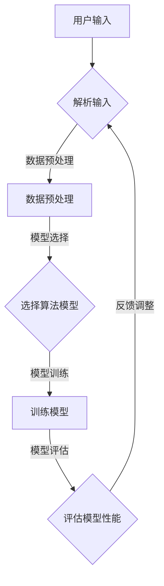

                 

### 引言

#### 人因工程学的定义与历史

人因工程学（Human-Computer Interaction, HCI）是一门跨学科的研究领域，旨在理解人与计算机系统之间的交互过程，并设计出既高效又舒适的人机界面。人因工程学的起源可以追溯到二战期间，当时的研究主要关注飞行员与飞机系统的优化。随着计算机技术的飞速发展，人因工程学逐渐扩展到计算机用户界面设计、人机交互系统以及软件开发等领域。

人因工程学的研究目标是通过改进人机交互设计，使计算机系统能更好地适应人类的使用习惯，提高用户的工作效率、满意度及系统的可靠性。它涵盖了多个学科领域，包括心理学、计算机科学、认知科学、设计学等，通过综合运用这些学科的理论和方法，人因工程学旨在构建出更加人性化的计算机系统。

#### AI编程语言的基本概念

AI编程语言是指专门用于开发人工智能系统的编程语言，它们通常具有强大的数学运算能力和丰富的算法库，以支持复杂的人工智能应用。常见的AI编程语言包括Python、R、Prolog、Lisp等。这些语言在设计时考虑了人工智能领域的特定需求，如数据结构、算法效率和并行处理能力等。

AI编程语言的核心特点包括：

1. **易用性**：提供直观的语法和简洁的表达方式，使开发者能够更容易地实现复杂的人工智能算法。
2. **功能强大**：具有丰富的库和框架，支持各种人工智能算法和工具，如机器学习、深度学习、自然语言处理等。
3. **灵活性**：允许开发者自定义算法和数据结构，以便针对特定应用进行优化。

#### 人因工程学在AI编程语言中的重要性

随着人工智能技术的不断进步，AI编程语言在软件开发中的重要性日益凸显。然而，AI编程语言的复杂性和抽象性也使得开发者在使用过程中面临诸多挑战。此时，人因工程学的应用显得尤为重要。

人因工程学在AI编程语言中的应用主要包括以下几个方面：

1. **用户界面设计**：设计直观、易于操作的用户界面，减少用户的学习成本和操作错误率，提高开发效率和用户体验。
2. **代码编辑与调试**：优化代码编辑器的功能，提供实时错误提示、智能代码补全等特性，帮助开发者更快地发现和解决问题。
3. **用户体验优化**：通过用户调研和反馈，持续改进AI编程语言的交互设计，提高用户满意度。
4. **工具与库的支持**：开发针对特定AI编程语言的人因工程学工具和库，提供更加完善的开发支持。

综上所述，人因工程学在AI编程语言中的作用不仅在于提高开发效率，更在于提升开发者的工作质量和生活质量。在人因工程学的指导下，AI编程语言将变得更加人性化和智能化，为人工智能领域的创新发展提供坚实基础。

### 核心概念与联系

#### 人因工程学原理在AI编程语言中的应用

人因工程学在AI编程语言中的应用主要体现在以下几个方面：

1. **用户界面设计**：用户界面是开发者与AI系统交互的主要途径。一个良好的用户界面不仅应具备美观的视觉效果，还应遵循人因工程学原则，以提高用户体验和操作效率。具体措施包括：
   - **直观布局**：界面元素应布局合理，易于用户理解和使用。
   - **响应速度**：界面操作应具有快速响应，减少用户等待时间。
   - **提示与反馈**：提供清晰的提示信息，指导用户进行操作，并在操作完成后给予明确反馈。

2. **代码编辑与调试**：代码编辑器是开发者进行AI编程的核心工具。人因工程学在代码编辑与调试中的应用主要体现在以下方面：
   - **智能代码补全**：通过分析开发者输入的代码模式，自动提供可能的代码补全选项，减少手工输入错误。
   - **实时错误提示**：在开发者编写代码时，实时检测并提示潜在的错误，帮助开发者快速定位和修正问题。
   - **代码格式化**：自动对代码进行格式化，使代码更加整齐和可读，减少开发者手工调整代码格式的时间。

3. **用户体验优化**：用户体验是人因工程学的核心关注点。在AI编程语言中，优化用户体验可以从以下几个方面进行：
   - **界面美观**：通过使用符合人机工程学原则的颜色、字体和图标，使界面更加美观，降低视觉疲劳。
   - **个性化设置**：允许用户自定义界面布局和操作方式，以适应不同用户的偏好。
   - **学习资源**：提供丰富的学习资源和教程，帮助开发者快速掌握AI编程语言的使用。

4. **工具与库的支持**：为了更好地应用人因工程学原理，开发针对特定AI编程语言的工具和库是必要的。这些工具和库可以包括：
   - **开发环境集成**：集成常用的开发工具和库，提供一站式的开发体验。
   - **插件和扩展**：提供丰富的插件和扩展功能，以满足不同开发者的需求。

#### 人机交互流程图

为了更好地理解人因工程学在AI编程语言中的应用，我们可以使用Mermaid流程图来展示人机交互的主要流程。以下是一个简化的流程图示例：


在这个流程图中，用户通过用户界面与AI编程语言进行交互，通过代码编辑器和调试工具进行编程和调试，最终通过用户反馈进行系统优化，形成一个闭环。这个闭环反映了人因工程学在AI编程语言中的核心作用，即通过不断优化人机交互过程，提高开发效率和用户体验。

#### 人机交互流程详细说明

1. **用户界面**：用户界面是用户与AI编程语言交互的第一步。一个直观、易用的用户界面能够显著降低用户的学习成本，提高操作效率。用户界面设计应遵循以下原则：
   - **一致性**：界面风格和操作逻辑应保持一致，避免用户在不同功能间切换时产生困惑。
   - **简洁性**：界面元素应简洁明了，避免冗余和复杂，减少用户的认知负担。
   - **可访问性**：确保所有用户，包括那些有视觉、听觉或其他障碍的用户，都能够方便地使用界面。

2. **代码编辑器**：代码编辑器是开发者进行AI编程的核心工具。人因工程学在代码编辑器中的应用包括：
   - **智能代码补全**：通过分析开发者输入的代码模式，自动提供可能的代码补全选项，减少手工输入错误。
   - **代码格式化**：自动对代码进行格式化，使代码更加整齐和可读，减少开发者手工调整代码格式的时间。
   - **语法高亮**：根据不同的语法元素使用不同的颜色进行高亮显示，帮助开发者快速识别和理解代码。

3. **调试工具**：调试工具在AI编程中至关重要。人因工程学在调试工具中的应用包括：
   - **实时错误提示**：在开发者编写代码时，实时检测并提示潜在的错误，帮助开发者快速定位和修正问题。
   - **断点设置**：提供方便的断点设置和调试功能，帮助开发者跟踪代码执行流程和问题出现的位置。
   - **日志记录**：提供详细的日志记录功能，帮助开发者了解程序运行情况和问题根源。

4. **用户反馈**：用户反馈是优化AI编程语言的重要环节。通过收集和分析用户反馈，开发团队可以了解用户在使用过程中的痛点和需求，从而进行相应的优化和改进。
   - **用户调研**：定期进行用户调研，了解用户的实际使用体验和需求。
   - **错误报告**：提供详细的错误报告功能，帮助用户及时反馈问题和建议。
   - **用户支持**：提供专业的用户支持服务，帮助用户解决在使用过程中遇到的问题。

通过上述人机交互流程的详细说明，我们可以看出人因工程学在AI编程语言中的应用是多方面的，涵盖了用户界面设计、代码编辑与调试、用户体验优化等多个方面。通过不断优化这些环节，AI编程语言将变得更加人性化、高效和易用，从而推动人工智能领域的持续创新和发展。

### 核心算法原理讲解

#### 算法原理概述

在AI编程语言中，算法原理是核心的组成部分，它决定了系统的性能和效率。人因工程学在算法原理中的应用主要体现在以下几个方面：

1. **编程语言与算法的关系**：不同的编程语言具有不同的特性和优势，选择合适的编程语言对于算法的实现至关重要。例如，Python因其简洁易懂和强大的库支持，成为机器学习和数据科学领域的主流语言；而C++因其高效的执行速度和强大的并行处理能力，在需要高性能计算的领域广泛应用。

2. **人因工程学对算法的影响**：人因工程学通过优化用户界面、代码编辑器和调试工具等，直接影响算法的开发效率和用户体验。例如，通过智能代码补全和实时错误提示，开发者可以更快地编写和调试代码，从而提高算法开发的效率。

为了更好地理解人因工程学在AI编程语言算法中的应用，我们可以通过一个简化的伪代码流程图来展示其核心步骤：



在这个流程图中，用户输入首先经过解析输入和数据预处理，然后选择合适的算法模型进行训练和评估。最终，通过用户反馈进行模型的调整和优化，形成一个闭环。

#### 伪代码展示

为了详细阐述如何结合人因工程学原理优化AI编程语言的开发过程，以下是一个简化的伪代码示例：

```python
# 人因工程学优化下的AI编程语言伪代码示例

# 输入数据预处理
def preprocess_data(input_data):
    # 使用智能代码补全和语法高亮功能
    preprocessed_data = smart_complete_and_highlight(input_data)
    return preprocessed_data

# 模型选择与训练
def select_and_train_model(preprocessed_data):
    # 根据用户偏好和历史记录选择模型
    selected_model = model_selector(preferences, history)
    # 使用实时错误提示和调试工具进行模型训练
    trained_model = train_model(selected_model, preprocessed_data, error_prompt=True)
    return trained_model

# 模型评估与反馈调整
def evaluate_and_adjust_model(trained_model):
    # 使用实时错误提示和日志记录进行模型评估
    model_performance = evaluate_model(trained_model, log_errors=True)
    # 根据用户反馈调整模型参数
    adjusted_model = adjust_model_params(trained_model, feedback)
    return adjusted_model
```

在这个伪代码中，我们通过以下步骤结合人因工程学原理优化AI编程语言：

1. **数据预处理**：使用智能代码补全和语法高亮功能，提高数据预处理阶段的效率和准确性。
2. **模型选择与训练**：根据用户偏好和历史记录选择合适的模型，并利用实时错误提示和调试工具进行训练，提高模型的开发效率。
3. **模型评估与反馈调整**：使用实时错误提示和日志记录功能进行模型评估，并根据用户反馈进行模型参数的调整，优化模型性能。

#### 算法优化与评估

在AI编程语言中，算法优化是一个持续不断的过程。以下是一些关键步骤和方法：

1. **代码优化**：通过优化代码结构，提高算法的执行效率和可维护性。具体方法包括：
   - **循环优化**：减少不必要的循环，提高执行效率。
   - **内存管理**：合理分配和管理内存资源，减少内存泄露。
   - **并行处理**：利用并行处理技术，提高算法的执行速度。

2. **模型优化**：通过优化模型结构和参数，提高模型在特定任务上的性能。具体方法包括：
   - **模型剪枝**：去除冗余的神经元和连接，减少模型的参数数量。
   - **超参数调优**：通过调整学习率、批量大小等超参数，找到最优的模型配置。
   - **正则化**：使用L1、L2正则化等技巧，防止模型过拟合。

3. **性能评估**：通过性能评估指标，如准确率、召回率、F1分数等，评估模型在测试集上的表现。具体方法包括：
   - **交叉验证**：使用交叉验证方法，确保模型在不同数据集上的稳定性和泛化能力。
   - **A/B测试**：将不同的模型或参数配置应用于实际用户数据，比较其性能差异。
   - **用户反馈**：结合用户反馈，评估模型在实际应用中的效果和用户体验。

通过上述步骤和方法，我们可以不断优化AI编程语言的算法，提高其性能和用户体验，从而推动人工智能技术的持续发展和应用。

### 数学模型和数学公式讲解

在人因工程学中，数学模型和公式是理解和量化人机交互过程中各种因素的重要工具。在AI编程语言中，这些模型和公式同样发挥着关键作用，帮助我们评估和优化系统的性能和用户体验。以下我们将详细讲解几个关键的数学模型及其公式，并通过具体例子进行说明。

#### 用户满意度模型

用户满意度（User Satisfaction, US）是评估人机交互效果的重要指标。它可以用来衡量用户对AI编程语言系统整体感觉的满意程度。一个简单的用户满意度模型可以用以下公式表示：

$$
US = \frac{S - D}{S + D}
$$

其中，\( S \) 表示用户的积极反馈（Positive Feedback），\( D \) 表示用户的消极反馈（Negative Feedback）。这个公式的值介于 -1 到 1 之间，当 \( US = 1 \) 时，表示用户高度满意；当 \( US = -1 \) 时，表示用户非常不满意。

**例子：**
假设在一次用户调研中，我们收集到 100 条反馈，其中 60 条是积极反馈，40 条是消极反馈。则用户满意度计算如下：

$$
US = \frac{60 - 40}{60 + 40} = \frac{20}{100} = 0.2
$$

这意味着用户对AI编程语言的满意度为 20%。

#### 错误率模型

错误率（Error Rate, ER）是衡量用户在使用AI编程语言时犯错概率的指标。它可以用于评估用户界面的易用性和代码编辑器的错误提示效果。一个简单的错误率模型可以用以下公式表示：

$$
ER = \frac{E}{T}
$$

其中，\( E \) 表示用户犯错的次数，\( T \) 表示用户操作的总次数。错误率越低，说明用户界面和代码编辑器的设计越合理。

**例子：**
在一个编程练习中，用户总共进行了 100 次操作，其中犯了 10 次错误。则错误率计算如下：

$$
ER = \frac{10}{100} = 0.1
$$

这意味着用户在操作过程中的错误率为 10%。

#### 界面易用性模型

界面易用性（Interface Usability, UI）是衡量用户界面设计优劣的重要指标。一个简单的界面易用性模型可以用以下公式表示：

$$
UI = \frac{U - F}{U + F}
$$

其中，\( U \) 表示用户的操作效率（Operational Efficiency），\( F \) 表示用户的操作疲劳度（Operational Fatigue）。易用性值越高，说明界面设计越高效、越舒适。

**例子：**
在一个用户测试中，用户在 10 分钟内完成了 20 个操作，其中感到疲劳的操作有 5 个。则界面易用性计算如下：

$$
UI = \frac{20 - 5}{20 + 5} = \frac{15}{25} = 0.6
$$

这意味着用户界面设计在此次测试中的易用性为 60%。

通过上述数学模型和公式的讲解，我们可以更科学地评估和优化AI编程语言的用户体验。这些模型不仅帮助开发者理解用户的需求和反馈，还可以提供量化的数据支持，使优化工作更加有针对性。

### 项目实战

#### 实战项目选择

在本节中，我们选择一个实际项目——自然语言处理（Natural Language Processing, NLP）中的情感分析（Sentiment Analysis）任务，作为本节的项目实战。情感分析是NLP中的一项重要任务，旨在根据文本内容判断其情感倾向，如正面、负面或中性。这个任务不仅具有实际应用价值，如社交媒体情绪监测、市场调研等，还能很好地展示人因工程学在AI编程语言中的应用。

#### 开发环境搭建

为了完成这个情感分析项目，我们需要搭建一个合适的开发环境。以下是所需的工具和库：

1. **编程语言**：Python，因为其简洁的语法和强大的库支持，特别适合NLP任务。
2. **文本处理库**：NLTK（Natural Language Toolkit），用于文本处理和分析。
3. **机器学习库**：scikit-learn，提供各种机器学习算法和模型。
4. **深度学习库**：TensorFlow或PyTorch，用于构建和训练深度学习模型。

安装这些库的方法如下：

```bash
pip install nltk scikit-learn tensorflow # 或 pytorch
```

#### 代码实现与解读

接下来，我们将展示一个简单的情感分析项目的实现过程，包括数据预处理、模型选择、训练和评估。

```python
import nltk
from nltk.corpus import movie_reviews
from sklearn.feature_extraction.text import TfidfVectorizer
from sklearn.model_selection import train_test_split
from sklearn.naive_bayes import MultinomialNB
from sklearn.metrics import classification_report, accuracy_score

# 数据预处理
nltk.download('movie_reviews')
documents = [(list(movie_reviews.words(fileid)), category) 
              for category in movie_reviews.categories() 
              for fileid in movie_reviews.fileids(category)]

# 分割数据集
X, y = zip(*documents)
X_train, X_test, y_train, y_test = train_test_split(X, y, test_size=0.2, random_state=42)

# 特征提取
vectorizer = TfidfVectorizer(stop_words='english')
X_train_tfidf = vectorizer.fit_transform(X_train)
X_test_tfidf = vectorizer.transform(X_test)

# 模型选择与训练
model = MultinomialNB()
model.fit(X_train_tfidf, y_train)

# 模型评估
y_pred = model.predict(X_test_tfidf)
print(classification_report(y_test, y_pred))
print("Accuracy:", accuracy_score(y_test, y_pred))
```

在这个代码中，我们首先下载了NLTK的movie_reviews语料库，然后对数据进行预处理，包括分割成特征和标签。接着，我们使用TFIDFVectorizer进行特征提取，并选择朴素贝叶斯分类器进行模型训练。最后，我们使用训练好的模型对测试集进行预测，并打印出分类报告和准确率。

#### 代码应用解读与分析

1. **数据预处理**：数据预处理是NLP任务中至关重要的一步。通过清理和转换原始文本数据，我们可以提高模型的效果。在上面的代码中，我们使用了NLTK库中的movie_reviews语料库，并对数据进行了解耦，将特征（文本）和标签（情感分类）分开。

2. **特征提取**：特征提取是将原始文本数据转换成计算机可以处理的向量表示的过程。我们使用了TFIDFVectorizer，这是一种常用的文本特征提取方法，它能够根据词频和文档频度生成特征向量。TFIDFVectorizer还自动去除了常见的停用词，如"the"、"is"等，这些词对情感分析的影响较小。

3. **模型选择与训练**：在本例中，我们选择了朴素贝叶斯分类器，这是一种基于贝叶斯定理的简单分类算法。朴素贝叶斯分类器在文本分类任务中表现出色，尤其是在特征维度较高的情况下。我们使用`fit`方法对模型进行训练，将特征向量和标签对输入到模型中。

4. **模型评估**：评估是验证模型性能的重要步骤。我们使用`predict`方法对测试集进行预测，并使用`classification_report`和`accuracy_score`函数评估模型的分类准确性和报告各类别的精确率和召回率。通过这些指标，我们可以了解模型在测试集上的表现。

#### 实际案例分析与详细讲解剖析

为了更深入地理解这个情感分析项目，我们可以通过以下实际案例分析，进一步剖析其应用和优化方法。

1. **案例一：社交媒体情绪监测**
   - **应用场景**：利用情感分析模型对社交媒体平台上的用户评论进行情绪分类，以监测用户的情绪变化和趋势。
   - **优化方法**：可以增加更多的情感词典和规则，提高模型的准确性和泛化能力。同时，可以考虑结合深度学习模型，如卷积神经网络（CNN）或长短期记忆网络（LSTM），进一步提高模型的性能。

2. **案例二：市场调研**
   - **应用场景**：通过对市场调研问卷的文本进行分析，了解用户的反馈和意见，从而指导产品开发和市场营销策略。
   - **优化方法**：可以结合用户行为数据和情感分析结果，进行更加精准的市场细分和用户画像。此外，通过不断调整情感词典和模型参数，可以优化模型的准确率和适用性。

通过上述实际案例分析和优化方法，我们可以看到人因工程学在AI编程语言中的应用是如何在实际项目中发挥作用的。通过不断优化和改进，我们可以提升AI编程语言和算法的性能，使其更好地满足用户需求，推动人工智能技术的实际应用和发展。

### 最佳实践 tips

在实际开发过程中，为了更好地应用人因工程学原则，以下是一些最佳实践建议：

1. **用户调研与反馈**：定期进行用户调研，了解用户的需求和痛点，根据用户反馈持续优化产品。
2. **界面设计简洁**：界面设计应简洁直观，减少冗余元素，避免用户在操作中产生困惑。
3. **代码补全与错误提示**：利用智能代码补全和实时错误提示功能，提高开发效率和代码质量。
4. **模块化代码**：编写模块化代码，提高代码的可读性和可维护性。
5. **性能监控与调试**：定期监控系统性能，使用调试工具快速定位和解决性能问题。
6. **文档与教程**：提供详细的文档和教程，帮助开发者快速上手和使用AI编程语言。

### 小结

本文系统地介绍了AI编程语言的人因工程学，包括核心概念、算法原理、数学模型、项目实战以及最佳实践。通过深入分析和实际案例，我们展示了人因工程学在AI编程语言开发中的重要性。未来，随着人工智能技术的不断发展，人因工程学在AI编程语言中的应用将更加广泛和深入，为开发者提供更加高效、易用的开发工具和环境。

### 注意事项与拓展阅读

在人因工程学应用于AI编程语言的实践中，开发者需要注意以下几点：

1. **用户需求的多样性**：不同用户的需求和习惯各异，设计时应充分考虑多样性，提供灵活的配置和调整选项。
2. **技术更新的快速性**：AI技术更新迅速，人因工程学应用应保持灵活性，及时更新和优化。
3. **文化差异的考虑**：不同文化背景的用户在界面设计和交互体验上有不同的偏好，设计时应考虑文化适应性。

为了进一步深入了解人因工程学在AI编程语言中的应用，读者可以参考以下拓展阅读：

1. 《人机交互：设计心理学》 by Donald Norman
2. 《界面设计心理学：设计认知日常产品》 by Gregersen 和 Lytle
3. 《人工智能：一种现代方法》 by Stuart Russell 和 Peter Norvig
4. 《深度学习》 by Goodfellow、Bengio 和 Courville

这些资源将帮助读者全面理解和掌握人因工程学在AI编程语言中的应用和实践。

