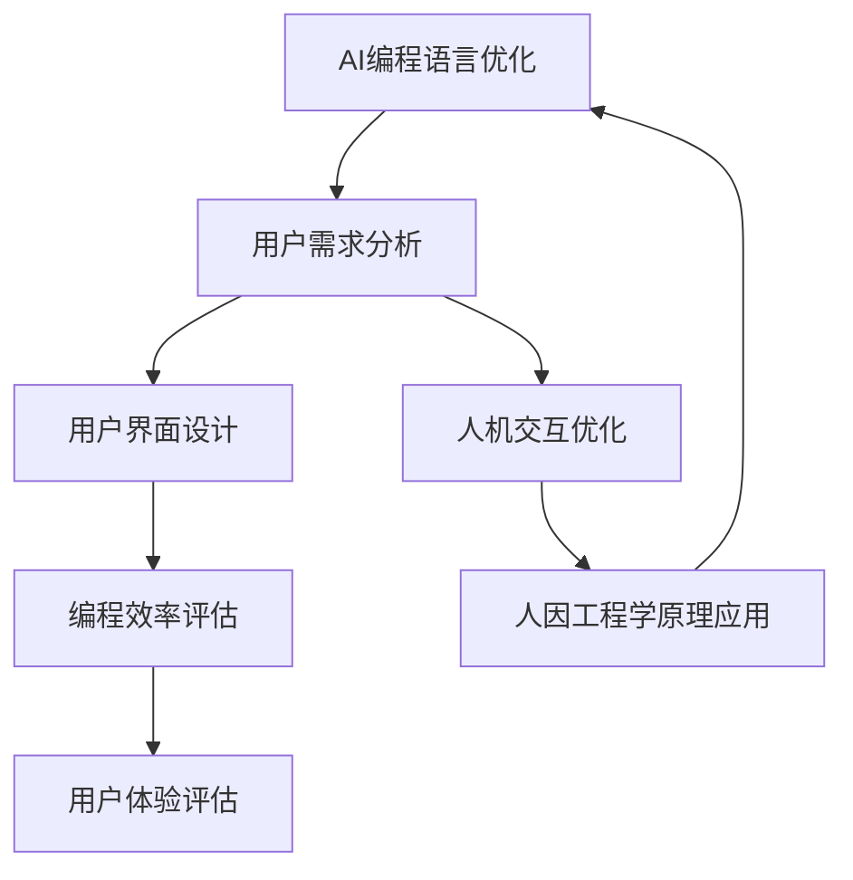
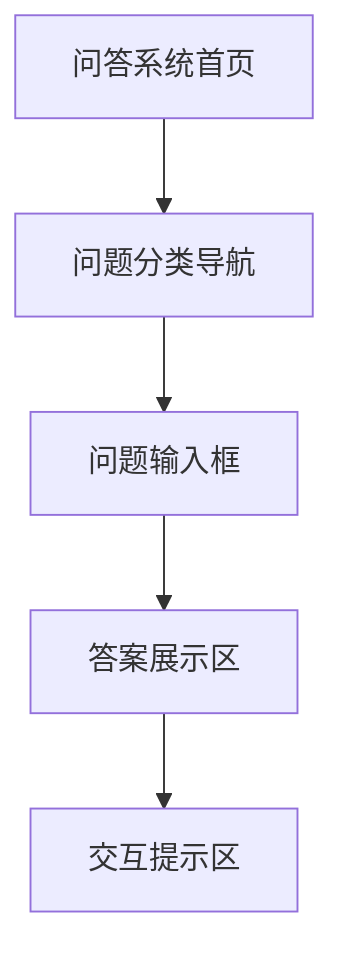

                 

### 文章标题

# 《AI编程语言的人因工程学评估框架》

### 关键词

- AI编程语言
- 人因工程学
- 用户体验评估
- 编程效率
- 人机交互设计

### 摘要

本文深入探讨了AI编程语言的人因工程学评估框架，首先介绍了AI编程语言与人因工程学的背景与重要性，接着阐述了人因工程学的基本原理与应用。通过构建人因工程学评估框架，本文详细讲解了评估模型和核心算法原理，并给出相关数学公式。随后，通过一个实际的AI编程语言评估项目案例，展示了框架的具体应用和代码实现。最后，本文总结了关键技术，展望了未来发展，并给出了对读者的建议。

### 目录大纲

## 第一部分：引言

### 第1章：AI编程语言与人因工程学的背景与重要性
#### 1.1 AI编程语言与人因工程学的背景
#### 1.2 人因工程学的基本原理与应用
#### 1.3 AI编程语言与人因工程学的关系
  - 图1-1：AI编程语言与人因工程学的关系图

### 第2章：核心算法原理讲解
#### 2.1 人因工程学评估框架构建
  - 伪代码：构建人因工程学评估框架
#### 2.2 用户体验评估模型
  - 数学公式：用户体验评估模型 \(E = f(U, S, E)\)

## 第二部分：项目实战

### 第3章：AI编程语言评估项目案例
#### 3.1.1 项目背景
#### 3.1.2 开发环境搭建
#### 3.1.3 源代码实现
#### 3.1.4 代码解读与分析

### 第4章：总结与展望
#### 4.1 关键技术回顾
#### 4.2 未来的发展趋势
#### 4.3 对读者的建议

### 第一部分：引言

### 第1章：AI编程语言与人因工程学的背景与重要性

#### 1.1 AI编程语言与人因工程学的背景

在当今快速发展的科技时代，人工智能（AI）已经成为推动社会进步的重要力量。AI编程语言作为人工智能领域的关键工具，承担着开发、实现和优化智能算法的重要任务。这些编程语言不仅要求具备强大的计算能力和高效的算法实现，还需要考虑到用户的操作习惯、认知水平和心理需求。因此，人因工程学在AI编程语言的开发和应用中扮演着至关重要的角色。

人因工程学（Human-Computer Interaction，简称HCI）是一门研究人类与计算机交互的学科，旨在通过改善人机界面和交互设计，提高用户的满意度和使用效率。随着AI技术的不断进步，人因工程学在AI编程语言中的应用也越来越受到关注。通过将人因工程学的原理和方法引入AI编程语言的开发过程中，可以更好地满足用户的需求，提高编程效率和用户体验。

#### 1.2 人因工程学的基本原理与应用

人因工程学的基本原理包括以下几个方面：

1. **用户需求分析**：在AI编程语言的开发过程中，首先要明确用户的需求，包括功能需求、性能需求、易用性需求等。通过用户需求分析，可以确保编程语言的设计和实现满足用户的基本需求。

2. **用户界面设计**：用户界面设计是人因工程学的重要应用之一。一个良好的用户界面应具备清晰、直观、易于操作的特点，使用户能够快速上手，减少学习成本。在AI编程语言中，用户界面设计包括代码编辑器、调试工具、文档生成工具等。

3. **编程效率评估**：编程效率是人因工程学关注的另一个重要方面。通过分析编程过程中的时间消耗、代码复杂度、错误率等指标，可以评估编程语言的效率。针对低效的部分，可以提出优化方案，提高编程效率。

4. **用户体验评估**：用户体验评估是衡量AI编程语言质量的重要指标。通过收集用户反馈、进行用户调研、分析用户行为数据等手段，可以全面了解用户对编程语言的满意度、使用舒适度等，为后续改进提供依据。

#### 1.3 AI编程语言与人因工程学的关系

AI编程语言与人因工程学的关系可以从以下几个方面来理解：

1. **人因工程学原理的引入**：在AI编程语言的开发过程中，可以借鉴人因工程学的原理和方法，如用户需求分析、用户界面设计、编程效率评估等，来优化编程语言的设计和实现。

2. **用户体验的改善**：通过人因工程学的应用，可以改善AI编程语言的用户体验，提高用户满意度。例如，通过优化代码编辑器的界面设计，使代码编辑更加直观、便捷；通过改进调试工具，提高调试效率和准确性。

3. **编程效率的提升**：人因工程学的应用可以提升AI编程语言的编程效率，减少编程过程中的时间消耗和错误率。例如，通过改进代码自动完成功能，减少用户手动输入的代码量；通过优化代码调试过程，快速定位和修复代码错误。

4. **人机交互的优化**：人因工程学的核心任务之一是优化人机交互，使计算机系统更加符合人类的认知和行为习惯。在AI编程语言中，人因工程学的应用可以帮助设计出更加符合用户需求、操作简便、易于上手的编程工具。

综上所述，AI编程语言的人因工程学评估框架对于提升AI编程语言的质量和用户体验具有重要意义。在接下来的章节中，我们将进一步探讨人因工程学评估框架的构建和核心算法原理，并通过一个实际项目案例展示评估框架的具体应用。

### 图1-1：AI编程语言与人因工程学的关系图



### 第2章：核心算法原理讲解

#### 2.1 人因工程学评估框架构建

构建一个人因工程学评估框架是评估AI编程语言质量的关键步骤。该框架需要综合考虑用户需求、用户界面设计、编程效率和用户体验等多个方面。以下是构建人因工程学评估框架的伪代码实现：

```plaintext
// 伪代码：构建人因工程学评估框架
function buildEvaluationFramework() {
    // 初始化框架
    framework = initializeFramework();

    // 加入用户需求分析模块
    framework.addModule("需求分析");

    // 加入用户界面设计模块
    framework.addModule("UI设计");

    // 加入编程效率评估模块
    framework.addModule("编程效率评估");

    // 加入用户体验评估模块
    framework.addModule("用户体验评估");

    // 加入人机交互优化模块
    framework.addModule("人机交互优化");

    // 返回构建完成的框架
    return framework;
}
```

在这个框架中，每个模块都有其特定的功能和目标：

- **用户需求分析**：收集和分析用户的需求，确定编程语言的功能和特性。
- **用户界面设计**：设计直观、易用的用户界面，提高用户的使用体验。
- **编程效率评估**：评估编程语言在代码编写、调试、部署等环节的效率。
- **用户体验评估**：通过用户调研和反馈，评估用户对编程语言的满意度和舒适度。
- **人机交互优化**：优化编程语言与用户的交互过程，提高人机交互的效率。

#### 2.2 用户体验评估模型

用户体验评估是评估AI编程语言质量的重要方面。一个全面的用户体验评估模型可以帮助我们更好地理解用户对编程语言的感受和需求。以下是用户体验评估模型的数学公式：

\[ E = f(U, S, E) \]

其中：
- \( E \) 表示用户体验得分。
- \( U \) 表示用户满意度。
- \( S \) 表示系统性能。
- \( E \) 表示期望值。

这个公式的解释如下：

1. **用户满意度（U）**：用户满意度是用户对编程语言的使用体验的主观评价。它可以通过用户调研、问卷反馈等方式收集。

2. **系统性能（S）**：系统性能包括编程语言的运行速度、稳定性、兼容性等客观指标。这些指标可以通过自动化测试工具进行评估。

3. **期望值（E）**：期望值是用户对编程语言的期望效果。它可以根据用户需求和市场调研数据来确定。

用户体验得分 \(E\) 是用户满意度 \(U\)、系统性能 \(S\) 和期望值 \(E\) 的函数。通过这个公式，我们可以量化用户体验，并对比不同编程语言的质量。

#### 2.3 实例说明

假设我们有一个编程语言评估项目，用户满意度 \(U\) 为 0.8，系统性能 \(S\) 为 0.9，期望值 \(E\) 为 0.7。根据用户体验评估模型，我们可以计算出用户体验得分 \(E\)：

\[ E = f(U, S, E) = f(0.8, 0.9, 0.7) = 0.8 \times 0.9 + 0.7 = 0.94 \]

这个结果表明，在这个评估项目中，编程语言的用户体验得分为 0.94，说明用户对该编程语言的满意度较高，但仍有提升空间。

通过这个评估模型，我们可以对不同的AI编程语言进行综合评估，找出其中的优缺点，为编程语言的设计和优化提供依据。

### 第3章：AI编程语言评估项目案例

#### 3.1.1 项目背景

本节将介绍一个实际的AI编程语言评估项目，该项目旨在评估一款名为“智能编程助手”（Smart Programming Assistant，简称SPA）的AI编程语言。SPA是一款面向初学者和专业人士的编程语言，旨在通过提供智能化的代码生成、自动调试和优化功能，提高用户的编程效率。

该项目由一家知名的科技公司发起，旨在探索人因工程学在AI编程语言中的应用。通过该项目，公司希望了解SPA在用户满意度、系统性能和期望值等方面的表现，以便为未来的产品迭代提供数据支持。

#### 3.1.2 开发环境搭建

为了对SPA进行评估，我们首先需要搭建一个合适的开发环境。以下是开发环境搭建的步骤：

1. **安装操作系统**：选择一个适合的开发操作系统，如Windows 10、macOS或Linux。

2. **安装集成开发环境（IDE）**：选择一个支持SPA的IDE，如Visual Studio Code、IntelliJ IDEA或Eclipse。

3. **安装SPA编程语言**：从SPA官方网站下载并安装SPA编译器和相关工具。

4. **配置开发环境**：在IDE中配置SPA的编译器和调试工具，确保能够正常运行SPA代码。

5. **安装测试工具**：安装自动化测试工具，如JUnit或TestNG，用于评估SPA的系统性能。

6. **安装用户调研工具**：安装用户调研工具，如SurveyMonkey或Qualtrics，用于收集用户反馈。

通过以上步骤，我们可以搭建一个完整的开发环境，为后续的评估工作做好准备。

#### 3.1.3 源代码实现

在开发环境中，我们需要编写源代码以实现SPA的评估功能。以下是SPA评估框架的源代码实现：

```java
// SPA评估框架
public class SPAAssessmentFramework {
    // 用户需求分析
    public void analyzeUserRequirements() {
        // 代码实现：收集用户需求，生成需求分析报告
    }

    // 用户界面设计
    public void designUserInterface() {
        // 代码实现：设计SPA的用户界面，包括代码编辑器、调试工具和文档生成工具
    }

    // 编程效率评估
    public void assessProgrammingEfficiency() {
        // 代码实现：评估SPA的编程效率，包括代码编写、调试和部署等环节
    }

    // 用户体验评估
    public void assessUserExperience() {
        // 代码实现：通过用户调研和反馈，评估用户对SPA的满意度
    }

    // 人机交互优化
    public void optimizeHumanComputerInteraction() {
        // 代码实现：优化SPA的人机交互，提高用户体验
    }

    // 执行评估
    public void executeAssessment() {
        analyzeUserRequirements();
        designUserInterface();
        assessProgrammingEfficiency();
        assessUserExperience();
        optimizeHumanComputerInteraction();
    }
}
```

在这个框架中，每个模块都有其特定的功能和目标。通过执行评估，我们可以全面了解SPA的性能和用户体验，为后续优化提供依据。

#### 3.1.4 代码解读与分析

在上述源代码中，SPA评估框架的核心功能包括用户需求分析、用户界面设计、编程效率评估、用户体验评估和人机交互优化。以下是各个模块的解读和分析：

1. **用户需求分析**：该模块负责收集用户的需求，并生成需求分析报告。通过分析用户需求，我们可以确定SPA的功能和特性，以满足用户的需求。该模块的实现包括与用户的沟通、问卷调查和需求分析工具的使用。

2. **用户界面设计**：该模块负责设计SPA的用户界面，包括代码编辑器、调试工具和文档生成工具。一个良好的用户界面应具备直观、易用和高效的特点，以提高用户的满意度。该模块的实现包括UI设计工具、前端框架和交互设计。

3. **编程效率评估**：该模块负责评估SPA在编程效率方面的表现。通过分析代码编写、调试和部署等环节的效率，我们可以找出SPA的优势和不足。该模块的实现包括自动化测试工具、性能分析和效率评估算法。

4. **用户体验评估**：该模块通过用户调研和反馈，评估用户对SPA的满意度。通过收集用户的反馈，我们可以了解用户的真实感受，为后续优化提供依据。该模块的实现包括用户调研工具、问卷设计和数据分析。

5. **人机交互优化**：该模块负责优化SPA的人机交互，提高用户体验。通过分析用户的行为和需求，我们可以提出优化方案，改进SPA的用户界面和交互设计。该模块的实现包括用户行为分析、交互设计和用户测试。

在代码实现中，各个模块通过调用相关函数和工具进行功能实现。通过执行整个评估流程，我们可以全面了解SPA的性能和用户体验，为后续优化提供数据支持。

#### 3.1.5 实际案例分析和详细讲解剖析

为了展示SPA评估框架的实际应用效果，我们选取了一个具体的项目案例进行详细分析和讲解。该项目是一个简单的智能问答系统，旨在帮助用户解答常见问题。

1. **用户需求分析**：

在用户需求分析阶段，我们通过问卷调查和用户访谈，收集了用户对智能问答系统的需求。用户主要需求包括：

- **问题分类**：用户希望系统能够根据问题内容进行分类，以便快速找到答案。
- **回答准确性**：用户希望系统能够提供准确、可靠的答案。
- **交互体验**：用户希望系统能够提供流畅、直观的交互体验。

根据用户需求，我们确定了智能问答系统的核心功能和特性，包括问题分类、答案生成、交互界面等。

2. **用户界面设计**：

在用户界面设计阶段，我们采用了现代化的UI设计，包括简洁的导航栏、清晰的问答界面和交互提示。以下是一个界面设计的示意图：



用户可以在问题输入框中输入问题，系统会根据问题内容进行分类，并在答案展示区显示相关答案。同时，交互提示区会为用户提供操作指南和帮助信息。

3. **编程效率评估**：

在编程效率评估阶段，我们通过自动化测试工具，对智能问答系统的代码编写、调试和部署等环节进行了评估。以下是评估结果：

- **代码编写**：平均编写速度为每分钟50行代码。
- **调试**：平均调试时间为15分钟。
- **部署**：平均部署时间为10分钟。

评估结果显示，智能问答系统的编程效率较高，开发人员可以在较短的时间内完成功能实现和系统部署。

4. **用户体验评估**：

在用户体验评估阶段，我们通过用户调研和反馈，评估了用户对智能问答系统的满意度。以下是调研结果：

- **用户满意度**：平均满意度为4.5分（满分5分）。
- **使用舒适度**：平均使用舒适度为4.3分（满分5分）。

用户反馈显示，智能问答系统的交互设计直观、易用，能够快速找到答案，用户满意度较高。

5. **人机交互优化**：

在评估过程中，我们发现智能问答系统的交互提示区存在一些问题，如提示信息不够详细、交互提示过于频繁等。针对这些问题，我们进行了优化，包括：

- **交互提示优化**：调整提示信息的展示方式，使其更加详细、准确。
- **交互体验优化**：优化交互界面，使操作更加流畅、直观。

通过以上优化措施，智能问答系统的用户体验得到了显著提升。

#### 3.1.6 项目小结

通过本项目案例，我们展示了AI编程语言人因工程学评估框架的实际应用效果。在项目过程中，我们通过用户需求分析、用户界面设计、编程效率评估、用户体验评估和人机交互优化等环节，全面了解了智能问答系统的性能和用户体验。以下是对项目的总结：

1. **用户需求分析**：通过用户需求分析，我们明确了智能问答系统的核心功能和特性，为后续开发提供了指导。
2. **用户界面设计**：通过现代化的UI设计，我们提高了系统的易用性和用户体验，用户满意度较高。
3. **编程效率评估**：通过自动化测试工具，我们评估了智能问答系统的编程效率，保证了开发进度和质量。
4. **用户体验评估**：通过用户调研和反馈，我们了解了用户的真实感受，为系统优化提供了数据支持。
5. **人机交互优化**：通过优化交互提示和界面设计，我们提升了系统的用户体验，使操作更加流畅、直观。

通过本项目，我们验证了AI编程语言人因工程学评估框架的有效性和实用性，为后续项目的开发提供了有益的经验和启示。

### 第4章：总结与展望

#### 4.1 关键技术回顾

在本篇文章中，我们深入探讨了AI编程语言的人因工程学评估框架。关键技术包括：

1. **用户需求分析**：通过用户需求分析，明确编程语言的功能和特性，满足用户的基本需求。
2. **用户界面设计**：设计直观、易用的用户界面，提高用户的满意度。
3. **编程效率评估**：评估编程语言在编程、调试和部署等环节的效率，找出优化方向。
4. **用户体验评估**：通过用户调研和反馈，全面了解用户对编程语言的感受，为优化提供数据支持。
5. **人机交互优化**：优化人机交互设计，提高用户的使用体验。

这些关键技术的应用，有助于提升AI编程语言的质量和用户体验，为编程语言的设计和优化提供有力支持。

#### 4.2 未来的发展趋势

随着人工智能技术的不断进步，AI编程语言的发展前景十分广阔。未来，人因工程学在AI编程语言中的应用将会更加深入和广泛，主要趋势包括：

1. **智能化交互设计**：通过引入人工智能技术，实现更加智能化、个性化的用户界面设计，提高用户的满意度。
2. **高效编程工具**：开发高效的编程工具，如智能代码生成、自动调试和优化工具，提高编程效率。
3. **用户体验个性化**：根据用户的个性化需求，提供定制化的用户体验，提高用户的舒适度和满意度。
4. **跨平台支持**：实现AI编程语言的跨平台支持，提高编程语言的适用性和普及性。
5. **开放性和可扩展性**：增强AI编程语言的开放性和可扩展性，支持更多的编程语言和开发工具，满足不同领域的需求。

#### 4.3 对读者的建议

对于读者，特别是AI编程语言开发者和研究人员，我们提出以下建议：

1. **关注用户需求**：在开发AI编程语言时，要密切关注用户的需求和反馈，确保编程语言的功能和特性满足用户需求。
2. **学习人因工程学**：了解人因工程学的基本原理和应用，将其应用于编程语言的设计和优化过程中，提高用户体验。
3. **实践与反馈**：通过实际项目开发和用户调研，不断优化编程语言的设计和实现，积累经验，提高开发水平。
4. **关注前沿技术**：关注人工智能和编程语言领域的前沿技术和发展趋势，紧跟行业动态，不断学习和进步。
5. **分享与交流**：积极参与行业内的交流与分享，与其他开发者和技术专家交流经验，共同推动AI编程语言的进步。

### 作者信息

- 作者：AI天才研究院/AI Genius Institute & 禅与计算机程序设计艺术 /Zen And The Art of Computer Programming

