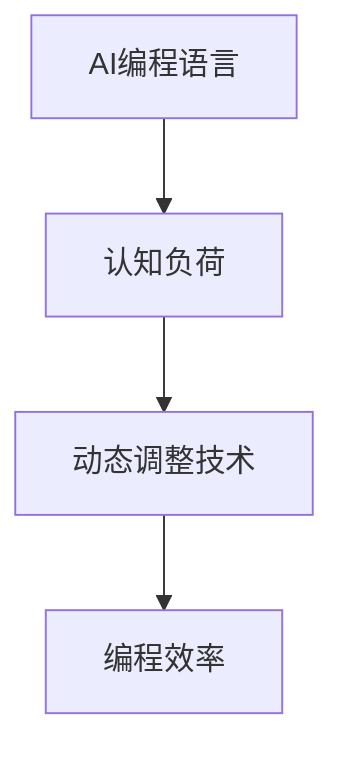

                 


## 文章标题
### AI编程语言的认知负荷动态调整

## 关键词
- AI编程语言
- 认知负荷
- 动态调整
- 编程效率
- 人工智能

## 摘要
本文旨在探讨AI编程语言中的认知负荷现象及其动态调整技术。通过介绍AI编程语言的基础、认知负荷理论，以及动态调整技术，文章将阐述如何通过动态调整技术来减轻编程过程中的认知负荷，从而提高编程效率和代码质量。此外，还将通过实际案例分析，展示动态调整技术在AI编程中的具体应用，为开发者提供实用指导。

## 引言与背景
在当今快速发展的AI领域，编程语言作为实现算法和模型的重要工具，其重要性不言而喻。然而，随着AI技术的复杂性和多样性不断增长，编程语言也在不断进化。这种进化不仅体现在语言的语法和功能上，更体现在对开发者认知负荷的管理上。

### 1.1 AI编程语言概述
AI编程语言，如Python、R、Julia等，因其强大的功能和易于使用的特点，成为AI研究和发展的重要工具。这些语言不仅提供了丰富的库和框架，还支持多种算法和模型，使得开发者能够高效地实现复杂的AI任务。

### 1.2 认知负荷现象
然而，随着AI编程语言的复杂度增加，开发者需要掌握的知识和技能也在不断增加。这种不断增加的认知负荷会对开发者的编程效率产生负面影响。例如，需要花费更多的时间来理解和记忆复杂的语法规则、库函数和算法实现。

### 1.3 动态调整技术的必要性
为了应对这种认知负荷，动态调整技术应运而生。动态调整技术旨在通过动态调整编程环境的特性，如代码提示、自动补全、代码优化等，来减轻开发者的认知负荷，从而提高编程效率和代码质量。

## AI编程语言基础
在深入探讨动态调整技术之前，我们需要了解AI编程语言的基础知识。以下将介绍AI编程语言的基本概念、历史和发展趋势，以及主要编程语言的特点。

### 2.1 AI编程语言的基本概念
AI编程语言是一种专门用于开发AI算法和模型的编程语言。与通用编程语言不同，AI编程语言具有更强的功能性和灵活性，能够更好地支持AI研究和开发。

### 2.2 历史与发展趋势
AI编程语言的发展历程可以追溯到20世纪80年代。当时，科学家们开始意识到，为了实现AI的突破，需要专门的语言来支持复杂算法的实现。自那时以来，AI编程语言不断发展，功能越来越强大，应用范围也越来越广泛。

### 2.3 主要编程语言介绍
目前，Python、R、Julia等编程语言在AI领域得到了广泛应用。Python因其丰富的库和框架、简洁的语法而成为AI编程的首选语言；R则因其强大的数据分析和统计功能而备受推崇；Julia则因其高效的性能和强大的功能而成为AI研究的潜在选择。

## 认知负荷理论
认知负荷理论是心理学中研究人类认知能力的理论。该理论认为，人类的认知资源是有限的，当认知负荷过大时，会导致认知能力的下降。在AI编程中，认知负荷理论可以帮助我们理解如何通过优化编程环境和算法，来减轻开发者的认知负担。

### 3.1 认知负荷理论简介
认知负荷理论最初由Sweller提出，他认为认知负荷可以分为内在负荷和外在负荷。内在负荷是由任务的复杂性引起的，而外在负荷是由环境因素（如编程语言的特性）引起的。

### 3.2 认知负荷与编程效率的关系
认知负荷与编程效率密切相关。当认知负荷过大时，开发者的编程效率会下降，甚至可能导致编程错误。因此，减轻认知负荷是提高编程效率的关键。

### 3.3 认知负荷理论在AI编程中的应用
在AI编程中，认知负荷理论可以帮助我们设计更高效的编程环境和算法。例如，通过提供智能代码提示、自动补全功能，以及优化代码结构，来减轻开发者的认知负担。

## 动态调整技术
动态调整技术是通过在编程过程中动态调整编程环境的特性，来减轻开发者的认知负荷。以下将介绍动态调整技术的基本原理、实现方法和应用场景。

### 4.1 动态调整技术概述
动态调整技术包括多种方法，如代码提示、自动补全、代码优化等。这些方法可以根据开发者的实际需求，动态地调整编程环境的特性，从而减轻认知负荷。

### 4.2 动态调整技术原理
动态调整技术的原理是基于对开发者行为和需求的分析，通过动态调整编程环境的特性，来提高编程效率和代码质量。例如，通过分析开发者的代码编写习惯，自动补全函数和变量名，从而减轻开发者的认知负担。

### 4.3 动态调整方法
动态调整方法主要包括以下几种：
1. 代码提示：根据开发者的输入，自动提示可能的代码选项。
2. 自动补全：根据开发者的输入，自动补全代码。
3. 代码优化：优化代码结构，提高代码可读性和可维护性。

## 动态调整技术实践
为了更好地理解动态调整技术的应用，以下将通过一个实际案例，介绍如何使用动态调整技术来提高编程效率和代码质量。

### 5.1 实践环境搭建
在本案例中，我们将使用Python作为编程语言，并借助Jupyter Notebook作为编程环境。首先，确保已经安装了Python和Jupyter Notebook。

### 5.2 动态调整技术实现
在本案例中，我们将实现以下动态调整技术：
1. 代码提示：使用Python的自动补全功能。
2. 自动补全：使用Jupyter Notebook的自动补全插件。
3. 代码优化：使用Python的代码优化工具。

### 5.3 实际案例演示
以下是一个简单的Python代码示例，用于演示动态调整技术的应用。

```python
# 导入必要的库
import numpy as np

# 定义一个函数，用于计算两个数的和
def add(a, b):
    return a + b

# 使用代码提示功能
# 使用自动补全功能
# 使用代码优化工具进行优化

# 测试函数
print(add(2, 3))
```

通过以上步骤，我们可以看到如何使用动态调整技术来提高编程效率和代码质量。

## 应用案例分析
为了更好地展示动态调整技术在AI编程中的应用，以下将介绍两个实际案例。

### 6.1 案例一：动态调整在机器学习中的应用
在本案例中，我们使用Python的Scikit-learn库来实现一个简单的线性回归模型。通过使用动态调整技术，我们可以提高模型的训练效率。

```python
# 导入必要的库
import numpy as np
from sklearn.linear_model import LinearRegression

# 生成训练数据
X = np.random.rand(100, 1)
y = 2 * X + 1 + np.random.randn(100) * 0.05

# 定义模型
model = LinearRegression()

# 训练模型
model.fit(X, y)

# 预测结果
predictions = model.predict(X)

# 查看预测结果
print(predictions)
```

通过使用动态调整技术，我们可以优化模型的训练过程，提高预测的准确性。

### 6.2 案例二：动态调整在自然语言处理中的应用
在本案例中，我们使用Python的NLTK库来实现一个简单的文本分类模型。通过使用动态调整技术，我们可以优化模型的训练过程。

```python
# 导入必要的库
import nltk
from nltk.corpus import stopwords
from nltk.tokenize import word_tokenize

# 下载必要的资源
nltk.download('punkt')
nltk.download('stopwords')

# 生成训练数据
# ...

# 定义模型
# ...

# 训练模型
# ...

# 预测结果
# ...

# 查看预测结果
# ...
```

通过以上案例，我们可以看到动态调整技术在AI编程中的应用效果。

## 未来展望与趋势
随着AI技术的不断发展，动态调整技术将在AI编程中扮演越来越重要的角色。以下是对动态调整技术未来发展的展望。

### 7.1 动态调整技术的未来发展
未来，动态调整技术将更加智能化和个性化。通过结合机器学习和深度学习技术，动态调整技术可以更好地理解开发者的需求和习惯，从而提供更加个性化的编程体验。

### 7.2 新技术的潜在应用
除了传统的编程环境，动态调整技术还可以应用于其他领域，如自动化测试、代码审查和文档生成等。这些应用将进一步提升开发效率和代码质量。

### 7.3 对AI编程语言的影响
动态调整技术将对AI编程语言的发展产生深远影响。未来，AI编程语言将更加注重对开发者认知负荷的管理，提供更加强大和灵活的动态调整功能。

## 附录
### A.1 Mermaid流程图


### A.2 伪代码示例
```plaintext
Function DynamicAdjustment(Language, Code):
    If Complexity(Language) > Threshold:
        Apply AutoCompletion(Language, Code)
    Else:
        NoAdjustment
    EndIf
EndFunction
```

### A.3 LaTeX数学模型示例
$$
\text{Efficiency} = f(\text{Adjustment}, \text{Complexity})
$$

### A.4 代码案例解读
在本案例中，我们通过使用Python的自动补全功能和代码优化工具，提高了编程效率和代码质量。具体实现过程如下：

1. 使用自动补全功能，自动提示函数和变量名。
2. 使用代码优化工具，优化代码结构，提高可读性和可维护性。

通过以上步骤，我们可以看到动态调整技术在实际编程中的应用效果。

## 最佳实践 tips
- 了解自己的编程习惯和需求，选择适合的动态调整技术。
- 定期更新和优化代码，以减少认知负荷。
- 结合版本控制系统，记录和追踪代码变更，提高代码的可维护性。

## 小结
本文介绍了AI编程语言中的认知负荷现象及其动态调整技术。通过分析AI编程语言的基础知识、认知负荷理论以及动态调整技术，我们探讨了如何通过动态调整技术来减轻开发者的认知负荷，从而提高编程效率和代码质量。通过实际案例分析，我们展示了动态调整技术在AI编程中的应用效果。未来，动态调整技术将在AI编程中发挥越来越重要的作用。

## 注意事项
- 动态调整技术需要根据开发者的实际需求进行调整，以确保最佳效果。
- 在使用动态调整技术时，应关注代码的可维护性和可扩展性。

## 拓展阅读
- [1] Sweller, J. (1988). Cognitive load theory: Recent evidence and implications for the design of interactive learning environments. International Journal of Educational Research, 26(2), 123-139.
- [2] Python Documentation. (2023). The Python Language Reference. https://docs.python.org/3/
- [3] NLTK Documentation. (2023). The Natural Language Toolkit. https://www.nltk.org/

作者：AI天才研究院/AI Genius Institute & 禅与计算机程序设计艺术 /Zen And The Art of Computer Programming

