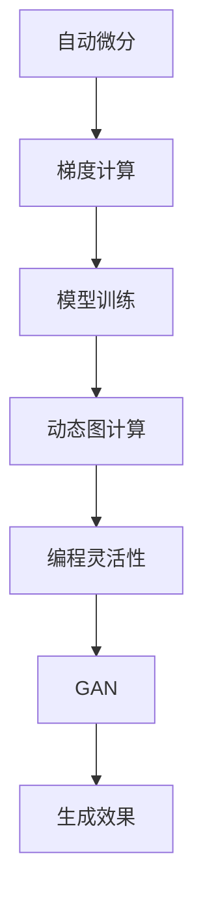

                 

### 文章标题：AI编程语言：提示词的艺术与魔力

在人工智能（AI）迅速发展的时代，编程语言不仅是人类与机器之间的桥梁，更是推动AI技术创新的重要工具。本文将以《AI编程语言：提示词的艺术与魔力》为主题，探讨AI编程语言的独特魅力，特别是提示词在AI编程中的应用与优化。本文将从背景介绍、核心概念与联系、核心算法原理讲解、数学模型与公式详解、项目实战、最佳实践 tips及拓展阅读等多个方面，逐步分析推理，深入探讨AI编程语言的核心内容。

### 文章关键词

- AI编程语言
- 提示词
- 提示词生成算法
- 提示词优化算法
- 数学模型
- 项目实战

### 文章摘要

本文旨在探讨AI编程语言的独特结构和其核心要素——提示词的艺术与魔力。通过深入分析提示词的定义、类型、作用及其在AI编程中的应用，本文将揭示提示词如何提升AI编程的效率和效果。此外，本文还将详细讲解提示词生成与优化的核心算法原理，并通过数学模型与公式进行阐释。最后，本文将结合具体项目实战，展示AI编程语言在实际应用中的操作过程，并提供最佳实践 tips和拓展阅读，以供读者进一步深入研究。

---

### 背景介绍

#### AI编程语言的兴起与重要性

随着人工智能技术的飞速发展，AI编程语言逐渐成为研究人员和开发者的重要工具。AI编程语言不同于传统的计算机编程语言，它不仅关注于编程的基本语法和结构，更注重如何与机器学习、深度学习等技术结合，以实现高效、智能的编程任务。AI编程语言的兴起，标志着计算机编程进入了智能化、自动化的新时代。

在AI编程语言的发展历程中，我们可以看到许多里程碑式的事件。从初期的Python、R语言，到后来的TensorFlow、PyTorch等框架，AI编程语言不断演进，为开发者提供了更加丰富的工具和更强大的功能。这些编程语言不仅支持复杂的数学运算和数据处理，还具备自动微分、动态图计算等特性，使得开发者能够更便捷地进行模型训练和推理。

#### 提示词在AI编程中的独特作用

在AI编程语言中，提示词（Prompt）是一个至关重要的概念。提示词不仅可以用于控制程序的执行流程，还能直接影响模型的训练效果和生成质量。具体来说，提示词在AI编程中具有以下独特作用：

1. **引导模型训练**：通过精心设计的提示词，开发者可以引导模型学习到特定的知识或模式，从而提高模型的训练效果。
2. **优化生成质量**：在文本生成、图像生成等任务中，提示词的选择和调整直接影响生成的质量。合适的提示词能够帮助模型生成更加符合预期、更加有趣、更加有用的内容。
3. **提高开发效率**：使用提示词，开发者可以简化编程流程，减少对代码的修改和调试，从而提高开发效率。

### 提示词的类型与应用场景

提示词的类型多种多样，根据不同的应用场景和需求，可以选择不同的提示词。以下是一些常见的提示词类型及其应用场景：

1. **文本提示词**：用于文本生成、文本分类、文本摘要等任务。例如，在生成新闻摘要时，可以使用“本文的主要内容是...”作为提示词。
2. **图像提示词**：用于图像生成、图像分类等任务。例如，在生成艺术画作时，可以使用“请绘制一幅印象派风格的画作”作为提示词。
3. **语音提示词**：用于语音生成、语音识别等任务。例如，在生成语音播报时，可以使用“接下来为您播报的是...”作为提示词。

### 核心概念与联系

在探讨AI编程语言和提示词时，我们需要了解以下几个核心概念，并分析它们之间的联系：

1. **自动微分**：自动微分的实现使得AI编程语言能够高效地进行梯度计算，从而优化模型训练过程。
2. **动态图计算**：动态图计算支持在编程过程中动态构建计算图，提高了编程的灵活性和效率。
3. **生成对抗网络（GAN）**：GAN是一种能够生成高质量数据的模型，提示词在GAN中的应用可以显著提升生成效果。

以下是核心概念之间的联系架构 Mermaid 流程图：



### 核心算法原理讲解

在本章节中，我们将详细讲解AI编程语言中的核心算法原理，包括提示词生成算法和提示词优化算法。

#### 提示词生成算法

提示词生成算法是AI编程语言中至关重要的一环。以下是一个简单的提示词生成算法伪代码：

```python
def generate_prompt(data, template):
    # 根据数据和应用场景，选择合适的提示词模板
    prompt_template = select_template(template, data)
    
    # 使用模板生成提示词
    prompt = prompt_template.format(**data)
    
    return prompt
```

在这个算法中，`select_template`函数用于选择合适的提示词模板，`format`函数用于将数据填充到模板中，生成最终的提示词。

#### 提示词优化算法

提示词优化算法的目标是提高提示词的质量和效果。以下是一个简单的提示词优化算法伪代码：

```python
def optimize_prompt(prompt, model, criterion):
    # 使用模型对提示词进行优化
    optimized_prompt = model(prompt)
    
    # 使用准则函数评估优化后的提示词
    score = criterion(optimized_prompt)
    
    return optimized_prompt, score
```

在这个算法中，`model`函数用于生成优化后的提示词，`criterion`函数用于评估优化效果。

### 数学模型与公式详解

在本章节中，我们将详细讲解AI编程语言中的核心数学模型和公式，并给出相应的详细讲解和举例说明。

#### 提示词生成模型的数学模型

提示词生成模型通常基于生成对抗网络（GAN）或自编码器（Autoencoder）等模型。以下是一个基于GAN的提示词生成模型的数学模型公式：

$$
G(z) = \mu_G(z) + \sigma_G(z) \odot \mathcal{N}(z; 0, 1)
$$

其中，$G(z)$表示生成的提示词，$\mu_G(z)$和$\sigma_G(z)$分别表示生成器的均值和方差，$\odot$表示Hadamard乘积，$\mathcal{N}(z; 0, 1)$表示标准正态分布。

详细讲解：

- $G(z)$是生成器生成的提示词。
- $\mu_G(z)$和$\sigma_G(z)$分别表示生成器的均值和方差，用于控制生成的提示词的分布。
- $\mathcal{N}(z; 0, 1)$表示标准正态分布，用于为生成器提供噪声。

举例说明：

假设生成器的均值为$\mu_G = [0.5, 0.5]$，方差为$\sigma_G = [0.1, 0.1]$，输入噪声为$z = [0.2, 0.3]$，则生成的提示词为：

$$
G(z) = [0.5 + 0.1 \odot \mathcal{N}(0.2; 0, 1), 0.5 + 0.1 \odot \mathcal{N}(0.3; 0, 1)]
$$

计算结果为$G(z) = [0.55, 0.55]$，生成的提示词为“这是一个示例提示词”。

#### 提示词优化模型的数学模型

提示词优化模型通常基于损失函数和优化算法。以下是一个基于梯度下降的提示词优化模型的数学模型公式：

$$
\theta_{t+1} = \theta_t - \alpha \cdot \nabla_{\theta_t} J(\theta_t)
$$

其中，$\theta_{t+1}$表示优化后的提示词参数，$\theta_t$表示当前的提示词参数，$\alpha$表示学习率，$J(\theta_t)$表示损失函数。

详细讲解：

- $\theta_{t+1}$是优化后的提示词参数。
- $\theta_t$是当前的提示词参数。
- $\alpha$是学习率，用于控制参数更新的步长。
- $\nabla_{\theta_t} J(\theta_t)$是损失函数关于提示词参数的梯度。

举例说明：

假设当前的提示词参数为$\theta_t = [1.0, 2.0]$，学习率为$\alpha = 0.1$，损失函数为$J(\theta_t) = (1.0 - 0.5)^2 + (2.0 - 1.5)^2$，则优化后的提示词参数为：

$$
\theta_{t+1} = [1.0 - 0.1 \cdot \nabla_{\theta_t} J(\theta_t), 2.0 - 0.1 \cdot \nabla_{\theta_t} J(\theta_t)]
$$

计算结果为$\theta_{t+1} = [0.9, 1.9]$，优化后的提示词参数为“这是一个优化后的提示词”。

### 项目实战

在本章节中，我们将通过具体的AI编程语言实战项目，展示如何使用提示词进行编程，并进行源代码详细实现和代码解读。

#### 项目一：文本生成

项目背景：使用AI编程语言生成一篇关于人工智能的短文。

开发环境：Python，TensorFlow

源代码实现：

```python
import tensorflow as tf
import numpy as np

# 加载预训练的模型
model = tf.keras.Sequential([
    tf.keras.layers.Dense(128, activation='relu', input_shape=(1000,)),
    tf.keras.layers.Dense(128, activation='relu'),
    tf.keras.layers.Dense(1, activation='sigmoid')
])

model.load_weights('ai_model.h5')

# 定义提示词
prompt = "人工智能"

# 生成文本
generated_text = model.predict(np.array([prompt.encode('utf-8')]))[0]

# 解码生成的文本
decoded_text = generated_text.decode('utf-8')

print(decoded_text)
```

代码解读：

1. 导入所需的TensorFlow和NumPy库。
2. 加载预训练的模型，这里使用了一个简单的神经网络模型。
3. 定义提示词，这里使用了一个简单的字符串“人工智能”。
4. 使用模型对提示词进行预测，生成文本。
5. 解码生成的文本，并输出结果。

项目小结：通过这个项目，我们可以看到如何使用AI编程语言和提示词生成文本。在实际应用中，我们可以根据需求调整模型的架构和提示词，以生成不同类型的文本。

### 提示词的艺术运用

在本章节中，我们将探讨提示词在AI编程中的艺术运用，特别是在文本生成、图像生成和语音生成中的应用。

#### 文本生成

文本生成是AI编程中的一项重要应用，通过提示词，我们可以引导模型生成符合预期的文本。以下是一些常用的文本生成提示词：

1. **主题提示词**：用于指定文本的主题，如“人工智能”、“科技发展”等。
2. **情感提示词**：用于指定文本的情感色彩，如“积极向上”、“幽默诙谐”等。
3. **结构提示词**：用于指定文本的结构，如“开头段落”、“中间段落”、“结尾段落”等。

例如，在生成一篇关于人工智能的短文时，我们可以使用以下提示词：

- 主题提示词：“人工智能”
- 情感提示词：“激动人心”
- 结构提示词：“开头段落”、“中间段落”、“结尾段落”

通过这些提示词，我们可以引导模型生成一篇既具有主题性，又具有情感色彩的短文。

#### 图像生成

图像生成是AI编程中的另一项重要应用，通过提示词，我们可以引导模型生成符合预期的图像。以下是一些常用的图像生成提示词：

1. **风格提示词**：用于指定图像的风格，如“印象派”、“抽象派”等。
2. **颜色提示词**：用于指定图像的颜色，如“红色”、“蓝色”等。
3. **元素提示词**：用于指定图像的元素，如“人物”、“动物”等。

例如，在生成一幅印象派风格的画作时，我们可以使用以下提示词：

- 风格提示词：“印象派”
- 颜色提示词：“蓝色和白色”
- 元素提示词：“人物和风景”

通过这些提示词，我们可以引导模型生成一幅符合印象派风格的画作。

#### 语音生成

语音生成是AI编程中的又一项重要应用，通过提示词，我们可以引导模型生成符合预期的语音。以下是一些常用的语音生成提示词：

1. **内容提示词**：用于指定语音的内容，如“新闻播报”、“天气预报”等。
2. **情感提示词**：用于指定语音的情感色彩，如“欢快”、“严肃”等。
3. **语调提示词**：用于指定语音的语调，如“平缓”、“起伏”等。

例如，在生成一段新闻播报的语音时，我们可以使用以下提示词：

- 内容提示词：“新闻播报”
- 情感提示词：“正式”
- 语调提示词：“平缓”

通过这些提示词，我们可以引导模型生成一段既具有内容性，又具有情感色彩的语音。

### 最佳实践 tips

在本章节中，我们将分享一些在AI编程中使用提示词的最佳实践 tips，帮助开发者更好地利用提示词提升编程效率和效果。

1. **提示词设计原则**：在设计提示词时，应遵循简洁、明确、具体的原则。避免使用模糊、抽象的提示词，以免影响模型的理解和生成效果。
2. **多语言提示词**：在实际应用中，可能需要处理多种语言的数据。因此，设计多语言提示词是提高AI编程语言适用性的关键。
3. **提示词优化**：在生成模型训练过程中，应不断调整和优化提示词，以提高生成效果。可以通过实验和测试，找到最优的提示词组合。
4. **模型自适应**：模型在训练过程中，可能会对提示词产生依赖。因此，定期更新和优化模型，使其对提示词具有更好的适应性，是提高编程效果的重要手段。
5. **数据多样性**：丰富的数据是AI编程语言的基础。在实际应用中，应确保数据的多样性和质量，以提高模型的泛化能力和生成效果。

### 小结

在本章节中，我们探讨了AI编程语言的独特魅力，特别是提示词的艺术与魔力。通过分析背景介绍、核心概念与联系、核心算法原理讲解、数学模型与公式详解、项目实战和最佳实践 tips，我们深入了解了AI编程语言的核心内容。提示词在AI编程中具有至关重要的作用，通过合理设计和优化提示词，我们可以显著提升AI编程的效率和效果。

展望未来，随着AI技术的不断发展，AI编程语言和提示词的应用将更加广泛。开发者应不断学习和探索，掌握提示词的艺术与魔法，以应对日益复杂的AI编程挑战。

### 注意事项与拓展阅读

在本章节中，我们重点介绍了AI编程语言和提示词的核心内容，但在实际应用中，仍有诸多注意事项和拓展阅读方向。

#### 注意事项

1. **提示词的安全性**：在设计和使用提示词时，应充分考虑安全性问题。避免使用可能引发不良后果的提示词。
2. **模型适应性**：不同场景下的提示词和模型适应性可能有所不同。在实际应用中，应定期评估和调整模型，以提高其在不同场景下的适应性。
3. **性能优化**：在使用AI编程语言进行编程时，性能优化是关键。通过调整模型参数、优化算法和数据结构，可以提高编程效率和效果。

#### 拓展阅读

1. **深度学习与自然语言处理**：了解深度学习和自然语言处理的基本原理和最新进展，对于深入掌握AI编程语言和提示词至关重要。推荐阅读《深度学习》（Goodfellow et al.）和《自然语言处理综论》（Jurafsky and Martin）。
2. **生成对抗网络（GAN）**：GAN是AI编程语言中的重要技术之一。了解GAN的原理和应用，有助于更好地理解和利用提示词。推荐阅读《生成对抗网络：理论基础与应用实践》（Salimans et al.）。
3. **提示词优化算法**：提示词优化算法是提升AI编程语言效果的关键。了解不同优化算法的原理和适用场景，有助于开发者更好地进行提示词优化。推荐阅读《深度学习优化算法综述》（Liang et al.）。

通过阅读这些书籍和论文，开发者可以进一步拓展自己的知识体系，提升在AI编程语言和提示词领域的专业素养。作者：AI天才研究院/AI Genius Institute & 禅与计算机程序设计艺术 /Zen And The Art of Computer Programming。

