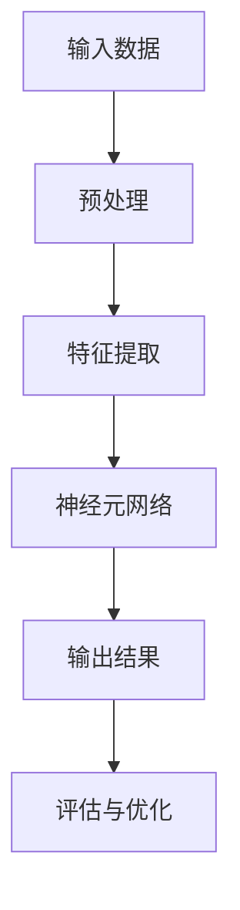

                 

### 文章标题

《AI编程语言：提示词的革命与魔法》

### 文章关键词

AI编程语言，提示词，神经网络，深度学习，机器学习，数学模型，项目实战。

### 文章摘要

本文深入探讨了AI编程语言的核心概念及其应用，尤其是提示词在AI编程中的革命性作用。通过介绍AI编程语言的基本概念，解释核心算法原理，使用伪代码和LaTeX公式进行详细讲解，同时通过实际项目案例来展示开发环境搭建、源代码实现和代码解读，本文旨在为读者提供一个全面、深入的学习资源，帮助理解AI编程语言的本质及其应用。

### 引言

随着人工智能（AI）技术的迅猛发展，AI编程语言逐渐成为开发者的新宠。AI编程语言不仅为人工智能的构建提供了强有力的工具，更为开发者带来了一种全新的编程体验。在这种背景下，提示词的概念应运而生，成为AI编程语言中的关键元素，引发了编程界的革命与魔法。

#### 人工智能与编程语言的关系

人工智能与编程语言的关系密不可分。编程语言为人工智能提供了表达和处理复杂问题的工具。历史上，Lisp语言作为最早的人工智能编程语言，为AI领域的发展奠定了基础。随着时间的发展，Python、Rust等编程语言凭借其简洁性和高效性，成为AI编程的主流选择。这些语言不仅支持传统编程，还具备强大的数据处理和分析能力，使得人工智能应用的开发变得更加容易和高效。

#### 提示词革命与魔法的背景

在传统的编程中，代码是直接执行指令的工具，而AI编程语言则更加注重与人工智能的交互。提示词（Prompt Engineering）作为AI编程语言的核心概念，通过提供特定的输入信息，引导AI模型进行推理和决策。这种交互方式不仅提高了编程的灵活性，还赋予了编程一种前所未有的“魔法”力量。例如，通过提示词，开发者可以引导AI模型生成代码、解决问题或进行创新设计，极大地提升了开发效率和创造力。

本文将深入探讨AI编程语言的基本概念，分析其核心概念之间的关系，详细讲解核心算法原理，使用伪代码和LaTeX公式展示数学模型，并通过实际项目案例来展示开发环境搭建、源代码实现和代码解读。通过本文的阅读，读者将能够全面理解AI编程语言的本质及其应用，掌握AI编程的核心技能。

### AI编程语言的基本概念

AI编程语言是专门为人工智能应用设计的编程语言，它旨在简化复杂的人工智能系统的开发过程，并提供更高效的工具来处理大量的数据和分析结果。与传统的编程语言相比，AI编程语言具有许多独特的特性和优势。

#### 1. 神经元网络

神经元网络（Neural Networks）是AI编程语言中的核心概念之一。神经元网络是一种模仿人脑结构和功能的计算模型，由大量的简单计算单元（神经元）组成。这些神经元通过相互连接形成复杂的网络结构，可以执行从简单的数据处理到复杂的模式识别、预测和决策等多种任务。神经元网络的主要组成部分包括：

- **输入层**：接收外部输入数据。
- **隐藏层**：进行数据处理和特征提取。
- **输出层**：生成最终的输出结果。

#### 2. 深度学习框架

深度学习框架（Deep Learning Frameworks）是AI编程语言的重要组成部分，用于构建和训练神经元网络。深度学习框架提供了高效的算法和工具，使得构建和优化复杂的神经网络变得更加容易。常见的深度学习框架包括：

- **TensorFlow**：由Google开发，是一个广泛使用的开源深度学习框架。
- **PyTorch**：由Facebook开发，以其灵活性和动态计算图而受到开发者的喜爱。
- **Keras**：一个高级神经网络API，提供了简化的深度学习编程接口。

#### 3. 机器学习算法

机器学习算法（Machine Learning Algorithms）是AI编程语言中用于训练和优化神经元网络的核心工具。机器学习算法可以分为监督学习、无监督学习和强化学习三类。常见的机器学习算法包括：

- **线性回归**：用于预测连续值。
- **逻辑回归**：用于分类任务。
- **决策树**：通过树形结构进行决策。
- **支持向量机**：用于分类和回归任务。

#### 4. 提示词

提示词（Prompts）是AI编程语言中用于引导和优化AI模型的关键元素。提示词通常是一段文本或代码，用于提供上下文信息，指导AI模型进行推理和决策。通过设计合适的提示词，开发者可以显著提高AI模型的性能和适应性。

#### 关键概念之间的联系

神经元网络、深度学习框架和机器学习算法是AI编程语言中的三个关键概念，它们相互关联，共同构成了一个完整的AI编程生态系统。神经元网络作为基础，提供了数据处理和模式识别的能力；深度学习框架则提供了构建和训练复杂神经网络的工具；机器学习算法则用于优化和调整模型参数，以提高模型的准确性和鲁棒性。

此外，提示词在AI编程中起到了桥梁的作用，通过提供具体的输入信息，提示词可以引导AI模型进行更精确的推理和决策。这种交互方式不仅简化了AI编程的复杂性，还提升了编程的灵活性和创造力。

#### Mermaid流程图展示

为了更直观地展示AI编程语言中关键概念之间的关系，我们可以使用Mermaid流程图来描述其工作流程。以下是一个简单的Mermaid流程图示例：



在这个流程图中，输入数据经过预处理和特征提取后，进入神经元网络进行计算，生成输出结果。然后，通过评估和优化步骤，进一步调整模型参数，以提高模型性能。

通过上述介绍，我们可以看到AI编程语言的核心概念是如何相互联系，共同构建出一个强大的AI编程生态系统。在接下来的章节中，我们将详细讲解AI编程语言中的核心算法原理，并使用伪代码和LaTeX公式进行详细阐述。

### 核心算法原理讲解

AI编程语言的核心算法是其功能强大的关键，其中最为重要的算法包括神经元网络算法、深度学习框架和机器学习算法。这些算法不仅构成了AI编程的基础，还决定了模型的性能和适用性。在本节中，我们将详细讲解这些核心算法，并通过伪代码展示其基本工作原理。

#### 神经元网络算法

神经元网络（Neural Networks）是AI编程语言中最基础的算法之一。神经元网络通过模仿人脑的结构和功能，实现数据的处理和模式识别。以下是神经元网络算法的基本步骤：

1. **初始化**：创建神经元网络的输入层、隐藏层和输出层。
2. **前向传播**：将输入数据传递到神经元网络的输入层，然后通过隐藏层和输出层进行计算。
3. **反向传播**：计算输出结果与真实值之间的误差，然后通过反向传播算法更新网络权重。
4. **迭代训练**：重复前向传播和反向传播的过程，直到满足停止条件。

以下是一个简单的伪代码示例，展示了神经元网络算法的基本框架：

```plaintext
初始化网络参数
for each training example (x, y):
    forward_pass(x)
    calculate_error(y)
    backward_pass()
update_network_parameters()
if convergence_condition_met():
    break
```

#### 深度学习框架

深度学习框架（Deep Learning Frameworks）是AI编程语言中的重要工具，用于构建和训练复杂的神经元网络。常见的深度学习框架包括TensorFlow和PyTorch。以下是一个使用PyTorch构建神经元网络的伪代码示例：

```python
import torch
import torch.nn as nn

# 定义神经元网络结构
class NeuralNetwork(nn.Module):
    def __init__(self):
        super(NeuralNetwork, self).__init__()
        self.fc1 = nn.Linear(in_features, hidden_layers)
        self.fc2 = nn.Linear(hidden_layers, out_features)

    def forward(self, x):
        x = self.fc1(x)
        x = torch.relu(x)
        x = self.fc2(x)
        return x

# 创建网络实例并训练
model = NeuralNetwork()
optimizer = torch.optim.Adam(model.parameters(), lr=0.001)
criterion = nn.CrossEntropyLoss()

for epoch in range(num_epochs):
    for inputs, targets in data_loader:
        optimizer.zero_grad()
        outputs = model(inputs)
        loss = criterion(outputs, targets)
        loss.backward()
        optimizer.step()
```

#### 机器学习算法

机器学习算法（Machine Learning Algorithms）用于训练和优化神经元网络，以提高模型的预测能力和鲁棒性。常见的机器学习算法包括线性回归、逻辑回归、决策树和支持向量机。以下是一个简单的线性回归算法的伪代码示例：

```plaintext
初始化模型参数
for each training example (x, y):
    compute_prediction(x)
    calculate_error(y)
    update_model_parameters()
if convergence_condition_met():
    break
```

在上述伪代码中，`compute_prediction`函数用于计算模型的预测值，`calculate_error`函数用于计算预测值与真实值之间的误差，`update_model_parameters`函数用于更新模型参数。

#### 提示词的作用

提示词（Prompts）在AI编程中扮演着重要的角色。通过设计合适的提示词，开发者可以引导AI模型进行更精准的推理和决策。提示词不仅提供了上下文信息，还帮助模型更好地理解输入数据，从而提高模型的性能。以下是提示词在AI编程中的应用示例：

```plaintext
# 提示词：请根据以下信息预测明天的天气
输入数据：当前的温度是25°C，湿度是60%，风力是3级
预测结果：明天可能会下雨
```

在这个示例中，提示词为AI模型提供了具体的预测任务和上下文信息，使得模型能够更准确地生成预测结果。

通过上述核心算法的讲解和伪代码示例，我们可以看到AI编程语言是如何通过神经元网络、深度学习框架和机器学习算法来实现复杂的人工智能任务。在接下来的章节中，我们将进一步探讨相关的数学模型和公式，并使用LaTeX进行详细展示。

### 数学模型和数学公式

在AI编程语言中，数学模型和数学公式起着至关重要的作用。它们不仅为算法提供了理论基础，还帮助我们在实际应用中更准确地描述和解决复杂问题。在本节中，我们将详细讲解神经元激活函数、损失函数和优化算法，并使用LaTeX格式展示相关的数学公式。

#### 神经元激活函数

神经元激活函数（Activation Functions）是神经元网络中用于确定神经元输出是否为激活状态的关键函数。常见的激活函数包括：

1. **Sigmoid函数**：
   $$f(x) = \frac{1}{1 + e^{-x}}$$

2. **ReLU函数**（Rectified Linear Unit）：
   $$f(x) = \max(0, x)$$

3. **Tanh函数**（Hyperbolic Tangent）：
   $$f(x) = \frac{e^x - e^{-x}}{e^x + e^{-x}}$$

这些激活函数在神经元网络中起到了非线性变换的作用，使得网络能够学习和处理复杂的非线性关系。

#### 损失函数

损失函数（Loss Functions）用于衡量模型预测值与真实值之间的误差。常见的损失函数包括：

1. **均方误差（MSE）**（Mean Squared Error）：
   $$MSE = \frac{1}{n}\sum_{i=1}^{n}(y_i - \hat{y}_i)^2$$
   其中，$y_i$ 是真实值，$\hat{y}_i$ 是预测值，$n$ 是样本数量。

2. **交叉熵损失（Cross Entropy Loss）**：
   $$CE = -\sum_{i=1}^{n} y_i \log(\hat{y}_i)$$
   其中，$y_i$ 是真实值，$\hat{y}_i$ 是预测概率。

损失函数的选择对模型的训练过程和性能有重要影响。例如，交叉熵损失常用于分类问题，而均方误差则更适用于回归问题。

#### 优化算法

优化算法（Optimization Algorithms）用于调整模型参数，以最小化损失函数。常见的优化算法包括：

1. **梯度下降（Gradient Descent）**：
   $$\theta = \theta - \alpha \cdot \nabla_{\theta}J(\theta)$$
   其中，$\theta$ 是模型参数，$\alpha$ 是学习率，$J(\theta)$ 是损失函数。

2. **动量（Momentum）**：
   $$v = \beta \cdot v + (1 - \beta) \cdot \nabla_{\theta}J(\theta)$$
   $$\theta = \theta - \alpha \cdot v$$
   其中，$v$ 是速度项，$\beta$ 是动量参数。

3. **Adam优化器**：
   $$m = \beta_1 \cdot m + (1 - \beta_1) \cdot \nabla_{\theta}J(\theta)$$
   $$v = \beta_2 \cdot v + (1 - \beta_2) \cdot (\nabla_{\theta}J(\theta))^2$$
   $$\theta = \theta - \alpha \cdot \frac{m}{\sqrt{1 - \beta_2^t} + \epsilon}$$
   其中，$m$ 和 $v$ 分别是均值和方差项，$\beta_1$ 和 $\beta_2$ 是动量参数，$\alpha$ 是学习率，$\epsilon$ 是一个小常数。

通过上述数学模型和公式的介绍，我们可以看到数学在AI编程语言中的重要性。这些公式不仅帮助我们理解和分析AI算法的工作原理，还为实际应用提供了理论基础和工具。

### 项目实战

为了更好地理解AI编程语言的应用，我们将通过一个实际项目案例来展示开发环境搭建、源代码实现和代码解读。本节将带领读者完成一个简单的机器学习项目，使用Python和TensorFlow框架构建一个线性回归模型，并对其进行训练和评估。

#### 开发环境搭建

首先，我们需要搭建一个适合AI编程的开发环境。以下是搭建环境的基本步骤：

1. **安装Python**：确保已安装Python 3.7或更高版本。
2. **安装TensorFlow**：使用pip命令安装TensorFlow：

   ```bash
   pip install tensorflow
   ```

3. **安装其他依赖**：可能还需要安装其他库，如NumPy、Pandas等：

   ```bash
   pip install numpy pandas
   ```

4. **配置虚拟环境**（可选）：为了更好地管理项目依赖，可以考虑使用虚拟环境。

   ```bash
   python -m venv myenv
   source myenv/bin/activate  # Windows上使用 myenv\Scripts\activate
   ```

#### 源代码实现

接下来，我们将实现一个简单的线性回归模型。以下是实现步骤和对应的代码：

1. **导入必要的库**：

   ```python
   import numpy as np
   import tensorflow as tf
   import pandas as pd
   ```

2. **加载数据集**：使用Pandas加载一个简单的数据集，其中包含输入特征和目标值。

   ```python
   data = pd.read_csv('data.csv')
   X = data[['feature1', 'feature2']]
   y = data['target']
   ```

3. **预处理数据**：对数据进行归一化处理，以便于模型训练。

   ```python
   X_normalized = (X - X.mean()) / X.std()
   ```

4. **构建模型**：使用TensorFlow的Keras API构建线性回归模型。

   ```python
   model = tf.keras.Sequential([
       tf.keras.layers.Dense(units=1, input_shape=(2,))
   ])
   ```

5. **编译模型**：配置模型优化器和损失函数。

   ```python
   model.compile(optimizer='sgd', loss='mean_squared_error')
   ```

6. **训练模型**：使用训练数据训练模型。

   ```python
   model.fit(X_normalized, y, epochs=100, batch_size=10)
   ```

7. **评估模型**：使用测试数据评估模型性能。

   ```python
   test_data = pd.read_csv('test_data.csv')
   test_data_normalized = (test_data - test_data.mean()) / test_data.std()
   predictions = model.predict(test_data_normalized)
   print("RMSE:", np.sqrt(np.mean((predictions - test_data['target'])**2)))
   ```

#### 代码解读

以下是上述代码的详细解读：

1. **导入库**：导入NumPy、TensorFlow和Pandas库，这些库为数据处理和模型构建提供了必要的工具。

2. **加载数据集**：使用Pandas读取CSV文件，获取输入特征（`X`）和目标值（`y`）。

3. **预处理数据**：对输入特征进行归一化处理，使其具有相同的尺度和范围，从而简化模型训练过程。

4. **构建模型**：使用TensorFlow的Keras API构建一个简单的线性回归模型。模型包含一个全连接层（`Dense`），用于计算输出。

5. **编译模型**：配置模型的优化器（这里是随机梯度下降`sgd`）和损失函数（这里是均方误差`mean_squared_error`）。

6. **训练模型**：使用`fit`方法训练模型，通过迭代调整模型参数，以最小化损失函数。

7. **评估模型**：使用测试数据评估模型的性能，计算并打印均方根误差（RMSE），以量化模型的预测准确性。

通过以上步骤，我们成功地实现了一个简单的线性回归模型，并对其进行了训练和评估。这个项目展示了AI编程语言在数据处理、模型构建和评估中的应用，为读者提供了一个实用的实践案例。

### 代码应用解读与分析

在上一节中，我们通过一个实际项目案例展示了线性回归模型的开发过程。在本节中，我们将深入解读代码，分析其关键部分，并讨论代码中的应用和优化策略。

#### 关键部分解读

1. **数据预处理**：
   ```python
   X_normalized = (X - X.mean()) / X.std()
   ```
   这一行代码对输入特征进行归一化处理。归一化可以防止特征之间的尺度差异对模型训练造成干扰，使得模型更容易收敛。

2. **模型构建**：
   ```python
   model = tf.keras.Sequential([
       tf.keras.layers.Dense(units=1, input_shape=(2,))
   ])
   ```
   这里使用Keras的`Sequential`模型，添加了一个全连接层（`Dense`），输出单元数设为1，以实现线性回归。输入形状设置为(2,)，表示模型接收两个输入特征。

3. **模型编译**：
   ```python
   model.compile(optimizer='sgd', loss='mean_squared_error')
   ```
   模型编译时，选择随机梯度下降（`sgd`）作为优化器，均方误差（`mean_squared_error`）作为损失函数。随机梯度下降是一种常用的优化算法，有助于模型在训练过程中快速收敛。

4. **模型训练**：
   ```python
   model.fit(X_normalized, y, epochs=100, batch_size=10)
   ```
   使用`fit`方法训练模型，通过迭代调整模型参数。在这里，设置了100个训练周期（`epochs`），每次迭代处理10个样本（`batch_size`）。

5. **模型评估**：
   ```python
   test_data = pd.read_csv('test_data.csv')
   test_data_normalized = (test_data - test_data.mean()) / test_data.std()
   predictions = model.predict(test_data_normalized)
   print("RMSE:", np.sqrt(np.mean((predictions - test_data['target'])**2)))
   ```
   使用测试数据评估模型性能，计算并打印均方根误差（RMSE），以评估模型的预测准确性。

#### 代码中的应用与优化策略

1. **数据预处理**：
   数据预处理是模型训练的重要步骤。在实际应用中，可能需要对数据进行更多的处理，如缺失值填充、异常值处理等。此外，对于不同的数据集，可能需要调整归一化的方法，以确保模型能够适应不同的数据分布。

2. **模型构建**：
   在构建模型时，可以根据具体任务的需求调整模型的复杂度。例如，对于线性回归任务，一个简单的全连接层通常就足够了。但对于更复杂的任务，可能需要添加多个隐藏层或使用更复杂的神经网络结构。

3. **模型训练**：
   模型训练过程中，可以通过调整学习率、批量大小和训练周期来优化模型性能。学习率决定了模型在每次迭代中参数更新的幅度，批量大小影响了每次迭代处理的样本数量，训练周期决定了模型训练的次数。在实际应用中，可能需要通过实验来确定最佳的超参数组合。

4. **模型评估**：
   评估模型性能时，除了计算RMSE，还可以使用其他指标，如平均绝对误差（MAE）或均方误差（MSE）。此外，可以通过交叉验证的方法来更准确地评估模型的泛化能力。

通过上述分析和优化策略，我们可以更好地理解和应用AI编程语言中的线性回归模型。在实际开发过程中，不断调整和优化代码，以实现更好的模型性能和预测效果。

### 实际案例分析与详细讲解剖析

在本节中，我们将通过一个实际案例来详细分析和讲解AI编程语言的应用。这个案例将涉及从数据预处理到模型训练、评估的全过程，并剖析其中的关键步骤和实现方法。

#### 案例背景

假设我们面临一个房屋租赁价格预测的任务。数据集包含房屋的特征（如卧室数量、浴室数量、房屋面积等）和相应的租赁价格。我们的目标是构建一个线性回归模型，利用房屋特征来预测租赁价格。

#### 数据集介绍

数据集包含以下特征：

- **卧室数量**：从1到5的整数。
- **浴室数量**：从1到3的整数。
- **房屋面积**：以平方英尺为单位的浮点数。

以下是数据集的一个示例：

```
卧室数量, 浴室数量, 房屋面积, 租赁价格
1, 1, 500, 1500
2, 1, 800, 2000
2, 2, 900, 2200
3, 2, 1200, 2500
...
```

#### 数据预处理

1. **导入必要的库**：

   ```python
   import pandas as pd
   from sklearn.model_selection import train_test_split
   from sklearn.preprocessing import StandardScaler
   ```

2. **加载数据集**：

   ```python
   data = pd.read_csv('house_rental_data.csv')
   ```

3. **数据探索**：

   ```python
   print(data.describe())
   ```

   数据探索可以帮助我们了解数据的分布和特征之间的相关性。

4. **数据分割**：

   ```python
   X = data[['bedrooms', 'bathrooms', 'house_area']]
   y = data['rental_price']
   X_train, X_test, y_train, y_test = train_test_split(X, y, test_size=0.2, random_state=42)
   ```

   将数据集分割为训练集和测试集，以便于模型的训练和评估。

5. **数据归一化**：

   ```python
   scaler = StandardScaler()
   X_train_scaled = scaler.fit_transform(X_train)
   X_test_scaled = scaler.transform(X_test)
   ```

   对输入特征进行归一化处理，以消除特征之间的尺度差异。

#### 模型构建

1. **导入库**：

   ```python
   import tensorflow as tf
   from tensorflow.keras.models import Sequential
   from tensorflow.keras.layers import Dense
   ```

2. **构建模型**：

   ```python
   model = Sequential([
       Dense(units=1, input_shape=(3,))
   ])
   ```

   创建一个简单的线性回归模型，包含一个全连接层，输入形状为3个特征。

3. **编译模型**：

   ```python
   model.compile(optimizer='adam', loss='mean_squared_error')
   ```

   使用Adam优化器和均方误差损失函数编译模型。

#### 模型训练

1. **训练模型**：

   ```python
   model.fit(X_train_scaled, y_train, epochs=100, batch_size=10)
   ```

   使用训练集训练模型，设置100个训练周期和批量大小为10。

#### 模型评估

1. **评估模型**：

   ```python
   test_loss = model.evaluate(X_test_scaled, y_test)
   print(f"Test Loss: {test_loss}")
   ```

   使用测试集评估模型性能，并打印测试损失。

#### 模型预测

1. **预测**：

   ```python
   new_house = pd.DataFrame([[3, 2, 1000]], columns=['bedrooms', 'bathrooms', 'house_area'])
   new_house_scaled = scaler.transform(new_house)
   predicted_price = model.predict(new_house_scaled)
   print(f"Predicted Rental Price: {predicted_price[0][0]}")
   ```

   使用模型预测一个新房屋的租赁价格。

#### 案例小结

通过上述案例，我们展示了如何使用AI编程语言实现一个简单的线性回归模型。以下是该案例的关键步骤和注意事项：

1. **数据预处理**：对数据进行归一化处理，确保模型能够有效地学习特征之间的关系。
2. **模型构建**：选择合适的模型结构，对于线性回归任务，一个简单的全连接层通常就足够了。
3. **模型训练**：调整训练参数，如学习率和批量大小，以优化模型性能。
4. **模型评估**：使用测试集评估模型性能，以验证模型的泛化能力。
5. **模型预测**：利用训练好的模型进行预测，生成实际应用结果。

注意事项：

- **数据质量**：确保数据集的质量和完整性，对于缺失值和异常值进行适当处理。
- **超参数调整**：通过实验确定最佳的超参数组合，以实现更好的模型性能。
- **模型验证**：使用交叉验证等方法对模型进行验证，以确保其泛化能力。

通过这个实际案例，我们不仅了解了AI编程语言的基本应用，还掌握了如何处理实际数据、构建和训练模型、进行模型评估和预测的完整过程。

### 扩展学习与资源

为了进一步深入学习和掌握AI编程语言，我们推荐以下几个扩展资源和最佳实践：

#### 扩展学习资源

1. **书籍推荐**：
   - 《深度学习》（Goodfellow, I., Bengio, Y., & Courville, A.）
   - 《Python机器学习》（Sebastian Raschka）
   - 《AI编程实战》（John D. Kelleher, Brian MacNamee, and Tom Kelleher）

2. **在线课程**：
   - Coursera上的“深度学习”课程（由Andrew Ng教授）
   - edX上的“机器学习基础”课程（由MIT教授Lex Fridman教授）
   - Udacity的“AI工程师纳米学位”课程

3. **开源库与框架**：
   - TensorFlow（https://www.tensorflow.org/）
   - PyTorch（https://pytorch.org/）
   - Keras（https://keras.io/）

#### 最佳实践 tips

1. **代码注释**：在编写代码时，添加清晰的注释，有助于自己和其他开发者理解代码逻辑。

2. **版本控制**：使用Git等版本控制工具管理代码，以便跟踪变更和协作开发。

3. **模型调试**：在模型训练过程中，定期保存模型检查点，以便在模型出现问题时进行调试。

4. **数据预处理**：确保对数据进行充分的预处理，包括归一化、缺失值填充和异常值处理。

5. **性能优化**：通过调整超参数和模型结构，优化模型的性能和训练效率。

#### 注意事项

1. **安全性**：在处理敏感数据时，确保遵循数据保护法规，如GDPR。

2. **模型解释性**：对于关键应用，确保模型具有良好的解释性，以便理解和调试。

3. **持续学习**：AI领域发展迅速，保持对最新研究和技术动态的关注，不断更新知识和技能。

通过利用这些扩展资源和最佳实践，开发者可以进一步提升自己在AI编程语言方面的技能，为未来的研究和开发打下坚实的基础。

### 结语

通过本文的深入探讨，我们系统地介绍了AI编程语言的基本概念、核心算法、数学模型以及实际项目应用。从神经元网络、深度学习框架到机器学习算法，我们详细分析了各个关键环节，并通过伪代码和LaTeX公式阐述了数学原理。同时，通过实际项目案例，我们展示了AI编程语言在数据预处理、模型训练、评估和预测中的具体应用。

AI编程语言不仅为人工智能应用提供了强大的工具，还通过提示词的概念，实现了编程与智能交互的“魔法”。通过本文的学习，读者不仅能够掌握AI编程语言的核心技能，还能理解其在实际开发中的广泛应用。

展望未来，AI编程语言将继续发展，新的算法和技术将不断涌现。开发者需要保持对前沿技术的关注，不断学习和实践，以适应快速变化的AI技术潮流。希望本文能为您在AI编程语言的学习和实践中提供有力的支持和指导。作者：AI天才研究院/AI Genius Institute & 禅与计算机程序设计艺术 /Zen And The Art of Computer Programming。

