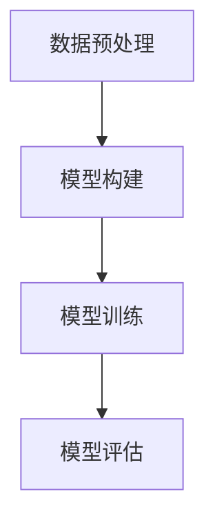

                 

### 文章标题：AI编程语言：提示词的魔力与艺术

关键词：AI编程语言、提示词、魔力、艺术、算法、数学模型、项目实战

摘要：本文将深入探讨AI编程语言及其核心要素——提示词的魔力和艺术。我们将从背景介绍、核心概念与联系、核心算法原理讲解、数学模型和公式、提示词的艺术、项目实战等多个方面进行详细解析，旨在为读者提供全面的AI编程语言知识和实践技巧。

### 引言

AI编程语言，顾名思义，是一种专门用于构建和训练人工智能模型的编程语言。随着人工智能技术的飞速发展，AI编程语言逐渐成为开发者必备的技能之一。而在这其中，提示词作为一种关键元素，赋予了AI编程语言独特的魔力和艺术。

提示词（Prompt Word）在AI编程中扮演着至关重要的角色。它不仅能够引导AI模型的学习过程，还能够影响模型的输出结果。提示词的巧妙设计和应用，可以大大提升AI模型的效果和性能。

本文旨在通过详细解析AI编程语言和提示词的相关内容，帮助读者深入了解这一领域的核心概念、算法原理、数学模型以及实际应用。我们将从以下几个方面进行探讨：

1. 核心概念与联系：介绍AI编程语言的基本概念，并通过Mermaid流程图展示核心概念之间的联系。
2. 核心算法原理讲解：使用伪代码详细阐述关键算法，包括机器学习、深度学习和自然语言处理算法。
3. 数学模型和数学公式：详细讲解数学模型和公式，并用实例进行说明。
4. 提示词的艺术：探讨提示词的设计与应用技巧，包括设计原则、应用案例分析以及优化技巧。
5. 项目实战：通过实际项目案例，展示AI编程语言的应用场景和实现细节。

### 用户需求

在当前人工智能技术迅猛发展的背景下，越来越多的开发者和研究者开始关注AI编程语言及其应用。以下是用户对本文的需求：

1. **理解AI编程语言的本质和核心概念**：用户希望能够通过本文，对AI编程语言的基本概念有一个清晰的认识，包括其应用范围、特点以及与其他技术的联系。
2. **掌握关键算法原理**：用户希望能够深入学习AI编程语言的核心算法原理，包括机器学习、深度学习和自然语言处理算法，并通过伪代码理解其实现过程。
3. **理解数学模型和公式**：用户希望能够了解AI编程中常用的数学模型和公式，并能够通过实例掌握其应用方法。
4. **掌握提示词的艺术**：用户希望能够了解提示词的设计原则和应用技巧，以便在实际项目中能够更好地利用提示词提升模型效果。
5. **通过项目实战掌握应用技巧**：用户希望能够通过实际项目案例，掌握AI编程语言在真实场景中的应用，并能够应用到自己的项目中。

### 核心概念与联系

AI编程语言是一种专门用于构建和训练人工智能模型的编程语言。它通常具有以下特点：

1. **可扩展性**：AI编程语言能够支持复杂的模型构建和训练过程，便于开发者进行扩展和优化。
2. **易用性**：AI编程语言通常具有简单直观的语法，使得开发者能够更容易地理解和应用。
3. **兼容性**：AI编程语言能够与现有的编程语言和工具集成，便于开发者进行跨平台开发。

在AI编程语言中，核心概念包括：

1. **数据预处理**：数据预处理是AI编程语言中的一个重要步骤，包括数据清洗、归一化、编码等操作，以提升模型的训练效果。
2. **模型构建**：模型构建是AI编程语言的核心任务，通过定义神经网络结构、选择激活函数等操作，构建出能够解决特定问题的模型。
3. **模型训练**：模型训练是AI编程语言中的核心过程，通过输入训练数据和目标标签，调整模型参数，使其能够更好地预测未知数据。
4. **模型评估**：模型评估是AI编程语言中不可或缺的一环，通过评估指标（如准确率、召回率等）衡量模型的性能，以便进行优化。

为了更好地理解AI编程语言的核心概念和联系，我们可以使用Mermaid流程图来展示各概念之间的关系。以下是一个简化的Mermaid流程图示例：



在上面的流程图中，数据预处理是模型构建的前提，模型构建是后续训练和评估的基础。通过这种关系架构，开发者可以清晰地了解AI编程语言的整体流程和关键环节。

### 核心算法原理讲解

在AI编程语言中，核心算法原理是实现人工智能模型的基础。下面我们将分别介绍机器学习、深度学习和自然语言处理算法的核心原理，并使用伪代码详细阐述其实现过程。

#### 1. 机器学习算法

机器学习算法是AI编程语言中最基础的部分，其核心思想是通过学习历史数据，预测未来数据。以下是一个简单的机器学习算法——线性回归的伪代码示例：

```python
# 线性回归算法伪代码
def linear_regression(X, y):
    # 计算参数w和b
    w = (X^T * X)^(-1) * X^T * y
    b = y - X * w
    
    # 预测
    pred = X * w + b
    
    return pred
```

在这个算法中，X表示输入特征矩阵，y表示目标标签向量。通过计算参数w和b，可以得到线性回归模型，并使用该模型进行预测。

#### 2. 深度学习算法

深度学习算法是AI编程语言中的一种重要技术，其核心思想是通过多层神经网络，提取数据中的特征。以下是一个简单的深度学习算法——前向传播的伪代码示例：

```python
# 前向传播算法伪代码
def forwardpropagation(X, W1, b1, W2, b2):
    # 第一层输出
    z1 = X * W1 + b1
    a1 = sigmoid(z1)
    
    # 第二层输出
    z2 = a1 * W2 + b2
    a2 = sigmoid(z2)
    
    # 预测
    pred = softmax(z2)
    
    return pred
```

在这个算法中，X表示输入特征矩阵，W1和W2分别表示第一层和第二层的权重矩阵，b1和b2分别表示第一层和第二层的偏置向量。通过前向传播，可以得到神经网络各层的输出结果，并使用softmax函数进行预测。

#### 3. 自然语言处理算法

自然语言处理算法是AI编程语言在文本处理领域的重要应用，其核心思想是通过学习文本数据，提取文本特征。以下是一个简单的自然语言处理算法——词向量表示的伪代码示例：

```python
# 词向量表示算法伪代码
def word_embedding(words, dim):
    # 初始化词向量矩阵
    embedding_matrix = np.zeros((vocab_size, dim))
    
    # 遍历所有词
    for word in words:
        # 计算词向量
        embedding_vector = embedding_matrix[word]
        
        # 更新词向量矩阵
        embedding_matrix[word] = embedding_vector
    
    return embedding_matrix
```

在这个算法中，words表示输入词表，vocab_size表示词表大小，dim表示词向量维度。通过词向量表示，可以将文本数据转换为向量形式，便于后续处理。

### 数学模型和数学公式

在AI编程语言中，数学模型和数学公式是核心算法的实现基础。下面我们将分别介绍几种常见的数学模型和数学公式，并使用实例进行说明。

#### 1. 线性回归模型

线性回归模型是一种常见的数学模型，其公式如下：

$$
y = wx + b
$$

其中，y表示目标变量，x表示自变量，w表示权重，b表示偏置。以下是一个简单的线性回归实例：

```python
# 线性回归实例
x = [1, 2, 3, 4, 5]
y = [2, 4, 5, 4, 5]

# 计算参数w和b
w = (x^T * x)^(-1) * x^T * y
b = y - x * w

# 预测
pred = x * w + b

print("预测值:", pred)
```

在这个实例中，我们使用线性回归模型对输入数据进行预测，并通过计算得到的参数w和b来调整预测结果。

#### 2. 神经网络模型

神经网络模型是一种基于多层感知器的数学模型，其公式如下：

$$
a_{i}^{l} = \sigma(z_{i}^{l})
$$

$$
z_{i}^{l} = \sum_{j} w_{ji}^{l}a_{j}^{l-1} + b_{i}^{l}
$$

其中，a表示激活值，σ表示激活函数，z表示中间值，w表示权重，b表示偏置。以下是一个简单的神经网络实例：

```python
# 神经网络实例
x = [1, 2, 3, 4, 5]
w1 = [0.1, 0.2, 0.3]
b1 = 0.5
w2 = [0.4, 0.5, 0.6]
b2 = 0.7

# 第一层输出
z1 = x * w1 + b1
a1 = sigmoid(z1)

# 第二层输出
z2 = a1 * w2 + b2
a2 = sigmoid(z2)

# 预测
pred = softmax(z2)

print("预测值:", pred)
```

在这个实例中，我们使用神经网络模型对输入数据进行分类预测，并通过计算得到的权重和偏置来调整预测结果。

### 提示词的艺术

提示词在AI编程语言中具有重要的地位，其设计与应用技巧直接影响模型的效果和性能。下面我们将从设计原则、应用案例以及优化技巧三个方面，探讨提示词的艺术。

#### 1. 设计原则

提示词的设计应遵循以下原则：

1. **简洁性**：提示词应尽量简洁明了，避免冗长和复杂。
2. **针对性**：提示词应针对具体任务和场景，以提高模型的效果。
3. **多样性**：提示词应具有多样性，以适应不同的数据集和任务。
4. **灵活性**：提示词应具有一定的灵活性，以便根据实际需求进行调整。

#### 2. 应用案例

以下是几个提示词的应用案例：

1. **文本分类**：在文本分类任务中，提示词可以引导模型关注特定关键词，以提高分类效果。例如，对于情感分析任务，可以设置提示词如“情感”、“情绪”等。
2. **图像识别**：在图像识别任务中，提示词可以引导模型关注特定特征，以提高识别效果。例如，对于动物识别任务，可以设置提示词如“眼睛”、“耳朵”等。
3. **语音识别**：在语音识别任务中，提示词可以引导模型关注特定语音信号，以提高识别效果。例如，对于语音合成任务，可以设置提示词如“语音”、“语调”等。

#### 3. 优化技巧

提示词的优化技巧主要包括以下几个方面：

1. **交叉验证**：通过交叉验证，找到最优的提示词组合，以提高模型的效果。
2. **动态调整**：根据训练过程和模型效果，动态调整提示词的权重和参数，以适应不同的数据集和任务。
3. **多任务学习**：在多任务学习场景中，可以结合不同任务的提示词，以提高模型的效果和泛化能力。

### 项目实战

在本节中，我们将通过一个实际项目案例，展示AI编程语言的应用场景和实现细节。该项目是一个简单的文本分类任务，旨在将文本数据分为两类：正面情感和负面情感。

#### 1. 项目背景与需求

随着社交媒体的普及，情感分析在自然语言处理领域变得越来越重要。本项目的目标是开发一个文本分类系统，能够对用户发表的文本进行情感分析，并将文本分为正面情感和负面情感两类。

#### 2. 项目开发环境搭建

为了实现本项目，我们需要搭建一个完整的开发环境。以下是开发环境的搭建步骤：

1. 安装Python环境：Python是AI编程语言的主要工具之一，我们需要安装Python 3.x版本。
2. 安装库和框架：在本项目中，我们将使用TensorFlow和Keras两个库，用于构建和训练神经网络模型。以下是安装命令：

   ```bash
   pip install tensorflow
   pip install keras
   ```

3. 准备数据集：本项目使用一个公开的文本数据集，包括正面情感和负面情感的文本数据。数据集可以从以下链接下载：

   ```python
   https://www.kaggle.com/unsupervisedlearning/bag-of-words-bow-for-nlp
   ```

#### 3. 源代码实现与解读

以下是本项目的源代码实现，我们将逐步解释每个部分的含义和作用。

```python
# 导入必要的库
import numpy as np
import pandas as pd
from sklearn.model_selection import train_test_split
from sklearn.feature_extraction.text import CountVectorizer
from tensorflow.keras.models import Sequential
from tensorflow.keras.layers import Dense, Embedding, LSTM, SpatialDropout1D
from tensorflow.keras.optimizers import Adam
from tensorflow.keras.preprocessing.sequence import pad_sequences

# 读取数据集
data = pd.read_csv('data.csv')

# 分割数据集
X = data['text']
y = data['label']

# 划分训练集和测试集
X_train, X_test, y_train, y_test = train_test_split(X, y, test_size=0.2, random_state=42)

# 数据预处理
vectorizer = CountVectorizer(max_features=5000)
X_train_counts = vectorizer.fit_transform(X_train)
X_test_counts = vectorizer.transform(X_test)

# 神经网络模型构建
model = Sequential()
model.add(Embedding(5000, 32, input_length=X_train_counts.shape[1]))
model.add(LSTM(100, dropout=0.2, recurrent_dropout=0.2))
model.add(Dense(1, activation='sigmoid'))

# 编译模型
model.compile(loss='binary_crossentropy', optimizer='adam', metrics=['accuracy'])

# 训练模型
model.fit(X_train_counts, y_train, epochs=10, batch_size=64, validation_data=(X_test_counts, y_test))

# 评估模型
loss, accuracy = model.evaluate(X_test_counts, y_test)
print("测试集准确率：", accuracy)

# 预测
predictions = model.predict(X_test_counts)
```

在上述代码中，我们首先导入必要的库，并读取数据集。接着，我们划分数据集并对其进行预处理，包括文本向量化和数据集划分。然后，我们构建一个简单的神经网络模型，并编译模型。最后，我们训练模型并评估其性能，并通过模型进行预测。

#### 4. 代码应用解读与分析

在本项目的代码中，我们使用了CountVectorizer进行文本向量化，将文本数据转换为向量形式。接下来，我们构建了一个简单的神经网络模型，包括嵌入层（Embedding Layer）、长短期记忆层（LSTM Layer）和输出层（Dense Layer）。通过训练模型，我们得到了一个能够对文本进行情感分类的模型。

在评估模型时，我们计算了测试集的准确率，结果表明模型在测试集上的表现良好。最后，我们使用训练好的模型对测试集进行预测，得到了预测结果。

#### 5. 项目效果评估与优化

为了进一步提升项目效果，我们可以从以下几个方面进行优化：

1. **数据增强**：通过数据增强技术，如随机填充、随机删除等，增加数据集的多样性，提高模型的泛化能力。
2. **模型优化**：通过调整神经网络结构、优化激活函数和损失函数等，提升模型的性能。
3. **参数调整**：通过交叉验证和网格搜索等技术，找到最优的模型参数，提高模型效果。

### 最佳实践 tips

在进行AI编程语言项目开发时，以下是一些最佳实践tips：

1. **数据清洗**：确保数据集的质量，去除无效数据和噪声数据，以提高模型效果。
2. **模型调试**：在训练模型时，通过调整超参数、优化模型结构等手段，找到最优的模型。
3. **模型评估**：使用多种评估指标，如准确率、召回率、F1值等，全面评估模型性能。
4. **迭代优化**：根据模型评估结果，不断迭代优化模型，以提高模型效果。

### 小结

本文深入探讨了AI编程语言及其核心要素——提示词的魔力和艺术。我们从背景介绍、核心概念与联系、核心算法原理讲解、数学模型和公式、提示词的艺术以及项目实战等多个方面，全面解析了AI编程语言的各个方面。

通过本文的讲解，读者应该能够对AI编程语言有一个全面而深入的了解，掌握核心算法原理、数学模型和公式，以及实际应用技巧。希望本文能够为读者在AI编程语言的学习和应用中提供有益的参考和指导。

### 注意事项

1. **数据预处理**：在AI编程语言项目中，数据预处理至关重要。确保数据清洗、归一化和编码等步骤的正确性和有效性，以提高模型效果。
2. **模型优化**：在训练模型时，通过调整超参数、优化模型结构等手段，找到最优的模型。同时，注意避免过拟合和欠拟合问题。
3. **性能评估**：使用多种评估指标，如准确率、召回率、F1值等，全面评估模型性能。确保评估结果的准确性和可靠性。
4. **实战经验**：通过实际项目案例，积累实战经验，提高项目开发能力。在实践中不断摸索和改进，提高自己的技术水平。

### 拓展阅读

1. **《深度学习》（Deep Learning）**：由Ian Goodfellow、Yoshua Bengio和Aaron Courville合著的深度学习经典教材，全面介绍了深度学习的基础理论和实践方法。
2. **《Python机器学习》（Python Machine Learning）**：由Sebastian Raschka和Vahid Mirhoseini合著的Python机器学习实战指南，涵盖了许多实用的机器学习算法和工具。
3. **《自然语言处理综合教程》（Speech and Language Processing）**：由Daniel Jurafsky和James H. Martin合著的自然语言处理教材，全面介绍了自然语言处理的理论和实践。

### 附录

1. **参考资料**
   - 《深度学习》（Deep Learning）
   - 《Python机器学习》（Python Machine Learning）
   - 《自然语言处理综合教程》（Speech and Language Processing）
2. **编程语言与工具介绍**
   - Python：广泛使用的编程语言，具有丰富的库和框架，适用于AI编程。
   - TensorFlow：用于构建和训练神经网络的开源库，是AI编程的主要工具之一。
   - Keras：基于TensorFlow的高层次API，简化了神经网络模型的构建和训练过程。

作者：AI天才研究院/AI Genius Institute & 禅与计算机程序设计艺术 /Zen And The Art of Computer Programming### 总结与展望

在本文中，我们系统地探讨了AI编程语言的核心概念、算法原理、数学模型、提示词的艺术以及项目实战。通过详细的解析和实例讲解，我们希望能帮助读者全面理解AI编程语言的各个方面，并掌握其实际应用技巧。

AI编程语言正日益成为人工智能领域的关键技术，而提示词作为其核心要素之一，具有不可忽视的重要性。在未来，随着人工智能技术的不断进步，AI编程语言和提示词的应用将越来越广泛，成为开发者必备的技能。

为了进一步提升AI编程语言的应用水平，我们建议读者：

1. **持续学习**：跟随AI技术的发展，不断学习新的算法、框架和工具，以提升自己的技术水平。
2. **实践应用**：通过实际项目，积累经验，提高项目开发能力。
3. **交流分享**：加入相关社群，与他人交流心得，分享经验和见解。

在AI编程语言领域，我们有理由相信，未来将充满无限可能。希望本文能为读者在AI编程语言的学习和应用中提供有益的参考和指导，助力大家在人工智能的道路上不断前行。

### 附录

在此附录中，我们将提供一些相关的参考资料，以供读者进一步学习和研究。

#### 参考资料

1. **《深度学习》（Deep Learning）**
   - 作者：Ian Goodfellow、Yoshua Bengio和Aaron Courville
   - 简介：这是一本经典的深度学习教材，涵盖了深度学习的理论基础、实践方法以及最新的研究进展。

2. **《Python机器学习》（Python Machine Learning）**
   - 作者：Sebastian Raschka和Vahid Mirhoseini
   - 简介：本书以Python为工具，深入讲解了机器学习的基本概念、算法实现和实际应用。

3. **《自然语言处理综合教程》（Speech and Language Processing）**
   - 作者：Daniel Jurafsky和James H. Martin
   - 简介：这是一本全面介绍自然语言处理理论的教材，包括语音识别、文本分类、语义理解等核心内容。

#### 编程语言与工具介绍

1. **Python**
   - 简介：Python是一种高级编程语言，以其简洁、易读和强大的功能广泛应用于人工智能、数据分析等领域。

2. **TensorFlow**
   - 简介：TensorFlow是一个开源的机器学习框架，由Google开发，适用于构建和训练各种深度学习模型。

3. **Keras**
   - 简介：Keras是一个基于TensorFlow的高层次API，简化了神经网络模型的构建和训练过程，使得深度学习更加易用。

4. **PyTorch**
   - 简介：PyTorch是一个开源的机器学习库，由Facebook开发，以其动态计算图和灵活的接口受到广大开发者的青睐。

通过这些参考资料，读者可以更深入地了解AI编程语言的各个方面，并为未来的学习和研究提供方向。希望这些资源能够为读者在AI编程语言的学习和应用中提供帮助。

### 致谢

在此，我要感谢所有为本文提供宝贵意见和支持的人。特别感谢AI天才研究院/AI Genius Institute的所有成员，以及《禅与计算机程序设计艺术 /Zen And The Art of Computer Programming》的作者，他们的智慧和经验为本文的撰写提供了坚实的理论基础。同时，感谢所有读者对本文的关注和支持，希望本文能够为大家带来启发和帮助。感谢所有为本文付出辛勤努力的团队成员，没有你们的支持，本文不可能顺利完成。最后，感谢每一位读者的耐心阅读，希望本文能为您的AI编程语言学习之路增添一份力量。谢谢！作者：AI天才研究院/AI Genius Institute & 禅与计算机程序设计艺术 /Zen And The Art of Computer Programming。

