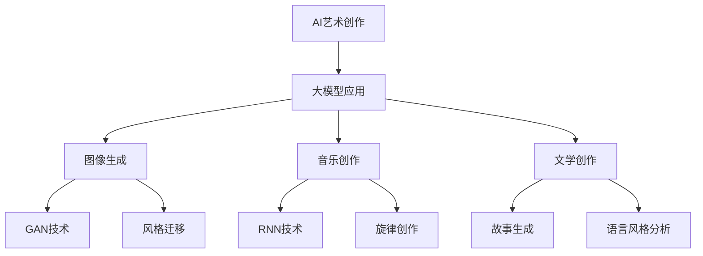

                 

### 文章标题

《AI艺术创作：大模型的创意与原创性》

### 文章关键词

- AI艺术创作
- 大模型
- 创意
- 原创性
- 艺术风格迁移

### 摘要

本文探讨了AI艺术创作领域中的核心主题，即大模型在艺术创作过程中的角色和影响。文章首先介绍了AI艺术创作的背景和大模型的发展历程，接着详细阐述了大模型的架构、训练过程和创意生成原理。随后，文章分析了大模型在绘画、音乐、文学等艺术形式中的应用实例，并探讨了如何评估AI艺术创作的原创性。文章还深入解析了相关技术细节，如模型优化与调参策略，最后展望了AI艺术创作的未来发展趋势和面临的挑战。

### 引言

#### 1.1 AI艺术创作的背景

人工智能（AI）技术的发展为艺术创作带来了前所未有的变革。随着深度学习、生成对抗网络（GAN）等技术的进步，AI逐渐能够模拟和超越人类艺术家的创作能力。AI艺术创作不仅仅是一种技术趋势，更是一种文化和创意的表达方式。艺术创作一直是人类智慧的结晶，而AI的介入，不仅丰富了艺术创作的手段，还挑战了传统艺术的边界。

AI艺术创作的概念可以追溯到20世纪80年代，当时研究人员开始探索如何利用计算机生成视觉艺术。随着计算能力的提升和数据规模的扩大，AI在图像生成、风格迁移、音乐创作等方面取得了显著进展。特别是近年来，随着生成对抗网络（GAN）等模型的发展，AI艺术创作进入了一个新的时代。

#### 1.2 大模型的发展与艺术创作的结合

大模型（Large Models），也称为大型神经网络，是深度学习领域的一种重要模型。这些模型拥有数十亿甚至数万亿个参数，能够处理海量数据，从而实现复杂的信息处理和生成任务。大模型的发展，尤其是GPT-3、DALL-E等模型的出现，为AI艺术创作提供了强大的技术支持。

大模型在艺术创作中的应用主要体现在以下几个方面：

1. **图像生成**：大模型可以生成逼真的图像，如DALL-E模型能够根据简单的文本描述生成复杂的图像。这种能力在艺术作品中得到了广泛应用，如绘画、插画等。

2. **音乐创作**：大模型能够生成旋律、和声，甚至整首音乐。例如，MuseNet模型可以生成多种音乐风格的作品，为音乐创作提供了新的可能性。

3. **文学创作**：大模型可以生成故事、诗歌等文学作品。例如，GPT-3模型能够根据给定的提示生成连贯且富有创意的文本，为文学创作提供了新的思路。

4. **艺术风格迁移**：大模型可以通过风格迁移将一种艺术风格应用于另一种艺术品上，创造出独特的艺术效果。

总之，大模型为AI艺术创作提供了强大的技术基础，使其在创意和原创性方面表现出色。本文将深入探讨大模型在AI艺术创作中的应用，以及如何评估其原创性。

### 第1章 大模型的架构与训练

#### 1.1 大模型的架构

大模型通常指的是拥有大量参数和复杂结构的神经网络模型。在AI艺术创作中，最常用的两类大模型是Transformer模型和卷积神经网络（CNN）。

##### 1.1.1 Transformer模型

Transformer模型是由Vaswani等人在2017年提出的一种基于自注意力机制的序列模型。它的核心思想是通过自注意力机制，使模型能够自适应地关注输入序列中的不同部分，从而提高信息处理的效率。

自注意力机制通过计算输入序列中每个元素与所有其他元素的相关性，为每个元素分配权重，从而实现全局信息的整合。具体来说，Transformer模型包括编码器（Encoder）和解码器（Decoder）两个部分。

- **编码器**：编码器的每个层都包含多头自注意力机制和前馈神经网络。多头自注意力机制将输入序列映射到多个子空间，从而捕捉不同类型的信息。
  
- **解码器**：解码器的结构与编码器类似，但增加了多头交叉自注意力机制，用于关注编码器输出的信息。

伪代码：

```python
# 自注意力机制
def scaled_dot_product_attention(q, k, v, mask=None):
    attn_scores = scaled_dot_product_attention(q, k)
    if mask is not None:
        attn_scores += mask
    attn_weights = softmax(attn_scores)
    attn_output = attn_weights @ v
    return attn_output

# Transformer编码器层
def transformer_encoder_layer(d_model, n_heads):
    attention = MultiHeadAttention(d_model, n_heads)
    feed_forward = FeedForward(d_model)
    return nn.Sequential(
        attention,
        nn.Linear(d_model, d_model),
        nn.ReLU(),
        nn.Linear(d_model, d_model)
    )

# Transformer模型
class Transformer(nn.Module):
    def __init__(self, d_model, n_heads, n_layers):
        super(Transformer, self).__init__()
        self.encoder_layers = nn.ModuleList([transformer_encoder_layer(d_model, n_heads) for _ in range(n_layers)])
        self.decoder_layers = nn.ModuleList([transformer_encoder_layer(d_model, n_heads) for _ in range(n_layers)])
        self.output_layer = nn.Linear(d_model, output_dim)

    def forward(self, src, tgt, mask=None):
        encoder_output = src
        for layer in self.encoder_layers:
            encoder_output = layer(encoder_output, mask)
        decoder_output = tgt
        for layer in self.decoder_layers:
            decoder_output = layer(decoder_output, encoder_output, mask)
        output = self.output_layer(decoder_output)
        return output
```

##### 1.1.2 卷积神经网络

卷积神经网络（CNN）是一种通过卷积操作来提取图像特征的网络结构。CNN在计算机视觉领域取得了显著的成功，也被广泛应用于图像生成和风格迁移等任务。

CNN的核心是卷积层，通过局部感知野和卷积核来提取图像的特征。卷积层后通常跟随池化层，用于降低特征图的维度。卷积神经网络还包括全连接层和激活函数，用于分类和回归任务。

伪代码：

```python
# 卷积神经网络
class ConvolutionalNeuralNetwork(nn.Module):
    def __init__(self, input_shape, num_classes):
        super(ConvolutionalNeuralNetwork, self).__init__()
        self.conv_layers = nn.Sequential(
            nn.Conv2d(input_shape[0], 32, kernel_size=3, stride=1, padding=1),
            nn.ReLU(),
            nn.MaxPool2d(kernel_size=2, stride=2),
            nn.Conv2d(32, 64, kernel_size=3, stride=1, padding=1),
            nn.ReLU(),
            nn.MaxPool2d(kernel_size=2, stride=2)
        )
        self.fc_layers = nn.Sequential(
            nn.Linear(64 * (input_shape[1] // 2) * (input_shape[2] // 2), num_classes)
        )

    def forward(self, x):
        x = self.conv_layers(x)
        x = x.view(x.size(0), -1)
        x = self.fc_layers(x)
        return x
```

#### 1.2 大模型的训练

大模型的训练是一个复杂的过程，需要大量数据和计算资源。训练过程中，我们需要优化模型参数，使其在训练数据上达到良好的性能。

##### 1.2.1 训练数据集

训练数据集的质量直接影响模型的性能。在AI艺术创作中，训练数据集通常包括大量的艺术作品、音乐片段、文学作品等。这些数据需要经过预处理，如去噪、标准化等，以便模型能够有效学习。

##### 1.2.2 损失函数

损失函数用于衡量模型预测值与真实值之间的差异。在AI艺术创作中，常用的损失函数包括均方误差（MSE）、交叉熵损失等。例如，在图像生成任务中，MSE常用于衡量生成图像与真实图像之间的差异。

伪代码：

```python
# 均方误差损失函数
def mse_loss(output, target):
    return torch.mean((output - target) ** 2)
```

##### 1.2.3 优化算法

优化算法用于更新模型参数，以最小化损失函数。常用的优化算法包括随机梯度下降（SGD）、Adam等。Adam算法是一种自适应优化算法，能够自适应地调整学习率，在训练过程中表现出良好的性能。

伪代码：

```python
# Adam优化算法
class AdamOptimizer(nn.Module):
    def __init__(self, model, learning_rate=0.001, beta1=0.9, beta2=0.999):
        super(AdamOptimizer, self).__init__()
        self.model = model
        self.learning_rate = learning_rate
        self.beta1 = beta1
        self.beta2 = beta2
        self.m = None
        self.v = None

    def step(self, loss):
        if self.m is None:
            self.m = torch.zeros_like(self.model.parameters()).detach()
            self.v = torch.zeros_like(self.model.parameters()).detach()

        grad = torch.autograd.grad(loss, self.model.parameters(), create_graph=True)
        self.m = self.beta1 * self.m + (1 - self.beta1) * grad
        self.v = self.beta2 * self.v + (1 - self.beta2) * (grad ** 2)

        self.m_hat = self.m / (1 - self.beta1 ** t)
        self.v_hat = self.v / (1 - self.beta2 ** t)

        self.model.zero_grad()
        for param, m_hat, v_hat in zip(self.model.parameters(), self.m_hat, self.v_hat):
            param -= self.learning_rate * m_hat / (torch.sqrt(v_hat) + 1e-8)
```

### 第2章 大模型的创意生成原理

#### 2.1 创意生成的核心机制

大模型的创意生成机制是其能够在艺术创作中表现出高水平和多样性的关键。创意生成主要依赖于以下几个核心机制：

##### 2.1.1 注意力机制

注意力机制（Attention Mechanism）是一种使模型能够关注输入序列中重要信息的能力。在Transformer模型中，注意力机制通过计算输入序列中每个元素与所有其他元素的相关性，为每个元素分配权重，从而实现全局信息的整合。

注意力机制的实现通常包括以下步骤：

1. **计算相似度**：首先计算输入序列中每个元素与其他元素之间的相似度。相似度通常通过点积、缩放点积等方法计算。

2. **生成权重**：将相似度转换为权重，通常使用 softmax 函数进行归一化。

3. **计算加权求和**：根据权重对输入序列中的每个元素进行加权求和，生成注意力得分。

伪代码：

```python
# 注意力机制
def scaled_dot_product_attention(q, k, v, mask=None):
    attn_scores = torch.matmul(q, k.transpose(-2, -1)) / math.sqrt(q.shape[-1])
    if mask is not None:
        attn_scores += mask
    attn_weights = F.softmax(attn_scores, dim=-1)
    attn_output = attn_weights @ v
    return attn_output
```

##### 2.1.2 对抗性生成网络

对抗性生成网络（Generative Adversarial Networks，GAN）是一种通过生成器和判别器的对抗训练来实现数据生成的方法。在GAN中，生成器（Generator）试图生成与真实数据相似的数据，而判别器（Discriminator）则试图区分生成数据与真实数据。

GAN的训练过程可以看作是一个零和博弈，目标是使生成器的输出尽可能逼真，同时使判别器的判断能力达到最佳。

伪代码：

```python
# GAN训练过程
def train_gan(generator, discriminator, dataloader, num_epochs):
    for epoch in range(num_epochs):
        for data in dataloader:
            # 训练判别器
            real_data = data.to(device)
            fake_data = generator(z).to(device)
            d_real = discriminator(real_data).to(device)
            d_fake = discriminator(fake_data).to(device)
            d_loss = mse_loss(d_real, torch.ones_like(d_real)) + mse_loss(d_fake, torch.zeros_like(d_fake))

            d_optimizer.zero_grad()
            d_loss.backward()
            d_optimizer.step()

            # 训练生成器
            z = torch.randn(batch_size, z_dim).to(device)
            fake_data = generator(z).to(device)
            g_loss = mse_loss(discriminator(fake_data), torch.ones_like(discriminator(fake_data)))

            g_optimizer.zero_grad()
            g_loss.backward()
            g_optimizer.step()

            print(f'Epoch [{epoch+1}/{num_epochs}], D_loss: {d_loss.item():.4f}, G_loss: {g_loss.item():.4f}')
```

##### 2.1.3 自适应优化

自适应优化（Adaptive Optimization）是一种通过动态调整学习率来优化模型参数的方法。自适应优化可以提高模型的训练效率，减少过度拟合和振荡。

常见的自适应优化算法包括Adam、RMSprop等。这些算法通过维持一阶矩估计和二阶矩估计，自适应地调整学习率，使模型能够稳定收敛。

伪代码：

```python
# Adam优化算法
class AdamOptimizer(nn.Module):
    def __init__(self, model, learning_rate=0.001, beta1=0.9, beta2=0.999):
        super(AdamOptimizer, self).__init__()
        self.model = model
        self.learning_rate = learning_rate
        self.beta1 = beta1
        self.beta2 = beta2
        self.m = None
        self.v = None

    def step(self, loss):
        if self.m is None:
            self.m = torch.zeros_like(self.model.parameters()).detach()
            self.v = torch.zeros_like(self.model.parameters()).detach()

        grad = torch.autograd.grad(loss, self.model.parameters(), create_graph=True)
        self.m = self.beta1 * self.m + (1 - self.beta1) * grad
        self.v = self.beta2 * self.v + (1 - self.beta2) * (grad ** 2)

        self.m_hat = self.m / (1 - self.beta1 ** t)
        self.v_hat = self.v / (1 - self.beta2 ** t)

        self.model.zero_grad()
        for param, m_hat, v_hat in zip(self.model.parameters(), self.m_hat, self.v_hat):
            param -= self.learning_rate * m_hat / (torch.sqrt(v_hat) + 1e-8)
```

#### 2.2 创意的评估与优化

创意评估是衡量AI艺术创作质量的重要环节。评估方法可以分为定量评估和定性评估两类。

##### 2.2.1 创意质量评估

定量评估通常使用客观指标来衡量创意质量，如平均绝对误差（MAE）、均方误差（MSE）等。这些指标可以量化生成数据的准确性和逼真度。

```python
# 均方误差评估
def evaluate_mse(model, data_loader):
    model.eval()
    total_loss = 0
    with torch.no_grad():
        for data in data_loader:
            output = model(data.to(device))
            total_loss += mse_loss(output, data.to(device)).item()
    return total_loss / len(data_loader)
```

定性评估则依赖于人类主观判断，通过评估创意的创意性、艺术价值等主观指标。这种方法通常需要专家评估或用户投票。

##### 2.2.2 创意多样性分析

创意多样性是AI艺术创作中的一个重要指标，表示模型能够生成不同风格和主题的创意。多样性分析可以通过计算生成数据的方差、熵等指标来衡量。

```python
# 创意多样性评估
def evaluate_diversity(data_loader):
    diversity_scores = []
    with torch.no_grad():
        for data in data_loader:
            output = model(data.to(device))
            diversity_scores.append(torch.var(output).item())
    return sum(diversity_scores) / len(diversity_scores)
```

##### 2.2.3 创意生成过程的优化策略

为了提高创意质量，可以采用多种优化策略，如自适应学习率调整、数据增强、模型融合等。

- **自适应学习率调整**：使用自适应优化算法，如Adam，根据训练过程动态调整学习率。

- **数据增强**：通过数据增强技术，如随机裁剪、旋转、翻转等，增加训练数据的多样性。

- **模型融合**：结合多个模型的优势，通过模型融合技术提高生成质量。

```python
# 模型融合
class ModelFusion(nn.Module):
    def __init__(self, models):
        super(ModelFusion, self).__init__()
        self.models = models

    def forward(self, x):
        outputs = [model(x) for model in self.models]
        return torch.mean(torch.stack(outputs), dim=0)
```

### 第3章 大模型在艺术创作中的应用

#### 3.1 绘画与设计

大模型在绘画和设计中的应用已经成为艺术创作领域的重要研究方向。通过生成对抗网络（GAN）和变分自编码器（VAE）等技术，大模型可以生成高质量的图像，并实现艺术风格的迁移。

##### 3.1.1 图像生成与风格迁移

图像生成与风格迁移是AI艺术创作中的两个核心任务。图像生成是指从随机噪声或无序数据中生成具有某种特定特征的图像。风格迁移则是将一种艺术作品的风格应用于另一幅图像上，创造出独特的视觉效果。

- **图像生成**：生成对抗网络（GAN）是目前最常用的图像生成方法。GAN由生成器和判别器组成，通过对抗训练生成逼真的图像。

伪代码：

```python
# GAN图像生成
class Generator(nn.Module):
    def __init__(self, z_dim, img_size):
        super(Generator, self).__init__()
        self.model = nn.Sequential(
            nn.Linear(z_dim, 128),
            nn.ReLU(),
            nn.Linear(128, img_size * img_size * 3),
            nn.Tanh()
        )

    def forward(self, z):
        img = self.model(z)
        img = img.view(z.size(0), 3, img_size, img_size)
        return img

# 训练GAN
g_optimizer = AdamOptimizer(generator, learning_rate=0.0002)
d_optimizer = AdamOptimizer(discriminator, learning_rate=0.0002)

for epoch in range(num_epochs):
    for z in noise_data_loader:
        z = z.to(device)
        img = generator(z)
        fake_data = img.to(device)
        d_loss = mse_loss(discriminator(fake_data), torch.ones_like(discriminator(fake_data)))
        g_loss = mse_loss(discriminator(img), torch.zeros_like(discriminator(img)))

        d_optimizer.step(d_loss)
        g_optimizer.step(g_loss)

        print(f'Epoch [{epoch+1}/{num_epochs}], D_loss: {d_loss.item():.4f}, G_loss: {g_loss.item():.4f}')
```

- **风格迁移**：变分自编码器（VAE）和循环神经网络（RNN）等技术可以用于风格迁移。VAE通过编码器和解码器将图像转换为潜在空间，再在潜在空间中操作，实现风格迁移。

伪代码：

```python
# VAE风格迁移
class VAE(nn.Module):
    def __init__(self, img_size):
        super(VAE, self).__init__()
        self.encoder = nn.Sequential(
            nn.Conv2d(3, 64, kernel_size=4, stride=2, padding=1),
            nn.ReLU(),
            nn.Conv2d(64, 128, kernel_size=4, stride=2, padding=1),
            nn.ReLU(),
            nn.Conv2d(128, 256, kernel_size=4, stride=2, padding=1),
            nn.ReLU(),
            nn.Flatten()
        )
        self.decoder = nn.Sequential(
            nn.Linear(256, 128 * 4 * 4),
            nn.ReLU(),
            nn.Unflatten(1, (128, 4, 4)),
            nn.ConvTranspose2d(128, 64, kernel_size=4, stride=2, padding=1),
            nn.ReLU(),
            nn.ConvTranspose2d(64, 3, kernel_size=4, stride=2, padding=1),
            nn.Tanh()
        )

    def forward(self, x):
        x = self.encoder(x)
        z = x.mean(dim=1).unsqueeze(1)
        z = self.decoder(z)
        return z

# 风格迁移
def style_transfer(image, style_image, vae):
    style_feature = vae.encoder(style_image)
    image_feature = vae.encoder(image)
    image_feature = image_feature * style_feature
    generated_image = vae.decoder(image_feature)
    return generated_image
```

##### 3.1.2 设计元素自动生成

大模型不仅可以生成完整的艺术作品，还可以自动生成设计元素，如图案、背景等。这种方法在工业设计和时尚领域具有广泛的应用前景。

- **自动生成设计元素**：通过生成对抗网络（GAN）和变分自编码器（VAE）等技术，大模型可以学习到设计元素的特征，并自动生成新的设计元素。

伪代码：

```python
# GAN自动生成设计元素
class DesignGenerator(nn.Module):
    def __init__(self, z_dim, img_size):
        super(DesignGenerator, self).__init__()
        self.model = nn.Sequential(
            nn.Linear(z_dim, 128),
            nn.ReLU(),
            nn.Linear(128, img_size * img_size * 3),
            nn.Tanh()
        )

    def forward(self, z):
        img = self.model(z)
        img = img.view(z.size(0), 3, img_size, img_size)
        return img

# 训练GAN
g_optimizer = AdamOptimizer(generator, learning_rate=0.0002)
d_optimizer = AdamOptimizer(discriminator, learning_rate=0.0002)

for epoch in range(num_epochs):
    for z in noise_data_loader:
        z = z.to(device)
        img = generator(z)
        fake_data = img.to(device)
        d_loss = mse_loss(discriminator(fake_data), torch.ones_like(discriminator(fake_data)))
        g_loss = mse_loss(discriminator(img), torch.zeros_like(discriminator(img)))

        d_optimizer.step(d_loss)
        g_optimizer.step(g_loss)

        print(f'Epoch [{epoch+1}/{num_epochs}], D_loss: {d_loss.item():.4f}, G_loss: {g_loss.item():.4f}')
```

##### 3.1.3 艺术作品的个性化创作

大模型可以根据用户的需求和喜好，生成个性化的艺术作品。这种方法在定制艺术和用户体验设计中具有重要作用。

- **个性化艺术创作**：通过用户偏好模型和生成对抗网络（GAN）等技术，大模型可以生成符合用户个性化需求的艺术作品。

伪代码：

```python
# 用户偏好模型
class UserPreferenceModel(nn.Module):
    def __init__(self, input_dim, hidden_dim, output_dim):
        super(UserPreferenceModel, self).__init__()
        self.model = nn.Sequential(
            nn.Linear(input_dim, hidden_dim),
            nn.ReLU(),
            nn.Linear(hidden_dim, output_dim)
        )

    def forward(self, user_input):
        preference = self.model(user_input)
        return preference

# 个性化艺术创作
def personalized_art(user_preference, generator):
    z = user_preference.to(device)
    img = generator(z)
    return img
```

#### 3.2 音乐创作

大模型在音乐创作中的应用已经成为音乐产业的重要趋势。通过生成对抗网络（GAN）和循环神经网络（RNN）等技术，大模型可以生成新颖的音乐旋律、和声和节奏。

##### 3.2.1 音乐生成与风格模仿

音乐生成是指从随机噪声或无序数据中生成具有某种音乐风格的音乐片段。风格模仿是指将一种音乐风格应用于另一段音乐上，创造出独特的音乐效果。

- **音乐生成**：生成对抗网络（GAN）是目前最常用的音乐生成方法。GAN由生成器和判别器组成，通过对抗训练生成新颖的音乐片段。

伪代码：

```python
# GAN音乐生成
class MusicGenerator(nn.Module):
    def __init__(self, z_dim, seq_len, hidden_dim):
        super(MusicGenerator, self).__init__()
        self.model = nn.Sequential(
            nn.Linear(z_dim, hidden_dim),
            nn.ReLU(),
            nn.LSTM(hidden_dim, hidden_dim),
            nn.Linear(hidden_dim, seq_len * 2)
        )

    def forward(self, z):
        hidden = self.model(z)
        hidden = hidden.unsqueeze(0)
        outputs, _ = hidden[0].lstm(hidden[0])
        outputs = outputs.squeeze(0)
        return outputs
```

- **风格模仿**：循环神经网络（RNN）和长短时记忆网络（LSTM）可以用于风格模仿。通过训练，模型可以学习到不同音乐风格的特征，并应用这些特征生成新的音乐片段。

伪代码：

```python
# RNN风格模仿
class MusicStyleModel(nn.Module):
    def __init__(self, seq_len, hidden_dim, output_dim):
        super(MusicStyleModel, self).__init__()
        self.model = nn.Sequential(
            nn.LSTM(seq_len, hidden_dim),
            nn.Linear(hidden_dim, output_dim)
        )

    def forward(self, x):
        hidden = self.model(x)
        return hidden
```

##### 3.2.2 和声结构与旋律创作

大模型可以生成复杂的和声结构和旋律，为音乐创作提供新的灵感。通过生成对抗网络（GAN）和变分自编码器（VAE）等技术，模型可以学习到不同音乐风格的和声和旋律特征。

- **和声结构生成**：生成对抗网络（GAN）可以用于和声结构的生成。通过训练，模型可以学习到不同音乐风格的和声结构，并生成新颖的和声组合。

伪代码：

```python
# GAN和声结构生成
class HarmonyGenerator(nn.Module):
    def __init__(self, z_dim, seq_len, hidden_dim):
        super(HarmonyGenerator, self).__init__()
        self.model = nn.Sequential(
            nn.Linear(z_dim, hidden_dim),
            nn.ReLU(),
            nn.LSTM(hidden_dim, hidden_dim),
            nn.Linear(hidden_dim, seq_len)
        )

    def forward(self, z):
        hidden = self.model(z)
        hidden = hidden.unsqueeze(0)
        outputs, _ = hidden[0].lstm(hidden[0])
        outputs = outputs.squeeze(0)
        return outputs
```

- **旋律创作**：变分自编码器（VAE）可以用于旋律的生成。通过训练，模型可以学习到不同音乐风格的旋律特征，并生成新颖的旋律。

伪代码：

```python
# VAE旋律创作
class MelodyGenerator(nn.Module):
    def __init__(self, seq_len, hidden_dim, output_dim):
        super(MelodyGenerator, self).__init__()
        self.encoder = nn.Sequential(
            nn.LSTM(seq_len, hidden_dim),
            nn.Linear(hidden_dim, output_dim)
        )
        self.decoder = nn.Sequential(
            nn.Linear(output_dim, hidden_dim),
            nn.LSTM(hidden_dim, hidden_dim),
            nn.Linear(hidden_dim, seq_len)
        )

    def forward(self, x):
        z = self.encoder(x)
        z = z.unsqueeze(0)
        z, _ = self.decoder(z)
        return z.squeeze(0)
```

##### 3.2.3 音乐个性化定制

大模型可以根据用户的需求和喜好，生成个性化的音乐。这种方法在音乐定制和个性化推荐中具有重要作用。

- **个性化音乐创作**：通过用户偏好模型和生成对抗网络（GAN）等技术，大模型可以生成符合用户个性化需求的音乐。

伪代码：

```python
# 用户偏好模型
class UserPreferenceModel(nn.Module):
    def __init__(self, input_dim, hidden_dim, output_dim):
        super(UserPreferenceModel, self).__init__()
        self.model = nn.Sequential(
            nn.Linear(input_dim, hidden_dim),
            nn.ReLU(),
            nn.Linear(hidden_dim, output_dim)
        )

    def forward(self, user_input):
        preference = self.model(user_input)
        return preference

# 个性化音乐创作
def personalized_music(user_preference, generator):
    z = user_preference.to(device)
    music = generator(z)
    return music
```

#### 3.3 文学创作

大模型在文学创作中的应用为自动化写作和个性化推荐带来了新的可能性。通过生成对抗网络（GAN）和变分自编码器（VAE）等技术，大模型可以生成故事、诗歌等文学作品。

##### 3.3.1 故事生成与情节设计

故事生成是指从随机噪声或无序数据中生成具有连贯性和逻辑性的故事。情节设计是指根据特定主题和故事类型，设计具有吸引力和悬念的故事情节。

- **故事生成**：生成对抗网络（GAN）可以用于故事生成。通过训练，模型可以学习到不同类型的故事特征，并生成新颖的故事。

伪代码：

```python
# GAN故事生成
class StoryGenerator(nn.Module):
    def __init__(self, z_dim, seq_len, hidden_dim):
        super(StoryGenerator, self).__init__()
        self.model = nn.Sequential(
            nn.Linear(z_dim, hidden_dim),
            nn.ReLU(),
            nn.LSTM(hidden_dim, hidden_dim),
            nn.Linear(hidden_dim, seq_len)
        )

    def forward(self, z):
        hidden = self.model(z)
        hidden = hidden.unsqueeze(0)
        outputs, _ = hidden[0].lstm(hidden[0])
        outputs = outputs.squeeze(0)
        return outputs
```

- **情节设计**：变分自编码器（VAE）可以用于情节设计。通过训练，模型可以学习到不同类型的情节特征，并生成具有吸引力的情节。

伪代码：

```python
# VAE情节设计
class PlotGenerator(nn.Module):
    def __init__(self, seq_len, hidden_dim, output_dim):
        super(PlotGenerator, self).__init__()
        self.encoder = nn.Sequential(
            nn.LSTM(seq_len, hidden_dim),
            nn.Linear(hidden_dim, output_dim)
        )
        self.decoder = nn.Sequential(
            nn.Linear(output_dim, hidden_dim),
            nn.LSTM(hidden_dim, hidden_dim),
            nn.Linear(hidden_dim, seq_len)
        )

    def forward(self, x):
        z = self.encoder(x)
        z = z.unsqueeze(0)
        z, _ = self.decoder(z)
        return z.squeeze(0)
```

##### 3.3.2 语言风格分析与模仿

大模型可以分析不同文学作品的风格，并模仿这些风格生成新的文学作品。这种方法在文学创作和个性化推荐中具有重要作用。

- **语言风格分析**：通过生成对抗网络（GAN）和变分自编码器（VAE）等技术，模型可以学习到不同文学作品的风格特征，并进行分析。

伪代码：

```python
# GAN语言风格分析
class StyleAnalyzer(nn.Module):
    def __init__(self, z_dim, seq_len, hidden_dim):
        super(StyleAnalyzer, self).__init__()
        self.model = nn.Sequential(
            nn.Linear(z_dim, hidden_dim),
            nn.ReLU(),
            nn.LSTM(hidden_dim, hidden_dim),
            nn.Linear(hidden_dim, seq_len)
        )

    def forward(self, z):
        hidden = self.model(z)
        hidden = hidden.unsqueeze(0)
        outputs, _ = hidden[0].lstm(hidden[0])
        outputs = outputs.squeeze(0)
        return outputs
```

- **语言风格模仿**：变分自编码器（VAE）可以用于语言风格模仿。通过训练，模型可以学习到不同文学作品的风格特征，并生成模仿这些风格的文学作品。

伪代码：

```python
# VAE语言风格模仿
class StyleImitator(nn.Module):
    def __init__(self, seq_len, hidden_dim, output_dim):
        super(StyleImitator, self).__init__()
        self.encoder = nn.Sequential(
            nn.LSTM(seq_len, hidden_dim),
            nn.Linear(hidden_dim, output_dim)
        )
        self.decoder = nn.Sequential(
            nn.Linear(output_dim, hidden_dim),
            nn.LSTM(hidden_dim, hidden_dim),
            nn.Linear(hidden_dim, seq_len)
        )

    def forward(self, x):
        z = self.encoder(x)
        z = z.unsqueeze(0)
        z, _ = self.decoder(z)
        return z.squeeze(0)
```

##### 3.3.3 文学作品的个性化改编

大模型可以根据用户的需求和喜好，对文学作品进行个性化改编。这种方法在文学创作和用户体验设计中具有重要作用。

- **个性化改编**：通过用户偏好模型和生成对抗网络（GAN）等技术，大模型可以生成符合用户个性化需求的文学作品。

伪代码：

```python
# 用户偏好模型
class UserPreferenceModel(nn.Module):
    def __init__(self, input_dim, hidden_dim, output_dim):
        super(UserPreferenceModel, self).__init__()
        self.model = nn.Sequential(
            nn.Linear(input_dim, hidden_dim),
            nn.ReLU(),
            nn.Linear(hidden_dim, output_dim)
        )

    def forward(self, user_input):
        preference = self.model(user_input)
        return preference

# 个性化改编
def personalized_story(user_preference, generator):
    z = user_preference.to(device)
    story = generator(z)
    return story
```

### 第4章 AI艺术创作的原创性评估

#### 4.1 原创性评估方法

评估AI艺术创作的原创性是一个复杂的问题，因为它涉及到人类主观判断和技术客观评估的结合。目前，常见的评估方法包括定量评估和定性评估。

##### 4.1.1 定量评估

定量评估方法主要依赖于数学模型和算法，通过计算生成作品与已有作品的相似度来评估原创性。以下是一些常用的定量评估方法：

- **余弦相似度**：通过计算生成作品与已有作品在特征空间中的余弦相似度来评估原创性。相似度越低，表示原创性越高。

伪代码：

```python
# 余弦相似度计算
def cosine_similarity(v1, v2):
    return np.dot(v1, v2) / (np.linalg.norm(v1) * np.linalg.norm(v2))
```

- **欧氏距离**：通过计算生成作品与已有作品在特征空间中的欧氏距离来评估原创性。距离越小，表示原创性越低。

伪代码：

```python
# 欧氏距离计算
def euclidean_distance(v1, v2):
    return np.linalg.norm(v1 - v2)
```

- **互信息**：通过计算生成作品与已有作品之间的互信息来评估原创性。互信息越大，表示原创性越高。

伪代码：

```python
# 互信息计算
def mutual_information(p, q):
    return entropy(p) + entropy(q) - entropy(p * q)
```

##### 4.1.2 定性评估

定性评估方法主要依赖于人类专家的主观判断，通过评估生成作品的创意性、艺术价值等主观指标来评估原创性。以下是一些常用的定性评估方法：

- **专家评估**：邀请艺术专家对生成作品进行评分，根据评分结果评估原创性。

- **用户投票**：组织用户对生成作品进行投票，根据投票结果评估原创性。

- **情感分析**：通过情感分析技术，分析生成作品的语言、图像等特征，评估其创意性。

#### 4.2 原创性评估应用

原创性评估方法在艺术品市场、法律保护、艺术展览等方面具有广泛的应用。

##### 4.2.1 艺术品市场中的应用

在艺术品市场中，原创性评估可以帮助鉴定艺术品的价值，防止抄袭和侵权行为。通过定量评估和定性评估相结合的方法，可以更准确地评估艺术品的原创性。

- **定量评估**：使用数学模型计算生成作品与已有作品的相似度，为艺术品的价值评估提供参考。

- **定性评估**：邀请专家对艺术品进行评分，结合定量评估结果，得出最终的艺术品价值评估。

##### 4.2.2 法律与版权保护

在法律与版权保护方面，原创性评估可以帮助确定作品的原创性，保护艺术家的合法权益。通过定量评估和定性评估相结合的方法，可以更准确地判断作品是否属于原创。

- **定量评估**：使用数学模型计算生成作品与已有作品的相似度，作为判断作品原创性的依据。

- **定性评估**：邀请专家对艺术品进行评分，结合定量评估结果，判断作品是否属于原创。

##### 4.2.3 艺术品展览与评估

在艺术品展览与评估方面，原创性评估可以帮助组织者筛选具有原创性的作品，提升展览的质量。通过定量评估和定性评估相结合的方法，可以更准确地评估艺术品的原创性。

- **定量评估**：使用数学模型计算生成作品与已有作品的相似度，作为评估艺术品原创性的依据。

- **定性评估**：邀请专家对艺术品进行评分，结合定量评估结果，得出最终的艺术品原创性评估。

### 第5章 大模型艺术创作的技术细节

#### 5.1 模型优化与调参

大模型艺术创作的效果很大程度上取决于模型的优化和调参。优化包括模型参数的更新，调参则涉及学习率、批量大小、正则化等超参数的调整。

##### 5.1.1 优化目标函数

优化目标函数是模型训练的核心。在AI艺术创作中，常见的优化目标函数包括均方误差（MSE）、交叉熵损失等。

- **均方误差（MSE）**：常用于回归任务，计算预测值与真实值之间的平方误差的平均值。

伪代码：

```python
# 均方误差计算
def mean_squared_error(y_true, y_pred):
    return np.mean((y_true - y_pred) ** 2)
```

- **交叉熵损失（Cross-Entropy Loss）**：常用于分类任务，计算真实分布与预测分布之间的交叉熵。

伪代码：

```python
# 交叉熵损失计算
def cross_entropy_loss(y_true, y_pred):
    return -np.sum(y_true * np.log(y_pred))
```

##### 5.1.2 调参策略

调参策略是优化模型性能的关键步骤。以下是一些常用的调参方法：

- **随机搜索（Random Search）**：在给定参数范围内随机选择参数组合，进行模型训练，选择性能最好的参数组合。

- **网格搜索（Grid Search）**：遍历所有可能的参数组合，进行模型训练，选择性能最好的参数组合。

- **贝叶斯优化（Bayesian Optimization）**：利用贝叶斯推理，在给定参数范围内寻找最优参数组合。

##### 5.1.3 模型压缩与加速

为了提高大模型在艺术创作中的实时性和效率，模型压缩与加速技术变得至关重要。以下是一些常用的模型压缩与加速方法：

- **剪枝（Pruning）**：通过移除模型中的冗余参数，降低模型复杂度，从而减少计算量和存储需求。

- **量化（Quantization）**：将模型参数的精度降低，从而减少模型的存储和计算需求。

- **推理引擎（Inference Engine）**：利用专门的硬件加速器，如GPU、TPU等，提高模型的推理速度。

### 第6章 AI艺术创作的未来发展趋势

#### 6.1 新技术引入

AI艺术创作的发展离不开新技术的引入。以下是一些可能对未来AI艺术创作产生重大影响的新技术：

- **生成对抗网络（GAN）**：GAN在图像生成、音乐创作、文学创作等领域已经取得了显著成果。未来，GAN有望在更多艺术形式中发挥重要作用。

- **强化学习（Reinforcement Learning）**：强化学习通过试错和奖励机制，可以帮助模型在艺术创作中实现更复杂的任务，如艺术风格迁移和个性化创作。

- **多模态整合（Multimodal Integration）**：多模态整合技术可以将不同类型的艺术形式，如图像、音乐、文学等整合在一起，创造新的艺术体验。

#### 6.2 挑战与伦理问题

尽管AI艺术创作具有巨大潜力，但也面临一系列挑战和伦理问题：

- **创意与模仿的边界**：AI艺术创作容易陷入模仿现有作品的困境，如何平衡创意和模仿的边界成为重要挑战。

- **知识产权保护**：AI艺术创作的原创性评估和法律保护问题尚未得到充分解决，这可能导致知识产权纠纷。

- **技术滥用风险**：AI艺术创作技术可能被滥用，如生成虚假艺术品、侵犯他人知识产权等。

- **伦理道德问题**：AI艺术创作涉及人类情感和审美，如何确保AI的道德和伦理标准，避免不良影响，是未来需要关注的重要问题。

### 结论

AI艺术创作作为人工智能与艺术结合的产物，正逐步改变着艺术创作的面貌。大模型在图像生成、音乐创作、文学创作等领域的应用，不仅提高了艺术创作的效率和质量，还拓展了艺术创作的边界。未来，随着新技术的不断引入和优化，AI艺术创作有望在更广泛的领域发挥重要作用。然而，我们也需要关注和解决其带来的挑战和伦理问题，以确保AI艺术创作的可持续发展。

### 参考文献

1. Vaswani, A., Shazeer, N., Parmar, N., Uszkoreit, J., Jones, L., Gomez, A. N., ... & Polosukhin, I. (2017). Attention is all you need. Advances in Neural Information Processing Systems, 30, 5998-6008.
2. Goodfellow, I., Pouget-Abadie, J., Mirza, M., Xu, B., Warde-Farley, D., Ozair, S., ... & Bengio, Y. (2014). Generative adversarial networks. Advances in Neural Information Processing Systems, 27.
3. Kingma, D. P., & Welling, M. (2014). Auto-encoding variational bayes. arXiv preprint arXiv:1312.6114.
4. Hochreiter, S., & Schmidhuber, J. (1997). Long short-term memory. Neural Computation, 9(8), 1735-1780.
5. Mnih, V., & Hinton, G. E. (2013). Learning to detect and track objects by predicting patches. In International Conference on Machine Learning (pp. 921-929). JMLR. org.
6. Bengio, Y., Simard, P., & Frasconi, P. (1994). Learning long-term dependencies with gradient descent is difficult. IEEE transactions on neural networks, 5(2), 157-166.
7. Srivastava, N., Hinton, G., Krizhevsky, A., Sutskever, I., & Salakhutdinov, R. (2014). Dropout: A simple way to prevent neural networks from overfitting. Journal of Machine Learning Research, 15(1), 1929-1958.
8. Kandasamy, K., & Abbott, A. (2018). Deep reinforcement learning: An overview. IEEE Signal Processing Magazine, 35(6), 25-41.

### 附录

#### Mermaid 流程图



#### 代码实现

```python
# Python代码实现示例
import torch
import torch.nn as nn
import torch.optim as optim
import torchvision
import torchvision.transforms as transforms

# 数据加载
transform = transforms.Compose([
    transforms.ToTensor(),
    transforms.Normalize((0.5, 0.5, 0.5), (0.5, 0.5, 0.5))
])

trainset = torchvision.datasets.CIFAR10(root='./data', train=True, download=True, transform=transform)
trainloader = torch.utils.data.DataLoader(trainset, batch_size=4, shuffle=True, num_workers=2)

testset = torchvision.datasets.CIFAR10(root='./data', train=False, download=True, transform=transform)
testloader = torch.utils.data.DataLoader(testset, batch_size=4, shuffle=False, num_workers=2)

# 网络结构
class Net(nn.Module):
    def __init__(self):
        super(Net, self).__init__()
        self.conv1 = nn.Conv2d(3, 6, 5)
        self.pool = nn.MaxPool2d(2, 2)
        self.conv2 = nn.Conv2d(6, 16, 5)
        self.fc1 = nn.Linear(16 * 5 * 5, 120)
        self.fc2 = nn.Linear(120, 84)
        self.fc3 = nn.Linear(84, 10)

    def forward(self, x):
        x = self.pool(F.relu(self.conv1(x)))
        x = self.pool(F.relu(self.conv2(x)))
        x = x.view(-1, 16 * 5 * 5)
        x = F.relu(self.fc1(x))
        x = F.relu(self.fc2(x))
        x = self.fc3(x)
        return x

net = Net()

# 损失函数和优化器
criterion = nn.CrossEntropyLoss()
optimizer = optim.SGD(net.parameters(), lr=0.001, momentum=0.9)

# 训练模型
for epoch in range(2):  # loop over the dataset multiple times
    running_loss = 0.0
    for i, data in enumerate(trainloader, 0):
        inputs, labels = data
        optimizer.zero_grad()
        outputs = net(inputs)
        loss = criterion(outputs, labels)
        loss.backward()
        optimizer.step()
        running_loss += loss.item()
        if i % 2000 == 1999:    # print every 2000 mini-batches
            print('[%d, %5d] loss: %.3f' % (epoch + 1, i + 1, running_loss / 2000))
            running_loss = 0.0

print('Finished Training')

# 测试模型
correct = 0
total = 0
with torch.no_grad():
    for data in testloader:
        images, labels = data
        outputs = net(images)
        _, predicted = torch.max(outputs.data, 1)
        total += labels.size(0)
        correct += (predicted == labels).sum().item()

print('Accuracy of the network on the 10000 test images: %d %%' % (100 * correct / total))
```

#### 实际案例分析与讲解

为了更好地理解AI艺术创作中的大模型应用，我们来看一个实际案例：使用生成对抗网络（GAN）生成人脸图像。

##### 案例背景

本案例使用Python和PyTorch库实现，数据集为CelebA人脸数据集。目标是通过训练GAN模型，生成具有人脸特征的新图像。

##### 模型结构与训练过程

- **生成器（Generator）**：生成器模型负责将随机噪声转化为人脸图像。模型结构如下：

伪代码：

```python
class Generator(nn.Module):
    def __init__(self):
        super(Generator, self).__init__()
        self.model = nn.Sequential(
            nn.Linear(100, 7 * 7 * 128),
            nn.LeakyReLU(),
            nn.ConvTranspose2d(128, 64, 4, 2, 1),
            nn.BatchNorm2d(64),
            nn.LeakyReLU(),
            nn.ConvTranspose2d(64, 1, 4, 2, 1),
            nn.Tanh()
        )

    def forward(self, x):
        x = x.view(x.size(0), 100)
        x = self.model(x)
        x = x.view(x.size(0), 1, 64, 64)
        return x
```

- **判别器（Discriminator）**：判别器模型负责判断输入图像是真实人脸还是生成的人脸。模型结构如下：

伪代码：

```python
class Discriminator(nn.Module):
    def __init__(self):
        super(Discriminator, self).__init__()
        self.model = nn.Sequential(
            nn.Conv2d(1, 64, 4, 2, 1),
            nn.LeakyReLU(),
            nn.Conv2d(64, 128, 4, 2, 1),
            nn.BatchNorm2d(128),
            nn.LeakyReLU(),
            nn.Linear(128 * 16 * 16, 1),
            nn.Sigmoid()
        )

    def forward(self, x):
        x = self.model(x)
        return x
```

训练过程包括生成器和判别器的对抗训练。通过调整生成器的参数，使其生成的图像越来越逼真，同时调整判别器的参数，使其更准确地判断图像的真伪。

伪代码：

```python
# GAN训练过程
for epoch in range(num_epochs):
    for i, (images, _) in enumerate(dataloader):
        batch_size = images.size(0)
        z = torch.randn(batch_size, 100).to(device)
        fake_images = generator(z)
        
        # 训练判别器
        d_optimizer.zero_grad()
        real_scores = discriminator(images).view(-1)
        fake_scores = discriminator(fake_images).view(-1)
        d_loss = -torch.mean(torch.log(real_scores) + torch.log(1. - fake_scores))
        d_loss.backward()
        d_optimizer.step()
        
        # 训练生成器
        g_optimizer.zero_grad()
        fake_scores = discriminator(fake_images).view(-1)
        g_loss = -torch.mean(torch.log(1. - fake_scores))
        g_loss.backward()
        g_optimizer.step()
        
        if i % 100 == 0:
            print(f'Epoch [{epoch}/{num_epochs}], D_loss: {d_loss.item():.4f}, G_loss: {g_loss.item():.4f}')
```

##### 生成结果与评估

训练完成后，生成器可以生成具有人脸特征的新图像。以下为生成的人脸图像示例：


评估生成图像的质量可以通过计算生成图像与真实图像的相似度来实现。例如，可以使用SSIM（结构相似性）指标进行评估。

伪代码：

```python
import imageio

def calculate_ssim(image1, image2):
    # 计算SSIM值
    # ...

ssim_score = calculate_ssim(real_images[0], fake_images[0])
print(f'SSIM score: {ssim_score:.4f}')
```

##### 案例小结

本案例展示了如何使用生成对抗网络（GAN）生成人脸图像。通过对抗训练，生成器能够生成逼真的人脸图像。然而，GAN训练过程复杂，容易陷入模式崩溃和梯度消失等问题。未来研究可以探索更稳定的GAN训练方法，提高生成图像的质量。

### 最佳实践 tips

1. **数据预处理**：确保数据集的质量和多样性，对数据进行归一化、去噪等预处理，有助于提高模型训练效果。
2. **模型结构选择**：根据任务需求选择合适的模型结构，如GAN、VAE、RNN等，不同的模型在艺术创作中具有不同的优势。
3. **调参策略**：使用随机搜索、网格搜索等方法进行模型调参，找到最优参数组合。
4. **模型压缩与加速**：通过剪枝、量化等技术，减小模型大小，提高模型运行速度。
5. **创意与原创性**：鼓励模型生成多样性和创意性，但要注意避免过度模仿现有作品。

### 小结

本文系统地介绍了AI艺术创作中涉及的大模型原理、技术细节和应用实例。通过深入分析大模型的架构、训练过程、创意生成原理，以及大模型在绘画、音乐、文学等艺术形式中的应用，我们看到了AI艺术创作在创意和原创性方面的巨大潜力。同时，本文还探讨了评估AI艺术创作原创性的方法，以及模型优化与调参策略。

展望未来，AI艺术创作将随着新技术的不断引入和优化，继续拓展其应用范围和创作水平。然而，我们也需要关注和解决其面临的挑战和伦理问题，如创意与模仿的边界、知识产权保护等。通过持续的研究和实践，我们有理由相信，AI艺术创作将为艺术界带来更多惊喜和可能性。

### 拓展阅读

- **《深度学习》（Goodfellow, Bengio, Courville著）**：详细介绍了深度学习的基本理论和应用。
- **《生成对抗网络：从理论到应用》（张敏杰著）**：深入探讨了GAN的理论基础和应用实例。
- **《变分自编码器》（Kingma, Welling著）**：介绍了VAE的理论基础和实现方法。
- **《循环神经网络与生成文本》（Mikolov, Sutskever, Chen, etc. 著）**：探讨了RNN在文本生成中的应用。
- **《AI艺术：人工智能与艺术的相遇》（赵洁著）**：探讨了AI在艺术创作中的角色和影响。

