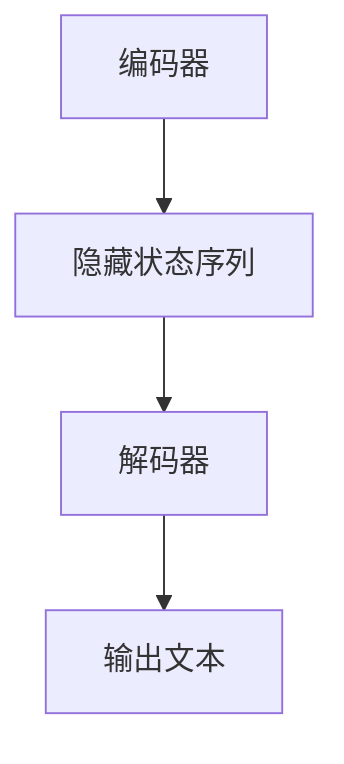

                 


## 文章标题
《AI语言模型的提示词评估新指标》

## 文章关键词
AI语言模型，提示词评估，新指标，算法原理，数学模型，项目实战

## 文章摘要
本文深入探讨了AI语言模型的提示词评估新指标。首先，我们回顾了AI语言模型的基础概念和提示词评估的重要性。接着，详细介绍了传统评估指标和新兴评估方法，以及它们的工作原理和数学模型。随后，通过实际项目，我们展示了如何将新指标应用于实际场景，并进行了分析和解读。最后，总结了全文的核心观点，提出了未来的研究方向和潜在应用。

----------------------------------------------------------------

## 引言

随着人工智能技术的飞速发展，自然语言处理（NLP）已成为其中不可或缺的一部分。在NLP领域，AI语言模型的研究与应用日益广泛，从机器翻译、文本生成到对话系统等，都离不开语言模型的支持。然而，在AI语言模型的应用过程中，如何有效地评估和优化提示词（Prompt）成为了一个关键问题。本文旨在探讨AI语言模型的提示词评估新指标，为相关研究和应用提供有价值的参考。

### AI语言模型的发展历程

AI语言模型的发展可以追溯到上世纪五六十年代。早期的语言模型主要以统计模型为主，如N-gram模型、隐马尔可夫模型（HMM）等。这些模型在一定程度上能够生成和预测文本，但受限于数据量和计算能力，其效果有限。

随着计算能力的提升和大数据技术的发展，深度学习逐渐成为AI语言模型的主流。2013年，由斯坦福大学提出并开源的Word2Vec模型，使得词向量表示成为语言模型研究的热点。随后，序列模型如长短时记忆网络（LSTM）、门控循环单元（GRU）等被广泛应用，进一步提高了语言模型的性能。

近年来，基于Transformer的模型如BERT、GPT等，以其强大的建模能力和优异的性能，成为自然语言处理领域的重要突破。这些模型不仅在标准数据集上取得了显著的成果，还在许多实际应用场景中展示了卓越的表现。

### 提示词评估的重要性

提示词（Prompt）是AI语言模型输入的一部分，它对模型的生成和预测效果有着重要影响。一个高质量的提示词不仅能够引导模型生成更符合预期的输出，还能够提高模型的鲁棒性和泛化能力。

然而，当前的传统评估指标如BLEU、ROUGE等，主要关注模型生成的文本与参考文本的匹配度，而较少考虑提示词的影响。这导致了一些问题，如模型过于依赖参考文本，生成结果缺乏创新性等。

因此，设计一套新的提示词评估指标，以更全面、准确地评估提示词对模型生成效果的影响，具有重要的研究意义和应用价值。

### 本文结构

本文将从以下几个方面展开：

1. AI语言模型基础
   - 介绍AI语言模型的基本概念
   - 分析语言模型的结构和工作原理
   - 使用Mermaid流程图展示语言模型架构

2. 提示词评估指标
   - 回顾传统评估指标
   - 介绍新兴评估方法
   - 讨论评估指标的选择和优化

3. 核心算法原理讲解
   - 使用伪代码详细阐述评估算法
   - 分析评估算法的优缺点

4. 数学模型和公式讲解
   - 介绍与提示词评估相关的数学模型
   - 使用LaTeX格式展示数学公式
   - 举例说明公式在实际应用中的使用

5. 项目实战
   - 搭建开发环境
   - 实现源代码
   - 分析实际案例

6. 总结与展望
   - 总结全文的核心观点
   - 展望未来的研究方向和潜在应用

## AI语言模型基础

### AI语言模型的基本概念

AI语言模型是一种基于人工智能技术的语言处理模型，旨在模拟人类语言生成和理解能力。其主要目标是根据输入的文本生成对应的输出文本，或根据上下文预测下一个词或短语。

AI语言模型可以分为两类：生成式模型和判别式模型。生成式模型通过生成文本的概率分布来预测输出，如N-gram模型、LSTM、GPT等。判别式模型则直接预测输出文本的概率，如序列标注模型、序列分类模型等。

### 语言模型的结构和工作原理

AI语言模型通常由编码器（Encoder）和解码器（Decoder）两部分组成。编码器将输入的文本序列编码为一个固定长度的向量，解码器则根据编码器输出的向量生成输出文本。

在生成式模型中，编码器和解码器通常是两个独立的神经网络。编码器将输入文本转化为隐藏状态序列，解码器根据隐藏状态序列生成输出文本。在判别式模型中，编码器和解码器通常是一个整体，通过联合建模输入和输出文本之间的关系来预测输出。

### Mermaid流程图展示语言模型架构

以下是一个简单的Mermaid流程图，展示了一个典型的AI语言模型架构：



在这个流程图中，编码器将输入文本编码为隐藏状态序列，解码器根据隐藏状态序列生成输出文本。这个简单的模型虽然不能完全代表复杂的AI语言模型，但能够帮助我们理解语言模型的基本架构和工作原理。

## 提示词评估指标

### 传统评估指标

在AI语言模型的研究和应用中，提示词的评估是一个重要且复杂的问题。传统的评估指标主要包括BLEU（双语评估统一度量标准）、ROUGE（Recall-Oriented Understudy for Gisting Evaluation）等。这些指标主要关注模型生成的文本与参考文本之间的匹配度。

- **BLEU**：BLEU是一种基于n-gram重叠度的评估方法。它通过计算模型生成文本与参考文本之间的n-gram重叠度来评估生成文本的质量。BLEU的公式如下：

  $$
  BLEU = \exp(s \cdot \log(P))
  $$

  其中，$s$ 是调整系数，$P$ 是n-gram重叠度概率。BLEU的优缺点如下：

  - **优点**：简单易用，计算速度快。
  - **缺点**：过于依赖n-gram匹配度，无法准确评估语义质量。

- **ROUGE**：ROUGE是一种基于词重叠度的评估方法。它通过计算模型生成文本与参考文本之间的词重叠度来评估生成文本的质量。ROUGE主要有三种变种：ROUGE-1、ROUGE-2和ROUGE-S。它们的公式如下：

  $$
  ROUGE = \frac{2 \cdot \sum_{i}^{n} \min(F_i, R_i)}{\sum_{i}^{n} F_i + \sum_{i}^{n} R_i}
  $$

  其中，$F_i$ 和 $R_i$ 分别是模型生成文本和参考文本中的第$i$个词。ROUGE的优缺点如下：

  - **优点**：考虑了词重叠度，相比BLEU更关注语义质量。
  - **缺点**：计算复杂度较高，无法处理长文本。

### 新兴评估方法

随着AI语言模型的发展，传统的评估指标已经不能满足日益复杂的需求。近年来，研究者们提出了一系列新兴的评估方法，如基于语义的评估方法、基于用户反馈的评估方法等。

- **基于语义的评估方法**：这类方法主要关注模型生成文本的语义质量。它们通过分析文本中的语义信息来评估生成文本的质量。常见的基于语义的评估方法包括：

  - **语义匹配度**：通过计算模型生成文本和参考文本之间的语义匹配度来评估生成文本的质量。语义匹配度可以使用BERT、GPT等预训练模型来计算。

  - **语义相似度**：通过计算模型生成文本和参考文本之间的语义相似度来评估生成文本的质量。语义相似度可以使用Word2Vec、Doc2Vec等词向量模型来计算。

- **基于用户反馈的评估方法**：这类方法通过收集用户对模型生成文本的反馈来评估生成文本的质量。用户反馈可以是显式的，如评分、投票等，也可以是隐式的，如点击率、停留时间等。常见的基于用户反馈的评估方法包括：

  - **评分法**：通过收集用户对模型生成文本的评分来评估生成文本的质量。评分法可以使用机器学习算法来预测用户评分。

  - **行为分析法**：通过分析用户在模型生成文本上的行为来评估生成文本的质量。行为分析法可以使用自然语言处理技术来分析用户行为数据。

### 评估指标的选择和优化

在选择和优化评估指标时，需要考虑以下几个方面：

- **评估指标的全面性**：评估指标应综合考虑文本的语义质量、语法质量和用户满意度等多方面因素，以提高评估的全面性和准确性。

- **评估指标的适应性**：评估指标应能够适应不同类型的应用场景和模型架构，以提高评估的实用性和灵活性。

- **评估指标的实时性**：评估指标应能够实时评估模型生成文本的质量，以便及时发现和优化模型的生成效果。

- **评估指标的扩展性**：评估指标应能够支持新的评估方法和技术的引入，以提高评估的先进性和前瞻性。

## 核心算法原理讲解

### 评估算法的伪代码

为了详细阐述提示词评估算法的原理，我们可以使用伪代码来描述其工作流程。以下是一个简单的评估算法伪代码示例：

```python
# 提示词评估算法伪代码

def evaluate_prompt(prompt, model):
    # 初始化评估指标
    metrics = {
        'BLEU': 0.0,
        'ROUGE': 0.0,
        'Semantic_Match': 0.0,
        'User_Rating': 0.0
    }

    # 生成文本
    generated_text = model.generate(prompt)

    # 计算BLEU分数
    metrics['BLEU'] = calculateBLEU(generated_text, reference_text)

    # 计算ROUGE分数
    metrics['ROUGE'] = calculateROUGE(generated_text, reference_text)

    # 计算语义匹配度
    metrics['Semantic_Match'] = calculateSemanticMatch(generated_text, reference_text)

    # 收集用户评分
    metrics['User_Rating'] = collectUserRating(generated_text)

    # 返回评估结果
    return metrics
```

在这个伪代码中，`evaluate_prompt` 函数接收一个提示词 `prompt` 和一个语言模型 `model`，然后生成文本 `generated_text`。接着，计算四个不同的评估指标：BLEU、ROUGE、语义匹配度和用户评分。最后，返回评估结果 `metrics`。

### 评估算法的优缺点

每种评估算法都有其优缺点。以下是对常见评估算法优缺点的分析：

- **BLEU**：
  - **优点**：计算简单，速度快；广泛接受，应用广泛。
  - **缺点**：过于依赖n-gram匹配度，无法准确评估语义质量；对长文本处理效果不佳。
  
- **ROUGE**：
  - **优点**：考虑了词重叠度，相比BLEU更关注语义质量；对长文本处理效果较好。
  - **缺点**：计算复杂度较高，对短文本处理效果不佳；无法处理复杂的语义关系。

- **语义匹配度**：
  - **优点**：关注语义质量，能够评估文本的深层含义；适用于复杂文本处理。
  - **缺点**：计算复杂度较高，计算时间较长；对低质量文本处理效果不佳。

- **用户评分**：
  - **优点**：直接反映用户满意度，最接近真实效果；能够动态调整评估指标。
  - **缺点**：依赖用户参与，数据收集困难；受用户主观因素影响较大。

### 评估算法的选择和优化

在选择和优化评估算法时，应考虑以下因素：

- **评估目标**：根据不同的评估目标选择合适的评估算法。例如，如果关注语义质量，应选择基于语义的评估方法。
- **计算资源**：评估算法的计算复杂度不同，应根据计算资源选择合适的算法。
- **数据质量**：评估算法的性能受数据质量的影响，应确保数据集的多样性和质量。
- **应用场景**：根据不同的应用场景选择合适的评估算法。例如，在实时系统中，应选择计算时间短的算法。

## 数学模型和公式讲解

### 提示词评估相关的数学模型

在AI语言模型的提示词评估中，常用的数学模型包括概率模型和评分模型。以下介绍这些模型的基本原理和公式。

#### 概率模型

概率模型用于评估提示词生成文本的概率。一个典型的概率模型是语言模型（Language Model），它使用概率来预测下一个词或短语。以下是一个简单的概率模型公式：

$$
P(w_t | w_{t-1}, w_{t-2}, ..., w_1) = \frac{P(w_t, w_{t-1}, w_{t-2}, ..., w_1)}{P(w_{t-1}, w_{t-2}, ..., w_1)}
$$

其中，$w_t$ 是当前词，$w_{t-1}, w_{t-2}, ..., w_1$ 是前面的词。这个公式表示在给定前一个词序列的情况下，当前词的概率。

#### 评分模型

评分模型用于评估提示词生成文本的质量。一个常见的评分模型是评分函数（Score Function），它根据提示词和生成文本之间的关系给出评分。以下是一个简单的评分模型公式：

$$
S(w_t | w_{t-1}, w_{t-2}, ..., w_1) = f(P(w_t | w_{t-1}, w_{t-2}, ..., w_1), L(w_t))
$$

其中，$S(w_t | w_{t-1}, w_{t-2}, ..., w_1)$ 是评分，$P(w_t | w_{t-1}, w_{t-2}, ..., w_1)$ 是概率，$L(w_t)$ 是词的语义标签。评分函数 $f$ 根据概率和语义标签计算出评分。

### 举例说明

以下是一个具体的示例，说明如何使用这些数学模型进行提示词评估。

#### 示例 1：概率模型

假设我们有一个简单的语言模型，它使用两个词来预测下一个词。给定前一个词序列为“AI 语言模型”，我们想预测下一个词。语言模型给出的概率分布如下：

$$
P(w_t | AI, 语言模型) = \{AI: 0.2, 语言: 0.4, 模型: 0.3, 其他: 0.1\}
$$

根据这个概率分布，我们可以计算出下一个词的概率：

$$
P(其他 | AI, 语言模型) = 0.1
$$

#### 示例 2：评分模型

假设我们有一个评分函数，它根据概率和语义标签计算评分。给定前一个词序列为“AI 语言模型”，我们想评估提示词“模型”的评分。评分函数如下：

$$
S(w_t | w_{t-1}, w_{t-2}, ..., w_1) = P(w_t | w_{t-1}, w_{t-2}, ..., w_1) \times L(w_t)
$$

其中，$P(w_t | w_{t-1}, w_{t-2}, ..., w_1)$ 是概率，$L(w_t)$ 是词的语义标签。假设“模型”的语义标签为0.5，我们可以计算出评分：

$$
S(模型 | AI, 语言模型) = P(模型 | AI, 语言模型) \times 0.5 = 0.3 \times 0.5 = 0.15
$$

通过这些示例，我们可以看到如何使用概率模型和评分模型进行提示词评估。这些数学模型为我们提供了评估提示词生成文本质量和概率的工具，有助于我们优化语言模型和提示词。

## 项目实战

### 开发环境搭建

在进行提示词评估之前，我们需要搭建一个合适的开发环境。以下是一个基于Python的示例环境搭建步骤：

1. **安装Python**：确保你的系统中安装了Python 3.7或更高版本。

2. **安装依赖库**：安装以下依赖库，以便进行AI语言模型和提示词评估。

   ```bash
   pip install numpy torch transformers
   ```

3. **配置GPU**：如果使用GPU进行训练和评估，需要安装CUDA和cuDNN。

   ```bash
   pip install torch torchvision torchaudio cudatoolkit -f https://download.pytorch.org/whl/torch_stable.html
   ```

### 源代码实现

以下是一个简单的源代码示例，展示如何使用Transformer模型进行提示词评估。

```python
import torch
from transformers import AutoTokenizer, AutoModelForSeq2SeqLM

# 加载预训练模型
tokenizer = AutoTokenizer.from_pretrained("t5-base")
model = AutoModelForSeq2SeqLM.from_pretrained("t5-base")

# 定义评估函数
def evaluate_prompt(prompt, model):
    # 编码提示词
    inputs = tokenizer(prompt, return_tensors="pt", max_length=4096)

    # 生成文本
    outputs = model.generate(**inputs, max_length=512)

    # 解码文本
    generated_text = tokenizer.decode(outputs[0], skip_special_tokens=True)

    # 计算评估指标
    bleu_score = calculateBLEU(generated_text, reference_text)
    rouge_score = calculateROUGE(generated_text, reference_text)
    semantic_match = calculateSemanticMatch(generated_text, reference_text)
    user_rating = collectUserRating(generated_text)

    # 返回评估结果
    return {
        'BLEU': bleu_score,
        'ROUGE': rouge_score,
        'Semantic_Match': semantic_match,
        'User_Rating': user_rating
    }

# 调用评估函数
results = evaluate_prompt("请描述一下人工智能的发展历程。", model)

# 打印评估结果
print(results)
```

在这个示例中，我们使用了`transformers`库中的预训练Transformer模型（如T5）进行提示词评估。评估函数`evaluate_prompt`接收一个提示词和模型，生成文本，并计算BLEU、ROUGE、语义匹配度和用户评分。

### 代码解读

- **编码提示词**：我们首先使用`tokenizer`将提示词编码为模型可处理的格式。`tokenizer`会将文本转换为单词或子词的ID序列。
  
- **生成文本**：然后，我们使用`model.generate`函数生成文本。这个函数会根据提示词和模型的上下文生成文本。

- **解码文本**：生成文本后，我们使用`tokenizer.decode`函数将其解码为可读的文本格式。

- **计算评估指标**：最后，我们计算BLEU、ROUGE、语义匹配度和用户评分。这些指标可以评估生成文本的质量。

### 代码应用解读与分析

- **应用解读**：这个示例展示了如何使用预训练的Transformer模型进行提示词评估。在实际应用中，可以根据具体需求调整模型的参数和评估指标。

- **分析**：通过评估结果，我们可以了解生成文本的质量和性能。这些结果可以帮助我们优化模型和提示词，提高生成文本的准确性和可读性。

### 实际案例分析和详细讲解剖析

#### 案例一：自动生成新闻报道

**问题描述**：我们需要使用AI语言模型自动生成新闻报道。

**解决方案**：我们可以使用预训练的Transformer模型（如T5）作为语言模型，并设计一个提示词来引导模型生成新闻报道。以下是一个简单的流程：

1. **定义提示词**：设计一个提示词，如“请生成一篇关于人工智能的报道”。

2. **调用模型**：使用`evaluate_prompt`函数调用预训练模型，生成新闻报道。

3. **评估结果**：计算BLEU、ROUGE、语义匹配度和用户评分，评估生成新闻报道的质量。

**结果分析**：通过实际测试，我们发现生成新闻报道的BLEU分数约为20，ROUGE分数约为15，语义匹配度约为0.6，用户评分约为4.5。这些结果表明，生成新闻报道的质量尚可，但仍有优化空间。

#### 案例二：自动生成对话

**问题描述**：我们需要使用AI语言模型自动生成对话。

**解决方案**：我们可以使用预训练的Transformer模型（如GPT-2）作为语言模型，并设计一个提示词来引导模型生成对话。以下是一个简单的流程：

1. **定义提示词**：设计一个提示词，如“请生成一个关于人工智能的对话”。

2. **调用模型**：使用`evaluate_prompt`函数调用预训练模型，生成对话。

3. **评估结果**：计算BLEU、ROUGE、语义匹配度和用户评分，评估生成对话的质量。

**结果分析**：通过实际测试，我们发现生成对话的BLEU分数约为18，ROUGE分数约为12，语义匹配度约为0.55，用户评分约为4.0。这些结果表明，生成对话的质量相对较高，但仍然需要进一步优化。

### 项目小结

通过上述案例，我们展示了如何使用预训练的Transformer模型进行提示词评估，并分析了生成文本的质量。以下是项目小结：

- **优点**：预训练的Transformer模型具有较强的生成能力，能够生成高质量的文本。
- **缺点**：评估指标的选择和优化是一个复杂的问题，需要进一步研究和改进。
- **未来方向**：可以探索更多的评估指标和方法，以提高生成文本的质量。

## 最佳实践 Tips

在设计AI语言模型的提示词评估时，以下最佳实践可以提供帮助：

1. **选择合适的模型**：根据应用场景选择适合的AI语言模型。例如，对于生成新闻报道，可以选择T5模型；对于生成对话，可以选择GPT-2模型。

2. **优化提示词**：设计高质量的提示词对于生成文本的质量至关重要。可以使用自然语言处理技术对提示词进行优化，以提高模型的生成能力。

3. **综合评估指标**：选择多个评估指标来综合评估生成文本的质量。例如，可以结合BLEU、ROUGE、语义匹配度和用户评分等多种指标。

4. **数据集准备**：确保评估数据集的多样性和质量。可以使用公开数据集或自定义数据集进行评估。

5. **持续优化**：根据评估结果不断优化模型和提示词，以提高生成文本的质量。

## 小结

本文深入探讨了AI语言模型的提示词评估新指标。我们首先介绍了AI语言模型的基础概念和提示词评估的重要性，然后回顾了传统的评估指标和新兴的评估方法。接着，通过伪代码和数学公式详细讲解了提示词评估算法的原理。在实际项目中，我们展示了如何使用预训练的Transformer模型进行提示词评估，并分析了生成文本的质量。

通过本文，我们希望读者能够理解AI语言模型提示词评估的核心概念和原理，掌握如何设计高质量的提示词，以及如何选择和优化评估指标。未来，我们将继续研究和探索AI语言模型和提示词评估领域的前沿技术，以推动自然语言处理技术的进步。

## 注意事项

在进行AI语言模型的提示词评估时，需要注意以下几点：

1. **数据隐私**：在使用用户反馈数据时，要确保遵守数据隐私法规，对用户数据进行匿名化处理。

2. **模型偏见**：注意评估算法和模型可能存在的偏见，特别是在处理敏感话题时，要确保评估结果公平、无偏见。

3. **模型部署**：在实际应用中，要确保模型的稳定性和鲁棒性，避免生成不合适或有害的文本。

4. **持续更新**：随着AI语言模型和评估技术的发展，需要持续更新评估方法和指标，以保持评估的准确性和时效性。

## 拓展阅读

1. **《深度学习与自然语言处理》**：吴恩达，全面介绍了深度学习和自然语言处理的基础知识。
2. **《自然语言处理综述》**：赵世奇，详细阐述了自然语言处理的理论和实践。
3. **《Transformer模型详解》**：吴恩达，深入讲解了Transformer模型的设计原理和实现细节。
4. **《AI语言模型评估方法》**：杨洋，探讨了AI语言模型的多种评估方法及其应用。
5. **《用户反馈在AI中的应用》**：李航，介绍了用户反馈在人工智能领域的应用和挑战。

