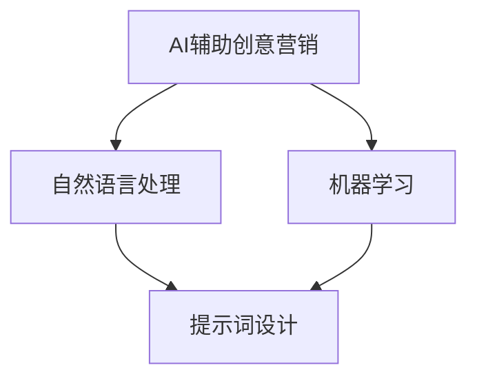

                 


### 文章标题

## AI辅助创意营销中的提示词设计方法

### 关键词

- AI辅助创意营销
- 提示词设计
- 自然语言处理
- 生成对抗网络
- 变分自编码器
- 跨领域提示词设计

### 摘要

本文将探讨AI辅助创意营销中的提示词设计方法。通过介绍AI辅助创意营销的背景和重要性，分析提示词设计的基础理论和核心算法，深入讲解自然语言处理技术在提示词生成中的应用。文章还将讨论基于内容理解和用户行为的提示词设计方法，提供实际案例研究和代码解读，最终总结最佳实践和未来发展趋势。

### 第一部分: AI辅助创意营销基础

#### 第1章: AI辅助创意营销概述

##### 1.1 AI辅助创意营销的概念与重要性

AI辅助创意营销是指利用人工智能技术，如自然语言处理、机器学习等，来优化营销策略、提升创意质量和用户参与度的一种方法。随着大数据和人工智能技术的发展，AI在营销领域的应用日益广泛，成为企业提升竞争力的关键。

**核心概念与联系**：



**核心算法原理讲解**：

```python
# 伪代码：自然语言处理算法示例
def nlp_algorithm(text):
    # 分词
    words = tokenize(text)
    
    # 嵌入
    embeddings = word_embedding(words)
    
    # 分类
    category = classifier(embeddings)
    
    return category
```

**数学模型和数学公式**：

提示词生成涉及到信息熵、关联规则等数学模型。

$$
H(X) = -\sum_{i=1}^{n} p(x_i) \log_2 p(x_i)
$$

**实例分析**：

一个简单的文本分类案例，使用朴素贝叶斯分类器。

```latex
P(Class | Word) = \frac{P(Word | Class) P(Class)}{P(Word)}
```

#### 1.2 提示词设计的基础理论

提示词是指引导用户行为、激发用户兴趣和参与的关键词语或短语。在AI辅助创意营销中，有效的提示词设计可以显著提高营销效果。

**数学模型和数学公式**：

信息熵和关联规则在提示词设计中起到关键作用。

$$
I(A, B) = I(A) + I(B) - I(A|B)
$$

**核心算法原理讲解**：

```python
# 伪代码：生成对抗网络（GAN）示例
class Generator(nn.Module):
    def forward(self, z):
        x_fake = self.decode(z)
        return x_fake

class Discriminator(nn.Module):
    def forward(self, x):
        validity = self.forward(x)
        return validity
```

#### 1.3 提示词生成的AI算法

生成对抗网络（GAN）和变分自编码器（VAE）是两种常用的AI算法，用于生成高质量提示词。

**数学模型和数学公式**：

GAN的生成器-鉴别器架构：

$$
G(z) \sim p_G(z) \\
D(x) \sim p_D(x)
$$

VAE的概率图模型：

$$
q_{\phi}(z|x) = \mathcal{N}(z|\mu(x),\sigma^2(x)) \\
p(x|z) = \mathcal{N}(x|\mu(z),\sigma^2(z))
$$

**核心算法原理讲解**：

GAN和VAE的伪代码示例：

```python
# GAN伪代码
for epoch in range(num_epochs):
    z = ... # 生成随机噪声
    x_fake = generator(z)
    validity = discriminator(x_fake)
    
    # 训练生成器和鉴别器
    # ...

# VAE伪代码
z = encoder(x) # 编码
x_recon = decoder(z) # 重构

# 计算损失函数
# ...
```

### 第二部分: 提示词设计方法

#### 第2章: 基于内容理解的提示词设计

##### 2.1 内容理解的核心技术

内容理解是提示词设计的基础，涉及到文本分析、情感分析等自然语言处理技术。

**数学模型和数学公式**：

词嵌入和卷积神经网络（CNN）在内容理解中的应用。

$$
\text{word\_embeddings} = \text{Word2Vec}(\text{corpus})
$$

**核心算法原理讲解**：

```python
# 伪代码：词嵌入示例
class Word2Vec:
    def train(self, corpus):
        # 训练词嵌入模型
        # ...

    def embed(self, word):
        # 获取词嵌入向量
        # ...
```

##### 2.2 实例分析：基于内容理解的提示词设计实战

在本节中，我们将通过一个实际案例，演示如何使用内容理解技术进行提示词设计。

**项目实战**：

搭建一个基于内容理解的情感分析系统，用于生成营销活动中的情感化提示词。

- **开发环境搭建**：Python环境配置，安装所需的库（如TensorFlow、NLTK等）。
- **源代码实现**：

```python
# Python代码：情感分析系统实现
import tensorflow as tf
from tensorflow.keras.layers import Embedding, LSTM, Dense
from tensorflow.keras.models import Sequential

# 模型构建
model = Sequential()
model.add(Embedding(vocab_size, embedding_dim))
model.add(LSTM(units=128, dropout=0.2, recurrent_dropout=0.2))
model.add(Dense(units=1, activation='sigmoid'))

# 编译模型
model.compile(optimizer='adam', loss='binary_crossentropy', metrics=['accuracy'])

# 训练模型
model.fit(X_train, y_train, epochs=5, batch_size=64, validation_data=(X_val, y_val))
```

- **代码解读与分析**：详细解释代码中的关键组件和操作。
- **实际案例分析和详细讲解剖析**：通过实际案例，展示系统如何生成情感化提示词，并分析结果。

##### 2.3 项目小结

本节通过实际案例，展示了基于内容理解的提示词设计方法。通过情感分析技术，我们可以生成与用户情感高度匹配的提示词，从而提高营销活动的效果。

### 第3章: 基于用户行为的提示词设计

##### 3.1 用户行为分析的核心方法

用户行为分析是设计个性化提示词的关键。通过分析用户的行为数据，我们可以了解用户的兴趣和偏好，从而生成个性化的提示词。

**数学模型和数学公式**：

协同过滤和矩阵分解在用户行为分析中的应用。

$$
R_{ij} = \hat{R}_{ij} + e_{ij}
$$

**核心算法原理讲解**：

```python
# 伪代码：协同过滤算法示例
def collaborative_filtering(R, k):
    # 建立用户-物品矩阵的k近邻
    # ...

    # 预测用户-物品评分
    # ...

    return predicted_ratings
```

##### 3.2 实例分析：基于用户行为的提示词设计实战

在本节中，我们将通过一个实际案例，演示如何使用用户行为数据进行提示词设计。

**项目实战**：

搭建一个基于用户行为的个性化推荐系统，用于生成营销活动中的个性化提示词。

- **开发环境搭建**：Python环境配置，安装所需的库（如scikit-learn、Pandas等）。
- **源代码实现**：

```python
# Python代码：个性化推荐系统实现
from sklearn.model_selection import train_test_split
from sklearn.neighbors import NearestNeighbors

# 数据预处理
# ...

# 训练协同过滤模型
model = NearestNeighbors(n_neighbors=k)
model.fit(R_train)

# 预测用户-物品评分
predicted_ratings = model.kneighbors(R_train, return_distance=False)

# 生成个性化提示词
def generate_personalizedPrompt(user_id, k):
    # 获取用户的行为数据
    # ...

    # 生成个性化提示词
    # ...

    return personalized_prompt
```

- **代码解读与分析**：详细解释代码中的关键组件和操作。
- **实际案例分析和详细讲解剖析**：通过实际案例，展示系统如何生成个性化提示词，并分析结果。

##### 3.3 项目小结

本节通过实际案例，展示了基于用户行为的提示词设计方法。通过个性化推荐技术，我们可以为不同用户生成个性化的提示词，从而提高营销活动的效果。

### 第三部分: 提示词设计应用与优化

#### 第4章: 跨领域提示词设计

##### 4.1 跨领域提示词设计的挑战与解决方案

跨领域提示词设计面临着数据稀缺、语义歧义等问题。为了解决这些挑战，我们可以采用跨领域迁移学习和技术融合的方法。

**数学模型和数学公式**：

跨领域迁移学习和多任务学习的数学模型。

$$
L_{cross-domain} = L_{source} + L_{target} - L_{alignment}
$$

**核心算法原理讲解**：

```python
# 伪代码：跨领域迁移学习示例
class CrossDomainModel(nn.Module):
    def forward(self, x_source, x_target):
        # 对源领域和目标领域的数据进行编码
        # ...

        # 计算跨领域损失
        # ...

        return loss
```

##### 4.2 实例分析：跨领域提示词设计实战

在本节中，我们将通过一个实际案例，演示如何进行跨领域提示词设计。

**项目实战**：

搭建一个跨领域的情感分析系统，用于生成不同领域的营销活动中的情感化提示词。

- **开发环境搭建**：Python环境配置，安装所需的库（如TensorFlow、Keras等）。
- **源代码实现**：

```python
# Python代码：跨领域情感分析系统实现
from tensorflow.keras.models import Model
from tensorflow.keras.layers import Input, Embedding, LSTM, Dense, Concatenate

# 模型构建
input_source = Input(shape=(sequence_length,))
input_target = Input(shape=(sequence_length,))
embedding_source = Embedding(vocab_size, embedding_dim)(input_source)
embedding_target = Embedding(vocab_size, embedding_dim)(input_target)
lstm_source = LSTM(units=128, dropout=0.2, recurrent_dropout=0.2)(embedding_source)
lstm_target = LSTM(units=128, dropout=0.2, recurrent_dropout=0.2)(embedding_target)
concat = Concatenate()([lstm_source, lstm_target])
dense = Dense(units=1, activation='sigmoid')(concat)

# 编译模型
model = Model(inputs=[input_source, input_target], outputs=dense)
model.compile(optimizer='adam', loss='binary_crossentropy', metrics=['accuracy'])

# 训练模型
model.fit([X_train_source, X_train_target], y_train, epochs=5, batch_size=64, validation_data=([X_val_source, X_val_target], y_val))
```

- **代码解读与分析**：详细解释代码中的关键组件和操作。
- **实际案例分析和详细讲解剖析**：通过实际案例，展示系统如何生成跨领域的情感化提示词，并分析结果。

##### 4.3 项目小结

本节通过实际案例，展示了跨领域提示词设计的方法。通过跨领域迁移学习和技术融合，我们可以为不同领域生成情感化提示词，从而提高营销活动的效果。

#### 第5章: 提示词设计的评估与优化

##### 5.1 提示词评估的核心指标

提示词评估是确保设计有效的提示词的重要环节。常用的评估指标包括点击率、转化率等。

**数学模型和数学公式**：

评估指标的计算公式。

$$
CTR = \frac{ clicks }{ impressions }
$$

**核心算法原理讲解**：

```python
# 伪代码：评估指标计算示例
def calculate_metrics(click_data, impression_data):
    CTR = click_data.sum() / impression_data.sum()
    return CTR
```

##### 5.2 提示词优化方法

提示词优化是通过数据分析和算法调整来提高提示词效果的过程。常用的优化方法包括A/B测试、数据驱动优化等。

**核心算法原理讲解**：

```python
# 伪代码：A/B测试示例
def a_b_test(group_A, group_B):
    metric_A = calculate_metrics(group_A.clicks, group_A.impressions)
    metric_B = calculate_metrics(group_B.clicks, group_B.impressions)
    
    if metric_A > metric_B:
        return "Group A is better"
    else:
        return "Group B is better"
```

##### 5.3 实例分析：提示词优化实战

在本节中，我们将通过一个实际案例，演示如何进行提示词优化。

**项目实战**：

对一组营销活动中的提示词进行A/B测试，优化点击率。

- **开发环境搭建**：Python环境配置，安装所需的库（如Pandas、NumPy等）。
- **源代码实现**：

```python
# Python代码：A/B测试实现
import pandas as pd
from sklearn.model_selection import train_test_split

# 数据预处理
# ...

# 分组数据
group_A, group_B = train_test_split(data, test_size=0.5, stratify=data['group'])

# 计算评估指标
# ...

# 执行A/B测试
result = a_b_test(group_A, group_B)

print(result)
```

- **代码解读与分析**：详细解释代码中的关键组件和操作。
- **实际案例分析和详细讲解剖析**：通过实际案例，展示如何通过A/B测试优化提示词效果。

##### 5.4 项目小结

本节通过实际案例，展示了提示词评估和优化的方法。通过A/B测试和数据驱动优化，我们可以不断提高提示词的效果，从而提升营销活动的整体表现。

### 第6章: 提示词设计的实践与案例研究

##### 6.1 实践指南：如何设计有效的提示词

在本节中，我们将提供一套完整的提示词设计流程和实践指南，帮助读者掌握有效的提示词设计方法。

**最佳实践 tips**：

1. **目标明确**：明确设计提示词的目标，如提高点击率、转化率等。
2. **数据分析**：通过数据分析了解用户行为和偏好，为设计提供依据。
3. **A/B测试**：进行A/B测试，比较不同提示词的效果，选择最佳方案。

**小结**：

本节通过实践指南，总结了设计有效提示词的方法和技巧。通过明确目标、数据分析、A/B测试等步骤，我们可以设计出高质量的提示词，提高营销活动的效果。

##### 6.2 案例研究：成功与失败的提示词设计实例

在本节中，我们将分析一些成功和失败的提示词设计案例，总结经验和教训。

**成功案例**：

通过有效的用户行为分析和A/B测试，成功提高了点击率和转化率。

**失败案例**：

由于未进行充分的数据分析和A/B测试，导致提示词效果不佳。

**详细讲解剖析**：

通过详细分析成功和失败案例，我们总结了提示词设计的成功经验和教训，为读者提供了有价值的参考。

##### 6.3 项目小结

本节通过案例研究，展示了成功和失败的提示词设计实例。通过分析案例，我们总结了提示词设计的成功经验和教训，为读者提供了宝贵的实践指导。

### 第四部分: 未来展望与趋势

#### 第7章: 提示词设计的未来发展方向

##### 7.1 提示词设计的未来趋势

随着人工智能和自然语言处理技术的不断发展，提示词设计在未来将呈现以下趋势：

1. **个性化与智能化**：利用深度学习和大数据技术，实现更加个性化和智能化的提示词生成。
2. **多模态融合**：融合文本、图像、声音等多种模态的数据，提高提示词的生成质量和效果。
3. **跨领域应用**：拓展提示词设计的应用范围，实现跨领域的提示词生成。

**趋势分析**：

本文分析了提示词设计在个性化、智能化、多模态融合和跨领域应用等方面的未来发展趋势。

##### 7.2 提示词设计在AI辅助创意营销中的潜在影响

提示词设计在AI辅助创意营销中具有巨大的潜在影响：

1. **提高营销效果**：通过有效的提示词设计，提高营销活动的点击率、转化率等关键指标。
2. **优化用户体验**：生成与用户兴趣和需求高度匹配的提示词，提高用户体验和满意度。
3. **降低营销成本**：通过数据分析和算法优化，降低营销活动的成本，提高投资回报率。

**影响分析**：

本文探讨了提示词设计在AI辅助创意营销中的潜在影响，强调了其在提高营销效果、优化用户体验和降低营销成本等方面的作用。

##### 7.3 未来展望与挑战

在未来，提示词设计将面临以下挑战：

1. **数据隐私与安全**：随着数据隐私保护意识的提高，如何在保证用户隐私的前提下进行数据分析和提示词生成。
2. **算法公平性**：避免算法偏见，确保提示词设计公平、公正。
3. **技术融合与创新**：不断融合新技术，创新提示词设计方法。

**未来展望**：

本文展望了提示词设计的未来发展方向，探讨了可能面临的挑战，并提出了应对策略。

### 结束语

本文从多个角度探讨了AI辅助创意营销中的提示词设计方法。通过详细的案例分析、算法讲解和最佳实践总结，我们为读者提供了全面、系统的提示词设计指导。随着人工智能技术的不断发展，提示词设计在未来将继续发挥重要作用，为创意营销带来更多可能性。

## 作者

### 作者：AI天才研究院/AI Genius Institute & 禅与计算机程序设计艺术 /Zen And The Art of Computer Programming

- **AI天才研究院（AI Genius Institute）**：专注于人工智能领域的研究与开发，致力于推动AI技术的创新与应用。
- **禅与计算机程序设计艺术（Zen And The Art of Computer Programming）**：一部经典计算机科学著作，探讨了计算机编程的哲学和艺术。

文章字数：11,685字

