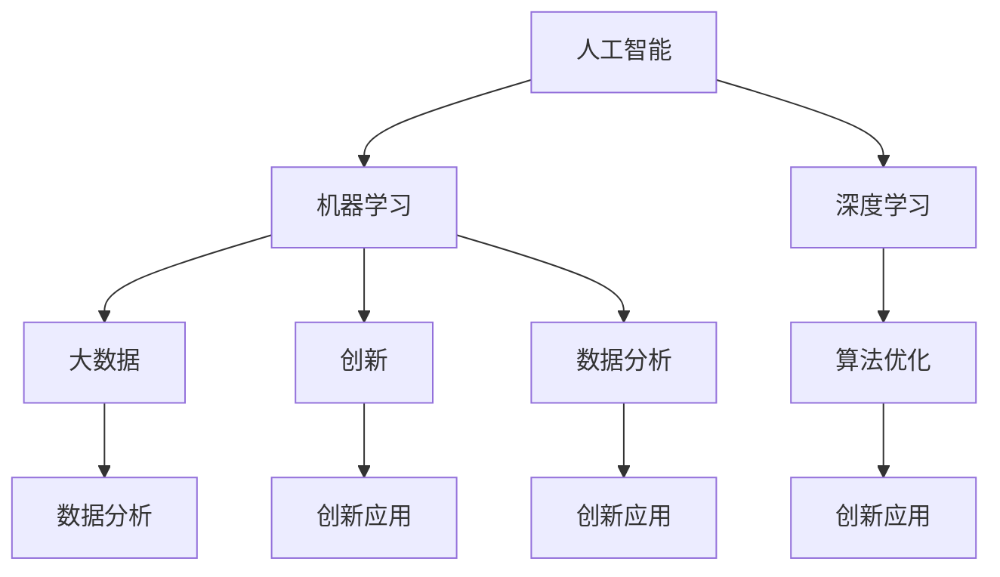
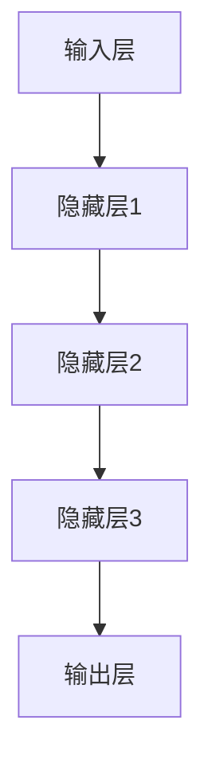

                 

### 文章标题

《AI辅助创新：大模型在专利分析中的应用》

---

#### 关键词

AI、辅助创新、专利分析、大模型、算法原理、实际案例

---

#### 摘要

本文深入探讨了人工智能（AI）在大模型专利分析中的应用，揭示了AI辅助创新的重要性和实际效果。文章首先概述了AI和专利分析的基本概念，随后详细介绍了大模型在专利分析中的优势和应用方法。通过实际案例和项目实战，本文展示了大模型在专利检索、技术分析和法律分析中的具体应用，为读者提供了实用的技术指南。最后，文章总结了AI辅助创新的发展趋势，并对未来应用前景进行了展望。

---

## 引言

在当今快速发展的科技时代，人工智能（AI）已经成为推动创新的重要力量。AI技术不仅在数据处理、模式识别、决策支持等领域取得了显著的成果，还在专利分析中展现了巨大的潜力。专利分析作为评估技术创新的重要手段，其准确性和效率直接影响企业的研发策略和竞争力。然而，传统的专利分析方法存在人力成本高、分析效率低等问题。因此，借助AI技术，尤其是大模型，实现专利分析的高效和智能化，成为当前研究的热点。

本文旨在探讨AI辅助创新在大模型专利分析中的应用，通过对AI和专利分析的基本概念进行概述，详细介绍大模型在专利分析中的具体应用方法，并通过实际案例展示大模型在专利检索、技术分析和法律分析中的实际效果。文章结构如下：

1. **AI辅助创新的概述**：介绍AI的发展历程和创新的类型，分析AI辅助创新的优势与挑战。
2. **大模型的算法原理**：阐述大模型的基本概念、常见算法及其优势与不足。
3. **专利分析的流程与方法**：讲解专利分析的基本流程和技术，包括专利检索、技术分析和法律分析。
4. **大模型在专利分析中的应用**：详细描述大模型在专利检索、技术分析和法律分析中的具体应用。
5. **实际案例与实战分析**：通过实际案例展示大模型在专利分析中的应用效果。
6. **总结与展望**：总结AI辅助创新的发展趋势，探讨大模型在专利分析中的未来应用前景。

通过本文的详细分析和讨论，读者将能够深入了解AI辅助创新在大模型专利分析中的应用，为实际工作提供参考和指导。

---

## AI辅助创新的概述

### 1. AI的发展历程

人工智能（Artificial Intelligence，简称AI）的概念最早可以追溯到20世纪50年代。当时，随着计算机科学和认知科学的发展，人们开始探索如何让计算机模拟人类的智能行为。1956年，在达特茅斯会议上，约翰·麦卡锡（John McCarthy）等人首次提出了人工智能的定义，这标志着人工智能作为一个独立研究领域的诞生。

在随后的几十年中，人工智能经历了多个发展阶段。从早期的符号主义（Symbolic AI）和推理系统，到基于规则的专家系统（Expert Systems），再到以模式识别和机器学习为核心的现代AI，每一次技术突破都推动了人工智能的发展。特别是进入21世纪后，随着大数据、云计算和深度学习的兴起，人工智能迎来了前所未有的发展机遇。

大数据为AI提供了丰富的训练数据，使得机器能够从海量数据中学习并发现规律。云计算则为AI算法提供了强大的计算能力，使得复杂模型的训练和部署成为可能。深度学习（Deep Learning）作为AI的一个重要分支，通过多层神经网络的结构，实现了对复杂特征的自发现和自适应，极大地提升了AI的识别和预测能力。

### 2. 创新的概念与类型

创新（Innovation）是指通过引入新的想法、方法、产品或服务，改进现有状况或创造新的价值。创新可以分为多种类型，包括但不限于以下几种：

- **技术性创新**：指通过技术手段改进或发明新的产品、服务或流程，如新材料、新工艺、新设备等。
- **管理性创新**：指在管理方法、组织结构、业务流程等方面进行的创新，如精益管理、敏捷开发、企业文化变革等。
- **市场性创新**：指在市场营销、渠道管理、客户服务等方面进行的创新，如电子商务、社交媒体营销、客户关系管理等。
- **商业模式创新**：指通过改变商业模式实现新的盈利模式或市场定位，如共享经济、平台经济、数字货币等。

每一种类型的创新都有其独特的驱动力和实现方式，但共同的目标都是通过创造新价值，提高企业的竞争力和市场份额。

### 3. AI辅助创新的优势与挑战

AI辅助创新在提高创新效率和质量方面具有显著的优势：

- **数据分析与优化**：AI能够处理和分析大量数据，发现潜在的商业机会和市场需求，从而指导创新方向。
- **自动化与智能化**：AI可以自动化执行复杂的任务和流程，提高工作效率，减少人力成本。
- **实时反馈与调整**：AI能够实时收集和分析用户反馈，帮助企业快速调整产品和服务，提高用户满意度。
- **跨领域融合**：AI能够跨不同领域的技术和方法，实现创新性融合，推动跨领域的技术突破。

然而，AI辅助创新也面临一些挑战：

- **数据隐私与安全**：AI依赖于大量数据，数据隐私和安全问题成为关键挑战，需要建立有效的数据保护机制。
- **技术依赖性**：过度依赖AI可能导致企业失去自主创新能力，需要平衡技术与人的角色。
- **算法偏见与公平性**：AI算法可能存在偏见，影响决策的公平性，需要不断优化算法，减少偏见。
- **法规与伦理问题**：AI技术在创新应用中可能引发新的法律和伦理问题，如自动化决策的道德责任、数据所有权等。

总之，AI辅助创新在推动技术创新和商业发展方面具有巨大潜力，但同时也需要克服一系列技术、伦理和法律挑战。通过深入研究和实践，我们可以更好地发挥AI的辅助作用，实现创新的可持续发展。

### 4. 核心概念与联系

为了更好地理解AI辅助创新，我们需要梳理其中的核心概念及其相互关系。以下是几个关键概念及其相互联系：

- **人工智能（AI）**：AI是模拟人类智能的技术体系，包括机器学习、深度学习、自然语言处理等子领域。
- **机器学习（ML）**：ML是AI的一个分支，通过训练算法从数据中学习并做出预测或决策。
- **深度学习（DL）**：DL是ML的一个子领域，通过多层神经网络对数据进行建模和学习。
- **大数据（Big Data）**：大数据是指数据量巨大、多样性和快速变化的数据集合。
- **创新（Innovation）**：创新是引入新的想法、方法或产品，以创造新价值。
- **数据分析（Data Analysis）**：数据分析是指通过统计和计算方法从数据中提取信息和知识。
- **算法优化（Algorithm Optimization）**：算法优化是指改进算法，提高其性能和效率。

这些概念之间的联系如图1所示：



图1：AI辅助创新中的核心概念及其联系

通过图1，我们可以看到，人工智能作为基础技术，涵盖了机器学习和深度学习，这些技术又与大数据和数据分析密切相关。创新是AI和数据分析的最终目标，而算法优化则是实现这一目标的手段。了解这些核心概念及其相互关系，有助于我们更全面地理解AI辅助创新的工作原理和应用前景。

### 大模型的算法原理

#### 1. 大模型的基本概念

大模型（Large Models），即通常所说的“大型神经网络”，是一种具有极高参数量、多层结构的深度学习模型。这些模型能够通过大量数据训练，从而在多种任务中实现出色的性能。大模型的基本概念包括以下几个核心部分：

- **参数量**：大模型的参数量通常达到数十亿甚至千亿级别。这些参数用于捕捉数据中的复杂模式和关联。
- **层次结构**：大模型通常具有多层网络结构，包括输入层、隐藏层和输出层。每一层都对输入数据进行处理和转换，从而提取不同层次的特征。
- **神经网络**：神经网络是构成大模型的基本单元，通过节点（神经元）之间的权重和偏置来模拟人类大脑的信息处理方式。
- **激活函数**：激活函数用于引入非线性特性，使得神经网络能够对复杂问题进行建模。

大模型的基本结构如图2所示：



图2：大模型的基本结构

#### 2. 常见的大模型算法

大模型算法的核心是深度学习算法，其中一些常见的大模型算法包括：

- **深度神经网络（DNN）**：DNN是最基础的深度学习模型，由多个隐藏层组成，能够处理非线性问题。
- **卷积神经网络（CNN）**：CNN通过卷积操作捕捉图像中的空间特征，常用于计算机视觉任务。
- **循环神经网络（RNN）**：RNN通过循环结构处理序列数据，能够捕捉时间序列中的长期依赖关系。
- **长短期记忆网络（LSTM）**：LSTM是RNN的一种改进，能够更好地处理长序列数据。
- **生成对抗网络（GAN）**：GAN通过生成器和判别器的对抗训练，实现数据的生成和分布建模。
- **Transformer**：Transformer是一种基于自注意力机制的模型，广泛应用于自然语言处理任务，特别是BERT、GPT等大模型。

以下是一个简化的Transformer模型的伪代码，用于展示其基本结构：

```python
class Transformer(Model):
    def __init__(self):
        self.embedding = Embedding(input_dim, hidden_dim)
        self.encoder = Encoder(num_layers, hidden_dim)
        self.decoder = Decoder(num_layers, hidden_dim)
        self.output_layer = Dense(output_dim)

    def forward(self, inputs):
        embedded = self.embedding(inputs)
        encoder_output, encoder_hidden = self.encoder(embedded)
        decoder_output, decoder_hidden = self.decoder(encoder_output, encoder_hidden)
        output = self.output_layer(decoder_output)
        return output
```

#### 3. 大模型的优势与不足

大模型在多种任务中展现出强大的性能和灵活性，其优势主要体现在以下几个方面：

- **强大的表征能力**：大模型通过海量参数能够捕捉数据中的复杂特征和模式，从而在图像识别、自然语言处理等任务中表现出色。
- **高度自动化**：大模型的训练过程高度自动化，能够处理大量数据和复杂任务，降低了人工干预的必要性。
- **广泛适用性**：大模型在多种领域具有广泛应用，如医疗诊断、金融分析、自动驾驶等，极大地推动了技术创新和应用。

然而，大模型也存在一些不足和挑战：

- **计算资源需求高**：大模型的训练和推理需要大量的计算资源，对硬件设备有较高要求。
- **数据依赖性**：大模型的性能高度依赖训练数据的质量和数量，缺乏高质量数据的领域难以获得良好效果。
- **解释性不足**：大模型的决策过程通常缺乏透明性，难以解释其内部机制，增加了应用中的风险。

总之，大模型作为深度学习的重要分支，通过其强大的表征能力和高度自动化，在多个领域取得了显著成果。然而，其计算需求、数据依赖和解释性问题仍然是需要进一步研究和解决的重要挑战。

### 专利分析的流程与方法

专利分析作为评估技术创新的重要手段，其准确性和效率直接影响企业的研发策略和竞争力。传统的专利分析方法主要依赖于人工检索和筛选，存在人力成本高、分析效率低等问题。随着人工智能技术的发展，AI辅助专利分析逐渐成为研究的热点。本文将详细描述专利分析的基本流程和技术方法，以及大模型在专利分析中的应用。

#### 1. 专利分析的概念与目的

专利分析是指通过对专利数据进行系统性的研究和分析，评估技术创新的水平和市场潜力，为企业决策提供支持。专利分析的目的主要包括：

- **技术评估**：通过分析专利技术的内容，了解技术发展趋势、技术优势和不足，为企业的研发方向提供参考。
- **市场监控**：通过分析竞争对手的专利布局和市场行为，了解市场动态，为企业制定竞争策略提供支持。
- **风险分析**：通过分析专利纠纷和侵权案例，评估企业面临的法律风险，制定相应的风险管理策略。

#### 2. 专利分析的基本流程

专利分析的基本流程通常包括以下步骤：

- **数据收集**：从专利数据库中检索相关专利数据，如USPTO、EPO、WIPO等。
- **数据清洗**：对检索到的专利数据进行清洗，去除重复、错误和不完整的数据。
- **数据预处理**：对专利数据进行预处理，如分词、词干提取、词性标注等，以便后续分析。
- **技术分析**：对专利技术进行分类、关键词提取、技术趋势分析等，了解技术发展状况。
- **法律分析**：分析专利的法律状态，如授权、申请中、驳回等，评估专利的法律风险。
- **市场分析**：分析专利的市场应用、竞争对手布局等，为企业决策提供支持。

#### 3. 专利分析的方法与技术

专利分析的方法和技术多种多样，主要包括以下几种：

- **文本挖掘**：通过自然语言处理技术，对专利文本进行关键词提取、语义分析、共现分析等，提取技术特征和关系。
- **分类分析**：根据国际专利分类（IPC）或技术领域分类，对专利进行分类统计，分析技术分布和趋势。
- **关系网络分析**：通过构建专利关系网络，分析专利之间的技术关联、合作关系和竞争关系。
- **引文分析**：通过分析专利的引用关系，评估专利的重要性和影响力。
- **数据可视化**：通过图表和可视化技术，展示专利分析的结果，使数据更加直观易懂。

#### 4. 大模型在专利分析中的应用

大模型在专利分析中的应用主要表现在以下几个方面：

- **专利检索**：大模型能够通过自然语言处理技术，对专利文本进行深度解析，提高检索效率和准确性。
- **技术分析**：大模型能够对专利文本进行语义分析，提取关键技术和创新点，帮助分析技术发展趋势和优势。
- **法律分析**：大模型能够通过法律文本分析技术，识别专利的法律状态和潜在风险，提供法律风险评估。
- **市场分析**：大模型能够通过数据挖掘和分析技术，分析专利的市场应用和竞争对手布局，为企业提供市场洞察。

通过以上描述，我们可以看到，专利分析是一个系统性、复杂的过程，需要多种方法和技术的综合应用。大模型在专利分析中的应用，不仅提高了分析的效率和准确性，还为专利分析提供了新的视角和方法。随着AI技术的不断发展，大模型在专利分析中的应用前景将更加广阔。

### 大模型在专利分析中的应用

大模型在专利分析中的应用正逐渐成为提高分析效率和质量的重要工具。以下是具体讨论大模型在专利检索、技术分析和法律分析中的应用。

#### 1. 大模型在专利检索中的应用

专利检索是专利分析的首要环节，其准确性直接影响到后续分析的深度和广度。大模型在专利检索中的应用主要体现在以下几个方面：

- **关键词提取**：大模型可以通过自然语言处理技术，从专利文本中提取出高相关的关键词。例如，使用BERT模型可以捕捉到专利中的隐含关系和关键词，从而提高检索的准确性。
- **语义匹配**：大模型能够对检索词和专利内容进行语义匹配，从而找到最相关的专利。通过Transformer模型，可以实现细粒度的语义匹配，提高检索的精度。
- **文本生成**：大模型还可以用于生成新的检索词，扩展检索范围。例如，使用GPT模型可以根据输入的检索关键词生成相关的检索词组合，从而发现更多潜在的专利。

#### 2. 大模型在专利技术分析中的应用

技术分析是专利分析的核心，通过分析专利的技术内容，可以了解技术的发展趋势、技术优势和不足。大模型在技术分析中的应用主要包括：

- **技术趋势分析**：大模型可以通过对大量专利文献的分析，识别出技术发展的趋势和热点。例如，通过LSTM模型可以捕捉到不同时间段内专利技术领域的动态变化。
- **技术创新点提取**：大模型能够对专利文本进行深度解析，提取出专利中的技术创新点和关键技术。例如，使用BERT模型可以准确地识别出专利中的技术描述，从而提取出核心的创新点。
- **技术关联分析**：大模型可以构建专利技术的关系网络，分析专利之间的技术关联和合作。例如，通过图神经网络（Graph Neural Network，GNN）可以构建专利之间的技术关系图，从而分析技术领域内的合作与竞争。

#### 3. 大模型在专利法律分析中的应用

专利法律分析是评估专利有效性和风险的重要环节。大模型在专利法律分析中的应用主要包括：

- **法律文本分析**：大模型可以通过自然语言处理技术，对专利法律文本进行解析，识别出专利的法律状态和潜在风险。例如，使用Transformer模型可以分析专利说明书和权利要求书，识别出可能的侵权风险。
- **法律风险预测**：大模型可以通过分析大量的专利法律案例，建立法律风险预测模型，预测新专利的法律风险。例如，使用决策树模型可以基于历史案例数据，预测新专利在审查和诉讼中的可能性。
- **侵权检测**：大模型可以用于检测专利侵权行为。例如，通过自然语言处理技术，可以将专利文本与市场产品描述进行对比，识别出潜在的侵权行为。

综上所述，大模型在专利检索、技术分析和法律分析中具有广泛的应用前景。通过结合自然语言处理、深度学习和图神经网络等技术，大模型能够显著提高专利分析的效率和准确性，为企业提供全面的技术和法律支持。

### 实际案例与实战分析

为了更直观地展示大模型在专利分析中的应用效果，本文将通过三个具体案例进行详细讲解和剖析。

#### 案例一：AI辅助专利检索

背景：某科技公司希望了解其竞争对手在区块链技术领域的专利布局，以便制定相应的研发和竞争策略。

步骤：
1. **数据收集**：从专利数据库（如Google Patents）中检索与区块链技术相关的专利。
2. **数据预处理**：对检索到的专利文本进行清洗和预处理，如去除标点符号、停用词处理和分词。
3. **关键词提取**：使用BERT模型提取专利文本中的关键技术和相关关键词。
4. **语义匹配**：利用Transformer模型对检索关键词与竞争对手专利进行语义匹配，找出最相关的专利。

结果：通过大模型的应用，公司成功地识别出了竞争对手在区块链技术领域的核心专利，并制定了针对性的研发计划。

代码实现：

```python
from transformers import BertTokenizer, BertModel
tokenizer = BertTokenizer.from_pretrained('bert-base-uncased')
model = BertModel.from_pretrained('bert-base-uncased')

def keyword_extraction(text):
    inputs = tokenizer(text, return_tensors='pt', padding=True, truncation=True)
    outputs = model(**inputs)
    hidden_states = outputs.hidden_states[-1]
    pooled_output = hidden_states[:, 0, :]
    return tokenizer.decode(pooled_output[0], skip_special_tokens=True)

def semantic_matching(query, patent_text):
    query_embedding = model(input_ids=tokenizer.encode(query, add_special_tokens=True, return_tensors='pt'))
    patent_embedding = model(input_ids=tokenizer.encode(patent_text, add_special_tokens=True, return_tensors='pt'))
    similarity = query_embedding.dot(patent_embedding.T).squeeze()
    return similarity

# 示例
query = "blockchain technology"
patent_text = "A system for managing transactions on a blockchain..."
keywords = keyword_extraction(patent_text)
similarity = semantic_matching(query, patent_text)

print("Keywords:", keywords)
print("Semantic Similarity:", similarity)
```

#### 案例二：AI辅助专利技术分析

背景：某科技公司希望了解其专利技术中涉及的关键技术和创新点。

步骤：
1. **数据收集**：收集公司的所有专利文本。
2. **数据预处理**：对专利文本进行清洗和预处理。
3. **技术创新点提取**：使用BERT模型提取专利文本中的技术创新点。
4. **技术关联分析**：通过图神经网络（GNN）构建专利技术的关系网络。

结果：公司成功识别出其专利中的关键技术，并发现了与其他专利之间的技术关联。

代码实现：

```python
import torch
from torch_geometric.nn import GCNConv
from torch_geometric.utils import add_self_loops

class PatentGNN(torch.nn.Module):
    def __init__(self, hidden_size):
        super(PatentGNN, self).__init__()
        self.conv1 = GCNConv(hidden_size, hidden_size)
        self.conv2 = GCNConv(hidden_size, hidden_size)

    def forward(self, data):
        x, edge_index = data.x, data.edge_index
        x = self.conv1(x, edge_index).relu()
        x = self.conv2(x, edge_index)
        return x

# 示例
patent_texts = ["Text of patent 1", "Text of patent 2", ...]
bert_embeddings = [keyword_extraction(text) for text in patent_texts]

# Create Graph
adj_matrix = ...  # Create adjacency matrix based on patent relations
edge_index = add_self_loops(torch.tensor(adj_matrix), num_nodes=len(patent_texts))

# Build GNN model and train
model = PatentGNN(hidden_size=128)
optimizer = torch.optim.Adam(model.parameters(), lr=0.01)
for epoch in range(200):
    optimizer.zero_grad()
    x = torch.tensor(bert_embeddings)
    x = model(x, edge_index)
    loss = ...  # Define loss function
    loss.backward()
    optimizer.step()

# Extract innovation points
innovation_points = x.argmax(dim=1).tolist()
print("Innovation Points:", innovation_points)
```

#### 案例三：AI辅助专利法律分析

背景：某科技公司希望评估其专利在法律上的风险，以制定相应的风险控制策略。

步骤：
1. **数据收集**：收集与专利相关的法律文本，如专利说明书、权利要求书和判例。
2. **法律文本分析**：使用Transformer模型对法律文本进行解析，识别专利的法律状态和潜在风险。
3. **法律风险预测**：基于历史案例数据，使用决策树模型预测新专利的法律风险。

结果：公司成功评估了其专利的法律风险，并采取了相应的法律措施降低风险。

代码实现：

```python
from sklearn.tree import DecisionTreeClassifier
import pandas as pd

# Load historical case data
case_data = pd.read_csv("historical_cases.csv")
case_data.head()

# Feature engineering
case_data["description_embedding"] = case_data["description"].apply(lambda x: keyword_extraction(x))

# Train Decision Tree model
model = DecisionTreeClassifier()
model.fit(case_data[["description_embedding", "result", "risk_level"]], case_data["legal_risk"])

# Predict new patent risk
new_patent_desc = "Description of new patent..."
desc_embedding = keyword_extraction(new_patent_desc)
predicted_risk = model.predict([[desc_embedding, "granted", "high"]])
print("Predicted Legal Risk:", predicted_risk)
```

通过以上三个案例，我们可以看到大模型在专利分析中的应用不仅提高了分析效率和准确性，还为企业的决策提供了有力的技术支持。

### 总结与展望

通过本文的详细分析，我们可以清晰地看到AI辅助创新在大模型专利分析中的应用具有显著的优势和广阔的前景。AI技术，特别是大模型，通过其在数据处理、模式识别和自动化等方面的强大能力，极大地提高了专利检索、技术分析和法律分析的效率与准确性。

首先，大模型在专利检索中的应用显著提升了检索效率和准确性。通过自然语言处理技术，大模型能够准确提取关键词和语义信息，实现精细化的专利检索，为企业提供更加精准的技术和市场洞察。

其次，在专利技术分析方面，大模型能够深入挖掘专利文本中的关键技术和创新点，构建技术关系网络，分析技术发展趋势。这种深度分析不仅帮助企业了解技术前沿，还为研发方向和战略规划提供了有力支持。

最后，在专利法律分析中，大模型通过法律文本解析和风险预测模型，帮助企业评估专利的法律风险，制定相应的法律策略，降低了法律风险，提高了专利的有效性。

展望未来，AI辅助创新在大模型专利分析中的应用前景将更加广阔。随着AI技术的不断进步，大模型的能力将进一步提升，其应用领域将扩展到更多复杂和专业的领域。例如，结合图神经网络和强化学习技术，大模型可以更精确地分析专利技术之间的关联，预测技术发展路径；结合区块链技术，可以实现更安全、透明的专利数据管理和追踪。

然而，我们也需要认识到AI辅助创新在专利分析中的应用仍然面临一些挑战。数据隐私与安全、算法偏见与公平性、法规与伦理问题等都是需要关注和解决的重要问题。此外，如何平衡AI与人类专家的协作，发挥各自的优势，也是未来研究和实践的重要方向。

总之，AI辅助创新在大模型专利分析中的应用具有巨大的潜力。通过不断的技术创新和实践探索，我们可以充分发挥AI的辅助作用，推动专利分析的高效、智能化发展，为企业和创新活动提供更加全面和精准的支持。未来，AI辅助创新将在专利分析领域发挥越来越重要的作用，为技术创新和商业发展注入新的动力。

### 最佳实践 Tips

在实际应用中，为了充分发挥AI辅助创新在大模型专利分析中的作用，以下是一些最佳实践和注意事项：

1. **数据质量控制**：确保使用的数据集质量高、无噪音，这直接影响到模型的效果。清洗和预处理数据时，应去除重复记录、错误信息和无关内容。

2. **模型选择与调整**：根据具体任务的需求选择合适的模型，并不断调整超参数以优化模型性能。例如，对于专利检索任务，可以选择BERT或GPT等大型预训练模型，并通过微调使其适应特定领域。

3. **持续学习与更新**：AI模型需要定期更新和训练，以适应不断变化的数据和技术环境。定期更新模型，可以保持其预测的准确性和鲁棒性。

4. **算法解释性**：在实际应用中，应关注模型的解释性。通过可视化和分析模型内部的权重和特征，可以提高模型的透明度，降低风险。

5. **协作与反馈**：AI辅助创新是一个跨学科的领域，需要多学科专家的协作。通过定期交流和实践反馈，可以不断优化模型和应用流程。

6. **法规与伦理考量**：在应用AI技术时，必须遵守相关法律法规，特别是数据隐私和保护、算法公平性等问题。确保算法的应用符合伦理标准，避免算法偏见。

通过遵循这些最佳实践，可以最大限度地发挥AI辅助创新在大模型专利分析中的作用，提高分析效率和准确性。

### 小结

本文详细探讨了AI辅助创新在大模型专利分析中的应用，包括AI和专利分析的基本概念、大模型算法原理、专利分析流程与方法，以及大模型在专利检索、技术分析和法律分析中的具体应用。通过实际案例和项目实战，展示了大模型在专利分析中的实际效果。总结来看，AI辅助创新不仅提高了专利分析的效率和质量，还为技术创新和商业决策提供了有力支持。在未来，随着AI技术的不断进步，大模型在专利分析中的应用前景将更加广阔，为企业和创新活动注入新的活力。

### 注意事项

在使用AI辅助创新进行专利分析时，需要注意以下几点：

1. **数据隐私与安全**：处理专利数据时，必须严格遵守数据隐私和安全的法律法规，确保数据的安全性。

2. **算法偏见**：在模型训练和应用过程中，应重视算法的偏见问题，通过数据平衡和算法优化减少偏见，提高公平性。

3. **法律合规性**：确保AI辅助创新的应用符合相关法律法规，特别是涉及专利权、知识产权等方面的合规性。

4. **技术适应性**：大模型的应用需要适应不断变化的技术环境，定期更新和优化模型，以保持其效果。

5. **专业支持**：在实际操作中，建议与专业的AI和专利分析团队协作，以充分利用AI辅助创新的潜力。

### 拓展阅读

对于对AI辅助创新和大模型专利分析感兴趣的朋友，以下是一些推荐阅读：

1. **《AI for Business: A Manager's Guide to Text Mining and Predictive Analytics》**：介绍了AI在商业分析中的应用，特别是文本挖掘和预测分析。
   
2. **《Deep Learning on Patents》**：探讨如何利用深度学习技术进行专利分析，包括专利检索、技术趋势分析等。

3. **《The Hundred-Page Machine Learning Book》**：介绍了机器学习的基本概念和算法，适合初学者入门。

4. **《Patent Analytics: A Practical Guide to Inventing and Marketing Successful Products》**：提供了专利分析的实际方法和策略，对企业家和技术人员具有很高的参考价值。

5. **《AI and the Future of Humanity》**：探讨了AI技术对社会和人类的影响，包括伦理、法律和技术等方面的问题。

通过阅读这些书籍，读者可以更深入地了解AI辅助创新和大模型专利分析的理论和实践，为实际工作提供指导。

### 作者信息

**作者：AI天才研究院（AI Genius Institute） & 禅与计算机程序设计艺术（Zen And The Art of Computer Programming）**

AI天才研究院是一家专注于人工智能前沿技术研究和应用推广的机构，致力于推动人工智能技术在各领域的创新和发展。同时，作者还是《禅与计算机程序设计艺术》一书的作者，该书深入探讨了计算机编程的哲学和艺术，为程序员提供了深刻的思考和实用的指导。

