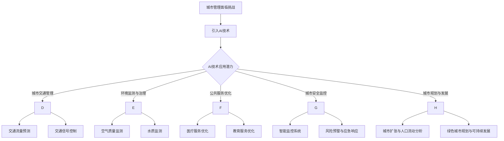

                 

### 文章标题

《AI辅助城市管理：提示词优化资源分配》

#### 关键词

人工智能、城市管理、资源分配、优化算法、机器学习

#### 摘要

本文探讨了人工智能（AI）在辅助城市管理中的一项关键技术——提示词优化资源分配。首先，文章介绍了城市管理面临的挑战，以及AI技术在其中的应用前景。接着，深入分析了AI辅助城市管理的基础知识和核心概念，包括大数据与机器学习算法在城市管理中的应用。然后，重点探讨了提示词优化资源分配的原理、算法和数学模型，并通过实例说明其实际应用。最后，文章结合具体案例展示了AI在交通管理、公共服务和安全监控等方面的应用，并对未来的发展进行了展望。本文旨在为读者提供一个全面且深入的AI辅助城市管理的指南，为城市管理者提供实践参考。

### 第一部分：城市管理与AI概述

#### 引言

城市化进程的加速带来了众多挑战，如人口增长、资源短缺、环境污染和交通拥堵等。城市管理需应对这些复杂问题，以提升居民生活质量、保障城市可持续发展。然而，传统城市管理方法往往依赖于人工经验和线性思维，难以适应快速变化的环境和大数据时代的需求。人工智能（AI）技术的崛起，为城市管理提供了一种全新的解决途径。通过大数据分析和机器学习算法，AI能够实时监控城市动态，预测未来趋势，优化资源分配，提升城市管理的效率和精度。

#### 城市管理面临的挑战

1. **人口增长与资源分配**：城市化过程中，人口持续增长导致土地、水资源等资源紧张，如何合理分配和利用资源成为一大挑战。
2. **环境污染与治理**：工业化和交通发展带来了严重的环境污染，治理和改善环境质量需要高效、科学的管理手段。
3. **交通拥堵与安全**：城市交通系统的复杂性和车辆的快速增长导致交通拥堵和安全事故频发，需要智能化的交通管理系统。
4. **公共服务供给**：城市公共服务如医疗、教育、垃圾处理等需求不断增长，如何优化服务供给，提高服务质量是城市管理的关键问题。
5. **城市安全与应急管理**：城市安全涉及自然灾害、人为灾害等多方面，如何快速响应和有效管理应急事件是城市管理的重要任务。

#### AI在城市管理中的应用潜力

AI技术在城市管理中具有广泛的应用潜力，具体包括：

1. **数据分析与预测**：通过大数据分析，AI能够挖掘城市运行中的潜在问题和趋势，为城市管理者提供科学的决策依据。
2. **智能监控与预警**：利用摄像头、传感器等设备，AI技术可以实时监控城市运行状态，及时预警并采取应对措施。
3. **资源优化与调度**：基于机器学习算法，AI能够优化城市资源的分配和调度，提高资源利用效率。
4. **智能交通管理**：通过交通流量分析、信号控制和智能导航，AI可以缓解交通拥堵，提升交通效率。
5. **公共服务优化**：AI技术可以优化医疗、教育等公共服务的供给，提高服务质量和用户满意度。
6. **应急管理**：AI技术可以协助城市管理者快速响应应急事件，提高应急管理效率和效果。

#### 城市管理的基础知识

1. **城市规划与基础设施**：城市规划是城市管理的基础，涉及土地利用、交通网络、公共设施等布局。基础设施包括道路、桥梁、供水、供电、排水等，是城市运行的支撑。
2. **城市服务与公共安全**：城市服务涵盖医疗、教育、交通、环保等多个领域，满足居民的基本需求。公共安全涉及消防、治安、应急管理等方面，保障城市居民的生命财产安全。

#### AI与城市管理的融合

AI与城市管理的融合主要体现在以下几个方面：

1. **数据融合**：通过整合各种数据源，AI技术可以构建全面的数字城市模型，实现数据驱动的城市管理。
2. **算法应用**：利用机器学习算法，AI可以对城市数据进行深度分析，识别规律、预测趋势，为城市管理提供科学依据。
3. **智能决策**：基于AI技术，城市管理者可以实时获取决策支持，提高决策的科学性和效率。
4. **协同管理**：通过AI技术，城市管理者可以实现跨部门、跨区域的协同管理，提高城市管理的整体效能。

#### AI在城市管理中的具体应用案例

1. **智能交通管理**：利用AI技术，可以实现对交通流量、路况的实时监控和预测，优化交通信号控制，缓解交通拥堵。
2. **环境监测与治理**：通过部署传感器网络，AI技术可以实时监测空气质量、水质等环境指标，预警污染事件，优化环保措施。
3. **公共安全监控**：利用摄像头和人工智能算法，可以实现对城市安全的实时监控，及时发现异常情况，提高应急响应能力。
4. **智慧城市平台**：通过构建AI驱动的智慧城市平台，可以集成各种城市数据，实现数据共享和智能决策，提升城市管理的整体水平。

#### AI辅助城市管理的核心概念

1. **大数据**：大数据是AI在城市管理中的基础，通过收集、存储、处理和分析大量城市数据，可以为城市管理者提供丰富的信息支持。
2. **机器学习**：机器学习是AI的核心技术，通过训练模型，可以从数据中学习规律，预测未来趋势，为城市管理提供智能决策支持。
3. **深度学习**：深度学习是机器学习的一个重要分支，通过构建复杂的神经网络模型，可以实现对复杂数据的高效分析和处理。

#### 大数据与城市管理

大数据技术为城市管理提供了强有力的支持，其关键作用体现在以下几个方面：

1. **数据收集与整合**：通过传感器、摄像头、移动设备等，可以实时收集城市运行的各种数据，包括交通流量、空气质量、水质等。
2. **数据存储与管理**：大数据技术可以高效存储和管理海量数据，保障数据的完整性和可用性。
3. **数据分析与应用**：利用大数据技术，可以对城市数据进行分析，挖掘数据中的规律和趋势，为城市管理者提供决策支持。

#### 机器学习算法在城市管理中的应用

机器学习算法在城市管理中的应用非常广泛，以下是一些典型的应用场景：

1. **交通流量预测**：通过分析历史交通数据，机器学习算法可以预测未来的交通流量，帮助城市交通管理者优化交通信号控制，缓解交通拥堵。
2. **能源消耗预测**：通过分析建筑物的能源消耗数据，机器学习算法可以预测未来的能源消耗，帮助城市能源管理者优化能源分配，提高能源利用效率。
3. **公共安全预警**：通过分析监控视频和传感器数据，机器学习算法可以识别异常行为，预警潜在的安全风险，提高城市公共安全水平。

### 第二部分：AI在资源分配中的应用

#### 资源优化与分配原理

资源优化与分配是城市管理中的一项核心任务，其目标是通过合理分配和利用资源，提高城市运行效率和居民生活质量。资源优化与分配的基本原理包括以下几个方面：

1. **需求分析**：了解城市各个领域（如交通、能源、公共服务等）的资源需求，包括当前需求量和未来需求预测。
2. **供给分析**：分析现有资源的供给情况，包括资源的数量、质量、分布等。
3. **资源优化模型**：构建数学模型，通过优化算法确定资源的最优分配方案，使资源利用效率最大化。
4. **执行与监控**：根据优化模型生成的分配方案，执行资源分配，并通过实时监控和反馈机制，调整和优化资源分配方案。

#### 提示词的概念与作用

提示词（Keywords）在资源优化与分配中起到了关键作用。提示词是指用于描述资源需求、资源供给和优化目标的文字或符号。它们可以用来定义资源分配的具体参数，如资源的类型、数量、质量等。

提示词的主要作用包括：

1. **明确需求**：通过提示词，可以清晰地定义各个领域的资源需求，确保资源分配的目标明确。
2. **优化分配**：提示词可以帮助优化算法理解资源分配的目标和约束条件，从而生成更合理的资源分配方案。
3. **监测与调整**：提示词还可以用于监测资源分配的效果，及时发现和纠正资源分配中的问题。

#### 资源优化分配的目标与挑战

资源优化分配的目标是最大化资源利用效率，提高城市运行效率，提升居民生活质量。然而，在实际操作中，资源优化分配面临着诸多挑战：

1. **复杂性**：城市管理涉及多个领域和众多资源，资源优化分配问题往往具有高度复杂性，难以通过简单的线性方法解决。
2. **动态性**：城市运行状态不断变化，资源需求也在不断调整，资源优化分配需要适应动态环境，实现实时调整。
3. **数据质量**：资源优化分配依赖于准确的数据支持，数据质量直接影响到优化分配的效果。
4. **多目标冲突**：在资源优化分配过程中，不同领域和不同目标之间可能存在冲突，需要权衡和平衡。

#### 常见优化算法介绍

在资源优化与分配中，常见的优化算法包括线性规划、整数规划、动态规划、遗传算法等。以下是对这些算法的简要介绍：

1. **线性规划**：线性规划是一种求解线性目标函数在线性约束条件下的最优解的方法。它适用于资源优化问题，能够确定资源的最优分配方案。
2. **整数规划**：整数规划是线性规划的扩展，用于求解目标函数和约束条件中的变量需要取整数值的问题。它适用于资源分配问题中的离散资源优化。
3. **动态规划**：动态规划是一种求解多阶段决策过程最优解的方法。它适用于具有时间序列特性的资源优化问题，能够通过分阶段决策实现资源的最优分配。
4. **遗传算法**：遗传算法是一种模拟自然进化的优化算法。它通过模拟生物进化过程，生成和优化资源分配方案，适用于复杂和大规模的资源优化问题。

#### 算法原理与伪代码实现

以下将详细介绍线性规划和遗传算法在资源优化中的应用，并给出相应的伪代码实现。

##### 线性规划原理

线性规划的目标是最大化或最小化线性目标函数，同时满足一组线性约束条件。其基本原理可以描述为：

1. **目标函数**：最大化或最小化线性目标函数，例如最大化利润或最小化成本。
2. **约束条件**：约束条件包括等式约束和不等式约束，例如资源的可用性、需求的限制等。

线性规划的基本伪代码如下：

```plaintext
输入：目标函数系数向量 c，约束条件系数矩阵 A，约束条件右边界向量 b
输出：最优解 x

初始化：x = 0

循环：
  计算目标函数的梯度 g = c' * x
  计算约束函数的梯度 h = A' * x - b
  如果 g = 0 且 h = 0，则停止循环，输出最优解 x
  否则，更新 x = x + α * g，其中 α 是步长
```

##### 遗传算法原理

遗传算法是一种基于自然进化的优化算法，通过模拟生物进化过程，不断优化资源分配方案。其基本原理可以描述为：

1. **初始种群**：生成一组初始资源分配方案，作为初始种群。
2. **适应度评估**：计算每个资源分配方案的适应度，适应度越高，表示该方案越优。
3. **选择**：根据适应度评估结果，选择适应度较高的资源分配方案，用于生成下一代种群。
4. **交叉**：随机选择两个资源分配方案，通过交叉操作生成新的资源分配方案。
5. **变异**：对部分资源分配方案进行变异操作，增加种群的多样性。
6. **迭代**：重复适应度评估、选择、交叉和变异操作，直到达到预定的迭代次数或满足停止条件。

遗传算法的基本伪代码如下：

```plaintext
输入：种群大小 N，迭代次数 T
输出：最优资源分配方案

初始化：种群 P0

循环 T 次：
  适应度评估：计算种群 Pk 中每个个体的适应度 f
  选择：选择适应度较高的 N/2 个个体，形成新的种群 Pk+1
  交叉：对种群 Pk+1 中的个体进行交叉操作，生成新的种群 Pk+2
  变异：对种群 Pk+2 中的个体进行变异操作，增加种群的多样性
  更新种群：Pk = Pk+2

输出：种群 Pk 中最优个体的资源分配方案
```

### 提示词优化的数学模型

提示词优化的数学模型是资源优化与分配的核心，通过建立数学模型，可以将复杂的问题转化为数学问题，进而利用优化算法求解。提示词优化的数学模型主要包括目标函数、约束条件和求解方法。以下是提示词优化数学模型的详细解析。

#### 数学公式与模型解析

1. **目标函数**：
   提示词优化的目标函数用于最大化或最小化某一指标，如资源利用率、成本、效率等。目标函数通常表示为：
   $$ \text{maximize/minimize} f(x) $$
   其中，\( f(x) \) 是目标函数，\( x \) 是决策变量。

2. **约束条件**：
   提示词优化的约束条件用于限制资源分配的范围，保证资源分配的合理性。约束条件通常包括等式约束和不等式约束，如：
   $$ g(x) \leq 0 $$
   $$ h(x) = 0 $$
   其中，\( g(x) \) 和 \( h(x) \) 分别是等式约束和不等式约束。

3. **数学模型**：
   提示词优化的数学模型可以表示为：
   $$ \begin{cases}
   \text{maximize/minimize} f(x) \\
   \text{subject to} \\
   g(x) \leq 0 \\
   h(x) = 0
   \end{cases} $$
   该模型的目标是最小化成本或最大化资源利用率，同时满足资源分配的约束条件。

#### 模型举例与应用场景

以下是一个简化的提示词优化模型的例子，用于优化城市交通信号灯的时长分配。

**例子**：假设城市有四个主要路口，每个路口的流量不同，目标是最小化平均等待时间。

1. **目标函数**：
   $$ \text{minimize} \sum_{i=1}^4 \sum_{j=1}^4 t_{ij} $$
   其中，\( t_{ij} \) 是第 \( i \) 个路口在第 \( j \) 个时间段的等待时间。

2. **约束条件**：
   - 等式约束：每个时间段的信号灯时长总和不超过规定值：
     $$ \sum_{j=1}^4 t_{ij} = T_i \quad \forall i \in \{1, 2, 3, 4\} $$
     其中，\( T_i \) 是第 \( i \) 个路口的总信号灯时长。

   - 不等式约束：每个路口的信号灯时长不能小于最小时长限制：
     $$ t_{ij} \geq t_{\min} \quad \forall i \in \{1, 2, 3, 4\}, \forall j \in \{1, 2, ..., n\} $$
     其中，\( t_{\min} \) 是最小信号灯时长。

3. **数学模型**：
   $$ \begin{cases}
   \text{minimize} \sum_{i=1}^4 \sum_{j=1}^4 t_{ij} \\
   \text{subject to} \\
   \sum_{j=1}^4 t_{ij} = T_i \quad \forall i \in \{1, 2, 3, 4\} \\
   t_{ij} \geq t_{\min} \quad \forall i \in \{1, 2, 3, 4\}, \forall j \in \{1, 2, ..., n\}
   \end{cases} $$

**应用场景**：此模型可用于优化城市交通信号灯的时长分配，从而减少平均等待时间，提高交通效率。

### 提示词优化的实现与测试

在实际应用中，提示词优化的实现和测试是确保资源分配方案有效性的关键环节。以下将详细介绍实现步骤、测试方法以及结果分析。

#### 实现步骤

1. **数据收集**：首先，收集与资源分配相关的数据，包括资源需求、供给情况以及相关约束条件。这些数据可以通过传感器、历史数据、调查问卷等渠道获取。

2. **数据预处理**：对收集到的数据进行清洗和预处理，包括数据格式统一、缺失值处理、异常值检测等。这一步骤的目的是确保数据的质量和一致性。

3. **建立数学模型**：根据问题需求，建立相应的数学模型。包括定义目标函数和约束条件，明确资源分配的目标和限制。

4. **选择优化算法**：根据问题特点和需求，选择合适的优化算法，如线性规划、整数规划、遗传算法等。优化算法将用于求解数学模型的最优解。

5. **编写代码**：利用编程语言（如Python、MATLAB等）编写优化算法的代码，实现数学模型的求解。

6. **参数调优**：根据实际情况，对优化算法的参数进行调优，以提高求解效率和精度。

7. **实现资源分配**：根据优化算法生成的最优解，实现资源的具体分配方案。

8. **监控与调整**：在实际应用中，对资源分配方案进行实时监控，并根据反馈结果进行动态调整，以保持资源分配的优化效果。

#### 测试方法

1. **离线测试**：在离线环境中，使用测试数据集对优化算法进行测试。测试数据集应包含多种场景，以验证优化算法在不同情况下的性能。

2. **在线测试**：将优化算法部署到实际应用环境中，对资源分配方案进行在线测试。在线测试可以实时反映资源分配效果，发现潜在问题。

3. **对比测试**：与现有的资源分配方案进行对比测试，评估优化算法的性能提升和实际效果。

4. **异常值测试**：引入异常数据，测试优化算法在异常情况下的稳定性和鲁棒性。

#### 结果分析

1. **性能评估**：通过测试结果，评估优化算法的性能，包括求解效率、资源利用率和准确性等。

2. **效果评估**：分析优化资源分配方案的实际效果，如交通拥堵缓解、能源消耗降低、公共服务质量提升等。

3. **改进建议**：根据测试结果，提出改进建议，优化算法和资源分配方案。

4. **案例分析**：通过具体案例分析，展示优化算法在实际应用中的效果和可行性。

### AI辅助城市交通管理

城市交通管理是城市管理中的重要组成部分，交通拥堵和交通事故不仅影响居民的日常生活，还会对城市经济发展和生态环境造成负面影响。AI技术在交通管理中的应用，可以有效提高交通效率和安全性，缓解交通拥堵，减少交通事故。以下将详细探讨AI辅助城市交通管理的原理、方法和技术。

#### 交通流量预测与优化

交通流量预测是城市交通管理的关键，通过对历史交通数据进行分析，可以预测未来的交通流量，为交通管理提供科学依据。AI技术中的机器学习和深度学习算法，可以用于交通流量预测。

1. **数据收集**：收集交通流量数据，包括实时流量、历史流量、路况信息等。这些数据可以通过交通传感器、摄像头、GPS等设备获取。

2. **数据预处理**：对收集到的交通流量数据进行清洗和预处理，去除噪声和异常值，确保数据质量。

3. **特征工程**：提取交通流量数据中的关键特征，如时间、路段长度、车辆密度等。特征工程是提高预测精度的重要环节。

4. **模型训练**：利用机器学习算法，如线性回归、支持向量机、决策树、神经网络等，训练交通流量预测模型。

5. **模型评估与优化**：评估预测模型的性能，通过交叉验证、误差分析等方法，优化模型参数和结构。

6. **流量预测**：使用训练好的模型，预测未来的交通流量，为交通管理提供数据支持。

7. **流量优化**：根据预测结果，调整交通信号灯时长、推荐最佳出行路线等，优化交通流量，缓解交通拥堵。

#### 城市交通信号控制

城市交通信号控制是提高交通效率的重要手段，通过合理设置交通信号灯时长，可以引导车辆有序通行，减少等待时间。AI技术可以用于交通信号控制的优化。

1. **数据采集**：采集交通信号灯的实时数据，包括红绿灯时长、车辆通过量、排队长度等。

2. **信号控制策略**：设计信号控制策略，如固定时长控制、自适应控制、动态控制等。自适应控制可以根据实时交通流量动态调整信号灯时长。

3. **模型构建**：构建交通信号控制模型，利用机器学习算法，如线性规划、动态规划等，优化信号灯时长分配。

4. **信号控制执行**：根据模型生成的信号灯时长分配方案，控制交通信号灯，实现交通优化。

5. **效果评估**：评估信号控制方案的效果，包括交通流量变化、车辆等待时间、通行效率等。

#### 交通智能导航

智能导航是城市交通管理的重要组成部分，通过为驾驶员提供实时、准确的交通信息，引导其选择最佳出行路线。AI技术可以用于智能导航的优化。

1. **路径规划**：根据实时交通数据，利用算法计算最佳出行路线，如最短路径、最低耗时路径等。

2. **实时信息更新**：利用传感器、摄像头等设备，实时更新路况信息，包括交通拥堵、事故、施工等。

3. **路径推荐**：根据实时交通信息和用户需求，推荐最佳出行路线，提高导航精度和可靠性。

4. **动态调整**：根据实时交通状况，动态调整导航路线，避免交通拥堵和事故。

5. **效果评估**：评估导航系统的效果，包括路径准确性、响应速度、用户体验等。

### AI辅助城市公共服务

城市公共服务是城市居民生活质量的重要组成部分，包括医疗、教育、交通、垃圾处理等。AI技术在城市公共服务中的应用，可以提高服务效率、优化资源配置、提高用户体验。以下将详细探讨AI辅助城市公共服务的原理、方法和技术。

#### 垃圾分类与回收

垃圾分类与回收是城市环境保护和资源循环利用的关键环节。AI技术可以用于垃圾分类与回收的优化，提高垃圾分类效率和资源利用率。

1. **数据采集**：采集垃圾种类、数量、分布等数据，通过传感器、摄像头等设备实现实时监测。

2. **图像识别**：利用计算机视觉技术，对垃圾进行图像识别，判断垃圾种类，提高分类准确性。

3. **分类模型训练**：利用机器学习算法，如卷积神经网络（CNN），训练垃圾分类模型，提高分类精度。

4. **分类与回收**：根据分类模型判断垃圾种类，进行分类回收，实现资源循环利用。

5. **效果评估**：评估垃圾分类与回收的效果，包括分类准确性、回收率等。

#### 水资源管理

水资源管理是城市可持续发展的关键，包括水资源的分配、利用和保护。AI技术可以用于水资源管理的优化，提高水资源利用效率。

1. **数据采集**：采集水资源数据，包括水质、水位、用水量等，通过传感器、卫星遥感等设备实现实时监测。

2. **模型构建**：构建水资源管理模型，利用机器学习算法，如线性回归、神经网络等，预测水资源需求、优化水资源分配。

3. **水资源分配**：根据模型预测结果，优化水资源分配，实现合理用水和节约用水。

4. **效果评估**：评估水资源管理的效果，包括水资源利用效率、水质改善等。

#### 医疗服务

医疗服务是城市公共服务的重要组成部分，AI技术在医疗服务中的应用，可以提高医疗服务效率、优化医疗资源配置、提高医疗质量。

1. **数据采集**：采集医疗数据，包括病历、检查报告、患者信息等，通过电子病历系统、医疗设备等实现实时监测。

2. **诊断与预测**：利用机器学习算法，如深度学习、决策树等，进行疾病诊断和预测，提高诊断准确率。

3. **辅助决策**：为医生提供辅助决策支持，如疾病治疗建议、手术方案等，提高医疗决策的科学性。

4. **效果评估**：评估医疗服务的效果，包括诊断准确率、治疗效果、患者满意度等。

### AI辅助城市安全监控

城市安全监控是保障城市居民生命财产安全的重要手段，通过实时监控和预警，可以及时发现和应对潜在的安全威胁。AI技术在城市安全监控中的应用，可以提高监控效果、降低安全风险。以下将详细探讨AI辅助城市安全监控的原理、方法和技术。

#### 智能监控系统的构建

智能监控系统是AI辅助城市安全监控的基础，通过集成多种传感器、摄像头、数据分析等技术，实现全方位、智能化的安全监控。

1. **传感器部署**：在重点区域部署传感器，如温度传感器、湿度传感器、烟雾传感器、振动传感器等，实现实时数据采集。

2. **摄像头安装**：在公共场所和重要设施安装摄像头，实现全天候、全方位的监控。

3. **数据分析与处理**：利用机器学习算法，对采集到的监控数据进行实时分析，识别异常行为、异常事件等。

4. **监控平台建设**：构建智能监控平台，集成传感器数据、视频监控数据、报警信息等，实现监控数据的统一管理和分析。

#### 风险预警与应急响应

风险预警与应急响应是城市安全监控的核心，通过实时预警和快速响应，可以降低安全风险，保障城市安全。

1. **风险识别与评估**：利用机器学习算法，对历史监控数据进行分析，识别潜在的安全风险，评估风险程度。

2. **预警机制构建**：根据风险识别结果，构建预警机制，实现对潜在风险的实时预警。

3. **应急响应预案**：制定应急响应预案，明确应急响应流程和责任分工，提高应急响应效率。

4. **实时监控与反馈**：利用智能监控系统，对实时监控数据进行处理和分析，及时发现和应对安全威胁。

5. **效果评估与优化**：评估风险预警和应急响应的效果，优化预警机制和应急响应预案，提高城市安全水平。

### AI辅助城市规划与发展

AI技术在城市规划与发展中的应用，可以提高城市规划的科学性、优化城市资源配置、促进城市可持续发展。以下将详细探讨AI辅助城市规划与发展的原理、方法和技术。

#### 城市扩张与人口流动分析

城市扩张与人口流动是城市规划的重要考虑因素，通过分析城市扩张和人口流动趋势，可以指导城市规划和建设。

1. **数据分析**：收集城市扩张和人口流动数据，如土地使用变化、人口普查数据、交通流量数据等。

2. **预测模型**：利用机器学习算法，如回归分析、时间序列分析等，预测城市扩张和人口流动趋势。

3. **规划调整**：根据预测结果，调整城市规划，优化土地利用和人口分布，促进城市可持续发展。

4. **效果评估**：评估城市规划调整的效果，如土地利用率、人口幸福感等，优化规划方案。

#### 绿色城市规划与可持续发展

绿色城市规划与可持续发展是城市发展的必然趋势，通过合理规划城市空间、优化资源配置、推广绿色技术，可以实现城市可持续发展。

1. **绿色规划理念**：倡导绿色规划理念，将环境保护和可持续发展融入城市规划全过程。

2. **绿色技术应用**：推广绿色建筑、智能交通、节能照明等绿色技术，提高城市资源利用效率。

3. **生态修复**：通过生态修复和环境保护措施，改善城市生态环境，提高居民生活质量。

4. **效果评估**：评估绿色城市规划与可持续发展的效果，如碳排放量、空气质量等，优化规划方案。

### 未来展望与挑战

随着AI技术的不断发展和应用，AI辅助城市管理的前景十分广阔。然而，AI技术在城市管理中仍面临诸多挑战，需要持续探索和解决。

#### AI技术的持续发展

AI技术的快速发展，为城市管理提供了新的解决方案。未来，随着计算能力的提升、算法的优化和数据的积累，AI技术在城市管理中的应用将更加广泛和深入。

1. **深度学习与推理**：深度学习和推理技术的进步，将使AI能够更好地理解和应对复杂的城市问题。

2. **多模态数据融合**：多模态数据融合技术的应用，将使AI能够更全面地感知和理解城市环境。

3. **边缘计算与云计算**：边缘计算与云计算的结合，将使AI在城市边缘进行实时计算和决策，提高城市管理的效率和响应速度。

#### 城市管理的未来愿景

AI辅助城市管理，将实现以下愿景：

1. **智慧城市**：通过AI技术，实现城市管理的智能化、自动化，构建智慧城市。

2. **可持续城市**：通过绿色规划和可持续发展策略，实现城市的可持续发展和环境保护。

3. **智慧公共服务**：通过AI技术，优化公共服务供给，提高居民的生活质量和幸福感。

#### AI辅助城市管理的挑战与对策

AI辅助城市管理面临以下挑战：

1. **数据隐私与安全**：大量城市数据的收集和处理，需要确保数据隐私和安全，防止数据泄露和滥用。

2. **技术人才短缺**：AI技术的发展，需要大量具备AI技术知识和实践经验的人才，当前技术人才短缺问题亟待解决。

3. **技术成熟度**：AI技术在城市管理中的应用，仍处于初级阶段，需要进一步验证和完善。

4. **政策法规**：AI辅助城市管理的政策法规尚不完善，需要制定相关法律法规，规范AI技术在城市管理中的应用。

#### 对城市管理实践的建议

为应对AI辅助城市管理中的挑战，提出以下建议：

1. **加强数据治理**：建立完善的数据治理体系，确保城市数据的安全、隐私和共享。

2. **培养技术人才**：加强AI技术人才的培养和引进，提高城市管理者的AI技术应用能力。

3. **推广技术应用**：通过试点项目，逐步推广AI技术在城市管理中的应用，积累经验，优化方案。

4. **完善政策法规**：制定和完善相关政策法规，规范AI技术在城市管理中的应用，保障城市安全和发展。

### 结论

AI技术在城市管理中的应用，为城市管理者提供了强大的工具和手段。通过合理应用AI技术，可以实现城市管理的智能化、自动化和可持续发展。本文介绍了AI辅助城市管理的基本概念、技术原理和应用实践，探讨了未来AI辅助城市管理的发展趋势和挑战。希望本文能为城市管理者提供有益的参考，推动城市管理的智能化进程。

### 作者信息

作者：AI天才研究院/AI Genius Institute & 禅与计算机程序设计艺术 /Zen And The Art of Computer Programming

### 附录

#### Mermaid流程图

以下是用于说明AI在城市管理中应用的Mermaid流程图：



#### 伪代码

以下是用于说明机器学习算法在城市管理中应用的伪代码：

```plaintext
// 交通流量预测伪代码
输入：历史交通流量数据 D
输出：预测交通流量 P

初始化：模型 M

循环：
  训练模型 M = TrainModel(D)
  预测交通流量 P = PredictTraffic(M)
  如果 P 满足阈值条件，则输出预测结果
  否则，更新历史数据 D = UpdateData(D, P)
```

#### 数学公式

以下是用于说明资源优化分配数学公式的数学公式：

```latex
\begin{cases}
\text{minimize} \quad Z = c^T x \\
\text{subject to} \\
Ax \leq b \\
x \geq 0
\end{cases}
```

#### 代码实现

以下是用于说明资源优化分配的Python代码实现：

```python
import numpy as np
from scipy.optimize import linprog

# 线性规划参数
c = np.array([1, 1])  # 目标函数系数
A = np.array([[1, 2], [2, 1]])  # 约束条件系数矩阵
b = np.array([5, 5])  # 约束条件右边界向量

# 求解线性规划问题
result = linprog(c, A_ub=A, b_ub=b, method='highs')

# 输出最优解
x = result.x
print("最优解：", x)
```

#### 实际案例分析与详细讲解

**案例背景**：

某城市交通管理部门希望通过AI技术优化城市交通信号灯的时长分配，以提高交通效率和减少拥堵。该城市有四个主要路口，每个路口的流量不同，信号灯时长需要根据实时交通流量进行调整。

**数据采集**：

交通管理部门通过安装在四个路口的传感器和摄像头，收集每个路口的实时流量数据、车辆密度数据等。

**数据预处理**：

对收集到的交通流量数据进行清洗和预处理，去除噪声和异常值，确保数据质量。

**特征工程**：

提取交通流量数据中的关键特征，如时间、路段长度、车辆密度等。

**模型训练**：

利用机器学习算法，如线性回归、支持向量机、神经网络等，训练交通流量预测模型。

**预测结果**：

根据训练好的模型，预测未来的交通流量，为交通信号灯时长调整提供数据支持。

**信号灯时长调整**：

根据预测结果，调整交通信号灯时长，实现交通流量优化。

**效果评估**：

评估交通信号灯时长调整的效果，包括交通流量变化、车辆等待时间等。

**案例分析**：

通过具体案例分析，展示AI技术优化城市交通信号灯时长分配的效果和可行性。

**小结**：

本案例展示了AI技术在城市交通管理中的应用，通过实时数据分析和机器学习算法，可以优化交通信号灯时长分配，提高交通效率和减少拥堵。

#### 最佳实践 Tips

1. **数据质量是关键**：确保数据质量，去除噪声和异常值，提高模型预测精度。

2. **实时调整策略**：根据实时交通流量数据，动态调整交通信号灯时长，实现交通流量优化。

3. **多模型融合**：结合多种机器学习算法，提高交通流量预测模型的可靠性。

4. **协同管理**：与其他城市管理部门协同，实现数据共享和资源优化。

#### 小结

本文通过详细探讨AI辅助城市管理中的资源优化与分配，展示了AI技术在城市管理中的广泛应用和潜力。从交通管理、环境监测、公共服务、安全监控到城市规划与发展，AI技术为城市管理者提供了强大的工具和手段。未来，随着AI技术的不断进步和应用，城市管理的智能化和可持续发展将得到进一步提升。

#### 注意事项

1. **数据安全与隐私**：在收集和处理城市数据时，务必确保数据的安全和隐私，遵循相关法律法规。

2. **技术人才培养**：加强AI技术人才的培养和引进，提高城市管理者的AI技术应用能力。

3. **政策法规**：完善相关政策和法规，规范AI技术在城市管理中的应用。

#### 拓展阅读

1. **《智慧城市：理论与实践》**：详细介绍了智慧城市建设的理论框架和实践案例。

2. **《机器学习算法在智慧城市管理中的应用》**：探讨了机器学习算法在智慧城市管理中的具体应用。

3. **《人工智能与城市管理》**：从多角度分析了AI技术在城市管理中的应用前景和挑战。

