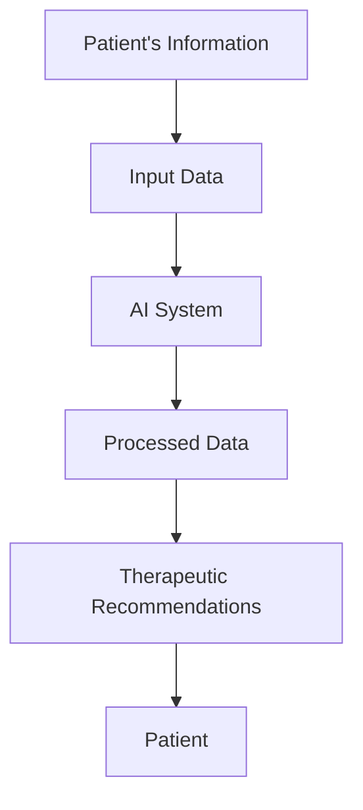
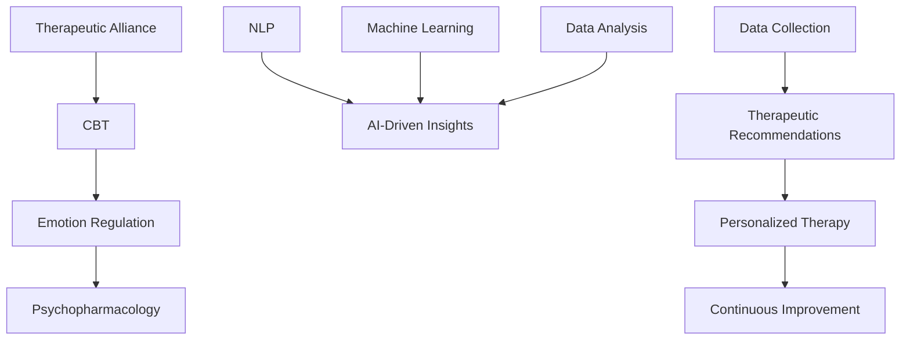

                 


### Introduction to AI-assisted Psychological Therapy

#### Background and Significance

The landscape of psychological therapy has witnessed a remarkable transformation with the advent of artificial intelligence (AI). AI-assisted psychological therapy leverages machine learning algorithms, natural language processing (NLP), and other AI techniques to enhance the effectiveness and accessibility of therapeutic interventions. This fusion of AI and psychology aims to address the growing demand for mental health services and the limitations posed by traditional therapeutic methods.

In recent years, there has been a surge of research exploring the integration of AI in psychological therapy. AI technologies have the potential to facilitate personalized treatment plans, improve diagnostic accuracy, and provide real-time support to patients. The importance of AI in this context lies in its ability to process vast amounts of data, recognize patterns, and offer insights that can complement human expertise.

#### The Role of Prompt Words in AI-assisted Therapy

Prompt words play a critical role in AI-assisted psychological therapy. These are the textual cues or prompts that guide the AI system in generating meaningful responses or recommendations. Well-designed prompt words can enhance the interaction between patients and AI systems, leading to more accurate and effective therapeutic outcomes.

The primary function of prompt words is to provide context and direction to the AI. By offering specific keywords or phrases, therapists can ensure that the AI focuses on relevant aspects of the patient's condition or treatment plan. For example, a prompt word like "anxiety" might prompt the AI to provide information on coping strategies, while a word like "sleep" could lead to suggestions for improving sleep quality.

Moreover, prompt words can help in personalizing the therapeutic experience. By incorporating patient-specific details, such as age, gender, or medical history, therapists can tailor the AI's responses to meet the individual needs of each patient.

#### Mermaid Process Diagram



In this diagram, patient information is input into the AI system, which processes the data and generates therapeutic recommendations based on the prompt words provided by the therapist. These recommendations are then delivered back to the patient for personalized care.

### Core Concepts and Frameworks

Understanding the core concepts and frameworks of psychological therapy and AI is essential to appreciate the potential of AI-assisted psychological therapy. Below, we discuss some of the key concepts and their interrelationships.

#### Key Concepts in Psychological Therapy

1. **Therapeutic Alliance**: The collaborative relationship between the patient and the therapist is a cornerstone of effective therapy. This alliance fosters trust, respect, and understanding, which are crucial for positive therapeutic outcomes.
2. **Cognitive Behavioral Therapy (CBT)**: CBT is a widely used therapeutic approach that focuses on identifying and changing negative thought patterns and behaviors. AI can support CBT by providing personalized feedback and coping strategies.
3. **Emotion Regulation**: Emotion regulation refers to the ability to manage and respond to emotions in a healthy way. AI systems can assist patients in developing skills for emotion regulation through targeted interventions.
4. **Psychopharmacology**: The use of medication to treat mental health conditions. AI can help in tailoring medication regimens based on individual patient profiles and real-time data.

#### Overview of AI in Psychological Sciences

1. **Natural Language Processing (NLP)**: NLP enables AI systems to understand, interpret, and generate human language. This is particularly useful in psychological therapy for tasks such as sentiment analysis, emotion recognition, and language-based therapy interventions.
2. **Machine Learning and Deep Learning**: These AI techniques can analyze large datasets to identify patterns and make predictions. In therapy, they can be used to predict treatment outcomes, personalize interventions, and enhance diagnostic accuracy.
3. **Data Analysis and Mining**: AI can process vast amounts of patient data to uncover insights that might not be apparent through traditional analysis methods. This can lead to more effective and targeted therapeutic approaches.

#### The Integration of AI and Psychological Therapy

The integration of AI and psychological therapy involves several key components:

1. **Data Collection and Integration**: Gathering and integrating data from various sources, such as patient self-reports, clinical assessments, and physiological sensors, to create a comprehensive view of the patient's condition.
2. **AI-Driven Insights**: Using AI to analyze this data and generate insights that can inform treatment planning and decision-making.
3. **Personalized Therapy**: Tailoring therapeutic interventions based on individual patient needs and preferences, as identified by the AI system.
4. **Continuous Improvement**: Iteratively refining therapeutic approaches based on feedback and outcomes to improve effectiveness over time.

#### Mermaid Diagram of Core Concept Relationships



In this diagram, the key concepts in psychological therapy (A, B, C, D) interact with AI technologies (E, F, G, H) to generate therapeutic recommendations (J) that are personalized (K) and continuously improved (L).

### Mainstream AI Techniques for Therapy

The application of AI in psychological therapy is facilitated by several mainstream AI techniques, each with its own set of principles and algorithms. Here, we explore the primary AI techniques that underpin AI-assisted psychological therapy.

#### Natural Language Processing (NLP)

NLP is a subfield of AI that focuses on the interaction between computers and human language. In psychological therapy, NLP is used for tasks such as sentiment analysis, emotion recognition, and language-based therapy interventions. The core principles of NLP include:

1. **Tokenization**: The process of splitting text into individual words or tokens.
2. **Part-of-Speech Tagging**: Identifying the grammatical role of each word in a sentence.
3. **Sentiment Analysis**: Classifying the sentiment expressed in a text, such as identifying positive, negative, or neutral emotions.
4. **Emotion Recognition**: Identifying and categorizing emotional states based on text or voice input.

Example Algorithm:
```python
import nltk

def analyze_sentiment(text):
    # Tokenize the text
    tokens = nltk.word_tokenize(text)
    # Perform sentiment analysis
    sentiment_score = sentiment_analyzer.polarity_scores(tokens)
    # Classify sentiment
    if sentiment_score['compound'] >= 0.05:
        return 'Positive'
    elif sentiment_score['compound'] <= -0.05:
        return 'Negative'
    else:
        return 'Neutral'
```

#### Machine Learning and Deep Learning

Machine Learning (ML) and Deep Learning (DL) are AI techniques that enable computers to learn from data and make predictions or decisions. In psychological therapy, ML and DL are used for tasks such as patient profiling, treatment prediction, and personalized therapy.

1. **Supervised Learning**: This involves training a model on a labeled dataset, where the output is known. The model learns to map inputs to outputs.
2. **Unsupervised Learning**: This involves training a model on unlabeled data to find patterns or structures within the data.
3. **Reinforcement Learning**: This involves training a model to make decisions by receiving feedback from the environment.

Example Algorithm:
```python
import tensorflow as tf

# Define the neural network architecture
model = tf.keras.Sequential([
    tf.keras.layers.Dense(128, activation='relu', input_shape=(input_shape)),
    tf.keras.layers.Dropout(0.2),
    tf.keras.layers.Dense(10, activation='softmax')
])

# Compile the model
model.compile(optimizer='adam',
              loss='sparse_categorical_crossentropy',
              metrics=['accuracy'])

# Train the model
model.fit(x_train, y_train, epochs=5)
```

#### Application Scenarios of AI in Therapy

AI techniques have a wide range of applications in psychological therapy, including:

1. **Diagnosis and Treatment Planning**: AI can assist in diagnosing mental health conditions and developing personalized treatment plans based on patient data.
2. **Therapeutic Interventions**: AI can deliver therapeutic interventions, such as cognitive-behavioral therapy (CBT), through chatbots or virtual assistants.
3. **Patient Monitoring**: AI can monitor patient progress and adjust treatment plans in real-time based on patient feedback and behavior.
4. **Support and Self-help Tools**: AI-powered apps and tools can provide support and self-help resources for mental health issues.

By leveraging these AI techniques, psychological therapy can become more personalized, efficient, and accessible, ultimately improving patient outcomes.

### Conclusion

In this article, we have explored the role of prompt words in AI-assisted psychological therapy, the integration of key psychological therapy concepts with AI, and the main AI techniques used in therapy. Prompt words are crucial in guiding AI systems to provide relevant and personalized therapeutic recommendations. The integration of AI and psychological therapy offers the potential to enhance diagnostic accuracy, personalize treatment plans, and improve overall patient outcomes. As AI technologies continue to advance, their application in psychological therapy is poised to revolutionize mental health care, making it more accessible and effective for individuals worldwide.

