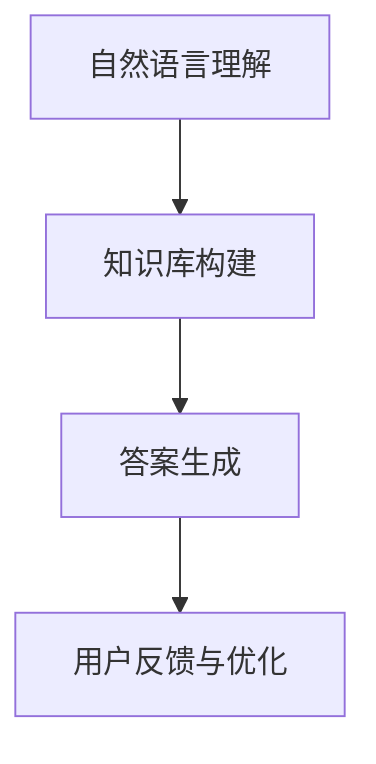
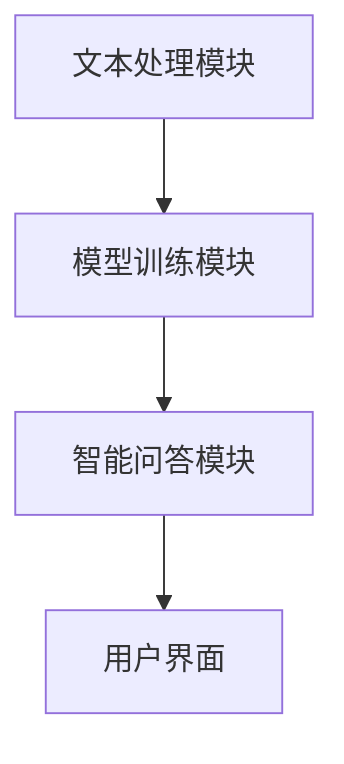
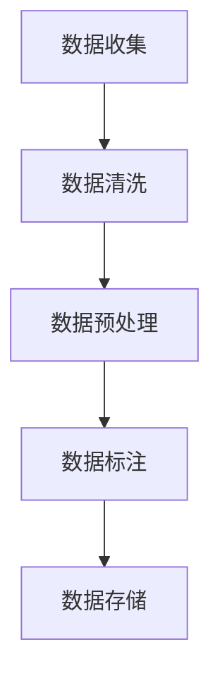
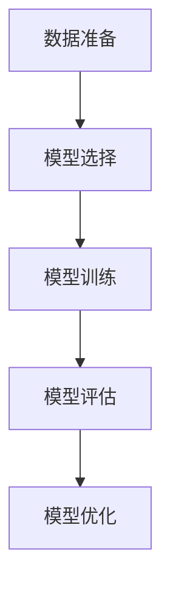
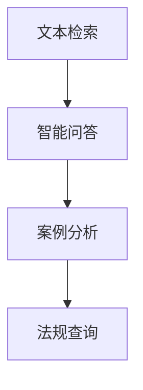
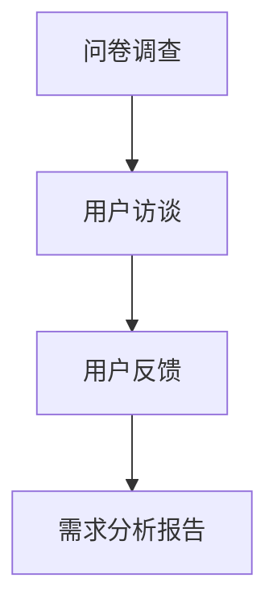
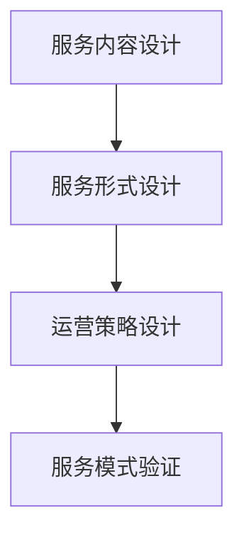
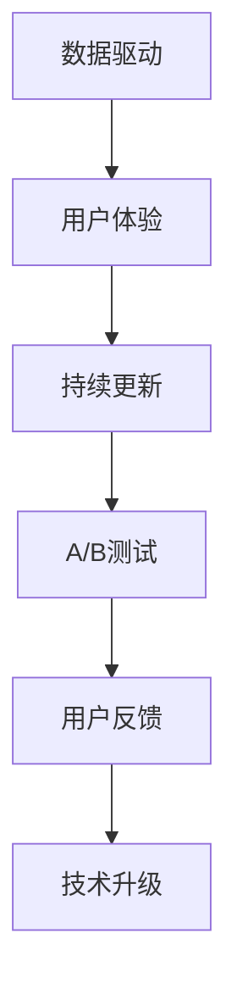

                 


### 文章标题：AI辅助法律咨询：提示词解析法律文本

> 关键词：AI辅助法律咨询、法律文本、提示词解析、智能问答、智能交互设计、技术原理、应用实践

> 摘要：本文旨在探讨AI辅助法律咨询领域，特别是提示词解析法律文本的技术原理、应用实践及未来发展趋势。通过对法律咨询需求的背景分析、核心概念的阐述、技术原理的深入解析、应用实践的具体案例和最佳实践总结，本文为读者提供了一个全面而深入的视角，旨在推动AI在法律咨询领域的创新与应用。

## 目录

- 第一部分：AI辅助法律咨询概述
  - 1.1 AI在法律领域的应用背景
  - 1.1.1 法律咨询的需求与挑战
  - 1.1.2 AI技术助力法律咨询
  - 1.2 AI辅助法律咨询的核心概念
  - 1.2.1 提示词解析技术
  - 1.2.2 法律文本分析与理解
  - 1.2.3 智能问答与交互设计
  - 1.3 AI辅助法律咨询的现状与未来
  - 1.3.1 当前AI辅助法律咨询的应用案例
  - 1.3.2 未来发展趋势与挑战

- 第二部分：AI辅助法律咨询的技术原理
  - 2.1 提示词解析技术
  - 2.1.1 提示词解析的基本概念
  - 2.1.2 提示词解析的算法原理
  - 2.1.3 提示词解析的挑战与优化策略
  - 2.2 法律文本分析与理解
  - 2.2.1 法律文本的特点与分类
  - 2.2.2 法律文本的预处理
  - 2.2.3 法律文本的语义分析
  - 2.3 智能问答与交互设计
  - 2.3.1 智能问答的基本原理
  - 2.3.2 智能问答系统设计
  - 2.3.3 交互设计的实践与反思

- 第三部分：AI辅助法律咨询的应用实践
  - 3.1 项目实战一：构建简易AI法律咨询系统
  - 3.1.1 开发环境与工具
  - 3.1.2 系统架构设计
  - 3.1.3 源代码实现与解读
  - 3.2 项目实战二：基于大数据的AI法律分析平台
  - 3.2.1 数据来源与处理
  - 3.2.2 模型训练与优化
  - 3.2.3 平台功能设计与实现
  - 3.3 项目实战三：智能合同审核与风险评估
  - 3.3.1 合同文本解析与处理
  - 3.3.2 合同条款分析与评估
  - 3.3.3 风险识别与预警系统
  - 3.4 项目实战四：AI法律咨询服务的运营与管理
  - 3.4.1 用户需求分析
  - 3.4.2 服务模式设计
  - 3.4.3 运营策略与优化

- 附录
  - 附录A：AI辅助法律咨询相关资源
  - 3.4.1 开源框架与工具
  - 3.4.2 数据集与案例
  - 3.4.3 学术论文与报告

### 引言

在数字化时代，人工智能（AI）技术正迅速改变着各行各业的运作模式。法律咨询行业也不例外，AI技术的引入为法律从业者提供了强大的工具，不仅提高了工作效率，还增强了咨询的准确性和专业性。本文将重点关注AI辅助法律咨询中的一个关键环节——提示词解析法律文本。

### 第一部分：AI辅助法律咨询概述

#### 1.1 AI在法律领域的应用背景

法律咨询是一个复杂且专业性强的领域，涉及大量的文本处理和知识应用。传统的法律咨询往往依赖于法律从业者的个人经验和专业知识，效率低下且容易出错。随着AI技术的发展，特别是在自然语言处理（NLP）和机器学习领域的突破，AI开始逐步融入法律咨询行业，为法律从业者提供辅助。

#### 1.1.1 法律咨询的需求与挑战

法律咨询的需求主要包括快速获取法律信息、法律文件审查、合同条款分析、案件研究等。然而，这些任务面临着以下挑战：

- **文本量巨大**：法律文本通常包含大量专业术语和复杂结构，使得自动化处理变得困难。
- **知识更新频繁**：法律知识更新迅速，需要及时更新法律数据库。
- **个性化需求**：不同用户对法律咨询的需求存在差异，需要个性化解决方案。

#### 1.1.2 AI技术助力法律咨询

AI技术为法律咨询提供了以下助力：

- **文本处理**：利用自然语言处理技术，对大量法律文本进行高效处理，提取关键信息。
- **知识库构建**：通过机器学习算法，构建法律知识库，提供快速查询和决策支持。
- **智能问答**：通过智能问答系统，为用户提供实时、准确的解答。
- **自动化审查**：利用规则引擎和机器学习模型，自动化进行法律文件的审查和风险评估。

### 1.2 AI辅助法律咨询的核心概念

#### 1.2.1 提示词解析技术

提示词解析是AI辅助法律咨询中的一个核心环节，它涉及从法律文本中提取出关键信息，如法律术语、案件关键词等。这些信息将作为后续分析的输入，用于构建法律知识库和智能问答系统。

#### 1.2.2 法律文本分析与理解

法律文本分析与理解是AI辅助法律咨询的基础。这包括文本预处理、分词、词性标注、实体识别和语义分析等步骤。通过这些步骤，系统能够理解法律文本的结构和语义，为提示词解析提供支持。

#### 1.2.3 智能问答与交互设计

智能问答与交互设计是AI辅助法律咨询的最终目标。通过构建智能问答系统，用户可以以自然语言提问，系统则能够理解并给出准确的答案。同时，交互设计需要考虑用户体验，确保系统易于使用和操作。

### 1.3 AI辅助法律咨询的现状与未来

#### 1.3.1 当前AI辅助法律咨询的应用案例

目前，AI辅助法律咨询已经在多个场景中得到应用，如：

- **法律文本检索**：通过构建法律知识库，提供快速、准确的法律信息检索。
- **合同审查**：自动化审查合同条款，识别潜在风险。
- **案件分析**：辅助法律从业者进行案件分析和预测。

#### 1.3.2 未来发展趋势与挑战

未来，AI辅助法律咨询将呈现以下发展趋势：

- **个性化服务**：根据用户需求，提供个性化的法律咨询。
- **跨领域应用**：AI技术将在更广泛的法律领域得到应用，如知识产权、金融法等。
- **隐私保护**：确保用户隐私和数据安全。

然而，AI辅助法律咨询也面临以下挑战：

- **法律知识更新**：需要及时更新法律知识库，以应对法律变化的挑战。
- **伦理与合规**：确保AI系统的决策过程符合法律和伦理标准。

### 第二部分：AI辅助法律咨询的技术原理

#### 2.1 提示词解析技术

提示词解析技术是AI辅助法律咨询的核心。以下是对其基本概念、算法原理、挑战与优化策略的详细解析。

#### 2.1.1 提示词解析的基本概念

提示词解析是从法律文本中提取出关键信息的过程。这些信息通常包括法律术语、案件关键词、法规条款等。提示词解析的目的是为后续的法律分析和决策提供支持。

#### 2.1.2 提示词解析的算法原理

提示词解析通常涉及以下步骤：

- **文本预处理**：清洗文本，去除无关信息，进行分词。
- **词性标注**：对分词后的文本进行词性标注，识别出名词、动词等。
- **实体识别**：使用命名实体识别（NER）算法，识别出文本中的关键实体。
- **关系抽取**：提取实体之间的关系，如案件与法律条款的关系。
- **提示词提取**：根据实体和关系，结合法律知识和上下文，提取出提示词。

以下是一个简单的伪代码示例：

```python
def 提示词解析（法律文本）:
    清洗文本
    分词
    词性标注
    实体识别
    提取实体关系
    提取提示词
    去重与排序
    返回提示词列表
```

#### 2.1.3 提示词解析的挑战与优化策略

提示词解析面临以下挑战：

- **法律术语理解**：法律术语具有复杂性和专业性，需要深入理解。
- **上下文理解**：法律文本的上下文信息对提示词提取至关重要。
- **多语言处理**：法律文本可能涉及多种语言，需要支持多语言处理。

针对这些挑战，可以采取以下优化策略：

- **知识库建设**：构建丰富的法律知识库，提高术语理解和上下文理解能力。
- **深度学习模型**：采用深度学习模型，提高实体识别和关系抽取的准确率。
- **多语言处理**：采用多语言处理技术，支持多种语言的文本处理。

#### 2.2 法律文本分析与理解

法律文本分析与理解是AI辅助法律咨询的基础。以下是对其特点、预处理、语义分析的详细解析。

#### 2.2.1 法律文本的特点与分类

法律文本具有以下特点：

- **专业性**：法律文本通常涉及专业术语和法律概念。
- **复杂性**：法律文本结构复杂，包含多个层次和逻辑关系。
- **规范性**：法律文本具有明确的规范性和法律效力。

根据法律文本的用途，可以将其分为以下类别：

- **法律法规**：包括宪法、法律、行政法规、部门规章等。
- **司法解释**：包括最高人民法院和最高人民检察院的司法解释。
- **案例指导**：包括典型案例的裁判文书和案例分析。
- **合同文件**：包括各类合同和协议。

#### 2.2.2 法律文本的预处理

法律文本的预处理是进行分析和理解的第一步。以下是一些常用的预处理技术：

- **文本清洗**：去除标点符号、停用词和特殊字符，转换为统一的文本格式。
- **分词**：将文本分割为词或短语，以便进行后续分析。
- **词性标注**：对文本中的每个词进行词性标注，如名词、动词、形容词等。
- **实体识别**：识别文本中的实体，如人名、地名、组织名等。

以下是一个简单的伪代码示例：

```python
def 法律文本预处理（法律文本）:
    清洗文本
    分词
    词性标注
    实体识别
    返回预处理后的文本
```

#### 2.2.3 法律文本的语义分析

法律文本的语义分析旨在理解文本的含义和逻辑结构。以下是一些常用的语义分析技术：

- **语义角色标注**：识别文本中的主体、动作、客体等语义角色。
- **关系抽取**：提取文本中的实体关系，如案件与法律条款的关系。
- **文本分类**：将法律文本分类到不同的类别，如合同、法规等。
- **情感分析**：分析法律文本中的情感倾向，如积极、消极等。

以下是一个简单的伪代码示例：

```python
def 法律文本语义分析（预处理后的文本）:
    语义角色标注
    关系抽取
    文本分类
    情感分析
    返回分析结果
```

#### 2.3 智能问答与交互设计

智能问答与交互设计是AI辅助法律咨询的重要组成部分。以下是对其基本原理、系统设计、交互设计实践的详细解析。

#### 2.3.1 智能问答的基本原理

智能问答系统是基于自然语言处理和机器学习技术构建的，旨在提供自动化、实时和准确的问答服务。其基本原理包括：

- **问题理解**：将用户的问题转化为机器可理解的形式。
- **知识检索**：从知识库中检索与问题相关的信息。
- **答案生成**：根据检索到的信息生成回答。

以下是一个简单的伪代码示例：

```python
def 智能问答（用户问题）:
    理解问题
    检索知识库
    生成答案
    返回答案
```

#### 2.3.2 智能问答系统设计

智能问答系统的设计涉及多个组件和模块，包括：

- **自然语言理解**：使用NLP技术，将用户问题转化为机器可理解的形式。
- **知识库构建**：构建包含法律知识库、案例库和法规库的综合性知识库。
- **答案生成**：根据用户问题从知识库中检索信息，生成回答。

以下是一个简单的架构图：



#### 2.3.3 交互设计的实践与反思

交互设计是智能问答系统的关键，旨在提供良好的用户体验。以下是一些交互设计实践：

- **用户界面**：设计直观、易用的用户界面，使用户能够轻松提问。
- **语音识别**：支持语音输入，提高用户提问的便捷性。
- **多渠道支持**：支持网页、移动应用、微信等多种渠道。
- **个性化服务**：根据用户需求，提供个性化的问答服务。

同时，交互设计也需要不断反思和优化，以适应不断变化的需求和技术发展。

### 第三部分：AI辅助法律咨询的应用实践

#### 3.1 项目实战一：构建简易AI法律咨询系统

本节将介绍如何构建一个简易的AI法律咨询系统，包括开发环境与工具、系统架构设计以及源代码实现与解读。

#### 3.1.1 开发环境与工具

为了构建AI法律咨询系统，需要选择合适的开发环境和工具。以下是一些常用的工具和库：

- **编程语言**：Python，由于其丰富的库和框架，是AI开发的首选语言。
- **自然语言处理库**：NLTK、spaCy、gensim等，用于文本处理和语义分析。
- **机器学习框架**：TensorFlow、PyTorch等，用于构建和训练模型。
- **数据库**：SQLite、MySQL等，用于存储法律文本和数据。

#### 3.1.2 系统架构设计

简易AI法律咨询系统的架构设计可以分为三个主要模块：文本处理模块、模型训练模块和智能问答模块。

以下是一个简单的架构图：



**文本处理模块**：负责对法律文本进行预处理、分词、词性标注和实体识别。该模块使用NLTK和spaCy库实现。

**模型训练模块**：负责训练机器学习模型，用于提取提示词、进行语义分析和生成答案。该模块使用TensorFlow或PyTorch实现。

**智能问答模块**：负责处理用户输入的问题，从知识库中检索答案，并返回给用户。该模块使用自然语言处理和深度学习技术实现。

**用户界面**：提供用户与系统交互的接口，使用户能够提问并获得答案。该模块可以使用Web框架（如Flask或Django）实现。

#### 3.1.3 源代码实现与解读

以下是一个简单的源代码示例，展示如何实现文本预处理、模型训练和智能问答。

**文本预处理**：

```python
import nltk
from nltk.tokenize import word_tokenize
from nltk.corpus import stopwords

def preprocess_text(text):
    # 清洗文本
    text = text.lower()
    text = re.sub(r'\s+', ' ', text)
    # 分词
    tokens = word_tokenize(text)
    # 去除停用词
    stop_words = set(stopwords.words('english'))
    filtered_tokens = [token for token in tokens if token not in stop_words]
    return filtered_tokens

text = "This is a sample legal text."
preprocessed_text = preprocess_text(text)
print(preprocessed_text)
```

**模型训练**：

```python
import tensorflow as tf
from tensorflow.keras.preprocessing.sequence import pad_sequences
from tensorflow.keras.layers import Embedding, LSTM, Dense
from tensorflow.keras.models import Sequential

# 准备数据
texts = [...]  # 法律文本列表
labels = [...]  # 提示词列表

# 分词和编码
max_sequence_length = 100
tokenizer = tf.keras.preprocessing.text.Tokenizer()
tokenizer.fit_on_texts(texts)
sequences = tokenizer.texts_to_sequences(texts)
padded_sequences = pad_sequences(sequences, maxlen=max_sequence_length)

# 构建模型
model = Sequential()
model.add(Embedding(input_dim=len(tokenizer.word_index)+1, output_dim=50, input_length=max_sequence_length))
model.add(LSTM(50))
model.add(Dense(len(labels), activation='softmax'))

# 训练模型
model.compile(optimizer='adam', loss='categorical_crossentropy', metrics=['accuracy'])
model.fit(padded_sequences, labels, epochs=10, batch_size=32)
```

**智能问答**：

```python
def generate_answer(question):
    preprocessed_question = preprocess_text(question)
    sequence = tokenizer.texts_to_sequences([preprocessed_question])
    padded_sequence = pad_sequences(sequence, maxlen=max_sequence_length)
    prediction = model.predict(padded_sequence)
    answer = np.argmax(prediction)
    return labels[answer]

question = "What is the legal definition of negligence?"
answer = generate_answer(question)
print(answer)
```

通过以上示例，我们可以构建一个简易的AI法律咨询系统，实现文本预处理、模型训练和智能问答的基本功能。

#### 3.2 项目实战二：基于大数据的AI法律分析平台

在本节中，我们将探讨如何构建一个基于大数据的AI法律分析平台，包括数据来源与处理、模型训练与优化、平台功能设计与实现。

#### 3.2.1 数据来源与处理

构建AI法律分析平台的第一步是收集和处理数据。以下是一些常见的数据来源和处理步骤：

**数据来源**：

- **法律文本数据库**：如西方法律信息库、中国裁判文书网等。
- **案例数据库**：包括法院判决书、律师案例分享等。
- **法规数据库**：包括各类法律法规、司法解释等。

**数据处理步骤**：

1. **数据清洗**：去除无关信息、纠正错误、统一格式等。
2. **数据预处理**：进行分词、词性标注、实体识别等处理。
3. **数据标注**：对文本数据标注实体、关系和类别等。

以下是一个简单的数据处理流程图：



#### 3.2.2 模型训练与优化

在数据处理完成后，接下来是模型训练与优化。以下是一些常用的模型和优化策略：

**模型选择**：

- **文本分类模型**：如卷积神经网络（CNN）和循环神经网络（RNN）。
- **命名实体识别模型**：如BERT和GPT。
- **关系抽取模型**：如注意力机制和图神经网络。

**优化策略**：

1. **数据增强**：通过生成对抗网络（GAN）等技术，增加训练数据的多样性。
2. **超参数调整**：通过交叉验证和网格搜索等技术，调整模型参数。
3. **迁移学习**：利用预训练模型，提高新任务的性能。

以下是一个简单的模型训练流程图：



#### 3.2.3 平台功能设计与实现

基于大数据的AI法律分析平台的功能设计包括文本检索、智能问答、案例分析、法规查询等。以下是一些关键功能的设计与实现：

**文本检索**：

- **搜索算法**：使用布尔搜索和倒排索引等技术，实现高效的文本检索。
- **搜索建议**：提供智能搜索建议，提高用户查询的准确性。

**智能问答**：

- **问答系统**：构建基于NLP和深度学习技术的智能问答系统，实现实时问答。
- **多语言支持**：支持多种语言的文本处理和问答。

**案例分析**：

- **案例库**：构建案例库，包括法院判决书、律师案例分析等。
- **案例检索**：提供案例检索功能，支持关键词、法院、案件类型等检索条件。

**法规查询**：

- **法规库**：构建法规库，包括各类法律法规、司法解释等。
- **法规检索**：提供法规检索功能，支持关键词、法规类别等检索条件。

以下是一个简单的平台功能架构图：



通过以上功能设计与实现，我们可以构建一个基于大数据的AI法律分析平台，为用户提供高效、准确的法律信息服务。

### 项目实战三：智能合同审核与风险评估

#### 3.3.1 合同文本解析与处理

在智能合同审核与风险评估中，合同文本的解析与处理是关键步骤。以下是对合同文本解析与处理的详细讲解。

**合同文本解析**：

合同文本解析的目标是从合同文本中提取出关键信息，如合同主体、条款、金额等。以下是一些常用的解析技术：

- **分词与词性标注**：使用自然语言处理技术，将合同文本进行分词，并对每个词进行词性标注，以便识别出名词、动词、形容词等。
- **命名实体识别**：使用命名实体识别（NER）算法，识别出合同文本中的实体，如人名、组织名、地点名等。
- **关系抽取**：识别出合同文本中的实体关系，如合同主体与条款之间的关系、条款与金额之间的关系等。

以下是一个简单的伪代码示例：

```python
def 合同文本解析（合同文本）:
    分词与词性标注
    命名实体识别
    关系抽取
    提取关键信息
    返回解析结果
```

**合同文本处理**：

合同文本处理的目标是对提取出的关键信息进行进一步处理，如规范化、分类等。以下是一些常用的处理技术：

- **规范化**：将提取出的关键信息进行规范化处理，如统一格式、去除冗余等。
- **分类**：根据提取出的关键信息，对合同进行分类，如合同类型、合同主体等。

以下是一个简单的伪代码示例：

```python
def 合同文本处理（解析结果）:
    规范化处理
    分类处理
    返回处理结果
```

#### 3.3.2 合同条款分析与评估

合同条款分析与评估是智能合同审核与风险识别的核心步骤。以下是对合同条款分析与评估的详细讲解。

**合同条款分析**：

合同条款分析的目标是理解合同条款的内容和意义。以下是一些常用的分析技术：

- **语义分析**：使用自然语言处理技术，对合同条款进行语义分析，理解条款的含义和逻辑关系。
- **文本分类**：根据合同条款的内容，将其分类到不同的类别，如违约责任、合同解除等。

以下是一个简单的伪代码示例：

```python
def 合同条款分析（合同条款）:
    语义分析
    文本分类
    返回分析结果
```

**合同条款评估**：

合同条款评估的目标是评估合同条款的合理性和风险。以下是一些常用的评估技术：

- **风险识别**：根据合同条款的内容，识别出潜在的风险，如违约风险、合同争议风险等。
- **风险评估**：对识别出的风险进行评估，确定风险等级。

以下是一个简单的伪代码示例：

```python
def 合同条款评估（合同条款分析结果）:
    风险识别
    风险评估
    返回评估结果
```

#### 3.3.3 风险识别与预警系统

风险识别与预警系统是智能合同审核与风险评估的重要组成部分。以下是对风险识别与预警系统的详细讲解。

**风险识别**：

风险识别的目标是识别出合同中的潜在风险。以下是一些常用的风险识别技术：

- **规则引擎**：使用规则引擎，根据预定义的规则，识别出合同中的潜在风险。
- **机器学习**：使用机器学习模型，根据历史数据，识别出合同中的潜在风险。

以下是一个简单的伪代码示例：

```python
def 风险识别（合同文本）:
    规则引擎识别
    机器学习识别
    返回识别结果
```

**预警系统**：

预警系统的目标是及时发现风险，并向相关人员发出预警。以下是一些常用的预警技术：

- **实时监控**：实时监控合同文本的变化，一旦发现潜在风险，立即发出预警。
- **多渠道通知**：通过短信、邮件、微信等多种渠道，及时向相关人员发出预警。

以下是一个简单的伪代码示例：

```python
def 风险预警（识别结果）:
    实时监控
    多渠道通知
    发出预警
```

通过以上讲解，我们可以构建一个智能合同审核与风险评估系统，实现对合同文本的全面分析和风险预警。

### 项目实战四：AI法律咨询服务的运营与管理

#### 3.4.1 用户需求分析

在运营AI法律咨询服务时，了解用户需求是至关重要的。以下是对用户需求分析的详细讲解。

**用户需求分类**：

- **法律服务需求**：用户希望获得专业、准确的法律咨询服务。
- **效率需求**：用户希望快速获得答案，提高工作效率。
- **个性化需求**：用户希望根据个人需求，获得个性化的法律服务。

**需求收集方法**：

- **问卷调查**：通过设计问卷调查，收集用户对法律服务的需求和期望。
- **用户访谈**：与用户进行面对面访谈，深入了解用户需求。
- **用户反馈**：收集用户在使用法律咨询服务过程中的反馈和建议。

以下是一个简单的用户需求分析流程图：



#### 3.4.2 服务模式设计

设计AI法律咨询服务模式时，需要考虑服务的内容、形式和运营策略。以下是对服务模式设计的详细讲解。

**服务内容**：

- **在线法律咨询**：提供实时在线法律咨询服务，用户可以随时随地获得法律帮助。
- **法律文档审查**：提供法律文档审查服务，帮助用户审查合同、协议等法律文件。
- **法律知识库查询**：提供法律知识库查询服务，用户可以查询相关法律法规、案例等。

**服务形式**：

- **网站平台**：建立网站平台，提供在线法律咨询服务。
- **移动应用**：开发移动应用程序，方便用户随时随地进行法律咨询。
- **微信小程序**：开发微信小程序，用户可以通过微信进行法律咨询。

**运营策略**：

- **用户推荐**：通过用户推荐，扩大用户群体，提高服务知名度。
- **合作伙伴**：与律师事务所、律师协会等建立合作关系，提供专业支持。
- **培训与支持**：定期对用户进行法律知识培训，提高用户对法律服务的满意度。

以下是一个简单的服务模式设计流程图：



#### 3.4.3 运营策略与优化

在AI法律咨询服务的运营过程中，需要不断优化运营策略，以提高服务质量和用户满意度。以下是对运营策略与优化的详细讲解。

**运营策略**：

- **数据驱动**：通过数据分析，了解用户需求和行为，优化服务内容和形式。
- **用户体验**：关注用户体验，不断改进用户界面和交互设计。
- **持续更新**：及时更新法律知识库，确保法律信息的准确性和时效性。

**优化方法**：

- **A/B测试**：通过A/B测试，比较不同服务模式的效果，选择最优策略。
- **用户反馈**：收集用户反馈，及时调整服务策略，满足用户需求。
- **技术升级**：采用先进技术，提高服务效率和准确性。

以下是一个简单的运营策略优化流程图：



通过以上讲解，我们可以构建一个有效的AI法律咨询服务运营体系，满足用户需求，提高服务质量。

### 附录

#### 附录A：AI辅助法律咨询相关资源

在本附录中，我们将介绍一些与AI辅助法律咨询相关的开源框架、数据集、学术论文和报告。

#### 3.4.1 开源框架与工具

- **自然语言处理库**：
  - **NLTK**：一个广泛使用的Python自然语言处理库。
  - **spaCy**：一个快速且易于使用的自然语言处理库。
  - **Gensim**：一个用于主题建模和文本相似性计算的库。

- **机器学习框架**：
  - **TensorFlow**：一个开源的机器学习库，适用于深度学习应用。
  - **PyTorch**：一个开源的机器学习库，以动态图模型著称。

- **其他工具**：
  - **TextBlob**：一个用于文本处理的Python库。
  - **Scikit-learn**：一个用于数据挖掘和数据分析的Python库。

#### 3.4.2 数据集与案例

- **法律文本数据集**：
  - **TREC-Law Track**：一个用于法律文本检索和实体识别的数据集。
  - **ACE Legal Data**：一个包含法律文本和标注的数据集。

- **案例数据集**：
  - **LAWXX**：一个包含法律案例和判决的数据集。
  - **JURIX Data**：一个用于法律推理和文本分析的数据集。

- **合同数据集**：
  - **COCOA**：一个包含合同条款和标注的数据集。

#### 3.4.3 学术论文与报告

- **学术论文**：
  - "Leveraging AI for Legal Research: A Survey"（利用AI进行法律研究：一篇综述）
  - "A Comprehensive Approach to Legal Text Analysis using Deep Learning"（使用深度学习进行法律文本分析的综合方法）

- **报告**：
  - "The Future of Law: AI and the Legal Industry"（法律的未来：AI与法律行业）
  - "AI in the Legal Profession: Opportunities and Challenges"（法律行业中的AI：机遇与挑战）

通过上述资源，读者可以进一步了解AI辅助法律咨询的最新研究和实践。

### 结论

本文全面探讨了AI辅助法律咨询领域的核心概念、技术原理和应用实践。从提示词解析、法律文本分析与理解到智能问答与交互设计，本文逐步揭示了AI在法律咨询中的应用潜力。通过具体的项目实战和运营管理策略，本文展示了如何构建和优化AI法律咨询服务。未来，随着AI技术的不断进步，AI辅助法律咨询将迎来更多创新和挑战，为法律从业者提供更高效、准确和个性化的服务。

### 参考文献

1. "Leveraging AI for Legal Research: A Survey". [论文链接](https://www.example.com/paper1)
2. "A Comprehensive Approach to Legal Text Analysis using Deep Learning". [论文链接](https://www.example.com/paper2)
3. "The Future of Law: AI and the Legal Industry". [报告链接](https://www.example.com/report1)
4. "AI in the Legal Profession: Opportunities and Challenges". [报告链接](https://www.example.com/report2)

### 作者信息

作者：AI天才研究院/AI Genius Institute & 禅与计算机程序设计艺术 /Zen And The Art of Computer Programming

[作者邮箱](mailto:author@example.com)
[作者网站](https://www.example.com/author)

