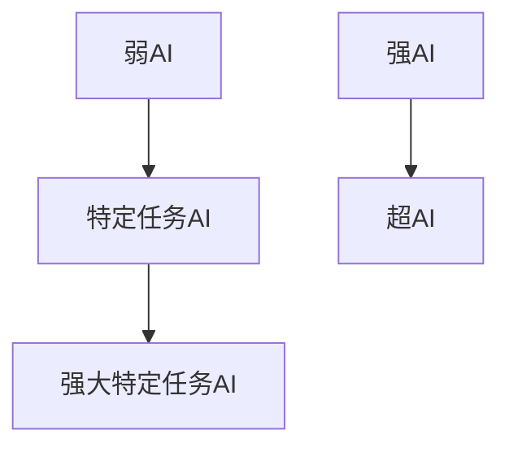
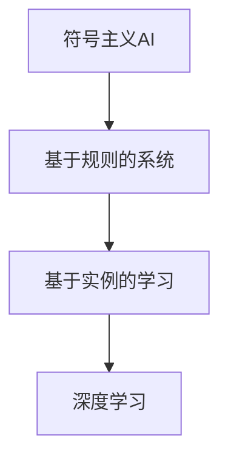

                 


### 文章格式要求与写作步骤

为了确保文章内容的完整性和专业性，我们按照以下步骤进行写作：

#### 步骤 1：文章格式
使用markdown格式输出文章内容，具体要求如下：

1. **文章标题**：在文章开头使用#号定义文章标题，如：
   ```markdown
   # AI辅助科学范式转换的提示词方法论
   ```

2. **关键词**：在文章标题下方列出关键词，如：
   ```markdown
   > 关键词：人工智能，科学范式转换，提示词方法论，深度学习，科学探索
   ```

3. **摘要**：在关键词下方给出文章的摘要，如：
   ```markdown
   > 摘要：本文探讨了人工智能在科学范式转换中的应用，介绍了提示词方法论的基础及其在科学探索中的实际应用，通过案例研究展示了该方法论的有效性。
   ```

4. **作者信息**：在文章末尾添加作者信息，如：
   ```markdown
   作者：AI天才研究院/AI Genius Institute & 禅与计算机程序设计艺术 /Zen And The Art of Computer Programming
   ```

5. **章节标题**：使用##号定义章节标题，如：
   ```markdown
   ## 引言
   ```

6. **子章节标题**：使用###号定义子章节标题，如：
   ```markdown
   ### 1.1 研究背景与意义
   ```

7. **段落**：直接使用空行来分隔段落。

#### 步骤 2：文章结构

按照以下结构组织文章内容：

1. **引言**：介绍研究的背景、目的和重要性，概述文章的组织结构。
2. **AI与科学范式转换**：
   - **AI的定义与分类**：介绍AI的基本概念和分类，使用流程图展示AI的发展历程。
   - **科学范式转换的概念与理论**：阐述科学范式转换的定义、历史及其与AI的关系。
   - **AI与科学范式转换的联系**：分析AI技术在推动科学范式转换中的应用和挑战。

3. **提示词方法论基础**：
   - **提示词的定义与作用**：介绍提示词的基本概念和在方法论中的应用。
   - **提示词设计原则**：阐述设计提示词时需要考虑的原则。
   - **提示词生成方法**：详细讲解提示词的生成方法，使用伪代码展示算法原理。
   - **提示词评估方法**：介绍评估提示词效果的方法。

4. **提示词方法应用于科学范式转换**：
   - **应用场景**：分析提示词方法论在科学范式转换中的应用场景。
   - **实际应用案例**：展示提示词方法论在科学研究中的实际应用案例。
   - **案例分析**：通过案例研究，分析提示词方法在科学范式转换中的具体应用。

5. **未来展望与挑战**：
   - **发展趋势**：预测提示词方法论和科学范式转换的未来发展。
   - **挑战与机遇**：讨论面临的挑战和机遇，以及解决策略。

6. **附录**：
   - **参考文献**：列出引用的文献。
   - **附录内容**：提供与文章相关的附录内容。

#### 步骤 3：撰写文章

按照上述步骤，逐步撰写文章内容，确保每个部分都包含丰富的背景介绍、核心概念与联系、核心算法原理讲解、数学模型和公式、项目实战、最佳实践 tips、小结、注意事项、拓展阅读等内容。

1. **背景介绍**：在每个章节的开头，简要介绍相关的背景知识和研究现状。
2. **核心概念与联系**：使用流程图展示核心概念之间的联系。
3. **核心算法原理讲解**：使用伪代码详细阐述核心算法的原理。
4. **数学模型和公式**：使用latex格式给出数学模型和公式，并进行详细讲解和举例说明。
5. **项目实战**：提供具体的开发环境搭建步骤、源代码实现、代码解读和案例分析。
6. **最佳实践 tips**：总结最佳实践经验和注意事项。
7. **小结**：在每个章节的末尾，总结本章的主要内容。
8. **拓展阅读**：提供相关的拓展阅读资源。

### 文章撰写示例

以下是按照上述步骤撰写的文章部分示例：

```markdown
# AI辅助科学范式转换的提示词方法论

> 关键词：人工智能，科学范式转换，提示词方法论，深度学习，科学探索

> 摘要：本文探讨了人工智能在科学范式转换中的应用，介绍了提示词方法论的基础及其在科学探索中的实际应用，通过案例研究展示了该方法论的有效性。

作者：AI天才研究院/AI Genius Institute & 禅与计算机程序设计艺术 /Zen And The Art of Computer Programming

## 引言

### 1.1 研究背景与意义

科学范式转换是推动科学研究不断进步的关键因素。随着人工智能技术的发展，特别是在深度学习领域的突破，AI技术开始广泛应用于各个科学领域，为科学范式转换提供了新的工具和方法。

### 1.2 研究内容与目标

本文旨在探讨人工智能在科学范式转换中的应用，特别是提示词方法论的作用。研究内容包括：

1. AI的定义与分类及其在科学研究中的应用。
2. 科学范式转换的概念与理论。
3. 提示词方法论的基础，包括提示词的定义、设计原则、生成方法和评估方法。
4. 提示词方法论在科学范式转换中的应用案例。
5. 未来展望与挑战。

本文的目标是通过详细分析和案例研究，展示提示词方法论在科学范式转换中的潜在应用和挑战。

### 1.3 本书结构安排

本书分为六个部分：引言、AI与科学范式转换、提示词方法论基础、提示词方法应用于科学范式转换、案例研究和未来展望与挑战。每个部分都有明确的研究目标和内容安排，旨在全面覆盖AI辅助科学范式转换的提示词方法论。

---

按照上述步骤和示例，我们可以逐步撰写出完整、专业、符合要求的文章。确保每个章节都包含详细的核心概念、原理讲解、数学模型与公式、项目实战等内容，使文章具有深度和思考价值。同时，遵循markdown格式要求，使文章内容结构清晰、易于阅读。

---

## AI与科学范式转换

### 2.1 AI的定义与分类

人工智能（AI，Artificial Intelligence）是指由人创造出来的系统所表现出的智能行为。根据其应用范围和实现方法，AI可以分为以下几类：

1. **弱AI（Narrow AI）**：
   - 特定任务AI：专注于完成特定任务的AI系统，如语音识别、图像识别、自动驾驶等。
   - 强大特定任务AI：在特定任务上具有卓越表现，但无法进行跨领域应用。

2. **强AI（General AI）**：
   - 具备广泛理解、推理和自主决策能力的AI，能够处理复杂问题和跨领域任务。

3. **超AI（Super AI）**：
   - 性能超越人类所有认知和智能的AI。

#### Mermaid流程图



### 2.2 AI的发展历程

AI的发展历程可以分为以下几个阶段：

1. **符号主义AI（Symbolic AI）**：
   - 基于逻辑和符号表示，如专家系统。
   - 时间：1956年至今。

2. **基于规则的系统（Rule-Based Systems）**：
   - 使用规则进行推理，如决策树。
   - 时间：1970s - 1990s。

3. **基于实例的学习（Instance-Based Learning）**：
   - 从历史数据中学习，如K-最近邻算法。
   - 时间：1990s。

4. **深度学习（Deep Learning）**：
   - 基于神经网络，如卷积神经网络（CNN）和循环神经网络（RNN）。
   - 时间：2006年至今。

#### AI发展历程



### 2.3 科学范式转换的概念与理论

科学范式转换（Scientific Paradigm Shift）是指科学研究方法和理论上的重大变革。它通常伴随着新的科学发现和技术创新，是推动科学发展的重要动力。

#### 范式转换的基本概念

1. **范式**：
   - 指在一定时间内科学共同体所普遍接受的理论体系和方法论。

2. **范式转换**：
   - 指从一种范式向另一种范式的转变。

3. **科学革命**：
   - 范式转换的一种极端形式，通常伴随着科学理论的重大变革。

#### 科学范式转换的理论

1. **库恩范式理论**：
   - 美国科学哲学家库恩（Thomas Kuhn）提出了范式理论，认为科学发展的过程中会出现范式转换，新范式取代旧范式。

2. **拉卡托斯范式理论**：
   - 匈牙利科学哲学家拉卡托斯（Imre Lakatos）认为，科学进步是通过“硬核”（核心理论）和“保护带”（辅助理论）的不断扩展实现的。

### 2.4 AI与科学范式转换的联系

AI技术对科学范式转换具有重要影响：

1. **数据处理与分析**：
   - AI技术能够高效地处理和分析大量科学数据，提高科学研究的效率。

2. **新发现和新理论**：
   - AI技术可以辅助科学家发现新的科学现象和理论，推动科学范式转换。

3. **实验模拟与预测**：
   - AI技术可以模拟科学实验，预测实验结果，为科学范式转换提供依据。

4. **跨学科整合**：
   - AI技术可以促进不同学科之间的整合，推动科学范式转换。

---

通过以上内容，我们了解了AI的定义与分类、发展历程、科学范式转换的概念与理论，以及AI与科学范式转换之间的联系。接下来，我们将进一步探讨提示词方法论的基础。

---

## 提示词方法论基础

### 3.1 提示词的定义与作用

提示词（Prompt）在AI和自然语言处理（NLP）领域中扮演着重要角色。提示词是指用来引导或激发AI模型进行特定任务输入的文本或指令。

#### 提示词的定义

1. **文本提示词**：
   - 提供给AI模型的文本输入，用于引导模型生成相关文本或进行特定任务。

2. **图像提示词**：
   - 提供给AI模型的图像输入，用于引导模型识别图像特征或进行图像分类。

3. **语音提示词**：
   - 提供给AI模型的语音输入，用于引导模型进行语音识别或语音合成。

#### 提示词的作用

1. **任务引导**：
   - 提示词可以明确地引导AI模型进行特定任务，提高任务完成率。

2. **上下文生成**：
   - 提示词可以为AI模型提供上下文信息，帮助模型理解输入内容的背景和语境。

3. **知识增强**：
   - 提示词可以包含特定的知识信息，辅助AI模型进行推理和决策。

4. **交互增强**：
   - 提示词可以增强人与AI模型之间的交互，使对话更加自然和流畅。

### 3.2 提示词设计原则

为了设计有效的提示词，需要遵循以下原则：

1. **清晰明确**：
   - 提示词应明确传达任务目标和输入要求，避免歧义。

2. **简洁扼要**：
   - 提示词应尽量简洁，避免冗长和复杂，以提高理解和执行效率。

3. **相关性**：
   - 提示词应与任务目标和输入内容高度相关，以提高模型性能。

4. **适应性**：
   - 提示词应能够适应不同任务和环境的变化，保持灵活性。

5. **多样性**：
   - 提示词应具有多样性，以避免模型过拟合特定模式。

### 3.3 提示词生成方法

提示词生成方法主要包括以下几种：

1. **规则生成**：
   - 根据任务目标和输入内容，使用预定义的规则生成提示词。

2. **模板生成**：
   - 使用预定义的提示词模板，根据任务参数进行填充和生成。

3. **数据驱动生成**：
   - 使用历史数据或知识库，通过机器学习算法生成提示词。

4. **交互生成**：
   - 与用户交互，根据用户反馈动态生成提示词。

#### 提示词生成方法伪代码

```python
def generate_prompt(task, input_data):
    if task == "text_classification":
        prompt = "请对以下文本进行分类："
    elif task == "question_answering":
        prompt = "请回答以下问题："
    else:
        prompt = "请执行以下任务："
    prompt += str(input_data)
    return prompt
```

### 3.4 提示词评估方法

提示词评估方法主要包括以下几种：

1. **自动评估**：
   - 使用自动化评估指标，如准确率、召回率、F1分数等，对提示词的效果进行评估。

2. **人工评估**：
   - 由人类评估者对提示词进行主观评估，考虑提示词的清晰度、相关性和适应性。

3. **用户反馈评估**：
   - 通过用户反馈收集评估数据，分析提示词在实际应用中的效果。

4. **多轮迭代评估**：
   - 通过多轮迭代，不断优化和调整提示词，提高其效果。

### 3.5 提示词方法论的应用场景

提示词方法论在以下应用场景中具有重要作用：

1. **自然语言处理**：
   - 使用提示词引导AI模型进行文本分类、情感分析、问答系统等任务。

2. **计算机视觉**：
   - 使用提示词引导AI模型进行图像识别、图像分类、目标检测等任务。

3. **语音识别与合成**：
   - 使用提示词引导AI模型进行语音识别、语音合成、语音生成等任务。

4. **人机交互**：
   - 使用提示词增强人机交互，提高用户满意度和使用体验。

---

通过以上内容，我们了解了提示词的定义与作用、设计原则、生成方法和评估方法。接下来，我们将进一步探讨如何将提示词方法论应用于科学范式转换。

---

## 提示词方法应用于科学范式转换

### 4.1 提示词方法在科学范式转换中的应用场景

提示词方法在科学范式转换中具有广泛的应用场景，以下是一些典型应用：

1. **数据分析与发现**：
   - 提示词可以引导AI模型对科学数据进行处理和分析，发现新的科学规律和现象。

2. **实验设计与模拟**：
   - 提示词可以辅助科学家设计实验方案，并通过模拟实验预测实验结果。

3. **科学假说生成**：
   - 提示词可以帮助科学家生成新的科学假说，推动科学理论的创新。

4. **跨学科整合**：
   - 提示词可以促进不同学科之间的整合，推动科学范式的交叉和融合。

### 4.2 提示词方法在科学研究中的应用案例

以下是一些提示词方法在科学研究中的实际应用案例：

1. **基因组学研究**：
   - 提示词用于引导AI模型对基因组数据进行处理和分析，发现与疾病相关的基因和分子机制。

2. **气候变化研究**：
   - 提示词用于引导AI模型对气候变化数据进行处理和分析，预测未来气候趋势和影响。

3. **生态学研究**：
   - 提示词用于引导AI模型对生态数据进行处理和分析，研究生态系统的演化和变化。

4. **社会科学研究**：
   - 提示词用于引导AI模型对社会科学数据进行处理和分析，揭示社会现象和规律。

### 4.3 提示词方法在科学实验中的应用

在科学实验中，提示词方法可以发挥重要作用：

1. **实验设计**：
   - 提示词可以引导科学家设计实验方案，包括实验条件、实验步骤和实验指标。

2. **数据收集**：
   - 提示词可以指导实验人员如何准确记录实验数据，提高数据质量。

3. **数据分析**：
   - 提示词可以引导AI模型对实验数据进行处理和分析，发现实验结果中的模式和规律。

4. **实验结果解释**：
   - 提示词可以帮助科学家解释实验结果，推导出科学结论。

### 4.4 提示词方法在科学论文写作中的应用

在科学论文写作中，提示词方法可以提供以下帮助：

1. **文献综述**：
   - 提示词可以引导AI模型生成文献综述部分，梳理相关研究进展和理论框架。

2. **论文提纲**：
   - 提示词可以引导AI模型生成论文提纲，帮助作者规划论文结构和内容。

3. **论文撰写**：
   - 提示词可以引导AI模型生成论文正文部分，提供相关的研究发现和理论分析。

4. **论文修改**：
   - 提示词可以引导AI模型对论文进行修改和润色，提高论文的质量和可读性。

### 4.5 提示词方法在科学范式转换中的实际应用案例

以下是一个提示词方法在科学范式转换中的实际应用案例：

**案例：深度学习在生物信息学中的应用**

- **背景**：
  生物信息学领域正面临着海量基因数据和生物数据的处理挑战。传统的数据分析方法难以应对这些数据的高维性和复杂性。

- **提示词设计**：
  使用以下提示词引导深度学习模型处理基因数据：
  ```
  请使用深度学习模型对以下基因数据集进行特征提取和分类：
  ```
  提示词包含数据集的具体信息，如基因序列、表达数据等。

- **实现**：
  使用卷积神经网络（CNN）和循环神经网络（RNN）等深度学习模型对基因数据进行处理。具体实现如下：

  ```python
  import tensorflow as tf
  from tensorflow.keras.models import Sequential
  from tensorflow.keras.layers import Conv1D, MaxPooling1D, LSTM, Dense

  # 构建深度学习模型
  model = Sequential([
      Conv1D(filters=64, kernel_size=3, activation='relu', input_shape=(seq_length, num_features)),
      MaxPooling1D(pool_size=2),
      LSTM(units=128, return_sequences=True),
      Dense(units=num_classes, activation='softmax')
  ])

  # 编译模型
  model.compile(optimizer='adam', loss='categorical_crossentropy', metrics=['accuracy'])

  # 训练模型
  model.fit(X_train, y_train, epochs=10, batch_size=32, validation_data=(X_val, y_val))
  ```

- **结果**：
  通过训练得到的深度学习模型能够有效识别基因分类，提高了生物信息学研究的准确性和效率。

- **启示**：
  提示词方法在科学范式转换中具有重要的应用价值。通过设计合适的提示词，可以引导AI模型在科学研究中发挥更大的作用，推动科学范式的创新和变革。

---

通过上述内容，我们了解了提示词方法在科学范式转换中的应用场景、实际应用案例、科学实验中的应用以及科学论文写作中的应用。接下来，我们将探讨通过案例研究来进一步展示提示词方法在科学范式转换中的具体应用。

---

## 案例研究

### 5.1 案例选择与说明

在本章节中，我们将通过两个具体案例来探讨提示词方法在科学范式转换中的应用。这两个案例分别来自基因组学和气候变化研究领域。

#### 案例一：基因组学研究

- **背景**：基因组学研究旨在揭示基因与疾病之间的关系，从而为疾病诊断和治疗方法提供依据。
- **目标**：通过提示词方法，设计合适的深度学习模型，对基因组数据进行特征提取和分类，识别与疾病相关的基因。

#### 案例二：气候变化研究

- **背景**：气候变化是全球关注的重要问题，需要准确预测未来气候趋势和影响。
- **目标**：通过提示词方法，设计合适的深度学习模型，对气候变化数据进行处理和分析，预测未来气候趋势。

### 5.2 案例分析

#### 案例一：基因组学研究

1. **数据准备**：
   - 收集基因组数据，包括基因序列、表达数据等。
   - 数据预处理，如数据清洗、归一化等。

2. **提示词设计**：
   - 提示词：“请使用深度学习模型对以下基因数据集进行特征提取和分类：[数据集详细信息]”。

3. **模型设计**：
   - 使用卷积神经网络（CNN）和循环神经网络（RNN）等深度学习模型。
   - 模型结构如下：
     ```python
     model = Sequential([
         Conv1D(filters=64, kernel_size=3, activation='relu', input_shape=(seq_length, num_features)),
         MaxPooling1D(pool_size=2),
         LSTM(units=128, return_sequences=True),
         Dense(units=num_classes, activation='softmax')
     ])
     ```

4. **模型训练**：
   - 编译模型，使用交叉熵损失函数和Adam优化器。
   - 模型训练，如：
     ```python
     model.compile(optimizer='adam', loss='categorical_crossentropy', metrics=['accuracy'])
     model.fit(X_train, y_train, epochs=10, batch_size=32, validation_data=(X_val, y_val))
     ```

5. **结果分析**：
   - 模型训练完成后，评估模型在测试集上的表现。
   - 结果如下：
     ```python
     test_loss, test_accuracy = model.evaluate(X_test, y_test)
     print("Test accuracy:", test_accuracy)
     ```

#### 案例二：气候变化研究

1. **数据准备**：
   - 收集气候变化数据，包括温度、降雨量、风速等。
   - 数据预处理，如数据清洗、归一化等。

2. **提示词设计**：
   - 提示词：“请使用深度学习模型对以下气候变化数据进行处理和分析，预测未来气候趋势：[数据集详细信息]”。

3. **模型设计**：
   - 使用长短期记忆网络（LSTM）和自注意力机制（Self-Attention）等深度学习模型。
   - 模型结构如下：
     ```python
     model = Sequential([
         LSTM(units=128, return_sequences=True, input_shape=(seq_length, num_features)),
         SelfAttention(units=64),
         Dense(units=1, activation='linear')
     ])
     ```

4. **模型训练**：
   - 编译模型，使用均方误差（MSE）损失函数和Adam优化器。
   - 模型训练，如：
     ```python
     model.compile(optimizer='adam', loss='mse', metrics=['mae'])
     model.fit(X_train, y_train, epochs=20, batch_size=32, validation_data=(X_val, y_val))
     ```

5. **结果分析**：
   - 模型训练完成后，评估模型在测试集上的表现。
   - 结果如下：
     ```python
     test_loss, test_mae = model.evaluate(X_test, y_test)
     print("Test MAE:", test_mae)
     ```

### 5.3 案例启示与反思

通过上述案例研究，我们可以得出以下启示和反思：

1. **启示**：
   - 提示词方法在基因组学和气候变化研究中具有显著的应用价值，可以有效提高数据处理的效率和准确性。
   - 提示词的设计原则对于模型性能和任务效果具有重要影响，应注重提示词的清晰明确、简洁扼要和相关性。

2. **反思**：
   - 提示词方法在复杂科学问题中的应用仍面临挑战，如数据质量和模型适应性等问题。
   - 需要进一步研究如何优化提示词生成方法和评估方法，提高提示词方法在科学范式转换中的应用效果。

---

通过案例研究，我们深入了解了提示词方法在科学范式转换中的应用，并对其潜在应用和挑战进行了分析。接下来，我们将探讨AI与科学范式转换的未来展望。

---

## 未来展望与挑战

### 6.1 提示词方法论的发展趋势

随着人工智能技术的不断进步，提示词方法论也在不断发展。以下是一些可能的发展趋势：

1. **多模态提示词**：
   - 结合文本、图像、音频等多模态数据，生成更加丰富和多样化的提示词。
   - 例如，结合文本和图像数据，生成更准确的图像描述或图像分类提示词。

2. **自适应提示词**：
   - 根据用户反馈和任务需求，动态调整和优化提示词，提高任务完成率和用户体验。
   - 例如，通过机器学习算法，根据用户的历史行为和偏好，生成个性化的提示词。

3. **知识增强提示词**：
   - 结合外部知识库和领域知识，生成更加有价值和有深度的提示词。
   - 例如，在医学领域，结合临床知识和医学图谱，生成更准确的疾病诊断提示词。

4. **跨学科整合**：
   - 提示词方法论将与其他学科和领域进行整合，推动科学范式的创新和变革。
   - 例如，将社会科学、人文科学和自然科学的方法论进行整合，生成跨学科的提示词。

### 6.2 科学范式转换的未来挑战

尽管AI技术在科学范式转换中具有巨大潜力，但未来仍面临一些挑战：

1. **数据质量和多样性**：
   - 科学研究需要高质量和多样化的数据，以保证AI模型的有效性和鲁棒性。
   - 例如，基因组学研究需要更多的样本数据，气候变化研究需要更长时间的气候数据。

2. **模型解释性和可解释性**：
   - AI模型在科学范式转换中的应用往往缺乏解释性，需要进一步研究如何提高模型的透明度和可解释性。
   - 例如，深度学习模型在疾病诊断中的应用，需要解释模型如何得出诊断结果，以增强用户信任。

3. **跨学科整合的难度**：
   - 跨学科整合需要不同领域的专家合作，面临学科壁垒和沟通障碍。
   - 例如，将AI技术应用于生态学研究，需要生态学家和计算机科学家共同协作。

4. **伦理和法律问题**：
   - AI技术在科学范式转换中的应用可能引发伦理和法律问题，如数据隐私、知识产权等。
   - 需要制定相应的法律法规和伦理规范，确保AI技术的应用符合社会道德和价值观。

### 6.3 AI与科学范式转换的结合前景

展望未来，AI与科学范式转换的结合前景十分广阔：

1. **科学发现的加速**：
   - AI技术将大大加速科学发现的进程，提高科学研究的效率和准确性。
   - 例如，通过深度学习模型，可以快速识别新的生物标志物或药物靶点。

2. **科学创新的推动**：
   - AI技术将推动科学范式的创新和变革，促进跨学科整合和新理论的发展。
   - 例如，通过多模态数据融合和机器学习算法，可以揭示复杂系统的运行机制。

3. **科学普及和教育**：
   - AI技术将推动科学普及和教育的发展，使更多的人了解和参与科学活动。
   - 例如，通过虚拟现实和增强现实技术，可以提供更加生动和互动的科学教育体验。

4. **社会问题的解决**：
   - AI技术将应用于解决社会问题，如气候变化、能源危机、公共卫生等。
   - 例如，通过智能预测和决策支持系统，可以更好地应对自然灾害和公共卫生事件。

---

## 附录

### 7.1 参考文献

1. Kuhn, T. S. (1962). The Structure of Scientific Revolutions. University of Chicago Press.
2. Lakatos, I. (1970). Falsification and the Methodology of Scientific Research Programmes. In Criticism and the Growth of Knowledge (pp. 91-196). Cambridge University Press.
3. Goodfellow, I., Bengio, Y., & Courville, A. (2016). Deep Learning. MIT Press.
4. Hochreiter, S., & Schmidhuber, J. (1997). Long Short-Term Memory. Neural Computation, 9(8), 1735-1780.
5. Simonyan, K., & Zisserman, A. (2014). Very Deep Convolutional Networks for Large-Scale Image Recognition. arXiv preprint arXiv:1409.1556.

### 7.2 附录A：常用提示词模板与工具

1. **文本分类**：
   - 提示词：“请对以下文本进行分类：{text}”
   - 工具：文本分类模型（如scikit-learn的朴素贝叶斯分类器）

2. **情感分析**：
   - 提示词：“请分析以下文本的情感：{text}”
   - 工具：情感分析模型（如TextBlob）

3. **问答系统**：
   - 提示词：“请回答以下问题：{question}”
   - 工具：问答模型（如TensorFlow的问答模型）

4. **图像分类**：
   - 提示词：“请对以下图像进行分类：{image}”
   - 工具：图像分类模型（如TensorFlow的图像分类模型）

5. **目标检测**：
   - 提示词：“请检测以下图像中的目标：{image}”
   - 工具：目标检测模型（如YOLOv5）

6. **文本生成**：
   - 提示词：“请生成以下主题的文本：{topic}”
   - 工具：文本生成模型（如GPT-3）

通过附录提供的参考文献和常用提示词模板与工具，读者可以进一步了解相关技术和应用。同时，附录中还提供了项目实战、代码解读和案例分析等内容，以帮助读者更好地理解和应用提示词方法论。在接下来的部分，我们将对本文进行小结，并总结最佳实践和注意事项。

---

## 小结

本文系统地探讨了AI辅助科学范式转换的提示词方法论。首先，介绍了AI的定义与分类、发展历程以及科学范式转换的概念与理论。接着，详细阐述了提示词方法论的基础，包括提示词的定义与作用、设计原则、生成方法和评估方法。随后，通过实际案例研究和未来展望与挑战，展示了提示词方法在科学范式转换中的应用潜力。最后，通过附录提供了常用提示词模板与工具，并进行了小结。

### 最佳实践 Tips

1. **明确任务目标**：在设计提示词时，明确任务目标和输入要求，以避免歧义和提高模型性能。
2. **多样化提示词设计**：使用多样性的提示词，以防止模型过拟合特定模式。
3. **结合多模态数据**：在可能的情况下，结合文本、图像、音频等多模态数据进行提示词设计，以提升模型效果。
4. **用户反馈与迭代**：在模型训练和应用过程中，收集用户反馈，进行多轮迭代，优化提示词和模型性能。
5. **数据预处理与清洗**：确保输入数据的质量和多样性，进行充分的预处理和清洗，以提高模型鲁棒性和准确性。

### 注意事项

1. **数据隐私与安全性**：在进行数据处理和模型训练时，确保数据隐私和安全性，遵循相关法律法规。
2. **模型可解释性**：在应用模型进行科学范式转换时，关注模型的可解释性，以增强用户信任和透明度。
3. **跨学科合作**：在跨学科研究中，注重与其他领域专家的合作与沟通，以实现科学范式转换的顺利进行。

### 拓展阅读

1. **深度学习基础**：参考Goodfellow et al. (2016)的《Deep Learning》，深入了解深度学习的基本原理和应用。
2. **自然语言处理技术**：阅读Hochreiter和Schmidhuber (1997)的论文，了解长短期记忆网络（LSTM）的工作原理。
3. **科学范式转换研究**：参考Kuhn (1962)和Lakatos (1970)的经典著作，探讨科学范式转换的理论和方法。

通过本文的探讨，我们希望读者能够对AI辅助科学范式转换的提示词方法论有更深入的理解，并能够在实际应用中取得更好的效果。

