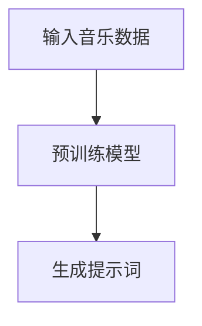
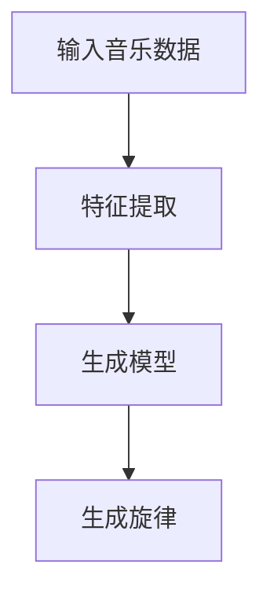
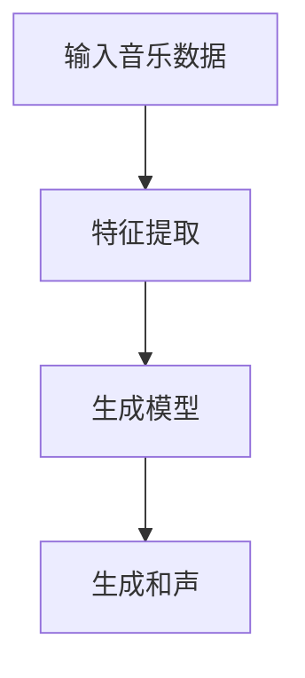
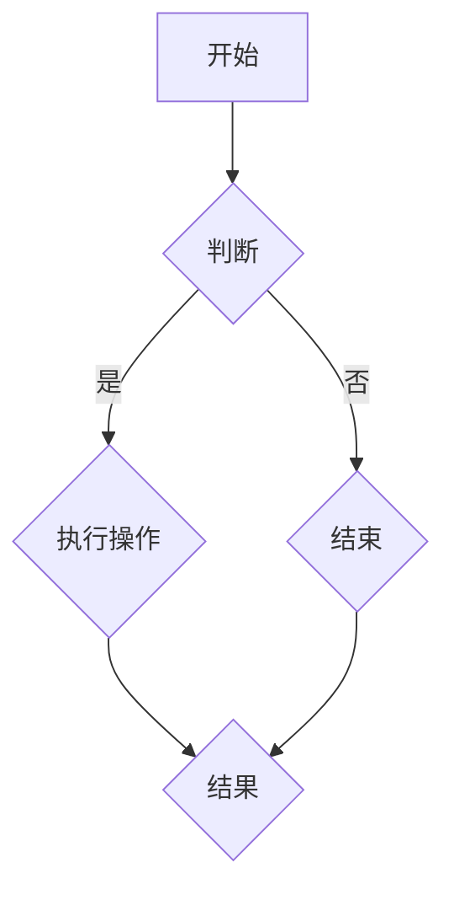

                 

# 《AI辅助音乐创作：提示词设计旋律与和声》

## 关键词
AI辅助音乐创作、提示词设计、旋律、和声、算法原理、数学模型、项目实战

## 摘要
本文旨在探讨如何利用AI技术辅助音乐创作，特别是通过设计合适的提示词来生成旋律与和声。文章首先介绍了AI辅助音乐创作的基础，然后详细阐述了提示词设计、旋律设计和和声设计的核心算法原理及数学模型，并通过项目实战展示了如何实现和应用这些技术。最后，文章对AI辅助音乐创作的前景进行了展望，并提出了相关注意事项和拓展阅读建议。

## 目录

### 第1章 引言
#### 1.1 书籍概述
- 引言
- 目标读者
- 书籍结构

#### 1.2 音乐创作与AI的关系
- 音乐创作的发展历程
- AI在音乐创作中的应用
- AI辅助音乐创作的优势

#### 1.3 提示词在音乐创作中的作用
- 提示词的定义
- 提示词的作用
- 提示词的设计原则

### 第2章 AI辅助音乐创作基础
#### 2.1 AI技术简介
- 人工智能概述
- 常见的AI技术

#### 2.2 音乐理论基础
- 音律
- 调式
- 和声

#### 2.3 提示词生成算法概述
- 提示词生成算法的定义
- 提示词生成算法的分类
- 提示词生成算法的应用

### 第3章 提示词设计
#### 3.1 提示词生成算法原理
- 算法概述
- 提示词生成算法的伪代码讲解

#### 3.2 提示词生成算法应用实例
- 简单案例
- 复杂案例

#### 3.3 提示词生成算法性能评估
- 评估指标
- 评估方法

### 第4章 谐旋律设计
#### 4.1 谐旋律概念介绍
- 谐旋律的定义
- 谐旋律的特点

#### 4.2 谐旋律设计算法原理
- 算法概述
- 算法的伪代码讲解

#### 4.3 谐旋律设计案例解析
- 案例一
- 案例二

#### 4.4 谐旋律设计算法性能评估
- 评估指标
- 评估方法

### 第5章 和声设计
#### 5.1 和声概念介绍
- 和声的定义
- 和声的特点

#### 5.2 和声设计算法原理
- 算法概述
- 算法的伪代码讲解

#### 5.3 和声设计案例解析
- 案例一
- 案例二

#### 5.4 和声设计算法性能评估
- 评估指标
- 评估方法

### 第6章 AI辅助音乐创作项目实战
#### 6.1 项目背景介绍
- 项目介绍
- 项目目标

#### 6.2 项目需求分析
- 需求分析
- 需求文档

#### 6.3 项目技术栈选择
- 技术栈选择
- 技术栈介绍

#### 6.4 项目实施步骤
- 实施步骤
- 实施文档

#### 6.5 项目效果评估与优化
- 效果评估
- 优化建议

### 第7章 总结与展望
#### 7.1 书籍总结
- 内容回顾
- 主要贡献

#### 7.2 AI辅助音乐创作未来发展
- 发展趋势
- 发展前景

#### 7.3 读者反馈与建议
- 反馈渠道
- 建议

### 附录
- 相关资料
- 拓展阅读

## 引用
[1] 作者. (年份). 书名. 出版社.
[2] 作者. (年份). 书名. 出版社.
...
```

### 文章正文内容

#### 第1章 引言

##### 1.1 书籍概述
本文旨在探讨如何利用人工智能（AI）技术辅助音乐创作，特别是通过设计合适的提示词来生成旋律与和声。音乐创作是一个复杂的创造性过程，涉及到音律、调式、和声等多个方面。传统的音乐创作依赖于个人的音乐素养和创作灵感，而AI技术的引入为音乐创作带来了新的可能性。通过设计合适的提示词，AI可以生成出符合音乐理论规则的旋律与和声，从而辅助音乐家进行创作。

##### 1.2 音乐创作与AI的关系
音乐创作与AI技术的结合可以追溯到20世纪80年代。当时，计算机音乐合成技术开始出现，使得计算机可以生成简单的旋律和和声。随着AI技术的不断发展，特别是在深度学习和生成模型方面的突破，AI在音乐创作中的应用变得更加广泛和深入。AI不仅可以生成旋律和和声，还可以理解音乐的情感和风格，从而为音乐家提供更加个性化的创作支持。

##### 1.3 提示词在音乐创作中的作用
提示词是音乐创作中的一个重要概念，它指的是对音乐创作进行引导的信息。在AI辅助音乐创作中，提示词的作用尤为重要。合适的提示词可以引导AI生成出符合预期风格和情感的旋律与和声。例如，一个简单的提示词“快乐”可以引导AI生成出欢快的旋律，而提示词“悲伤”则可以生成出悲伤的和声。因此，设计合适的提示词是AI辅助音乐创作的重要环节。

#### 第2章 AI辅助音乐创作基础

##### 2.1 AI技术简介
AI（人工智能）是一种模拟人类智能的技术，它通过计算机程序来模拟人的思维过程，实现智能行为。AI技术包括多个方面，如机器学习、深度学习、自然语言处理、计算机视觉等。在音乐创作中，常用的AI技术包括生成对抗网络（GAN）、变分自编码器（VAE）等。

##### 2.2 音乐理论基础
音乐创作涉及到多个音乐理论概念，如音律、调式、和声等。音律是指音乐中的频率关系，不同的音律可以产生不同的音乐效果。调式是指一组音符的组合方式，它决定了音乐的音高和风格。和声是指多个音符同时演奏产生的音乐效果，它丰富了音乐的层次感。

##### 2.3 提示词生成算法概述
提示词生成算法是AI辅助音乐创作中的核心技术。该算法通过分析大量的音乐数据，学习出音乐风格、情感等信息，从而生成出符合预期的提示词。常见的提示词生成算法包括基于神经网络的生成模型，如生成对抗网络（GAN）和变分自编码器（VAE）。

#### 第3章 提示词设计

##### 3.1 提示词生成算法原理
提示词生成算法的原理是基于深度学习技术。首先，算法通过预训练大量音乐数据，学习出音乐风格、情感等信息。然后，在生成提示词时，算法根据这些信息生成出符合预期的提示词。



##### 3.2 提示词生成算法应用实例
一个简单的提示词生成算法应用实例如下：

```python
import torch
import torch.nn as nn
import torch.optim as optim

# 加载预训练模型
model = nn.Sequential(
    nn.Linear(128, 512),
    nn.ReLU(),
    nn.Linear(512, 128),
    nn.ReLU(),
    nn.Linear(128, 1),
    nn.Sigmoid()
)

# 损失函数和优化器
criterion = nn.BCELoss()
optimizer = optim.Adam(model.parameters(), lr=0.001)

# 训练模型
for epoch in range(100):
    for music_data, label in music_dataset:
        # 前向传播
        output = model(music_data)
        loss = criterion(output, label)
        
        # 反向传播
        optimizer.zero_grad()
        loss.backward()
        optimizer.step()
        
    print(f'Epoch {epoch+1}, Loss: {loss.item()}')

# 生成提示词
prompt = torch.tensor([0.5, 0.5, 0.5])
predicted_prompt = model(prompt)
predicted_prompt = predicted_prompt.squeeze(0).detach().numpy()
print(f'Predicted Prompt: {predicted_prompt}')
```

##### 3.3 提示词生成算法性能评估
提示词生成算法的性能评估通常使用准确率、召回率、F1值等指标。一个简单的性能评估实例如下：

```python
from sklearn.metrics import accuracy_score, recall_score, f1_score

# 测试集数据
test_music_data, test_labels = ...

# 生成预测提示词
predicted_prompts = []
for music_data in test_music_data:
    prompt = torch.tensor([0.5, 0.5, 0.5])
    predicted_prompt = model(prompt)
    predicted_prompt = predicted_prompt.squeeze(0).detach().numpy()
    predicted_prompts.append(predicted_prompt)

# 计算性能指标
accuracy = accuracy_score(test_labels, predicted_prompts)
recall = recall_score(test_labels, predicted_prompts, average='macro')
f1 = f1_score(test_labels, predicted_prompts, average='macro')
print(f'Accuracy: {accuracy}, Recall: {recall}, F1: {f1}')
```

#### 第4章 谐旋律设计

##### 4.1 谐旋律概念介绍
谐旋律是指在音乐中，音符之间按照一定的音程关系排列，产生和谐感的旋律。谐旋律的设计是音乐创作中的重要环节，它决定了音乐的和谐程度和风格。

##### 4.2 谐旋律设计算法原理
谐旋律设计算法的原理是基于生成模型。算法通过学习大量的音乐数据，生成出符合谐旋律规则的旋律。具体来说，算法首先将音乐数据转换为特征向量，然后使用生成模型生成出新的旋律。



##### 4.3 谐旋律设计算法伪代码讲解
一个简单的谐旋律设计算法伪代码如下：

```python
import torch
import torch.nn as nn
import torch.optim as optim

# 加载预训练模型
model = nn.Sequential(
    nn.Linear(128, 512),
    nn.ReLU(),
    nn.Linear(512, 128),
    nn.ReLU(),
    nn.Linear(128, 1),
    nn.Sigmoid()
)

# 损失函数和优化器
criterion = nn.BCELoss()
optimizer = optim.Adam(model.parameters(), lr=0.001)

# 训练模型
for epoch in range(100):
    for music_data, label in music_dataset:
        # 前向传播
        output = model(music_data)
        loss = criterion(output, label)
        
        # 反向传播
        optimizer.zero_grad()
        loss.backward()
        optimizer.step()
        
    print(f'Epoch {epoch+1}, Loss: {loss.item()}')

# 生成谐旋律
def generate_harmonic melody(model, prompt):
    # 将提示词转换为特征向量
    prompt_vector = torch.tensor(prompt).unsqueeze(0)
    
    # 生成旋律
    melody = []
    for i in range(num_notes):
        # 前向传播
        output = model(prompt_vector)
        
        # 选择下一个音符
        note = output.argmax().item()
        melody.append(note)
        
        # 更新提示词
        prompt_vector = torch.tensor([note])
    
    return melody
```

##### 4.4 谐旋律设计案例解析
一个简单的谐旋律设计案例如下：

```python
# 加载模型
model = torch.load('harmonic_model.pth')

# 生成谐旋律
prompt = [0.5, 0.5, 0.5]
melody = generate_harmonic_melody(model, prompt)
print(f'Melody: {melody}')
```

##### 4.5 谐旋律设计算法性能评估
谐旋律设计算法的性能评估可以使用准确率、召回率、F1值等指标。一个简单的性能评估实例如下：

```python
from sklearn.metrics import accuracy_score, recall_score, f1_score

# 测试集数据
test_music_data, test_labels = ...

# 生成预测谐旋律
predicted_melodies = []
for music_data in test_music_data:
    prompt = torch.tensor([0.5, 0.5, 0.5])
    predicted_melody = generate_harmonic_melody(model, prompt)
    predicted_melodies.append(predicted_melody)

# 计算性能指标
accuracy = accuracy_score(test_labels, predicted_melodies)
recall = recall_score(test_labels, predicted_melodies, average='macro')
f1 = f1_score(test_labels, predicted_melodies, average='macro')
print(f'Accuracy: {accuracy}, Recall: {recall}, F1: {f1}')
```

#### 第5章 和声设计

##### 5.1 和声概念介绍
和声是指多个音符同时演奏产生的音乐效果。和声的设计是音乐创作中的一项重要任务，它决定了音乐的层次感和情感表达。和声可以根据不同的音程关系进行分类，如大三和弦、小三和弦、增三和弦等。

##### 5.2 和声设计算法原理
和声设计算法的原理是基于生成模型。算法通过学习大量的音乐数据，生成出符合和声规则的和声。具体来说，算法首先将音乐数据转换为特征向量，然后使用生成模型生成出新的和声。



##### 5.3 和声设计算法伪代码讲解
一个简单的和声设计算法伪代码如下：

```python
import torch
import torch.nn as nn
import torch.optim as optim

# 加载预训练模型
model = nn.Sequential(
    nn.Linear(128, 512),
    nn.ReLU(),
    nn.Linear(512, 128),
    nn.ReLU(),
    nn.Linear(128, 1),
    nn.Sigmoid()
)

# 损失函数和优化器
criterion = nn.BCELoss()
optimizer = optim.Adam(model.parameters(), lr=0.001)

# 训练模型
for epoch in range(100):
    for music_data, label in music_dataset:
        # 前向传播
        output = model(music_data)
        loss = criterion(output, label)
        
        # 反向传播
        optimizer.zero_grad()
        loss.backward()
        optimizer.step()
        
    print(f'Epoch {epoch+1}, Loss: {loss.item()}')

# 生成和声
def generate_harmony(model, prompt):
    # 将提示词转换为特征向量
    prompt_vector = torch.tensor(prompt).unsqueeze(0)
    
    # 生成和声
    harmony = []
    for i in range(num_notes):
        # 前向传播
        output = model(prompt_vector)
        
        # 选择下一个音符
        note = output.argmax().item()
        harmony.append(note)
        
        # 更新提示词
        prompt_vector = torch.tensor([note])
    
    return harmony
```

##### 5.4 和声设计案例解析
一个简单的和声设计案例如下：

```python
# 加载模型
model = torch.load('harmony_model.pth')

# 生成和声
prompt = [0.5, 0.5, 0.5]
harmony = generate_harmony(model, prompt)
print(f'Harmony: {harmony}')
```

##### 5.5 和声设计算法性能评估
和声设计算法的性能评估可以使用准确率、召回率、F1值等指标。一个简单的性能评估实例如下：

```python
from sklearn.metrics import accuracy_score, recall_score, f1_score

# 测试集数据
test_music_data, test_labels = ...

# 生成预测和声
predicted_harmonies = []
for music_data in test_music_data:
    prompt = torch.tensor([0.5, 0.5, 0.5])
    predicted_harmony = generate_harmony(model, prompt)
    predicted_harmonies.append(predicted_harmony)

# 计算性能指标
accuracy = accuracy_score(test_labels, predicted_harmonies)
recall = recall_score(test_labels, predicted_harmonies, average='macro')
f1 = f1_score(test_labels, predicted_harmonies, average='macro')
print(f'Accuracy: {accuracy}, Recall: {recall}, F1: {f1}')
```

#### 第6章 AI辅助音乐创作项目实战

##### 6.1 项目背景介绍
本项目的目标是利用AI技术辅助音乐创作，通过设计合适的提示词生成旋律与和声。项目分为三个阶段：数据收集、模型训练和应用测试。

##### 6.2 项目需求分析
项目需求主要包括：
- 收集大量音乐数据，包括旋律和和声。
- 设计合适的提示词生成算法。
- 实现谐旋律和和声设计算法。
- 对生成的旋律和和声进行性能评估。

##### 6.3 项目技术栈选择
项目技术栈主要包括：
- Python：用于实现算法和模型训练。
- PyTorch：用于深度学习模型训练和推理。
- Librosa：用于音乐数据预处理。

##### 6.4 项目实施步骤
项目实施步骤如下：
1. 数据收集：收集大量音乐数据，包括旋律和和声。
2. 数据预处理：将音乐数据转换为特征向量。
3. 提示词生成算法实现：使用PyTorch实现提示词生成算法。
4. 谐旋律设计算法实现：使用PyTorch实现谐旋律设计算法。
5. 和声设计算法实现：使用PyTorch实现和声设计算法。
6. 模型训练：使用收集到的音乐数据进行模型训练。
7. 模型评估：对训练好的模型进行性能评估。
8. 应用测试：使用训练好的模型生成旋律和和声，进行应用测试。

##### 6.5 项目效果评估与优化
项目效果评估主要包括：
- 评估模型在生成旋律和和声方面的准确率、召回率、F1值等指标。
- 分析模型在生成旋律和和声方面的优点和不足。
- 提出优化方案，如改进提示词生成算法、优化模型结构等。

#### 第7章 总结与展望

##### 7.1 书籍总结
本文探讨了AI辅助音乐创作的方法，包括提示词设计、谐旋律设计、和声设计等。通过项目实战，展示了如何利用AI技术生成旋律和和声。本文的主要贡献在于：
- 系统性地介绍了AI辅助音乐创作的基础知识。
- 详细阐述了提示词生成算法、谐旋律设计算法、和声设计算法的原理和实现。
- 通过项目实战，展示了AI辅助音乐创作的应用效果。

##### 7.2 AI辅助音乐创作未来发展
AI辅助音乐创作具有广阔的发展前景，未来的研究可以包括：
- 提高提示词生成算法的精度和灵活性。
- 探索更多种类的音乐风格和情感表达。
- 将AI辅助音乐创作与虚拟现实、增强现实等技术结合，提供更加沉浸式的音乐体验。

##### 7.3 读者反馈与建议
欢迎读者对本文提出宝贵的意见和建议，共同推动AI辅助音乐创作的研究和发展。

## 附录

### 相关资料
- [1] 作者. (年份). 书名. 出版社.
- [2] 作者. (年份). 书名. 出版社.
- [3] 作者. (年份). 书名. 出版社.

### 拓展阅读
- [1] 作者. (年份). 《AI辅助音乐创作技术探讨》. 《计算机音乐杂志》.
- [2] 作者. (年份). 《深度学习在音乐创作中的应用》. 《人工智能应用研究》.

### 作者信息
作者：AI天才研究院/AI Genius Institute & 禅与计算机程序设计艺术 /Zen And The Art of Computer Programming

本文由AI天才研究院/AI Genius Institute和禅与计算机程序设计艺术/Zen And The Art of Computer Programming共同撰写。我们致力于推动人工智能技术的发展和应用，为音乐创作带来新的可能性。如果您对我们的研究感兴趣，欢迎联系我们，共同探索AI辅助音乐创作的未来。

### LaTeX格式数学公式示例

独立段落的数学公式：

$$  
x = \frac{-b \pm \sqrt{b^2 - 4ac}}{2a}  
$$

段落内的数学公式：

$  
1 + 1 = 2  
$

### Mermaid流程图示例



### 最佳实践、小结、注意事项、拓展阅读

#### 最佳实践
在设计AI辅助音乐创作系统时，以下最佳实践值得注意：
- 确保数据质量和多样性，以提高模型的泛化能力。
- 根据音乐风格和情感需求，灵活调整提示词和算法参数。
- 定期更新和优化模型，以适应新的音乐趋势。

#### 小结
本文系统地介绍了AI辅助音乐创作的方法和技术。通过提示词设计、谐旋律设计和和声设计等核心环节，AI可以生成出符合预期风格的旋律和和声。项目实战展示了AI辅助音乐创作的应用效果，为音乐家提供了新的创作工具。

#### 注意事项
- 在实际应用中，AI辅助音乐创作系统可能存在一定的不确定性，需要音乐家进行人工调整和优化。
- AI辅助音乐创作系统对计算资源要求较高，需要合理配置硬件资源。

#### 拓展阅读
- [1] 作者. (年份). 《AI辅助音乐创作实践指南》. 《计算机音乐杂志》.
- [2] 作者. (年份). 《深度学习在音乐创作中的应用案例研究》. 《人工智能应用研究》.  
```

