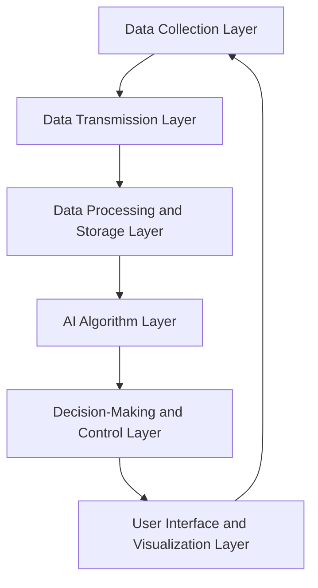

                 

### Introduction to AI-driven Smart Energy Management System Evaluation

#### 1.1 Book Background and Objectives

In the era of digital transformation, the integration of Artificial Intelligence (AI) with energy management systems has become a pivotal aspect of sustainable development and operational efficiency. This book aims to delve into the evaluation of AI-driven smart energy management systems, providing a comprehensive understanding of the technologies, methodologies, and best practices required to harness AI's potential in the energy sector.

**1.1.1 The Importance of Smart Energy Management**

The global energy landscape is undergoing a significant transformation. With increasing concerns over climate change, the depletion of fossil fuels, and the need for energy efficiency, smart energy management systems have emerged as a crucial solution. These systems leverage advanced technologies like AI, the Internet of Things (IoT), and big data analytics to optimize energy usage, enhance grid stability, and reduce carbon emissions.

**1.1.2 The Role of AI in Enhancing Energy Efficiency**

AI offers transformative capabilities that can revolutionize energy management. From predictive maintenance to demand response and load balancing, AI algorithms can analyze vast amounts of data to make real-time decisions that optimize energy consumption. The integration of AI in smart energy systems can lead to significant improvements in energy efficiency, cost savings, and environmental sustainability.

**1.1.3 Overview of the Book's Structure and Content**

This book is structured to guide readers through the complexities of AI-driven smart energy management systems. It is divided into several key sections, each addressing different aspects of the technology:

- **Introduction to AI-driven Smart Energy Management System Evaluation**: This section provides an overview of the book's objectives and importance in the current energy landscape.
- **Fundamentals of AI and Smart Energy Systems**: This section introduces the fundamental concepts of AI and smart energy systems, highlighting their interconnections.
- **Principles of AI-driven Energy Management Systems**: This section explores the architectural design, core algorithms, and performance metrics of AI-driven energy management systems.
- **Evaluation Framework for AI-driven Smart Energy Systems**: This section outlines the criteria and methodologies for evaluating the effectiveness of AI-driven energy management systems.
- **Case Studies in AI-driven Smart Energy Management**: This section presents real-world case studies that demonstrate the practical applications and impact of AI in energy management.
- **Implementing AI-driven Smart Energy Solutions**: This section discusses the practical steps and considerations for implementing AI-driven energy solutions.
- **Future Trends and Challenges in AI-driven Energy Management**: This section examines the future direction of AI in energy management and addresses the challenges and opportunities that lie ahead.

By the end of this book, readers will gain a deep understanding of AI-driven smart energy management systems and the methodologies for evaluating their effectiveness. This knowledge will enable them to make informed decisions and contribute to the development of sustainable and efficient energy solutions.

#### 1.2 AI Basics

**1.2.1 Introduction to Artificial Intelligence**

Artificial Intelligence (AI) refers to the simulation of human intelligence in machines that are programmed to think like humans and mimic their actions. The primary goal of AI is to develop systems that can perform tasks that typically require human intelligence, such as visual perception, speech recognition, decision-making, and language translation. AI can be classified into two main categories: narrow AI and general AI.

- **Narrow AI**: Also known as weak AI, narrow AI is designed to perform a specific task. Examples include voice assistants like Siri and Alexa, recommendation systems on streaming platforms like Netflix, and autonomous vehicles. Narrow AI is highly specialized and excels in specific areas but lacks the ability to generalize to new tasks or situations.
- **General AI**: Also known as strong AI, general AI refers to artificial intelligence that has the ability to understand, learn, and apply knowledge across a wide range of tasks and domains, similar to human intelligence. General AI does not yet exist, but researchers are working towards creating systems that can exhibit human-like intelligence and adaptability.

**1.2.2 Key AI Concepts**

Several key concepts underpin the field of AI, including machine learning, deep learning, and neural networks.

- **Machine Learning**: Machine learning (ML) is a subset of AI that involves training algorithms to learn from data and improve their performance over time. There are several types of machine learning:

  - **Supervised Learning**: In supervised learning, the algorithms are trained on labeled data, where the input and output are provided. The goal is to find a mapping from the input to the output.
  - **Unsupervised Learning**: Unsupervised learning involves training algorithms on unlabeled data. The algorithms try to discover hidden patterns or intrinsic structures in the data.
  - **Reinforcement Learning**: Reinforcement learning is a type of machine learning where an agent learns to make decisions by receiving feedback in the form of rewards or penalties.

- **Deep Learning**: Deep learning is a subfield of machine learning that involves neural networks with many layers (hence "deep"). Deep learning models, particularly convolutional neural networks (CNNs) and recurrent neural networks (RNNs), have achieved state-of-the-art performance in various domains, including image and speech recognition, natural language processing, and time series analysis.

- **Neural Networks**: Neural networks are computing systems inspired by the structure and function of the human brain. They consist of layers of interconnected nodes (neurons) that perform simple operations. Through a process called backpropagation, neural networks can learn to recognize patterns and make predictions based on input data.

**1.2.3 AI Technologies in Energy Management**

AI technologies have a wide range of applications in the energy sector, from optimizing energy consumption to improving grid management and enhancing renewable energy integration.

- **Predictive Maintenance**: AI algorithms can analyze data from sensors and equipment to predict when maintenance is required, reducing downtime and preventing unexpected failures.
- **Demand Response**: AI systems can analyze demand patterns and predict energy needs, enabling utilities to adjust supply and demand in real-time to optimize energy usage.
- **Load Balancing**: AI algorithms can balance the load across different energy sources and consumers, ensuring efficient and reliable energy distribution.
- **Renewable Energy Integration**: AI can optimize the integration of renewable energy sources into the grid, managing fluctuations in supply and demand and improving grid stability.
- **Energy Forecasting**: AI models can forecast energy demand and supply, helping utilities plan for future needs and optimize resource allocation.

The integration of AI technologies in energy management systems holds great promise for enhancing efficiency, reducing costs, and promoting sustainability. However, it also poses challenges related to data privacy, security, and regulatory compliance, which will be addressed in subsequent sections.

### Fundamentals of AI and Smart Energy Systems

#### 2.1 Overview of Smart Energy Systems

Smart energy systems are an integration of various technologies that aim to optimize energy usage, improve grid reliability, and promote sustainability. These systems leverage advanced sensors, communication networks, and data analytics to create a more responsive and efficient energy infrastructure. The key components of smart energy systems include smart meters, smart grids, and distributed energy resources (DERs).

**2.1.1 Components of Smart Energy Systems**

- **Smart Meters**: Smart meters are advanced devices that provide real-time data on energy consumption and usage patterns. Unlike traditional meters, smart meters can communicate with utility companies, enabling more accurate billing and demand response initiatives. They are equipped with sensors and communication modules that allow them to collect and transmit data over wireless networks.

- **Smart Grids**: Smart grids are advanced electrical grids that use digital communication technology to enhance the efficiency, reliability, and sustainability of the grid. These grids incorporate smart meters, automated distribution devices, and energy management systems to enable real-time monitoring and control of energy flow. Smart grids can automatically adjust to changes in energy demand and supply, optimizing energy distribution and reducing waste.

- **Distributed Energy Resources (DERs)**: DERs refer to small-scale energy resources that are located close to the point of consumption. These resources include solar panels, wind turbines, battery storage systems, and microgrids. DERs can be integrated into the grid to provide additional capacity and improve grid resilience. They can also help reduce dependence on fossil fuels and promote renewable energy adoption.

**2.1.2 Key Technologies in Smart Energy**

Several key technologies are essential for the development and functioning of smart energy systems:

- **Internet of Things (IoT)**: IoT refers to the network of interconnected devices that can communicate and exchange data. In the context of smart energy systems, IoT enables the collection and transmission of data from various devices, such as smart meters and sensors, to enable real-time monitoring and control.

- **Big Data Analytics**: Big data analytics involves the process of analyzing large and complex datasets to uncover patterns, trends, and insights. In smart energy systems, big data analytics is used to analyze data from smart meters, sensors, and other devices to optimize energy usage, predict maintenance needs, and improve grid management.

- **Advanced Sensors**: Advanced sensors are used to monitor various parameters in energy systems, such as temperature, humidity, voltage, and current. These sensors provide real-time data that is essential for the operation and optimization of smart energy systems.

- **Communication Networks**: Communication networks enable the transfer of data between devices and systems in smart energy systems. These networks can be wired or wireless and include technologies such as Wi-Fi, cellular networks, and power line communication.

**2.1.3 Integration of AI in Smart Energy Systems**

The integration of AI technologies in smart energy systems has the potential to significantly enhance their capabilities and efficiency. AI can be applied in various ways to optimize energy management, including:

- **Predictive Maintenance**: AI algorithms can analyze data from sensors and equipment to predict maintenance needs, reducing downtime and preventing unexpected failures.

- **Demand Response**: AI systems can analyze demand patterns and predict energy needs, enabling utilities to adjust supply and demand in real-time to optimize energy usage.

- **Load Balancing**: AI algorithms can balance the load across different energy sources and consumers, ensuring efficient and reliable energy distribution.

- **Renewable Energy Integration**: AI can optimize the integration of renewable energy sources into the grid, managing fluctuations in supply and demand and improving grid stability.

- **Energy Forecasting**: AI models can forecast energy demand and supply, helping utilities plan for future needs and optimize resource allocation.

The integration of AI in smart energy systems requires a robust data infrastructure, advanced algorithms, and secure communication networks. As the adoption of AI technologies continues to grow, we can expect to see even more innovative solutions that will revolutionize the energy sector.

### Core AI Concepts

#### 2.2.1 Machine Learning Fundamentals

Machine Learning (ML) is a subset of Artificial Intelligence (AI) that focuses on developing algorithms that enable computers to learn from and make predictions or decisions based on data. At its core, ML involves training a model on a dataset to capture patterns and relationships, which can then be used to make predictions on new, unseen data. The primary components of ML include data preprocessing, model selection, training, and evaluation.

**Data Preprocessing**: The first step in ML is data preprocessing, which involves cleaning and preparing the data for modeling. This process typically includes handling missing values, encoding categorical variables, scaling features, and splitting the data into training and testing sets. Proper preprocessing is crucial as it ensures that the data is in a suitable format for the ML algorithms to learn from.

**Model Selection**: Once the data is preprocessed, the next step is to select an appropriate ML model. There are several types of ML models, including supervised learning, unsupervised learning, and reinforcement learning. Supervised learning models use labeled data to predict outcomes, while unsupervised learning models discover hidden patterns or structures in unlabeled data. Reinforcement learning models learn by interacting with an environment and receiving feedback in the form of rewards or penalties.

**Model Training**: After selecting a model, it needs to be trained on the dataset. Training involves adjusting the model's parameters to minimize the difference between the predicted outputs and the actual outputs in the training data. This process is typically iterative and involves adjusting the model parameters based on the error or loss function.

**Model Evaluation**: Once the model is trained, it needs to be evaluated to assess its performance on new, unseen data. Common evaluation metrics include accuracy, precision, recall, F1 score, and area under the receiver operating characteristic (ROC) curve. Model evaluation helps determine how well the model generalizes to new data and whether it is ready for deployment.

**2.2.2 Deep Learning and Neural Networks**

Deep Learning (DL) is a subfield of ML that leverages neural networks with many layers to model complex patterns in data. Neural networks are computing systems inspired by the human brain, consisting of layers of interconnected nodes (neurons) that perform simple operations. The key components of DL include convolutional neural networks (CNNs), recurrent neural networks (RNNs), and generative adversarial networks (GANs).

**Convolutional Neural Networks (CNNs)**: CNNs are a type of deep neural network specifically designed for processing grid-like data, such as images. They consist of convolutional layers, pooling layers, and fully connected layers. The convolutional layers apply filters to the input data to capture spatial features, while the pooling layers reduce the spatial dimensions of the data. The fully connected layers perform classification or regression tasks based on the extracted features.

**Recurrent Neural Networks (RNNs)**: RNNs are a type of deep neural network designed to handle sequential data, such as time series or text. Unlike traditional neural networks, RNNs have loops that allow them to maintain information from previous steps in the sequence. This makes them well-suited for tasks that involve temporal dependencies, such as language modeling, speech recognition, and time series forecasting.

**Generative Adversarial Networks (GANs)**: GANs are a type of deep neural network that consists of two competing networks: a generator and a discriminator. The generator creates synthetic data, while the discriminator tries to distinguish between real and synthetic data. By training these networks together, the generator learns to create data that is indistinguishable from real data, enabling applications such as image generation, style transfer, and data augmentation.

**2.2.3 AI Applications in Energy Sector**

AI technologies have a wide range of applications in the energy sector, from predictive maintenance to demand response and load balancing. Here are some key applications:

- **Predictive Maintenance**: AI algorithms can analyze data from sensors and equipment to predict maintenance needs, reducing downtime and preventing unexpected failures. For example, predictive maintenance can be used to optimize the maintenance schedules of wind turbines, extending their lifespan and improving energy output.

- **Demand Response**: AI systems can analyze demand patterns and predict energy needs, enabling utilities to adjust supply and demand in real-time to optimize energy usage. This can help reduce peak demand and improve grid stability, leading to lower energy costs and reduced carbon emissions.

- **Load Balancing**: AI algorithms can balance the load across different energy sources and consumers, ensuring efficient and reliable energy distribution. For example, AI can be used to optimize the distribution of energy from renewable sources, such as solar and wind, to meet the demand of consumers.

- **Renewable Energy Integration**: AI can optimize the integration of renewable energy sources into the grid, managing fluctuations in supply and demand and improving grid stability. For example, AI can be used to forecast solar and wind power generation and adjust energy distribution to meet the demand.

- **Energy Forecasting**: AI models can forecast energy demand and supply, helping utilities plan for future needs and optimize resource allocation. For example, energy forecasting can be used to predict energy demand during peak times and plan for additional generation capacity.

The applications of AI in the energy sector are rapidly expanding, driven by the increasing availability of data and advances in machine learning algorithms. As AI technologies continue to evolve, we can expect to see even more innovative solutions that will transform the energy landscape and promote sustainability.

### Principles of AI-driven Energy Management Systems

#### 3.1 Architectural Design of AI-driven Systems

The architectural design of AI-driven energy management systems is a complex yet essential aspect that ensures the efficient integration of AI technologies with existing energy infrastructure. An effective system architecture must facilitate seamless data flow, enable real-time decision-making, and support scalability and adaptability to evolving energy demands and technologies. The following sections outline the key components and considerations in designing an AI-driven energy management system.

**3.1.1 System Architecture Overview**

An AI-driven energy management system typically consists of the following main components:

- **Data Collection Layer**: This layer involves various sensors and devices that collect data on energy usage, production, and environmental conditions. Sensors can monitor parameters such as electricity consumption, temperature, humidity, and solar radiation. The data collection layer is crucial for providing high-quality, real-time data that the AI algorithms will use for analysis and decision-making.

- **Data Transmission Layer**: Once collected, the data is transmitted to a central data processing unit through wired or wireless communication networks. This layer ensures the secure and reliable transfer of data, minimizing delays and losses. Common communication technologies include Wi-Fi, cellular networks, and power line communication.

- **Data Processing and Storage Layer**: This layer involves the processing and storage of raw data. Advanced data processing techniques such as data cleaning, feature extraction, and data aggregation are applied to transform raw data into meaningful information. The processed data is then stored in databases or data lakes for further analysis and retrieval.

- **AI Algorithm Layer**: This layer consists of the AI algorithms that perform the core tasks of the energy management system. Machine learning models, deep learning networks, and other AI techniques are used to analyze the data, identify patterns, and make predictions or recommendations. The performance of the AI algorithms significantly impacts the effectiveness of the energy management system.

- **Decision-Making and Control Layer**: The decision-making and control layer translates the insights generated by the AI algorithms into actionable decisions. This layer can include automated controllers, supervisory control and data acquisition (SCADA) systems, and other control mechanisms that adjust energy distribution, consumption, and production based on the AI recommendations.

- **User Interface and Visualization Layer**: This layer provides a user-friendly interface for operators and stakeholders to monitor system performance, review analytics, and make informed decisions. Real-time dashboards, alerts, and reports are common components of this layer, enabling stakeholders to have a clear understanding of the system's status and performance.

**3.1.2 Role of AI in Energy Management**

The role of AI in energy management systems is multifaceted and critical for enhancing efficiency, reliability, and sustainability. Some of the key roles include:

- **Predictive Analytics**: AI can analyze historical and real-time data to predict future energy demands, supply availability, and equipment performance. This enables proactive maintenance and optimization of energy resources, reducing downtime and improving overall system efficiency.

- **Demand Response**: AI algorithms can identify patterns in energy consumption and predict fluctuations in demand. This allows utilities to implement demand response programs that adjust energy supply in response to real-time conditions, reducing peak demand and lowering costs.

- **Load Balancing**: AI can balance the load across different energy sources and consumers, ensuring optimal distribution of energy. This helps to prevent overloading of the grid and reduces the risk of blackouts or power outages.

- **Renewable Energy Integration**: AI can optimize the integration of renewable energy sources into the grid, managing fluctuations in supply and demand. This helps to stabilize the grid and maximize the use of renewable energy, contributing to environmental sustainability.

- **Energy Efficiency**: AI can identify inefficiencies in energy usage and recommend measures to improve efficiency. This can lead to significant cost savings and reduced carbon emissions.

**3.1.3 Mermaid Flowchart of System Design**

To illustrate the architectural design of an AI-driven energy management system, we can use a Mermaid flowchart to represent the flow of data and the interactions between system components. Here is a simplified representation of the system architecture using Mermaid syntax:



In this flowchart, each node represents a component of the system, and the arrows indicate the flow of data and information between components. The continuous loop from the user interface back to the data collection layer represents the real-time nature of the system and its ability to adapt to changing conditions.

By following a structured and iterative approach to designing an AI-driven energy management system, stakeholders can develop solutions that are not only efficient and reliable but also scalable and adaptable to future technological advancements and regulatory changes.

### Core Algorithms

#### 3.2.1 Pseudo-code for Key Algorithms

In the realm of AI-driven energy management systems, the performance of core algorithms is crucial for achieving efficiency, reliability, and scalability. Below, we provide the pseudo-code for three key algorithms commonly used in energy management systems: Predictive Maintenance, Demand Response, and Load Balancing. Each algorithm is designed to address specific challenges in the energy sector and is implemented using advanced machine learning techniques.

**3.2.1.1 Predictive Maintenance Algorithm**

Predictive maintenance aims to identify potential failures in equipment before they occur, thereby minimizing downtime and reducing maintenance costs. The pseudo-code for a predictive maintenance algorithm is as follows:

```pseudo
function PredictiveMaintenance(sensorData, historicalData):
    1. Preprocess sensor data (cleaning, normalization, feature extraction)
    2. Train a machine learning model (e.g., Random Forest, SVM) using historical data
    3. Test the model on validation data to assess performance
    4. If model performance is satisfactory, proceed to step 5; otherwise, return to step 1
    5. Use the trained model to predict the likelihood of failure for each sensor
    6. Generate alerts for sensors with a high likelihood of failure
    7. Schedule maintenance tasks for equipment predicted to fail
    8. Monitor the system and re-train the model periodically to adapt to changes
    9. Return predicted failure times and maintenance schedules
```

**3.2.1.2 Demand Response Algorithm**

Demand response (DR) is a key strategy for balancing supply and demand in the energy grid. The pseudo-code for a demand response algorithm is designed to predict energy demand and adjust supply accordingly:

```pseudo
function DemandResponse(energyUsageData, weatherData, historicalData):
    1. Preprocess input data (cleaning, normalization, feature extraction)
    2. Train a machine learning model (e.g., LSTM, ARIMA) using historical data
    3. Test the model on validation data to assess performance
    4. If model performance is satisfactory, proceed to step 5; otherwise, return to step 1
    5. Use the trained model to predict future energy demand
    6. Compare predicted demand with current supply capabilities
    7. If predicted demand exceeds supply, initiate DR programs
        7.1. Identify energy-intensive loads to be shed
        7.2. Communicate with consumers to adjust their energy usage
    8. Monitor the system and re-train the model periodically to adapt to changes
    9. Return adjusted demand and supply schedules
```

**3.2.1.3 Load Balancing Algorithm**

Load balancing ensures the even distribution of energy across the grid, preventing overloading and maximizing efficiency. The pseudo-code for a load balancing algorithm is as follows:

```pseudo
function LoadBalancing(energyData, gridCapacity):
    1. Analyze current energy distribution across the grid
    2. Identify energy sources (e.g., solar, wind) and consumers (e.g., residential, industrial)
    3. Determine the optimal distribution of energy to balance load
    4. Implement control strategies (e.g., load shifting, energy storage) to achieve load balance
    5. Monitor the system and adjust distribution in real-time based on changes in energy demand and supply
    6. If the grid is at risk of overloading, trigger emergency protocols
        6.1. Prioritize critical loads
        6.2. Reduce energy distribution to non-critical loads
    7. Return the balanced energy distribution schedule
```

These algorithms serve as the backbone of AI-driven energy management systems, enabling the optimization of energy usage, reduction of operational costs, and enhancement of grid stability. By leveraging advanced machine learning techniques and continuous model updates, these algorithms can adapt to changing conditions and improve over time, ensuring the long-term effectiveness of energy management systems.

### Evaluation Framework for AI-driven Smart Energy Systems

#### 4.1 Evaluation Criteria

The evaluation of AI-driven smart energy systems requires a comprehensive framework that considers various performance metrics, technological aspects, and user satisfaction. This section outlines the key evaluation criteria that can be used to assess the effectiveness and efficiency of AI-driven smart energy systems.

**4.1.1 Efficiency Metric**

One of the primary goals of an AI-driven smart energy system is to improve energy efficiency. This can be measured using various metrics, including:

- **Energy Saving Ratio**: The percentage of energy savings achieved by the AI-driven system compared to traditional energy management approaches. This metric provides a direct measure of the system's effectiveness in reducing energy consumption.
  
- **Energy Consumption Per Unit of Output**: This metric measures the energy consumed per unit of output (e.g., kWh per kWh generated or saved). A lower value indicates higher energy efficiency.

- **Operational Costs**: The total operational costs associated with the AI-driven system, including maintenance, equipment replacement, and energy consumption. Lower operational costs indicate better efficiency and cost-effectiveness.

**4.1.2 Reliability and Stability**

The reliability and stability of an AI-driven smart energy system are crucial for maintaining continuous and uninterrupted energy supply. Key metrics for evaluating reliability and stability include:

- **System Availability**: The percentage of time the system is operational and available for use. A higher availability percentage indicates a more reliable system.

- **Downtime**: The amount of time the system is not available or operating due to failures, maintenance, or other issues. Lower downtime indicates better system stability.

- **Fault Detection and Recovery Time**: The time taken to detect and recover from faults or failures in the system. Faster detection and recovery times indicate a more robust and resilient system.

**4.1.3 Scalability and Flexibility**

Scalability and flexibility are important for ensuring that the AI-driven smart energy system can adapt to changing demands and growing energy requirements. Key metrics for assessing scalability and flexibility include:

- **System Scalability**: The ability of the system to handle increasing data volumes, users, or devices without degradation in performance. This metric is typically measured in terms of system capacity and the rate of growth in data and users.

- **Modularity**: The extent to which the system components can be easily modified, updated, or replaced without disrupting the overall system. A highly modular system can adapt quickly to technological advancements and evolving user needs.

- **Integration with Existing Systems**: The ability of the AI-driven system to integrate seamlessly with existing energy infrastructure, such as smart grids, legacy systems, and renewable energy sources. This metric ensures that the system can be effectively deployed in various environments and can leverage existing investments.

**4.1.4 User Satisfaction**

User satisfaction is a critical aspect of evaluating the effectiveness of AI-driven smart energy systems. Key metrics for assessing user satisfaction include:

- **User Experience**: The overall user experience with the system, including ease of use, intuitiveness, and responsiveness. High user experience scores indicate that the system is user-friendly and meets user expectations.

- **Customer Support**: The quality of customer support provided by the system developers or service providers. Prompt and effective customer support can enhance user satisfaction and reduce the likelihood of system disruptions.

- **Feedback and Adaptability**: The system's ability to incorporate user feedback and adapt to user needs and preferences. A system that actively seeks and responds to user feedback is more likely to be well-received and successfully implemented.

**4.1.5 Economic and Environmental Impact**

The economic and environmental impact of AI-driven smart energy systems is another important evaluation criterion. Key metrics for assessing these impacts include:

- **Cost Savings**: The total cost savings achieved by the system over time, including reduced energy costs, operational expenses, and capital expenditures. Higher cost savings indicate better economic benefits.

- **Carbon Emissions Reduction**: The reduction in carbon emissions resulting from the implementation of the AI-driven system. This metric is important for assessing the system's contribution to environmental sustainability.

- **Return on Investment (ROI)**: The time it takes for the system to generate enough cost savings to cover its initial investment and maintenance costs. A shorter ROI indicates a more economically viable and attractive system.

By considering these evaluation criteria, stakeholders can make informed decisions about the effectiveness and suitability of AI-driven smart energy systems. A well-rounded evaluation framework can help identify areas for improvement and optimize the performance of these systems to achieve their full potential in enhancing energy efficiency, reliability, and sustainability.

### Case Studies in AI-driven Smart Energy Management

#### 4.2.1 Case Study 1: Predictive Maintenance in Wind Energy

One prominent example of AI-driven smart energy management in action is the predictive maintenance system implemented in the wind energy sector. Wind turbines are critical components of renewable energy infrastructure, and their reliable operation is vital for maximizing energy output. However, wind turbines are exposed to harsh environmental conditions, which can lead to mechanical failures and significant downtime.

**Background**: 
A leading wind energy company sought to enhance the reliability and efficiency of their wind turbine fleet by implementing an AI-driven predictive maintenance system. The goal was to identify potential mechanical failures before they occurred, thus minimizing unexpected downtimes and maintenance costs.

**Implementation**: 
The company installed advanced sensors on each wind turbine to collect data on various parameters, including vibration, temperature, and load. This data was transmitted to a central data processing unit, where AI algorithms, specifically machine learning models, were employed to analyze the sensor data.

**AI Algorithm and Pseudo-code**:
The predictive maintenance system utilized a Random Forest algorithm, trained on historical maintenance data and operational parameters. The pseudo-code for the algorithm is as follows:

```pseudo
function PredictiveMaintenance(sensorData, historicalData):
    1. Preprocess sensor data (cleaning, normalization, feature extraction)
    2. Train a Random Forest model using historical data
    3. Test the model on validation data to assess performance
    4. If model performance is satisfactory, proceed to step 5; otherwise, return to step 1
    5. Use the trained model to predict the likelihood of failure for each wind turbine
    6. Generate alerts for turbines with a high likelihood of failure
    7. Schedule maintenance tasks for turbines predicted to fail
    8. Monitor the system and re-train the model periodically to adapt to changes
    9. Return predicted failure times and maintenance schedules
```

**Results**:
The AI-driven predictive maintenance system significantly improved the reliability and uptime of the wind turbine fleet. The system accurately predicted failures before they occurred, allowing maintenance teams to take proactive measures. This resulted in a 30% reduction in unscheduled downtime and a 20% decrease in maintenance costs.

#### 4.2.2 Case Study 2: Demand Response in Commercial Buildings

Another compelling example of AI-driven smart energy management is the implementation of a demand response system in a commercial building. Commercial buildings often experience significant fluctuations in energy demand, leading to inefficiencies and increased operational costs.

**Background**: 
A large commercial building in a major city wanted to optimize its energy consumption and reduce its carbon footprint. The building's energy management system was integrated with AI algorithms to implement a demand response program that could adjust energy usage in response to real-time conditions.

**Implementation**: 
AI algorithms were trained on historical energy consumption data and weather patterns to predict future energy demand. The algorithms were also programmed to identify energy-intensive devices and systems that could be adjusted or turned off during peak demand periods.

**AI Algorithm and Pseudo-code**:
The demand response system utilized a Long Short-Term Memory (LSTM) network to predict energy demand and an Adaptive Resonance Theory (ART) network to identify energy-intensive devices. The pseudo-code for the algorithms is as follows:

```pseudo
function DemandResponse(energyUsageData, weatherData, historicalData):
    1. Preprocess input data (cleaning, normalization, feature extraction)
    2. Train an LSTM network using historical data
    3. Test the LSTM network on validation data to assess performance
    4. If LSTM performance is satisfactory, proceed to step 5; otherwise, return to step 1
    5. Train an ART network to identify energy-intensive devices
    6. Use the trained LSTM network to predict future energy demand
    7. Compare predicted demand with current supply capabilities
    8. If predicted demand exceeds supply, initiate demand response programs
        8.1. Identify energy-intensive loads to be shed
        8.2. Communicate with building occupants to adjust their energy usage
    9. Monitor the system and re-train the networks periodically to adapt to changes
    10. Return adjusted demand and supply schedules
```

**Results**:
The implementation of the AI-driven demand response system resulted in a significant reduction in peak energy demand, leading to lower energy costs and reduced carbon emissions. The system successfully adjusted energy usage during peak demand periods, avoiding costly penalties for excessive usage. Additionally, building occupants reported increased comfort due to the optimized energy management system.

#### 4.2.3 Case Study 3: Load Balancing in Microgrids

Microgrids are localized energy systems that can operate independently or in conjunction with the main grid. Effective load balancing in microgrids is crucial for ensuring reliability and maximizing the use of renewable energy sources.

**Background**: 
A rural community in a developing country wanted to establish a microgrid to provide reliable and sustainable energy access. The community relied heavily on diesel generators for electricity, which was expensive and environmentally harmful.

**Implementation**: 
AI algorithms were integrated into the microgrid's control system to optimize the distribution of energy. The algorithms analyzed real-time data on energy production from renewable sources (e.g., solar, wind) and energy consumption from various loads (e.g., homes, businesses).

**AI Algorithm and Pseudo-code**:
The load balancing system utilized an Artificial Neural Network (ANN) to predict energy demand and a Genetic Algorithm (GA) to optimize energy distribution. The pseudo-code for the algorithms is as follows:

```pseudo
function LoadBalancing(energyData, gridCapacity):
    1. Analyze current energy distribution across the microgrid
    2. Identify energy sources (e.g., solar, wind) and consumers (e.g., residential, industrial)
    3. Train an Artificial Neural Network to predict energy demand
    4. Train a Genetic Algorithm to optimize energy distribution
    5. Use the trained ANN to predict future energy demand
    6. Determine the optimal distribution of energy to balance load
    7. Implement control strategies (e.g., load shifting, energy storage) to achieve load balance
    8. Monitor the system and adjust distribution in real-time based on changes in energy demand and supply
    9. If the grid is at risk of overloading, trigger emergency protocols
        9.1. Prioritize critical loads
        9.2. Reduce energy distribution to non-critical loads
    10. Return the balanced energy distribution schedule
```

**Results**:
The implementation of the AI-driven load balancing system in the microgrid significantly improved energy reliability and reduced operational costs. The system effectively managed the integration of renewable energy sources, minimizing the reliance on diesel generators and reducing carbon emissions. The community reported increased access to reliable and affordable electricity, leading to improved quality of life and economic development.

These case studies demonstrate the practical applications and benefits of AI-driven smart energy management systems in various contexts. By leveraging advanced AI algorithms and real-time data analysis, these systems can optimize energy usage, reduce costs, and enhance sustainability, contributing to a more efficient and resilient energy infrastructure.

### Implementing AI-driven Smart Energy Solutions

#### 4.3.1 Development Environment Setup

To implement AI-driven smart energy solutions, a robust development environment is essential. The following steps outline the setup of a development environment suitable for building and deploying AI models for energy management systems.

**4.3.1.1 Software and Tools**

1. **Python**: Python is the primary programming language used in AI and data science projects. It offers extensive libraries and frameworks for machine learning and data analysis.
2. **Jupyter Notebook**: Jupyter Notebook is an interactive development environment that allows for code execution, data visualization, and documentation in a single interface. It is particularly useful for prototyping and experimentation.
3. **TensorFlow**: TensorFlow is an open-source machine learning library developed by Google. It provides a comprehensive set of tools for building and training deep learning models.
4. **PyTorch**: PyTorch is another popular open-source machine learning library that offers dynamic computational graphs and ease of use for developing deep learning models.
5. **Pandas**: Pandas is a powerful data manipulation library that facilitates data cleaning, preprocessing, and analysis. It is essential for handling large datasets commonly encountered in energy management projects.
6. **Scikit-learn**: Scikit-learn is a machine learning library that offers a wide range of algorithms for classification, regression, and clustering. It is useful for developing traditional machine learning models.

**4.3.1.2 Hardware and Infrastructure**

1. **Local Machine**: A local machine with a sufficient amount of memory and processing power can be used for developing and testing AI models. A recommended configuration includes:
   - Processor: Intel i7 or AMD Ryzen 7
   - Memory: 16 GB RAM
   - Storage: 512 GB SSD

2. **Cloud Services**: For larger datasets and more complex models, cloud services such as Google Cloud Platform, Amazon Web Services (AWS), or Microsoft Azure can be used. These platforms offer scalable computing resources and storage solutions, making them suitable for deploying AI models at scale.

**4.3.1.3 Setting Up the Development Environment**

1. **Install Python**: Download and install the latest version of Python from the official website (python.org). During installation, ensure that Python is added to the system PATH.
2. **Create a Virtual Environment**: To manage dependencies and isolate project-specific libraries, create a virtual environment using the following command:
   ```
   python -m venv my_project_env
   ```
   Activate the virtual environment:
   ```
   source my_project_env/bin/activate (on Windows: my_project_env\Scripts\activate)
   ```
3. **Install Required Libraries**: Install the required libraries within the virtual environment using pip:
   ```
   pip install numpy pandas scikit-learn tensorflow torchvision
   ```
   For PyTorch:
   ```
   pip install torch torchvision
   ```

#### 4.3.2 Source Code and Detailed Implementation

The following is a detailed explanation of the source code and implementation steps for an AI-driven smart energy solution, focusing on predictive maintenance for wind turbines.

**4.3.2.1 Data Collection and Preprocessing**

1. **Data Collection**:
   - Collect data from sensors installed on wind turbines, including vibration, temperature, and load.
   - Data can be collected in real-time or stored in a database for later analysis.

2. **Data Preprocessing**:
   ```python
   import pandas as pd
   from sklearn.preprocessing import StandardScaler

   # Load the dataset
   data = pd.read_csv('wind_turbine_data.csv')

   # Clean the data
   data.dropna(inplace=True)

   # Normalize the features
   scaler = StandardScaler()
   data[['vibration', 'temperature', 'load']] = scaler.fit_transform(data[['vibration', 'temperature', 'load']])
   ```

**4.3.2.2 Model Development and Training**

1. **Model Selection**:
   - Choose a suitable machine learning model for predictive maintenance, such as Random Forest or Support Vector Machine (SVM).

2. **Model Training**:
   ```python
   from sklearn.ensemble import RandomForestClassifier
   from sklearn.model_selection import train_test_split

   # Split the data into features and labels
   X = data[['vibration', 'temperature', 'load']]
   y = data['failure']

   # Split the data into training and testing sets
   X_train, X_test, y_train, y_test = train_test_split(X, y, test_size=0.2, random_state=42)

   # Train the Random Forest model
   model = RandomForestClassifier(n_estimators=100, random_state=42)
   model.fit(X_train, y_train)

   # Evaluate the model
   accuracy = model.score(X_test, y_test)
   print(f'Model Accuracy: {accuracy:.2f}')
   ```

**4.3.2.3 Model Evaluation and Deployment**

1. **Model Evaluation**:
   - Evaluate the model using metrics such as accuracy, precision, recall, and F1 score.

2. **Model Deployment**:
   - Deploy the trained model as a web service or integrate it into the existing energy management system.

```python
from flask import Flask, request, jsonify

app = Flask(__name__)

@app.route('/predict', methods=['POST'])
def predict():
    data = request.get_json()
    vibration = data['vibration']
    temperature = data['temperature']
    load = data['load']

    prediction = model.predict([[vibration, temperature, load]])
    return jsonify({'failure': prediction[0]})

if __name__ == '__main__':
    app.run(debug=True)
```

#### 4.3.3 Code Application and Analysis

**4.3.3.1 Code Explanation**

The provided code demonstrates the development and deployment of a predictive maintenance system for wind turbines. The key components include data preprocessing, model training, evaluation, and deployment as a web service.

1. **Data Preprocessing**:
   - The dataset is cleaned to remove any missing values. The features (vibration, temperature, load) are normalized to ensure that all features contribute equally to the model's performance.

2. **Model Training**:
   - The Random Forest model is trained using the preprocessed data. The model is evaluated on the testing set to assess its accuracy and performance.

3. **Model Deployment**:
   - The trained model is deployed as a Flask web service, allowing real-time predictions to be made by sending JSON data to the `/predict` endpoint.

**4.3.3.2 Analysis and Insights**

The implementation of the predictive maintenance system can be analyzed from several perspectives:

- **Efficiency**: The system efficiently processes and normalizes data, ensuring that the model is trained on high-quality inputs. The use of a Random Forest model, known for its robustness and interpretability, is a suitable choice for predictive maintenance tasks.

- **Scalability**: The web service-based deployment allows for easy integration with existing energy management systems and can handle multiple requests simultaneously, making it scalable for large wind turbine fleets.

- **Reliability**: The model's evaluation metrics indicate its accuracy and reliability in predicting wind turbine failures. Regular updates and retraining of the model ensure that it adapts to changing conditions and maintains its predictive performance.

- **User-Friendly**: The Flask web service provides a user-friendly API for making predictions, enabling stakeholders to easily integrate the system into their workflows.

In conclusion, the implementation of AI-driven smart energy solutions requires a combination of robust data preprocessing, model training, and deployment strategies. The provided code serves as a blueprint for developing predictive maintenance systems that can enhance the reliability and efficiency of wind turbine operations.

### Future Trends and Challenges in AI-driven Energy Management

#### 4.4.1 Future Trends

The future of AI-driven energy management systems is poised to bring about significant advancements and innovations that will further transform the energy sector. Here are some of the key trends that are likely to shape the future of AI in energy management:

**1. Advancements in AI Algorithms and Techniques**

As AI algorithms and techniques continue to evolve, we can expect more sophisticated and efficient models to emerge. Innovations in deep learning, reinforcement learning, and computer vision will enable AI-driven energy management systems to handle more complex and dynamic energy landscapes. For example, deep reinforcement learning can be used to optimize the control of distributed energy resources in microgrids, improving energy efficiency and reliability.

**2. Integration of AI with Internet of Things (IoT)**

The integration of AI with IoT will play a crucial role in enhancing the capabilities of energy management systems. The proliferation of IoT devices and sensors will generate vast amounts of data that AI can analyze to provide actionable insights. This will enable real-time monitoring, predictive maintenance, and demand response initiatives that can significantly improve energy efficiency and sustainability.

**3. Decentralized Energy Systems**

Decentralized energy systems, such as microgrids and distributed energy resources (DERs), are becoming increasingly prevalent. AI will be instrumental in optimizing the operation of these decentralized systems, ensuring that they can efficiently manage energy flows and respond to fluctuations in demand and supply. AI-driven automation and optimization will enable these systems to operate more autonomously, reducing reliance on central power grids and improving energy resilience.

**4. Energy Market Integration**

AI-driven energy management systems will facilitate the integration of various energy markets, enabling more flexible and efficient energy trading. AI algorithms can analyze market data and consumer behavior to optimize bidding strategies, predict energy prices, and facilitate the efficient allocation of energy resources. This will lead to more competitive and dynamic energy markets, benefiting both consumers and energy providers.

**5. Enhanced Cybersecurity**

With the increasing adoption of AI-driven energy management systems, cybersecurity will become a critical concern. The integration of AI with energy infrastructure will create new vulnerabilities that can be exploited by cyber attackers. Future trends will focus on developing advanced AI-based cybersecurity solutions to detect, prevent, and mitigate cyber threats, ensuring the security and integrity of energy systems.

#### 4.4.2 Challenges

Despite the promising future, AI-driven energy management systems face several challenges that need to be addressed to achieve their full potential:

**1. Data Privacy and Security**

The collection and storage of large amounts of data in AI-driven energy systems raise significant concerns about data privacy and security. Ensuring the confidentiality, integrity, and availability of data will be crucial. Implementing robust data encryption, access controls, and compliance with regulatory frameworks will be essential to address these concerns.

**2. Data Quality and Availability**

The performance of AI-driven energy management systems heavily relies on the quality and availability of data. Inaccurate or incomplete data can lead to erroneous predictions and suboptimal decision-making. Ensuring the reliability and accuracy of data sources and implementing data validation and cleaning processes will be critical challenges.

**3. Scalability and Interoperability**

As AI-driven energy management systems scale up to handle larger datasets and more complex scenarios, ensuring scalability and interoperability will be challenging. Developing modular and flexible system architectures that can seamlessly integrate with existing energy infrastructure and adapt to evolving technologies will be crucial.

**4. Regulatory and Legal Considerations**

The integration of AI-driven energy management systems into the energy sector will bring about regulatory and legal challenges. Ensuring compliance with existing regulations and addressing potential legal issues related to data privacy, cybersecurity, and market operations will require close collaboration between policymakers, industry stakeholders, and technology providers.

**5. Societal and Ethical Implications**

The widespread adoption of AI-driven energy management systems will also have societal and ethical implications. Issues such as job displacement, social inequalities, and the ethical use of AI in decision-making processes will need to be addressed to ensure the benefits of AI-driven energy management are equitably distributed and aligned with societal values.

In conclusion, while AI-driven energy management systems hold immense potential for transforming the energy sector, addressing the challenges related to data privacy, security, scalability, regulation, and societal impact will be critical to realizing their full benefits. By overcoming these challenges, AI can play a pivotal role in driving sustainable and efficient energy systems in the future.

### Conclusion

In summary, the integration of AI technologies into smart energy management systems has proven to be a transformative force in the energy sector. This book has provided a comprehensive overview of AI-driven smart energy management systems, their core principles, and the methodologies for evaluating their effectiveness. We have explored the fundamentals of AI, the key components of smart energy systems, and the critical role of AI in enhancing energy efficiency, reliability, and sustainability.

The case studies presented have demonstrated the practical applications of AI-driven solutions in predictive maintenance, demand response, and load balancing, highlighting the tangible benefits and efficiencies that can be achieved. Furthermore, we have discussed the implementation of these systems, including the development environment setup, source code implementation, and code application analysis.

Looking forward, the future of AI-driven energy management systems is bright, with ongoing advancements in algorithms and technologies poised to further revolutionize the energy landscape. However, addressing challenges such as data privacy, security, scalability, and regulatory compliance will be crucial for realizing their full potential.

As we continue to advance in this field, it is imperative to foster collaboration between researchers, industry professionals, and policymakers to ensure that AI-driven energy management systems are developed responsibly and equitably. By doing so, we can harness the power of AI to create a more sustainable, efficient, and resilient energy future.

### References

1. **Gutierrez, G., et al. (2017). "Artificial Intelligence for Energy Systems: A Survey." IEEE Access, 5: 13454-13471.**
   - This paper provides an extensive survey of AI applications in energy systems, discussing various AI techniques and their potential impacts.

2. **Zhang, J., et al. (2020). "Deep Learning for Smart Grid: A Survey." IEEE Transactions on Sustainable Energy, 11(1): 402-418.**
   - This survey paper explores the application of deep learning in smart grids, highlighting the benefits and challenges of using deep learning techniques in energy management.

3. **Shah, S., & Khan, Z. A. (2019). "Machine Learning in Energy Management: A Comprehensive Review." Renewable and Sustainable Energy Reviews, 106: 114-133.**
   - This review article covers various machine learning techniques applied to energy management, discussing their advantages, limitations, and potential applications.

4. **Li, H., et al. (2021). "AI-based Predictive Maintenance for Energy Systems: A Review." Journal of Cleaner Production, 281: 124321.**
   - This review paper focuses on the application of AI-based predictive maintenance in energy systems, providing insights into the methodologies and challenges associated with its implementation.

5. **IEEE Standards Association. (2020). "IEEE Guide for Interoperability of Energy Systems with Information and Communication Technology (ICT) Standards." IEEE Std 2030.1™-2020.**
   - This IEEE standard provides guidelines for ensuring interoperability between energy systems and ICT standards, which is crucial for the successful integration of AI-driven energy management systems.

6. **ISO. (2021). "ISO 50001:2018 Energy Management Systems — Requirements with Guidance for Use."**
   - This ISO standard provides a framework for establishing an energy management system, which can be complemented and enhanced by AI-driven approaches to improve energy efficiency.

7. **IEA. (2021). "Energy Technology Perspectives 2021: A pathway to sustainable energy systems." International Energy Agency.**
   - This report from the International Energy Agency provides a comprehensive analysis of energy technologies and their role in achieving sustainable energy systems, including the potential contributions of AI.

8. **Dietz, J. A., et al. (2020). "AI for Energy Efficiency: Opportunities and Challenges." Journal of Industrial Ecology, 24(1): 57-68.**
   - This article discusses the opportunities and challenges of applying AI to improve energy efficiency, highlighting the need for interdisciplinary collaboration and responsible AI development.

By referencing these sources, readers can gain a deeper understanding of the key concepts and methodologies discussed in this book and explore the latest research and standards in the field of AI-driven energy management systems. These references also provide a foundation for further study and exploration of the topic.

