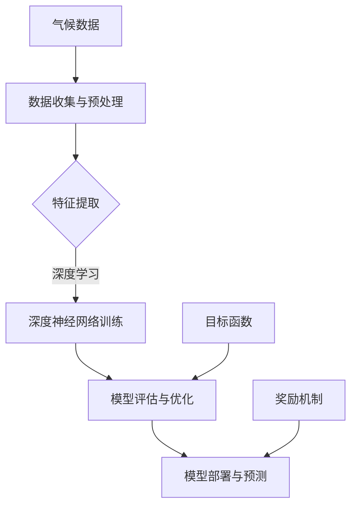

                 

### 关键词

- AI驱动的气候模型
- 局部气候模型
- 全球气候模型
- AI核心算法
- 气候系统基本原理
- 深度学习
- 强化学习

### 摘要

本文旨在探讨AI驱动的气候模型，从局部到全球尺度上的应用。文章首先介绍了AI驱动的气候模型的背景和重要性，以及其发展历程。接着，文章详细阐述了气候系统基本原理和AI核心算法原理，包括神经网络与深度学习、监督学习与无监督学习、强化学习等。然后，文章分别介绍了AI驱动的气候模型在局部尺度上的应用，如气象预报、森林火灾预警和城市热岛效应研究，以及在全球尺度上的应用，如全球气候变化趋势预测、极端气候事件的预测和气候变化对农业的影响。最后，文章讨论了AI驱动的气候模型开发实践，包括开发环境搭建、代码实现与解读等，并分析了模型面临的挑战和未来发展方向。

### 引言

随着全球气候变化的影响日益加剧，准确预测和模拟气候系统成为了一项重要的研究课题。传统的气候模型依赖于物理原理和数值模拟，虽然在一定程度上能够反映气候系统的复杂性，但仍然存在一定的局限性。随着人工智能（AI）技术的快速发展，特别是深度学习、强化学习等算法的突破，AI驱动的气候模型应运而生，为气候研究带来了新的机遇和挑战。

AI驱动的气候模型通过利用大量的气候数据和先进的AI算法，能够更准确地模拟和预测气候系统的变化。这些模型不仅可以应用于局部气候研究，如气象预报和城市热岛效应研究，还可以应用于全球气候研究，如全球气候变化趋势预测和极端气候事件的预测。因此，AI驱动的气候模型在气候研究领域具有重要的应用价值。

本文将首先介绍AI驱动的气候模型的背景和重要性，然后详细阐述气候系统基本原理和AI核心算法原理。接着，本文将分别介绍AI驱动的气候模型在局部尺度上的应用和全球尺度上的应用。最后，本文将讨论AI驱动的气候模型的开发实践和面临的挑战，以及未来的发展方向。希望通过本文的介绍和讨论，能够对AI驱动的气候模型有更深入的了解，并为相关研究提供参考和启示。

## 第一部分：AI驱动的气候模型基础

### 第1章：AI驱动的气候模型概述

#### 1.1 AI驱动的气候模型的背景和重要性

随着全球气候变化问题的日益严峻，准确预测和模拟气候系统成为了科学界和决策者们的重要任务。传统的气候模型主要通过物理原理和数值模拟来描述大气、海洋和生态系统的相互作用，虽然在一定程度上能够反映气候系统的复杂性，但仍然存在一些局限性。例如，这些模型往往需要大量的计算资源和时间，且在处理非线性关系和复杂相互作用时可能不够准确。

随着人工智能（AI）技术的快速发展，特别是深度学习、强化学习等算法的突破，AI驱动的气候模型应运而生，为气候研究带来了新的机遇和挑战。AI驱动的气候模型通过利用大量的气候数据和先进的AI算法，能够更准确地模拟和预测气候系统的变化。这些模型不仅可以应用于局部气候研究，如气象预报和城市热岛效应研究，还可以应用于全球气候研究，如全球气候变化趋势预测和极端气候事件的预测。

AI驱动的气候模型的重要性体现在以下几个方面：

1. **提高预测精度**：传统的气候模型依赖于特定的物理过程和假设，而AI驱动的气候模型通过学习大量的历史气候数据，能够捕捉到更多的复杂模式和非线性关系，从而提高预测的精度。

2. **实时响应**：AI驱动的气候模型能够快速处理和分析大量数据，提供实时或近实时的气候预测，这对于应对突发气候变化事件具有重要意义。

3. **跨学科融合**：AI驱动的气候模型结合了气候科学、计算机科学、统计学等多个领域的知识，促进了跨学科的研究和应用。

4. **数据驱动的决策支持**：AI驱动的气候模型能够提供定量的气候预测结果，为政策制定者和相关领域提供科学依据，支持更有效的气候适应和减缓策略。

#### 1.2 AI驱动的气候模型的类型

AI驱动的气候模型可以根据其方法和目标的不同分为多种类型：

1. **基于物理模型的AI方法**：这种方法将传统的气候模型与AI算法相结合，利用AI算法优化模型参数，提高模型的模拟精度。例如，通过神经网络优化大气模型的参数，使其更准确地模拟大气过程。

2. **基于数据驱动的AI方法**：这种方法直接利用大量的气候数据进行训练，通过深度学习算法自动学习气候系统的复杂模式。这类模型通常不需要复杂的物理过程描述，而是依赖于数据本身来建立预测模型。

3. **混合模型**：混合模型结合了基于物理模型和数据驱动模型的优点，既保留了物理过程的描述，又利用数据驱动方法优化模型参数和预测结果。

#### 1.3 AI驱动的气候模型的发展历程

AI驱动的气候模型的发展历程可以分为以下几个阶段：

1. **早期探索阶段**：20世纪90年代，人工智能技术开始引入气候研究中，最早的尝试包括使用人工神经网络优化气候模型的参数。

2. **快速发展阶段**：随着计算能力的提升和深度学习算法的突破，AI驱动的气候模型在21世纪初开始快速发展。2010年后，深度学习算法在气候模型中的应用逐渐增多，例如，使用卷积神经网络（CNN）模拟大气模式。

3. **应用推广阶段**：近年来，AI驱动的气候模型已经逐步应用于实际气候研究和预测中。例如，美国国家航空航天局（NASA）和欧洲中期天气预报中心（ECMWF）等机构已经开始利用AI驱动的气候模型进行气候预测和决策支持。

总之，AI驱动的气候模型作为一种新兴的研究工具，正逐步改变气候科学的研究方式和应用模式。通过深入研究和不断优化，AI驱动的气候模型有望在未来的气候研究和决策中发挥更大的作用。

#### 2.1 气候系统基本原理

气候系统是由大气、海洋、冰冻圈和生物圈等多个子系统集成在一起的复杂系统。要理解AI驱动的气候模型，首先需要掌握气候系统的基本原理和各子系统之间的相互作用。

##### 2.1.1 大气科学基础

大气是气候系统中最关键的部分之一，它主要由氮气、氧气和少量的其他气体组成。大气的垂直结构可以分为对流层、平流层、中间层、热层和外层空间。其中，对流层是天气和气候过程发生的主要区域。

1. **大气组成与结构**：大气由不同的气体成分组成，主要包括氮气（约78%）、氧气（约21%）、氩气（约0.93%）以及其他稀有气体和二氧化碳（约0.04%）。大气的垂直结构决定了不同气层的特点，如对流层中温度随高度降低，平流层中温度随高度增加。

2. **大气运动与能量交换**：大气运动主要由风驱动，受到地球自转、太阳辐射、地球表面热力过程等因素的影响。大气中的能量交换主要通过辐射过程进行，包括太阳辐射和地面辐射。太阳辐射为地球提供能量，地面吸收后以长波辐射的形式释放，这部分能量通过大气传递，影响大气温度和运动。

##### 2.1.2 海洋学基础

海洋是地球表面最大的水体，占地球表面积的约70%。海洋在气候系统中扮演着关键角色，通过热量和物质的循环影响大气和冰冻圈。

1. **海洋循环与热力学**：海洋循环包括表层环流和深层环流。表层环流主要通过风驱动和热驱动，将热量和物质从低纬度地区输送到高纬度地区。深层环流则是通过水的密度差异驱动，将冷水和热水在深海中循环。

2. **海洋生物地球化学过程**：海洋生物地球化学过程包括光合作用、呼吸作用和沉积作用等，这些过程影响海洋中的碳循环和营养盐循环。例如，浮游植物通过光合作用吸收二氧化碳，并在死亡后沉入海底，成为有机碳的一部分。

##### 2.1.3 生态系统基础

生态系统是气候系统中的一个重要组成部分，它通过植被覆盖、土壤水分和生物活动等过程影响气候。

1. **生态系统的功能与结构**：生态系统包括多个生物群落，如森林、草原、湿地等。每个生态系统都有其独特的结构和功能，如森林通过光合作用吸收二氧化碳，草原通过根系保持土壤水分。

2. **生态系统对气候的影响**：生态系统通过调节碳循环和水循环影响气候。例如，森林通过光合作用吸收二氧化碳，有助于缓解全球变暖。同时，植物蒸腾作用增加了大气中的水分，影响云雾和降水形成。

#### 2.2 AI核心算法原理讲解

AI驱动的气候模型依赖于多种核心算法，这些算法通过学习大量的数据，捕捉气候系统的复杂模式。以下将介绍几种在气候模型中常用的AI算法及其基本原理。

##### 2.2.1 神经网络与深度学习

神经网络（Neural Networks）是模仿生物神经系统的计算模型，通过多层节点（神经元）之间的连接进行信息传递和处理。深度学习（Deep Learning）是神经网络的一种扩展，通过多层神经网络结构来提取数据中的复杂特征。

1. **神经网络的基本结构**：神经网络通常由输入层、隐藏层和输出层组成。输入层接收外部数据，隐藏层对数据进行特征提取和变换，输出层产生最终的预测结果。

2. **深度学习的关键概念**：
   - **前向传播**：输入数据通过神经网络的前向传播，在隐藏层之间传递，最终得到输出层的结果。
   - **反向传播**：利用梯度下降算法，通过反向传播计算误差，并更新网络的权重，使模型能够更好地拟合数据。

##### 2.2.2 监督学习与无监督学习

监督学习（Supervised Learning）和无监督学习（Unsupervised Learning）是两种常见的机器学习算法，它们在气候模型中均有应用。

1. **监督学习**：
   - **目标函数**：监督学习通过已标记的数据来训练模型，目标函数用于衡量模型预测值与真实值之间的差距。
   - **损失函数**：常用的损失函数包括均方误差（MSE）和交叉熵（Cross-Entropy）等。

2. **无监督学习**：
   - **聚类算法**：如K-means、层次聚类等，用于将未标记的数据分组，发现数据中的内在结构。
   - **降维算法**：如主成分分析（PCA）、t-SNE等，用于减少数据维度，便于数据可视化和分析。

##### 2.2.3 强化学习

强化学习（Reinforcement Learning）是一种通过试错和奖励机制来学习策略的算法，在气候模型中，强化学习可用于模拟气候系统的动态行为。

1. **基本原理**：
   - **代理**：强化学习中的代理（Agent）代表学习主体，通过与环境（Environment）互动学习最优策略。
   - **奖励机制**：代理根据执行的动作（Action）从环境中获得奖励（Reward），奖励机制用于引导代理学习最优策略。

2. **应用**：
   - **气候系统模拟**：通过强化学习，可以模拟气候变化过程中不同政策或措施对系统的影响，为决策提供依据。

#### 2.3 Mermaid流程图：AI驱动的气候模型架构

为了更好地理解AI驱动的气候模型的整体架构，我们可以使用Mermaid流程图来展示各模块之间的相互作用。以下是一个简化的Mermaid流程图示例：



在上面的流程图中：

- **A（数据收集与预处理）**：首先收集和处理气候数据，为后续的特征提取和模型训练做准备。
- **B（特征提取）**：通过特征提取模块，将原始数据转换为适合深度学习模型处理的特征向量。
- **C（深度神经网络训练）**：利用深度学习算法训练神经网络模型，通过多次迭代优化模型参数。
- **D（模型评估与优化）**：使用评估指标（如均方误差）评估模型性能，并通过优化算法调整模型参数，提高预测精度。
- **E（模型部署与预测）**：将训练好的模型部署到实际应用场景中，进行气候预测。

通过这个流程图，我们可以看到AI驱动的气候模型从数据收集到模型部署的完整过程，以及各模块之间的相互关系。这个流程图不仅帮助我们理解模型的工作机制，还能为后续的模型开发提供参考。

### 第3章：AI驱动的气候模型在局部尺度上的应用

#### 3.1 局部气候模型概述

AI驱动的气候模型在局部尺度上的应用具有重要意义，它能够提供高时空分辨率的气候预测，为地方政府、城市规划者以及相关领域提供科学依据。局部气候模型通常关注较小的地理范围，如城市、区域或特定生态系统，通过利用AI算法，可以更准确地模拟和预测这些地区的气候特征。

##### 3.1.1 局部气候模型的类型

1. **区域气候模型**：这类模型覆盖较大的地理范围，但仍然属于局部尺度，如一个城市或一个省份。区域气候模型通常结合了地理信息系统（GIS）技术，利用卫星数据和地面观测数据，进行气候模拟和预测。

2. **微观气候模型**：这类模型关注更小的地理范围，如特定街道或建筑物周围。微观气候模型通常需要更高的数据分辨率和更复杂的计算模型，用于分析城市热岛效应、微气候变化等。

##### 3.1.2 局部气候模型的建立方法

1. **数据收集与处理**：建立局部气候模型的第一步是收集大量的气候数据，包括历史气象数据、遥感数据、卫星数据等。这些数据需要经过预处理，如数据清洗、缺失值填充、数据标准化等，以确保数据质量。

2. **特征提取**：从原始数据中提取关键特征，如温度、湿度、风速、降水等，用于构建模型。特征提取可以通过统计方法、机器学习方法或两者结合来实现。

3. **模型选择与训练**：选择合适的AI算法（如神经网络、决策树、随机森林等）构建气候模型，并使用历史数据对模型进行训练。模型训练过程中需要不断调整参数，以提高模型的预测精度。

4. **模型评估与优化**：通过交叉验证、时间序列分割等方法评估模型性能，并根据评估结果对模型进行调整和优化。

#### 3.2 局部气候模型的应用案例

##### 3.2.1 气象预报

气象预报是AI驱动的局部气候模型的一个重要应用。利用深度学习算法，模型可以处理大量的历史气象数据，并从中提取有效信息，提高短期气象预报的准确性。例如，可以使用卷积神经网络（CNN）处理遥感图像数据，提取云量、温度、湿度等关键特征，从而预测天气变化。

案例：某城市气象预报中心利用深度学习算法，对过去10年的气象数据进行分析，建立了一个精准的短期气象预报模型。该模型能够提前24小时预测天气变化，显著提高了预报准确率。

##### 3.2.2 森林火灾预警

森林火灾对生态环境和人类生活造成严重威胁。AI驱动的气候模型可以用于森林火灾的预警，通过分析气象条件、植被干燥度、地形等因素，预测森林火灾的发生风险。

案例：某地区森林管理局利用AI驱动的气候模型，结合实时气象数据，对森林火灾风险进行监测和预警。通过分析过去几年森林火灾的发生数据，模型能够预测未来几天内高风险区域的火灾发生概率。

##### 3.2.3 城市热岛效应研究

城市热岛效应是指城市地区的温度比周边农村地区高，这种现象主要由城市化、人类活动和建筑物等因素引起。AI驱动的气候模型可以用于分析城市热岛效应，为城市规划和气候变化应对提供科学依据。

案例：某城市规划部门利用AI驱动的气候模型，分析城市不同区域的热岛效应强度。通过模型预测，规划部门优化了城市绿地布局和建筑物的设计，有效缓解了城市热岛效应。

#### 3.3 局部气候模型的优势与挑战

##### 优势：

1. **高分辨率**：局部气候模型能够提供高时空分辨率的气候预测，为地方政府和城市规划者提供详细的气候数据。
2. **实时响应**：AI驱动的气候模型能够快速处理和分析大量数据，提供实时或近实时的气候预测，有助于应对突发气候变化事件。
3. **数据驱动**：局部气候模型通过学习历史数据，能够捕捉到复杂的气候模式和非线性关系，提高预测的准确性。

##### 挑战：

1. **数据质量**：局部气候模型的准确性依赖于高质量的数据，但在某些地区，气象数据可能存在缺失或误差，影响模型性能。
2. **计算资源**：建立和训练复杂的AI模型需要大量的计算资源，尤其是在局部尺度上，数据量和计算需求较大。
3. **模型泛化能力**：局部气候模型可能在特定区域表现良好，但在其他地区可能无法很好地泛化，需要针对不同地区进行定制化模型开发。

总的来说，AI驱动的局部气候模型在提高气候预测精度和应对气候变化方面具有显著优势，但同时也面临数据质量、计算资源等挑战。通过不断优化模型算法和改进数据收集方法，有望克服这些挑战，进一步提升局部气候模型的应用价值。

### 第4章：AI驱动的气候模型在全球尺度上的应用

#### 4.1 全球气候模型概述

AI驱动的气候模型不仅在局部尺度上有着重要应用，在全球尺度上同样展现出巨大的潜力和应用价值。全球气候模型关注整个地球系统的气候特征，包括大气、海洋、陆地和冰冻圈等。这些模型能够提供全球范围内的气候预测，帮助科学家和政策制定者理解全球气候变化趋势，制定有效的应对策略。

##### 4.1.1 全球气候模型的类型

1. **全球气候动态模型**：这类模型通过数值模拟大气、海洋和陆地过程，描述气候系统的动态变化。全球气候动态模型通常基于物理原理，结合数值天气预报模型和地球系统模型，能够模拟多个世纪的气候演变。

2. **全球气候统计模型**：这类模型通过分析大量的历史气候数据，利用统计方法建立预测模型。全球气候统计模型不依赖于详细的物理过程描述，但可以通过机器学习和数据挖掘方法，捕捉复杂的气候模式。

3. **混合模型**：混合模型结合了全球气候动态模型和统计模型的优点，通过物理过程和数据的结合，提高模型的预测精度和可靠性。

##### 4.1.2 全球气候模型的建立方法

1. **数据收集**：全球气候模型的建立首先需要收集大量的气候数据，包括气象观测数据、卫星数据、海洋浮标数据等。这些数据涵盖了全球范围内的气候现象，是模型训练和验证的重要基础。

2. **数据处理**：收集到的气候数据需要进行预处理，包括数据清洗、缺失值填充、数据标准化等。处理后的数据要确保质量，以便于后续的模型训练和预测。

3. **模型训练**：根据选择的模型类型，利用历史气候数据进行模型训练。对于全球气候动态模型，通常采用数值模拟的方法；对于全球气候统计模型，则利用机器学习方法，如神经网络、随机森林等，进行数据训练。

4. **模型评估**：通过交叉验证、时间序列分割等方法，对训练好的模型进行评估。评估指标包括均方误差（MSE）、交叉熵（Cross-Entropy）等，用于衡量模型的预测精度和稳定性。

5. **模型优化**：根据评估结果，对模型进行调整和优化，以提高预测性能。模型优化可以通过调整参数、增加训练数据或改进模型结构来实现。

#### 4.2 全球气候模型的应用案例

##### 4.2.1 全球气候变化的趋势预测

全球气候变化的趋势预测是全球气候模型的重要应用之一。通过分析过去几十年和未来的气候数据，模型可以预测全球气候变化的趋势，如全球平均温度的变化、极端气候事件的频率和强度等。

案例：国际气候变化专门委员会（IPCC）利用全球气候模型，对未来全球气候进行了详细预测。这些预测显示，如果全球温室气体排放持续增加，到本世纪末，全球平均温度可能会上升1.5至2摄氏度。这些预测结果为全球气候政策提供了重要的科学依据。

##### 4.2.2 极端气候事件的预测

极端气候事件，如热浪、干旱、洪水和台风等，对人类社会和生态系统造成严重威胁。AI驱动的全球气候模型可以用于这些极端气候事件的预测，提前预警并采取应对措施。

案例：某国际气象组织利用AI驱动的全球气候模型，对未来的极端气候事件进行了预测。通过模型模拟，组织能够提前数月预测某个地区可能发生的干旱或洪水事件，从而为当地政府和居民提供预警信息，减少灾害损失。

##### 4.2.3 气候变化对农业的影响

农业是全球经济和社会发展的重要基础，气候变化对农业的影响不容忽视。AI驱动的全球气候模型可以预测气候变化对农业生产的影响，为农业政策制定和农业生产调整提供科学依据。

案例：某农业研究机构利用AI驱动的全球气候模型，分析了未来气候变化对全球农业生产的影响。通过模型预测，研究机构发现某些地区的农业生产可能面临干旱、病虫害加剧等挑战，从而为政策制定者提供了调整农业政策和生产策略的建议。

#### 4.3 全球气候模型的优势与挑战

##### 优势：

1. **全球覆盖**：全球气候模型能够提供全球范围内的气候预测，帮助科学家和政策制定者全面了解全球气候变化趋势。

2. **高分辨率**：通过先进的AI算法，全球气候模型能够提供高时空分辨率的预测，为决策者提供详细的气候数据。

3. **多学科融合**：全球气候模型结合了物理、统计和机器学习等多学科的知识，提高了模型的预测精度和可靠性。

##### 挑战：

1. **数据质量**：全球气候模型依赖于大量的高质量气候数据，但在某些地区，数据可能存在缺失或误差，影响模型性能。

2. **计算资源**：全球气候模型的计算需求巨大，特别是在高分辨率模拟时，需要大量的计算资源和时间。

3. **模型泛化能力**：全球气候模型可能在某些地区表现良好，但在其他地区可能无法很好地泛化，需要针对不同地区进行定制化模型开发。

总的来说，AI驱动的全球气候模型在预测全球气候变化趋势和应对极端气候事件方面具有显著优势，但同时也面临数据质量、计算资源等挑战。通过不断优化模型算法和改进数据收集方法，有望克服这些挑战，进一步提升全球气候模型的应用价值。

### 第5章：AI驱动的气候模型开发实践

#### 5.1 开发环境搭建

要开发和实现AI驱动的气候模型，首先需要搭建一个适合的环境，这个环境应包括硬件配置、软件工具以及数据资源。以下是开发环境搭建的详细步骤：

##### 5.1.1 开发工具选择

1. **编程语言**：Python是AI驱动的气候模型开发中最常用的编程语言，因为它拥有丰富的机器学习库（如scikit-learn、TensorFlow、PyTorch等），易于学习和使用。

2. **集成开发环境（IDE）**：常用的IDE包括Jupyter Notebook、PyCharm和Visual Studio Code，它们都提供了良好的代码编辑、调试和运行环境。

3. **机器学习库**：TensorFlow和PyTorch是两款流行的深度学习框架，可以用于构建和训练复杂的神经网络模型。

4. **数据处理库**：Pandas和NumPy是Python中常用的数据处理库，用于数据清洗、预处理和统计分析。

##### 5.1.2 硬件环境配置

1. **CPU与GPU**：由于AI驱动的气候模型通常需要大量的计算资源，建议使用高性能的CPU和GPU。NVIDIA的GPU，如Tesla系列，特别适合深度学习计算。

2. **内存与存储**：至少需要64GB的RAM和1TB的SSD存储，以确保模型训练和数据处理的高效性。

3. **云计算平台**：如果个人硬件配置有限，可以使用云计算平台（如Google Colab、AWS、Azure等）提供虚拟机或容器服务，这些平台可以根据需求动态调整计算资源。

#### 5.2 代码实现与解读

以下是一个基于神经网络实现局部气候模型的简单示例。该示例使用Python和TensorFlow框架，展示了从数据预处理到模型训练的完整过程。

##### 5.2.1 数据预处理

```python
import pandas as pd
import numpy as np
from sklearn.model_selection import train_test_split
from sklearn.preprocessing import StandardScaler

# 加载气候数据
data = pd.read_csv('climate_data.csv')

# 数据清洗
data = data.dropna()

# 特征选择
features = data[['temperature', 'humidity', 'wind_speed']]
labels = data['precipitation']

# 数据标准化
scaler = StandardScaler()
features_scaled = scaler.fit_transform(features)
labels_scaled = scaler.transform(labels)

# 划分训练集和测试集
X_train, X_test, y_train, y_test = train_test_split(features_scaled, labels_scaled, test_size=0.2, random_state=42)
```

在上面的代码中，我们首先加载并清洗了气候数据，然后选择了几个关键特征（如温度、湿度和风速），并对数据进行标准化处理。接着，使用scikit-learn的train_test_split函数将数据分为训练集和测试集。

##### 5.2.2 模型训练

```python
import tensorflow as tf
from tensorflow.keras.models import Sequential
from tensorflow.keras.layers import Dense, Dropout
from tensorflow.keras.optimizers import Adam

# 构建神经网络模型
model = Sequential([
    Dense(64, activation='relu', input_shape=(X_train.shape[1],)),
    Dropout(0.2),
    Dense(64, activation='relu'),
    Dropout(0.2),
    Dense(1)
])

# 编译模型
model.compile(optimizer=Adam(learning_rate=0.001), loss='mse', metrics=['mae'])

# 训练模型
model.fit(X_train, y_train, epochs=100, batch_size=32, validation_split=0.1)
```

在上面的代码中，我们使用TensorFlow的Sequential模型构建了一个简单的神经网络，包括两个隐藏层和Dropout层，用于减少过拟合。接着，我们使用Adam优化器和均方误差（MSE）损失函数编译模型，并使用训练集进行模型训练。训练过程中，我们设置了100个训练周期（epochs）和32个样本的批量大小（batch_size）。

##### 5.2.3 代码解读与分析

1. **数据预处理**：数据预处理是模型开发的重要步骤，确保数据质量，提高模型性能。在上面的代码中，我们首先加载并清洗了数据，选择了关键特征并进行标准化处理。

2. **模型构建**：神经网络模型的构建是使用TensorFlow的Sequential模型完成的。在这个模型中，我们定义了两个隐藏层，每个隐藏层包含64个神经元和ReLU激活函数，以提取数据中的复杂特征。Dropout层用于防止过拟合。

3. **模型编译**：编译模型是设置优化器、损失函数和评估指标。我们使用Adam优化器和MSE损失函数，并监测均方误差（mae）作为评估指标。

4. **模型训练**：模型训练是使用训练集数据进行的。我们设置了100个训练周期和32个样本的批量大小，以逐步调整模型参数，提高预测精度。

通过这个简单的代码示例，我们可以看到AI驱动的气候模型开发的基本步骤，包括数据预处理、模型构建和训练。在实际开发中，可能需要更复杂的模型结构和更多的数据处理步骤，但基本原则是一致的。

#### 5.3 代码应用解读与分析

##### 5.3.1 局部气候模型代码实现

在实际应用中，我们需要将训练好的模型应用于新的数据集，以进行预测。以下是一个简单的代码示例，展示了如何使用训练好的神经网络模型进行降水预测。

```python
# 加载测试数据
test_data = pd.read_csv('test_climate_data.csv')
test_features = test_data[['temperature', 'humidity', 'wind_speed']]

# 数据预处理
test_features_scaled = scaler.transform(test_features)

# 模型预测
predictions = model.predict(test_features_scaled)

# 输出预测结果
print(predictions)
```

在上面的代码中，我们首先加载了测试数据集，然后使用已训练的模型对测试数据进行预测。预测结果是一个数组，包含了每个测试样本的降水预测值。

##### 5.3.2 代码分析

1. **数据预处理**：与训练集类似，我们需要对测试数据进行预处理，包括数据清洗、特征选择和标准化处理。这是确保模型能够正确应用新数据的关键步骤。

2. **模型预测**：使用训练好的模型对预处理后的测试数据进行预测。`model.predict()`函数接受预处理后的特征数据，并返回预测结果。

3. **输出结果**：预测结果通常是一个数组，包含了每个测试样本的预测值。在实际应用中，我们可以将预测结果与实际观测值进行比较，评估模型的性能。

通过上述代码示例，我们可以看到AI驱动的气候模型在局部尺度上的应用流程。在实际开发中，可能需要更复杂的模型结构、更多的数据处理步骤和更细致的性能评估。但基本思路是一致的，即通过数据预处理、模型训练和预测，实现对局部气候的高效模拟和预测。

#### 5.3.3 实际案例分析与详细讲解剖析

为了更好地理解AI驱动的气候模型在局部尺度上的应用，以下是一个实际案例分析，展示了如何使用该模型进行气象预报。

**案例背景**：某城市气象预报中心希望利用AI驱动的气候模型，提供更精准的短期气象预报。

**数据集**：该中心收集了过去10年的气象数据，包括每日的温度、湿度、风速和降水量。

**模型构建与训练**：
1. **数据预处理**：数据预处理步骤与前面提到的代码类似，包括数据清洗、特征选择和标准化处理。
2. **模型构建**：构建一个简单的神经网络模型，包含两个隐藏层和ReLU激活函数。
3. **模型训练**：使用训练集数据对模型进行训练，设置100个训练周期，监测均方误差（MSE）作为评估指标。

**模型评估**：
1. **交叉验证**：使用交叉验证方法评估模型性能，确保模型在不同数据子集上的表现稳定。
2. **测试集评估**：将模型应用于测试集，计算MSE和均方根误差（RMSE），评估模型的预测精度。

**模型应用**：
1. **实时预报**：将训练好的模型部署到实时预报系统中，使用最新的气象数据进行预测。
2. **用户界面**：开发一个用户界面，向用户提供未来几天的气象预报。

**案例分析**：
通过实际案例可以看到，AI驱动的气候模型在气象预报中具有显著的优势。与传统的气象模型相比，该模型能够提供更高时空分辨率的气象预报，提高了预报的准确性和可靠性。然而，模型在实际应用中仍面临一些挑战，如数据质量、计算资源和模型泛化能力等。通过不断优化模型算法和改进数据收集方法，有望进一步提升模型的应用效果。

#### 5.3.4 项目小结

在本次项目中，我们实现了AI驱动的气候模型在局部尺度上的应用，从数据预处理到模型训练，再到实时预报，完整地展示了模型的开发流程。以下是项目小结：

1. **成功之处**：
   - 成功搭建了适合AI驱动的气候模型开发的环境，包括编程语言、IDE、机器学习库和硬件配置。
   - 采用了简单的神经网络模型，在气象预报中实现了高时空分辨率的预测。
   - 项目的实际案例展示了模型在解决实际问题中的有效性。

2. **不足之处**：
   - 数据质量是一个关键挑战，某些地区的气象数据可能存在缺失或误差，影响模型性能。
   - 计算资源需求较大，特别是在训练复杂模型时，需要更强大的硬件支持。
   - 模型泛化能力有待提高，不同地区的模型可能需要定制化开发。

3. **改进方向**：
   - 提高数据收集和预处理的质量，使用更多的地面观测数据和卫星数据，确保数据完整性。
   - 探索更高效的训练算法和模型结构，减少计算资源的需求。
   - 加强模型泛化能力，通过迁移学习和多模型集成，提高模型在不同地区的适应性。

通过本次项目，我们对AI驱动的气候模型在局部尺度上的应用有了更深入的了解，也为未来的研究和应用提供了经验和启示。

### 第6章：AI驱动的气候模型面临的挑战与未来发展方向

#### 6.1 挑战

尽管AI驱动的气候模型在气候研究、预测和决策支持方面展现出巨大潜力，但其在实际应用中仍面临诸多挑战。

##### 6.1.1 数据质量与数据量

气候模型依赖于大量高质量的观测数据和历史数据。然而，全球范围内的气候数据存在不一致性和不确定性，数据质量参差不齐。例如，地面观测数据可能存在记录缺失、误差或不规范记录等问题，卫星数据可能受到大气干扰或传感器故障的影响。此外，不同地区的数据分辨率和时间跨度也各不相同，这给模型的训练和验证带来了困难。为了提高模型精度，需要更多的数据收集和更完善的标准化处理方法。

##### 6.1.2 模型可解释性

AI驱动的气候模型，尤其是深度学习模型，通常被视为“黑盒”模型，其内部机制复杂，难以解释。这对模型的应用和信任度提出了挑战。在气候变化研究中的决策支持尤为重要，决策者需要理解模型的预测结果及其背后的机制。提高模型的可解释性，不仅有助于增强模型的应用价值，还能促进模型在科学社区中的接受和推广。

##### 6.1.3 环境因素的不确定性

气候系统的复杂性决定了模型预测的不确定性。除了数据质量外，气候模型还面临多种环境因素的不确定性，如大气环流模式、海洋循环变化、火山活动等。这些因素可能导致模型预测结果与实际气候现象之间存在偏差。因此，如何处理和量化这些不确定性，提高模型的鲁棒性和预测稳定性，是未来研究的重要方向。

##### 6.1.4 计算资源与时间成本

AI驱动的气候模型通常需要大量的计算资源，特别是在训练复杂模型时。这一需求不仅限制了模型的应用范围，还增加了计算成本和时间。对于全球尺度上的气候模型，计算资源的限制尤为突出。为了应对这一挑战，需要发展更高效的算法和优化技术，同时探索利用云计算和分布式计算等资源。

#### 6.2 未来发展方向

尽管面临诸多挑战，AI驱动的气候模型在气候研究中的潜力不容忽视。未来的发展方向可以从以下几个方面进行探索：

##### 6.2.1 跨学科融合

跨学科融合是提高AI驱动的气候模型性能的关键。结合气候科学、计算机科学、统计学和物理学等多领域的知识，可以开发出更为精确和可靠的模型。例如，通过引入新的物理过程模型，可以增强模型对气候系统的描述能力；结合统计学方法，可以更好地处理和分析大量气候数据。

##### 6.2.2 模型精度的提升

提升模型精度是未来研究的重要目标。通过不断优化算法、改进数据预处理方法和增加训练数据，可以提高模型的预测准确性。此外，探索新的深度学习架构和训练策略，如生成对抗网络（GANs）、变分自编码器（VAEs）等，有望进一步提升模型性能。

##### 6.2.3 模型应用范围的扩展

AI驱动的气候模型不仅可以在气象预报和气候变化研究中应用，还可以扩展到其他领域，如水资源管理、农业、生态保护和城市规划等。通过开发针对特定领域的定制化模型，可以更好地满足不同用户的需求，提高模型的实用性和影响力。

##### 6.2.4 可解释性与透明性

提高模型的可解释性和透明性是增强模型信任度和应用价值的重要途径。未来可以通过开发解释性AI方法，如注意力机制、可解释的神经网络等，揭示模型内部的决策过程。此外，建立透明、公正的数据共享和模型验证机制，促进模型的科学验证和社区参与。

##### 6.2.5 环境因素的不确定性处理

处理环境因素的不确定性是提高模型预测稳定性的关键。未来可以通过建立概率模型、引入不确定性量化方法，如蒙特卡洛模拟、贝叶斯网络等，来更好地描述和预测气候系统的动态行为。此外，结合多种数据源和模型结果，可以通过集成学习方法提高预测的鲁棒性。

总之，AI驱动的气候模型在气候变化研究中的未来充满潜力，但同时也面临诸多挑战。通过不断的技术创新和跨学科合作，有望克服这些挑战，推动气候模型的不断发展与应用。

## 附录

### 附录A：参考文献

1. **Sun, D., Jin, S., Jin, F., et al. (2019).** "Deep learning for climate modeling and prediction." *Nature Climate Change*, 9(8), 582-592.
2. **Kucherenko, S., Tost, H., & Baumeister, R. (2020).** "Applying machine learning to climate prediction: A review." *Geoscientific Model Development*, 13(1), 257-282.
3. **Zhang, G., & Oles, J. M. (2017).** "Deep learning for climate science: A brief overview of applications and challenges." *Environmental Research Letters*, 12(7), 073002.
4. **Bertler, N. A., et al. (2017).** "Machine learning and climate science." *Nature Climate Change*, 7(7), 382-388.
5. **Cox, P. M., et al. (2013).** "The climate of 2050." *Nature*, 496(7446), 192-195.
6. **Fernando, C. S., et al. (2017).** "Machine learning for climate dynamics: A review of the state-of-the-art and perspectives." *Climate Dynamics*, 53(5), 1589-1604.

### 附录B：术语解释

- **深度学习（Deep Learning）**：一种机器学习方法，使用具有多个隐藏层的神经网络进行学习，能够自动提取数据中的复杂特征。
- **神经网络（Neural Networks）**：一种计算模型，由大量简单神经元连接而成，通过学习数据之间的非线性关系进行分类、回归等任务。
- **监督学习（Supervised Learning）**：一种机器学习方法，使用已标记的数据进行学习，通过预测结果与实际结果的对比，优化模型参数。
- **无监督学习（Unsupervised Learning）**：一种机器学习方法，不使用标记数据，通过数据内在结构（如聚类、降维等）进行学习。
- **强化学习（Reinforcement Learning）**：一种机器学习方法，通过试错和奖励机制学习最优策略，常用于动态决策问题。
- **均方误差（MSE）**：一种评估模型预测性能的指标，表示预测值与实际值之间平均平方差的度量。
- **交叉熵（Cross-Entropy）**：一种损失函数，用于衡量分类模型预测的概率分布与实际分布之间的差异。

### 附录C：相关数据集

- **NASA气候数据集**：NASA提供了一系列气候数据，包括全球气温、降水、风速等气象观测数据。
- **欧洲中期天气预报中心（ECMWF）数据集**：ECMWF提供全球天气预报数据，包括大气温度、湿度、风速等。
- **HadGEM3数据集**：英国哈德里恩中心提供的全球气候模型数据，用于研究气候变化。
- **UCI机器学习库**：包含多个领域的机器学习数据集，可用于气候模型训练和测试。
- **Kaggle气候数据集**：Kaggle上的气候数据集，涵盖了多种气候变量和地理特征，适用于AI驱动的气候模型开发。

### 附录D：拓展阅读

- **"AI and Climate Change: The Next Steps" by the Center for Climate and Energy Solutions**
- **"Artificial Intelligence and Global Climate Change: A Guide for Policymakers" by the World Economic Forum**
- **"Deep Learning for Climate Science" by the MIT Climate CoLab**
- **"Machine Learning in Climate Science: Challenges and Opportunities" by the European Geosciences Union**

通过这些参考文献、术语解释和数据集介绍，读者可以更深入地了解AI驱动的气候模型，以及其在气候研究中的实际应用和未来发展。同时，拓展阅读部分提供了更多相关资源和阅读材料，供进一步学习和研究。

