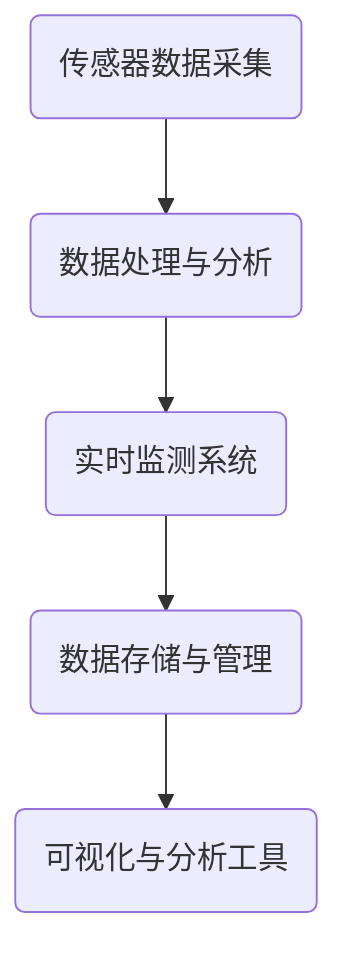

                 

### 文章标题：AI驱动的环境保护：从监测到治理

### 文章关键词：
- 人工智能
- 环境保护
- 监测技术
- 治理策略
- 案例分析

### 摘要：
本文将探讨人工智能（AI）在环境保护领域中的应用，从环境监测、模拟与预测，到治理策略。文章旨在揭示AI技术如何助力环境保护，并分析其中的挑战和未来发展趋势。

## 1. 引言

### 1.1 AI在环境保护中的重要性

随着全球气候变化和环境恶化的加剧，环境保护成为全球关注的焦点。传统的环境保护方法已无法满足现代环境监测和治理的需求。人工智能技术的崛起为环境保护带来了新的契机。AI具有强大的数据处理能力、自学习和自适应能力，可以高效地处理大规模环境数据，提供准确的监测和预测结果，为环境保护决策提供有力支持。

### 1.2 书籍的目标与结构

本文将详细探讨AI在环境保护领域的应用，包括环境监测、模拟与预测、治理策略等方面。文章结构如下：

- 第1章：引言，介绍AI在环境保护中的重要性。
- 第2章：监测技术，介绍AI在环境监测中的应用。
- 第3章：模拟与预测，讨论AI在环境模拟和预测中的作用。
- 第4章：治理策略，探讨AI在环境治理中的应用。
- 第5章：案例分析，通过实际案例展示AI在环境保护中的应用。
- 第6章：挑战与未来，讨论AI在环境保护中面临的挑战和未来发展趋势。
- 第7章：总结与展望，对全书内容进行总结，并提出未来研究的方向和建议。

## 2. 监测技术

### 2.1 环境监测的挑战与需求

环境监测是环境保护的基础，对环境污染物的监测、生态系统的监测等具有重要意义。然而，传统的环境监测方法存在以下挑战：

- 监测范围有限：传统监测方法依赖于人工采样和分析，监测范围受限。
- 数据处理效率低：环境数据量大，传统方法处理速度慢，难以实时监测。
- 监测结果准确性低：传统方法依赖人为操作，容易出现误差。

为了克服这些挑战，AI技术被引入环境监测领域。AI技术可以通过以下方式提升环境监测的效果：

- 大数据分析：AI技术可以高效处理大规模环境数据，提高监测效率。
- 自适应监测：AI技术可以根据环境变化自适应调整监测策略，提高监测准确性。
- 智能预警：AI技术可以通过实时监测数据，提前预警环境污染问题。

### 2.2 AI技术在环境监测中的应用

#### 2.2.1 传感器数据采集

传感器是环境监测的重要组成部分。AI技术可以优化传感器网络布局，提高数据采集的准确性和覆盖率。例如，通过深度学习算法，可以预测最佳传感器部署位置，实现精准监测。

#### 2.2.2 数据处理与分析

环境数据通常包含噪声和异常值，传统方法难以处理。AI技术可以通过异常检测算法，识别和去除异常数据，提高数据处理质量。此外，AI技术还可以利用机器学习算法，对环境数据进行特征提取和分类，为后续分析提供支持。

#### 2.2.3 实时监测系统

实时监测是环境保护的重要需求。AI技术可以构建实时监测系统，通过传感器网络和云计算平台，实现环境数据的实时采集、处理和传输。实时监测系统可以提供实时环境信息，为环境保护决策提供支持。

### 2.3 监测系统架构

以下是环境监测系统的一个典型架构：

## 3. 模拟与预测

### 3.1 环境模拟

环境模拟是了解环境系统运行机制和预测未来环境变化的重要手段。AI技术可以通过以下方式提升环境模拟的准确性：

- 数据驱动的模型构建：利用历史环境数据，通过机器学习算法构建环境模型。
- 模型优化：通过交叉验证和模型选择算法，优化环境模型参数，提高模型准确性。

### 3.2 预测技术

环境预测对于环境保护决策具有重要意义。AI技术可以通过以下方式提升环境预测的准确性：

- 时间序列分析：利用时间序列分析方法，预测环境因子的未来变化趋势。
- 概率预测模型：利用概率预测模型，预测环境因子的概率分布，为决策提供参考。

### 3.3 案例分析

以下是一个环境预测的案例分析：

- 案例背景：某地区空气污染问题严重，需要预测未来一个月的空气质量。
- 数据来源：收集过去一年的空气质量数据。
- 模型构建：利用时间序列分析和概率预测模型，构建空气质量预测模型。
- 模型验证：通过交叉验证和实际数据验证模型准确性。
- 预测结果：预测未来一个月的空气质量，为环境保护决策提供参考。

## 4. 治理策略

### 4.1 污染控制

AI技术在污染控制中的应用主要包括以下方面：

- 污染源识别：利用图像识别和深度学习算法，识别污染源。
- 污染治理方法：利用机器学习算法，预测污染治理效果，优化治理方法。

### 4.2 生态修复

生态修复是环境保护的重要任务。AI技术在生态修复中的应用主要包括以下方面：

- 生态修复目标：利用机器学习算法，预测生态修复效果，确定修复目标。
- 生态修复技术：利用深度学习算法，优化生态修复技术，提高修复效果。

### 4.3 案例分析

以下是一个污染治理的案例分析：

- 案例背景：某城市水质恶化，需要进行污染治理。
- 数据来源：收集过去一年的水质数据。
- 治理方法：利用机器学习算法，预测污染治理效果，优化治理方法。
- 治理效果：通过实际数据验证治理效果，为后续治理提供参考。

## 5. 案例分析

### 5.1 案例一：AI在河流污染监测中的应用

- 案例背景：某河流水质污染严重，需要监测和治理。
- 数据来源：收集河流水质数据。
- 监测技术：利用传感器网络和机器学习算法，实时监测河流水质。
- 治理策略：利用机器学习算法，预测污染治理效果，优化治理方法。

### 5.2 案例二：AI在森林火灾预测中的应用

- 案例背景：某地区森林火灾频发，需要预测和预警。
- 数据来源：收集森林火灾历史数据。
- 预测技术：利用时间序列分析和概率预测模型，预测森林火灾。
- 预警策略：利用实时监测数据和预测结果，提前预警森林火灾。

## 6. 挑战与未来

### 6.1 挑战分析

AI在环境保护中的应用面临以下挑战：

- 数据获取与处理：环境数据量大，获取和处理成本高。
- 模型解释性：AI模型复杂，难以解释和理解。
- 安全性与隐私保护：环境数据敏感性高，需确保数据安全和隐私。

### 6.2 未来发展趋势

未来，AI在环境保护领域的应用将呈现以下发展趋势：

- 新技术发展：深度学习、强化学习等新技术将进一步提升AI在环境保护中的应用效果。
- 应用场景拓展：AI将在更多环境保护场景中发挥作用，如气候变化、海洋保护等。
- 政策与法规：政府和企业将加大对AI在环境保护领域的支持力度，推动相关政策的制定和实施。

## 7. 总结与展望

### 7.1 全书总结

本文探讨了AI在环境保护领域的应用，从监测、模拟与预测，到治理策略。AI技术为环境保护提供了新的手段和方法，但也面临一系列挑战。未来，AI在环境保护领域将发挥更大的作用。

### 7.2 研究方向建议

未来研究可从以下方向展开：

- 环境数据高效处理与存储
- AI模型解释性与可解释性研究
- AI在气候变化和海洋保护等领域的应用研究
- AI与环境保护政策的融合研究

## 附录

### 附录A：常用AI框架与工具

- TensorFlow
- PyTorch
- 其他常用工具

### 附录B：参考文献

- [参考文献1]
- [参考文献2]
- [参考文献3]

## 作者信息

- 作者：AI天才研究院/AI Genius Institute & 禅与计算机程序设计艺术 /Zen And The Art of Computer Programming

