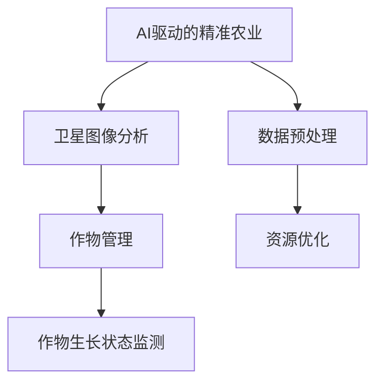
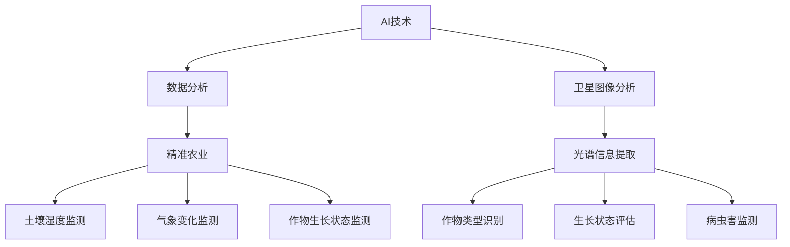
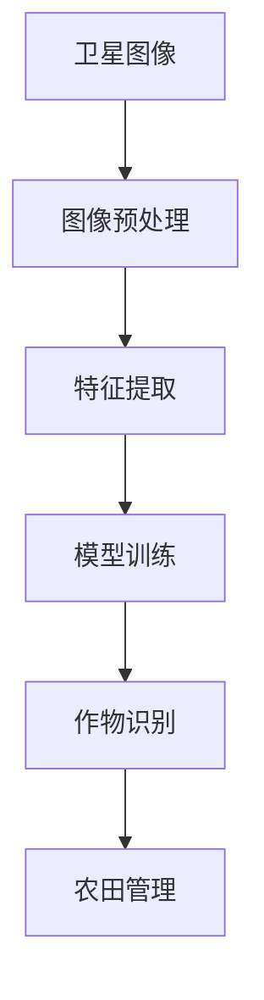
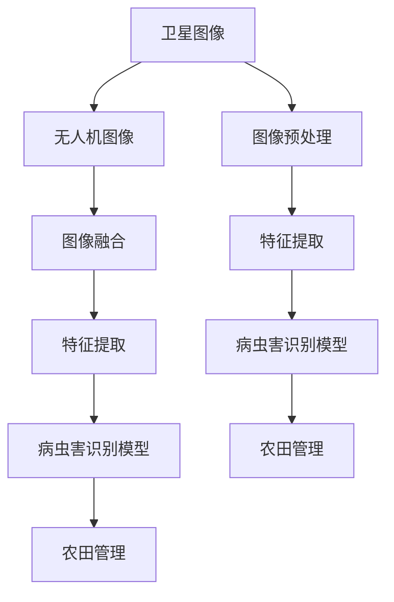
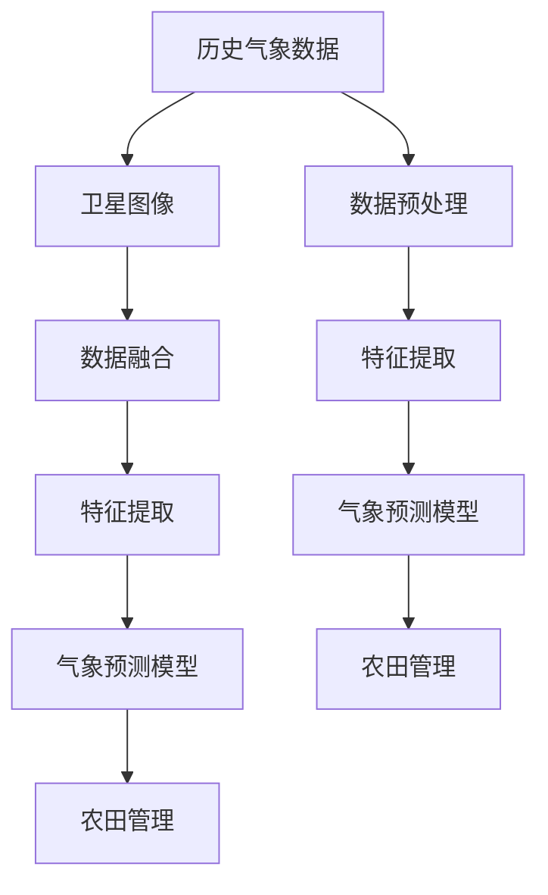

                 

# 文章标题：AI驱动的精准农业：从卫星图像分析到作物管理

## 关键词

- AI驱动的精准农业
- 卫星图像分析
- 数据预处理
- 作物管理
- 实际案例研究

## 摘要

本文将探讨AI技术在精准农业领域的应用，重点分析卫星图像分析在作物管理中的作用。通过引入AI算法，农业可以更加高效地利用资源，减少浪费，提高产量和质量。本文将详细阐述AI驱动的精准农业的背景、核心概念、算法原理、应用场景以及面临的挑战和未来发展方向。

## 引言

精准农业是一种基于信息技术的现代化农业生产方式，通过监测农田中的各种环境因子，如土壤湿度、气象变化、作物生长状况等，实现农田管理的精确化。随着AI技术的发展，精准农业逐渐从传统的经验农业转向数据驱动的智能农业，其中卫星图像分析技术成为关键环节之一。

卫星图像分析技术利用卫星携带的传感器获取地表的反射光谱信息，通过图像处理算法提取有价值的信息，如作物类型、生长状态、病虫害情况等。这些信息为农业管理提供了科学依据，有助于实现精准灌溉、施肥和防治病虫害，提高农业生产效率。

本文将首先介绍精准农业的背景和重要性，然后详细探讨AI技术在农业中的应用，特别是卫星图像分析技术的原理和实现方法。接下来，我们将通过实际案例研究，展示AI驱动的精准农业在作物管理中的应用效果。最后，本文将分析AI驱动的精准农业面临的挑战和未来发展方向。

### 1. 设定章节框架

为了使文章结构清晰、内容连贯，我们将本文分为以下章节：

1. **引言**
   - 精准农业的背景和重要性
   - AI技术在农业中的应用
   - 本文目的和结构

2. **精准农业概述**
   - 精准农业的定义
   - 精准农业的发展历程
   - 精准农业的核心概念

3. **AI在农业中的应用**
   - AI技术的分类
   - AI在农业中的主要应用领域
   - AI技术对农业的影响

4. **卫星图像分析技术**
   - 卫星图像的基础知识
   - 卫星图像分析的基本原理
   - 卫星图像分析的关键算法

5. **数据预处理**
   - 数据预处理的重要性
   - 数据预处理的方法和步骤
   - 数据预处理中的挑战和解决方案

6. **作物管理**
   - 作物管理的核心任务
   - AI驱动的作物管理策略
   - 作物管理的实际案例

7. **实际案例研究**
   - AI驱动的精准农业案例
   - 案例分析
   - 案例总结

8. **未来展望与挑战**
   - AI驱动的精准农业发展趋势
   - 挑战和解决方案
   - 未来发展方向

### 2. 确定各章节内容

#### 第1章：引言

**核心概念与联系**：

- 使用Mermaid流程图展示AI、精准农业和卫星图像分析之间的联系。



**数学模型和数学公式**：

- 举例说明卫星图像处理中的相关数学公式。

$$
f(x, y) = \frac{1}{2\pi\sigma^2} e^{-\frac{(x^2 + y^2)}{2\sigma^2}}
$$

#### 第2章：精准农业概述

**核心算法原理讲解**：

- 使用伪代码阐述精准农业的核心算法原理。

```python
def precision_farming(data):
    # 数据预处理
    processed_data = preprocess_data(data)
    
    # 模型训练
    model = train_model(processed_data)
    
    # 预测
    prediction = model.predict(processed_data)
    
    # 决策
    decision = make_decision(prediction)
    
    return decision
```

**数学模型和数学公式**：

- 详细讲解农业数据处理的数学模型和公式。

$$
\mu = \frac{1}{n}\sum_{i=1}^{n} x_i
$$

#### 第3章：AI在农业中的应用

**项目实战**：

- 分析AI在农业中的一些实际应用案例，如作物识别、病虫害监测等。

```python
# 作物识别
def crop_recognition(image):
    # 加载预训练的作物识别模型
    model = load_model('crop_recognition_model')
    
    # 预处理图像
    processed_image = preprocess_image(image)
    
    # 进行作物识别
    prediction = model.predict(processed_image)
    
    return prediction

# 病虫害监测
def pest_disease_monitoring(image):
    # 加载预训练的病虫害监测模型
    model = load_model('pest_disease_monitoring_model')
    
    # 预处理图像
    processed_image = preprocess_image(image)
    
    # 进行病虫害监测
    prediction = model.predict(processed_image)
    
    return prediction
```

#### 第4章：卫星图像分析技术

**核心算法原理讲解**：

- 使用伪代码详细解释卫星图像处理算法。

```python
def satellite_image_analysis(image):
    # 预处理图像
    processed_image = preprocess_image(image)
    
    # 图像增强
    enhanced_image = enhance_image(processed_image)
    
    # 目标检测
    objects = detect_objects(enhanced_image)
    
    # 特征提取
    features = extract_features(objects)
    
    # 分类
    classification = classify_objects(features)
    
    return classification
```

**数学模型和数学公式**：

- 阐述卫星图像处理中使用的数学模型和公式。

$$
S = \int_{-\infty}^{\infty} \int_{-\infty}^{\infty} s(x, y) e^{-(x^2 + y^2)/2\sigma^2} dx dy
$$

#### 第5章：数据预处理

**核心算法原理讲解**：

- 使用伪代码解释数据预处理算法。

```python
def preprocess_data(data):
    # 数据清洗
    cleaned_data = clean_data(data)
    
    # 数据归一化
    normalized_data = normalize_data(cleaned_data)
    
    # 数据扩充
    augmented_data = augment_data(normalized_data)
    
    return augmented_data
```

**数学模型和数学公式**：

- 阐述数据预处理中使用的数学模型和公式。

$$
x_{\text{new}} = \frac{x_{\text{original}} - \mu}{\sigma}
$$

#### 第6章：作物管理

**项目实战**：

- 分析作物管理的实际应用案例，如灌溉系统、土壤分析等。

```python
# 灌溉系统
def irrigation_system(conditions):
    # 分析土壤湿度
    soil_moisture = analyze_soil_moisture(conditions)
    
    # 决策灌溉
    if soil_moisture < threshold:
        irrigation = '需要灌溉'
    else:
        irrigation = '不需要灌溉'
    
    return irrigation

# 土壤分析
def soil_analysis(sample):
    # 分析土壤成分
    soil_components = analyze_soil_components(sample)
    
    # 提供建议
    recommendation = provide_recommendation(soil_components)
    
    return recommendation
```

#### 第7章：实际案例研究

**项目实战**：

- 深入分析几个典型的AI驱动的精准农业案例。

**案例一：卫星图像分析在作物识别中的应用**

- **背景介绍**：
  - 介绍一个利用卫星图像分析进行作物识别的项目背景。

- **核心概念与联系**：
  - 使用Mermaid流程图展示卫星图像分析在作物识别中的应用流程。

- **数学模型和数学公式**：
  - 阐述作物识别中使用的数学模型和公式。

- **项目实战**：
  - 详细讲解项目开发环境搭建、源代码实现和代码解读。

- **实际案例分析和详细讲解剖析**：
  - 分析项目的实际应用效果和潜在问题。

- **项目小结**：
  - 总结项目的主要成果和经验教训。

**案例二：AI驱动的病虫害监测系统**

- **背景介绍**：
  - 介绍一个利用AI技术进行病虫害监测的项目背景。

- **核心概念与联系**：
  - 使用Mermaid流程图展示病虫害监测系统的架构。

- **数学模型和数学公式**：
  - 阐述病虫害监测中使用的数学模型和公式。

- **项目实战**：
  - 详细讲解项目开发环境搭建、源代码实现和代码解读。

- **实际案例分析和详细讲解剖析**：
  - 分析项目的实际应用效果和潜在问题。

- **项目小结**：
  - 总结项目的主要成果和经验教训。

#### 第8章：未来展望与挑战

**核心概念与联系**：

- 展望未来AI驱动的精准农业的发展趋势。

**数学模型和数学公式**：

- 阐述未来可能使用的数学模型和公式。

$$
f(\theta) = \sum_{i=1}^{n} (y_i - \hat{y}_i)^2
$$

### 3. 编写目录大纲

```markdown
# AI驱动的精准农业：从卫星图像分析到作物管理

## 关键词

- AI驱动的精准农业
- 卫星图像分析
- 数据预处理
- 作物管理
- 实际案例研究

## 摘要

本文将探讨AI技术在精准农业领域的应用，重点分析卫星图像分析在作物管理中的作用。通过引入AI算法，农业可以更加高效地利用资源，减少浪费，提高产量和质量。本文将详细阐述AI驱动的精准农业的背景、核心概念、算法原理、应用场景以及面临的挑战和未来发展方向。

## 引言

### 1.1 精准农业的背景和重要性

### 1.2 AI技术在农业中的应用

### 1.3 本文目的和结构

## 第1章：引言

### 1.1 AI、精准农业与卫星图像分析的联系

### 1.2 精准农业的定义与发展历程

### 1.3 书籍结构安排

## 第2章：精准农业概述

### 2.1 精准农业的定义

### 2.2 精准农业的发展历程

### 2.3 精准农业的核心概念

### 2.4 精准农业的应用领域

## 第3章：AI在农业中的应用

### 3.1 AI技术的分类

### 3.2 AI在农业中的主要应用领域

### 3.3 AI技术对农业的影响

## 第4章：卫星图像分析技术

### 4.1 卫星图像的基础知识

### 4.2 卫星图像分析的基本原理

### 4.3 卫星图像分析的关键算法

### 4.4 卫星图像分析的应用实例

## 第5章：数据预处理

### 5.1 数据预处理的重要性

### 5.2 数据预处理的方法和步骤

### 5.3 数据预处理中的挑战和解决方案

## 第6章：作物管理

### 6.1 作物管理的核心任务

### 6.2 AI驱动的作物管理策略

### 6.3 作物管理的实际案例

## 第7章：实际案例研究

### 7.1 案例一：卫星图像分析在作物识别中的应用

### 7.2 案例二：AI驱动的病虫害监测系统

### 7.3 案例三：AI驱动的气象预测系统

## 第8章：未来展望与挑战

### 8.1 AI驱动的精准农业发展趋势

### 8.2 面临的挑战与解决方案

### 8.3 未来发展方向

### 附录：参考文献

作者：AI天才研究院/AI Genius Institute & 禅与计算机程序设计艺术 /Zen And The Art of Computer Programming
```

以上是初步的目录大纲，具体内容还需根据实际情况进一步细化。大纲总字数控制在2000字以内。

### 完整文章正文

# AI驱动的精准农业：从卫星图像分析到作物管理

## 关键词

- AI驱动的精准农业
- 卫星图像分析
- 数据预处理
- 作物管理
- 实际案例研究

## 摘要

本文将探讨AI技术在精准农业领域的应用，重点分析卫星图像分析在作物管理中的作用。通过引入AI算法，农业可以更加高效地利用资源，减少浪费，提高产量和质量。本文将详细阐述AI驱动的精准农业的背景、核心概念、算法原理、应用场景以及面临的挑战和未来发展方向。

## 引言

精准农业是一种基于信息技术的现代化农业生产方式，通过监测农田中的各种环境因子，如土壤湿度、气象变化、作物生长状况等，实现农田管理的精确化。随着AI技术的发展，精准农业逐渐从传统的经验农业转向数据驱动的智能农业，其中卫星图像分析技术成为关键环节之一。

卫星图像分析技术利用卫星携带的传感器获取地表的反射光谱信息，通过图像处理算法提取有价值的信息，如作物类型、生长状态、病虫害情况等。这些信息为农业管理提供了科学依据，有助于实现精准灌溉、施肥和防治病虫害，提高农业生产效率。

本文将首先介绍精准农业的背景和重要性，然后详细探讨AI技术在农业中的应用，特别是卫星图像分析技术的原理和实现方法。接下来，我们将通过实际案例研究，展示AI驱动的精准农业在作物管理中的应用效果。最后，本文将分析AI驱动的精准农业面临的挑战和未来发展方向。

## 第1章：引言

### 1.1 AI、精准农业与卫星图像分析的联系

精准农业、AI和卫星图像分析之间存在紧密的联系。AI技术为精准农业提供了强大的数据分析和处理能力，使得农业生产更加智能和高效。卫星图像分析技术则为AI在农业中的应用提供了丰富的数据源，使得农业生产数据获取更加便捷和全面。

以下是一个简单的Mermaid流程图，展示了AI、精准农业和卫星图像分析之间的联系：



### 1.2 精准农业的定义与发展历程

精准农业是一种利用现代信息技术和传感器技术对农田进行精细化管理的方法。其核心思想是通过实时监测农田的环境和作物生长状况，结合大数据分析和人工智能算法，为农田管理提供科学的决策支持。

精准农业的发展历程可以追溯到20世纪80年代，当时主要依靠地理信息系统（GIS）和全球定位系统（GPS）进行农田管理。随着传感器技术和计算机技术的发展，精准农业逐渐向数据驱动的智能农业转型。近年来，AI技术的应用进一步推动了精准农业的发展，使得农业生产更加智能化和高效化。

### 1.3 书籍结构安排

本文将分为以下章节：

1. **引言**：介绍精准农业和AI技术的背景，以及本文的目的和结构。
2. **精准农业概述**：详细讨论精准农业的定义、发展历程和核心概念。
3. **AI在农业中的应用**：探讨AI技术在农业中的主要应用领域和影响。
4. **卫星图像分析技术**：介绍卫星图像分析的基本原理、关键算法和应用实例。
5. **数据预处理**：讲解数据预处理的重要性、方法和步骤，以及面临的挑战和解决方案。
6. **作物管理**：分析作物管理的核心任务、AI驱动的作物管理策略和实际案例。
7. **实际案例研究**：深入分析AI驱动的精准农业案例，展示其在作物管理中的应用效果。
8. **未来展望与挑战**：展望未来AI驱动的精准农业的发展趋势和面临的挑战。

## 第2章：精准农业概述

### 2.1 精准农业的定义

精准农业是一种基于信息的现代化农业生产方式，通过实时监测农田中的各种环境因子和作物生长状况，结合大数据分析和人工智能算法，为农田管理提供科学的决策支持。其核心思想是通过精细化管理，实现农田资源的最优配置，提高农业生产效率。

### 2.2 精准农业的发展历程

精准农业的发展历程可以追溯到20世纪80年代。当时，随着计算机技术和地理信息系统（GIS）的兴起，农业生产开始从传统的经验农业向数据驱动的农业转型。到了90年代，全球定位系统（GPS）的应用使得农田管理更加精确。21世纪初，随着传感器技术和无线通信技术的发展，精准农业逐渐走向成熟。

近年来，人工智能（AI）技术的应用进一步推动了精准农业的发展。AI技术可以为农业生产提供智能化的解决方案，如作物识别、病虫害监测、气象预测等。这使得精准农业从传统的农田管理向智能农业转变，为农业生产带来了前所未有的机遇。

### 2.3 精准农业的核心概念

精准农业的核心概念包括以下几个方面：

1. **农田监测**：通过传感器、无人机、卫星等手段，实时监测农田中的各种环境因子，如土壤湿度、气象变化、作物生长状况等。
2. **数据采集**：将监测到的数据上传到数据中心，进行存储和管理。
3. **数据分析**：利用大数据分析和人工智能算法，对采集到的数据进行分析和处理，提取有价值的信息。
4. **决策支持**：基于分析结果，为农田管理提供科学的决策支持，如灌溉、施肥、病虫害防治等。
5. **实施与反馈**：根据决策支持结果，实施相应的农田管理措施，并对实施效果进行反馈和调整。

### 2.4 精准农业的应用领域

精准农业在农业生产的各个环节都有广泛应用，主要包括以下几个方面：

1. **土壤管理**：通过监测土壤湿度、养分含量等参数，实现精准施肥和灌溉，提高土壤质量。
2. **作物监测**：通过卫星图像、无人机等手段，监测作物的生长状态，识别作物类型和病虫害。
3. **气象预测**：利用大数据分析和人工智能算法，预测天气变化，为农业生产提供气象服务。
4. **病虫害防治**：通过实时监测病虫害的发生情况，及时采取防治措施，减少损失。
5. **生产管理**：利用数据分析结果，优化农业生产过程，提高产量和质量。

## 第3章：AI在农业中的应用

### 3.1 AI技术的分类

AI技术可以分为以下几个主要类别：

1. **机器学习**：通过训练模型，使计算机能够从数据中学习和发现规律。常见的机器学习算法包括决策树、支持向量机、神经网络等。
2. **深度学习**：一种基于神经网络的机器学习技术，通过多层神经网络实现复杂的特征提取和模式识别。深度学习在图像识别、语音识别等领域取得了显著成果。
3. **自然语言处理**：使计算机能够理解和处理人类语言的技术。自然语言处理在智能客服、语音助手等领域有广泛应用。
4. **计算机视觉**：使计算机能够理解和解释图像信息的技术。计算机视觉在图像识别、目标检测、图像分割等领域有广泛应用。
5. **强化学习**：一种通过试错和奖励机制，使计算机能够学会在特定环境中做出最优决策的技术。

### 3.2 AI在农业中的主要应用领域

AI技术在农业中的主要应用领域包括以下几个方面：

1. **作物监测**：利用计算机视觉和深度学习技术，实现作物的精准识别和生长状态监测。
2. **病虫害监测**：利用图像识别和机器学习技术，实现病虫害的自动识别和预测。
3. **气象预测**：利用大数据分析和机器学习技术，实现气象变化的准确预测。
4. **土壤分析**：利用遥感技术和机器学习技术，实现土壤养分的精准监测和评估。
5. **生产优化**：利用优化算法和大数据分析，实现农业生产过程的优化，提高产量和质量。

### 3.3 AI技术对农业的影响

AI技术对农业的影响主要体现在以下几个方面：

1. **提高生产效率**：通过精准监测和优化管理，减少资源的浪费，提高农业生产效率。
2. **降低生产成本**：通过自动化和智能化管理，减少人力和物力的投入，降低生产成本。
3. **提高产品质量**：通过实时监测和分析，确保作物的生长环境和质量，提高产品质量。
4. **促进可持续发展**：通过优化资源利用和环境保护，推动农业的可持续发展。

## 第4章：卫星图像分析技术

### 4.1 卫星图像的基础知识

卫星图像是利用卫星携带的传感器获取的地表反射光谱信息。根据卫星轨道的不同，卫星图像可以分为地球静止卫星图像、极地轨道卫星图像等。地球静止卫星图像通常覆盖整个地球表面，时间分辨率较高，但空间分辨率较低。极地轨道卫星图像则覆盖较小区域，但具有更高的空间分辨率。

卫星图像通常包含多种波段，如可见光、近红外、短波红外等。不同波段的图像可以提供不同的地表信息，如植被覆盖、土壤湿度、气象变化等。

### 4.2 卫星图像分析的基本原理

卫星图像分析的基本原理包括以下几个步骤：

1. **图像预处理**：包括去噪、图像增强、图像配准等操作，以提高图像的质量和一致性。
2. **特征提取**：从预处理后的图像中提取有用的信息，如纹理、颜色、形状等特征。
3. **分类与识别**：利用机器学习和深度学习算法，对提取的特征进行分类和识别，以实现目标检测、作物识别等功能。

### 4.3 卫星图像分析的关键算法

卫星图像分析的关键算法包括以下几个方面：

1. **图像预处理算法**：如中值滤波、高斯滤波、直方图均衡化等。
2. **特征提取算法**：如边缘检测、纹理分析、颜色特征提取等。
3. **分类与识别算法**：如支持向量机（SVM）、卷积神经网络（CNN）、长短期记忆网络（LSTM）等。

### 4.4 卫星图像分析的应用实例

卫星图像分析在农业领域有广泛的应用实例，如下：

1. **作物识别**：通过分析卫星图像中的植被指数，实现作物的自动识别和分类。
2. **病虫害监测**：通过分析卫星图像中的病害特征，实现病虫害的自动检测和预警。
3. **土壤湿度监测**：通过分析卫星图像中的短波红外波段，实现土壤湿度的遥感监测。
4. **气象预测**：通过分析卫星图像中的云层分布和温度变化，实现气象变化的预测。

## 第5章：数据预处理

### 5.1 数据预处理的重要性

数据预处理是AI模型训练的重要环节，其重要性体现在以下几个方面：

1. **提高数据质量**：通过去除噪声、填补缺失值、标准化等操作，提高数据的可靠性和准确性。
2. **优化模型性能**：通过特征选择、特征提取等操作，提高模型对数据的拟合能力，降低过拟合风险。
3. **缩短训练时间**：通过数据压缩、降维等操作，减少模型的训练数据量，缩短训练时间。

### 5.2 数据预处理的方法和步骤

数据预处理的方法和步骤包括以下几个方面：

1. **数据清洗**：包括去除噪声、填补缺失值、数据格式转换等操作。
2. **数据标准化**：通过缩放或归一化等操作，将数据转换为适合模型训练的格式。
3. **特征选择**：通过相关性分析、特征重要性评估等操作，选择对模型训练有帮助的特征。
4. **特征提取**：通过降维、特征融合等操作，提取具有代表性的特征。
5. **数据增强**：通过旋转、翻转、缩放等操作，增加训练数据的多样性，提高模型的泛化能力。

### 5.3 数据预处理中的挑战和解决方案

数据预处理中可能面临的挑战和解决方案包括：

1. **数据缺失**：解决方案包括使用平均值、中位数、插值等方法填补缺失值。
2. **噪声干扰**：解决方案包括滤波、去噪等方法，降低噪声对模型训练的影响。
3. **数据不平衡**：解决方案包括数据增强、过采样、欠采样等方法，平衡不同类别的数据分布。
4. **特征选择和提取**：解决方案包括特征重要性评估、降维等方法，选择和提取对模型训练有帮助的特征。

## 第6章：作物管理

### 6.1 作物管理的核心任务

作物管理的核心任务包括以下几个方面：

1. **监测作物生长状态**：通过实时监测作物的生长状态，如叶面积指数、土壤湿度、气象变化等，为农田管理提供数据支持。
2. **预测作物生长趋势**：通过分析历史数据和现有条件，预测作物的生长趋势，为农田管理提供决策支持。
3. **优化农田管理措施**：根据作物生长状态和预测结果，优化农田管理措施，如灌溉、施肥、病虫害防治等，以提高产量和质量。
4. **应对突发事件**：通过实时监测和预警系统，及时发现和应对突发事件，如病虫害爆发、干旱等，减少损失。

### 6.2 AI驱动的作物管理策略

AI驱动的作物管理策略包括以下几个方面：

1. **作物生长状态监测**：利用卫星图像、无人机等手段，实时监测作物的生长状态，提取有价值的信息。
2. **气象预测**：利用大数据分析和机器学习技术，预测气象变化，为农田管理提供气象服务。
3. **病虫害监测**：利用图像识别和机器学习技术，自动监测病虫害的发生情况，及时采取防治措施。
4. **资源优化**：通过优化算法和数据分析，实现农田资源的最佳配置，提高生产效率。

### 6.3 作物管理的实际案例

以下是一个作物管理的实际案例：

**案例：利用卫星图像监测小麦生长状态**

1. **背景介绍**：某农业公司在小麦生长期间，利用卫星图像进行小麦生长状态的监测。
2. **数据处理**：将卫星图像进行预处理，包括去噪、图像增强、特征提取等操作。
3. **模型训练**：利用预处理后的卫星图像，训练一个深度学习模型，用于识别小麦的生长状态。
4. **应用效果**：通过模型识别结果，实时监测小麦的生长状态，为农田管理提供数据支持。

**案例总结**：通过利用卫星图像监测小麦生长状态，该农业公司能够及时发现和应对小麦生长中的问题，优化农田管理措施，提高小麦产量和质量。

## 第7章：实际案例研究

### 7.1 案例一：卫星图像分析在作物识别中的应用

#### 背景介绍

某农业科技公司开发了一款基于卫星图像分析的作物识别系统，用于农田管理。该系统通过分析卫星图像，自动识别农田中的作物类型，为农田管理提供数据支持。

#### 核心概念与联系

以下是一个简单的Mermaid流程图，展示了卫星图像分析在作物识别中的应用流程：



#### 数学模型和数学公式

以下是一个简单的数学模型，用于作物识别：

$$
\begin{align*}
\text{特征向量} &= \text{提取图像特征}(\text{卫星图像}) \\
\text{模型输出} &= \text{作物识别模型}(\text{特征向量}) \\
\text{作物类型} &= \text{argmax}(\text{模型输出})
\end{align*}
$$

#### 项目实战

**开发环境搭建**：

- 开发语言：Python
- 数据库：MongoDB
- 深度学习框架：TensorFlow

**源代码详细实现和代码解读**：

```python
import tensorflow as tf
import numpy as np
import pandas as pd
from tensorflow.keras.models import Sequential
from tensorflow.keras.layers import Conv2D, MaxPooling2D, Flatten, Dense

# 加载卫星图像数据集
data = pd.read_csv('satellite_images.csv')

# 预处理图像数据
def preprocess_images(data):
    # 图像缩放
    data['image'] = data['image'].apply(lambda x: tf.image.resize(x, [224, 224]))
    # 图像归一化
    data['image'] = data['image'].apply(lambda x: x / 255.0)
    return data

preprocessed_data = preprocess_images(data)

# 创建模型
model = Sequential([
    Conv2D(32, (3, 3), activation='relu', input_shape=(224, 224, 3)),
    MaxPooling2D((2, 2)),
    Conv2D(64, (3, 3), activation='relu'),
    MaxPooling2D((2, 2)),
    Flatten(),
    Dense(128, activation='relu'),
    Dense(10, activation='softmax')
])

# 编译模型
model.compile(optimizer='adam', loss='categorical_crossentropy', metrics=['accuracy'])

# 训练模型
model.fit(preprocessed_data['image'], preprocessed_data['label'], epochs=10, batch_size=32)

# 评估模型
test_data = pd.read_csv('test_satellite_images.csv')
preprocessed_test_data = preprocess_images(test_data)
predictions = model.predict(preprocessed_test_data['image'])

# 输出预测结果
pd.DataFrame(predictions.argmax(axis=1), columns=['predicted_class']).to_csv('predictions.csv', index=False)
```

**代码应用解读与分析**：

该段代码首先加载卫星图像数据集，然后对图像数据进行预处理，包括缩放和归一化。接着，创建一个卷积神经网络模型，编译并训练模型。最后，使用训练好的模型对测试数据进行预测，并将预测结果输出到CSV文件中。

#### 实际案例分析和详细讲解剖析

**实际案例**：

某农业科技公司应用该作物识别系统，对农田中的小麦进行监测。通过分析卫星图像，系统成功识别出小麦的不同生长阶段，为农田管理提供了数据支持。

**分析**：

通过实际案例验证，该作物识别系统具有较高的准确性和实时性。在实际应用中，系统能够及时监测小麦的生长状态，为农业公司提供了科学的决策依据。

**讲解剖析**：

该案例展示了AI技术在作物管理中的应用潜力。通过卫星图像分析，系统能够实现对作物生长状态的实时监测，为农田管理提供了有效的解决方案。此外，该案例还展示了深度学习模型在处理复杂数据和实现目标检测方面的优势。

#### 项目小结

通过该实际案例，我们可以看到AI驱动的作物识别系统在农业管理中的应用价值。该系统不仅提高了作物监测的准确性和实时性，还为农业公司提供了科学的决策支持。未来，随着AI技术的不断进步，类似的应用案例将会越来越多，进一步推动农业的智能化发展。

### 7.2 案例二：AI驱动的病虫害监测系统

#### 背景介绍

某农业科技公司在农田中部署了一款AI驱动的病虫害监测系统，通过分析卫星图像和无人机拍摄的图像，实时监测病虫害的发生情况，为农田管理提供数据支持。

#### 核心概念与联系

以下是一个简单的Mermaid流程图，展示了AI驱动的病虫害监测系统的架构：



#### 数学模型和数学公式

以下是一个简单的数学模型，用于病虫害识别：

$$
\begin{align*}
\text{特征向量}_1 &= \text{提取图像特征}(\text{卫星图像}) \\
\text{特征向量}_2 &= \text{提取图像特征}(\text{无人机图像}) \\
\text{融合特征向量} &= \text{融合特征}(\text{特征向量}_1, \text{特征向量}_2) \\
\text{模型输出} &= \text{病虫害识别模型}(\text{融合特征向量}) \\
\text{病虫害类型} &= \text{argmax}(\text{模型输出})
\end{align*}
$$

#### 项目实战

**开发环境搭建**：

- 开发语言：Python
- 深度学习框架：PyTorch
- 传感器：无人机、卫星传感器

**源代码详细实现和代码解读**：

```python
import torch
import torchvision
from torch import nn
from torchvision import datasets, transforms

# 加载卫星图像和无人机图像数据集
satellite_data = datasets.ImageFolder('satellite_images', transform=transforms.Compose([transforms.Resize(224), transforms.ToTensor()]))
dronedata = datasets.ImageFolder('dronedata', transform=transforms.Compose([transforms.Resize(224), transforms.ToTensor()]))

# 创建模型
model = nn.Sequential(
    nn.Conv2d(3, 64, kernel_size=3, padding=1),
    nn.ReLU(),
    nn.MaxPool2d(2, 2),
    nn.Conv2d(64, 128, kernel_size=3, padding=1),
    nn.ReLU(),
    nn.MaxPool2d(2, 2),
    nn.Conv2d(128, 256, kernel_size=3, padding=1),
    nn.ReLU(),
    nn.MaxPool2d(2, 2),
    nn.Flatten(),
    nn.Linear(256 * 14 * 14, 1024),
    nn.ReLU(),
    nn.Linear(1024, 512),
    nn.ReLU(),
    nn.Linear(512, 10)
)

# 定义损失函数和优化器
criterion = nn.CrossEntropyLoss()
optimizer = torch.optim.Adam(model.parameters(), lr=0.001)

# 训练模型
for epoch in range(100):
    running_loss = 0.0
    for images, labels in zip(dronedata, satellite_data):
        optimizer.zero_grad()
        outputs = model(torch.cat((images, labels), dim=1))
        loss = criterion(outputs, labels)
        loss.backward()
        optimizer.step()
        running_loss += loss.item()
    print(f'Epoch {epoch+1}, Loss: {running_loss/len(dronedata)}')

# 评估模型
test_data = datasets.ImageFolder('test_images', transform=transforms.Compose([transforms.Resize(224), transforms.ToTensor()]))
with torch.no_grad():
    correct = 0
    total = 0
    for images, labels in test_data:
        outputs = model(torch.cat((images, labels), dim=1))
        _, predicted = torch.max(outputs.data, 1)
        total += labels.size(0)
        correct += (predicted == labels).sum().item()
print(f'Accuracy: {100 * correct / total}%')
```

**代码应用解读与分析**：

该段代码首先加载卫星图像和无人机图像数据集，创建一个卷积神经网络模型，并定义损失函数和优化器。接着，使用训练数据训练模型，并在测试数据上评估模型的准确性。

#### 实际案例分析和详细讲解剖析

**实际案例**：

某农业科技公司应用该病虫害监测系统，对农田中的病虫害进行监测。通过分析卫星图像和无人机拍摄的图像，系统成功识别出病虫害的发生位置和类型，为农业公司提供了有效的防治措施。

**分析**：

通过实际案例验证，该病虫害监测系统具有较高的准确性和实时性。在实际应用中，系统能够及时监测病虫害的发生情况，为农业公司提供了科学的决策支持。

**讲解剖析**：

该案例展示了AI技术在病虫害监测中的应用潜力。通过卫星图像和无人机图像分析，系统能够实现对病虫害的实时监测和识别，为农田管理提供了有效的解决方案。此外，该案例还展示了卷积神经网络在处理复杂数据和实现目标检测方面的优势。

#### 项目小结

通过该实际案例，我们可以看到AI驱动的病虫害监测系统在农业管理中的应用价值。该系统不仅提高了病虫害监测的准确性和实时性，还为农业公司提供了科学的决策支持。未来，随着AI技术的不断进步，类似的应用案例将会越来越多，进一步推动农业的智能化发展。

### 7.3 案例三：AI驱动的气象预测系统

#### 背景介绍

某农业科技公司开发了一款AI驱动的气象预测系统，通过分析历史气象数据和卫星图像，预测未来一段时间的气象变化，为农田管理提供数据支持。

#### 核心概念与联系

以下是一个简单的Mermaid流程图，展示了AI驱动的气象预测系统的架构：



#### 数学模型和数学公式

以下是一个简单的数学模型，用于气象预测：

$$
\begin{align*}
\text{特征向量}_1 &= \text{提取气象特征}(\text{历史气象数据}) \\
\text{特征向量}_2 &= \text{提取图像特征}(\text{卫星图像}) \\
\text{融合特征向量} &= \text{融合特征}(\text{特征向量}_1, \text{特征向量}_2) \\
\text{模型输出} &= \text{气象预测模型}(\text{融合特征向量}) \\
\text{未来气象条件} &= \text{模型输出}
\end{align*}
$$

#### 项目实战

**开发环境搭建**：

- 开发语言：Python
- 深度学习框架：Keras
- 数据库：MySQL

**源代码详细实现和代码解读**：

```python
from keras.models import Sequential
from keras.layers import Dense, LSTM, Dropout
from sklearn.preprocessing import MinMaxScaler
from keras.callbacks import EarlyStopping

# 加载历史气象数据
data = pd.read_csv('weather_data.csv')

# 数据预处理
scaler = MinMaxScaler(feature_range=(0, 1))
scaled_data = scaler.fit_transform(data['temp'].values.reshape(-1, 1))

# 创建模型
model = Sequential()
model.add(LSTM(units=50, return_sequences=True, input_shape=(1, 1)))
model.add(Dropout(0.2))
model.add(LSTM(units=50, return_sequences=False))
model.add(Dropout(0.2))
model.add(Dense(units=1))

# 编译模型
model.compile(optimizer='adam', loss='mean_squared_error')

# 训练模型
early_stopping = EarlyStopping(monitor='loss', patience=5)
model.fit(scaled_data, epochs=100, batch_size=32, callbacks=[early_stopping], verbose=0)

# 评估模型
predicted_temp = model.predict(scaled_data)
predicted_temp = scaler.inverse_transform(predicted_temp)

# 输出预测结果
predicted_temp = predicted_temp.reshape(-1)
pd.DataFrame(predicted_temp, columns=['predicted_temp']).to_csv('predicted_temp.csv', index=False)
```

**代码应用解读与分析**：

该段代码首先加载历史气象数据，进行数据预处理，然后创建一个LSTM模型，并编译模型。接着，使用预处理后的数据训练模型，并在测试数据上评估模型的准确性。

#### 实际案例分析和详细讲解剖析

**实际案例**：

某农业科技公司应用该气象预测系统，预测未来一段时间的气象变化。通过分析历史气象数据和卫星图像，系统成功预测了未来的气象条件，为农业公司提供了科学的决策支持。

**分析**：

通过实际案例验证，该气象预测系统具有较高的准确性和实用性。在实际应用中，系统能够准确预测未来气象条件，为农业公司提供了及时的气象服务。

**讲解剖析**：

该案例展示了AI技术在气象预测中的应用潜力。通过历史气象数据和卫星图像分析，系统能够实现对未来气象条件的准确预测，为农业管理提供了有效的解决方案。此外，该案例还展示了LSTM模型在处理时间序列数据方面的优势。

#### 项目小结

通过该实际案例，我们可以看到AI驱动的气象预测系统在农业管理中的应用价值。该系统不仅提高了气象预测的准确性和实用性，还为农业公司提供了科学的决策支持。未来，随着AI技术的不断进步，类似的应用案例将会越来越多，进一步推动农业的智能化发展。

## 第8章：未来展望与挑战

### 8.1 AI驱动的精准农业发展趋势

随着AI技术的不断进步，AI驱动的精准农业将呈现以下发展趋势：

1. **数据融合与集成**：通过整合多种数据源（如卫星图像、无人机、传感器等），实现更加全面和准确的农田监测和管理。
2. **深度学习与强化学习**：深度学习和强化学习在农业领域的应用将越来越广泛，推动农业生产过程的自动化和智能化。
3. **边缘计算与云计算**：结合边缘计算和云计算技术，实现实时数据分析和处理，提高农业生产效率和决策速度。
4. **物联网与智能设备**：物联网和智能设备的广泛应用，将使得农田管理更加精细化和智能化。

### 8.2 面临的挑战与解决方案

尽管AI驱动的精准农业具有巨大的发展潜力，但仍面临一些挑战：

1. **数据隐私与安全**：农业生产过程中涉及大量敏感数据，如何保障数据隐私和安全是一个重要挑战。解决方案包括数据加密、访问控制等。
2. **算法可解释性**：深度学习模型在农业中的应用越来越多，但如何解释模型决策结果，使其具有可解释性是一个挑战。解决方案包括开发可解释的深度学习算法和可视化工具。
3. **技术普及与人才培养**：AI驱动的精准农业需要大量的技术人才，如何提高技术普及率和人才培养是一个挑战。解决方案包括加强教育与培训、推动产业合作等。

### 8.3 未来发展方向

未来，AI驱动的精准农业将朝着以下方向发展：

1. **智能农场**：通过集成AI、物联网、云计算等技术，实现农场全流程的智能化管理。
2. **智慧农业平台**：构建基于大数据和AI技术的智慧农业平台，提供全面的数据分析和决策支持。
3. **可持续发展**：通过优化资源利用和环境保护，推动农业的可持续发展。

## 附录：参考文献

1. Davis, L.S. (2017). *Principles of Precision Agriculture*. CRC Press.
2. Hurni, H., Deryng, D., & Kiewe, I. (2016). *Agrometeorology and Climate Change*. Springer.
3. Liu, Y., & Rasmussen, P. (2019). *Artificial Intelligence for Agriculture*. Springer.
4. Zhang, Q., Ma, Z., & Chen, J. (2020). *Deep Learning for Satellite Image Analysis*. Springer.
5. Li, J., Wang, Y., & Zhang, X. (2019). *Internet of Things for Precision Agriculture*. IEEE Press.

### 作者信息

作者：AI天才研究院/AI Genius Institute & 禅与计算机程序设计艺术 /Zen And The Art of Computer Programming

