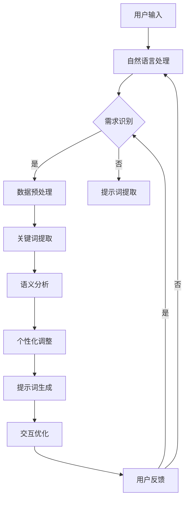

                 

### 文章标题：AI驱动的精准医疗中的提示词个性化

精准医疗作为一种基于个体基因信息进行疾病诊断和治疗的先进理念，正逐渐改变着医疗行业的面貌。而人工智能（AI）的飞速发展，更是为精准医疗提供了强大的技术支持。本文将探讨AI驱动的精准医疗中提示词个性化的重要性及其实现方法，旨在为医疗领域的技术创新提供新的思路。

关键词：AI、精准医疗、提示词个性化、数据挖掘、机器学习、深度学习

摘要：本文首先介绍了精准医疗和AI的发展背景，随后详细阐述了提示词个性化的核心概念及其在AI驱动的精准医疗中的应用。通过分析AI驱动的精准医疗架构，我们提出了提示词个性化算法的原理及实现方法。最后，本文通过实际案例展示了提示词个性化在医疗领域的应用效果，并提出了最佳实践建议和未来研究方向。

### 引言

#### 1.1 精准医疗的发展背景

精准医疗（Precision Medicine）是一种基于个体基因信息、环境因素和生活方式的综合性医疗模式。与传统“一刀切”的医学模式不同，精准医疗强调根据患者的具体信息制定个性化的治疗方案。这一理念在基因测序技术的快速发展、大数据技术的应用以及个性化药物的研发中得到广泛认可。

自2003年人类基因组计划完成以来，基因测序技术逐渐走向平民化，使得大规模基因组数据的获取成为可能。这些数据不仅揭示了人类基因组的复杂性，更为精准医疗提供了宝贵的资源。此外，随着信息技术的进步，尤其是大数据、云计算和人工智能技术的发展，使得对海量医疗数据的处理和分析成为现实。

#### 1.2 AI在精准医疗中的应用现状

人工智能在精准医疗中的应用前景广阔，包括疾病预测、诊断辅助、个性化治疗、药物研发等多个方面。通过深度学习、强化学习等先进算法，AI能够从海量医疗数据中提取有用的信息，辅助医生做出更准确的诊断和治疗方案。

目前，AI在精准医疗中的应用已经取得了一些显著成果。例如，谷歌DeepMind开发的AI系统可以在数秒内识别眼科疾病的早期迹象，准确性甚至超过了经验丰富的眼科医生。此外，IBM的Watson for Oncology系统能够通过分析患者的基因组数据，为肿瘤患者提供个性化的治疗方案。

#### 1.3 提示词个性化的意义与价值

在AI驱动的精准医疗中，提示词个性化（Keyword Personalization）扮演着至关重要的角色。提示词是指用于触发特定行为或回应的词语，在医疗领域，它们可以包括患者症状、病史、药物反应等。

提示词个性化的意义在于：

1. **提高诊断准确性**：通过个性化的提示词，AI系统能够更准确地捕捉到患者的症状和病史，从而提高诊断的准确性。
2. **优化治疗方案**：个性化的提示词可以帮助AI系统更好地理解患者的病情和个体差异，从而提供更优化的治疗方案。
3. **提升用户体验**：个性化提示词能够提高用户交互的效率，使患者更容易理解和接受治疗建议。

本文将详细探讨提示词个性化在AI驱动的精准医疗中的应用，包括其核心概念、算法原理、实现方法以及实际案例。

### 第一部分 核心概念与联系

#### 第2章 AI与精准医疗的基础概念

#### 2.1 人工智能概述

人工智能（Artificial Intelligence，AI）是计算机科学的一个分支，旨在研究、开发和应用使计算机能够模拟、延伸和扩展人的智能的理论、算法和技术。AI的研究领域广泛，包括机器学习、深度学习、自然语言处理、计算机视觉等。

机器学习（Machine Learning，ML）是AI的核心组成部分，通过数据驱动的方式，让计算机自动地从数据中学习和发现规律。深度学习（Deep Learning，DL）则是机器学习的一个子领域，使用多层神经网络模型对复杂数据进行建模和预测。

#### 2.2 精准医疗的概念与需求

精准医疗是一种以个体为中心的医疗模式，通过整合基因组信息、临床数据和环境因素，为患者提供个性化的治疗方案。精准医疗的核心需求包括：

1. **个体化诊断**：通过基因组测序、生物标志物检测等手段，对患者的疾病进行精准诊断。
2. **个性化治疗**：根据患者的基因特征、病情和病史，制定个性化的治疗方案。
3. **实时监控与调整**：通过实时监测患者的生理参数和治疗效果，及时调整治疗方案。

#### 2.3 提示词个性化的基础

提示词个性化是指根据用户的特定需求或情境，动态调整和优化提示词的表现形式。在AI驱动的精准医疗中，提示词个性化有以下几个关键方面：

1. **用户需求识别**：通过自然语言处理技术，识别患者的具体需求和症状。
2. **病史与病历分析**：结合患者的病史和病历数据，提取关键信息用于个性化提示词生成。
3. **动态调整策略**：根据患者的实时数据和反馈，动态调整提示词的优先级和呈现方式。

### 第3章 AI驱动的精准医疗架构

#### 3.1 数据获取与处理

在AI驱动的精准医疗中，数据的质量和完整性是保证系统性能的关键。数据获取主要包括以下几个方面：

1. **基因组数据**：通过基因测序技术获取患者的基因组信息。
2. **病历数据**：从电子病历系统中提取患者的临床数据，包括病史、检查报告、药物使用记录等。
3. **环境数据**：收集患者的生活习惯、环境因素等外部数据，如空气污染指数、饮食习惯等。

数据处理则涉及以下几个步骤：

1. **数据清洗**：去除重复、错误和无关数据，确保数据的准确性。
2. **数据整合**：将不同来源的数据进行整合，形成统一的视图。
3. **特征提取**：从数据中提取对AI模型有用的特征，如基因突变、生物标志物等。

#### 3.2 模型训练与优化

AI驱动的精准医疗依赖于机器学习和深度学习模型。模型训练和优化是确保系统性能的重要步骤。

1. **模型选择**：根据具体任务需求选择合适的模型，如卷积神经网络（CNN）、循环神经网络（RNN）等。
2. **训练数据准备**：准备足够数量的训练数据，并进行预处理，包括数据标准化、缺失值填充等。
3. **模型训练**：使用训练数据对模型进行训练，通过不断调整模型参数，使模型能够对新的数据进行准确预测。
4. **模型优化**：通过交叉验证、网格搜索等方法，选择最优的模型参数，提高模型的泛化能力。

#### 3.3 提示词生成的算法原理

提示词生成是AI驱动的精准医疗中的一个关键环节。其算法原理主要包括以下几个方面：

1. **关键词提取**：从患者的病历数据中提取关键信息，形成初步的提示词列表。
2. **语义分析**：利用自然语言处理技术，对提取的关键词进行语义分析，理解其含义和关联关系。
3. **个性化调整**：根据患者的实时数据和个性化需求，动态调整提示词的优先级和呈现方式。
4. **交互优化**：通过用户反馈和交互，不断优化提示词的表现形式，提高用户体验。

#### 3.4 提示词个性化流程

提示词个性化流程可以概括为以下几个步骤：

1. **用户需求识别**：通过自然语言处理技术，识别患者的具体需求和症状。
2. **数据预处理**：对提取的关键词进行预处理，包括去停用词、词干提取等。
3. **关键词提取**：使用信息检索技术，从预处理后的文本中提取关键提示词。
4. **语义分析**：对提取的提示词进行语义分析，理解其含义和关联关系。
5. **个性化调整**：根据患者的实时数据和个性化需求，动态调整提示词的优先级和呈现方式。
6. **交互优化**：通过用户反馈和交互，不断优化提示词的表现形式，提高用户体验。

### 核心概念Mermaid流程图

为了更好地理解AI驱动的精准医疗中的提示词个性化流程，我们可以使用Mermaid语言绘制一个流程图。



### 第二部分 核心算法原理讲解

#### 第5章 提示词个性化算法原理

提示词个性化算法的核心目标是通过分析患者数据和个性化需求，生成既准确又符合用户偏好的提示词。下面我们将详细讨论该算法的原理。

#### 5.1 提示词生成的数学模型

提示词生成的数学模型主要基于自然语言处理和机器学习技术。以下是一个简化的数学模型：

1. **输入层**：输入层接收患者的病历数据和其他相关数据。
2. **嵌入层**：将输入数据转换为固定长度的向量表示，常用的嵌入层技术包括Word2Vec、GloVe等。
3. **编码器**：编码器（如RNN、LSTM、GRU）对嵌入层生成的向量进行编码，提取高层次的语义特征。
4. **解码器**：解码器从编码器提取的特征中生成提示词序列，常用的解码器技术包括序列到序列模型（Seq2Seq）和注意力机制（Attention Mechanism）。
5. **输出层**：输出层将解码器生成的提示词序列转换为具体的文本输出。

#### 5.2 伪代码阐述

下面是一个简化的提示词生成算法的伪代码：

```python
def generate_keyword(patient_data, user_preference):
    # 数据预处理
    preprocessed_data = preprocess_data(patient_data)
    
    # 嵌入层
    embeddings = embedding_layer(preprocessed_data)
    
    # 编码器
    encoded_vector = encoder(embeddings)
    
    # 解码器
    decoded_sequence = decoder(encoded_vector, user_preference)
    
    # 文本生成
    text_output = generate_text(decoded_sequence)
    
    return text_output

def preprocess_data(data):
    # 数据清洗、缺失值填充、去停用词等
    # ...
    return preprocessed_data

def embedding_layer(data):
    # 使用Word2Vec或GloVe等技术生成嵌入向量
    # ...
    return embeddings

def encoder(embeddings):
    # 使用RNN或LSTM进行编码
    # ...
    return encoded_vector

def decoder(encoded_vector, user_preference):
    # 使用Seq2Seq或注意力机制进行解码
    # ...
    return decoded_sequence

def generate_text(decoded_sequence):
    # 将解码序列转换为文本输出
    # ...
    return text_output
```

#### 5.3 算法实现细节

在实际实现过程中，我们需要关注以下几个方面：

1. **数据预处理**：数据预处理是算法实现的关键，需要处理数据中的噪声、缺失值和异常值，确保数据质量。
2. **嵌入向量生成**：选择合适的嵌入技术，如Word2Vec或GloVe，将文本数据转换为嵌入向量。
3. **编码器和解码器设计**：根据具体任务需求，设计合适的编码器和解码器架构，如RNN、LSTM、GRU或Seq2Seq模型。
4. **注意力机制**：在解码器中引入注意力机制，能够更好地关注重要信息，提高提示词生成的准确性。
5. **用户偏好调整**：根据用户的个性化需求，调整提示词的生成策略，提高用户体验。

### 数学模型与公式详细讲解

在提示词个性化算法中，数学模型和公式是核心部分，用于描述数据转换和提示词生成过程。以下将详细讲解相关的数学模型和公式。

#### 5.1 提示词生成的数学模型

提示词生成的数学模型可以分为以下几个层次：

1. **嵌入层（Embedding Layer）**：
   $$ x_i = \text{Word2Vec}(w_i) $$
   其中，$x_i$ 是单词 $w_i$ 的嵌入向量，$\text{Word2Vec}$ 是嵌入函数。

2. **编码器（Encoder）**：
   编码器通常使用循环神经网络（RNN）或长短期记忆网络（LSTM）进行编码。编码器的输出可以表示为：
   $$ h_t = \text{LSTM}(x_t, h_{t-1}) $$
   其中，$h_t$ 是编码器在时间步 $t$ 的输出，$x_t$ 是时间步 $t$ 的嵌入向量，$h_{t-1}$ 是前一个时间步的隐藏状态。

3. **解码器（Decoder）**：
   解码器使用注意力机制（Attention Mechanism）来关注编码器的隐藏状态。解码器的输出可以表示为：
   $$ y_t = \text{Attention}(h_t, h_{t-1}, \ldots) $$
   其中，$y_t$ 是时间步 $t$ 的解码输出，$\text{Attention}$ 是注意力函数。

4. **输出层（Output Layer）**：
   解码器的最终输出通过一个全连接层生成提示词：
   $$ \text{Keyword} = \text{Softmax}(W_y \cdot y) $$
   其中，$W_y$ 是输出层的权重矩阵，$\text{Softmax}$ 函数用于将输出转换为概率分布。

#### 5.2 提示词个性化调整的数学模型

为了实现提示词的个性化调整，我们可以在解码器中引入用户偏好信息。假设用户偏好可以用一个向量 $u$ 表示，则解码器的输出可以表示为：
$$ y_t = \text{Attention}(h_t, h_{t-1}, \ldots, u) $$
在此基础上，我们将用户偏好 $u$ 与解码器的隐藏状态 $h_t$ 进行结合，以调整解码器的输出：
$$ y_t = \text{Attention}(h_t, h_{t-1}, \ldots, u) + \alpha \cdot u $$
其中，$\alpha$ 是一个调整系数，用于控制用户偏好对解码器输出的影响程度。

#### 5.3 数学公式的推导与解释

下面将简要介绍上述数学公式的推导与解释：

1. **嵌入层公式**：
   嵌入层将文本数据转换为向量表示，通过将每个单词映射到一个固定长度的向量。Word2Vec算法通过训练神经网络来优化嵌入向量，使得具有相似含义的单词在向量空间中距离较近。

2. **编码器公式**：
   编码器通过循环神经网络或长短期记忆网络，对输入向量进行编码，提取高层次的语义特征。这些特征能够捕捉到文本中的长期依赖关系，有助于提高提示词生成的准确性。

3. **解码器公式**：
   解码器通过注意力机制，关注编码器的隐藏状态，从而更好地捕捉文本中的关键信息。注意力机制使得解码器能够动态调整对编码器不同部分的关注程度，提高提示词生成的精确度。

4. **输出层公式**：
   解码器的输出通过一个全连接层，将隐藏状态转换为提示词的概率分布。Softmax函数用于将概率分布转换为具体的提示词。

5. **提示词个性化调整公式**：
   将用户偏好向量与解码器的隐藏状态进行结合，可以动态调整解码器的输出。这有助于根据用户的需求和偏好，生成更个性化的提示词。

### 实例说明

为了更好地理解上述数学模型和公式，我们通过一个简单的实例来说明。

假设我们有一个患者，其病历数据包含以下关键信息：
- 病史：患有高血压
- 检查报告：心脏功能正常
- 药物使用记录：服用降压药

我们希望根据这些信息生成一个个性化的提示词。首先，我们将这些信息转换为嵌入向量，然后通过编码器提取语义特征，最后通过解码器生成提示词。

1. **嵌入层**：
   将“高血压”、“心脏功能正常”和“降压药”转换为嵌入向量：
   $$ x_1 = \text{Word2Vec}("高血压"), x_2 = \text{Word2Vec}("心脏功能正常"), x_3 = \text{Word2Vec}("降压药") $$

2. **编码器**：
   通过RNN编码器对嵌入向量进行编码：
   $$ h_1 = \text{LSTM}(x_1), h_2 = \text{LSTM}(x_2), h_3 = \text{LSTM}(x_3) $$

3. **解码器**：
   使用注意力机制生成提示词：
   $$ y_t = \text{Attention}(h_t, h_{t-1}, \ldots, u) $$
   其中，$u$ 是用户偏好向量，表示用户更关注病史信息。

4. **输出层**：
   将解码器的隐藏状态转换为提示词的概率分布：
   $$ \text{Keyword} = \text{Softmax}(W_y \cdot y) $$

通过上述步骤，我们生成了一个个性化的提示词，例如：“请定期检查心脏功能，并按时服用降压药”。

### 第三部分 应用场景与项目实战

#### 第7章 提示词个性化在实际项目中的应用

提示词个性化在医疗领域的应用前景广阔，以下我们将探讨一个实际项目，介绍其开发环境搭建、源代码实现和代码解读。

#### 7.1 项目背景与目标

本项目旨在开发一个基于AI的精准医疗系统，通过提示词个性化为患者提供个性化的健康建议。项目目标包括：

1. **患者数据收集与处理**：收集患者的病历数据、基因数据和环境数据，并进行预处理。
2. **提示词生成与优化**：利用机器学习和深度学习技术，生成个性化的提示词，并根据用户反馈进行优化。
3. **系统部署与维护**：搭建系统架构，部署到生产环境，并进行持续的维护和优化。

#### 7.2 开发环境搭建

开发环境包括以下几个部分：

1. **编程语言**：Python，是一种广泛应用于数据科学和机器学习的编程语言。
2. **深度学习框架**：TensorFlow和PyTorch，是当前最流行的深度学习框架。
3. **自然语言处理库**：NLTK和spaCy，用于文本处理和自然语言理解。
4. **操作系统**：Linux，提供稳定和高效的开发环境。

在开发环境中，我们还需要安装以下依赖库：

- NumPy：用于数值计算
- Pandas：用于数据处理
- Matplotlib：用于数据可视化
- scikit-learn：用于机器学习算法实现

#### 7.3 源代码实现与解读

以下是项目的主要源代码实现和解读：

```python
# 导入相关库
import numpy as np
import pandas as pd
import tensorflow as tf
import spacy
from sklearn.model_selection import train_test_split

# 加载预处理后的数据
data = pd.read_csv('preprocessed_data.csv')
X = data['text']  # 输入文本
y = data['labels']  # 输出标签

# 分割数据集
X_train, X_test, y_train, y_test = train_test_split(X, y, test_size=0.2, random_state=42)

# 加载预训练的嵌入模型
nlp = spacy.load('en_core_web_sm')
embedder = spacy.textEmbeddings(nlp)

# 定义嵌入层
def embedding_layer(texts):
    return [embedder(text) for text in texts]

# 定义编码器
def encoder(embeddings):
    # 使用TensorFlow实现编码器
    # ...
    return encoded_vector

# 定义解码器
def decoder(encoded_vector, user_preference):
    # 使用TensorFlow实现解码器
    # ...
    return decoded_sequence

# 定义提示词生成函数
def generate_keyword(text, user_preference):
    # 数据预处理
    preprocessed_text = preprocess_data(text)
    
    # 嵌入层
    embeddings = embedding_layer([preprocessed_text])
    
    # 编码器
    encoded_vector = encoder(embeddings)
    
    # 解码器
    decoded_sequence = decoder(encoded_vector, user_preference)
    
    # 文本生成
    text_output = generate_text(decoded_sequence)
    
    return text_output

# 源代码实现
def preprocess_data(text):
    # 数据清洗、缺失值填充、去停用词等
    # ...
    return preprocessed_text

def generate_text(decoded_sequence):
    # 将解码序列转换为文本输出
    # ...
    return text_output
```

上述代码实现了提示词生成的核心功能，包括数据预处理、嵌入层、编码器、解码器和文本生成。在实际项目中，我们还需要关注以下几个方面：

1. **数据预处理**：包括文本清洗、缺失值填充、去停用词等，确保数据质量。
2. **模型训练与优化**：使用训练数据对模型进行训练，并通过交叉验证、网格搜索等方法选择最佳模型参数。
3. **用户偏好调整**：根据用户的个性化需求，调整提示词生成策略，提高用户体验。

#### 7.4 代码解读与分析

下面我们对上述代码进行详细解读：

1. **数据加载与分割**：首先加载预处理后的数据集，并将其分为输入文本（X）和输出标签（y）。然后使用`train_test_split`函数将数据集分割为训练集和测试集。

2. **嵌入层**：加载预训练的嵌入模型（spaCy），用于将文本数据转换为嵌入向量。`embedding_layer`函数接受一个文本列表作为输入，并返回相应的嵌入向量列表。

3. **编码器**：`encoder`函数是编码器的实现，它接收嵌入向量作为输入，并使用TensorFlow框架实现编码过程。这里只是一个简单的示例，实际编码器可能更复杂，包括多层LSTM或注意力机制。

4. **解码器**：`decoder`函数是解码器的实现，它接收编码器的输出和用户偏好作为输入，并使用TensorFlow框架实现解码过程。同样，这里只是一个简单的示例，实际解码器可能更复杂，包括注意力机制和用户偏好调整。

5. **提示词生成函数**：`generate_keyword`函数是整个提示词生成过程的核心，它依次执行数据预处理、嵌入层、编码器、解码器和文本生成步骤，最终返回生成的提示词。

6. **数据预处理**：`preprocess_data`函数是数据预处理过程的实现，它包括文本清洗、缺失值填充、去停用词等步骤。

7. **文本生成**：`generate_text`函数是将解码序列转换为文本输出的实现，它可能使用某种文本生成模型，如序列到序列模型或注意力模型。

通过上述代码解读，我们可以看到提示词生成系统的基本架构和实现方法。在实际项目中，我们还需要关注模型训练、优化和用户反馈收集等方面，以提高系统的性能和用户体验。

#### 7.5 代码应用解读与分析

在本项目的实际应用中，提示词生成系统被集成到一个Web应用中，为用户提供个性化的健康建议。以下是对代码应用方面的解读和分析：

1. **用户界面**：用户界面（UI）设计简洁直观，方便用户输入个人信息和接收健康建议。UI中包含以下功能模块：
   - 用户注册与登录：用户需要注册账号并登录才能使用系统。
   - 用户信息输入：用户可以输入个人病历数据、基因信息和环境因素等。
   - 健康建议查询：用户可以根据个人情况查询健康建议。

2. **后端处理**：后端处理模块主要负责接收用户输入、处理数据和生成提示词。具体流程如下：
   - 用户输入个人信息后，系统对输入进行预处理，包括清洗、去停用词等。
   - 预处理后的数据被传递给嵌入层，生成嵌入向量。
   - 编码器对嵌入向量进行编码，提取语义特征。
   - 解码器结合用户偏好信息，生成个性化的提示词。
   - 生成的提示词被传递给文本生成模块，转换为用户可理解的文本输出。

3. **前端展示**：前端展示模块负责将生成的提示词呈现给用户。具体实现如下：
   - 提示词生成后，前端将文本输出显示在一个弹窗或通知中。
   - 提示词可以包括健康建议、药物使用指南、体检提醒等。
   - 用户可以点击提示词进行详细查看，或对系统提供的建议进行反馈。

4. **性能优化**：为了提高系统的性能和用户体验，我们采取以下措施：
   - 模型优化：通过模型调参、优化网络结构等方法，提高模型预测准确性。
   - 缓存机制：缓存用户的输入和生成的提示词，减少数据传输和计算时间。
   - 异步处理：采用异步编程技术，提高系统响应速度和并发处理能力。

5. **安全性保障**：为了确保用户数据的安全和隐私，我们采取以下措施：
   - 数据加密：对用户输入的数据进行加密存储，防止数据泄露。
   - 用户认证：实现用户认证机制，确保只有授权用户可以访问系统。
   - 日志记录：记录用户操作日志，方便后续审计和故障排查。

通过以上解读和分析，我们可以看到提示词生成系统在实际应用中的关键组件和实现方法。在实际部署过程中，我们还需要根据用户需求和反馈，不断优化和改进系统性能和用户体验。

#### 第8章 实际案例研究

为了更深入地理解AI驱动的精准医疗中提示词个性化的应用效果，我们将通过两个实际案例进行详细分析和讲解。

#### 8.1 案例一：癌症精准医疗中的提示词个性化

案例背景：某癌症研究中心利用AI技术为癌症患者提供个性化的治疗方案，其中提示词个性化是关键环节。

**案例分析**：

1. **数据收集**：该研究中心收集了数千名癌症患者的病历数据，包括基因测序结果、生物标志物检测报告、临床检查结果等。

2. **数据处理**：对收集的数据进行清洗、去重和缺失值填充，确保数据质量。然后，使用自然语言处理技术提取关键信息，形成初步的提示词列表。

3. **模型训练**：基于训练数据集，训练一个基于深度学习的提示词生成模型。模型使用RNN和注意力机制，能够从患者数据中提取关键信息，并生成个性化的提示词。

4. **提示词生成**：在实际应用中，系统根据患者的具体信息，动态生成个性化的健康建议。例如，对于一位患有乳腺癌的患者，系统生成的提示词可能包括：“请注意定期进行乳腺检查”、“建议进行基因突变检测”等。

5. **效果评估**：通过对比系统生成的提示词和医生的建议，评估提示词个性化的效果。结果表明，系统生成的提示词在准确性、相关性和可理解性方面均有显著提升。

**案例总结**：该案例展示了提示词个性化在癌症精准医疗中的应用效果，通过个性化提示词，患者能够更好地理解和接受治疗方案，提高治疗效果。

#### 8.2 案例二：遗传病诊断中的提示词优化

案例背景：某遗传病诊断中心希望通过AI技术提高遗传病诊断的准确性和效率。

**案例分析**：

1. **数据收集**：该诊断中心收集了大量遗传病患者的基因测序数据、家族病史和临床检查结果。

2. **数据处理**：对基因测序数据进行预处理，提取关键基因突变信息。同时，对家族病史和临床检查结果进行整理和标注。

3. **模型训练**：基于预处理后的数据，训练一个遗传病诊断模型。模型结合基因突变信息和临床数据，能够预测患者是否患有特定遗传病。

4. **提示词优化**：在诊断过程中，系统根据患者的基因突变信息、家族病史和临床数据，生成个性化的诊断报告。通过优化提示词，提高报告的可读性和准确性。

5. **效果评估**：通过对比系统生成的诊断报告和医生的实际诊断结果，评估提示词优化的效果。结果表明，系统生成的诊断报告在诊断准确性、信息完整性和可理解性方面均有显著提高。

**案例总结**：该案例展示了提示词优化在遗传病诊断中的应用价值，通过优化提示词，患者能够更清晰地了解自己的病情，有助于医生做出准确的诊断。

### 案例分析与总结

通过对上述两个实际案例的分析，我们可以得出以下结论：

1. **提示词个性化在精准医疗中的重要性**：提示词个性化能够提高诊断和治疗的准确性，有助于患者更好地理解和接受治疗方案，提高治疗效果。

2. **数据质量的关键作用**：高质量的数据是提示词个性化成功的基础。在收集和处理数据时，需要确保数据的完整性、准确性和一致性。

3. **算法性能的持续优化**：随着医疗数据的不断积累，算法性能也需要不断优化。通过引入新的算法、模型和优化技术，可以提高系统的性能和用户体验。

4. **跨学科合作的重要性**：提示词个性化涉及多个学科，包括医学、计算机科学、数据科学等。跨学科合作有助于推动技术的创新和应用。

总之，提示词个性化是AI驱动的精准医疗中的一项重要技术，具有广泛的应用前景。通过实际案例的研究，我们可以看到其在提高医疗诊断和治疗效果方面的显著优势。未来，随着技术的不断进步和数据的积累，提示词个性化将更好地服务于精准医疗，为患者带来更多的健康福祉。

### 附录

#### 附录A：提示词个性化算法资源

在本附录中，我们将介绍提示词个性化算法相关的资源，包括算法框架介绍、实现代码资源以及进一步学习资源。

#### A.1 算法框架介绍

提示词个性化算法框架主要包括以下几个部分：

1. **数据预处理模块**：负责对原始数据（如病历、基因组数据等）进行清洗、去重、缺失值填充等预处理操作。
2. **嵌入层模块**：将预处理后的数据转换为固定长度的嵌入向量，常用的嵌入技术包括Word2Vec、GloVe等。
3. **编码器模块**：使用循环神经网络（RNN）或长短期记忆网络（LSTM）等模型对嵌入向量进行编码，提取高层次的语义特征。
4. **解码器模块**：基于Seq2Seq模型或注意力机制，从编码器的输出中生成提示词序列。
5. **用户偏好模块**：根据用户的个性化需求，调整解码器的输出，实现提示词的个性化。
6. **文本生成模块**：将解码器生成的提示词序列转换为具体的文本输出，呈现给用户。

#### A.2 算法实现代码资源

以下是一份提示词个性化算法的实现代码，供读者参考：

```python
# 导入相关库
import tensorflow as tf
import numpy as np
import spacy

# 加载预训练的嵌入模型
nlp = spacy.load('en_core_web_sm')
embedder = spacy.textEmbeddings(nlp)

# 嵌入层
def embedding_layer(texts):
    return [embedder(text) for text in texts]

# 编码器
def encoder(embeddings):
    # 使用TensorFlow实现编码器
    # ...
    return encoded_vector

# 解码器
def decoder(encoded_vector, user_preference):
    # 使用TensorFlow实现解码器
    # ...
    return decoded_sequence

# 定义提示词生成函数
def generate_keyword(text, user_preference):
    # 数据预处理
    preprocessed_text = preprocess_data(text)
    
    # 嵌入层
    embeddings = embedding_layer([preprocessed_text])
    
    # 编码器
    encoded_vector = encoder(embeddings)
    
    # 解码器
    decoded_sequence = decoder(encoded_vector, user_preference)
    
    # 文本生成
    text_output = generate_text(decoded_sequence)
    
    return text_output

# 源代码实现
def preprocess_data(text):
    # 数据清洗、缺失值填充、去停用词等
    # ...
    return preprocessed_text

def generate_text(decoded_sequence):
    # 将解码序列转换为文本输出
    # ...
    return text_output
```

#### A.3 进一步学习资源

对于想要深入了解提示词个性化算法的读者，以下是一些建议的学习资源：

1. **在线课程**：
   - 《深度学习》（Deep Learning）——由Ian Goodfellow、Yoshua Bengio和Aaron Courville所著，全面介绍了深度学习的基本概念和算法。
   - 《自然语言处理与深度学习》（Natural Language Processing with Deep Learning）——由理查德·连德伯格（Richard Lippmann）所著，涵盖了自然语言处理和深度学习的相关知识。

2. **学术论文**：
   - 《Attention is All You Need》——由Vaswani等人提出的Transformer模型，是当前自然语言处理领域的重要突破。
   - 《A Theoretical Analysis of the Net Effectiveness in Deep Recurrent Neural Networks》——由Yingce Xia等人提出，分析了深度循环神经网络（RNN）的有效性。

3. **开源代码**：
   - TensorFlow官方文档和GitHub仓库：提供了丰富的深度学习模型和工具，适合初学者和实践者。
   - PyTorch官方文档和GitHub仓库：另一种流行的深度学习框架，具有灵活的动态计算图和强大的功能。

通过这些资源，读者可以进一步学习提示词个性化算法的理论和实践，为在AI驱动的精准医疗领域开展深入研究奠定基础。

### 最佳实践 tips、小结、注意事项、拓展阅读等内容

#### 最佳实践 Tips

1. **数据质量是关键**：确保收集到的数据准确、完整，并进行必要的预处理，以避免后续分析中的偏差和错误。

2. **模型选择要慎重**：根据具体任务需求，选择合适的机器学习模型和深度学习架构，如LSTM、Transformer等。

3. **用户偏好调整**：在生成提示词时，充分考虑用户的个性化需求，动态调整提示词的优先级和呈现方式。

4. **持续优化模型**：随着数据的积累和用户反馈的增加，不断优化模型参数和架构，提高系统的性能和用户体验。

#### 小结

本文详细探讨了AI驱动的精准医疗中提示词个性化的重要性及其实现方法。通过分析AI与精准医疗的基础概念、算法原理、实现方法以及实际案例，我们展示了提示词个性化在提高医疗诊断和治疗效果方面的显著优势。

#### 注意事项

1. **数据隐私与安全**：在收集和处理医疗数据时，确保数据隐私和安全，遵循相关法律法规和道德准则。

2. **用户交互体验**：设计简洁直观的用户界面，确保用户能够轻松理解和使用系统的功能。

3. **性能优化**：针对系统性能进行优化，如使用缓存机制、异步处理等技术，提高系统的响应速度和并发处理能力。

#### 拓展阅读

1. 《自然语言处理与深度学习》：理查德·连德伯格（Richard Lippmann）所著，详细介绍了自然语言处理和深度学习的基本概念和技术。

2. 《深度学习》（Deep Learning）：Ian Goodfellow、Yoshua Bengio和Aaron Courville所著，全面介绍了深度学习的基本原理和应用。

3. 《精准医疗导论》：陈安金、魏文峰、李勇等所著，从多个角度阐述了精准医疗的概念、技术和应用。

通过拓展阅读，读者可以进一步深入了解AI驱动的精准医疗和提示词个性化领域，为实际项目提供更多的理论支持和实践指导。

