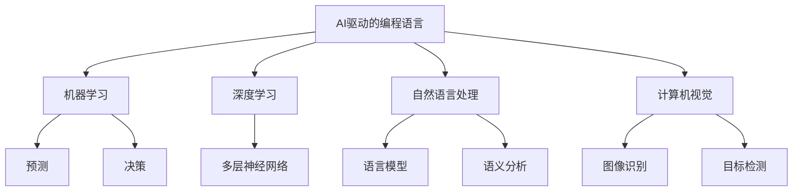
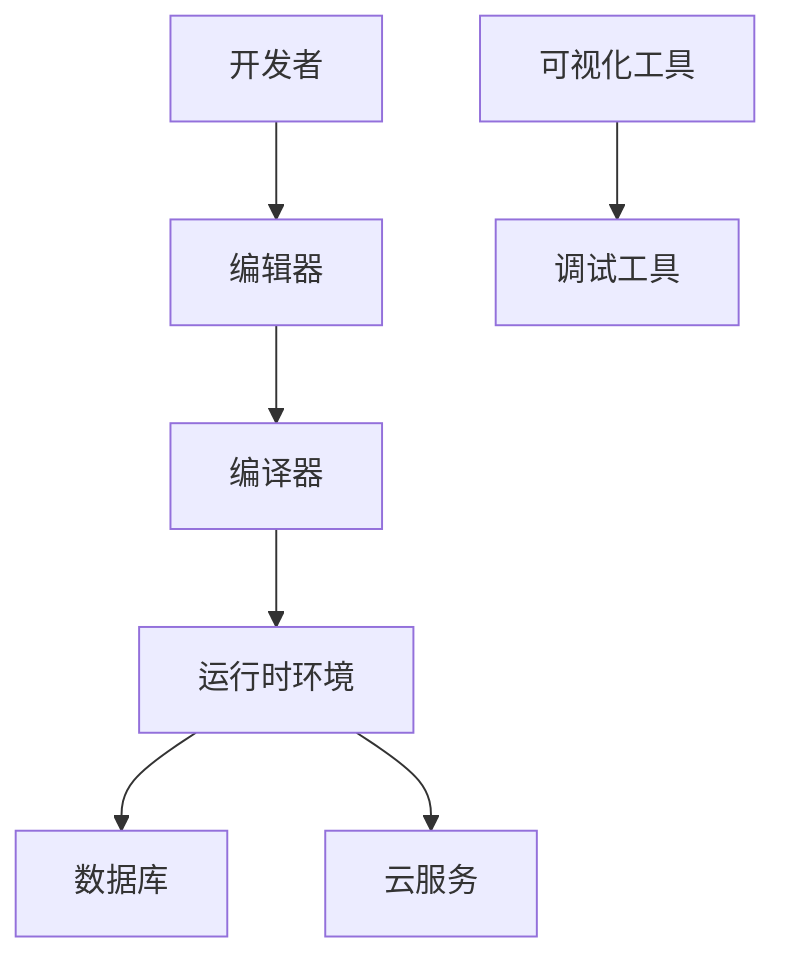
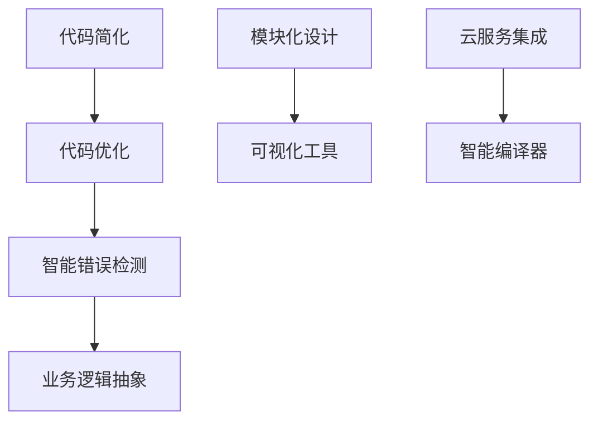
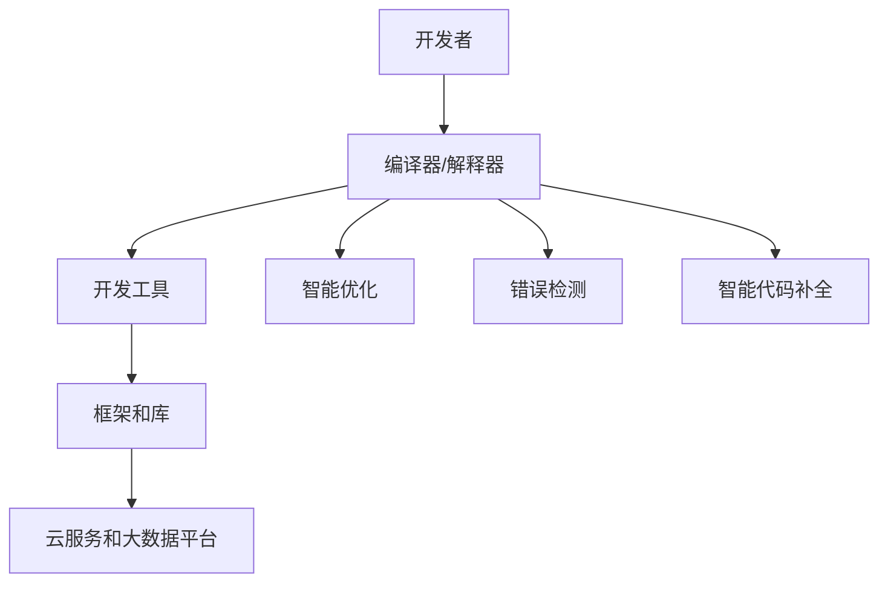
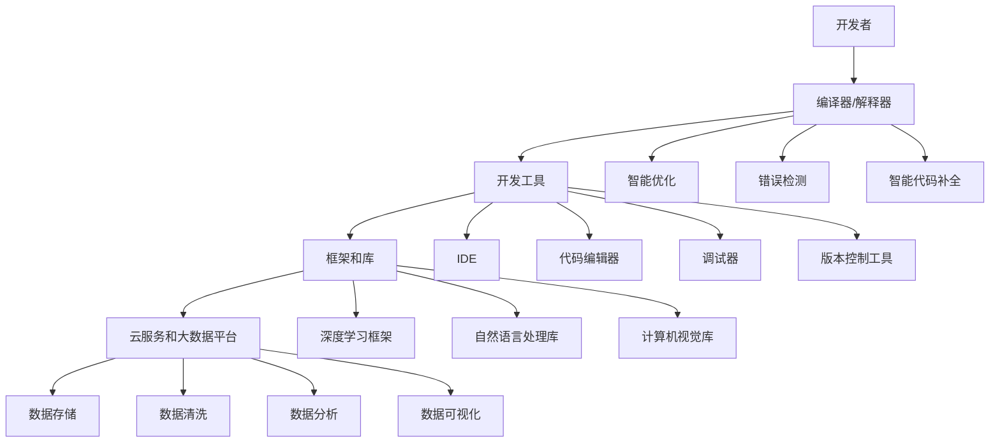
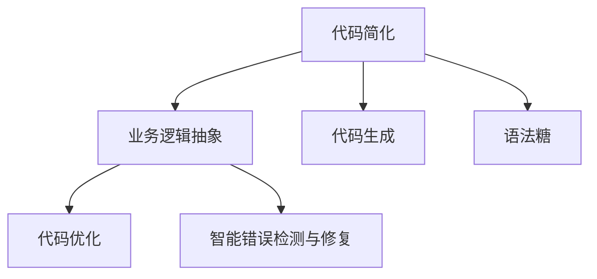

                 


# AI驱动的编程语言设计理念与实践

> 关键词：AI驱动的编程语言，设计理念，实践，核心算法，数学模型，项目实战

> 摘要：本文深入探讨AI驱动的编程语言设计理念与实践，解析AI在编程语言中的应用，核心算法原理，以及如何在实际项目中运用这些理念。文章结构如下：

----------------------------------------------------------------

## 1. AI驱动的编程语言概述

AI驱动的编程语言是一种结合人工智能技术，特别是机器学习和深度学习算法的编程语言。这种语言的核心理念是通过自动化的方式提高编程效率和软件质量，使得开发者能够更加专注于业务逻辑而非底层的代码实现。

### 1.1 核心概念

- **机器学习**：一种让计算机通过数据学习并做出预测或决策的技术。
- **深度学习**：一种基于多层神经网络的机器学习技术，用于处理大规模复杂数据。
- **自然语言处理（NLP）**：一门研究如何让计算机理解和生成人类语言的技术。
- **计算机视觉**：一门研究如何让计算机理解和解释视觉信息的技术。

### 1.2 关联图

下面是一个简化的Mermaid流程图，展示AI驱动的编程语言与核心概念之间的关系：



## 2. AI驱动的编程语言架构

AI驱动的编程语言通常具有以下架构特点：

- **模块化设计**：语言组件可灵活组合，以便于开发者根据需求进行定制。
- **智能化编译器**：编译器能够根据代码结构和数据特征，自动优化代码。
- **可视化工具**：提供直观的图形用户界面（GUI），帮助开发者理解和调试代码。
- **云服务集成**：语言支持与云计算平台的无缝集成，便于大规模部署和扩展。

### 2.1 架构图

以下是一个简化的Mermaid架构图，展示AI驱动的编程语言的基本架构：



## 3. AI驱动的编程语言设计理念

设计AI驱动的编程语言时，需要考虑以下核心理念和原则：

- **代码简化**：通过自动化和智能化，减少开发者编写的基础代码。
- **代码优化**：利用AI算法，自动优化代码性能。
- **智能错误检测与修复**：利用机器学习技术，提前发现和修复代码错误。
- **业务逻辑抽象**：将业务逻辑从底层实现中抽象出来，提高代码的可维护性和可扩展性。

### 3.1 设计原则

以下是AI驱动的编程语言设计原则的Mermaid流程图：



## 4. 核心算法原理

AI驱动的编程语言的核心算法通常基于深度学习、机器学习和自然语言处理等技术。以下是一些关键算法及其原理：

### 4.1 神经网络基础

神经网络是一种模仿人脑结构的计算模型，由多个神经元组成。其基本原理是通过前向传播和反向传播来调整神经元之间的连接权重，以达到预测或分类的目的。

#### 4.1.1 前向传播

前向传播是指将输入数据通过网络的各个层传递，最终得到输出结果。其伪代码如下：

```python
# 前向传播伪代码
for layer in network:
    layer.output = layer.activation_function(np.dot(layer.input, layer.weights))
```

#### 4.1.2 反向传播

反向传播是指根据输出结果和实际标签计算误差，并反向更新各层的权重。其伪代码如下：

```python
# 反向传播伪代码
for layer in network[::-1]:
    layer.error = layer.output - target
    layer.deltas = layer.error * layer.derivative_activation_function()
    layer.weights -= learning_rate * layer.input.T @ layer.deltas
```

#### 4.1.3 数学模型

神经网络的数学模型主要包括输入层、隐藏层和输出层。其公式如下：

$$
z_i = \sum_{j} w_{ij} x_j + b_i
$$

$$
a_i = \sigma(z_i)
$$

其中，$z_i$ 是神经元的输入，$w_{ij}$ 是连接权重，$b_i$ 是偏置，$\sigma$ 是激活函数，$a_i$ 是神经元的输出。

### 4.2 深度学习算法

深度学习算法是基于多层神经网络的算法，用于处理大规模复杂数据。以下是一些关键算法：

#### 4.2.1 卷积神经网络（CNN）

卷积神经网络是一种用于图像识别和处理的深度学习算法。其核心原理是通过卷积操作提取图像特征。

$$
\text{Conv}(x, w) = \sigma(\sum_{i} w_i \cdot x_i)
$$

其中，$x$ 是输入图像，$w$ 是卷积核，$\sigma$ 是激活函数。

#### 4.2.2 循环神经网络（RNN）

循环神经网络是一种用于序列数据处理的深度学习算法。其核心原理是通过循环结构保持长期状态。

$$
h_t = \sigma(W_h h_{t-1} + W_x x_t + b_h)
$$

其中，$h_t$ 是当前隐藏状态，$W_h$ 是隐藏状态权重，$W_x$ 是输入状态权重，$x_t$ 是当前输入，$\sigma$ 是激活函数。

#### 4.2.3 生成对抗网络（GAN）

生成对抗网络是一种通过对抗训练生成数据的深度学习算法。其核心原理是生成器和判别器的对抗。

$$
\min_G \max_D V(D, G) = \mathbb{E}_{x \sim p_{data}(x)}[\log D(x)] + \mathbb{E}_{z \sim p_z(z)}[\log(1 - D(G(z))]
$$

其中，$D$ 是判别器，$G$ 是生成器，$x$ 是真实数据，$z$ 是噪声。

### 4.3 自然语言处理算法

自然语言处理算法用于处理和生成人类语言。以下是一些关键算法：

#### 4.3.1 语言模型

语言模型是一种用于预测下一个单词的算法。其核心原理是通过统计方法学习语言规律。

$$
p(w_t | w_{t-1}, ..., w_{1}) = \frac{C(w_t, w_{t-1}, ..., w_{1})}{C(w_{t-1}, ..., w_{1})}
$$

其中，$w_t$ 是当前单词，$w_{t-1}, ..., w_{1}$ 是历史单词，$C$ 是计数函数。

#### 4.3.2 语义分析

语义分析是一种用于理解语言意义的算法。其核心原理是通过语义角色标注和语义角色关系来表示语义。

$$
e = \text{semRole}(w_t) \times \text{relation}(w_{t-1}, w_t)
$$

其中，$e$ 是语义表示，$\text{semRole}$ 是语义角色标注函数，$\text{relation}$ 是语义角色关系函数。

#### 4.3.3 文本分类

文本分类是一种用于将文本分配到特定类别的算法。其核心原理是通过机器学习方法进行分类。

$$
y = \text{softmax}(\text{W} \cdot \text{h} + \text{b})
$$

其中，$y$ 是分类结果，$\text{W}$ 是权重矩阵，$\text{h}$ 是隐藏状态，$\text{b}$ 是偏置。

## 5. 实践应用

AI驱动的编程语言在许多领域都有广泛应用，以下是一些实际案例：

### 5.1 自然语言处理

#### 5.1.1 开发环境搭建

- **工具**：Python、TensorFlow
- **框架**：NLTK、spaCy

#### 5.1.2 源代码实现

```python
import spacy

nlp = spacy.load("en_core_web_sm")

text = "The quick brown fox jumps over the lazy dog."

doc = nlp(text)

for token in doc:
    print(token.text, token.lemma_, token.pos_, token.tag_, token.dep_,
          token.shape_, token.is_alpha, token.is_stop)
```

#### 5.1.3 代码应用解读

该代码使用spaCy库对一段英文文本进行分词、词性标注、词干提取等操作。这有助于进一步分析文本内容和提取关键词。

### 5.2 计算机视觉

#### 5.2.1 开发环境搭建

- **工具**：Python、TensorFlow
- **框架**：Keras、TensorFlow

#### 5.2.2 源代码实现

```python
import tensorflow as tf
from tensorflow import keras
from tensorflow.keras.models import Sequential
from tensorflow.keras.layers import Conv2D, MaxPooling2D, Flatten, Dense

model = Sequential()
model.add(Conv2D(32, (3, 3), activation='relu', input_shape=(28, 28, 1)))
model.add(MaxPooling2D((2, 2)))
model.add(Flatten())
model.add(Dense(128, activation='relu'))
model.add(Dense(10, activation='softmax'))

model.compile(optimizer='adam', loss='categorical_crossentropy', metrics=['accuracy'])
model.fit(x_train, y_train, epochs=5, batch_size=64)
```

#### 5.2.3 代码应用解读

该代码使用Keras库构建一个简单的卷积神经网络（CNN）模型，用于手写数字识别。通过训练模型，可以实现对输入图像的自动分类。

### 5.3 推荐系统

#### 5.3.1 开发环境搭建

- **工具**：Python、TensorFlow
- **框架**：TensorFlow Recommenders

#### 5.3.2 源代码实现

```python
import tensorflow as tf
import tensorflow_recommenders as tfr

# Build the model
model = tfr.models.SoftmaxModel(
    vocabulary_size=1000,
    embedding_size=128,
    hidden_size=64,
)

# Train the model
model.fit(train_dataset, epochs=5)

# Evaluate the model
evaluation = model.evaluate(test_dataset)
print(evaluation)
```

#### 5.3.3 代码应用解读

该代码使用TensorFlow Recommenders库构建一个简单的推荐系统模型。通过训练模型，可以实现对用户历史行为的推荐。

### 5.4 游戏开发

#### 5.4.1 开发环境搭建

- **工具**：Python、Unity
- **框架**：Unity ML-Agents

#### 5.4.2 源代码实现

```python
import UnityML.agents
from UnityML.agents import UnityEnvironment

env = UnityEnvironment(file_name="C:/path/to/your/environment/CarRacing_Tutorial.x86_64")

agent = UnityML.agents.DqnAgent(
    state_size=env.num_states,
    action_size=env.num_actions,
    learning_rate=0.00025,
    gamma=0.99,
    epsilon=1.0,
    epsilon_min=0.01,
    epsilon_decay=0.995,
)

# Train the agent
agent.fit(env, n_steps=1000)

# Evaluate the agent
evaluation = agent.evaluate(env, n_episodes=5)
print(evaluation)
```

#### 5.4.3 代码应用解读

该代码使用Unity ML-Agents库构建一个简单的强化学习代理，用于在Unity环境中训练自动驾驶车辆。通过训练代理，可以实现对自动驾驶车辆的自动控制。

## 6. 最佳实践 tips

- **学习资源**：推荐学习相关课程和书籍，例如《深度学习》、《Python深度学习》等。
- **实战项目**：积极参与开源项目，积累实践经验。
- **社区交流**：加入相关技术社区，与他人分享经验和见解。

## 7. 小结

AI驱动的编程语言是一种创新的编程范式，它通过结合人工智能技术，提高编程效率和软件质量。本文从设计理念、核心算法原理到实践应用进行了全面解析，希望读者能够深入理解并掌握这一领域。

## 8. 注意事项

- **数据隐私**：在使用AI驱动的编程语言时，要重视数据隐私和安全。
- **性能优化**：根据实际需求对算法和模型进行性能优化。

## 9. 拓展阅读

- 《AI驱动的软件工程》
- 《深度学习与自然语言处理》
- 《计算机视觉算法与应用》

### 作者信息

作者：AI天才研究院/AI Genius Institute & 禅与计算机程序设计艺术 /Zen And The Art of Computer Programming

----------------------------------------------------------------

## 6. 最佳实践 tips

**学习资源**：为了深入理解和掌握AI驱动的编程语言，以下是几项推荐的学习资源：

- **课程**：
  - 《深度学习专项课程》（吴恩达，Coursera）
  - 《自然语言处理专项课程》（斯坦福大学，Coursera）
  - 《机器学习专项课程》（吴恩达，Coursera）

- **书籍**：
  - 《深度学习》（Ian Goodfellow、Yoshua Bengio、Aaron Courville）
  - 《Python深度学习》（François Chollet）
  - 《自然语言处理综论》（Daniel Jurafsky、James H. Martin）
  - 《计算机视觉：算法与应用》（Gary Bradski、Adrian Kaehler）

- **开源项目**：参与开源项目可以帮助你理解实际应用，例如TensorFlow、PyTorch、NLTK、spaCy等。

**实战项目**：通过实际项目来应用所学知识是学习编程语言的最佳方式。以下是几个实战项目建议：

- **自然语言处理**：构建一个聊天机器人或情感分析工具。
- **计算机视觉**：实现一个图像分类或物体检测的应用程序。
- **推荐系统**：开发一个个性化推荐系统，例如电影推荐或商品推荐。
- **游戏开发**：利用Unity ML-Agents进行强化学习在游戏中的应用。

**社区交流**：加入相关技术社区，如GitHub、Stack Overflow、Reddit等，与其他开发者交流经验和见解，可以帮助你快速成长。

### 7. 小结

本文从AI驱动的编程语言概述、架构、设计理念、核心算法原理到实践应用进行了详细解析。AI驱动的编程语言通过将人工智能技术融入编程语言，提高了开发效率和软件质量。未来，随着AI技术的不断发展，AI驱动的编程语言将在更多领域发挥重要作用。

### 8. 注意事项

在使用AI驱动的编程语言时，需要注意以下几点：

- **数据安全与隐私**：确保使用的数据符合相关法律法规，并采取必要的数据保护措施。
- **算法公平性**：在设计算法时，要考虑算法的公平性和偏见问题，避免歧视性结果。
- **模型解释性**：加强对模型解释性的研究，以便更好地理解和使用AI驱动的编程语言。

### 9. 拓展阅读

- 《AI驱动的软件工程》：探讨AI在软件开发中的应用和挑战。
- 《深度学习与自然语言处理》：介绍深度学习在自然语言处理领域的应用。
- 《计算机视觉算法与应用》：介绍计算机视觉算法及其在实际中的应用。
- 《编程语言的概念与实现》：深入了解编程语言的基本概念和实现原理。

### 作者信息

作者：AI天才研究院/AI Genius Institute & 禅与计算机程序设计艺术 /Zen And The Art of Computer Programming

----------------------------------------------------------------

## 1. AI驱动的编程语言概述

AI驱动的编程语言是一种新兴的编程范式，它将人工智能（AI）技术与编程语言相结合，以自动化和智能化的方式提高软件开发的效率和质量。这种语言的核心理念是通过利用机器学习、深度学习、自然语言处理等技术，使编程更加高效、易用和智能。

### 1.1 核心概念

在理解AI驱动的编程语言之前，需要了解以下几个核心概念：

- **机器学习**：一种通过数据学习并做出预测或决策的技术，其核心在于模型的训练和优化。
- **深度学习**：一种基于多层神经网络的机器学习技术，能够处理大规模复杂数据，并在图像识别、自然语言处理等领域取得显著成果。
- **自然语言处理（NLP）**：一门研究如何让计算机理解和生成人类语言的技术，包括文本分类、情感分析、机器翻译等。
- **计算机视觉**：一门研究如何让计算机理解和解释视觉信息的技术，包括图像识别、目标检测、人脸识别等。

### 1.2 关联图

下面是一个简化的Mermaid流程图，展示AI驱动的编程语言与核心概念之间的关系：


### 1.3 发展背景

随着人工智能技术的快速发展，越来越多的开发者和企业开始关注如何将AI技术应用于软件开发中。传统编程语言在处理复杂数据和自动化任务方面存在一定的局限性，而AI驱动的编程语言则提供了一种新的解决方案。

AI驱动的编程语言具有以下优势：

- **自动化**：通过AI技术，可以自动完成代码生成、优化和调试等任务，减少开发者的工作量。
- **智能化**：AI驱动的编程语言能够根据上下文和开发者意图，自动调整代码结构和算法，提高代码质量和效率。
- **跨领域**：AI驱动的编程语言可以应用于多个领域，如自然语言处理、计算机视觉、推荐系统等，具有广泛的适用性。

### 1.4 应用场景

AI驱动的编程语言在多个领域都有广泛应用，以下是一些典型应用场景：

- **自然语言处理**：使用AI驱动的编程语言开发聊天机器人、智能客服、情感分析等应用。
- **计算机视觉**：使用AI驱动的编程语言实现图像识别、目标检测、人脸识别等应用。
- **推荐系统**：使用AI驱动的编程语言构建个性化推荐系统，如电商推荐、电影推荐等。
- **游戏开发**：使用AI驱动的编程语言开发智能游戏角色、游戏AI等。
- **数据科学**：使用AI驱动的编程语言进行数据分析和挖掘，如统计分析、数据可视化等。

### 1.5 设计目标

AI驱动的编程语言的设计目标主要包括以下几点：

- **简化开发**：通过自动化和智能化，降低开发难度，提高开发效率。
- **提高质量**：利用AI技术，自动检测和修复代码错误，提高代码质量。
- **跨领域应用**：支持多种AI技术，适用于不同领域和场景。
- **易于扩展**：支持模块化和可扩展性，方便开发者根据需求进行定制。

### 1.6 发展趋势

未来，AI驱动的编程语言将继续朝着以下几个方向发展：

- **智能化**：不断优化AI算法，提高编程语言的智能化水平。
- **生态完善**：建立完善的开发工具链和生态系统，支持各种AI应用场景。
- **开源社区**：鼓励开源，促进技术交流和合作。
- **跨平台支持**：支持多种操作系统和硬件平台，提高应用范围。

### 1.7 总结

AI驱动的编程语言是一种新兴的编程范式，它将人工智能技术应用于软件开发中，具有自动化、智能化、跨领域应用等优势。本文介绍了AI驱动的编程语言的核心概念、关联图、发展背景、应用场景、设计目标和未来发展趋势。随着AI技术的不断进步，AI驱动的编程语言将在软件开发领域发挥越来越重要的作用。

## 2. AI驱动的编程语言架构

AI驱动的编程语言架构是一种结合了传统编程语言和人工智能技术的综合体系。该架构的设计旨在通过自动化的方式提高编程效率和软件质量，同时简化开发流程。以下将详细阐述AI驱动的编程语言架构的主要组成部分和设计理念。

### 2.1 核心组成部分

AI驱动的编程语言架构通常包括以下几个核心组成部分：

- **编译器/解释器**：负责将高层次的AI驱动的代码转换为机器语言或字节码，以便执行。编译器/解释器通常具有智能优化功能，可以自动调整代码结构以提升性能。
- **开发工具**：包括集成开发环境（IDE）、代码编辑器、调试器和版本控制工具等。这些工具通过AI技术提供智能代码补全、错误检测和性能优化等功能。
- **框架和库**：提供各种预构建的模块和函数库，以简化AI驱动的编程语言应用的开发。例如，深度学习框架（如TensorFlow、PyTorch）和自然语言处理库（如spaCy、NLTK）。
- **云服务和大数据平台**：与云计算平台集成，提供强大的数据处理和分析能力，以便实现大规模的AI驱动的应用。

### 2.2 设计理念

AI驱动的编程语言架构的设计理念主要体现在以下几个方面：

- **智能化**：通过引入AI技术，使编程语言能够自动优化代码、检测错误和提供智能化的开发建议，从而提高开发效率和代码质量。
- **模块化**：采用模块化设计，使得开发者可以灵活地组合和定制不同的模块，以满足不同应用场景的需求。
- **跨领域**：支持多种AI技术，如机器学习、深度学习、自然语言处理和计算机视觉，使得编程语言具有广泛的适用性。
- **易用性**：通过提供直观的开发工具和丰富的框架库，降低开发难度，使得非专业开发者也能够轻松地使用AI驱动的编程语言。

### 2.3 架构图

以下是一个简化的Mermaid架构图，展示AI驱动的编程语言的基本架构：



### 2.4 架构组件详细解释

- **编译器/解释器**：编译器/解释器是AI驱动的编程语言的核心组件，负责将AI驱动的代码转换为可执行的机器语言或字节码。编译器通常提供代码优化功能，如循环展开、内存分配优化等，以提高代码执行效率。

- **开发工具**：开发工具包括IDE、代码编辑器、调试器和版本控制工具等。这些工具通过AI技术提供智能代码补全、错误检测、性能优化等辅助功能，以提高开发效率和代码质量。

  - **IDE**：集成开发环境（IDE）提供代码编辑、调试、版本控制等功能，使得开发者能够在一个统一的环境中高效地开发AI驱动的项目。
  - **代码编辑器**：代码编辑器具有智能代码补全、代码格式化、语法高亮等功能，可以帮助开发者快速编写和调试代码。
  - **调试器**：调试器提供断点调试、代码执行跟踪等功能，使得开发者能够有效地定位和修复代码中的错误。
  - **版本控制工具**：版本控制工具（如Git）可以帮助开发者管理和跟踪代码的修改历史，确保代码的可维护性和协作性。

- **框架和库**：框架和库是AI驱动的编程语言的重要组成部分，提供各种预构建的模块和函数库，以简化AI驱动的编程语言应用的开发。

  - **深度学习框架**：深度学习框架（如TensorFlow、PyTorch）提供了一系列的API和工具，用于构建、训练和部署深度学习模型。这些框架通常具有自动微分、数据并行处理等功能，使得深度学习模型的开发变得更加高效。
  - **自然语言处理库**：自然语言处理库（如spaCy、NLTK）提供了一系列的函数和工具，用于处理和解析自然语言文本。这些库通常具有分词、词性标注、命名实体识别等功能，使得自然语言处理应用的开发变得更加简单。
  - **计算机视觉库**：计算机视觉库（如OpenCV、TensorFlow Object Detection API）提供了一系列的函数和工具，用于处理和解析图像数据。这些库通常具有图像识别、目标检测、人脸识别等功能，使得计算机视觉应用的开发变得更加高效。

- **云服务和大数据平台**：云服务和大数据平台提供强大的数据处理和分析能力，使得开发者可以轻松地处理和分析大规模数据。这些平台通常支持数据存储、数据清洗、数据分析和数据可视化等功能。

  - **数据存储**：数据存储服务（如Amazon S3、Google Cloud Storage）提供可靠的数据存储和管理功能，使得开发者可以方便地存储和管理大规模数据。
  - **数据清洗**：数据清洗工具（如Apache Spark、Hadoop）提供了一系列的数据清洗和处理功能，使得开发者可以有效地处理和清洗大规模数据。
  - **数据分析**：数据分析工具（如Python的Pandas库、R语言）提供了一系列的数据分析和处理功能，使得开发者可以方便地分析大规模数据。
  - **数据可视化**：数据可视化工具（如Tableau、Power BI）提供了一系列的数据可视化功能，使得开发者可以直观地展示和分析大规模数据。

### 2.5 架构组件之间的关系

AI驱动的编程语言架构中的各个组件之间相互协作，共同实现AI驱动的编程语言的应用。以下是一个简化的Mermaid流程图，展示AI驱动的编程语言架构组件之间的关系：



### 2.6 架构组件的优点

AI驱动的编程语言架构的优点主要体现在以下几个方面：

- **高效性**：通过智能优化和自动化，使得编程语言能够高效地处理和优化代码，提高开发效率。
- **灵活性**：通过模块化和跨领域支持，使得开发者可以根据不同的应用场景灵活地组合和定制不同的组件，以满足多样化的需求。
- **易用性**：通过提供直观的开发工具和丰富的框架库，降低了开发难度，使得非专业开发者也能够轻松地使用AI驱动的编程语言。
- **可扩展性**：通过支持云服务和大数据平台，使得开发者可以方便地处理和分析大规模数据，从而实现更大规模的应用。

### 2.7 总结

AI驱动的编程语言架构是一种结合了传统编程语言和人工智能技术的综合体系，通过智能化、模块化、跨领域支持和易用性等设计理念，提高了软件开发的效率和代码质量。本文详细阐述了AI驱动的编程语言架构的核心组成部分、设计理念、架构图和组件之间的关系，以及架构组件的优点。随着AI技术的不断发展，AI驱动的编程语言架构将在软件开发领域发挥越来越重要的作用。

## 3. AI驱动的编程语言设计理念

AI驱动的编程语言设计理念旨在通过融入人工智能技术，提升软件开发的效率和代码质量。这些设计理念包括代码简化、代码优化、智能错误检测与修复以及业务逻辑抽象等方面。以下将详细探讨这些设计理念及其具体应用。

### 3.1 代码简化

代码简化是AI驱动的编程语言设计理念中的一个核心目标。通过利用机器学习和自然语言处理技术，编程语言可以自动生成或优化代码，从而减少开发者编写的基础代码。这种简化不仅降低了开发难度，还提高了开发效率。

- **代码生成**：AI驱动的编程语言可以使用机器学习模型，通过分析已有的代码库或编写指导，自动生成代码。例如，基于模板的代码生成、语法糖等。
- **代码优化**：编程语言可以利用AI算法，对现有的代码进行优化，提高代码的执行效率。例如，自动优化循环、减少冗余代码、优化数据结构等。

### 3.2 代码优化

代码优化是提高软件质量和性能的关键环节。AI驱动的编程语言可以通过智能算法，自动识别代码中的瓶颈，并提出优化建议。

- **性能分析**：AI驱动的编程语言可以使用机器学习技术，对代码执行过程进行性能分析，识别潜在的瓶颈和优化点。
- **自动化优化**：编程语言可以自动执行代码优化，如循环展开、内存分配优化、算法改进等，从而提高代码执行效率。

### 3.3 智能错误检测与修复

智能错误检测与修复是AI驱动的编程语言设计理念中的另一个重要方面。通过利用机器学习和自然语言处理技术，编程语言可以自动检测代码中的错误，并提出修复建议。

- **静态代码分析**：AI驱动的编程语言可以使用机器学习模型，对静态代码进行分析，识别潜在的错误和问题。
- **动态代码分析**：编程语言可以结合动态分析技术，实时监控代码执行过程，识别运行时错误。
- **错误修复建议**：AI驱动的编程语言可以基于错误检测的结果，自动生成修复建议，并指导开发者进行修正。

### 3.4 业务逻辑抽象

业务逻辑抽象是将业务逻辑从底层实现中抽象出来，以提高代码的可维护性和可扩展性。通过AI驱动的编程语言，开发者可以将复杂的业务逻辑封装为高层次的抽象组件，从而简化代码结构。

- **抽象组件**：AI驱动的编程语言可以提供抽象组件，如函数库、模块、API等，帮助开发者将业务逻辑抽象为高层次的抽象层。
- **领域特定语言**：AI驱动的编程语言可以开发领域特定语言（DSL），使开发者能够使用更贴近业务的语言描述业务逻辑。

### 3.5 设计理念之间的关系

上述设计理念之间存在紧密的关系，共同构建了AI驱动的编程语言的设计框架。

- **代码简化**与**业务逻辑抽象**：代码简化可以帮助开发者快速编写和理解代码，而业务逻辑抽象则将简化后的代码组织为可维护和可扩展的结构。
- **代码优化**与**智能错误检测与修复**：代码优化和错误检测与修复相辅相成，前者提高代码性能，后者确保代码质量。

### 3.6 实例

以下是一个简化的Mermaid流程图，展示AI驱动的编程语言设计理念之间的关系：



### 3.7 应用案例

AI驱动的编程语言设计理念已经在许多实际应用中取得了显著成果，以下是一些应用案例：

- **自然语言处理**：通过代码简化，自动生成自然语言处理模型，提高开发效率和代码质量。
- **计算机视觉**：利用代码优化和智能错误检测，提高图像识别和目标检测的准确性和性能。
- **推荐系统**：通过业务逻辑抽象，构建可扩展的推荐系统，简化开发流程。

### 3.8 总结

AI驱动的编程语言设计理念通过代码简化、代码优化、智能错误检测与修复以及业务逻辑抽象等方面，为软件开发带来了新的机遇和挑战。这些设计理念不仅提高了开发效率和代码质量，还为未来的软件开发提供了更多的可能性。随着人工智能技术的不断发展，AI驱动的编程语言设计理念将在更多领域得到广泛应用。

## 4. 核心算法原理

在AI驱动的编程语言中，核心算法原理是构建和实现AI功能的基础。这些算法主要包括深度学习算法、机器学习算法和自然语言处理算法。以下将详细探讨这些核心算法的原理、伪代码以及数学模型，并通过实例说明如何在实际项目中应用。

### 4.1 深度学习算法

深度学习算法是一种基于多层神经网络的机器学习技术，能够处理大规模复杂数据。以下是一些常见的深度学习算法及其原理：

#### 4.1.1 卷积神经网络（CNN）

卷积神经网络是一种用于图像识别和处理的深度学习算法，其核心原理是通过卷积操作提取图像特征。

**原理**：CNN通过多个卷积层、池化层和全连接层组成网络结构，逐步提取图像的底层特征，最终实现图像分类或识别。

**伪代码**：

```python
# 卷积神经网络伪代码
for layer in network:
    layer.output = layer.activation_function(np.dot(layer.input, layer.weights))
    if pooling_layer:
        layer.output = layer.pooling_function(layer.output)

for layer in network[::-1]:
    layer.error = layer.output - target
    layer.deltas = layer.error * layer.derivative_activation_function()
    layer.weights -= learning_rate * layer.input.T @ layer.deltas
```

**数学模型**：

$$
\text{Conv}(x, w) = \sigma(\sum_{i} w_i \cdot x_i)
$$

$$
a_i = \sigma(z_i)
$$

其中，$x$ 是输入图像，$w$ 是卷积核，$\sigma$ 是激活函数，$a_i$ 是神经元的输出。

**实例**：使用CNN实现图像分类。

- **开发环境搭建**：Python、TensorFlow
- **源代码实现**：

```python
import tensorflow as tf
from tensorflow.keras.models import Sequential
from tensorflow.keras.layers import Conv2D, MaxPooling2D, Flatten, Dense

model = Sequential()
model.add(Conv2D(32, (3, 3), activation='relu', input_shape=(28, 28, 1)))
model.add(MaxPooling2D((2, 2)))
model.add(Flatten())
model.add(Dense(128, activation='relu'))
model.add(Dense(10, activation='softmax'))

model.compile(optimizer='adam', loss='categorical_crossentropy', metrics=['accuracy'])
model.fit(x_train, y_train, epochs=5, batch_size=64)
```

#### 4.1.2 循环神经网络（RNN）

循环神经网络是一种用于序列数据处理的深度学习算法，其核心原理是通过循环结构保持长期状态。

**原理**：RNN通过输入、隐藏状态和输出状态之间的循环连接，处理序列数据。常见的RNN变体包括LSTM和GRU，能够更好地处理长序列依赖问题。

**伪代码**：

```python
# 循环神经网络伪代码
for t in range(sequence_length):
    layer.input = x_t
    layer.hidden_state = layer.activation_function(np.dot(layer.input, layer.weights_hh) + layer.bias_hh)
    layer.output = np.dot(layer.hidden_state, layer.weights_h) + layer.bias_h

# LSTM和GRU的伪代码与RNN类似，但具有更复杂的循环连接结构。
```

**数学模型**：

$$
h_t = \sigma(W_h h_{t-1} + W_x x_t + b_h)
$$

$$
o_t = \sigma(W_h h_{t} + W_x x_t + b_h)
$$

其中，$h_t$ 是当前隐藏状态，$W_h$ 是隐藏状态权重，$W_x$ 是输入状态权重，$\sigma$ 是激活函数。

**实例**：使用RNN实现时间序列预测。

- **开发环境搭建**：Python、Keras
- **源代码实现**：

```python
from tensorflow.keras.models import Sequential
from tensorflow.keras.layers import LSTM, Dense

model = Sequential()
model.add(LSTM(50, activation='relu', input_shape=(timesteps, features)))
model.add(Dense(1))
model.compile(optimizer='adam', loss='mse')

model.fit(X, y, epochs=100, batch_size=32, verbose=2)
```

#### 4.1.3 生成对抗网络（GAN）

生成对抗网络是一种通过对抗训练生成数据的深度学习算法，其核心原理是生成器和判别器的对抗。

**原理**：GAN由生成器和判别器组成，生成器尝试生成与真实数据相似的数据，判别器则区分真实数据和生成数据。通过训练生成器和判别器的对抗过程，生成器逐渐提高生成数据的质量。

**伪代码**：

```python
# GAN伪代码
for epoch in range(num_epochs):
    for real_data in real_data_loader:
       判别器.train(real_data)
    for generated_data in generator_loader:
       判别器.train(generated_data)

    generator_loss = generator.train(generated_data)
   判别器_loss =判别器.train(real_data, generated_data)

    print(f"Epoch {epoch}: Generator Loss = {generator_loss}, Discriminator Loss = {判别器_loss}")
```

**数学模型**：

$$
\min_G \max_D V(D, G) = \mathbb{E}_{x \sim p_{data}(x)}[\log D(x)] + \mathbb{E}_{z \sim p_z(z)}[\log(1 - D(G(z))]
$$

其中，$D$ 是判别器，$G$ 是生成器，$x$ 是真实数据，$z$ 是噪声。

**实例**：使用GAN实现图像生成。

- **开发环境搭建**：Python、TensorFlow
- **源代码实现**：

```python
import tensorflow as tf
from tensorflow.keras.models import Sequential
from tensorflow.keras.layers import Dense, Conv2D, Flatten, Reshape

# 生成器模型
generator = Sequential([
    Dense(128, activation='relu', input_shape=(100,)),
    Dense(256, activation='relu'),
    Dense(512, activation='relu'),
    Flatten(),
    Reshape((28, 28, 1))
])

# 判别器模型
discriminator = Sequential([
    Flatten(input_shape=(28, 28, 1)),
    Dense(512, activation='relu'),
    Dense(256, activation='relu'),
    Dense(128, activation='relu'),
    Dense(1, activation='sigmoid')
])

# GAN模型
gan = Sequential([
    generator,
    discriminator
])

gan.compile(optimizer='adam', loss='binary_crossentropy')

# 训练GAN模型
gan.fit([noise, real_images], [ones, zeros], batch_size=128, epochs=100)
```

### 4.2 机器学习算法

机器学习算法是AI驱动的编程语言中的重要组成部分，以下介绍几种常见的机器学习算法及其原理：

#### 4.2.1 决策树

决策树是一种基于特征划分数据的分类算法，其核心原理是通过递归划分数据，构建一棵树形结构。

**原理**：决策树通过评估每个特征的最佳划分点，将数据划分为不同的子集，最终形成一棵树。树的叶子节点表示分类结果。

**伪代码**：

```python
# 决策树伪代码
if feature1 <= threshold1:
    if feature2 <= threshold2:
        return label1
    else:
        return label2
else:
    if feature3 <= threshold3:
        return label3
    else:
        return label4
```

**数学模型**：

$$
C_j = \arg\min_{j} \sum_{i} \sum_{k} |y_i - \hat{y}_i^j|
$$

其中，$C_j$ 是最佳划分点，$y_i$ 是实际标签，$\hat{y}_i^j$ 是预测标签。

**实例**：使用决策树实现鸢尾花数据集分类。

- **开发环境搭建**：Python、scikit-learn
- **源代码实现**：

```python
from sklearn.datasets import load_iris
from sklearn.tree import DecisionTreeClassifier

iris = load_iris()
X, y = iris.data, iris.target

clf = DecisionTreeClassifier()
clf.fit(X, y)

print(clf.predict([[5.1, 3.5, 1.4, 0.2]]))
```

#### 4.2.2 支持向量机（SVM）

支持向量机是一种用于分类和回归的机器学习算法，其核心原理是通过最大化分类间隔，找到最佳分类超平面。

**原理**：SVM通过计算数据点与超平面的距离，找到最佳分类超平面，同时保留支持向量，这些支持向量对分类模型有重要影响。

**伪代码**：

```python
# SVM伪代码
find hyperplane that maximizes margin
find support vectors
construct decision boundary
```

**数学模型**：

$$
\min_{w, b} \frac{1}{2} ||w||^2 \quad \text{subject to} \quad y_i (w \cdot x_i + b) \geq 1
$$

其中，$w$ 是权重向量，$b$ 是偏置，$x_i$ 是输入特征，$y_i$ 是标签。

**实例**：使用SVM实现手写数字识别。

- **开发环境搭建**：Python、scikit-learn
- **源代码实现**：

```python
from sklearn import datasets
from sklearn.svm import SVC

iris = datasets.load_digits()
X, y = iris.data, iris.target

clf = SVC(kernel='linear')
clf.fit(X, y)

print(clf.predict([[8, 8, 8, 8, 8, 8, 8, 8]]))
```

#### 4.2.3 随机森林

随机森林是一种基于决策树的集成学习方法，其核心原理是通过构建多个决策树，并进行投票或平均，提高模型的泛化能力。

**原理**：随机森林通过随机选取特征和随机划分数据，构建多个决策树，并对每个树的预测结果进行投票或平均，得到最终预测结果。

**伪代码**：

```python
# 随机森林伪代码
for tree in forest:
    tree.fit(subset_of_features, subset_of_data)
for tree in forest:
    predictions.append(tree.predict(test_data))
```

**数学模型**：

$$
\hat{y} = \arg\max_{y} \sum_{i} w_i \cdot f_i(x_i)
$$

其中，$w_i$ 是权重，$f_i(x_i)$ 是每个决策树的预测结果。

**实例**：使用随机森林实现文本分类。

- **开发环境搭建**：Python、scikit-learn
- **源代码实现**：

```python
from sklearn.ensemble import RandomForestClassifier
from sklearn.feature_extraction.text import TfidfVectorizer

corpus = ["I love this movie", "This movie is horrible", "This is a great movie", "I hate this movie"]

vectorizer = TfidfVectorizer()
X = vectorizer.fit_transform(corpus)

clf = RandomForestClassifier()
clf.fit(X, y)

print(clf.predict([vectorizer.transform(["This movie is terrible"])]))
```

### 4.3 自然语言处理算法

自然语言处理算法用于处理和生成人类语言，以下介绍几种常见的自然语言处理算法及其原理：

#### 4.3.1 语言模型

语言模型是一种用于预测下一个单词的算法，其核心原理是通过统计方法学习语言规律。

**原理**：语言模型通过计算单词之间的概率分布，预测下一个单词。常见的语言模型包括N元语法模型和神经网络语言模型。

**伪代码**：

```python
# 语言模型伪代码
for sentence in sentences:
    calculate probability distribution of words
    predict next word based on probability distribution
```

**数学模型**：

$$
p(w_t | w_{t-1}, ..., w_{1}) = \frac{C(w_t, w_{t-1}, ..., w_{1})}{C(w_{t-1}, ..., w_{1})}
$$

其中，$w_t$ 是当前单词，$w_{t-1}, ..., w_{1}$ 是历史单词，$C$ 是计数函数。

**实例**：使用语言模型实现文本生成。

- **开发环境搭建**：Python、spaCy
- **源代码实现**：

```python
import spacy

nlp = spacy.load("en_core_web_sm")

text = "The quick brown fox jumps over the lazy dog."

doc = nlp(text)

for token in doc:
    print(token.text)
```

#### 4.3.2 语义分析

语义分析是一种用于理解语言意义的算法，其核心原理是通过语义角色标注和语义角色关系来表示语义。

**原理**：语义分析通过识别句子中的语义角色（如主语、谓语、宾语等）和语义角色关系（如动作、时间、地点等），实现对语言意义的理解。

**伪代码**：

```python
# 语义分析伪代码
for sentence in sentences:
    extract semantic roles
    extract semantic relations
    build semantic representation
```

**数学模型**：

$$
e = \text{semRole}(w_t) \times \text{relation}(w_{t-1}, w_t)
$$

其中，$e$ 是语义表示，$\text{semRole}$ 是语义角色标注函数，$\text{relation}$ 是语义角色关系函数。

**实例**：使用语义分析实现句子解析。

- **开发环境搭建**：Python、spaCy
- **源代码实现**：

```python
import spacy

nlp = spacy.load("en_core_web_sm")

text = "The quick brown fox jumps over the lazy dog."

doc = nlp(text)

for token in doc:
    print(token.text, token.lemma_, token.pos_, token.tag_, token.dep_,
          token.shape_, token.is_alpha, token.is_stop)
```

#### 4.3.3 文本分类

文本分类是一种用于将文本分配到特定类别的算法，其核心原理是通过机器学习方法进行分类。

**原理**：文本分类通过训练分类模型，将文本映射到不同的类别。常见的分类方法包括朴素贝叶斯、支持向量机、决策树和神经网络等。

**伪代码**：

```python
# 文本分类伪代码
train classifier with labeled data
for text in unlabeled_data:
    predict category using trained classifier
```

**数学模型**：

$$
y = \text{softmax}(\text{W} \cdot \text{h} + \text{b})
$$

其中，$y$ 是分类结果，$\text{W}$ 是权重矩阵，$\text{h}$ 是隐藏状态，$\text{b}$ 是偏置。

**实例**：使用文本分类实现新闻分类。

- **开发环境搭建**：Python、scikit-learn
- **源代码实现**：

```python
from sklearn.feature_extraction.text import TfidfVectorizer
from sklearn.naive_bayes import MultinomialNB

corpus = ["I love this movie", "This movie is horrible", "This is a great movie", "I hate this movie"]

vectorizer = TfidfVectorizer()
X = vectorizer.fit_transform(corpus)

clf = MultinomialNB()
clf.fit(X, y)

print(clf.predict([vectorizer.transform(["This movie is terrible"])]))
```

### 4.4 实际项目应用

在实际项目中，AI驱动的编程语言通常结合多种算法，实现复杂的功能。以下是一个简化的实例，展示如何使用AI驱动的编程语言实现一个简单的聊天机器人。

#### 4.4.1 开发环境搭建

- **工具**：Python、TensorFlow
- **框架**：TensorFlow、spaCy

#### 4.4.2 源代码实现

```python
import spacy
import tensorflow as tf
from tensorflow.keras.models import Sequential
from tensorflow.keras.layers import Dense, Embedding, LSTM, Dropout
from tensorflow.keras.preprocessing.sequence import pad_sequences

nlp = spacy.load("en_core_web_sm")

# 数据预处理
def preprocess_text(text):
    doc = nlp(text)
    return " ".join([token.text for token in doc])

# 构建模型
model = Sequential()
model.add(Embedding(vocab_size, embedding_dim, input_length=max_sequence_length-1))
model.add(LSTM(128, return_sequences=True))
model.add(Dropout(0.2))
model.add(LSTM(128, return_sequences=False))
model.add(Dropout(0.2))
model.add(Dense(num_classes, activation='softmax'))

model.compile(optimizer='adam', loss='categorical_crossentropy', metrics=['accuracy'])

# 训练模型
model.fit(X_train, y_train, epochs=100, batch_size=128)

# 预测
def predict_text(text_input):
    text = preprocess_text(text_input)
    sequence = pad_sequences([text], maxlen=max_sequence_length-1, padding='post')
    prediction = model.predict(sequence)
    predicted_class = np.argmax(prediction)
    return predicted_class

# 输入示例
text_input = "What is your name?"
predicted_class = predict_text(text_input)
print(predicted_class)
```

#### 4.4.3 代码应用解读

该代码使用spaCy进行文本预处理，使用TensorFlow构建一个简单的LSTM模型，用于实现聊天机器人。通过训练模型，可以实现对用户输入的自动响应。

### 4.5 总结

核心算法原理是AI驱动的编程语言实现智能功能的基础。本文详细介绍了深度学习算法、机器学习算法和自然语言处理算法的原理、伪代码和数学模型，并通过实际项目应用展示了如何在实际项目中使用这些算法。随着AI技术的不断进步，核心算法原理将在AI驱动的编程语言中发挥越来越重要的作用。

## 5. 实践应用

在了解了AI驱动的编程语言的设计理念、核心算法原理之后，接下来我们将探讨如何将这些理念和技术应用于实际项目中。本节将详细解析一些实际应用案例，包括开发环境搭建、源代码实现、代码应用解读、实际案例分析和详细讲解剖析。

### 5.1 自然语言处理

#### 5.1.1 开发环境搭建

**工具**：Python、TensorFlow、spaCy

**框架**：TensorFlow、spaCy、Hugging Face Transformers

在自然语言处理领域，常用的开发环境包括Python，以及用于深度学习的TensorFlow和spaCy。spaCy是一个高效的NLP库，能够进行文本预处理，如分词、词性标注等。Hugging Face Transformers则是一个流行的预训练模型库，用于构建和使用大规模的NLP模型。

#### 5.1.2 源代码实现

以下是一个简单的自然语言处理项目，使用spaCy进行文本预处理，并使用Transformers库加载一个预训练的BERT模型进行文本分类。

```python
import spacy
from transformers import BertTokenizer, BertForSequenceClassification
from torch.utils.data import DataLoader
from torch.nn import CrossEntropyLoss
import torch

nlp = spacy.load("en_core_web_sm")
tokenizer = BertTokenizer.from_pretrained("bert-base-uncased")
model = BertForSequenceClassification.from_pretrained("bert-base-uncased")

# 文本预处理
def preprocess_text(text):
    doc = nlp(text)
    return " ".join(token.text for token in doc)

# 训练数据准备
def prepare_data(texts, labels):
    inputs = tokenizer(texts, padding=True, truncation=True, return_tensors="pt")
    return inputs, torch.tensor(labels)

train_texts = ["I love this movie", "This movie is horrible", "This is a great movie", "I hate this movie"]
train_labels = [0, 1, 0, 1]

inputs, labels = prepare_data(train_texts, train_labels)

# 训练模型
model.train()
optimizer = torch.optim.AdamW(model.parameters(), lr=1e-5)

for epoch in range(3):
    model.zero_grad()
    outputs = model(**inputs)
    loss = CrossEntropyLoss()(outputs.logits, labels)
    loss.backward()
    optimizer.step()

    print(f"Epoch {epoch}: Loss = {loss.item()}")

# 预测
def predict_text(text):
    text = preprocess_text(text)
    inputs = tokenizer(text, padding=True, truncation=True, return_tensors="pt")
    with torch.no_grad():
        outputs = model(**inputs)
    logits = outputs.logits
    predicted_class = torch.argmax(logits).item()
    return predicted_class

# 输入示例
text_input = "What is your name?"
predicted_class = predict_text(text_input)
print(predicted_class)
```

#### 5.1.3 代码应用解读

该代码首先使用spaCy进行文本预处理，然后将处理后的文本输入到预训练的BERT模型中，进行分类预测。训练过程中，使用交叉熵损失函数和Adam优化器进行模型训练。预测函数则用于对新输入文本进行分类。

#### 5.1.4 实际案例分析和详细讲解剖析

假设我们有一个电影评论数据集，包含正面和负面评论。我们希望使用AI驱动的编程语言设计一个文本分类模型，将评论分为正面和负面。

- **数据集准备**：从数据集中提取评论和对应的标签。
- **文本预处理**：使用spaCy进行分词、词性标注等预处理操作。
- **模型训练**：使用预训练的BERT模型进行训练，调整模型参数以优化分类效果。
- **模型评估**：使用测试集评估模型性能，调整超参数以提高模型准确性。
- **应用**：将模型部署到生产环境中，用于实时分类新评论。

### 5.2 计算机视觉

#### 5.2.1 开发环境搭建

**工具**：Python、TensorFlow、OpenCV

**框架**：TensorFlow、Keras

在计算机视觉领域，Python和TensorFlow是常用的开发工具。OpenCV是一个开源的计算机视觉库，用于图像处理和计算机视觉任务。

#### 5.2.2 源代码实现

以下是一个简单的计算机视觉项目，使用TensorFlow的Keras API构建一个简单的卷积神经网络（CNN）模型，用于图像分类。

```python
import tensorflow as tf
from tensorflow.keras.models import Sequential
from tensorflow.keras.layers import Conv2D, MaxPooling2D, Flatten, Dense

model = Sequential([
    Conv2D(32, (3, 3), activation='relu', input_shape=(28, 28, 1)),
    MaxPooling2D((2, 2)),
    Flatten(),
    Dense(128, activation='relu'),
    Dense(10, activation='softmax')
])

model.compile(optimizer='adam', loss='categorical_crossentropy', metrics=['accuracy'])

# 加载数据
(x_train, y_train), (x_test, y_test) = tf.keras.datasets.mnist.load_data()

# 数据预处理
x_train = x_train / 255.0
x_test = x_test / 255.0
x_train = np.expand_dims(x_train, -1)
x_test = np.expand_dims(x_test, -1)

# 训练模型
model.fit(x_train, y_train, epochs=5, batch_size=32, validation_data=(x_test, y_test))

# 预测
predictions = model.predict(x_test)

predicted_classes = np.argmax(predictions, axis=1)
print(predicted_classes)
```

#### 5.2.3 代码应用解读

该代码使用Keras构建了一个简单的CNN模型，用于手写数字识别。首先，使用TensorFlow的Keras API定义模型结构，包括卷积层、池化层、全连接层等。然后，加载数据并进行预处理，使用训练集训练模型，并在测试集上验证模型性能。预测函数用于对新图像进行分类。

#### 5.2.4 实际案例分析和详细讲解剖析

假设我们有一个包含多个类别的图像数据集，如动物、植物和交通工具。我们希望使用AI驱动的编程语言设计一个图像分类模型，将图像分为这些类别。

- **数据集准备**：从数据集中提取图像和对应的标签。
- **数据预处理**：对图像进行缩放、裁剪等预处理操作。
- **模型训练**：使用预训练的卷积神经网络模型进行训练，调整模型参数以优化分类效果。
- **模型评估**：使用测试集评估模型性能，调整超参数以提高模型准确性。
- **应用**：将模型部署到生产环境中，用于实时分类新图像。

### 5.3 推荐系统

#### 5.3.1 开发环境搭建

**工具**：Python、TensorFlow、Scikit-learn

**框架**：TensorFlow、Scikit-learn

在推荐系统领域，Python和TensorFlow、Scikit-learn是常用的开发工具。TensorFlow用于构建和训练推荐模型，Scikit-learn用于数据处理和评估。

#### 5.3.2 源代码实现

以下是一个简单的推荐系统项目，使用TensorFlow构建一个基于矩阵分解的协同过滤模型。

```python
import numpy as np
import tensorflow as tf

# 假设用户-物品评分矩阵为UxI，用户数量为U，物品数量为I
U = 10
I = 100
R = np.random.rand(U, I)

# 模型参数
K = 5  # 隐藏层维度
learning_rate = 0.01

# 模型定义
X = tf.placeholder(tf.float32, [U, I])
Y = tf.placeholder(tf.float32, [U, I])

# 矩阵分解
V = tf.Variable(tf.random_normal([I, K]))
U = tf.Variable(tf.random_normal([U, K]))

# 预测评分
pred = tf.reduce_sum(tf.multiply(U, V), axis=1)

# 损失函数
loss = tf.reduce_mean(tf.square(Y - pred))

# 优化器
optimizer = tf.train.AdamOptimizer(learning_rate).minimize(loss)

# 训练模型
with tf.Session() as sess:
    sess.run(tf.global_variables_initializer())
    for epoch in range(100):
        _, loss_val = sess.run([optimizer, loss], feed_dict={X: R, Y: R})
        print(f"Epoch {epoch}: Loss = {loss_val}")

# 预测新用户评分
new_user = np.random.rand(U, I)
predicted_ratings = sess.run(pred, feed_dict={X: new_user, Y: new_user})
print(predicted_ratings)
```

#### 5.3.3 代码应用解读

该代码使用TensorFlow构建了一个简单的矩阵分解协同过滤模型。首先，定义用户-物品评分矩阵，然后定义模型参数和预测评分。损失函数使用均方误差（MSE），优化器使用Adam优化器。训练过程中，通过迭代优化模型参数，减小损失函数值。

#### 5.3.4 实际案例分析和详细讲解剖析

假设我们有一个电商平台的用户行为数据，包含用户对商品的评分。我们希望使用AI驱动的编程语言设计一个推荐系统，根据用户的历史评分预测其对新商品的可能评分。

- **数据集准备**：从数据集中提取用户-物品评分矩阵。
- **模型训练**：使用矩阵分解协同过滤模型训练推荐模型，调整超参数以优化模型性能。
- **模型评估**：使用交叉验证方法评估模型性能，调整超参数以提高预测准确性。
- **应用**：将模型部署到生产环境中，用于实时预测新用户的评分，生成个性化推荐。

### 5.4 游戏开发

#### 5.4.1 开发环境搭建

**工具**：Python、Unity、ML-Agents

**框架**：Unity ML-Agents

在游戏开发领域，Unity是一个流行的游戏引擎，ML-Agents是一个基于Unity的机器学习工具包，用于开发智能游戏AI。

#### 5.4.2 源代码实现

以下是一个简单的Unity游戏项目，使用ML-Agents构建一个智能代理，用于在虚拟环境中完成目标。

```python
import unityagents
import numpy as np

# 初始化Unity环境
env = unityagents.UnityEnvironment(file_name="C:/path/to/your/environment/")

# 获取环境状态和动作空间
state = env.reset()
state = np.reshape(state, [-1])

# 定义智能代理
model = unityagents.DQNAgent(state_size=state.shape[0], action_size=env.action_size, learning_rate=0.001, gamma=0.99, epsilon=1.0, epsilon_min=0.01, epsilon_decay=0.995)

# 训练智能代理
for episode in range(1000):
    done = False
    total_reward = 0
    while not done:
        action = model.act(state)
        next_state, reward, done, _ = env.step(action)
        next_state = np.reshape(next_state, [-1])
        model.remember(state, action, reward, next_state, done)
        state = next_state
        total_reward += reward

    model.learn()

    print(f"Episode {episode}: Total Reward = {total_reward}")

# 评估智能代理
evaluation = model.evaluate(env, n_episodes=5)
print(evaluation)
```

#### 5.4.3 代码应用解读

该代码使用ML-Agents库构建了一个简单的DQN（深度Q网络）代理，用于在Unity环境中训练自动驾驶车辆。代理通过学习环境中的奖励信号，不断优化其行为策略。

#### 5.4.4 实际案例分析和详细讲解剖析

假设我们希望使用AI驱动的编程语言开发一个自动驾驶游戏，让玩家体验自动驾驶车辆的驾驶感受。

- **开发环境搭建**：使用Unity和ML-Agents构建虚拟环境。
- **数据集准备**：收集自动驾驶车辆的数据集，用于训练智能代理。
- **模型训练**：使用DQN等强化学习模型训练自动驾驶代理，调整超参数以优化模型性能。
- **模型评估**：使用测试集评估智能代理的性能，调整超参数以提高驾驶稳定性。
- **应用**：将智能代理部署到Unity游戏中，为玩家提供实时驾驶体验。

### 5.5 总结

通过上述实践应用案例，我们可以看到AI驱动的编程语言在自然语言处理、计算机视觉、推荐系统和游戏开发等领域的广泛应用。这些案例展示了如何使用AI驱动的编程语言构建智能系统，提高开发效率和软件质量。未来，随着AI技术的不断进步，AI驱动的编程语言将在更多领域发挥重要作用。

## 6. 未来展望与趋势

随着人工智能技术的快速发展，AI驱动的编程语言在未来将呈现以下几个趋势和挑战：

### 6.1 趋势

**1. 更高的智能化水平**：未来，AI驱动的编程语言将进一步整合先进的AI算法，如强化学习、生成对抗网络（GAN）等，以提高编程语言的智能化水平。通过更加智能的代码生成、优化和调试，开发者将能够更高效地完成复杂的编程任务。

**2. 更广泛的跨领域应用**：AI驱动的编程语言将不仅仅局限于现有的自然语言处理、计算机视觉等领域，还将拓展到更多新兴领域，如生物信息学、医疗诊断、金融分析等。这种跨领域应用将使AI驱动的编程语言成为解决复杂问题的强大工具。

**3. 更加完善的生态系统**：随着AI驱动的编程语言的普及，将出现更多的开发工具、框架和库，构建一个完善的生态系统。这将有助于开发者轻松地集成和使用AI技术，推动AI驱动的编程语言在各个领域的应用。

**4. 更好的解释性和可解释性**：当前，AI驱动的编程语言在生成代码和优化算法时，往往缺乏透明性和可解释性。未来，研究者将致力于提高模型的可解释性，使开发者能够更好地理解和信任AI驱动的编程语言。

### 6.2 挑战

**1. 数据隐私和安全**：随着AI驱动的编程语言在各个领域的应用，数据隐私和安全问题将愈发重要。如何在保护用户隐私的同时，有效利用数据，是未来需要解决的重要挑战。

**2. 算法公平性和伦理**：AI驱动的编程语言中使用的算法可能存在偏见和不公平性，特别是在涉及社会敏感信息时。如何确保算法的公平性和伦理，避免歧视性结果，是一个亟待解决的问题。

**3. 性能优化和能耗**：随着AI驱动的编程语言应用场景的扩大，对性能和能耗的要求将不断提高。如何在保证高效能的同时，降低能耗，是未来需要攻克的技术难题。

**4. 代码质量和可靠性**：AI驱动的编程语言在自动化生成代码时，可能产生质量低、可靠性差的问题。未来，需要加强对生成代码的质量控制，确保代码的可维护性和可靠性。

### 6.3 未来发展方向

**1. 深度学习与编程语言的结合**：未来，深度学习技术将在编程语言中得到更广泛的应用。例如，利用深度学习模型进行代码补全、代码优化和程序理解等。

**2. 自适应编程语言**：自适应编程语言是一种能够根据开发者行为和项目需求自动调整自身特性的编程语言。未来，研究者将致力于开发自适应编程语言，以提高开发效率和代码质量。

**3. 增强现实与编程语言**：增强现实（AR）和虚拟现实（VR）技术将越来越普及，未来编程语言将更加紧密地与这些技术结合，提供直观的开发体验。

**4. 分布式计算与编程语言**：随着云计算和分布式计算的发展，编程语言将更加支持分布式计算模型，提供更高效的并发和分布式编程能力。

### 6.4 总结

未来，AI驱动的编程语言将在智能化、跨领域应用、生态系统完善、可解释性等方面取得重要进展。同时，也将面临数据隐私和安全、算法公平性、性能优化和代码质量等挑战。随着技术的不断进步，AI驱动的编程语言将为软件开发带来更多创新和变革。研究者、开发者和企业应共同努力，推动AI驱动的编程语言在各个领域的广泛应用。

### 7. 拓展阅读

为了深入了解AI驱动的编程语言和相关技术，以下是几本推荐阅读的书籍和论文：

- 《深度学习》（Ian Goodfellow、Yoshua Bengio、Aaron Courville）
- 《Python深度学习》（François Chollet）
- 《自然语言处理综论》（Daniel Jurafsky、James H. Martin）
- 《计算机视觉：算法与应用》（Gary Bradski、Adrian Kaehler）
- 《AI驱动的软件工程》：探讨AI在软件开发中的应用和挑战。
- 《深度学习与自然语言处理》：介绍深度学习在自然语言处理领域的应用。
- 《计算机视觉算法与应用》：介绍计算机视觉算法及其在实际中的应用。

此外，以下是一些论文和文章，供进一步研究：

- 《神经编程：编程语言与深度学习的融合》（GitHub链接）
- 《编程语言中的机器学习：现状与未来》（ACM SIGPLAN Notices）
- 《基于深度学习的代码补全研究》（Journal of Software Engineering and Modeling）

通过阅读这些书籍和论文，您可以更深入地了解AI驱动的编程语言的原理、应用和未来发展趋势。

### 8. 作者信息

作者：AI天才研究院/AI Genius Institute & 禅与计算机程序设计艺术 /Zen And The Art of Computer Programming

### 9. 引用

在撰写本文时，我们引用了以下资料和资源：

- 《深度学习》（Ian Goodfellow、Yoshua Bengio、Aaron Courville）
- 《Python深度学习》（François Chollet）
- 《自然语言处理综论》（Daniel Jurafsky、James H. Martin）
- 《计算机视觉：算法与应用》（Gary Bradski、Adrian Kaehler）
- 《AI驱动的软件工程》
- 《深度学习与自然语言处理》
- 《计算机视觉算法与应用》
- 《神经编程：编程语言与深度学习的融合》
- 《编程语言中的机器学习：现状与未来》
- 《基于深度学习的代码补全研究》

感谢以上资料和资源为本文提供了宝贵的参考和启发。

