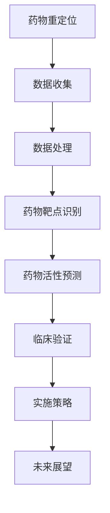

                 

# 《AI驱动的药物重定位：从大数据分析到临床验证》

## 关键词
- AI药物重定位
- 大数据分析
- 机器学习
- 深度学习
- 临床验证
- 药物靶点识别
- 药物活性预测

## 摘要
本文旨在探讨AI技术在药物重定位中的应用，从大数据分析、机器学习和深度学习技术出发，详细解析AI驱动的药物重定位流程，并通过实际案例展示其应用效果。文章将讨论AI驱动的药物重定位的基础知识、核心技术、流程以及面临的挑战和未来发展趋势，为读者提供一个全面的技术视角。

## 《AI驱动的药物重定位：从大数据分析到临床验证》目录大纲

### 第一部分：AI驱动的药物重定位基础

#### 第1章：AI与药物重定位概述
- 1.1 AI在药物研发中的作用
  - 1.1.1 AI与药物研发的融合
  - 1.1.2 AI在药物重定位中的优势
- 1.2 药物重定位的定义与背景
  - 1.2.1 药物重定位的概念
  - 1.2.2 药物重定位的发展历程
  - 1.2.3 药物重定位的重要性

#### 第2章：AI驱动的药物重定位技术
- 2.1 大数据分析与药物重定位
  - 2.1.1 大数据分析的基本原理
  - 2.1.2 大数据分析在药物重定位中的应用
- 2.2 机器学习与药物重定位
  - 2.2.1 机器学习的基本原理
  - 2.2.2 机器学习在药物重定位中的应用
- 2.3 深度学习与药物重定位
  - 2.3.1 深度学习的基本原理
  - 2.3.2 深度学习在药物重定位中的应用

#### 第3章：AI驱动的药物重定位流程
- 3.1 数据收集与处理
  - 3.1.1 数据收集的挑战与策略
  - 3.1.2 数据处理的流程与技巧
- 3.2 药物靶点识别
  - 3.2.1 药物靶点的概念与分类
  - 3.2.2 药物靶点识别的方法与算法
- 3.3 药物活性预测
  - 3.3.1 药物活性预测的意义
  - 3.3.2 药物活性预测的方法与算法

#### 第4章：AI驱动的药物重定位案例分析
- 4.1 案例分析1：基于AI的癌症药物重定位
  - 4.1.1 案例背景
  - 4.1.2 案例流程
  - 4.1.3 案例结果分析
- 4.2 案例分析2：基于AI的抗病毒药物重定位
  - 4.2.1 案例背景
  - 4.2.2 案例流程
  - 4.2.3 案例结果分析

### 第二部分：临床验证与实施

#### 第5章：AI驱动的药物重定位临床验证
- 5.1 临床验证的基本概念
  - 5.1.1 临床验证的定义
  - 5.1.2 临床验证的意义
- 5.2 AI驱动的药物重定位临床验证流程
  - 5.2.1 临床验证的数据收集与处理
  - 5.2.2 临床验证的实验设计
  - 5.2.3 临床验证的数据分析

#### 第6章：AI驱动的药物重定位实施策略
- 6.1 企业实施AI药物重定位的策略
  - 6.1.1 研发流程的整合
  - 6.1.2 跨学科团队的协作
  - 6.1.3 专利与知识产权的保护
- 6.2 政策与法规对AI药物重定位的影响
  - 6.2.1 国内外政策法规的对比
  - 6.2.2 对AI药物重定位的监管挑战与对策

#### 第7章：AI驱动的药物重定位未来发展
- 7.1 AI药物重定位的未来趋势
  - 7.1.1 技术创新的方向
  - 7.1.2 应用场景的拓展
  - 7.1.3 政策环境的优化
- 7.2 AI药物重定位面临的挑战与解决方案
  - 7.2.1 数据隐私与伦理问题
  - 7.2.2 技术成熟度与商业化挑战
  - 7.2.3 持续改进的策略与方法

### 附录

## 附录A：AI药物重定位工具与资源
- A.1 主流AI药物重定位工具介绍
  - A.1.1 DeepLearning.AI
  - A.1.2 DrugPredict
  - A.1.3 其他常用工具简介
- A.2 药物重定位相关数据集与数据库
  - A.2.1 Genomics England Data Portal
  - A.2.2 TTD (Therapeutic Target Database)
  - A.2.3 其他常用数据库简介

### B. 核心概念与联系
- 药物重定位的Mermaid流程图



### C. 核心算法原理讲解
- 药物活性预测的伪代码

```python
# 数据预处理
def preprocess_data(data):
    # 对数据进行标准化处理、缺失值填充等操作
    pass

# 药物活性预测模型
def predict_activity(features, model):
    # 使用训练好的模型对药物活性进行预测
    return model.predict(features)

# 训练模型
def train_model(train_data, train_labels):
    # 使用机器学习算法训练模型
    model = ...
    model.fit(train_data, train_labels)
    return model

# 主函数
def main():
    # 读取数据
    data = read_data("data.csv")
    # 数据预处理
    preprocessed_data = preprocess_data(data)
    # 分割数据集
    train_data, test_data, train_labels, test_labels = split_data(preprocessed_data)
    # 训练模型
    model = train_model(train_data, train_labels)
    # 预测药物活性
    predicted_activities = predict_activity(test_data, model)
    # 评估模型性能
    evaluate_model(predicted_activities, test_labels)

# 执行主函数
main()
```

### D. 项目实战
- 开发环境搭建、源代码详细实现和代码解读、实际案例分析和详细讲解剖析、项目小结等内容将逐步在后续章节中进行详细阐述。

### E. 最佳实践 Tips、小结、注意事项、拓展阅读等内容
- 将在文章的各个章节中给出最佳实践建议、小结、注意事项，以及拓展阅读推荐，以帮助读者更深入地理解和应用AI驱动的药物重定位技术。

