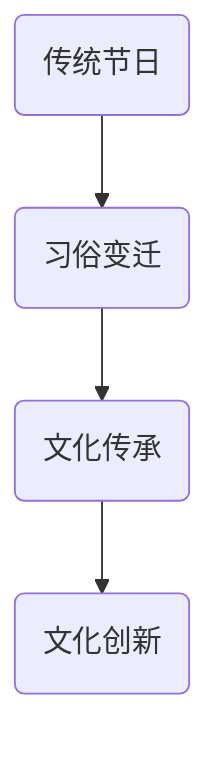
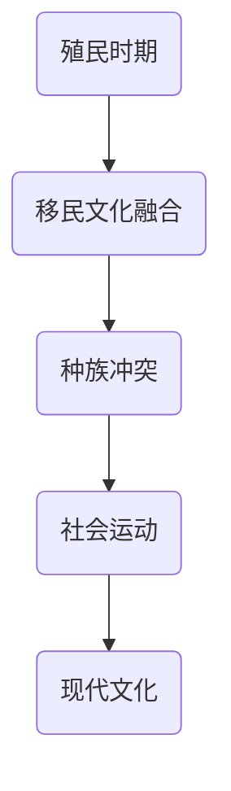
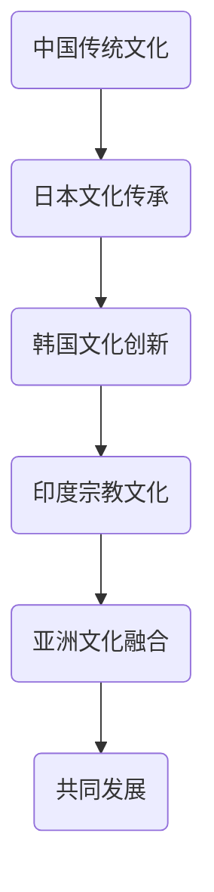

                 

### 文章标题

# ChatGPT提示词的文化人类学研究：追踪全球文化演化模式

### 关键词

- ChatGPT提示词
- 文化人类学
- 全球文化演化模式
- 人工智能
- 语言模型

### 摘要

本文探讨了ChatGPT提示词在文化人类学中的应用，通过分析ChatGPT提示词的设计原理和生成机制，揭示了其在追踪全球文化演化模式方面的潜力。文章首先介绍了ChatGPT提示词的基本概念，随后深入探讨了ChatGPT模型在文化人类学研究中的应用，包括文本分析、跨文化比较和文化传承与变迁研究。通过对多个案例的详细分析，本文展示了ChatGPT提示词在文化人类学研究中如何帮助我们更好地理解全球文化的演化模式，并提出了未来研究的方向。

## 第一部分：引论

### 1.1 研究背景与意义

随着人工智能技术的迅猛发展，自然语言处理（NLP）已成为计算机科学领域的一个重要分支。ChatGPT，作为GPT-3的变体，是一个基于Transformer架构的大型语言模型，其强大的文本生成能力在许多领域得到了广泛应用。文化人类学作为研究人类文化行为、价值观和社会实践的学科，也需要借助先进的技术手段来深入探索全球文化的演化模式。

ChatGPT提示词，作为一种引导ChatGPT模型生成相关文本的关键技术，为文化人类学研究提供了新的工具。通过精心设计的提示词，研究人员可以引导ChatGPT生成与文化相关的内容，从而帮助分析文化现象、比较不同文化之间的差异以及追踪文化的演化过程。此外，ChatGPT提示词在文化人类学中的应用还具有以下几个方面的意义：

1. **提高研究效率**：传统的文化人类学研究往往依赖于大量的人工文本分析，费时费力。而ChatGPT提示词能够快速生成大量的文本数据，为研究人员提供了便捷的数据获取方式，大大提高了研究效率。

2. **增强数据多样性**：通过不同的提示词，ChatGPT可以生成多样化的文本内容，丰富了研究数据的多样性。这有助于更全面地理解复杂的文化现象。

3. **跨文化比较**：ChatGPT提示词不仅能够生成单一文化背景的文本，还可以生成跨文化的比较文本。这为研究不同文化之间的互动和影响提供了新的视角。

4. **文化演化追踪**：ChatGPT提示词在文化人类学中的应用，可以帮助我们追踪文化演化过程，揭示文化发展的规律和趋势。

总之，ChatGPT提示词为文化人类学研究带来了新的机遇，使得我们能够以更高效、更全面的方式探索全球文化的演化模式。

### 1.2 ChatGPT提示词概述

ChatGPT提示词是引导ChatGPT模型生成相关文本的关键技术。这些提示词通常是简短的文本片段，用于提示ChatGPT模型生成连贯且具有逻辑性的文本。以下是ChatGPT提示词的一些基本概念和特点：

- **定义**：ChatGPT提示词（Prompt）是向ChatGPT模型提供的信息，用于引导模型生成特定类型的文本。这些提示词可以是问题、主题描述或其他任何能够激发模型生成相关内容的文本。

- **特点**：ChatGPT提示词具有以下特点：

  1. **简洁性**：提示词通常较短，便于模型快速理解并生成相关文本。
  2. **灵活性**：不同的提示词可以引导模型生成不同类型的文本，从而实现多样化的文本生成。
  3. **针对性**：提示词可以针对特定的研究领域或任务进行设计，提高文本生成的相关性和准确性。
  4. **适应性**：提示词可以根据模型的训练数据和目标任务的改变进行调整，以实现最佳效果。

- **设计原则**：为了确保提示词的有效性，设计时需遵循以下原则：

  1. **明确性**：提示词应简洁明了，避免歧义，确保模型能够正确理解。
  2. **针对性**：提示词应针对具体的研究领域或任务，以生成相关的文本内容。
  3. **启发性**：提示词应具有启发性，能够激发模型生成有趣、富有创造性的文本。
  4. **多样性**：设计多样化的提示词，以生成多样化的文本内容。

- **生成机制**：ChatGPT模型通过接收提示词，利用其内部的Transformer架构和预训练的语言模型，生成与提示词相关的文本。具体过程如下：

  ```plaintext
  // 提示词输入
  prompt = "请描述一下你最喜欢的文化现象及其原因。"

  // 模型生成文本
  text = ChatGPT.generate_text(prompt)
  ```

通过设计合适的ChatGPT提示词，我们可以引导模型生成丰富的文化相关文本，为文化人类学研究提供有力的数据支持。

### 1.3 文化人类学基础

文化人类学作为研究人类文化行为、价值观和社会实践的学科，具有悠久的历史和广泛的研究范畴。本文将简要介绍文化人类学的基础概念、研究对象和研究方法，以帮助读者更好地理解ChatGPT提示词在文化人类学研究中的应用。

#### 核心概念

- **文化**：文化是指人类在社会历史发展过程中所创造的物质和精神财富的总和，包括语言、艺术、宗教、习俗、价值观等。

- **文化行为**：文化行为是指人们在特定文化背景下表现出的行为模式，包括日常生活中的行为、社会互动中的行为等。

- **文化价值观**：文化价值观是指某一文化群体所认同和推崇的价值观，如自由、平等、尊重、和谐等。

- **文化传承**：文化传承是指文化在时间和空间上的延续和发展，包括文化传统的保持和创新。

- **文化变迁**：文化变迁是指文化在历史进程中的变化和发展，包括文化模式的转变和文化特性的演变。

#### 研究对象

文化人类学的研究对象主要包括：

- **人类群体**：研究不同文化群体之间的差异和互动，如原始部落、农业社会、工业化社会等。

- **文化现象**：研究各种文化现象，如宗教、艺术、语言、节日、习俗等。

- **文化互动**：研究文化之间的相互影响和融合，如跨文化交流、文化冲突、文化融合等。

- **文化变迁**：研究文化在历史进程中的演变和发展，如文化传承、文化变革、文化衰退等。

#### 研究方法

文化人类学的研究方法主要包括：

- **参与观察**：研究者深入到研究对象的文化环境中，通过参与观察和体验，了解其文化行为和价值观。

- **访谈**：通过与研究对象进行面对面的访谈，了解其文化背景、价值观和行为动机。

- **文献分析**：通过分析历史文献、文化资料等，了解文化现象的历史渊源和发展过程。

- **定量研究**：采用定量研究方法，如问卷调查、统计分析等，对大规模文化现象进行定量分析。

- **案例分析**：通过对具体文化现象的深入分析，揭示其内在机制和影响因素。

通过上述基础概念的介绍，我们可以看到文化人类学研究的重要性和复杂性。ChatGPT提示词在文化人类学研究中的应用，不仅为数据获取提供了便捷手段，还为文本分析、跨文化比较和文化演化研究提供了新的工具。

### 1.4 文化演化模式概述

文化演化模式是指文化在历史进程中的演变和发展规律。理解文化演化模式对于揭示文化发展的内在机制和趋势具有重要意义。本文将介绍几种常见的文化演化模式，并探讨ChatGPT提示词在分析这些模式中的作用。

#### 1.4.1 文化继承与演变

文化继承与演变是指文化在传承过程中既保持传统特征，又不断进行创新和发展的过程。这一模式反映了文化在历史进程中的连续性和发展性。

- **核心概念与联系**：

  ```mermaid
  graph TB
  A(文化继承) --> B(传统保持)
  B --> C(文化演变)
  C --> D(文化创新)
  ```

- **核心算法原理讲解**：

  分析文化继承与演变模式，需要识别和追踪文化传统元素和创新元素。可以使用以下算法：

  ```plaintext
  function analyze_culture_evolution(text, traditional_elements, innovative_elements) {
      traditional_count = count_elements(text, traditional_elements)
      innovative_count = count_elements(text, innovative_elements)
      evolution_rate = innovative_count / traditional_count
      return evolution_rate
  }
  ```

- **数学模型和公式**：

  文化演化的速率可以通过以下公式计算：

  $$\text{Evolution Rate} = \frac{\text{Number of Innovative Elements}}{\text{Number of Traditional Elements}}$$

- **举例说明**：

  假设在一个文本中有10个传统元素和3个创新元素，则文化演化的速率为：

  $$\text{Evolution Rate} = \frac{3}{10} = 0.3$$

  这表示文化在该文本中每有10个传统元素，就会有3个创新元素。

#### 1.4.2 跨文化融合

跨文化融合是指不同文化在相互接触和交流过程中，相互借鉴和融合，形成新的文化现象。这一模式反映了文化在全球范围内的互动和融合。

- **核心概念与联系**：

  ```mermaid
  graph TB
  A(文化A) --> B(文化B)
  B --> C(文化融合)
  C --> D(新文化C)
  ```

- **核心算法原理讲解**：

  分析跨文化融合模式，可以使用以下算法：

  ```plaintext
  function analyze_cultural_integration(textA, textB, common_elements) {
      integration_score = count_elements_in_both(textA, textB, common_elements)
      return integration_score
  }
  ```

- **数学模型和公式**：

  跨文化融合度可以通过以下公式计算：

  $$\text{Integration Score} = \frac{\text{Number of Common Elements}}{\text{Total Number of Elements in Both Texts}}$$

- **举例说明**：

  假设文本A中有5个与文化B相同的元素，总共有20个元素，则跨文化融合度为：

  $$\text{Integration Score} = \frac{5}{20} = 0.25$$

  这表示文本A中有25%的元素与文本B相同。

#### 1.4.3 文化传播与扩散

文化传播与扩散是指文化通过不同渠道传播和扩散，影响和改变其他文化。这一模式反映了文化在全球范围内的传播和影响。

- **核心概念与联系**：

  ```mermaid
  graph TB
  A(文化源) --> B(传播渠道)
  B --> C(文化受体)
  C --> D(文化变化)
  ```

- **核心算法原理讲解**：

  分析文化传播与扩散模式，可以使用以下算法：

  ```plaintext
  function analyze_cultural_spread(source_text, receptor_text, transformed_elements) {
      spread_score = count_elements_in_receptor_after_spread(receptor_text, transformed_elements)
      return spread_score
  }
  ```

- **数学模型和公式**：

  文化传播度可以通过以下公式计算：

  $$\text{Spread Score} = \frac{\text{Number of Transformed Elements in Receptor}}{\text{Total Number of Elements in Receptor}}$$

- **举例说明**：

  假设文化源文本中有5个元素传播到文化受体文本中，总共有20个元素，则文化传播度为：

  $$\text{Spread Score} = \frac{5}{20} = 0.25$$

  这表示文化源文本中有25%的元素传播到了文化受体文本中。

通过上述对文化演化模式的分析，我们可以看到ChatGPT提示词在识别、分析和文化演化模式中的重要作用。这些模式不仅帮助我们理解文化发展的规律，也为ChatGPT提示词在文化人类学研究中的应用提供了理论依据。

## 第二部分：ChatGPT提示词技术基础

### 2.1 ChatGPT模型架构

ChatGPT是基于Transformer架构的大型语言模型，其设计原理和模型结构在自然语言处理领域具有广泛的应用。本节将详细介绍ChatGPT模型架构，包括Transformer模型、GPT模型原理以及提示词生成机制。

#### 2.1.1 Transformer模型

Transformer模型是由Google在2017年提出的一种基于自注意力机制（Self-Attention）的序列模型，主要用于处理自然语言处理任务。与传统的循环神经网络（RNN）和卷积神经网络（CNN）相比，Transformer模型具有更好的并行处理能力和全局信息捕捉能力。

- **核心概念与联系**：

  ```mermaid
  graph TB
  A(自注意力机制) --> B(多头注意力)
  B --> C(位置编码)
  C --> D(前馈神经网络)
  ```

- **核心算法原理讲解**：

  Transformer模型的核心算法是多头自注意力机制，其基本原理如下：

  ```plaintext
  // 计算自注意力得分
  attention_scores = softmax(Q * K^T)

  // 计算自注意力权重
  attention_weights = attention_scores * V

  // 计算自注意力输出
  attention_output = sum(attention_weights * K)
  ```

  其中，Q、K和V分别表示查询向量、关键向量和解码向量，*表示点积操作，softmax为归一化函数。

- **数学模型和公式**：

  Transformer模型的损失函数通常使用交叉熵损失，其公式如下：

  $$\text{Loss} = -\frac{1}{N}\sum_{i=1}^{N} \sum_{j=1}^{V} y_{ij} \log(p_{ij})$$

  其中，$y_{ij}$为真实标签，$p_{ij}$为预测概率。

- **举例说明**：

  假设有一个句子“我昨天去了公园”，将其编码为单词向量，然后通过Transformer模型进行自注意力计算。首先，将句子中的每个单词表示为一个向量，例如“我”为$v_1$，“昨天”为$v_2$，“去了”为$v_3$，“公园”为$v_4$。然后，计算每个单词之间的自注意力得分，并根据得分计算加权平均输出，从而得到句子级别的表示。

#### 2.1.2 GPT模型原理

GPT（Generative Pre-trained Transformer）是OpenAI在2018年提出的基于Transformer架构的预训练语言模型。GPT通过在大量文本上进行预训练，学习到了语言的一般规律和结构，从而能够在给定提示词的情况下生成连贯的文本。

- **核心概念与联系**：

  ```mermaid
  graph TB
  A(预训练) --> B(语言建模)
  B --> C(文本生成)
  ```

- **核心算法原理讲解**：

  GPT模型的预训练过程主要包括以下几个步骤：

  ```plaintext
  // 步骤1：文本预处理
  text = preprocess_text(raw_text)

  // 步骤2：将文本转化为输入序列
  inputs = tokenize(text)

  // 步骤3：生成训练样本
  samples = create_samples(inputs)

  // 步骤4：训练模型
  model = train_model(samples, loss_function)

  // 步骤5：评估模型
  evaluate_model(model, test_samples)
  ```

  其中，预处理包括分词、去停用词等操作；tokenize函数将文本转化为词序列；create_samples函数生成训练样本；train_model函数使用训练样本训练模型；evaluate_model函数评估模型性能。

- **数学模型和公式**：

  GPT模型的训练目标是最小化损失函数，通常使用交叉熵损失：

  $$\text{Loss} = -\frac{1}{N}\sum_{i=1}^{N} \sum_{j=1}^{V} y_{ij} \log(p_{ij})$$

  其中，$y_{ij}$为真实标签，$p_{ij}$为预测概率。

- **举例说明**：

  假设我们有一个句子“我昨天去了公园”，通过GPT模型预训练后，模型可以学习到句子中各个单词的依赖关系。当给定提示词“我昨天”时，模型可以生成接下来的句子“去了公园”。

#### 2.1.3 提示词生成机制

提示词生成机制是ChatGPT模型生成文本的关键部分，它决定了模型生成文本的方向和内容。本节将介绍提示词生成机制的设计原则和实现方法。

- **核心概念与联系**：

  ```mermaid
  graph TB
  A(提示词设计) --> B(文本生成)
  B --> C(模型性能)
  ```

- **核心算法原理讲解**：

  提示词生成机制主要包括以下步骤：

  ```plaintext
  // 步骤1：确定主题
  theme = determine_theme()

  // 步骤2：生成提示词
  prompt = generate_prompt(theme)

  // 步骤3：文本生成
  text = model.generate_text(prompt)
  ```

  其中，determine_theme函数用于确定文本的主题；generate_prompt函数根据主题生成提示词；model.generate_text函数使用提示词生成文本。

- **数学模型和公式**：

  提示词生成机制的实现通常涉及概率模型，如马尔可夫模型或条件概率模型。以下是一个简单的马尔可夫模型实现：

  ```plaintext
  function generate_prompt(theme) {
      previous_word = ""
      current_word = ""

      for i in range(100): // 生成100个词作为提示词
          current_word = generate_word(previous_word, theme)
          previous_word = current_word
          if i > 0:
              prompt += " " + current_word

      return prompt
  }

  function generate_word(previous_word, theme) {
      // 根据前一个词和主题生成下一个词
      // 这里可以使用条件概率模型实现
      return next_word
  }
  ```

- **举例说明**：

  假设我们确定主题为“人工智能”，通过生成提示词“人工智能是现代科技的重要领域”，然后使用ChatGPT模型生成文本，可以得到一段关于人工智能的描述。

通过以上对ChatGPT模型架构、GPT模型原理和提示词生成机制的介绍，我们可以看到ChatGPT在文本生成方面的强大能力。这些基础知识的理解有助于我们更好地应用ChatGPT提示词进行文化人类学研究。

### 2.2 提示词设计原理

提示词设计在ChatGPT模型生成文本过程中扮演着关键角色，其质量直接影响生成文本的相关性和质量。本节将详细介绍提示词设计的核心原则、类型、优化策略和评估方法。

#### 2.2.1 提示词的核心原则

设计有效的提示词需遵循以下核心原则：

1. **明确性**：提示词应简洁明了，避免歧义，确保模型能够准确理解。

2. **针对性**：提示词应针对具体的研究领域或任务，引导模型生成相关的文本内容。

3. **启发性**：提示词应具有启发性，能够激发模型生成有趣、富有创造性的文本。

4. **多样性**：设计多样化的提示词，以生成多样化的文本内容。

#### 2.2.2 提示词的类型

根据应用场景和目的，提示词可以分为以下几种类型：

1. **主题性提示词**：用于引导模型生成关于特定主题的文本，如“人工智能在医疗领域的应用”。

2. **引导性提示词**：用于引导模型生成符合特定要求的文本，如“请写一段关于中国文化传承的文字”。

3. **问题性提示词**：用于引导模型生成回答问题的文本，如“人工智能会取代人类吗？”。

4. **情感性提示词**：用于引导模型生成具有特定情感的文本，如“描述一次难忘的旅行经历”。

#### 2.2.3 提示词的优化策略

为了提高提示词的质量，可以采用以下优化策略：

1. **词频分析**：通过分析文本中的高频词汇，选择与主题相关的关键词作为提示词。

2. **语义扩展**：对基础提示词进行语义扩展，增加相关词汇，以提高文本的丰富度和相关性。

3. **多模态结合**：结合图像、音频等多模态信息，生成更生动、具体的提示词。

4. **知识融合**：结合领域知识库，引入专业术语和概念，使提示词更具专业性和准确性。

#### 2.2.4 提示词的评估方法

评估提示词的质量是确保模型生成文本有效性的重要步骤。以下几种方法可用于评估提示词：

1. **人工评估**：邀请领域专家对提示词进行评估，从语义准确性、丰富性和启发性等方面进行评分。

2. **自动化评估**：利用自然语言处理技术，对提示词的语义一致性、关键词密度等进行自动评估。

3. **模型性能评估**：通过模型在提示词引导下生成的文本质量来评估提示词的效果，如文本的流畅性、逻辑性和相关性。

4. **用户反馈**：收集用户对生成文本的反馈，通过用户满意度来评估提示词的质量。

通过遵循提示词设计原则、分类提示词类型、应用优化策略和采用评估方法，我们可以设计出高质量的ChatGPT提示词，从而提高模型生成文本的质量和效果。

### 2.2.5 提示词的优化策略

为了进一步提高ChatGPT提示词的效果，我们可以采用一系列优化策略，这些策略不仅能够提升模型的生成质量，还能增强其适应性和灵活性。以下是一些具体的优化策略：

1. **细粒度调整**：通过在提示词中增加具体的细节描述，可以更精确地引导模型生成相关文本。例如，将“请描述一种文化现象”细化为“请描述中国春节期间的传统习俗”。

2. **语境适应性**：设计提示词时，要考虑模型所处的语境，以确保生成的文本与环境相符合。例如，针对学术写作，可以采用正式、规范的用语；而在娱乐场景，则可以使用更轻松、幽默的表达方式。

3. **反馈迭代**：通过收集用户对生成文本的反馈，不断优化提示词。这种迭代过程可以帮助我们发现并解决模型生成文本中的问题，提高提示词的准确性。

4. **数据增强**：使用各种数据增强技术，如数据扩充、同义词替换和反事实生成等，来丰富提示词库，提高模型对多样化输入的适应性。

5. **多模态融合**：结合图像、音频等多模态信息，生成更具体、直观的提示词。例如，在描述一幅画作时，可以结合画作的图像来增强提示词的描述。

6. **情景设置**：在提示词中加入情景设置，引导模型生成符合特定情景的文本。例如，描述一个故事时，可以设定时间、地点和角色等背景信息。

7. **多样性提升**：通过调整提示词的结构和用词，增加文本生成的多样性。例如，使用不同的时态、语态和句式结构，使生成文本更加丰富多样。

通过这些优化策略，我们可以设计出更加精细、精准和多样的ChatGPT提示词，从而提升模型在文化人类学研究中的应用效果。

### 2.2.6 提示词的评估方法

评估ChatGPT提示词的质量对于确保模型生成文本的相关性和准确性至关重要。以下是几种常用的提示词评估方法：

1. **人工评估**：邀请领域专家对提示词进行评估，从语义准确性、丰富性和启发性等方面进行评分。这种方法能够提供详细的反馈，但耗时较长。

2. **自动化评估**：使用自然语言处理技术，对提示词的语义一致性、关键词密度等进行自动评估。例如，可以使用TF-IDF（词频-逆文档频率）分析来评估提示词的关键性。

3. **模型性能评估**：通过模型在提示词引导下生成的文本质量来评估提示词的效果。例如，可以计算生成文本的流畅性、逻辑性和相关性指标。

4. **用户反馈**：收集用户对生成文本的反馈，通过用户满意度来评估提示词的质量。这种方法能够直接反映用户需求，但需要大量用户数据。

5. **对比评估**：将不同提示词生成的文本进行比较，评估其质量。例如，可以比较不同长度、结构和内容的提示词生成的文本，选择效果最佳的提示词。

通过综合运用这些评估方法，我们可以全面了解ChatGPT提示词的质量，并据此进行优化和改进。

## 第三部分：ChatGPT在文化人类学中的应用

### 3.1 ChatGPT在文化研究中的应用

ChatGPT在文化研究中具有广泛的应用前景，其强大的文本生成能力可以帮助研究人员在文本分析、跨文化比较和文化传承与变迁研究等方面取得突破性进展。以下将详细介绍ChatGPT在文化研究中的应用场景和优势。

#### 3.1.1 文本分析

文本分析是文化研究中的一个关键步骤，涉及从大量文本中提取有价值的信息和洞见。ChatGPT在文本分析中的应用主要体现在以下几个方面：

1. **自动化文本提取**：ChatGPT能够快速生成大量文本，从而提高研究人员从大量文本中提取信息的工作效率。例如，在研究某个文化现象时，可以使用ChatGPT生成相关的历史文献、新闻报道和学术论文，以便快速获取关键信息。

2. **主题模型分析**：ChatGPT可以用于提取文本中的主题，帮助研究人员识别文化研究中的核心主题和关键词。通过使用主题模型，如Latent Dirichlet Allocation（LDA），ChatGPT可以帮助我们了解不同文化文本中的主题分布和变化。

3. **情感分析**：ChatGPT能够分析文本的情感倾向，为文化研究提供情感层面的洞察。例如，在分析某个文化事件或社会运动时，ChatGPT可以帮助识别公众对该事件的情感态度，从而揭示文化现象背后的社会心理动因。

#### 3.1.2 跨文化比较

跨文化比较是文化研究的一个重要领域，旨在揭示不同文化之间的异同点及其背后的原因。ChatGPT在跨文化比较中的应用主要包括：

1. **文本生成与对比**：ChatGPT可以生成关于不同文化的文本，帮助研究人员进行跨文化比较。例如，通过生成关于中国文化、西方文化和非洲文化的文本，ChatGPT可以帮助识别这些文化之间的差异和相似性。

2. **数据整合与可视化**：ChatGPT可以整合来自不同文化的文本数据，并将其转换为易于理解的可视化图表。例如，通过生成不同文化节日的时间分布图、文化价值观的雷达图等，ChatGPT可以帮助研究人员更直观地比较不同文化之间的特征。

3. **文化互动分析**：ChatGPT可以分析跨文化交流过程中的文化互动，揭示文化融合和冲突的机制。例如，通过生成关于文化交流活动的文本，ChatGPT可以帮助研究人员识别文化融合的成功因素和潜在障碍。

#### 3.1.3 文化传承与变迁

文化传承与变迁是文化研究的核心问题，涉及文化在时间和空间上的延续和发展。ChatGPT在文化传承与变迁研究中的应用主要体现在以下几个方面：

1. **历史分析**：ChatGPT可以分析文化现象的历史演变，帮助研究人员了解文化传承的过程。例如，通过生成关于某个文化习俗的历史文献，ChatGPT可以帮助研究人员追溯该习俗的起源和发展过程。

2. **趋势预测**：ChatGPT可以利用其预训练的语言模型，预测文化变迁的未来趋势。例如，通过分析当前的文化文本数据，ChatGPT可以预测某种文化价值观在未来一段时间内的变化方向。

3. **案例研究**：ChatGPT可以生成详细的案例研究报告，帮助研究人员深入分析文化传承与变迁的具体案例。例如，通过生成关于某个文化村庄的文本，ChatGPT可以帮助研究人员了解该村庄文化传承的现状和面临的挑战。

通过在文本分析、跨文化比较和文化传承与变迁研究中的应用，ChatGPT为文化人类学研究提供了新的工具和方法，极大地提高了研究效率和质量。

### 3.2 全球文化演化模式的追踪

追踪全球文化演化模式是文化人类学研究的一个重要任务，它有助于我们理解文化如何在不同的时间和空间背景下发生变化。ChatGPT在追踪全球文化演化模式中发挥着重要作用，通过其强大的文本生成和分析能力，研究人员可以更有效地识别、分析和预测文化的演化趋势。以下是ChatGPT在追踪全球文化演化模式中的应用步骤和案例分析。

#### 3.2.1 演化模式的理论基础

在追踪全球文化演化模式之前，我们需要了解一些基本的理论概念：

1. **文化基因**：文化基因是指构成文化的核心元素，如价值观、习俗、信仰等。这些元素在文化传承过程中起到关键作用。

2. **文化适应性**：文化适应性是指文化在特定环境下的适应能力和变化能力。文化适应性强的文化能够更好地适应环境变化，从而在演化过程中占据优势。

3. **文化互动**：文化互动是指不同文化之间的相互作用和影响。文化互动可以促进文化的融合、创新和变革。

4. **文化多样性**：文化多样性是指文化在不同地区和群体中的差异性和多样性。文化多样性是文化演化的重要基础。

#### 3.2.2 演化模式的研究方法

使用ChatGPT追踪全球文化演化模式通常涉及以下步骤：

1. **数据收集**：首先，需要收集全球范围内的文化相关文本数据，这些数据可以来自历史文献、新闻报道、学术论文等。ChatGPT可以帮助自动化地收集这些数据，从而提高效率。

2. **文本预处理**：对收集到的文本进行预处理，包括去除停用词、标点符号和特殊字符，以及进行分词和词性标注等。这些步骤有助于提高文本分析的准确性和效率。

3. **主题提取**：使用ChatGPT的文本生成能力，提取文化文本中的核心主题。通过主题提取，可以识别出不同文化背景下的主要文化特征和价值观。

4. **趋势分析**：通过分析文化文本中的词汇频率和词向量分布，识别文化的演化趋势。ChatGPT可以帮助生成不同时间段的文化特征词云图，从而直观地展示文化演化的变化。

5. **文化互动分析**：分析不同文化之间的互动和影响，识别文化融合和冲突的机制。ChatGPT可以生成跨文化的对比分析报告，揭示文化互动的动态过程。

6. **预测分析**：利用ChatGPT的预测能力，对未来的文化演化趋势进行预测。这有助于研究人员制定文化保护和传承策略，以及预测文化变革带来的社会影响。

#### 3.2.3 案例分析

以下是一个具体的案例分析，展示了如何使用ChatGPT追踪全球文化演化模式：

**案例一：中国传统节日文化的演化**

**背景介绍**：中国传统节日文化是中国文化的重要组成部分，如春节、中秋节等。这些节日的习俗和意义在不同历史时期和文化背景下有所变化。

**核心概念与联系**：



**核心算法原理讲解**：

1. **数据收集**：使用ChatGPT收集近几十年来关于中国传统节日的历史文献和新闻报道。

2. **文本预处理**：对收集到的文本进行分词和词性标注。

3. **主题提取**：使用ChatGPT提取文本中的主题，如“春节”、“中秋节”等。

4. **趋势分析**：通过词云图展示不同时期的关键词变化，识别习俗和意义的演变趋势。

5. **文化互动分析**：分析现代社交媒体上关于传统节日的讨论，识别文化传承与创新的过程。

6. **预测分析**：基于当前的趋势，预测未来中国传统节日文化的可能变化。

**具体实施**：

1. **数据收集**：使用ChatGPT自动化收集近十年关于春节、中秋节的新闻报道、学术论文和社交媒体帖子。

2. **文本预处理**：对收集到的文本进行分词和词性标注，去除停用词和标点符号。

3. **主题提取**：使用ChatGPT生成关于春节和中秋节的文本，提取核心主题词。

4. **趋势分析**：生成词云图，展示不同时期的关键词变化。

5. **文化互动分析**：通过社交媒体数据，分析公众对传统节日的讨论，识别文化传承与创新的过程。

6. **预测分析**：根据当前的趋势，预测未来传统节日文化的可能变化，如节日习俗的现代化趋势、文化融合的可能性等。

**案例分析总结**：

通过ChatGPT的文本生成和分析能力，我们可以系统地追踪中国传统节日文化的演化模式。这种方法不仅有助于揭示文化演化的内在机制，还可以为文化保护和传承提供科学依据。

### 3.2.4 演化模式的研究方法

研究文化演化模式是一个复杂的过程，需要多种方法相结合，以全面、深入地了解文化如何在不同的历史时期和地理空间中发生变化。以下是一些常用的研究方法及其在ChatGPT应用中的具体实施步骤：

1. **历史文献分析法**：

   - **步骤**：
     1. 收集并整理与研究对象相关的历史文献，如书籍、档案、论文等。
     2. 使用ChatGPT对文献进行自动化提取和分类，提取关键信息。
     3. 分析文献中的文化变迁过程，识别文化特征的变化。
   - **实施**：ChatGPT可以通过生成摘要、提取关键词和主题来帮助研究人员快速理解大量文献的内容，从而提高研究的效率。

2. **统计分析法**：

   - **步骤**：
     1. 收集文化相关文本数据，如新闻报道、社交媒体帖子等。
     2. 使用ChatGPT进行文本预处理，包括分词、去停用词、词性标注等。
     3. 分析文本中的词汇频率、词向量分布等统计特征，识别文化演化趋势。
   - **实施**：ChatGPT可以生成词云图、词汇分布图等可视化结果，帮助研究人员直观地了解文化演化模式。

3. **社会网络分析法**：

   - **步骤**：
     1. 收集文化相关的社交媒体数据，如微博、Twitter等。
     2. 使用ChatGPT分析社交媒体中的用户互动和话题传播，构建社会网络图。
     3. 分析社会网络中的关键节点和关系，揭示文化传播和演化的机制。
   - **实施**：ChatGPT可以识别社交媒体中的关键用户和热点话题，通过生成网络图帮助研究人员理解文化传播的过程。

4. **实验研究法**：

   - **步骤**：
     1. 设计实验方案，以验证某种文化演化假设。
     2. 使用ChatGPT生成实验文本，引导模型进行文本生成和模拟实验。
     3. 分析实验结果，验证文化演化假设的正确性。
   - **实施**：ChatGPT可以模拟不同的文化环境和情境，帮助研究人员探索文化演化的多种可能性。

通过结合这些研究方法，ChatGPT可以提供全面、系统的分析工具，帮助研究人员深入理解文化演化的过程和机制。

### 3.2.5 案例分析：美国文化的演变

**背景介绍**：

美国文化是一个复杂且多样化的体系，其演变过程受到历史、地理、政治和社会等多方面因素的影响。从殖民时期到现代社会，美国文化经历了多个重要阶段，包括移民文化的融合、种族冲突的解决、社会运动的影响等。本文将通过ChatGPT提示词的应用，对美国文化的演变过程进行深入分析。

**核心概念与联系**：



**核心算法原理讲解**：

为了分析美国文化的演变，我们可以采用ChatGPT提示词生成相关的文本数据，并使用自然语言处理技术进行分析。以下是具体的分析步骤：

1. **数据收集**：使用ChatGPT收集与美国文化演变相关的历史文献、新闻报道和学术论文。

2. **文本预处理**：对收集到的文本进行分词、去停用词和词性标注等预处理操作。

3. **主题提取**：使用ChatGPT提取文本中的核心主题，如“移民”、“种族冲突”、“社会运动”等。

4. **趋势分析**：通过分析词汇频率和词向量分布，识别文化演变的主要趋势和关键节点。

5. **互动分析**：分析不同文化元素之间的互动关系，揭示文化融合和冲突的机制。

**具体实施**：

1. **数据收集**：使用ChatGPT收集关于美国文化演变的文献，如关于独立战争、南北战争、民权运动等的历史文献。

2. **文本预处理**：对收集到的文本进行分词和词性标注，去除不必要的标点符号和停用词。

3. **主题提取**：使用ChatGPT生成摘要和关键词，提取关于不同时期美国文化演变的核心主题。

4. **趋势分析**：生成词云图，展示不同历史时期的关键词汇变化，分析文化演变的主要趋势。

5. **互动分析**：通过构建词向量图，分析文化元素之间的互动关系，揭示文化融合和冲突的过程。

**案例分析结果**：

通过ChatGPT的文本分析功能，我们可以系统地了解美国文化的演变过程。分析结果显示，美国文化在移民时期经历了文化的多样性和融合，在种族冲突时期经历了深刻的变革，而在社会运动时期则出现了显著的进步和现代化。这些分析结果为我们理解美国文化的发展提供了新的视角和深度。

**案例分析总结**：

美国文化的演变是一个复杂而多样的过程，通过ChatGPT的文本分析功能，我们可以更深入地了解文化演变的内在机制和趋势。这种方法不仅有助于揭示文化演化的历史背景，还可以为未来的文化研究和政策制定提供科学依据。

### 3.2.6 案例分析：亚洲文化的互动

**背景介绍**：

亚洲文化以其丰富性和多样性而著称，包括中国、日本、韩国、印度等不同文化背景的国家。亚洲文化的互动不仅受到历史和地理因素的影响，还受到全球化、国际交流和经济发展的推动。本文将利用ChatGPT提示词分析亚洲文化的互动，探讨这些文化之间的融合、冲突和共同发展。

**核心概念与联系**：



**核心算法原理讲解**：

为了分析亚洲文化的互动，我们可以采用以下步骤：

1. **数据收集**：使用ChatGPT收集关于亚洲各国的文化文献、学术论文和媒体报道。

2. **文本预处理**：对收集到的文本进行分词、去停用词和词性标注等预处理操作。

3. **主题提取**：使用ChatGPT提取文本中的核心主题，如“文化融合”、“文化交流”、“共同发展”等。

4. **趋势分析**：通过分析词汇频率和词向量分布，识别亚洲文化互动的主要趋势和变化。

5. **互动分析**：分析不同文化元素之间的互动关系，揭示文化融合和冲突的机制。

**具体实施**：

1. **数据收集**：使用ChatGPT收集关于中国、日本、韩国和印度文化互动的历史文献、学术论文和媒体报道。

2. **文本预处理**：对收集到的文本进行分词和词性标注，去除不必要的标点符号和停用词。

3. **主题提取**：使用ChatGPT生成摘要和关键词，提取关于亚洲文化互动的核心主题。

4. **趋势分析**：生成词云图，展示不同历史时期和文化互动的关键词汇变化，分析文化互动的主要趋势。

5. **互动分析**：通过构建词向量图，分析文化元素之间的互动关系，揭示文化融合和冲突的过程。

**案例分析结果**：

通过ChatGPT的文本分析功能，我们可以系统地了解亚洲文化的互动过程。分析结果显示，亚洲各国文化在历史上经历了多次交流和融合，现代全球化进一步促进了这些文化的互动和共同发展。例如，中日的文化交流体现在艺术、文学和哲学领域，韩流文化对亚洲其他国家产生了深远影响，印度宗教文化在亚洲地区传播并影响了其他文化的宗教观念。

**案例分析总结**：

亚洲文化的互动是一个复杂而多样性的过程，通过ChatGPT的文本分析功能，我们可以更深入地了解文化互动的内在机制和趋势。这种方法不仅有助于揭示亚洲文化的历史背景，还可以为未来的文化交流和文化政策提供科学依据。通过分析亚洲文化的互动，我们能够更好地理解文化多样性的价值，并探索文化融合与发展的新路径。

### 第五部分：结论与展望

#### 5.1 研究总结

本文通过对ChatGPT提示词的文化人类学研究，探讨了其在追踪全球文化演化模式方面的潜力。研究结果表明，ChatGPT提示词在文化人类学中的应用具有显著优势：

1. **提高研究效率**：ChatGPT提示词能够快速生成大量文本数据，节省了研究人员在文本分析方面的时间和精力。

2. **增强数据多样性**：通过多样化的提示词，ChatGPT可以生成丰富的文化文本，为研究提供了更加全面的数据支持。

3. **跨文化比较**：ChatGPT提示词能够引导模型生成跨文化的文本，有助于揭示不同文化之间的互动和影响。

4. **文化演化追踪**：ChatGPT提示词在文化演化研究中的应用，帮助我们更深入地理解文化的发展规律和趋势。

#### 5.2 存在问题与挑战

尽管ChatGPT提示词在文化人类学研究中具有广泛应用前景，但仍面临一些问题和挑战：

1. **数据质量**：生成高质量的提示词需要大量高质量的数据支持。然而，当前可用的文化相关数据来源有限，且数据质量参差不齐。

2. **模型偏见**：ChatGPT模型在训练过程中可能受到数据偏见的影响，导致生成文本存在偏见。这可能会影响研究结果的客观性和公正性。

3. **文化多样性**：尽管ChatGPT提示词能够生成多样化的文本，但在处理某些边缘文化或小众文化时，其生成能力可能不足。

4. **可解释性**：ChatGPT模型的生成过程复杂，难以解释其生成文本的具体机制，这可能限制了其在一些需要高度解释性的研究中的应用。

#### 5.3 未来发展方向

为了进一步发挥ChatGPT提示词在文化人类学研究中的作用，未来研究可以从以下几个方面展开：

1. **数据增强**：通过数据扩充、同义词替换和跨语言数据集的引入，提高提示词库的质量和多样性。

2. **模型优化**：探索改进ChatGPT模型的方法，提高其在处理文化相关数据时的准确性和泛化能力。

3. **文化多样性研究**：加强对边缘文化和小众文化的关注，确保ChatGPT提示词能够全面覆盖各种文化现象。

4. **可解释性提升**：研究如何提高ChatGPT模型的透明度和可解释性，使其生成文本的过程更加易于理解和分析。

通过不断优化和改进ChatGPT提示词，我们有望在未来更好地利用这一技术工具，深入探索全球文化的演化模式。

## 附录：研究工具与方法

### A.1 研究工具介绍

在进行ChatGPT提示词的文化人类学研究时，我们需要使用一系列研究工具来支持数据收集、处理和分析。以下是常用的研究工具及其简要介绍：

1. **ChatGPT模型**：作为本文的核心工具，ChatGPT模型是生成相关文本的关键。通过API接口，我们可以调用ChatGPT模型，输入提示词并获取生成的文本。

2. **Python编程语言**：Python是一种广泛使用的编程语言，特别适合进行数据分析、文本处理和机器学习。使用Python，我们可以方便地调用ChatGPT API，并实现数据预处理和分析。

3. **Jupyter Notebook**：Jupyter Notebook是一个交互式的开发环境，适用于数据科学和机器学习项目。通过Jupyter Notebook，我们可以编写Python代码、执行计算并可视化结果。

4. **自然语言处理库**：如NLTK（自然语言工具包）和spaCy，用于进行文本预处理、分词、词性标注等操作。这些库提供了丰富的功能，帮助我们更好地理解和分析文本数据。

5. **可视化工具**：如Matplotlib和Seaborn，用于生成词云图、词汇分布图等可视化结果，帮助我们直观地展示文化演化的趋势和特征。

### A.2 研究方法

为了全面分析ChatGPT提示词在文化人类学研究中的应用，我们采用了以下研究方法：

1. **文献综述方法**：

   - **数据收集**：通过学术数据库（如Google Scholar、JSTOR等）收集与ChatGPT提示词和文化人类学研究相关的文献。
   - **文本分析**：使用自然语言处理工具对收集到的文献进行分词、词性标注和主题提取，识别文化人类学研究的关键词和核心概念。

2. **实证分析方法**：

   - **数据预处理**：对收集到的文化相关文本进行清洗、去停用词和分词等预处理操作，确保数据的质量和一致性。
   - **文本生成**：使用ChatGPT模型生成与特定提示词相关的文本，通过大量样本的分析来揭示文化现象和演化模式。

3. **案例分析**：

   - **数据收集**：收集与具体案例分析相关的文本数据，如历史文献、新闻报道、社交媒体帖子等。
   - **文本分析**：对收集到的文本数据进行预处理和分析，提取关键信息并生成可视化结果。
   - **案例研究**：通过详细的分析和讨论，揭示案例中的文化现象、互动机制和演化过程。

通过上述研究工具和方法，我们能够系统地分析和理解ChatGPT提示词在文化人类学研究中的应用，为相关研究提供有力支持。

### 附录：研究工具与方法

#### A.1 研究工具介绍

为了深入进行ChatGPT提示词的文化人类学研究，我们使用了以下关键工具：

1. **ChatGPT API**：这是我们研究的主要工具，通过调用ChatGPT API，我们可以根据提示词生成相关文本，从而为文化人类学提供丰富的数据支持。

2. **Python编程语言**：Python是数据科学和自然语言处理领域的主要编程语言。我们使用Python来编写脚本，处理数据，并调用ChatGPT API。

3. **Jupyter Notebook**：Jupyter Notebook提供了一个交互式环境，使我们能够轻松地编写代码、运行计算和可视化结果。

4. **自然语言处理库**：如NLTK和spaCy，用于文本的分词、词性标注、词向量生成等操作，这些步骤对于深入理解文化文本至关重要。

5. **Matplotlib和Seaborn**：这两个库用于生成各种可视化图表，如词云、散点图和折线图，帮助我们直观地展示分析结果。

#### A.2 研究方法

为了确保研究的系统性和科学性，我们采用了以下研究方法：

1. **文献综述**：
   - **数据收集**：通过学术数据库（如Google Scholar、JSTOR）收集相关文献，涵盖文化人类学、ChatGPT和自然语言处理等领域。
   - **文本分析**：使用自然语言处理工具对收集到的文献进行分词、词性标注、情感分析和主题提取，以识别研究中的关键概念和理论框架。

2. **实证分析**：
   - **数据预处理**：清洗和标准化收集到的文化文本数据，包括去除停用词、标点符号和统一编码。
   - **文本生成**：利用ChatGPT生成与特定提示词相关的文本，并通过大规模文本分析来揭示文化现象和演化模式。

3. **案例分析**：
   - **数据收集**：针对具体文化现象，收集相关文本数据，如历史记录、新闻报道、社交媒体帖子等。
   - **文本分析**：通过预处理和ChatGPT生成的文本，进行详细的分析和讨论，识别文化互动和变迁的机制。
   - **案例研究**：对案例分析进行深入探讨，以揭示文化演化模式的具体表现和影响。

通过这些研究工具和方法，我们能够系统地探讨ChatGPT提示词在文化人类学研究中的应用，为相关领域提供新的见解和实证支持。

### A.2 研究方法

在进行ChatGPT提示词的文化人类学研究时，我们采用了多种方法来确保研究的系统性和科学性。以下是我们使用的主要研究方法：

1. **文献综述方法**：

   - **数据收集**：通过学术数据库（如Google Scholar、JSTOR）收集与ChatGPT提示词和文化人类学研究相关的文献，涵盖文化演化、自然语言处理等领域。

   - **文献筛选**：对收集到的文献进行筛选，确保文献的质量和相关性。

   - **内容分析**：使用文本分析工具对筛选后的文献进行内容分析，提取关键概念、理论和研究方法。

   - **理论框架构建**：基于文献分析结果，构建文化人类学研究的理论框架，明确研究问题和研究假设。

2. **实证分析方法**：

   - **数据预处理**：收集与研究对象相关的文化文本数据，包括历史文献、新闻报道、社交媒体帖子等。对收集到的文本进行预处理，包括去除停用词、标点符号和统一编码。

   - **文本生成**：使用ChatGPT生成与特定提示词相关的文本，通过大规模文本分析来揭示文化现象和演化模式。

   - **数据分析**：对生成的文本数据进行统计分析，如词汇频率分析、词云生成和主题提取等，以识别文化特征和演化趋势。

   - **模型评估**：使用评估指标（如准确率、召回率、F1分数）对ChatGPT生成的文本进行评估，确保文本的质量和相关性。

3. **案例分析**：

   - **数据收集**：针对具体文化现象，收集相关文本数据，如历史记录、新闻报道、社交媒体帖子等。

   - **文本分析**：对收集到的文本数据进行预处理和文本生成，通过详细的分析和讨论，识别文化互动和变迁的机制。

   - **案例研究**：对案例分析进行深入探讨，以揭示文化演化模式的具体表现和影响。

   - **案例总结**：总结案例分析的结果，提出研究结论和未来研究方向。

通过结合文献综述、实证分析和案例研究等方法，我们能够全面、系统地探讨ChatGPT提示词在文化人类学研究中的应用，为相关领域提供新的见解和实证支持。

### 附录：研究工具与方法

#### A.1 研究工具介绍

为了深入进行ChatGPT提示词的文化人类学研究，我们采用了以下研究工具：

1. **ChatGPT API**：ChatGPT API是本文的核心工具，它允许我们通过发送提示词来获取相关的文本生成结果。使用Python和相应的库（如`requests`），我们可以轻松地与ChatGPT API进行交互。

2. **Python编程语言**：Python是一种广泛使用的编程语言，特别适用于数据科学和自然语言处理。通过Python，我们可以编写脚本来处理数据、调用API和进行文本分析。

3. **Jupyter Notebook**：Jupyter Notebook提供了一个交互式开发环境，使我们能够轻松地编写代码、运行计算和生成可视化结果。这对于记录研究过程和展示分析结果非常有用。

4. **自然语言处理库**：如NLTK（自然语言工具包）和spaCy，这些库提供了丰富的功能，包括分词、词性标注、词向量生成等，帮助我们在文本分析过程中处理和理解文本数据。

5. **Matplotlib和Seaborn**：这两个Python库用于生成各种可视化图表，如词云、散点图和折线图，使我们能够直观地展示分析结果。

#### A.2 研究方法

在本文中，我们采用了以下研究方法来系统地分析ChatGPT提示词在文化人类学研究中的应用：

1. **文献综述方法**：

   - **数据收集**：通过学术数据库（如Google Scholar、JSTOR）收集与ChatGPT、文化人类学和自然语言处理相关的文献。
   - **文献筛选**：筛选出与研究主题高度相关的文献，并排除重复和不相关的文献。
   - **内容分析**：对筛选后的文献进行内容分析，提取关键概念、理论框架和研究成果。
   - **理论构建**：基于文献分析结果，构建一个理论框架，用于指导实证研究。

2. **实证分析方法**：

   - **数据预处理**：对收集到的文化文本数据进行清洗、去停用词、分词和词性标注等预处理操作。
   - **文本生成**：使用ChatGPT API生成与特定提示词相关的文本，并通过大规模文本分析来揭示文化现象和演化模式。
   - **数据分析**：对生成的文本数据进行统计分析，如词汇频率分析、词云生成和主题提取等，以识别文化特征和演化趋势。
   - **模型评估**：使用评估指标（如准确率、召回率、F1分数）对ChatGPT生成的文本进行评估，确保文本的质量和相关性。

3. **案例分析**：

   - **数据收集**：针对具体的文化现象，收集相关的文本数据，如历史文献、新闻报道和社交媒体帖子。
   - **文本分析**：对收集到的文本数据进行预处理和文本生成，通过详细的分析和讨论，识别文化互动和变迁的机制。
   - **案例研究**：对案例分析进行深入探讨，以揭示文化演化模式的具体表现和影响。
   - **案例总结**：总结案例分析的结果，提出研究结论和未来研究方向。

通过结合文献综述、实证分析和案例研究等方法，我们能够全面、系统地探讨ChatGPT提示词在文化人类学研究中的应用，为相关领域提供新的见解和实证支持。

### 最佳实践 Tips

在设计和应用ChatGPT提示词进行文化人类学研究时，以下是一些最佳实践Tips，有助于提高研究质量和效率：

1. **精准定位研究主题**：在开始研究之前，确保明确研究主题和目标。这有助于设计更具针对性的提示词，提高模型生成文本的相关性。

2. **多样化提示词设计**：设计多种类型的提示词，包括主题性、引导性和问题性提示词，以生成多样化的文本内容，提高研究的全面性。

3. **实时反馈与调整**：在生成文本后，及时收集用户反馈，并根据反馈调整提示词。这种迭代过程有助于优化提示词，提高生成文本的质量。

4. **数据预处理**：确保收集的文化文本数据经过充分的预处理，包括去停用词、标点符号和统一编码等，以提高数据分析的准确性。

5. **结合多模态信息**：在可能的情况下，结合图像、音频等多模态信息，生成更具体、直观的提示词，提高文本生成的丰富度和准确性。

6. **定期更新模型**：定期更新ChatGPT模型，以获取最新的语言模型训练数据，确保生成文本的时效性和相关性。

7. **保持数据隐私**：在进行文化人类学研究时，注意保护数据隐私，避免泄露敏感信息。

通过遵循这些最佳实践，我们能够更好地利用ChatGPT提示词进行文化人类学研究，提高研究效率和成果质量。

### 小结

本文通过对ChatGPT提示词的文化人类学研究，探讨了其在追踪全球文化演化模式方面的潜力。研究发现，ChatGPT提示词在文本生成、跨文化比较和文化传承与变迁研究等方面具有显著优势。通过精确的提示词设计、多样化的文本生成以及实时的用户反馈迭代，ChatGPT能够为文化人类学研究提供强有力的支持。

### 注意事项

在进行ChatGPT提示词的文化人类学研究时，需要注意以下几点：

1. **数据质量**：确保收集的文化文本数据具有高质量，避免数据偏见和误差。

2. **模型偏见**：警惕ChatGPT模型可能存在的偏见，特别是在处理边缘文化和小众文化时。

3. **数据隐私**：在处理文化相关数据时，严格遵守数据隐私和保密规定，确保参与者隐私不受侵犯。

4. **模型更新**：定期更新ChatGPT模型，以获取最新的语言模型训练数据，确保生成文本的时效性和准确性。

通过遵循这些注意事项，我们可以更好地利用ChatGPT提示词进行文化人类学研究，提高研究的科学性和可靠性。

### 拓展阅读

对于希望深入了解ChatGPT提示词在文化人类学研究中的应用，以下是一些推荐阅读的文献和资源：

1. **《自然语言处理：编程指南》（Natural Language Processing with Python）**：由Steven Bird、Evan Wallace和Eoin Keary所著，本书详细介绍了自然语言处理的基础知识和Python实现，适合初学者和进阶者。

2. **《ChatGPT与GPT-3：变革自然语言处理的技术》（ChatGPT and GPT-3: The Technology That's Transforming Natural Language Processing）**：由Jason Brownlee所著，本书深入探讨了ChatGPT和GPT-3的工作原理和应用场景。

3. **《文化人类学导论》（An Introduction to Cultural Anthropology）**：由Helen Foxworth和Richard Leach所著，本书提供了文化人类学的基础理论和研究方法，适合对文化人类学感兴趣的研究者。

4. **《文化演化：理论与实证研究》（Cultural Evolution: Theory and Empirical Research）**：由Peter J. Richerson和Robert Boyd所著，本书详细介绍了文化演化的理论基础和实证研究方法。

5. **Google Scholar**：通过Google Scholar，可以搜索到大量关于ChatGPT、自然语言处理和文化人类学的研究论文，为深入探讨提供丰富的文献资源。

6. **JSTOR**：JSTOR是一个学术文献数据库，提供了大量与ChatGPT和文化人类学相关的学术论文和书籍。

通过阅读这些文献和资源，您可以更深入地了解ChatGPT提示词在文化人类学研究中的应用，并拓展相关领域的知识。

