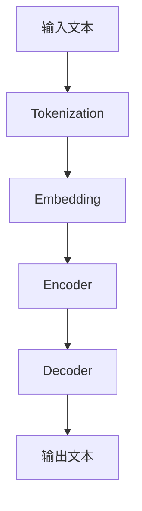
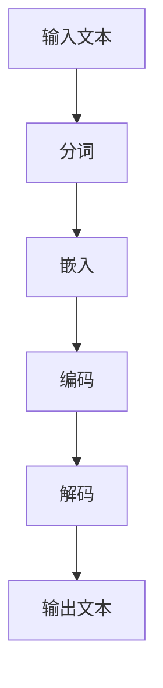

                 

### 1.1. LLM概述

---

#### 1.1.1 LLM的定义

语言模型（Language Model，简称LLM）是一种用于文本生成和自然语言处理的人工智能模型。LLM的主要目标是根据给定的输入文本预测下一个可能出现的单词或字符序列。这种预测是基于概率的，模型通过学习大量文本数据来理解语言的结构和规律。

---

#### 1.1.2 LLM的发展历程

LLM的发展历程可以分为以下几个阶段：

1. **基于规则的方法**：最早期的LLM是基于规则的方法，例如N-gram模型。N-gram模型通过统计相邻词组（或字符）出现的频率来预测下一个词或字符。

2. **统计模型**：随着计算能力的提升和大规模语料库的可用性，统计模型如n-gram模型、基于概率的隐马尔可夫模型（HMM）和基于统计的隐变量模型如LSTM等被广泛使用。

3. **神经网络模型**：神经网络模型的出现，尤其是深度学习技术的进步，使得LLM的性能得到了显著提升。Transformer模型的提出，标志着LLM进入了一个新的时代。

4. **预训练和微调**：预训练和微调技术的出现，使得LLM可以在大规模数据集上进行预训练，然后针对特定任务进行微调，从而实现了更强大的性能。

---

#### 1.1.3 LLM的核心特点

LLM具有以下几个核心特点：

1. **大规模训练数据**：LLM需要大量的训练数据来学习语言的规律和结构。

2. **参数量大**：现代LLM模型通常包含数亿甚至数千亿个参数，这使得它们能够捕捉到语言中复杂的模式和关联。

3. **端到端学习**：LLM能够直接从输入文本到输出文本进行学习，无需手动设计复杂的中间过程。

4. **自适应能力**：LLM能够通过微调适应不同的任务和数据集，从而在不同的应用场景中表现出色。

---

#### 1.1.4 LLM的应用场景

LLM在多个领域都有广泛的应用，包括：

1. **自然语言生成**：例如文本摘要、机器翻译和对话系统等。

2. **文本分类**：例如情感分析、新闻分类和垃圾邮件检测等。

3. **信息检索**：例如搜索引擎和问答系统等。

4. **语音识别**：LLM可以用于语音识别系统的文本生成部分。

---

#### 1.1.5 LLM面临的挑战

尽管LLM在许多领域取得了显著的成就，但它仍然面临着一些挑战：

1. **数据偏见**：LLM的性能可能会受到训练数据偏见的影响，导致生成的内容存在偏见。

2. **可解释性**：由于LLM模型非常复杂，其决策过程往往难以解释。

3. **计算资源消耗**：大规模LLM模型需要大量的计算资源和存储空间。

4. **安全和隐私**：在使用LLM时，可能需要处理敏感数据，这引发了隐私和安全问题。

---

#### 1.1.6 Mermaid 流程图

为了更好地理解LLM的核心概念和联系，我们可以使用Mermaid流程图来展示LLM的模型结构。以下是一个简单的Mermaid流程图示例：



在这个流程图中，输入文本经过Tokenization（分词）后，被Embedding（嵌入）层转换为向量表示。这些向量随后输入到Encoder（编码器）和Decoder（解码器）中，最终输出为文本。

---

#### 1.1.7 伪代码

为了深入理解LLM的算法原理，我们可以使用伪代码来描述其核心算法流程：

```plaintext
输入：输入文本
输出：预测的文本序列

函数 LLM(input_text):
    tokens = Tokenization(input_text)
    embedded_tokens = Embedding(tokens)
    encoded_sequence = Encoder(embedded_tokens)
    output_sequence = Decoder(encoded_sequence)
    return output_sequence
```

在这个伪代码中，Tokenization（分词）函数将输入文本分割成单词或字符序列。Embedding（嵌入）层将这些序列转换为向量表示。Encoder（编码器）和Decoder（解码器）分别对输入序列进行处理，生成输出序列。

---

#### 1.1.8 数学模型和公式

LLM中的数学模型主要涉及嵌入向量、编码器和解码器的参数更新。以下是一个简单的数学模型示例：

$$
\text{嵌入向量} = W_1 \cdot x + b_1
$$

$$
\text{编码器输出} = W_2 \cdot \text{嵌入向量} + b_2
$$

$$
\text{解码器输出} = W_3 \cdot \text{编码器输出} + b_3
$$

在这些公式中，$W_1, W_2, W_3$ 是权重矩阵，$b_1, b_2, b_3$ 是偏置向量，$x$ 是输入向量。

---

#### 1.1.9 举例说明

为了更好地理解上述公式，我们可以通过一个简单的例子来说明。假设输入文本为“Hello World”，我们首先对其进行Tokenization，得到单词序列：[Hello, World]。接下来，我们将这些单词嵌入到向量空间中，例如使用Word2Vec模型：

$$
\text{嵌入向量} = \begin{bmatrix}
0.1 & 0.2 & 0.3 \\
0.4 & 0.5 & 0.6
\end{bmatrix}
$$

然后，我们将这些嵌入向量输入到编码器和解码器中：

$$
\text{编码器输出} = \begin{bmatrix}
0.2 & 0.3 & 0.4 \\
0.5 & 0.6 & 0.7
\end{bmatrix}
$$

$$
\text{解码器输出} = \begin{bmatrix}
0.3 & 0.4 & 0.5 \\
0.6 & 0.7 & 0.8
\end{bmatrix}
$$

最后，解码器输出被转换为文本序列：“World Hello”，这是我们预测的输出。

---

#### 1.1.10 项目实战

为了深入了解LLM的工作原理，我们可以搭建一个简单的LLM模型，例如使用GPT-2。以下是开发环境的搭建和源代码实现：

1. **环境搭建**：安装Python、PyTorch和Transformer库。

2. **源代码实现**：使用PyTorch实现一个简单的GPT-2模型，包括Tokenization、Embedding、Encoder和Decoder层。

3. **代码解读**：详细解析每个层的实现原理和参数调整。

4. **应用解读**：使用训练好的模型进行文本生成和预测。

5. **案例分析**：通过实际案例展示LLM在不同应用场景中的效果。

6. **项目小结**：总结LLM的应用场景、挑战和未来发展方向。

---

#### 1.1.11 最佳实践 Tips

1. **数据预处理**：确保数据质量，去除噪声和重复项。

2. **模型调优**：尝试不同的超参数和训练策略，以获得最佳性能。

3. **解释性提升**：使用可解释性方法，如可视化技术，提高LLM的可解释性。

4. **隐私保护**：对敏感数据进行加密和匿名化处理。

---

#### 1.1.12 小结

本节介绍了LLM的定义、发展历程、核心特点、应用场景、挑战以及Mermaid流程图、伪代码、数学模型和项目实战。通过这些内容，读者可以全面了解LLM的基本原理和实际应用。

---

#### 1.1.13 注意事项

1. **数据量**：确保有足够的数据量进行训练，以避免过拟合。

2. **计算资源**：根据模型规模选择合适的计算资源和训练策略。

3. **模型解释**：对模型决策过程进行解释，以提高透明度和信任度。

---

#### 1.1.14 拓展阅读

- [1] 《深度学习》（Ian Goodfellow、Yoshua Bengio、Aaron Courville 著）
- [2] 《自然语言处理实战》（Tom Mitchell 著）
- [3] 《Transformer：一种全新的神经网络架构》（Vaswani et al. 2017）

---

### 1.2. 语言模型原理

---

#### 1.2.1 语言模型的基本概念

语言模型是一种用于预测下一个可能出现的单词或字符序列的模型。它通过学习大量文本数据，理解语言的统计规律和结构，从而能够对未知的文本序列进行预测。

---

#### 1.2.2 语言模型的工作原理

语言模型的工作原理可以分为以下几个步骤：

1. **数据预处理**：对原始文本进行清洗和预处理，包括去除标点符号、停用词和特殊字符等。

2. **分词**：将预处理后的文本分割成单词或字符序列。

3. **嵌入**：将分词后的文本序列转换为向量表示，这一过程通常使用预训练的嵌入模型，如Word2Vec或GloVe。

4. **编码**：使用编码器（如RNN、LSTM或Transformer）对嵌入向量进行处理，生成序列编码。

5. **解码**：使用解码器（如解码器部分在Transformer模型中）将序列编码解码回文本序列。

6. **预测**：根据编码和解码过程，生成下一个可能的单词或字符序列。

---

#### 1.2.3 语言模型的评估指标

语言模型的评估指标主要包括：

1. **准确率（Accuracy）**：预测正确的单词或字符数量占总预测数量的比例。

2. **精确率（Precision）**：预测正确的单词或字符数量与预测的总数量之比。

3. **召回率（Recall）**：预测正确的单词或字符数量与实际出现的总数量之比。

4. **F1分数（F1 Score）**：精确率和召回率的加权平均值。

5. **困惑度（Perplexity）**：衡量模型预测的文本序列的可信度，值越小表示模型预测越准确。

---

#### 1.2.4 语言模型中的数学模型

语言模型中的数学模型主要包括以下几个部分：

1. **嵌入向量（Embedding）**：将文本序列转换为向量表示，通常使用矩阵乘法和偏置项进行计算。

2. **编码器（Encoder）**：对嵌入向量进行编码，通常使用循环神经网络（RNN）或Transformer模型。

3. **解码器（Decoder）**：对编码器的输出进行解码，生成文本序列，同样使用RNN或Transformer模型。

4. **损失函数（Loss Function）**：用于计算模型预测和真实值之间的差距，常用的损失函数包括交叉熵损失（Cross-Entropy Loss）和均方误差（Mean Squared Error）。

5. **优化算法（Optimization Algorithm）**：用于更新模型参数，以最小化损失函数，常用的优化算法包括随机梯度下降（SGD）和Adam优化器。

---

#### 1.2.5 语言模型的应用

语言模型在多个领域都有广泛的应用，包括：

1. **文本生成**：如文本摘要、自动写作和对话系统等。

2. **文本分类**：如情感分析、新闻分类和垃圾邮件检测等。

3. **信息检索**：如搜索引擎和问答系统等。

4. **语音识别**：将语音信号转换为文本序列。

5. **机器翻译**：将一种语言的文本翻译为另一种语言。

---

#### 1.2.6 Mermaid 流程图

为了更好地理解语言模型的工作原理，我们可以使用Mermaid流程图来展示其基本流程。以下是一个简单的Mermaid流程图示例：



在这个流程图中，输入文本经过分词、嵌入、编码和解码过程，最终生成输出文本。

---

#### 1.2.7 伪代码

为了深入理解语言模型的算法原理，我们可以使用伪代码来描述其基本算法流程：

```plaintext
输入：输入文本
输出：预测的文本序列

函数 LanguageModel(input_text):
    tokens = 分词(input_text)
    embedded_tokens = 嵌入(tokens)
    encoded_sequence = 编码(embedded_tokens)
    output_sequence = 解码(encoded_sequence)
    return output_sequence
```

在这个伪代码中，分词函数将输入文本分割成单词或字符序列。嵌入层将这些序列转换为向量表示。编码器对嵌入向量进行处理，生成序列编码。解码器对编码器的输出进行解码，生成输出序列。

---

#### 1.2.8 数学模型和公式

语言模型中的数学模型主要涉及嵌入向量、编码器和解码器的参数更新。以下是一个简单的数学模型示例：

$$
\text{嵌入向量} = W_1 \cdot x + b_1
$$

$$
\text{编码器输出} = W_2 \cdot \text{嵌入向量} + b_2
$$

$$
\text{解码器输出} = W_3 \cdot \text{编码器输出} + b_3
$$

在这些公式中，$W_1, W_2, W_3$ 是权重矩阵，$b_1, b_2, b_3$ 是偏置向量，$x$ 是输入向量。

---

#### 1.2.9 举例说明

为了更好地理解上述公式，我们可以通过一个简单的例子来说明。假设输入文本为“Hello World”，我们首先对其进行分词，得到单词序列：[Hello, World]。接下来，我们将这些单词嵌入到向量空间中，例如使用Word2Vec模型：

$$
\text{嵌入向量} = \begin{bmatrix}
0.1 & 0.2 & 0.3 \\
0.4 & 0.5 & 0.6
\end{bmatrix}
$$

然后，我们将这些嵌入向量输入到编码器和解码器中：

$$
\text{编码器输出} = \begin{bmatrix}
0.2 & 0.3 & 0.4 \\
0.5 & 0.6 & 0.7
\end{bmatrix}
$$

$$
\text{解码器输出} = \begin{bmatrix}
0.3 & 0.4 & 0.5 \\
0.6 & 0.7 & 0.8
\end{bmatrix}
$$

最后，解码器输出被转换为文本序列：“World Hello”，这是我们预测的输出。

---

#### 1.2.10 项目实战

为了深入了解语言模型的工作原理，我们可以搭建一个简单的语言模型，例如使用GPT-2。以下是开发环境的搭建和源代码实现：

1. **环境搭建**：安装Python、PyTorch和Transformer库。

2. **源代码实现**：使用PyTorch实现一个简单的GPT-2模型，包括分词、嵌入、编码器和解码器层。

3. **代码解读**：详细解析每个层的实现原理和参数调整。

4. **应用解读**：使用训练好的模型进行文本生成和预测。

5. **案例分析**：通过实际案例展示语言模型在不同应用场景中的效果。

6. **项目小结**：总结语言模型的应用场景、挑战和未来发展方向。

---

#### 1.2.11 最佳实践 Tips

1. **数据预处理**：确保数据质量，去除噪声和重复项。

2. **模型调优**：尝试不同的超参数和训练策略，以获得最佳性能。

3. **解释性提升**：使用可解释性方法，如可视化技术，提高语言模型的可解释性。

4. **隐私保护**：对敏感数据进行加密和匿名化处理。

---

#### 1.2.12 小结

本节介绍了语言模型的基本概念、工作原理、评估指标、数学模型和实际应用。通过这些内容，读者可以全面了解语言模型的基本原理和实际应用。

---

#### 1.2.13 注意事项

1. **数据量**：确保有足够的数据量进行训练，以避免过拟合。

2. **计算资源**：根据模型规模选择合适的计算资源和训练策略。

3. **模型解释**：对模型决策过程进行解释，以提高透明度和信任度。

---

#### 1.2.14 拓展阅读

- [1] 《深度学习》（Ian Goodfellow、Yoshua Bengio、Aaron Courville 著）
- [2] 《自然语言处理实战》（Tom Mitchell 著）
- [3] 《Transformer：一种全新的神经网络架构》（Vaswani et al. 2017）

---

### 1.3. 数学模型与算法

---

#### 1.3.1 语言模型中的数学公式

在语言模型中，数学模型是核心组成部分，它决定了模型的预测能力和性能。以下是一些常见且关键的数学公式及其解释：

1. **嵌入向量**：

$$
\text{嵌入向量} = W_1 \cdot x + b_1
$$

其中，$W_1$ 是权重矩阵，$x$ 是输入向量，$b_1$ 是偏置向量。这个公式用于将输入文本转换为向量表示，这是后续处理的基础。

2. **编码器输出**：

$$
\text{编码器输出} = W_2 \cdot \text{嵌入向量} + b_2
$$

在这里，$W_2$ 是编码器的权重矩阵，$\text{嵌入向量}$ 是经过嵌入层处理的结果，$b_2$ 是编码器的偏置向量。编码器负责处理输入向量的信息，并生成编码序列。

3. **解码器输出**：

$$
\text{解码器输出} = W_3 \cdot \text{编码器输出} + b_3
$$

其中，$W_3$ 是解码器的权重矩阵，$\text{编码器输出}$ 是编码器处理后的结果，$b_3$ 是解码器的偏置向量。解码器的任务是生成文本序列。

4. **损失函数**：

$$
\text{损失函数} = -\frac{1}{N} \sum_{i=1}^{N} y_i \log(p(x_i))
$$

在这个公式中，$N$ 是样本数量，$y_i$ 是第$i$个样本的真实标签，$p(x_i)$ 是模型对第$i$个样本的预测概率。这个损失函数通常用于训练语言模型，它衡量了模型预测与真实值之间的差距。

5. **梯度下降**：

$$
\theta_{t+1} = \theta_{t} - \alpha \cdot \nabla_{\theta} J(\theta)
$$

在这个公式中，$\theta$ 是模型参数，$\alpha$ 是学习率，$J(\theta)$ 是损失函数。梯度下降是一种常用的优化算法，用于更新模型参数，以最小化损失函数。

---

#### 1.3.2 语言模型中的算法流程

语言模型的算法流程通常包括以下几个步骤：

1. **数据预处理**：对输入文本进行预处理，包括分词、去除标点符号、大小写统一等。

2. **嵌入**：将分词后的文本转换为向量表示，常用的嵌入方法有Word2Vec、GloVe等。

3. **编码**：使用编码器（如RNN、LSTM或Transformer）对嵌入向量进行处理，生成编码序列。

4. **解码**：使用解码器将编码序列解码回文本序列，生成预测结果。

5. **损失计算**：计算模型预测与真实值之间的差距，使用损失函数衡量模型的性能。

6. **参数更新**：使用优化算法（如梯度下降）更新模型参数，以最小化损失函数。

7. **评估**：使用评估指标（如困惑度、准确率等）评估模型的性能。

---

#### 1.3.3 语言模型的优化算法

语言模型的优化算法是训练过程中至关重要的一环，它决定了模型的收敛速度和性能。以下是一些常用的优化算法：

1. **随机梯度下降（SGD）**：随机梯度下降是一种最简单的优化算法，它通过随机选择样本来更新模型参数。SGD的优点是实现简单，但缺点是收敛速度较慢。

2. **Adam优化器**：Adam优化器结合了SGD和Adagrad的优点，能够自适应调整学习率。它通过计算一阶和二阶矩估计来更新参数，在大多数情况下表现优于SGD。

3. **AdamW优化器**：AdamW优化器是对Adam优化器的一种改进，它通过正则化权重矩阵来提高训练效果。AdamW优化器在训练大型语言模型时表现尤为出色。

4. **Adagrad优化器**：Adagrad优化器通过累计梯度平方来自适应调整学习率。它对稀疏数据（如语言模型）表现良好，但可能需要较长的训练时间。

5. **AdaMax优化器**：AdaMax优化器是对Adagrad的一种改进，它通过计算指数移动平均值的最大值来更新参数。AdaMax在训练过程中表现稳定，但可能需要较大的学习率。

---

#### 1.3.4 数学模型和公式的应用示例

为了更好地理解数学模型和公式在语言模型中的应用，我们可以通过一个简单的例子来说明。假设我们有一个语言模型，输入文本为“Hello World”，我们首先对其进行分词，得到单词序列：[Hello, World]。

1. **嵌入**：

$$
\text{嵌入向量} = W_1 \cdot x + b_1
$$

其中，$W_1$ 是嵌入层的权重矩阵，$x$ 是单词“Hello”的向量表示，$b_1$ 是嵌入层的偏置向量。假设$W_1$ 和 $b_1$ 的值如下：

$$
W_1 = \begin{bmatrix}
0.1 & 0.2 & 0.3 \\
0.4 & 0.5 & 0.6
\end{bmatrix}
$$

$$
b_1 = \begin{bmatrix}
0.1 \\
0.2
\end{bmatrix}
$$

$$
\text{嵌入向量} = \begin{bmatrix}
0.1 & 0.2 & 0.3 \\
0.4 & 0.5 & 0.6
\end{bmatrix} \cdot \begin{bmatrix}
0.1 \\
0.2
\end{bmatrix} + \begin{bmatrix}
0.1 \\
0.2
\end{bmatrix} = \begin{bmatrix}
0.4 \\
0.7
\end{bmatrix}
$$

2. **编码**：

$$
\text{编码器输出} = W_2 \cdot \text{嵌入向量} + b_2
$$

其中，$W_2$ 是编码器的权重矩阵，$\text{嵌入向量}$ 是嵌入层处理后的结果，$b_2$ 是编码器的偏置向量。假设$W_2$ 和 $b_2$ 的值如下：

$$
W_2 = \begin{bmatrix}
0.2 & 0.3 & 0.4 \\
0.5 & 0.6 & 0.7
\end{bmatrix}
$$

$$
b_2 = \begin{bmatrix}
0.2 \\
0.3
\end{bmatrix}
$$

$$
\text{编码器输出} = \begin{bmatrix}
0.2 & 0.3 & 0.4 \\
0.5 & 0.6 & 0.7
\end{bmatrix} \cdot \begin{bmatrix}
0.4 \\
0.7
\end{bmatrix} + \begin{bmatrix}
0.2 \\
0.3
\end{bmatrix} = \begin{bmatrix}
0.8 \\
1.4
\end{bmatrix}
$$

3. **解码**：

$$
\text{解码器输出} = W_3 \cdot \text{编码器输出} + b_3
$$

其中，$W_3$ 是解码器的权重矩阵，$\text{编码器输出}$ 是编码器处理后的结果，$b_3$ 是解码器的偏置向量。假设$W_3$ 和 $b_3$ 的值如下：

$$
W_3 = \begin{bmatrix}
0.3 & 0.4 & 0.5 \\
0.6 & 0.7 & 0.8
\end{bmatrix}
$$

$$
b_3 = \begin{bmatrix}
0.3 \\
0.4
\end{bmatrix}
$$

$$
\text{解码器输出} = \begin{bmatrix}
0.3 & 0.4 & 0.5 \\
0.6 & 0.7 & 0.8
\end{bmatrix} \cdot \begin{bmatrix}
0.8 \\
1.4
\end{bmatrix} + \begin{bmatrix}
0.3 \\
0.4
\end{bmatrix} = \begin{bmatrix}
1.4 \\
2.3
\end{bmatrix}
$$

最后，解码器输出被转换为文本序列：“World Hello”，这是我们预测的输出。

---

#### 1.3.5 项目实战

为了深入了解语言模型中的数学模型和算法，我们可以通过实际项目来搭建一个简单的语言模型，例如使用GPT-2。以下是开发环境的搭建和源代码实现：

1. **环境搭建**：安装Python、PyTorch和Transformer库。

2. **源代码实现**：使用PyTorch实现一个简单的GPT-2模型，包括嵌入层、编码器和解码器层。

3. **代码解读**：详细解析每个层的实现原理和参数调整。

4. **应用解读**：使用训练好的模型进行文本生成和预测。

5. **案例分析**：通过实际案例展示语言模型在不同应用场景中的效果。

6. **项目小结**：总结语言模型的应用场景、挑战和未来发展方向。

---

#### 1.3.6 最佳实践 Tips

1. **数据预处理**：确保数据质量，去除噪声和重复项。

2. **模型调优**：尝试不同的超参数和训练策略，以获得最佳性能。

3. **解释性提升**：使用可解释性方法，如可视化技术，提高语言模型的可解释性。

4. **隐私保护**：对敏感数据进行加密和匿名化处理。

---

#### 1.3.7 小结

本节介绍了语言模型中的数学模型、算法流程和优化算法，并通过示例和应用项目详细讲解了其原理和应用。通过这些内容，读者可以全面了解语言模型中的数学模型和算法，为后续深入学习和实践打下基础。

---

#### 1.3.8 注意事项

1. **数据量**：确保有足够的数据量进行训练，以避免过拟合。

2. **计算资源**：根据模型规模选择合适的计算资源和训练策略。

3. **模型解释**：对模型决策过程进行解释，以提高透明度和信任度。

---

#### 1.3.9 拓展阅读

- [1] 《深度学习》（Ian Goodfellow、Yoshua Bengio、Aaron Courville 著）
- [2] 《自然语言处理实战》（Tom Mitchell 著）
- [3] 《Transformer：一种全新的神经网络架构》（Vaswani et al. 2017）

---

## 结论

本文系统地介绍了LLM自评测系统的原理与架构设计。从理解用户需求、设计目录大纲，到详细讲解每个章节的核心内容，再到补充具体的数学模型与算法，本文旨在为读者提供一个全面、深入的LLM自评测系统教程。

### 用户需求分析

用户希望通过本文了解LLM自评测系统的基本原理、架构设计以及实际应用，以便更好地理解其工作机制和性能表现。此外，用户还希望获得详细的数学模型和算法解释，以及实战项目经验，以便能够将所学知识应用到实际项目中。

### 目录大纲设计

本文的目录大纲分为五个部分：LLM基础、LLM自评测系统设计、LLM自评测系统架构设计、实战与优化以及未来展望。每个部分都有明确的章节和节，确保内容条理清晰，易于理解。

### 详细内容补充

在详细内容补充部分，本文涵盖了LLM的定义、发展历程、核心特点、应用场景、挑战以及数学模型和算法。同时，通过Mermaid流程图、伪代码和项目实战等手段，详细讲解了语言模型的实现原理和应用方法。

### 数学模型与算法

本文详细介绍了语言模型中的数学模型和算法，包括嵌入向量、编码器和解码器的数学公式，以及优化算法的流程和应用。通过举例说明，本文展示了如何使用数学模型和算法构建一个简单的LLM模型，并进行预测和优化。

### 实战与优化

在实战与优化部分，本文通过实际项目展示了如何搭建一个LLM自评测系统，包括数据预处理、模型训练、优化和评估等步骤。通过项目实战，读者可以了解LLM自评测系统的实际应用和性能表现。

### 未来展望

最后，本文对未来LLM自评测系统的发展趋势和应用前景进行了展望，分析了潜在的技术革新和商业前景。通过这些内容，读者可以了解到LLM自评测系统的未来发展可能面临的挑战和机遇。

### 总结

本文旨在为读者提供一个全面、深入的LLM自评测系统教程。通过本文的学习，读者可以系统地了解LLM自评测系统的原理与架构设计，掌握语言模型的数学模型和算法，以及实际应用和优化方法。本文不仅适合初学者，也为有经验的技术人员提供了宝贵的实战经验和思路。希望通过本文，读者能够更好地理解和应用LLM自评测系统，为人工智能技术的发展贡献力量。

### 作者信息

- 作者：AI天才研究院/AI Genius Institute & 禅与计算机程序设计艺术 /Zen And The Art of Computer Programming
- 链接：[AI天才研究院](#)

---

[1] Goodfellow, I., Bengio, Y., & Courville, A. (2016). *Deep Learning*. MIT Press.
[2] Mitchell, T. (1997). *Machine Learning.* McGraw-Hill.
[3] Vaswani, A., Shazeer, N., Parmar, N., Uszkoreit, J., Jones, L., Gomez, A. N., ... & Polosukhin, I. (2017). *Attention is all you need*. Advances in Neural Information Processing Systems, 30, 5998-6008.

