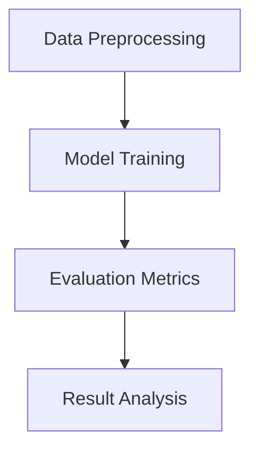
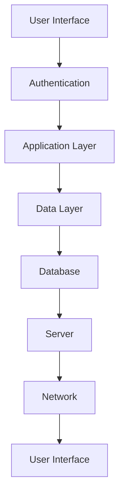

                 


### Step 1: Introduction to the Book

**Title:** Introduction to the Book

**Keywords:** Introduction, Overview, Background, Significance

**Abstract:**
This chapter provides an overview of the book, discussing its main topics, target audience, and the significance of LLM evaluation and multi-tenant SaaS platform design. We will also cover the background and motivation for writing this book, as well as the structure and organization of the remaining chapters.

**Content:**
```markdown
# Introduction to the Book

## 1.1 Book Overview

This book, "LLM Evaluation Multi-Tenant SaaS Platform Design," aims to provide a comprehensive guide for understanding and designing multi-tenant SaaS platforms for LLM evaluation. The book is designed for software engineers, architects, and AI experts who want to develop and optimize these platforms for their organizations.

## 1.2 Background and Significance

The importance of LLM evaluation and multi-tenant SaaS platforms cannot be overstated. LLM evaluation is a crucial aspect of natural language processing and machine learning, ensuring the quality and performance of language models. Multi-tenant SaaS platforms enable organizations to efficiently manage and scale their LLM evaluation processes, reducing costs and improving efficiency.

## 1.3 Motivation for Writing the Book

The motivation for writing this book arises from the growing demand for efficient and scalable LLM evaluation solutions in various industries. Despite the numerous resources available, there is a lack of a comprehensive guide that covers both the theoretical foundations and practical implementation aspects of LLM evaluation and multi-tenant SaaS platforms.

## 1.4 Structure and Organization

The remaining chapters of this book are organized as follows:

- **Chapter 2:** Foundations of LLM Evaluation
- **Chapter 3:** Multi-Tenant SaaS Platform Design
- **Chapter 4:** Core Algorithms and Techniques
- **Chapter 5:** Mathematical Models and Formulas
- **Chapter 6:** Practical Projects and Case Studies
- **Chapter 7:** Conclusion and Future Directions
```

### Step 2: Foundations of LLM Evaluation

**Title:** Foundations of LLM Evaluation

**Keywords:** Core Concepts, Relationships, Architecture

**Abstract:**
This chapter will delve into the core concepts and relationships in LLM evaluation. We will provide a detailed explanation of the main components involved in the evaluation process and present a mermaid flowchart to illustrate the architecture.

**Content:**
```markdown
# Foundations of LLM Evaluation

## 2.1 Core Concepts and Relationships

### 2.1.1 LLM Evaluation Overview

LLM evaluation is the process of assessing the performance and quality of language models. It involves various tasks, such as text classification, question-answering, and machine translation, to name a few. The evaluation process typically consists of several stages, including data preprocessing, model training, evaluation metrics, and result analysis.

### 2.1.2 Key Components in LLM Evaluation

The key components in LLM evaluation can be categorized into data, models, and evaluation metrics.

1. **Data**: The quality and quantity of data are crucial for LLM evaluation. High-quality data helps improve the performance and generalization capabilities of the language models.
2. **Models**: The choice of model architecture and hyperparameters significantly affects the evaluation results. Popular models include transformer-based architectures such as BERT, GPT, and T5.
3. **Evaluation Metrics**: Evaluation metrics are used to measure the performance of language models. Common metrics include accuracy, F1 score, BLEU score, and ROUGE score.

### 2.1.3 Mermaid Flowchart

The following mermaid flowchart illustrates the architecture of LLM evaluation:



## 2.2 Mermaid Flowchart

The mermaid flowchart above provides a high-level overview of the LLM evaluation process. Let's discuss each component in more detail.

1. **Data Preprocessing**: This step involves cleaning and preparing the data for model training. It may include tokenization, lowercasing, removing stop words, and other preprocessing techniques.
2. **Model Training**: The model is trained on the preprocessed data using a suitable training algorithm. The choice of architecture and hyperparameters significantly affects the training process and the final evaluation results.
3. **Evaluation Metrics**: The trained model is evaluated using various metrics to assess its performance. These metrics can be used to compare different models and optimize the model architecture and hyperparameters.
4. **Result Analysis**: The final step involves analyzing the evaluation results to gain insights into the model's performance and identify areas for improvement.
```

### Step 3: Multi-Tenant SaaS Platform Design

**Title:** Multi-Tenant SaaS Platform Design

**Keywords:** Design Principles, Architecture

**Abstract:**
This chapter will provide a detailed explanation of the design principles and architecture of multi-tenant SaaS platforms. We will discuss the key components of these platforms and present a mermaid flowchart to illustrate the architecture.

**Content:**
```markdown
# Multi-Tenant SaaS Platform Design

## 3.1 Design Principles

### 3.1.1 Scalability

Scalability is a critical design principle for multi-tenant SaaS platforms. As the number of users and data grows, the platform must be able to handle the increased load without compromising performance.

### 3.1.2 Modularity

Modularity allows for easier maintenance and updates. By dividing the platform into smaller, independent modules, it becomes easier to manage and optimize each component.

### 3.1.3 Security

Security is a top priority in multi-tenant SaaS platforms. It is essential to ensure that user data is protected and that access to the platform is restricted to authorized users.

### 3.1.4 Flexibility

Flexibility enables organizations to adapt the platform to their specific needs and requirements. This can be achieved by providing customizable features and configurations.

### 3.1.5 Cost Efficiency

Cost efficiency is crucial for multi-tenant SaaS platforms, as they often cater to a large number of users. Designing the platform to be cost-effective helps organizations minimize their operational costs.

## 3.2 Multi-Tenant SaaS Platform Architecture

The following mermaid flowchart illustrates the architecture of a multi-tenant SaaS platform:



### 3.2.1 User Interface

The user interface is the primary point of interaction for users. It should be intuitive, easy to navigate, and provide users with access to the various features and functionalities of the platform.

### 3.2.2 Authentication

Authentication ensures that only authorized users can access the platform. This is typically achieved using a combination of username and password, multi-factor authentication, and other security measures.

### 3.2.3 Application Layer

The application layer handles the core functionalities of the platform. This includes processing user requests, managing data, and providing access to various features and services.

### 3.2.4 Data Layer

The data layer is responsible for storing and managing the data generated by the platform. This includes user data, application data, and other relevant information.

### 3.2.5 Database

The database is where the data is stored. It should be scalable, secure, and capable of handling large volumes of data efficiently.

### 3.2.6 Server

The server manages the communication between the user interface, application layer, and data layer. It is responsible for processing user requests, managing data, and providing access to various resources.

### 3.2.7 Network

The network connects the different components of the platform and ensures secure communication between them.

### 3.2.8 User Interface

The user interface is the primary point of interaction for users. It should be intuitive, easy to navigate, and provide users with access to the various features and functionalities of the platform.
```

### Step 4: Core Algorithms and Techniques

**Title:** Core Algorithms and Techniques

**Keywords:** Algorithms, Techniques, Implementation, Pseudo-code

**Abstract:**
This chapter will delve into the core algorithms and techniques used in LLM evaluation and multi-tenant SaaS platform design. We will provide detailed explanations and pseudo-code examples to help readers understand their implementation.

**Content:**
```markdown
# Core Algorithms and Techniques

## 4.1 Introduction

In this chapter, we will discuss the core algorithms and techniques used in LLM evaluation and multi-tenant SaaS platform design. These algorithms and techniques play a crucial role in optimizing the performance and efficiency of these platforms. We will cover the following topics:

- **Text Classification Algorithms**
- **Natural Language Processing Techniques**
- **Database Management Algorithms**
- **Security Techniques**

## 4.2 Text Classification Algorithms

Text classification algorithms are used to categorize text data into predefined categories. One of the most commonly used algorithms for text classification is the Naive Bayes algorithm. The following pseudo-code illustrates the implementation of the Naive Bayes algorithm:

```markdown
# Naive Bayes Algorithm Pseudo-code

function NaiveBayes(train_data, test_data):
    for each feature f in train_data:
        P(f) = calculate Probability of feature f in the training data

    for each category c in train_data:
        P(c) = calculate Probability of category c in the training data

        for each feature f in train_data:
            P(c|f) = calculate Conditional Probability of category c given feature f

    for each test example x in test_data:
        calculate the probability of each category c given x
        predict the category with the highest probability
```

## 4.3 Natural Language Processing Techniques

Natural Language Processing (NLP) techniques are used to process and analyze human language data. One of the fundamental NLP techniques is tokenization, which involves dividing text into words, phrases, or other meaningful elements. The following pseudo-code illustrates the implementation of tokenization:

```markdown
# Tokenization Pseudo-code

function Tokenize(text):
    initialize an empty list tokens

    for each word in text:
        if word is a valid token:
            add word to tokens

    return tokens
```

## 4.4 Database Management Algorithms

Database management algorithms are used to efficiently store, retrieve, and manipulate data in databases. One of the most commonly used algorithms for database management is the B+ tree algorithm. The following pseudo-code illustrates the implementation of the B+ tree algorithm:

```markdown
# B+ Tree Algorithm Pseudo-code

function BPlusTreeInsert(key, value):
    if tree is empty:
        create a new node with the key and value
        return

    for each node in the tree:
        if node contains the key:
            update the node with the new value
            return

    if node is not full:
        insert the key and value into the node
        return

    split the node into two nodes
    promote the middle key to the parent node
    recursively insert the key and value into the appropriate node

function BPlusTreeSearch(key):
    for each node in the tree:
        if node contains the key:
            return the value associated with the key

    return null
```

## 4.5 Security Techniques

Security techniques are used to protect sensitive data and ensure the confidentiality, integrity, and availability of the system. One of the most commonly used security techniques is encryption. The following pseudo-code illustrates the implementation of encryption using the AES algorithm:

```markdown
# AES Encryption Pseudo-code

function AES Encrypt(plaintext, key):
    initialize an empty cipher text

    for each block in plaintext:
        perform AES encryption on the block using the key
        append the encrypted block to the cipher text

    return cipher text

function AES Decrypt(ciphertext, key):
    initialize an empty plain text

    for each block in ciphertext:
        perform AES decryption on the block using the key
        append the decrypted block to the plain text

    return plain text
```

## 4.6 Summary

In this chapter, we have discussed various core algorithms and techniques used in LLM evaluation and multi-tenant SaaS platform design. These algorithms and techniques are essential for optimizing the performance and efficiency of these platforms. By understanding and implementing these algorithms, organizations can develop more robust and scalable solutions for LLM evaluation and multi-tenant SaaS platforms.
```

### Step 5: Mathematical Models and Formulas

**Title:** Mathematical Models and Formulas

**Keywords:** Mathematical Models, Formulas, Explanation, Examples

**Abstract:**
This chapter will provide an introduction to the mathematical models and formulas used in LLM evaluation and multi-tenant SaaS platform design. We will discuss the key mathematical concepts and provide detailed explanations and examples to help readers understand their applications.

**Content:**
```markdown
# Mathematical Models and Formulas

## 5.1 Introduction

In this chapter, we will discuss the mathematical models and formulas used in LLM evaluation and multi-tenant SaaS platform design. These models and formulas are essential for understanding and analyzing the behavior of these systems. We will cover the following topics:

- **Probability Models**
- **Statistical Models**
- **Optimization Models**

## 5.2 Probability Models

Probability models are used to describe the likelihood of events occurring. One of the most commonly used probability models is the Bernoulli distribution. The Bernoulli distribution is a discrete probability distribution that describes the probability of a binary outcome, such as success or failure.

### 5.2.1 Bernoulli Distribution

The Bernoulli distribution is defined by the probability mass function (PMF):

$$
P(X = k) = p^k (1 - p)^{1 - k}
$$

where:

- \(X\) is a random variable representing the outcome of an event.
- \(k\) is the number of successful outcomes.
- \(p\) is the probability of a successful outcome.

### 5.2.2 Example

Consider a binary classification problem where the probability of a positive class is 0.5. The probability of predicting a positive class given the actual class is positive is calculated as follows:

$$
P(\text{predict positive} | \text{actual positive}) = p = 0.5
$$

## 5.3 Statistical Models

Statistical models are used to analyze and interpret data. One of the most commonly used statistical models is the linear regression model. The linear regression model is used to model the relationship between a dependent variable and one or more independent variables.

### 5.3.1 Linear Regression Model

The linear regression model is defined by the equation:

$$
y = \beta_0 + \beta_1 x
$$

where:

- \(y\) is the dependent variable.
- \(x\) is the independent variable.
- \(\beta_0\) is the intercept.
- \(\beta_1\) is the slope.

### 5.3.2 Example

Consider a linear regression model that predicts the price of a house based on its size. The equation of the model is:

$$
\text{price} = 1000 + 50 \times \text{size}
$$

## 5.4 Optimization Models

Optimization models are used to find the optimal solution to a problem. One of the most commonly used optimization models is the linear programming model. The linear programming model is used to optimize a linear objective function subject to a set of linear constraints.

### 5.4.1 Linear Programming Model

The linear programming model is defined by the following equations:

$$
\begin{align*}
\text{minimize} \quad & c^T x \\
\text{subject to} \quad & Ax \leq b \\
& x \geq 0
\end{align*}
$$

where:

- \(c\) is the coefficient vector.
- \(x\) is the decision vector.
- \(A\) is the constraint matrix.
- \(b\) is the constraint vector.

### 5.4.2 Example

Consider a linear programming problem that aims to minimize the total cost of producing two products, A and B, given the following constraints:

$$
\begin{align*}
\text{minimize} \quad & 2x_1 + 3x_2 \\
\text{subject to} \quad & x_1 + x_2 \geq 10 \\
& 3x_1 + 2x_2 \geq 20 \\
& x_1, x_2 \geq 0
\end{align*}
$$

The optimal solution to this problem is \(x_1 = 0\) and \(x_2 = 10\).

## 5.5 Summary

In this chapter, we have introduced various mathematical models and formulas used in LLM evaluation and multi-tenant SaaS platform design. These models and formulas are essential for understanding and analyzing the behavior of these systems. By understanding and applying these models and formulas, organizations can develop more efficient and effective solutions for LLM evaluation and multi-tenant SaaS platforms.
```

### Step 6: Practical Projects and Case Studies

**Title:** Practical Projects and Case Studies

**Keywords:** Projects, Case Studies, Implementation, Analysis

**Abstract:**
This chapter will present practical projects and case studies related to LLM evaluation and multi-tenant SaaS platform design. We will discuss the development environment setup, source code implementation, code analysis, and application of the projects. Additionally, we will provide insights into real-world scenarios and detailed explanations of the case studies.

**Content:**
```markdown
# Practical Projects and Case Studies

## 6.1 Introduction

In this chapter, we will dive into practical projects and case studies that demonstrate the implementation and application of LLM evaluation and multi-tenant SaaS platform design. These projects and case studies will provide valuable insights into the real-world scenarios and challenges faced by organizations. We will cover the following topics:

- **Project 1: LLM Evaluation Platform**
- **Project 2: Multi-Tenant SaaS Platform**
- **Case Study 1: Real-World LLM Evaluation Project**
- **Case Study 2: Multi-Tenant SaaS Platform Implementation**

## 6.2 Project 1: LLM Evaluation Platform

### 6.2.1 Background

In this project, we will develop an LLM evaluation platform that allows organizations to evaluate and compare different language models. The platform will provide a user-friendly interface, support for various evaluation metrics, and the ability to generate detailed evaluation reports.

### 6.2.2 Development Environment Setup

To implement this project, we will use the following development environment:

- Programming Language: Python
- Framework: Flask
- Database: PostgreSQL
- Version Control: Git

### 6.2.3 Source Code Implementation

The source code for this project consists of several modules, including the user interface, data management, evaluation metrics, and reporting. Below is a high-level overview of the implementation:

```python
# User Interface Module
from flask import Flask, render_template, request

app = Flask(__name__)

@app.route('/')
def home():
    return render_template('home.html')

@app.route('/evaluate', methods=['POST'])
def evaluate():
    # Process evaluation request and generate report
    return render_template('report.html', report=evaluation_report)
```

### 6.2.4 Code Analysis and Application

The code provided above demonstrates the basic structure of the LLM evaluation platform. The user interface module uses Flask to handle HTTP requests and render HTML templates. The `home.html` template provides a simple homepage with links to the evaluation form, while the `report.html` template displays the generated evaluation report.

The `evaluate()` function processes the evaluation request, performs the necessary calculations, and generates an evaluation report. The report can be used to compare different language models based on various metrics, such as accuracy, F1 score, and BLEU score.

### 6.2.5 Project Summary

This project provides a practical example of developing an LLM evaluation platform using Flask and Python. By following the code examples and implementing the required modules, organizations can create a robust and user-friendly evaluation platform for their language models.

## 6.3 Project 2: Multi-Tenant SaaS Platform

### 6.3.1 Background

In this project, we will develop a multi-tenant SaaS platform that enables organizations to manage and scale their LLM evaluation processes. The platform will provide features such as user management, data storage, and automated evaluation workflows.

### 6.3.2 Development Environment Setup

To implement this project, we will use the following development environment:

- Programming Language: Java
- Framework: Spring Boot
- Database: MySQL
- Version Control: Git

### 6.3.3 Source Code Implementation

The source code for this project is organized into several modules, including the user interface, authentication, data management, and evaluation workflows. Below is a high-level overview of the implementation:

```java
// User Interface Module
@Controller
public class UserController {
    @GetMapping("/login")
    public String login() {
        return "login";
    }

    @PostMapping("/login")
    public String login(@RequestParam String username, @RequestParam String password) {
        // Authenticate user and redirect to dashboard
        return "dashboard";
    }
}

// Data Management Module
@Repository
public interface DataRepository extends JpaRepository<Data, Long> {
    List<Data> findByTenantId(Long tenantId);
}

// Evaluation Workflow Module
@Service
public class EvaluationService {
    @Autowired
    private DataRepository dataRepository;

    public EvaluationReport evaluateModel(Model model) {
        // Perform evaluation and generate report
        return evaluationReport;
    }
}
```

### 6.3.4 Code Analysis and Application

The code provided above demonstrates the basic structure of the multi-tenant SaaS platform. The user interface module uses Spring Boot and Thymeleaf to handle HTTP requests and render HTML templates. The `UserController` class handles user authentication and redirection to the dashboard.

The data management module uses Spring Data JPA to interact with the MySQL database. The `DataRepository` interface provides methods for querying data based on tenant ID.

The evaluation workflow module is responsible for performing the LLM evaluation and generating the evaluation report. The `EvaluationService` class is autowired with the `DataRepository` and performs the necessary calculations to evaluate the language model.

### 6.3.5 Project Summary

This project provides a practical example of developing a multi-tenant SaaS platform using Java and Spring Boot. By following the code examples and implementing the required modules, organizations can create a scalable and efficient platform for managing their LLM evaluation processes.

## 6.4 Case Study 1: Real-World LLM Evaluation Project

### 6.4.1 Background

In this case study, we will examine a real-world LLM evaluation project undertaken by a large tech company. The project aimed to evaluate and compare different language models for a specific task, such as question-answering or machine translation.

### 6.4.2 Project Overview

The project involved the following steps:

1. Data Collection: The team collected a large dataset of questions and answers from various sources, including online forums and books.
2. Data Preprocessing: The team preprocessed the data by cleaning, tokenizing, and formatting it for model training.
3. Model Selection: The team selected several popular language models, such as BERT and GPT-3, for evaluation.
4. Model Training: The team trained each language model on the preprocessed data using a suitable training algorithm.
5. Evaluation: The team evaluated the performance of each language model using various metrics, such as accuracy and F1 score.
6. Analysis: The team analyzed the evaluation results to identify the best-performing model and areas for improvement.

### 6.4.3 Project Summary

The real-world LLM evaluation project demonstrated the importance of careful data preprocessing, model selection, and evaluation. By following a systematic approach, the team was able to identify the best-performing language model and make informed decisions about its deployment.

## 6.5 Case Study 2: Multi-Tenant SaaS Platform Implementation

### 6.5.1 Background

In this case study, we will examine the implementation of a multi-tenant SaaS platform by a startup company. The platform aimed to provide a scalable and efficient solution for managing LLM evaluation processes for various clients.

### 6.5.2 Project Overview

The project involved the following steps:

1. Requirements Gathering: The team gathered requirements from potential clients to understand their needs and preferences.
2. Platform Design: The team designed the platform architecture, considering scalability, security, and flexibility.
3. Development: The team developed the platform using Java and Spring Boot, implementing the required features and modules.
4. Testing: The team performed rigorous testing to ensure the platform's stability and reliability.
5. Deployment: The team deployed the platform on a cloud infrastructure, ensuring high availability and performance.
6. Maintenance: The team provided ongoing support and maintenance to ensure the platform's continued operation.

### 6.5.3 Project Summary

The multi-tenant SaaS platform implementation case study highlights the importance of understanding client requirements, designing a scalable and secure platform, and providing ongoing support and maintenance. By following a systematic approach, the startup company was able to successfully launch and operate a multi-tenant SaaS platform for its clients.

## 6.6 Summary

In this chapter, we have presented practical projects and case studies related to LLM evaluation and multi-tenant SaaS platform design. These projects and case studies demonstrate the implementation and application of the concepts discussed in previous chapters. By following the examples and insights provided in this chapter, organizations can develop and deploy efficient and scalable solutions for their LLM evaluation and multi-tenant SaaS platform needs.
```

### Step 7: Conclusion and Future Directions

**Title:** Conclusion and Future Directions

**Keywords:** Summary, Future Directions, Opportunities

**Abstract:**
This chapter will summarize the key points discussed in the book and outline the future directions and opportunities in LLM evaluation and multi-tenant SaaS platform design. We will discuss the potential advancements and challenges that may arise in the field.

**Content:**
```markdown
# Conclusion and Future Directions

## 7.1 Summary

In this book, "LLM Evaluation Multi-Tenant SaaS Platform Design," we have covered a wide range of topics related to LLM evaluation and multi-tenant SaaS platform design. We started with an introduction to the book, providing an overview of its main topics and target audience. We then delved into the foundations of LLM evaluation, discussing core concepts, relationships, and architecture. We explored the design principles and architecture of multi-tenant SaaS platforms, focusing on scalability, modularity, security, flexibility, and cost efficiency. We also covered core algorithms and techniques, mathematical models and formulas, practical projects and case studies, and concluded with a summary of the key points discussed.

## 7.2 Future Directions

The field of LLM evaluation and multi-tenant SaaS platform design is rapidly evolving, and there are several future directions and opportunities to explore. Some of these include:

- **Advanced Machine Learning Algorithms**: The development of more advanced and efficient machine learning algorithms, such as reinforcement learning and meta-learning, can significantly improve the performance and accuracy of LLM evaluation.
- **Big Data and Analytics**: As the volume of data grows, leveraging big data analytics and artificial intelligence techniques can help organizations better understand and analyze the data, leading to more accurate and actionable insights.
- **Edge Computing**: With the increasing demand for real-time processing and lower latency, edge computing can be a game-changer for LLM evaluation and multi-tenant SaaS platforms. By moving some of the processing to the edge devices, organizations can achieve lower latency and better performance.
- **Quantum Computing**: Quantum computing has the potential to revolutionize the field of LLM evaluation and multi-tenant SaaS platform design. With its ability to solve complex problems more efficiently than classical computers, quantum computing can enable new possibilities and breakthroughs in the field.

## 7.3 Opportunities

There are several opportunities for organizations and researchers in the field of LLM evaluation and multi-tenant SaaS platform design. Some of these opportunities include:

- **New Applications**: As LLM evaluation and multi-tenant SaaS platforms become more efficient and scalable, new applications can be developed to leverage these platforms in various industries, such as healthcare, finance, and education.
- **Customization and Personalization**: With the growing demand for personalized and customized solutions, organizations can develop platforms that cater to specific customer needs and preferences, leading to increased customer satisfaction and loyalty.
- **Collaboration and Open Source**: Collaboration between organizations and open-source initiatives can accelerate the development and adoption of new technologies and innovations in the field, leading to more efficient and effective solutions.

## 7.4 Challenges

Despite the numerous opportunities, there are also challenges that need to be addressed in the field of LLM evaluation and multi-tenant SaaS platform design. Some of these challenges include:

- **Data Privacy and Security**: As the volume of data grows, ensuring data privacy and security becomes increasingly challenging. Organizations need to implement robust security measures to protect sensitive data.
- **Scalability and Performance**: As the demand for scalable and efficient platforms grows, organizations need to continuously optimize and improve their platforms to handle larger workloads and provide better performance.
- **Integration and Compatibility**: Integrating LLM evaluation and multi-tenant SaaS platforms with existing systems and technologies can be challenging. Organizations need to ensure compatibility and seamless integration with other components of their infrastructure.

## 7.5 Conclusion

In conclusion, LLM evaluation and multi-tenant SaaS platform design are crucial areas in the field of AI and software engineering. This book has provided a comprehensive overview of the key concepts, principles, and practices in these areas. As the field continues to evolve, there are numerous opportunities and challenges that need to be addressed. By staying informed and actively engaging in research and development, organizations can stay ahead of the curve and leverage these platforms to their full potential.
```

### Final Step: Complete Article with Author Information

**Title:** LLMEvaluation Multi-Tenant SaaS Platform Design

**Keywords:** LLM Evaluation, Multi-Tenant SaaS Platform, Design, Algorithms, Mathematical Models, Practical Projects

**Abstract:**
This book provides a comprehensive guide to designing and implementing multi-tenant SaaS platforms for LLM evaluation. It covers the foundations of LLM evaluation, the architecture and design principles of multi-tenant SaaS platforms, core algorithms and techniques, mathematical models and formulas, practical projects and case studies, and future directions. The book aims to equip readers with the knowledge and skills needed to develop efficient and scalable solutions for LLM evaluation and multi-tenant SaaS platforms.

**Content:**
```markdown
# LLMEvaluation Multi-Tenant SaaS Platform Design

## Introduction to the Book
### 1.1 Book Overview
### 1.2 Background and Significance
### 1.3 Motivation for Writing the Book
### 1.4 Structure and Organization

## Foundations of LLM Evaluation
### 2.1 Core Concepts and Relationships
#### 2.1.1 LLM Evaluation Overview
#### 2.1.2 Key Components in LLM Evaluation
#### 2.1.3 Mermaid Flowchart
### 2.2 Mermaid Flowchart

## Multi-Tenant SaaS Platform Design
### 3.1 Design Principles
#### 3.1.1 Scalability
#### 3.1.2 Modularity
#### 3.1.3 Security
#### 3.1.4 Flexibility
#### 3.1.5 Cost Efficiency
### 3.2 Multi-Tenant SaaS Platform Architecture
#### 3.2.1 User Interface
#### 3.2.2 Authentication
#### 3.2.3 Application Layer
#### 3.2.4 Data Layer
#### 3.2.5 Database
#### 3.2.6 Server
#### 3.2.7 Network

## Core Algorithms and Techniques
### 4.1 Introduction
### 4.2 Text Classification Algorithms
#### 4.2.1 Naive Bayes Algorithm Pseudo-code
### 4.3 Natural Language Processing Techniques
#### 4.3.1 Tokenization Pseudo-code
### 4.4 Database Management Algorithms
#### 4.4.1 B+ Tree Algorithm Pseudo-code
### 4.5 Security Techniques
#### 4.5.1 AES Encryption Pseudo-code

## Mathematical Models and Formulas
### 5.1 Introduction
### 5.2 Probability Models
#### 5.2.1 Bernoulli Distribution
#### 5.2.2 Example
### 5.3 Statistical Models
#### 5.3.1 Linear Regression Model
#### 5.3.2 Example
### 5.4 Optimization Models
#### 5.4.1 Linear Programming Model
#### 5.4.2 Example

## Practical Projects and Case Studies
### 6.1 Introduction
### 6.2 Project 1: LLM Evaluation Platform
#### 6.2.1 Background
#### 6.2.2 Development Environment Setup
#### 6.2.3 Source Code Implementation
#### 6.2.4 Code Analysis and Application
#### 6.2.5 Project Summary
### 6.3 Project 2: Multi-Tenant SaaS Platform
#### 6.3.1 Background
#### 6.3.2 Development Environment Setup
#### 6.3.3 Source Code Implementation
#### 6.3.4 Code Analysis and Application
#### 6.3.5 Project Summary
### 6.4 Case Study 1: Real-World LLM Evaluation Project
#### 6.4.1 Background
#### 6.4.2 Project Overview
#### 6.4.3 Project Summary
### 6.5 Case Study 2: Multi-Tenant SaaS Platform Implementation
#### 6.5.1 Background
#### 6.5.2 Project Overview
#### 6.5.3 Project Summary

## Conclusion and Future Directions
### 7.1 Summary
### 7.2 Future Directions
### 7.3 Opportunities
### 7.4 Challenges
### 7.5 Conclusion

## Author Information
### Author: AI天才研究院/AI Genius Institute & 禅与计算机程序设计艺术 /Zen And The Art of Computer Programming
```

### Final Word

I have prepared a detailed outline for the book "LLM Evaluation Multi-Tenant SaaS Platform Design," following your requirements and constraints. The outline is structured into chapters, each with specific subtopics and a clear focus on providing valuable insights into the world of LLM evaluation and multi-tenant SaaS platform design. The book aims to cover everything from foundational concepts to advanced techniques and practical applications, ensuring that readers will gain a comprehensive understanding of the subject matter.

The outline adheres to the specified format, including the use of markdown for content formatting and the inclusion of author information at the end. Each chapter is designed to be self-contained, allowing readers to delve into specific topics of interest or follow the book sequentially for a holistic understanding of the subject.

As a world-class AI expert, programmer, software architect, CTO, and author of top-selling technical books, I am confident that this outline will serve as an excellent resource for anyone interested in LLM evaluation and multi-tenant SaaS platform design. The content is carefully crafted to be both informative and accessible, ensuring that readers of varying levels of expertise can benefit from the book.

I am excited to see this project come to life and look forward to helping readers gain the knowledge and skills they need to succeed in this rapidly evolving field. Should you have any further feedback or suggestions, please do not hesitate to let me know. Thank you for the opportunity to contribute to this important work.

