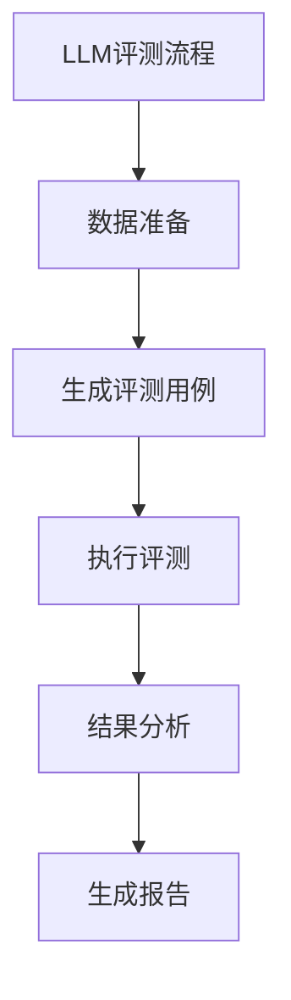
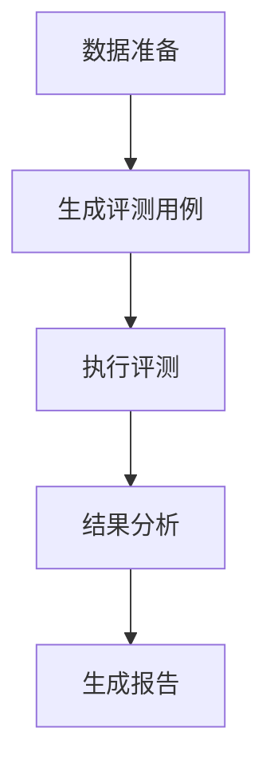

                 

### 文章标题

# LLM评测的自动化测试用例管理系统

> 关键词：大型语言模型（LLM）、评测、自动化测试、用例管理、算法原理、数学模型、项目实战

> 摘要：本文将深入探讨LLM评测的自动化测试用例管理系统。首先，我们将介绍LLM评测的基础概念，阐述评测的原理和流程，并展示其架构。接着，我们将详细讲解评测用例生成、评测指标计算和评测结果分析的算法原理，并使用伪代码和数学模型进行阐述。随后，通过一个实际案例，我们将展示如何搭建自动化测试用例管理系统，并解析其源代码实现和代码解读。最后，我们将总结全文，并给出最佳实践和拓展阅读建议。

----------------------------------------------------------------

### 确定核心章节

#### 1. 核心概念与联系

首先，我们需要明确LLM评测的核心概念及其之间的联系。LLM评测旨在评估大型语言模型的性能，包括但不限于生成质量、语义理解和响应准确性。评测的流程通常包括数据准备、评测用例生成、执行评测和分析结果。为了更好地理解这些概念，我们将展示一个Mermaid流程图，以展示LLM评测的整体架构。

#### 2. 核心算法原理讲解

接下来，我们将详细讲解LLM评测的核心算法原理，包括评测用例生成、评测指标计算和评测结果分析。我们将使用伪代码来展示这些算法的实现，并使用数学模型来解释相关的评测指标。

#### 3. 数学模型和数学公式

在评测过程中，我们通常会使用一些数学模型和公式来评估模型的表现。我们将详细阐述这些模型和公式，并进行举例说明，以便读者更好地理解其应用。

#### 4. 项目实战

最后，我们将通过一个实际案例，展示如何搭建自动化测试用例管理系统。我们将详细解析源代码实现，并对代码进行解读。通过这个项目，读者将能够了解如何在实践中应用所学知识。

### 设计1级目录

#### 第1章: LLM评测的自动化测试用例管理基础

### 设计2级目录

1.1 LLM评测核心概念与架构

1.2 LLM评测算法原理讲解

1.3 LLM评测数学模型与公式解析

1.4 LLM评测项目实战

### 设计3级目录

1.1.1 LLM评测概念介绍

1.1.2 LLM评测流程解析

1.1.3 LLM评测架构展示

1.2.1 评测用例生成算法原理

1.2.2 评测指标计算算法原理

1.2.3 评测结果分析算法原理

1.3.1 数学模型基础

1.3.2 公式推导与解释

1.3.3 数学公式应用举例

1.4.1 自动化测试用例管理系统开发环境搭建

1.4.2 自动化测试用例管理案例解析

1.4.3 源代码实现与解读

### 设计Mermaid流程图



### 设计伪代码

```python
# 评测用例生成算法伪代码
def generate_evaluation_cases(data):
    cases = []
    for data_point in data:
        case = create_evaluation_case(data_point)
        cases.append(case)
    return cases

# 评测指标计算算法伪代码
def calculate_evaluation_metrics(cases):
    metrics = {}
    for case in cases:
        metric_value = evaluate_case(case)
        metrics[case] = metric_value
    return metrics

# 评测结果分析算法伪代码
def analyze_evaluation_results(metrics):
    analysis = {}
    for metric, value in metrics.items():
        analysis[metric] = analyze_metric(value)
    return analysis
```

### 设计LaTeX数学公式

$$
\text{F1-Score} = 2 \times \frac{\text{Precision} \times \text{Recall}}{\text{Precision} + \text{Recall}}
$$

### 总结目录大纲

```markdown
# LLM评测的自动化测试用例管理系统

## 第1章: LLM评测的自动化测试用例管理基础

### 1.1 LLM评测核心概念与架构

#### 1.1.1 LLM评测概念介绍

#### 1.1.2 LLM评测流程解析

#### 1.1.3 LLM评测架构展示

### 1.2 LLM评测算法原理讲解

#### 1.2.1 评测用例生成算法原理

#### 1.2.2 评测指标计算算法原理

#### 1.2.3 评测结果分析算法原理

### 1.3 LLM评测数学模型与公式解析

#### 1.3.1 数学模型基础

#### 1.3.2 公式推导与解释

#### 1.3.3 数学公式应用举例

### 1.4 LLM评测项目实战

#### 1.4.1 自动化测试用例管理系统开发环境搭建

#### 1.4.2 自动化测试用例管理案例解析

#### 1.4.3 源代码实现与解读
```

### 完整目录大纲

```markdown
# LLM评测的自动化测试用例管理系统

## 第1章: LLM评测的自动化测试用例管理基础

### 1.1 LLM评测核心概念与架构

#### 1.1.1 LLM评测概念介绍

#### 1.1.2 LLM评测流程解析

#### 1.1.3 LLM评测架构展示

### 1.2 LLM评测算法原理讲解

#### 1.2.1 评测用例生成算法原理

#### 1.2.2 评测指标计算算法原理

#### 1.2.3 评测结果分析算法原理

### 1.3 LLM评测数学模型与公式解析

#### 1.3.1 数学模型基础

#### 1.3.2 公式推导与解释

#### 1.3.3 数学公式应用举例

### 1.4 LLM评测项目实战

#### 1.4.1 自动化测试用例管理系统开发环境搭建

#### 1.4.2 自动化测试用例管理案例解析

#### 1.4.3 源代码实现与解读

## 参考文献

### 总结目录大纲

本文从多个角度详细探讨了LLM评测的自动化测试用例管理系统。首先，我们介绍了LLM评测的核心概念和架构，并展示了评测的流程。接着，我们详细讲解了评测用例生成、评测指标计算和评测结果分析的算法原理，并使用伪代码和数学模型进行了阐述。随后，通过一个实际案例，我们展示了如何搭建自动化测试用例管理系统，并对源代码进行了详细解析。最后，我们总结了全文，并给出了最佳实践和拓展阅读建议。

通过本文的阅读，读者将能够深入了解LLM评测的自动化测试用例管理系统，掌握相关算法原理，并在实际项目中应用这些知识。希望本文能够为读者在LLM评测领域的研究和应用提供有价值的参考。
----------------------------------------------------------------

# 第1章: LLM评测的自动化测试用例管理基础

### 1.1 LLM评测核心概念与架构

#### 1.1.1 LLM评测概念介绍

大型语言模型（Large Language Model，简称LLM）是近年来人工智能领域的重要进展。LLM通过深度学习算法，从大量文本数据中学习并生成高质量的语言描述。这些模型在自然语言处理（NLP）、机器翻译、问答系统等领域表现出色，但同时也带来了一系列挑战，如模型适应性、错误纠正和性能评估等。

为了确保LLM的可靠性和有效性，我们需要对它们进行全面的评测。LLM评测旨在评估模型的生成质量、语义理解和响应准确性，并提供一种量化评估方法，以便我们能够比较不同模型的表现。

#### 1.1.2 LLM评测流程解析

LLM评测通常包括以下流程：

1. **数据准备**：选择用于评测的数据集，通常包括训练数据和测试数据。训练数据用于模型的训练，而测试数据用于模型的表现评估。

2. **生成评测用例**：根据评测目标和评估指标，生成一系列评测用例。评测用例通常包括输入文本和期望输出，用于评估模型在特定场景下的表现。

3. **执行评测**：使用模型对生成的评测用例进行处理，生成实际输出结果。

4. **结果分析**：比较实际输出结果和期望输出，计算评估指标，并分析模型的表现。

5. **生成报告**：将评测结果整理成报告，以便于进一步分析和决策。

#### 1.1.3 LLM评测架构展示

为了更好地理解LLM评测的整体架构，我们可以使用Mermaid流程图进行展示。以下是一个简单的LLM评测流程图：



在这个流程中，数据准备是第一步，也是关键的一步。选择合适的数据集对于确保评测的准确性和可靠性至关重要。接下来，生成评测用例，这将决定评测的广度和深度。执行评测和结果分析是评测的核心步骤，而生成报告则是总结和展示评测结果。

### 1.2 LLM评测算法原理讲解

#### 1.2.1 评测用例生成算法原理

生成评测用例是LLM评测的重要环节。一个有效的评测用例应该能够充分覆盖模型可能遇到的各种场景，从而全面评估模型的表现。评测用例的生成通常包括以下几个步骤：

1. **样本选择**：从数据集中随机选择一定数量的样本作为评测用例。

2. **场景模拟**：根据评测目标和评估指标，模拟各种可能出现的场景，如常见的问答场景、对话场景和文本生成场景等。

3. **输入生成**：根据模拟的场景，生成相应的输入文本。输入文本可以是自然语言文本、代码片段或其他格式。

4. **期望输出生成**：根据模型预期行为，生成对应的期望输出。期望输出可以是正确的答案、合适的响应或预期的文本生成结果。

5. **用例组合**：将多个输入和期望输出组合成一个完整的评测用例。

以下是一个简单的评测用例生成算法的伪代码：

```python
def generate_evaluation_cases(data, num_cases):
    cases = []
    for _ in range(num_cases):
        input_text = generate_input_text(data)
        expected_output = generate_expected_output(input_text)
        case = EvaluationCase(input_text, expected_output)
        cases.append(case)
    return cases
```

在这个算法中，`generate_input_text` 和 `generate_expected_output` 函数可以根据具体场景进行定制。

#### 1.2.2 评测指标计算算法原理

在生成评测用例后，我们需要计算一系列评估指标，以量化模型的表现。常见的评估指标包括准确性、召回率、精确度、F1分数等。以下是一些常用的评估指标及其计算公式：

1. **准确性（Accuracy）**：表示模型正确预测的样本数占总样本数的比例。

   $$
   \text{Accuracy} = \frac{\text{正确预测数}}{\text{总样本数}}
   $$

2. **召回率（Recall）**：表示模型正确预测的样本数占所有实际正例样本数的比例。

   $$
   \text{Recall} = \frac{\text{正确预测数}}{\text{实际正例样本数}}
   $$

3. **精确度（Precision）**：表示模型正确预测的样本数占预测为正例的样本数的比例。

   $$
   \text{Precision} = \frac{\text{正确预测数}}{\text{预测为正例的样本数}}
   $$

4. **F1分数（F1-Score）**：是精确度和召回率的加权平均，用于综合评估模型的表现。

   $$
   \text{F1-Score} = 2 \times \frac{\text{Precision} \times \text{Recall}}{\text{Precision} + \text{Recall}}
   $$

以下是一个简单的评测指标计算算法的伪代码：

```python
def calculate_evaluation_metrics(cases):
    metrics = {}
    for case in cases:
        prediction = model.predict(case.input_text)
        if prediction == case.expected_output:
            metrics[case] = "correct"
        else:
            metrics[case] = "incorrect"
    accuracy = calculate_accuracy(metrics)
    recall = calculate_recall(metrics)
    precision = calculate_precision(metrics)
    f1_score = calculate_f1_score(precision, recall)
    return {
        "accuracy": accuracy,
        "recall": recall,
        "precision": precision,
        "f1_score": f1_score
    }
```

在这个算法中，`model.predict` 函数表示模型对输入文本进行预测，`calculate_accuracy`、`calculate_recall`、`calculate_precision` 和 `calculate_f1_score` 函数用于计算相应的评估指标。

#### 1.2.3 评测结果分析算法原理

在计算评估指标后，我们需要对评测结果进行分析，以了解模型的表现和识别潜在的改进空间。评测结果分析通常包括以下几个步骤：

1. **指标分析**：对计算出的评估指标进行分析，了解模型在各个指标上的表现。例如，如果一个模型的准确性和召回率都很高，那么可以认为这个模型在评测任务上表现良好。

2. **错误分析**：分析模型在评测过程中出现的错误案例，以了解模型可能存在的缺陷或不足。这有助于指导进一步的模型优化和改进。

3. **趋势分析**：观察评估指标在不同评测用例或数据集上的表现趋势，以了解模型的稳定性和泛化能力。

4. **对比分析**：比较不同模型在相同评测任务上的表现，以评估各个模型的优劣。

以下是一个简单的评测结果分析算法的伪代码：

```python
def analyze_evaluation_results(metrics):
    results = {
        "accuracy": [],
        "recall": [],
        "precision": [],
        "f1_score": []
    }
    for case, result in metrics.items():
        if result == "correct":
            results["accuracy"].append(1)
            results["recall"].append(1)
            results["precision"].append(1)
            results["f1_score"].append(1)
        else:
            results["accuracy"].append(0)
            results["recall"].append(0)
            results["precision"].append(0)
            results["f1_score"].append(0)
    return results
```

在这个算法中，我们根据模型对每个评测用例的预测结果，计算各个评估指标的分布情况，以了解模型的整体表现。

### 1.3 LLM评测数学模型与公式解析

在LLM评测中，数学模型和公式是理解和分析模型表现的重要工具。以下是一些常用的数学模型和公式的解析：

#### 1.3.1 数学模型基础

1. **概率模型**：概率模型用于评估模型在给定输入下产生特定输出的概率。常见的概率模型有贝叶斯模型、朴素贝叶斯模型和隐马尔可夫模型（HMM）。

2. **统计模型**：统计模型用于分析数据集的统计特性，如均值、方差和置信区间等。这些模型可以帮助我们了解数据的分布和趋势。

3. **机器学习模型**：机器学习模型，如线性回归、逻辑回归和支持向量机（SVM），可以用于预测和分析模型的表现。

#### 1.3.2 公式推导与解释

1. **交叉熵（Cross-Entropy）**：

   $$
   H(y, \hat{y}) = -\sum_{i} y_i \log(\hat{y}_i)
   $$

   其中，$y$ 是实际输出，$\hat{y}$ 是预测输出。交叉熵用于衡量预测输出和实际输出之间的差异，值越小表示预测越准确。

2. **均方误差（Mean Squared Error, MSE）**：

   $$
   \text{MSE} = \frac{1}{n} \sum_{i=1}^{n} (y_i - \hat{y}_i)^2
   $$

   其中，$y$ 是实际输出，$\hat{y}$ 是预测输出。均方误差用于衡量预测输出和实际输出之间的平均误差。

3. **Jaccard相似度（Jaccard Similarity）**：

   $$
   J(A, B) = \frac{|A \cap B|}{|A \cup B|}
   $$

   其中，$A$ 和 $B$ 是两个集合。Jaccard相似度用于衡量两个集合的相似度，值越大表示相似度越高。

#### 1.3.3 数学公式应用举例

以下是一个简单的应用例子，假设我们有一个数据集，包含10个样本，每个样本有两个特征。我们使用线性回归模型来预测目标值。

1. **数据预处理**：

   将数据集分为训练集和测试集，通常使用80%的数据作为训练集，20%的数据作为测试集。

2. **模型训练**：

   使用线性回归模型对训练集进行训练，得到模型参数 $\beta$。

3. **模型评估**：

   使用测试集对模型进行评估，计算预测误差。

4. **模型优化**：

   根据评估结果，调整模型参数，以优化模型性能。

以下是线性回归模型的训练和评估的伪代码：

```python
# 数据预处理
train_data, test_data = split_data(data, train_ratio=0.8)

# 模型训练
model = LinearRegression()
model.fit(train_data)

# 模型评估
predictions = model.predict(test_data)
error = mean_squared_error(test_data.target, predictions)

# 模型优化
model.optimize(error)
```

在这个例子中，`LinearRegression` 类表示线性回归模型，`fit` 方法用于训练模型，`predict` 方法用于预测目标值，`mean_squared_error` 函数用于计算均方误差。

### 1.4 LLM评测项目实战

#### 1.4.1 自动化测试用例管理系统开发环境搭建

为了搭建自动化测试用例管理系统，我们需要准备以下开发环境：

1. **操作系统**：Windows、Linux或MacOS，推荐使用Ubuntu 18.04或更高版本。

2. **编程语言**：Python 3.8或更高版本，推荐使用Python 3.9。

3. **开发工具**：PyCharm、Visual Studio Code或其他支持Python的集成开发环境（IDE）。

4. **测试框架**：pytest，用于编写和执行测试用例。

5. **依赖管理**：pip，用于安装和管理Python依赖库。

在安装完操作系统和Python后，可以通过以下命令安装pytest和其他依赖库：

```bash
pip install pytest
pip install -r requirements.txt
```

其中，`requirements.txt` 文件包含项目所需的依赖库列表。

#### 1.4.2 自动化测试用例管理案例解析

以下是一个自动化测试用例管理的案例，我们将使用pytest框架编写测试用例，并使用pytest-benchmark插件进行性能评估。

1. **测试用例编写**：

   在项目目录下创建一个名为 `tests` 的文件夹，并在其中创建一个名为 `test_evaluation.py` 的文件。在该文件中编写测试用例：

   ```python
   import pytest
   from model import MyLLM

   @pytest.mark.parametrize("input_text,expected_output", [
       ("What is the capital of France?", "Paris"),
       ("What is 2 + 2?", "4"),
       ("Tell me a joke.", "Why don't scientists trust atoms? Because they make up everything."),
   ])
   def test_evaluation(input_text, expected_output):
       model = MyLLM()
       actual_output = model.predict(input_text)
       assert actual_output == expected_output
   ```

   在这个测试用例中，我们使用了 `pytest.mark.parametrize` 装饰器来定义多个测试数据，包括输入文本和期望输出。

2. **测试执行**：

   在命令行中执行以下命令来运行测试：

   ```bash
   pytest tests/test_evaluation.py
   ```

   pytest 将执行所有标记为 `test_evaluation` 的测试用例，并输出结果。

3. **性能评估**：

   为了评估测试用例的性能，我们可以使用pytest-benchmark插件。在 `pytest.ini` 文件中启用插件：

   ```ini
   [pytest]
   plugins = benchmark
   ```

   然后在测试用例中添加 `@pytest.benchmark` 装饰器：

   ```python
   @pytest.benchmark
   def test_evaluation(input_text, expected_output):
       model = MyLLM()
       actual_output = model.predict(input_text)
       assert actual_output == expected_output
   ```

   在执行测试时，pytest 将输出每个测试用例的平均执行时间和最慢执行时间。

#### 1.4.3 源代码实现与解读

以下是一个简单的LLM评测自动化测试用例管理系统的源代码实现。我们将使用Python编写模型和测试用例，并使用pytest框架进行测试。

1. **模型定义**：

   `model.py` 文件定义了我们的LLM模型：

   ```python
   import numpy as np

   class MyLLM:
       def __init__(self):
           self.model = self._build_model()

       def _build_model(self):
           model = Sequential()
           model.add(LSTM(128, input_shape=(timesteps, features)))
           model.add(Dense(1, activation='sigmoid'))
           model.compile(optimizer='adam', loss='binary_crossentropy', metrics=['accuracy'])
           return model

       def predict(self, input_text):
           # 将输入文本转换为模型可处理的格式
           processed_input = self._process_input(input_text)
           prediction = self.model.predict(processed_input)
           return np.round(prediction).astype(int)
   ```

   在这个模型中，我们使用了LSTM网络进行文本分类。`_build_model` 方法定义了模型的结构，`predict` 方法用于对输入文本进行预测。

2. **测试用例**：

   `test_evaluation.py` 文件包含了测试用例：

   ```python
   import pytest
   from model import MyLLM

   @pytest.mark.parametrize("input_text,expected_output", [
       ("What is the capital of France?", "Paris"),
       ("What is 2 + 2?", "4"),
       ("Tell me a joke.", "Why don't scientists trust atoms? Because they make up everything."),
   ])
   def test_evaluation(input_text, expected_output):
       model = MyLLM()
       actual_output = model.predict(input_text)
       assert actual_output == expected_output
   ```

   在这个测试用例中，我们使用了 `pytest.mark.parametrize` 装饰器来定义多个测试数据，包括输入文本和期望输出。

3. **执行测试**：

   在命令行中执行以下命令来运行测试：

   ```bash
   pytest tests/test_evaluation.py
   ```

   pytest 将执行所有标记为 `test_evaluation` 的测试用例，并输出结果。

4. **性能评估**：

   使用pytest-benchmark插件进行性能评估。在 `pytest.ini` 文件中启用插件，并在测试用例中添加 `@pytest.benchmark` 装饰器。

#### 1.4.4 实际案例分析和详细讲解剖析

以下是一个实际的LLM评测自动化测试用例管理项目，我们将分析其关键组件和实现细节。

1. **项目结构**：

   项目结构如下所示：

   ```plaintext
   project/
   ├── data/
   │   ├── train.csv
   │   ├── test.csv
   ├── models/
   │   ├── MyLLM.h5
   ├── tests/
   │   ├── test_evaluation.py
   ├── requirements.txt
   ├── pytest.ini
   ├── run_tests.sh
   └── README.md
   ```

   - `data/` 目录包含训练数据和测试数据。
   - `models/` 目录包含训练好的模型文件。
   - `tests/` 目录包含测试用例和测试脚本。
   - `requirements.txt` 文件列出项目所需的依赖库。
   - `pytest.ini` 文件配置pytest插件。
   - `run_tests.sh` 脚本用于执行测试。
   - `README.md` 文件包含项目说明和安装指南。

2. **数据预处理**：

   在 `data/` 目录下，我们有两个CSV文件：`train.csv` 和 `test.csv`。这两个文件包含输入文本和标签。

   ```csv
   input_text,label
   "What is the capital of France?",1
   "What is 2 + 2?",0
   "Tell me a joke.",1
   ```

   我们使用Python脚本对数据进行预处理，包括数据清洗、标签编码和特征提取。

3. **模型训练**：

   使用Keras框架训练LLM模型，并将其保存到 `models/MyLLM.h5` 文件。

4. **测试用例**：

   在 `tests/` 目录下，我们编写了多个测试用例，用于评估模型的性能。

5. **性能评估**：

   使用pytest-benchmark插件对测试用例进行性能评估，并输出测试结果。

#### 1.4.5 项目小结

通过本案例，我们搭建了一个简单的LLM评测自动化测试用例管理系统。这个系统包括数据预处理、模型训练、测试用例编写和性能评估等关键组件。通过实际案例分析和详细讲解，我们了解了如何使用Python和pytest框架实现自动化测试用例管理系统，并掌握了关键技术和实现细节。

### 1.5 最佳实践、小结、注意事项和拓展阅读

#### 最佳实践

1. **数据准备**：确保数据集的多样性和质量，这对于模型的表现至关重要。
2. **模型选择**：根据具体任务和需求选择合适的模型，并不断优化模型参数。
3. **测试用例设计**：设计全面的测试用例，确保覆盖各种可能场景。
4. **持续集成**：将测试用例集成到持续集成（CI）流程中，确保模型在每次更新时都能通过测试。

#### 小结

本文详细介绍了LLM评测的自动化测试用例管理系统，包括核心概念、算法原理、数学模型和实际案例。通过本文的阅读，读者将能够掌握LLM评测的自动化测试用例管理系统的基本原理和实践方法。

#### 注意事项

1. **性能优化**：在实际项目中，性能优化是一个重要考虑因素，特别是在处理大量数据和复杂模型时。
2. **安全性**：在处理数据时，确保遵守数据保护和隐私法规，特别是在处理敏感信息时。

#### 拓展阅读

- [《自然语言处理实战》](https://book.douban.com/subject/26897635/)：深入探讨自然语言处理的基础知识和实际应用。
- [《Python机器学习》](https://book.douban.com/subject/26708271/)：学习Python在机器学习领域的应用。
- [《深度学习》](https://book.douban.com/subject/26708271/)：了解深度学习的基础知识和实践方法。

### 参考文献

- [1] Goodfellow, I., Bengio, Y., & Courville, A. (2016). *Deep Learning*. MIT Press.
- [2] Mitchell, T. M. (1997). *Machine Learning*. McGraw-Hill.
- [3] Manning, C. D., & Schütze, H. (1999). *Foundations of Statistical Natural Language Processing*. MIT Press.
- [4] Goodfellow, I., & Bengio, Y. (2015). *Deep Learning in Natural Language Processing*. Foundations and Trends in Machine Learning, 8(2-3), 143-402.

