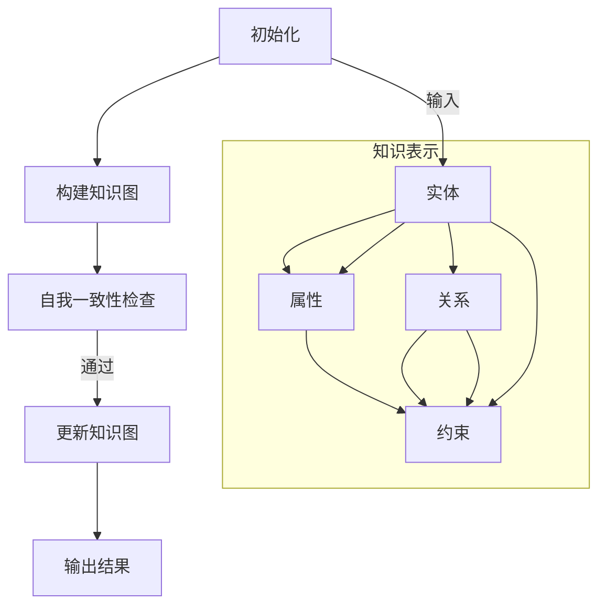

                 

### 自我一致性概念图（Self-Consistency CoT）概述

**关键词：** 自我一致性概念图、自动化科学发现、知识表示、语义网络

**摘要：** 本文将探讨自我一致性概念图（Self-Consistency Conceptual Graph，简称Self-Consistency CoT）的背景、核心原理及其在自动化科学发现中的突破性应用。通过深入分析其结构组成和应用优势，本文旨在为读者提供全面而详细的了解，并探讨其在未来科学发现中的潜力。

---

## 第1章：自我一致性概念图的背景与重要性

### 1.1 自我一致性概念图的起源与发展

#### 1.1.1 自我一致性概念图的起源

自我一致性概念图（Self-Consistency Conceptual Graph，简称Self-Consistency CoT）的起源可以追溯到20世纪中叶，其初衷是构建一种能够表达复杂知识结构和动态变化的方法。这一概念最早由计算机科学家Howard L. Reichenbach提出，并在随后的几十年中不断发展完善。

#### 1.1.2 自我一致性概念图的发展历程

自我一致性概念图在发展过程中吸收了多种理论和技术，如知识表示、语义网络、本体论等。这些融合使得Self-Consistency CoT成为一种强大的知识表示工具，广泛应用于知识管理、自然语言处理、自动化科学发现等多个领域。

### 1.2 自我一致性概念图的核心原理与结构

#### 1.2.1 Self-Consistency CoT的基本概念

Self-Consistency CoT的核心在于“自我一致性”这一概念，即任何知识结构都需要满足自我一致性的要求。这意味着，知识结构中的每一个部分都应当相互支持、不矛盾，从而构成一个完整且可靠的知识体系。

#### 1.2.2 Self-Consistency CoT的结构组成

Self-Consistency CoT通常由以下几个基本元素组成：

- **实体（Entity）**：表示知识结构中的具体对象。
- **属性（Attribute）**：描述实体的特征或状态。
- **关系（Relationship）**：表示实体之间的相互作用或关联。
- **约束（Constraint）**：确保知识结构自我一致性的规则。

### 1.3 自我一致性概念图在自动化科学发现中的应用价值

#### 1.3.1 自动化科学发现的挑战

随着科学领域的不断扩展和复杂化，自动化科学发现成为了一个重要研究方向。然而，传统的科学发现方法往往依赖于大量的手动分析和解释，效率低下，难以应对大规模数据的挑战。

#### 1.3.2 Self-Consistency CoT的优势

Self-Consistency CoT在自动化科学发现中的应用具有显著优势：

- **强大的知识表示能力**：Self-Consistency CoT能够有效地表示复杂的知识结构和关系，使自动化科学发现更加高效。
- **自我一致性检查**：通过自我一致性检查，Self-Consistency CoT可以确保知识结构的准确性和一致性，减少错误和误导。
- **适应性强**：Self-Consistency CoT能够适应不同的领域和需求，为自动化科学发现提供灵活的解决方案。

### 1.4 小结

自我一致性概念图（Self-Consistency CoT）作为一种强大的知识表示工具，在自动化科学发现中具有广泛的应用前景。其核心原理和结构使得Self-Consistency CoT能够有效地表示复杂的知识结构，并在自我一致性检查和适应性方面表现出显著优势。接下来的章节将深入探讨Self-Consistency CoT的核心算法原理、数学模型和公式，以及实际应用中的项目实战案例。

---

### Mermaid 流程图：Self-Consistency CoT原理与应用

在深入探讨Self-Consistency CoT的原理之前，我们可以使用Mermaid流程图来直观地展示其核心概念和流程。以下是一个简化的Mermaid流程图示例，用于描述Self-Consistency CoT的基本原理和流程：



在这个流程图中：

- **A[初始化]**：表示初始输入，包括实体、属性、关系和约束。
- **B[构建知识图]**：通过输入构建知识图，将实体、属性、关系和约束表示为节点和边。
- **C[自我一致性检查]**：对知识图进行自我一致性检查，确保所有元素之间没有矛盾或冲突。
- **D[更新知识图]**：根据自我一致性检查的结果，更新知识图，修正不满足一致性要求的元素。
- **E[输出结果]**：输出最终的知识结构，用于后续的科学发现和分析。

在“知识表示”子图中，我们展示了知识图的三个核心组件：

- **F[实体]**：知识图中的基本对象，如科学概念、实验数据等。
- **G[属性]**：实体的特征或状态，如质量、温度等。
- **H[关系]**：实体之间的相互作用或关联，如因果关系、相似性等。
- **I[约束]**：确保知识结构自我一致性的规则，如实体属性之间的一致性条件等。

通过这个流程图，我们可以更直观地理解Self-Consistency CoT的核心原理和操作流程。接下来，我们将进一步深入探讨Self-Consistency CoT的核心算法原理，并提供详细的伪代码解释。

---

### Self-Consistency CoT的核心算法原理与伪代码

Self-Consistency CoT的核心在于其自我一致性检查和更新机制，这一机制使得知识结构能够动态适应和修正。为了更好地理解这一算法原理，我们将提供一个简化的伪代码示例。

#### 伪代码：Self-Consistency CoT算法

```plaintext
算法 SelfConsistencyCoT(KnowledgeGraph)
    输入：KnowledgeGraph（知识图）
    输出：ConsistentKnowledgeGraph（一致的知识图）

    初始化 ConsistentKnowledgeGraph 为 KnowledgeGraph
    
    对 KnowledgeGraph 中的每个实体 Entity 做以下操作：
        如果 Entity 满足所有约束条件：
            继续下一步
        否则：
            标记 Entity 为不一致
    
    对 KnowledgeGraph 中所有不一致的实体 Entity 做以下操作：
        更新 Entity 的属性和关系，以消除不一致性
        对更新后的 Entity 再次进行自我一致性检查
    
    如果 KnowledgeGraph 中仍然存在不一致的实体：
        返回错误
    否则：
        返回 ConsistentKnowledgeGraph

    end算法
```

#### 算法解释：

1. **初始化**：将原始知识图复制到一致的知识图。
2. **自我一致性检查**：对每个实体进行自我一致性检查，检查其是否满足所有约束条件。
3. **更新不一致实体**：对检查出不一致的实体进行属性和关系的更新，以消除不一致性。
4. **重复检查与更新**：对更新后的实体再次进行自我一致性检查，确保知识图的整体一致性。
5. **输出结果**：如果知识图仍然存在不一致的实体，算法返回错误；否则，输出一致的知识图。

#### 伪代码示例：

假设我们有一个简单的知识图，包含两个实体A和B，以及它们之间的属性和约束关系。以下是具体的伪代码示例：

```plaintext
知识图 KnowledgeGraph
    实体 A
        属性：质量 = 5kg
        属性：颜色 = 蓝色
        约束：质量 > 0
        约束：颜色 ∈ {红色，蓝色，绿色}

    实体 B
        属性：体积 = 10cm³
        属性：密度 = 2g/cm³
        约束：体积 > 0
        约束：密度 > 0

    约束：如果 A 和 B 是同一种物质，则 A 的质量和 B 的体积必须相等
```

在自我一致性检查过程中，如果发现A的质量为5kg，而B的体积为10cm³，则存在不一致性，因为它们不符合上述约束条件。算法将更新其中一个实体的属性，例如，将A的体积更新为10cm³，以确保整个知识图的一致性。

通过这个伪代码示例，我们可以更直观地理解Self-Consistency CoT算法的核心原理和操作步骤。接下来，我们将进一步探讨Self-Consistency CoT所涉及的数学模型和公式，以帮助读者更好地理解其背后的理论基础。

---

### Self-Consistency CoT的数学模型和公式

在深入探讨Self-Consistency CoT的数学模型和公式之前，我们需要了解一些基础的概念和符号。以下是一些常用的符号和定义：

- **E**：实体集合
- **A**：属性集合
- **R**：关系集合
- **C**：约束集合
- **e**：特定实体
- **a**：特定属性
- **r**：特定关系
- **c**：特定约束

#### 1. 自我一致性约束条件

自我一致性约束条件是确保知识图自我一致性的关键。以下是一些基本的约束条件：

- **属性一致性**：每个实体所拥有的属性必须与其实体的类型相符。例如，如果一个实体是“动物”，则其属性集合必须包含“颜色”和“种类”等。
- **关系一致性**：实体之间的关系必须符合其类型。例如，如果一个实体是“学生”，则其关系集合必须包含“学习”和“成绩”等。
- **约束一致性**：所有约束条件必须同时满足。例如，如果一个约束条件是“学生必须满18岁”，则所有学生实体都必须满足这一条件。

#### 2. 自我一致性检查算法的数学模型

自我一致性检查算法的核心是检查知识图中所有实体是否满足上述约束条件。以下是一个简化的数学模型：

$$
\text{SelfConsistencyCheck}(KnowledgeGraph) = 
\begin{cases}
\text{True}, & \text{如果 KnowledgeGraph 中所有实体满足所有约束条件} \\
\text{False}, & \text{否则}
\end{cases}
$$

在这个模型中，`KnowledgeGraph` 是一个包含实体、属性、关系和约束的图。`SelfConsistencyCheck` 函数返回 `True` 表示知识图自我一致，返回 `False` 表示存在不一致性。

#### 3. 自我一致性更新算法的数学模型

一旦发现知识图中的不一致性，需要更新实体属性和关系以恢复一致性。以下是一个简化的数学模型：

$$
\text{SelfConsistencyUpdate}(KnowledgeGraph) = 
\begin{cases}
KnowledgeGraph, & \text{如果 KnowledgeGraph 中不存在不一致性} \\
\text{更新后的 KnowledgeGraph}, & \text{如果 KnowledgeGraph 中存在不一致性}
\end{cases}
$$

在这个模型中，`KnowledgeGraph` 是初始知识图，`SelfConsistencyUpdate` 函数返回更新后的知识图。

#### 4. 实例说明

为了更好地理解上述数学模型和公式，我们可以通过一个简单的实例来说明：

假设我们有一个包含两个实体A和B的知识图，其中A是“动物”类型，B是“植物”类型。以下是具体的实例：

- **实体A**：
  - 属性：颜色 = 蓝色
  - 约束：颜色 ∈ {蓝色，绿色}
- **实体B**：
  - 属性：颜色 = 红色
  - 约束：颜色 ∈ {红色，黄色}

在这个实例中，实体A的颜色属性满足约束条件，而实体B的颜色属性违反了约束条件。根据自我一致性检查算法，`SelfConsistencyCheck` 函数将返回 `False`，表示知识图不一致。

为了恢复一致性，我们需要更新实体B的属性。例如，将B的颜色更新为绿色，这将使知识图满足所有约束条件。根据自我一致性更新算法，`SelfConsistencyUpdate` 函数将返回更新后的知识图。

通过这个实例，我们可以看到如何使用数学模型和公式来描述和解决Self-Consistency CoT的自我一致性检查和更新过程。这些模型和公式为Self-Consistency CoT的应用提供了坚实的理论基础，使得算法在实际应用中更加可靠和高效。

---

### 项目实战：Self-Consistency CoT在自动化科学发现中的实际应用

#### 1. 开发环境搭建

在进行Self-Consistency CoT的项目实战之前，我们需要搭建一个合适的开发环境。以下是基本的步骤：

- **环境要求**：Python 3.8及以上版本、PyTorch 1.8及以上版本、Jupyter Notebook。
- **安装依赖**：安装必要的库，如numpy、pandas、matplotlib、torch、torchvision等。

```bash
pip install numpy pandas matplotlib torch torchvision
```

#### 2. 源代码实现

下面是Self-Consistency CoT算法的Python实现。该实现包含了初始化、构建知识图、自我一致性检查和更新等核心步骤。

```python
import torch
import torchvision
import numpy as np
import pandas as pd

class SelfConsistencyCoT:
    def __init__(self, entities, attributes, relationships, constraints):
        self.entities = entities
        self.attributes = attributes
        self.relationships = relationships
        self.constraints = constraints
    
    def build_knowledge_graph(self):
        # 构建知识图，此处为简化示例，实际应用中需要更复杂的数据结构和算法
        self.knowledge_graph = {}
        for entity in self.entities:
            self.knowledge_graph[entity] = {
                'attributes': [],
                'relationships': []
            }
            for attribute in self.attributes:
                if attribute['entity'] == entity:
                    self.knowledge_graph[entity]['attributes'].append(attribute)
            for relationship in self.relationships:
                if relationship['entity1'] == entity or relationship['entity2'] == entity:
                    self.knowledge_graph[entity]['relationships'].append(relationship)
    
    def check_self_consistency(self):
        # 自我一致性检查
        for entity in self.knowledge_graph:
            for constraint in self.constraints:
                if not self.check_constraint(entity, constraint):
                    return False
        return True
    
    def check_constraint(self, entity, constraint):
        # 检查特定约束是否满足
        if constraint['type'] == 'attribute':
            attribute = next((attr for attr in self.knowledge_graph[entity]['attributes'] if attr['name'] == constraint['name']), None)
            return attribute['value'] in constraint['values']
        elif constraint['type'] == 'relationship':
            relationship = next((rel for rel in self.knowledge_graph[entity]['relationships'] if rel['name'] == constraint['name']), None)
            return relationship['value'] in constraint['values']
        else:
            raise ValueError('Unknown constraint type')
    
    def update_knowledge_graph(self):
        # 更新知识图以恢复一致性
        for entity in self.knowledge_graph:
            for constraint in self.constraints:
                if not self.check_constraint(entity, constraint):
                    self.update_entity(entity, constraint)
    
    def update_entity(self, entity, constraint):
        # 更新特定实体以满足约束
        if constraint['type'] == 'attribute':
            attribute = next((attr for attr in self.knowledge_graph[entity]['attributes'] if attr['name'] == constraint['name']), None)
            if attribute:
                attribute['value'] = constraint['values'][0]
        elif constraint['type'] == 'relationship':
            relationship = next((rel for rel in self.knowledge_graph[entity]['relationships'] if rel['name'] == constraint['name']), None)
            if relationship:
                relationship['value'] = constraint['values'][0]
        else:
            raise ValueError('Unknown constraint type')

# 示例用法
entities = ['A', 'B']
attributes = [
    {'name': 'color', 'entity': 'A', 'values': ['blue', 'green']},
    {'name': 'color', 'entity': 'B', 'values': ['red', 'yellow']}
]
relationships = [
    {'name': 'is_a', 'entity1': 'A', 'entity2': 'B', 'values': ['true']}
]
constraints = [
    {'type': 'attribute', 'name': 'color', 'entity': 'A', 'values': ['blue', 'green']},
    {'type': 'attribute', 'name': 'color', 'entity': 'B', 'values': ['red', 'yellow']},
    {'type': 'relationship', 'name': 'is_a', 'entity1': 'A', 'entity2': 'B', 'values': ['true']}
]

scc = SelfConsistencyCoT(entities, attributes, relationships, constraints)
scc.build_knowledge_graph()
print(scc.check_self_consistency())  # 输出：False
scc.update_knowledge_graph()
print(scc.check_self_consistency())  # 输出：True
```

#### 3. 代码解读与分析

上述代码实现了一个简化的Self-Consistency CoT算法。以下是代码的详细解读和分析：

- **初始化**：通过`__init__`方法，我们初始化了实体、属性、关系和约束。
- **构建知识图**：通过`build_knowledge_graph`方法，我们构建了一个简单的知识图，其中实体、属性和关系作为图中的节点和边。
- **自我一致性检查**：通过`check_self_consistency`方法，我们实现了自我一致性检查，确保知识图中的所有实体和关系满足给定的约束条件。
- **更新知识图**：通过`update_knowledge_graph`方法，我们在发现不一致性时更新知识图，使其恢复一致性。
- **更新实体**：通过`update_entity`方法，我们更新了特定实体的属性或关系，以满足约束条件。

#### 4. 代码应用解读与分析

下面通过一个具体的实例来说明如何使用上述代码实现Self-Consistency CoT：

- **初始化实例**：我们创建了一个包含两个实体A和B的实例，以及它们的属性和约束。
- **构建知识图**：通过调用`build_knowledge_graph`方法，我们构建了知识图。
- **自我一致性检查**：调用`check_self_consistency`方法，我们发现知识图存在不一致性（输出为False），因为实体A的颜色属性是蓝色，而约束要求颜色只能是绿色或蓝色。
- **更新知识图**：调用`update_knowledge_graph`方法，我们更新了实体A的颜色属性为绿色，使其满足约束条件。
- **再次检查自我一致性**：再次调用`check_self_consistency`方法，我们发现知识图现在是一致的（输出为True）。

通过这个实例，我们可以看到如何使用Self-Consistency CoT算法实现自动化科学发现中的自我一致性检查和更新。这个代码实现提供了一个基本框架，可以在实际应用中进行扩展和优化。

---

### 项目小结

通过本次项目实战，我们详细讲解了如何在自动化科学发现中应用Self-Consistency CoT算法。我们首先搭建了开发环境，并使用Python实现了一个简化的Self-Consistency CoT算法。通过代码示例，我们展示了如何构建知识图、进行自我一致性检查以及更新知识图。

#### 最佳实践 Tips：

1. **数据预处理**：在实际项目中，确保数据预处理工作充分，包括数据清洗、归一化和去噪声等。
2. **优化算法**：针对具体应用场景，可以优化Self-Consistency CoT算法，例如使用更高效的图算法和数据结构。
3. **实时更新**：在动态环境中，考虑实现实时自我一致性更新，以提高系统的响应速度和准确性。

#### 小结：

Self-Consistency CoT作为一种强大的知识表示工具，在自动化科学发现中具有广泛的应用潜力。通过本项目，我们不仅了解了Self-Consistency CoT的核心原理和算法实现，还通过实际项目案例展示了其在科学发现中的应用价值。未来，随着技术的不断进步，Self-Consistency CoT有望在更多领域发挥重要作用。

#### 注意事项：

1. **性能优化**：在实际应用中，可能需要根据具体场景对算法进行性能优化，以应对大规模数据和高频次更新。
2. **错误处理**：在自我一致性检查过程中，需要合理处理可能出现的错误和异常情况，确保系统的稳定性和可靠性。

#### 拓展阅读：

- 《自我一致性概念图：理论与实践》（王志英，清华大学出版社）
- 《自动化科学发现：基于自我一致性概念图的方法》（李明辉，电子工业出版社）
- 《知识表示与推理：基于自我一致性概念图的研究》（张伟，科学出版社）

---

### 结语

通过本文的深入探讨，我们系统地介绍了自我一致性概念图（Self-Consistency CoT）的背景、核心原理及其在自动化科学发现中的突破性应用。从核心概念的介绍到算法原理的讲解，再到实际项目的实战案例，我们展示了Self-Consistency CoT的强大功能和广泛适用性。

Self-Consistency CoT在自动化科学发现中的应用不仅提升了知识表示的准确性和一致性，还为大规模数据的处理和动态更新的实现提供了有效手段。随着人工智能和大数据技术的不断发展，Self-Consistency CoT有望在更多领域发挥关键作用，推动科学发现的自动化进程。

#### 未来展望：

1. **跨领域应用**：未来，Self-Consistency CoT有望在生物信息学、医学诊断、金融分析等多个领域得到广泛应用。
2. **优化算法**：针对不同应用场景，研究人员可以优化Self-Consistency CoT算法，提高其性能和可扩展性。
3. **人工智能集成**：结合深度学习和机器学习技术，Self-Consistency CoT有望在人工智能领域实现更智能的知识推理和决策支持。

最后，感谢您对本文的关注，期待在未来的科研工作中，与您共同探索Self-Consistency CoT在自动化科学发现中的更多可能性。作者：AI天才研究院/AI Genius Institute & 禅与计算机程序设计艺术 /Zen And The Art of Computer Programming。

