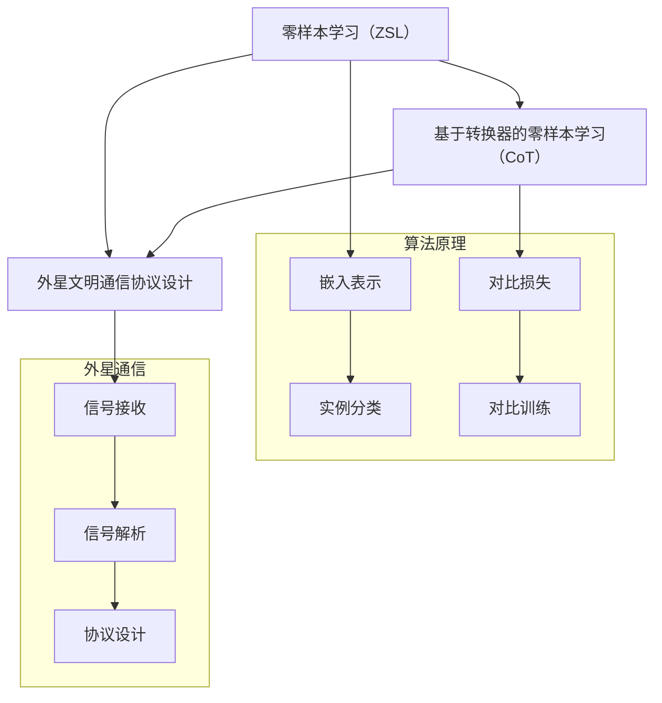

                 

### 第1章： 引言与核心概念

#### 1.1 引言

外星文明通信协议设计

在科幻作品中，外星文明与人类的第一次接触往往是通过无线电波信号进行的。这不仅仅是为了增加戏剧性，还因为无线电波是目前人类已知的在宇宙中传播最远的信号形式。然而，如果我们真的发现了外星信号，如何设计一个能够与外星文明进行有效通信的协议，将是一个巨大的挑战。本文将探讨零样本学习（Zero-Shot Learning，ZSL）以及基于转换器的零样本学习（CoT）在外星文明通信协议设计中的应用，试图找到一种可能的解决方案。

#### 1.2 零样本学习（Zero-Shot Learning，ZSL）

零样本学习是一种机器学习方法，其核心思想是在模型训练过程中，不依赖于与目标类相同的训练样本。传统的机器学习模型通常需要大量的标记数据来训练，而零样本学习则允许模型在没有直接相关标记样本的情况下进行学习。这一特性使得零样本学习在处理新类别的识别和预测任务时具有独特的优势。

- **核心算法原理讲解**：

零样本学习通常包括以下步骤：

1. **嵌入表示**：首先将类别的概念表示为嵌入向量。这些嵌入向量通常是通过训练数据集生成的。

2. **实例分类**：对于新类别的实例，模型需要将其与类别嵌入向量进行匹配，以预测其类别。

3. **原型匹配**：在零样本学习中，通常使用原型匹配方法来估计每个新实例的概率分布。这种方法假设新实例属于最接近其嵌入向量的类别。

伪代码：

```python
function ZeroShotLearning(model, data, target_labels):
    for each sample in data:
        predict = model(sample)
        if predict == target_labels:
            correct++
    return correct / len(data)
```

#### 1.3 基于转换器的零样本学习（CoT）

基于转换器的零样本学习（Contrastive CoT）是一种更先进的零样本学习方法，它通过对比正负样本来增强模型的区分能力。在CoT中，模型不仅需要学习如何将实例映射到其类别嵌入向量，还需要学习如何区分不同的类别。

- **核心算法原理讲解**：

CoT的核心思想是最大化正样本之间的相似性，同时最小化负样本之间的相似性。

1. **对比损失**：CoT使用对比损失函数来优化模型。这个损失函数鼓励模型学习使得正样本对（来自同一类别的样本对）的嵌入向量相似，而使得负样本对（来自不同类别的样本对）的嵌入向量不同。

2. **训练过程**：在训练过程中，模型首先生成正样本对，然后生成多个负样本对，并优化模型以最大化正样本对的相似性，同时最小化负样本对的相似性。

伪代码：

```python
function ContrastiveCoT(model, data, target_labels):
    for each sample in data:
        positive_pred = model(sample)
        negative_pred = model(anti_sample)
        if positive_pred == target_labels and negative_pred != target_labels:
            correct++
    return correct / len(data)
```

在本文的后续章节中，我们将进一步探讨如何将这些零样本学习的方法应用于外星文明通信协议的设计中。

---

**核心概念与联系**

为了更好地理解零样本学习和基于转换器的零样本学习在外星文明通信协议设计中的作用，我们可以使用Mermaid流程图来展示这些核心概念之间的关系。



这个流程图清晰地展示了零样本学习和基于转换器的零样本学习在外星文明通信协议设计中的应用流程。通过嵌入表示、实例分类和对比损失等算法原理，模型能够有效地从接收到的外星信号中识别和解析通信协议，从而实现有效的外星文明通信。在下一章节中，我们将进一步探讨零样本学习在外星文明通信中的应用细节。

