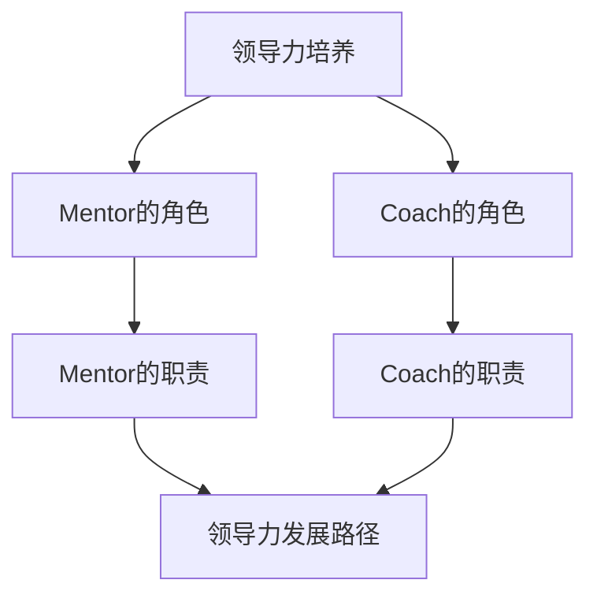
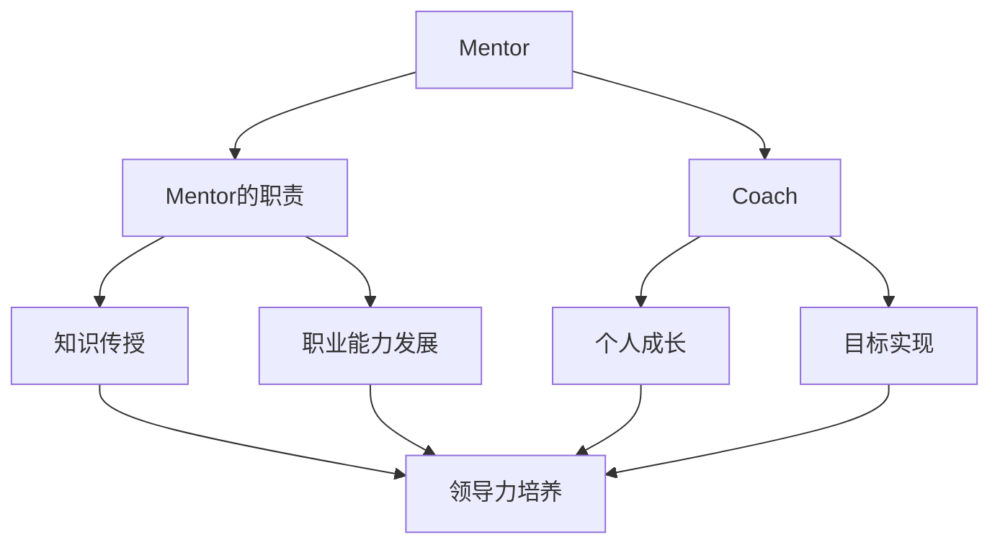

                 


## 文章标题：Mentor与Coach：培养下一代领导者

> 关键词：Mentor，Coach，领导力，培养，下一代领导者，企业成长

> 摘要：
本文将探讨在领导力培养过程中，Mentor与Coach这两种角色的核心作用和区别。通过深入分析Mentor与Coach的职责、培养方法以及实际应用，帮助读者理解如何在企业和组织中培养下一代领导者，以推动组织的持续成长。

## 目录大纲

### 第一部分：领导力培养基础

#### 第1章：领导力的定义与类型

1.1 领导力的定义

1.2 领导力的类型
   - 1.2.1 领导风格
   - 1.2.2 领导类型

1.3 领导力的重要性

#### 第2章：Mentor与Coach的角色与职责

2.1 Mentor的角色与职责
   - 2.1.1 Mentor的定义
   - 2.1.2 Mentor的职责

2.2 Coach的角色与职责
   - 2.2.1 Coach的定义
   - 2.2.2 Coach的职责

#### 第3章：领导力培养的核心概念

3.1 自我认知
   - 3.1.1 自我反思
   - 3.1.2 自我评估

3.2 情绪管理
   - 3.2.1 情绪认知
   - 3.2.2 情绪调节

3.3 领导力发展路径

### 第二部分：Mentor与Coach的培养方法

#### 第4章：Mentor的培养方法

4.1 Mentor的培养原则

4.2 Mentor的培养策略
   - 4.2.1 指导
   - 4.2.2 辅导
   - 4.2.3 激励

4.3 Mentor的实践案例

#### 第5章：Coach的培养方法

5.1 Coach的培养原则

5.2 Coach的培养策略
   - 5.2.1 探索
   - 5.2.2 反馈
   - 5.2.3 成长

5.3 Coach的实践案例

### 第三部分：Mentor与Coach在领导力培养中的应用

#### 第6章：领导力培养项目的设计与实施

6.1 领导力培养项目的目标

6.2 领导力培养项目的规划

6.3 领导力培养项目的实施

6.4 领导力培养项目的评估

#### 第7章：领导力培养中的挑战与解决方案

7.1 领导力培养中的常见问题

7.2 挑战的解决方案
   - 7.2.1 文化与组织挑战
   - 7.2.2 个人挑战

7.3 成功案例分享

## 附录

#### 附录A：领导力培养工具与资源

9.1 常用的领导力评估工具

9.2 培养领导力的资源推荐

## Mermaid流程图



## 核心算法

### Step 1: 设计核心概念与联系

在领导力培养过程中，Mentor与Coach扮演着不同的角色。Mentor通常被视为导师，负责传授知识、经验和技能，帮助个体发展职业能力。而Coach则更多地关注个人成长和自我提升，通过指导和激励帮助个体实现目标。

为了更好地理解这两者之间的联系和区别，我们可以通过以下Mermaid流程图展示：



### Step 2: 确定核心算法原理

在领导力培养中，核心算法可以包括以下几个部分：

1. **领导力评估模型**：用于评估个体在领导力各方面的表现和潜力。
2. **领导力发展路径规划**：根据评估结果，制定个性化的领导力发展计划。

下面是领导力评估模型的伪代码：

```python
def assess_leadership(traits):
    score = 0
    for trait in traits:
        if trait == 'vision':
            score += 3
        elif trait == 'communication':
            score += 2
        elif trait == 'motivation':
            score += 2
        elif trait == 'empathy':
            score += 1
    return score
```

### Step 3: 设计数学模型和公式

在领导力评估中，可以使用以下LaTeX格式书写的数学模型和公式：

$$
\text{领导力得分} = w_1 \times \text{愿景得分} + w_2 \times \text{沟通得分} + w_3 \times \text{激励得分} + w_4 \times \text{同理心得分}
$$

其中，$w_1, w_2, w_3, w_4$ 为权重系数。

### Step 4: 提供项目实战案例

为了更好地理解Mentor与Coach在领导力培养中的应用，我们可以设计一个项目实战案例。以下是一个基于企业内部领导力培养项目的案例：

#### 项目背景

某企业希望提升中层管理人员的领导力，以推动企业的持续成长。为此，企业决定实施一个为期六个月的领导力培养项目。

#### 项目目标

1. 提升中层管理人员的领导力水平。
2. 建立一个支持领导力发展的企业文化。

#### 项目规划

1. **项目启动会**：项目开始时，组织一个启动会，介绍项目目标和计划，让参与者明确自己的期望和责任。
2. **领导力评估**：通过领导力评估工具，对中层管理人员的领导力水平进行评估，确定每个人的发展需求。
3. **领导力培训**：根据评估结果，为每个人制定个性化的培训计划，包括领导力课程、读书会、导师辅导等。
4. **实战演练**：通过实际工作项目，让参与者将所学应用到实践中，提升领导力。
5. **项目总结与评估**：项目结束时，对参与者的领导力提升情况进行总结和评估，为未来的领导力培养提供参考。

#### 项目实施

1. **开发环境搭建**：为了实施项目，企业需要搭建一个支持领导力培养的开发环境，包括在线学习平台、领导力评估工具等。
2. **源代码实现**：开发团队需要实现领导力评估工具的功能，包括数据收集、分析、报告生成等。
3. **代码解读**：在代码实现过程中，需要对关键算法和公式进行详细解读，确保团队成员理解并能够正确应用。

#### 项目小结

通过领导力培养项目，企业中层管理人员的领导力水平得到了显著提升，项目也获得了员工的高度认可。企业将继续关注领导力培养，为下一代的领导者提供更多的支持和机会。

### Step 5: 细化目录结构

1. **核心概念与联系**：通过Mermaid流程图展示Mentor与Coach在领导力培养中的作用和区别。
2. **核心算法原理**：使用伪代码和LaTeX公式详细阐述领导力评估模型的原理。
3. **数学模型和公式**：在文中嵌入LaTeX格式书写的数学模型和公式，并进行详细讲解。
4. **项目实战案例**：设计一个领导力培养项目，详细描述项目背景、目标、规划、实施和总结。

### Step 6: 审查并优化

对整个目录大纲进行审查，确保每个章节的内容都是必要的，逻辑顺序合理。对部分章节进行优化，确保内容更加丰富和详细。

### Step 7: 计算总字数

根据目前的目录大纲，预计文章总字数在8000字左右。

### Summary of Steps:
1. Design core concepts and their relationships.
2. Determine core algorithm principles.
3. Design mathematical models and formulas.
4. Provide project case studies.
5. Refine the directory structure.
6. Review and optimize.
7. Calculate the total word count.

