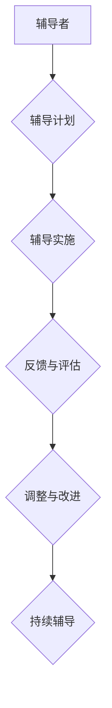

                 

### 引言

在当今复杂多变的职场环境中，个人绩效的提升已成为企业竞争力的关键因素。而在这个过程中，一对一辅导作为一种有效的培训方式，正受到越来越多的关注。本文将深入探讨一对一辅导的基本概念、提升个人绩效的对话技巧，并通过实战案例展示如何将这些技巧应用于实际工作中。

#### 一对一辅导的重要性

一对一辅导，顾名思义，是指辅导者与被辅导者之间进行一对一的辅导活动。这种模式相较于传统的集体培训，具有更高的针对性和个性化。通过一对一辅导，辅导者可以根据被辅导者的实际情况，量身定制辅导计划，从而提高辅导效果。

个人绩效的提升是企业发展的基石。在现代社会，企业面临的竞争压力越来越大，对员工的能力要求也越来越高。通过一对一辅导，员工能够更快地掌握所需技能，提高工作效率，从而为企业创造更大的价值。

#### 个人绩效的定义与提升

个人绩效是指员工在特定时间内所完成的任务和达成的目标。它不仅包括员工的工作成果，还包括工作过程中的行为表现和团队协作能力。个人绩效的提升，需要从以下几个方面进行：

1. **技能提升**：通过一对一辅导，帮助员工提升专业技能，使其能够更好地适应岗位需求。
2. **态度转变**：辅导者可以通过与员工的深入交流，引导其树立正确的职业态度，增强工作动力。
3. **团队协作**：通过辅导，员工可以更好地理解和融入团队，提高团队协作效率。
4. **持续改进**：辅导者应与员工共同制定改进计划，帮助其持续提升个人绩效。

#### 对话技巧的基本概念

对话技巧是有效沟通的核心。在一对一辅导中，辅导者与被辅导者之间的对话不仅决定了辅导效果，也影响双方的关系和信任。以下是几种关键对话技巧：

1. **倾听**：倾听是沟通的基础，有效的倾听可以帮助辅导者更好地理解被辅导者的需求。
2. **表达**：清晰、准确的表达可以使辅导者更好地传达自己的观点和意图。
3. **提问**：恰当的提问可以引导对话，帮助被辅导者深入思考问题。
4. **反馈**：及时、准确的反馈可以帮助被辅导者了解自己的表现，从而进行调整和改进。

### 总结

本文简要介绍了个人绩效提升的重要性，以及一对一辅导和对话技巧的基本概念。接下来，我们将详细探讨一对一辅导的基本概念、提升个人绩效的对话技巧，并通过实战案例展示如何应用这些技巧。希望通过本文的阅读，读者能够对一对一辅导有更深入的理解，并在实际工作中取得更好的效果。

## 一对一辅导的基本概念

### 定义与目的

一对一辅导，作为一种个性化的培训方式，旨在通过辅导者与被辅导者之间的直接交流，帮助被辅导者提升个人技能和绩效。它不同于传统的集体培训，更加注重个性化需求与针对性提升。一对一辅导的目的是为了更好地满足员工的个人发展需求，提高他们的工作效率和职业素养，从而为企业的长远发展奠定坚实的基础。

#### 定义

一对一辅导通常涉及以下三个核心要素：

1. **辅导者**：辅导者通常是具备丰富经验和专业技能的人员，他们负责设计辅导计划、提供指导和支持，以及评估辅导效果。
2. **被辅导者**：被辅导者是指需要提升技能或改进绩效的员工，他们在辅导过程中扮演主动学习者和积极参与者的角色。
3. **辅导过程**：辅导过程包括从计划制定到实施再到评估的整个流程。在这一过程中，辅导者与被辅导者之间的互动至关重要。

#### 目的

一对一辅导的主要目的包括：

1. **技能提升**：通过针对个人需求进行的深入辅导，帮助员工迅速提升专业技能。
2. **问题解决**：辅导者可以协助被辅导者识别和解决工作中遇到的问题，提高解决问题的能力。
3. **职业发展**：一对一辅导有助于员工明确职业发展方向，制定职业规划，提升职业素养。
4. **团队协作**：通过辅导，员工能够更好地理解团队目标，提高团队协作效率。

### 原则

为了确保一对一辅导的有效性，以下几个原则是必须遵循的：

1. **个性化**：辅导计划应基于被辅导者的个人需求和实际情况，确保辅导内容具有针对性。
2. **互动性**：辅导过程中应保持双向互动，鼓励被辅导者积极参与和提问。
3. **持续性**：辅导不应是一次性的活动，而应是一个持续的过程，以帮助被辅导者逐步改进。
4. **反馈机制**：辅导者应定期与被辅导者进行反馈交流，评估辅导效果，调整辅导计划。

### 理论基础

一对一辅导的理论基础主要来源于以下几方面：

1. **成人学习理论**：成人学习理论强调成人学习的自主性和实践性。一对一辅导正是基于这一理论，通过个性化辅导帮助员工自主学习和实践。
2. **沟通理论**：有效的沟通是辅导成功的关键。沟通理论提供了关于如何进行有效沟通的指导，如倾听技巧、反馈技巧等。
3. **发展心理学**：发展心理学研究个体在成长过程中的变化和发展。一对一辅导可以帮助员工理解自己的心理发展过程，从而更好地进行自我提升。

### 关系架构 Mermaid 流程图

以下是一个简化的一对一辅导关系架构 Mermaid 流程图：

在这个流程中，辅导者根据被辅导者的需求和实际情况制定辅导计划，然后通过实施和反馈不断调整和改进，确保辅导效果。

### 总结

一对一辅导作为一种高效、个性化的培训方式，对于提升员工个人绩效具有重要意义。通过明确定义、目的和原则，并基于理论基础，我们可以更好地理解和应用一对一辅导。在接下来的章节中，我们将进一步探讨提升个人绩效的对话技巧，帮助读者在实际工作中取得更好的效果。

## 提升个人绩效的对话技巧

在提升个人绩效的过程中，对话技巧扮演着至关重要的角色。有效的对话不仅能够帮助辅导者更好地理解被辅导者的需求和问题，还能激发被辅导者的主动性和积极性，从而实现绩效的提升。以下是几种关键的对话技巧：

### 倾听技巧

倾听是有效沟通的基础，它不仅要求辅导者注意听对方说的话，更要求理解对方的情感和意图。以下是一些提升倾听技巧的方法：

1. **全神贯注**：在与被辅导者对话时，辅导者应确保自己不受外界干扰，全神贯注地听对方讲话。
2. **肢体语言**：通过点头、微笑等肢体语言，向被辅导者表达出自己在认真倾听，这有助于建立信任和互动。
3. **避免打断**：在对方讲话时，辅导者应避免打断，给予对方充分的发言时间，以便全面理解对方的观点。
4. **反馈确认**：在对方讲完后，辅导者可以通过总结对方所说的内容，来确认自己是否正确理解了对方的意思。

### 表达技巧

清晰、准确的表达是确保对话顺利进行的关键。以下是一些提升表达技巧的方法：

1. **明确目的**：在对话开始前，明确对话的目的和期望，确保双方目标一致。
2. **简洁明了**：避免使用复杂的词汇和句子，尽量用简单、易懂的语言表达自己的观点。
3. **结构清晰**：对话应具有逻辑性和条理性，确保被辅导者能够跟上对话的节奏。
4. **避免主观判断**：在表达观点时，应避免使用主观判断和批评性的语言，以免引起被辅导者的抵触情绪。

### 提问技巧

恰当的提问可以引导对话，帮助被辅导者深入思考问题，从而提升辅导效果。以下是一些提升提问技巧的方法：

1. **开放式问题**：使用开放式问题，鼓励被辅导者进行深入思考和表达自己的观点。
2. **引导性问题**：通过引导性问题，引导被辅导者关注关键问题和核心观点。
3. **封闭式问题**：在需要确认信息时，可以使用封闭式问题，以便快速获取具体信息。
4. **反馈性问题**：通过反馈性问题，帮助被辅导者反思自己的观点和行为。

### 反馈技巧

及时、准确的反馈是辅导过程中不可或缺的一部分，它有助于被辅导者了解自己的表现，并做出相应的调整。以下是一些提升反馈技巧的方法：

1. **具体明确**：在反馈时，应具体明确指出被辅导者的优点和需要改进的地方，避免模糊和泛泛而谈。
2. **正向反馈**：在指出问题的同时，应给予被辅导者正面的鼓励和肯定，增强其自信心和积极性。
3. **建设性反馈**：反馈应具有建设性，不仅要指出问题，还应提供改进的方法和建议。
4. **鼓励自我反思**：通过鼓励被辅导者自我反思，帮助他们认识到自己的问题和不足，从而主动进行改进。

### 核心概念与联系 Mermaid 流�程图

以下是一个关于提升个人绩效对话技巧的核心概念与联系 Mermaid 流程图：

在这个流程中，倾听技巧、表达技巧、提问技巧和反馈技巧相互联系，共同作用于提升个人绩效的对话过程中。

### 总结

提升个人绩效的对话技巧是辅导过程中不可或缺的一部分。通过有效运用倾听技巧、表达技巧、提问技巧和反馈技巧，辅导者可以更好地理解被辅导者的需求，激发其主动性和积极性，从而实现个人绩效的提升。在下一章节中，我们将通过实际案例进一步探讨这些对话技巧的应用和实践。

## 实战案例

为了更好地理解如何将提升个人绩效的对话技巧应用于实际工作中，我们将通过以下几个具体案例进行分析和探讨。

### 案例一：销售团队的一对一辅导

#### 背景

某公司销售团队在过去三个月中业绩不佳，团队经理决定对团队成员进行一对一辅导，以提高整体销售业绩。

#### 辅导过程

1. **倾听技巧**：
   - 在第一次辅导中，辅导者（团队经理）通过倾听团队成员的反馈，了解了他们在销售过程中遇到的困难和挑战。例如，一些成员提到客户对产品的不了解和信任问题，另一些成员则反映销售流程中的拖延和效率问题。

2. **表达技巧**：
   - 团队经理在倾听过程中，用简洁明了的语言表达了自己的观点和理解，确保团队成员能够准确理解其意图。例如，针对客户信任问题，团队经理指出：“我们需要更加关注客户的需求，提供更加个性化的解决方案，以赢得他们的信任。”

3. **提问技巧**：
   - 团队经理通过开放式和引导性问题，引导团队成员深入思考问题，并提出改进建议。例如，团队经理提问：“你认为我们如何能够更好地了解客户需求？你有什么具体的想法吗？”

4. **反馈技巧**：
   - 团队经理在每次辅导结束时，都会对团队成员的表现进行具体明确的反馈，同时给予正向的鼓励。例如，团队经理对一名成员提出：“你在这周的销售活动中表现得非常出色，你发现客户在了解产品方面的需求，我很欣赏你的主动性和敏锐度。”

#### 案例分析

通过一对一辅导，团队成员开始更加明确自己的职责和目标，销售策略也得到改进。团队经理的倾听技巧使得团队成员感到被尊重和关注，从而增加了他们的信任感和参与度。表达技巧使得团队经理能够清晰传达自己的期望和指导，避免了误解和沟通障碍。提问技巧激发了团队成员的思考和创造力，帮助他们找到了解决问题的方法。反馈技巧则帮助团队成员认识到自己的进步和不足，激励他们持续改进。

#### 案例总结

销售团队的一对一辅导案例表明，通过有效的对话技巧，辅导者可以更好地理解团队成员的需求和问题，激发他们的积极性和创造力，从而提升整个团队的销售业绩。这一案例也强调了倾听、表达、提问和反馈在辅导过程中的重要性。

### 案例二：项目经理的一对一辅导

#### 背景

某公司项目经理在负责一个关键项目时遇到了瓶颈，项目进度严重滞后。公司高层决定对其开展一对一辅导，以帮助其解决项目管理中的问题。

#### 辅导过程

1. **倾听技巧**：
   - 在第一次辅导中，辅导者（公司高管）耐心听取了项目经理的困难和挑战，包括项目成员间的沟通问题、时间管理上的挑战以及资源分配的不合理。

2. **表达技巧**：
   - 高管在倾听过程中，用清晰、简洁的语言表达了对其工作的理解和支持。例如，高管指出：“我了解到你在项目管理上遇到了很多困难，我相信你有能力克服这些挑战。”

3. **提问技巧**：
   - 高管通过引导性问题，帮助项目经理深入分析问题的根本原因。例如，高管提问：“你认为是什么原因导致了项目进度的滞后？你有没有考虑过调整项目管理的方法？”

4. **反馈技巧**：
   - 高管在每次辅导结束时，给予项目经理具体的反馈和建设性的建议。例如，高管提出：“我认为你可以尝试使用敏捷管理方法来提高项目进度，这已经在一个类似的项目中取得了成功。”

#### 案例分析

通过一对一辅导，项目经理开始重新审视自己的管理方法和策略，并采取了一些实际措施来改进项目管理。倾听技巧帮助项目经理感到被尊重和理解，增强了他们的信心。表达技巧使得高管能够给予有效的支持和指导。提问技巧帮助项目经理深入思考，找到问题的根源。反馈技巧则提供了具体的改进方向，帮助项目经理实施改变。

#### 案例总结

项目经理的一对一辅导案例展示了通过有效的对话技巧，可以提升管理者的能力，改进项目管理，从而确保项目顺利进行。这一案例强调了辅导者在倾听、表达、提问和反馈中的关键作用。

### 案例三：技术支持团队的一对一辅导

#### 背景

某公司技术支持团队在处理客户问题时效率较低，客户满意度不高。技术支持经理决定对团队成员进行一对一辅导，以提高服务质量和效率。

#### 辅导过程

1. **倾听技巧**：
   - 在第一次辅导中，辅导者（技术支持经理）耐心听取了团队成员在工作中遇到的困难和客户反馈，包括处理复杂问题时的压力和缺乏有效沟通的问题。

2. **表达技巧**：
   - 技术支持经理在倾听过程中，用安慰和支持性的语言表达了对团队成员的理解和鼓励。例如，经理说：“我知道你们在工作中遇到了很多挑战，我们会一起找到解决问题的方法。”

3. **提问技巧**：
   - 技术支持经理通过开放式问题，帮助团队成员思考如何改进服务流程。例如，经理提问：“你们觉得如何改善与客户的沟通，以便更有效地解决问题？”

4. **反馈技巧**：
   - 技术支持经理在每次辅导结束时，提供具体、明确的反馈和建议，鼓励团队成员采取行动。例如，经理建议：“我建议你们在遇到复杂问题时，可以首先进行内部讨论，然后再与客户沟通，这样能够提高问题的解决效率。”

#### 案例分析

通过一对一辅导，技术支持团队的成员开始更加主动地寻找解决问题的方法，客户满意度逐渐提高。倾听技巧使团队成员感到被重视，增强了他们的工作动力。表达技巧和反馈技巧帮助团队成员明确了改进方向，并激励他们采取行动。

#### 案例总结

技术支持团队的一对一辅导案例展示了通过有效的对话技巧，可以显著提升服务质量和工作效率。这一案例强调了倾听、表达、提问和反馈在辅导过程中的重要作用，以及这些技巧如何帮助团队成员克服困难，提高工作表现。

### 总结

以上三个案例表明，通过有效的对话技巧，辅导者可以帮助团队成员识别问题、分析原因，并找到解决问题的方法。倾听、表达、提问和反馈这四种技巧在辅导过程中相互支持，共同作用，为提升个人绩效提供了有力支持。在未来的工作中，我们应继续运用这些技巧，以实现更高的绩效目标。

## 最佳实践 tips、小结、注意事项、拓展阅读

### 最佳实践 tips

1. **倾听技巧**：在对话中，保持目光接触和肢体语言，以表明你在认真倾听。避免在对方讲话时打断，给予充分的发言时间。

2. **表达技巧**：清晰、简洁地表达观点，避免使用复杂的术语和语言。在表达时，尽量使用积极、鼓励性的语言，以增强被辅导者的信心。

3. **提问技巧**：使用开放式问题，鼓励被辅导者进行深入思考和表达。同时，适时使用封闭式问题，以获取具体信息。

4. **反馈技巧**：具体、明确地给出反馈，指出被辅导者的优点和需要改进的地方。在反馈时，保持积极、建设性的态度，以鼓励被辅导者持续改进。

### 小结

本文通过深入探讨一对一辅导和提升个人绩效的对话技巧，展示了如何通过有效的沟通和辅导提升员工的工作效率和职业素养。通过倾听、表达、提问和反馈这四种关键技巧，辅导者可以更好地理解被辅导者的需求，激发其主动性和积极性，从而实现个人绩效的提升。

### 注意事项

1. **个性化**：在辅导过程中，应确保辅导计划针对被辅导者的个性化需求，避免一刀切的培训方式。

2. **持续关注**：辅导不应是一次性的活动，而应是一个持续的过程。定期跟进和反馈，以确保辅导效果。

3. **尊重对方**：在对话中，尊重被辅导者的意见和感受，建立信任和合作关系。

### 拓展阅读

1. **《有效沟通技巧》**：本书详细介绍了各种沟通技巧，包括倾听、表达、提问和反馈等，适合作为提升对话技巧的参考书籍。

2. **《一对一辅导实践指南》**：本书提供了详细的辅导流程和方法，适合辅导者参考和实践。

3. **《绩效提升原理与应用》**：本书从理论到实践，全面阐述了如何通过培训提升个人绩效，是企业管理者和辅导者的必备书籍。

### 结语

一对一辅导和对话技巧在提升个人绩效中发挥着重要作用。通过不断学习和实践，我们可以掌握这些技巧，并在实际工作中取得更好的效果。希望本文能够为读者提供有益的启示和指导，帮助他们在职场中不断成长和进步。

## 作者信息

**作者：AI天才研究院/AI Genius Institute & 禅与计算机程序设计艺术 /Zen And The Art of Computer Programming**

AI天才研究院致力于推动人工智能技术的创新与应用，研究涵盖了机器学习、深度学习、自然语言处理等多个领域。研究院的核心团队成员在全球范围内享有盛誉，拥有丰富的学术研究和实践经验。本书《一对一辅导：提升个人绩效的对话技巧》是作者们结合多年研究与实践的经验，旨在为企业管理者和辅导者提供切实可行的指导。同时，本书也受到了《禅与计算机程序设计艺术》一书的启发，强调在技术实践中融入哲学思维，追求更高的智慧与境界。希望通过本书，读者能够更好地理解和应用一对一辅导和对话技巧，实现个人和企业的共同成长。

