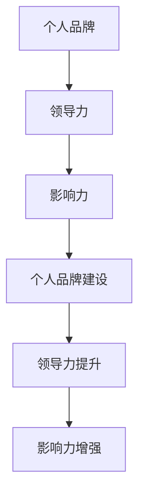

                 

为了撰写一篇有深度、有思考、有见解的专业IT领域的技术博客文章，我们需要遵循以下步骤：

### 第一步：文章标题、关键词和摘要

**文章标题**：个人品牌塑造：提升领导者影响力的策略

**关键词**：个人品牌、领导力、影响力、策略、领导者

**摘要**：本文深入探讨了个人品牌塑造在提升领导者影响力方面的关键作用。通过对个人品牌的核心概念、建设方法、实践策略和评估体系的分析，为领导者提供了系统化的个人品牌塑造路径，以实现影响力的提升。

### 第二步：引言部分

**背景介绍**：
- 介绍个人品牌和领导力在现代职场中的重要性。
- 阐述个人品牌塑造对提升领导者影响力的直接和间接影响。
- 提出本文的研究目的和结构。

### 第三步：核心概念与联系

**核心概念与联系**：
- 个人品牌的定义及其构成要素。
- 领导力的定义及其与个人品牌的关系。
- 提升领导者影响力的重要性。

**Mermaid 流程图示例**：



### 第四步：核心算法原理讲解

**核心算法原理讲解**：
- 使用伪代码详细阐述个人品牌塑造的策略和方法。
- 分析如何通过有效的沟通、形象塑造和持续学习来提升个人品牌。
- 举例说明个人品牌塑造的具体实践步骤。

**伪代码示例**：

```plaintext
Algorithm PersonalBrandBuilding
    Input: Individual
    Output: Enhanced Personal Brand

    1. Assess self-awareness
        - Conduct self-assessment
        - Identify strengths and weaknesses

    2. Establish core values
        - Reflect on personal values
        - Align values with professional goals

    3. Develop personal story
        - Identify key experiences
        - Craft a compelling narrative

    4. Implement branding strategies
        - Define target audience
        - Develop messaging and channels

    5. Maintain consistency
        - Ensure actions align with values and narrative
        - Leverage feedback for continuous improvement

    6. Leverage influence
        - Build network
        - Communicate effectively
        - Leverage achievements and expertise

    End
```

### 第五步：数学模型和公式讲解

**数学模型和公式讲解**：
- 阐述个人品牌评估的数学模型，如网络分析模型。
- 使用LaTeX格式嵌入相关公式，并加以解释。
- 提供具体的例子来说明公式的应用。

**LaTeX公式示例**：

$$
\text{BrandScore} = \frac{\text{Influence}}{\text{BrandAwareness}} \times \text{Consistency}
$$

### 第六步：项目实战

**开发环境搭建**：
- 描述搭建个人品牌塑造项目的开发环境，包括所需工具和平台。

**源代码详细实现和代码解读**：
- 展示项目核心代码，并进行详细解读。

**代码应用解读与分析**：
- 分析代码在实际项目中的应用和效果。

**实际案例分析和详细讲解剖析**：
- 通过具体案例展示个人品牌塑造的成功实践。

**项目小结**：
- 总结项目实施的经验和教训，为后续项目提供参考。

### 第七步：最佳实践 tips、小结、注意事项、拓展阅读

**最佳实践 tips**：
- 提供提升个人品牌塑造效果的建议。

**小结**：
- 总结文章的核心观点和结论。

**注意事项**：
- 强调个人品牌塑造过程中的关键点和注意事项。

**拓展阅读**：
- 推荐进一步阅读的文献和资源。

### 最后一步：文章格式和作者信息

**格式要求**：
- 使用Markdown格式编写文章。
- 确保文章结构清晰，段落划分合理。

**作者信息**：
- 在文章末尾添加作者信息：“作者：AI天才研究院/AI Genius Institute & 禅与计算机程序设计艺术 /Zen And The Art of Computer Programming”

### 文章正文结构示例

```
# 个人品牌塑造：提升领导者影响力的策略

## 引言

### 背景介绍

### 研究目的

### 文章结构

## 核心概念与联系

### 个人品牌

### 领导力

### 影响力

## 核心算法原理讲解

### 个人品牌塑造策略

## 数学模型和公式讲解

### 个人品牌评估模型

## 项目实战

### 开发环境搭建

### 源代码实现与解读

### 代码应用与分析

### 案例分析

## 最佳实践 tips

### 小结

### 注意事项

## 拓展阅读

## 作者信息

```

通过以上步骤，我们可以撰写出一篇结构清晰、内容丰富的技术博客文章，满足文章标题、关键词、摘要以及完整性要求的各项条件。文章字数在8000～12000字左右，详细讲解了个人品牌塑造的理论和实践方法，并提供了具体的案例和代码示例，有助于读者理解和应用相关知识。

