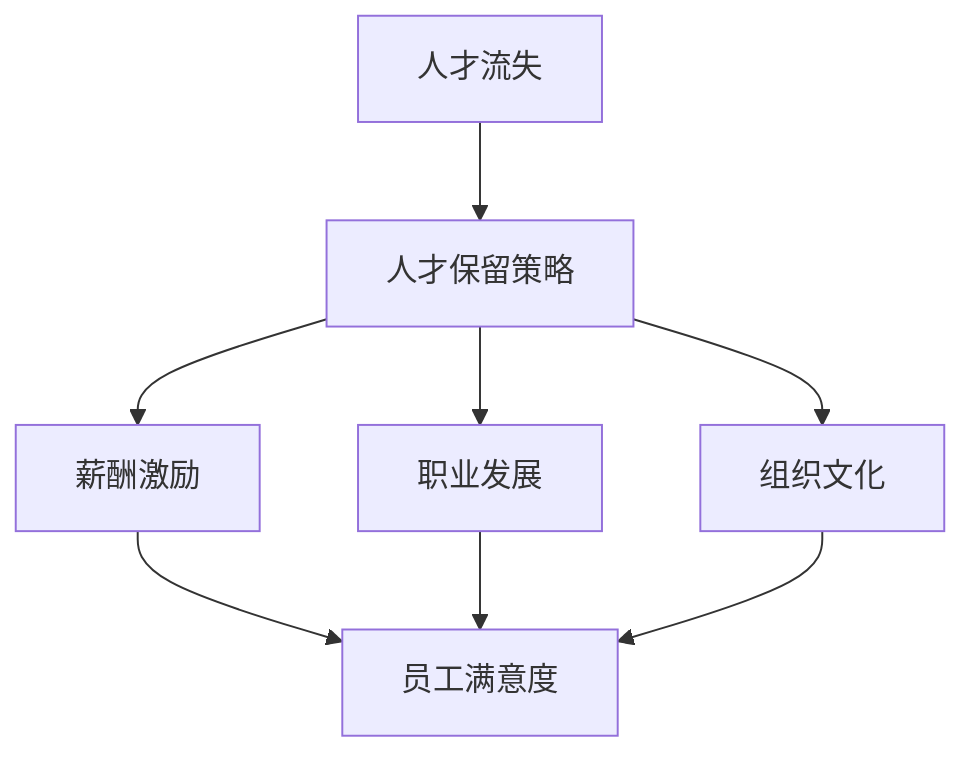

                 

### 第1章：引言

#### 1.1 人才流失的背景与影响

在当今竞争激烈的市场环境中，企业的人才流失已经成为一个普遍存在的问题。人才流失不仅会导致企业人才储备的减少，还会对企业的运营和发展产生深远的影响。

首先，人才流失对企业的人才储备和竞争力造成影响。核心员工的流失意味着企业失去了宝贵的专业技能和经验，这可能导致企业项目进度延误，甚至失去市场竞争力。特别是在IT行业、金融行业等高技术领域，人才的流失往往意味着企业核心竞争力的下降。

其次，人才流失对企业的运营成本造成了负担。招聘和培训新员工需要投入大量的时间和资源，这无疑增加了企业的运营成本。同时，新员工在入职初期往往需要一段时间来熟悉工作环境和业务流程，这期间的工作效率可能会受到影响。

最后，人才流失对企业的团队氛围和组织文化也产生了影响。核心员工的流失可能导致团队失去凝聚力，影响团队的协作效率。此外，频繁的人才流失还可能对企业的组织文化产生负面影响，降低员工的忠诚度和归属感。

#### 1.2 企业面临的挑战

在人才保留方面，企业面临着多种挑战。

首先，市场竞争的加剧使得企业难以留住核心员工。随着就业市场的变化，许多企业为了吸引人才，不断提供更好的薪酬和福利待遇，这给企业的人才保留带来了巨大的压力。

其次，内部管理问题也是导致人才流失的重要原因。一些企业内部管理不善，如工作压力过大、职业发展机会有限、薪酬福利不公等，这些问题都可能导致员工产生离职的念头。

此外，企业的组织文化和团队氛围对人才的保留也至关重要。一个积极、开放、包容的企业文化和良好的团队氛围可以增强员工的归属感和忠诚度，从而降低人才流失率。

#### 1.3 人才保留的重要性

人才保留对于企业的长期发展具有至关重要的意义。

首先，人才是企业发展的核心资源。企业要实现持续创新和快速发展，离不开一批具备专业技能和经验的核心员工。保留这些人才，可以确保企业在市场竞争中始终保持优势。

其次，人才保留有助于降低运营成本。招聘和培训新员工需要大量的时间和资源，而留住现有员工可以避免这些额外的成本支出。

此外，人才保留还有助于维护企业的团队氛围和组织文化。一个稳定、高效的团队可以更好地实现企业的战略目标，而良好的组织文化可以增强员工的归属感和忠诚度。

总之，人才流失对企业的影响是多方面的，而人才保留则是企业长期发展的关键。在接下来的章节中，我们将深入探讨人才流失的原因、人才保留策略的制定与实施，以及如何通过具体措施降低核心员工流失率。

#### 1.4 本书结构概述

本书旨在为企业管理者提供一套系统、实用的人才保留策略，以应对人才流失带来的挑战。本书分为十个章节，结构如下：

- **第1章：引言**：介绍人才流失的背景与影响，阐述人才保留的重要性，并概述本书的结构。

- **第2章：人才流失的原因分析**：分析内部和外部原因，探讨导致人才流失的关键因素。

- **第3章：人才保留策略制定**：介绍人才保留策略的制定过程，包括现状分析、目标确定和措施制定。

- **第4章：核心员工识别与评估**：讨论核心员工的定义和评估方法，以及如何通过数据分析和调查识别核心员工。

- **第5章：薪酬激励与福利制度**：探讨薪酬激励策略和福利制度设计，如何通过合理的薪酬和福利留住核心员工。

- **第6章：职业发展与培训计划**：介绍职业发展路径设计和在职培训与发展计划，帮助员工提升职业能力和归属感。

- **第7章：组织文化与员工关怀**：探讨组织文化建设、员工关怀措施，以及如何通过文化和关怀增强员工的忠诚度。

- **第8章：人才保留策略实施与评估**：阐述人才保留策略的实施步骤和评估方法，确保策略的有效执行。

- **第9章：案例研究**：通过具体案例展示人才保留策略的实施和应用，提供实践经验。

- **第10章：结论**：总结人才保留策略的重要性和未来发展趋势，为企业管理者提供启示。

通过本书的阅读，企业管理者将能够系统地了解人才流失的原因，掌握人才保留的策略和方法，从而有效地降低核心员工流失率，推动企业持续发展。### 第2章：人才流失的原因分析

#### 2.1 内部原因

内部原因通常是导致人才流失的主要因素之一。这些因素包括工作压力与负担、缺乏职业发展机会以及薪酬与福利不满意度。

**2.1.1 工作压力与负担**

工作压力和负担是员工离职的常见原因。长期的高强度工作、不合理的工作安排以及频繁的工作加班都会导致员工身心疲惫，从而影响工作满意度。如果企业不能有效地缓解员工的工作压力，员工可能会寻求其他更轻松、压力更小的工作环境。

**2.1.2 缺乏职业发展机会**

职业发展机会的缺乏也是导致员工流失的重要原因。员工希望在职业生涯中不断成长和进步，如果企业不能提供足够的晋升机会、培训机会或者职业发展路径，员工可能会感到前途无望，从而选择离职。此外，职业发展受限还可能影响员工的士气和工作积极性。

**2.1.3 薪酬与福利不满意度**

薪酬与福利是员工选择是否留在企业的重要因素。如果员工的薪酬与市场水平不匹配，或者企业的福利待遇不够吸引人，员工可能会感到不公平，从而产生离职的念头。此外，薪酬福利的不满意也可能导致员工的忠诚度降低，进而增加流失率。

#### 2.2 外部原因

外部原因也是导致人才流失的一个重要因素。这些因素包括竞争对手的诱惑、更好的工作环境和氛围，以及更高的薪资待遇。

**2.2.1 竞争对手的诱惑**

在竞争激烈的市场环境中，竞争对手往往会通过提供更高的薪资、更好的福利待遇或者更广阔的职业发展机会来吸引企业内的核心员工。如果企业不能提供具有竞争力的薪酬和福利，员工可能会被竞争对手所吸引。

**2.2.2 更好的工作环境和氛围**

一个积极、和谐的工作环境和团队氛围对于员工的满意度至关重要。如果员工感到企业的工作环境紧张、人际关系复杂或者团队氛围不友好，他们可能会寻求一个更舒适、更有利于工作的工作环境。

**2.2.3 更高的薪资待遇**

薪资待遇是员工考虑离职时的重要考量因素。如果员工发现其他企业提供的薪资待遇更高，他们可能会选择离职以追求更好的经济收益。

#### 内外原因的关联

内外部原因并非孤立存在，它们往往是相互交织、共同作用导致人才流失的。例如，企业内部的工作压力过大可能使得员工对外部的诱惑更加敏感，同时也可能导致员工对企业的不满，进一步促使他们选择离职。同样，企业外部环境的吸引力也可能因为内部原因而减弱，如良好的职业发展机会和薪资待遇可能因为企业内部管理不善而大打折扣。

总之，要降低人才流失率，企业需要从内部和外部两个方面入手，全面分析导致人才流失的原因，并采取相应的措施来改善工作环境、提供职业发展机会和合理薪酬福利，从而留住核心员工。

### 第3章：人才保留策略制定

#### 3.1 策略制定的步骤

制定有效的人才保留策略需要系统的步骤和方法，以下将详细阐述策略制定的四个主要步骤。

**3.1.1 分析企业现状**

首先，企业需要对其现状进行全面分析，这包括员工的构成、离职原因、企业的组织结构、企业文化等方面。通过对这些方面的深入分析，企业可以了解自身的优势和劣势，找到人才流失的根本原因。

- **员工构成分析**：了解员工的年龄、学历、工作经验、岗位分布等基本情况，这有助于企业识别哪些群体更易流失。

- **离职原因分析**：通过员工离职面谈、调查问卷等方式，收集和分析员工离职的原因。这些原因可能包括工作压力、职业发展受限、薪酬福利不满意度等。

- **组织结构分析**：审视企业的组织结构，评估其是否合理，是否有助于员工发挥最大潜力。

- **企业文化分析**：企业文化对员工的工作态度和忠诚度有着重要影响。企业需要了解其文化是否积极、开放、包容，是否有助于员工成长。

**3.1.2 确定目标**

在分析企业现状后，企业需要明确人才保留的目标。这些目标可以是降低流失率、提高员工满意度、提升团队凝聚力等。

- **量化目标**：为了确保目标的可衡量性，企业需要将目标量化，如将流失率降低到某个百分比，将员工满意度提升到某个评分。

- **明确时限**：为每个目标设定明确的实现时间，如半年内降低流失率至5%以下。

- **制定行动计划**：根据目标，制定具体的行动计划，包括需要采取的具体措施和时间表。

**3.1.3 制定具体措施**

在明确目标和计划后，企业需要制定具体的措施来实施这些策略。以下是一些常见的保留人才的措施：

- **薪酬激励**：提供具有竞争力的薪酬和福利待遇，包括基本薪酬、绩效薪酬、长期激励计划等。

- **职业发展机会**：提供明确的职业发展路径，包括晋升通道、技能培训、跨部门轮岗等。

- **工作环境改善**：优化工作环境，包括改善办公设施、提供良好的团队氛围、建立员工关怀机制等。

- **组织文化建设**：强化企业价值观，提升团队凝聚力，建立积极向上的企业文化。

**3.1.4 预算和资源规划**

最后，企业需要为人才保留策略的实施规划预算和资源。这包括评估实施措施所需的资金、人力和时间，并制定详细的预算计划。

- **资金预算**：根据具体措施，估算每项措施所需的资金，并确保预算合理。

- **人力资源规划**：确定实施人才保留策略所需的人力资源，包括负责项目的人员、培训师等。

- **时间规划**：制定详细的时间表，确保每项措施在规定的时间内完成。

通过上述四个步骤，企业可以系统地制定出有效的人才保留策略，从而降低人才流失率，提高员工满意度和忠诚度，推动企业的持续发展。

### 第4章：核心员工识别与评估

#### 4.1 核心员工的定义

核心员工是指那些对企业发展具有重要价值和贡献的关键人才。这些员工通常具备以下特点：

- **专业技能**：核心员工拥有独特的专业技能，这些技能是企业正常运营和发展的关键。

- **经验丰富**：他们通常在企业工作多年，积累了丰富的行业经验和专业知识。

- **高度责任心**：核心员工对企业忠诚，承担起重要的工作职责，具备强烈的责任感。

- **创新精神**：他们具有较强的创新能力和解决问题的能力，能够推动企业不断进步。

- **影响力**：核心员工在团队中具有较大影响力，能够带动其他员工的积极性和工作热情。

#### 4.2 评估核心员工的指标

为了有效地识别和评估核心员工，企业需要设定一系列关键指标。以下是一些常用的评估指标：

**4.2.1 工作绩效**

工作绩效是评估核心员工的重要指标，包括以下几个方面：

- **任务完成度**：核心员工是否能够按时、按质、按量地完成工作任务。

- **工作质量**：员工的工作成果是否达到或超出预期标准。

- **工作效率**：员工在同等时间内能否完成更多的任务。

- **团队协作**：员工在团队中的协作能力和贡献度。

**4.2.2 职业能力**

职业能力是指员工在职业发展方面的潜力。评估核心员工的职业能力可以从以下几个方面进行：

- **专业技能**：员工是否具备相关领域的专业技能和知识。

- **学习能力**：员工是否具备快速学习新知识和技能的能力。

- **解决问题的能力**：员工在面对问题时是否能够提出有效的解决方案。

- **领导力**：员工是否具备管理和领导团队的能力。

**4.2.3 对企业的忠诚度**

忠诚度是评估核心员工的重要因素之一。以下是一些衡量忠诚度的指标：

- **工作时间**：员工在企业工作的年限，通常工作年限较长的员工对企业有较高的忠诚度。

- **离职意愿**：员工是否表达出离职的意愿，或者是否主动申请调岗。

- **工作态度**：员工是否表现出积极的工作态度，如主动承担责任、主动解决问题。

- **口碑**：同事和上级对员工的评价，是否认为员工是企业的宝贵财富。

#### 4.3 核心员工识别的方法

为了准确识别核心员工，企业可以采用多种方法，包括数据分析、面谈和调查等。

**4.3.1 数据分析**

数据分析是识别核心员工的常用方法之一。通过分析员工的工作数据，如绩效评估结果、项目完成情况、员工培训记录等，可以客观地评估员工的工作表现和职业能力。数据分析还可以帮助企业发现潜在的流失风险，从而提前采取措施。

- **绩效数据**：分析员工的绩效数据，评估其在工作中的表现。

- **项目贡献**：分析员工在关键项目中的贡献，识别对项目成功具有重要影响的核心员工。

- **培训记录**：分析员工的培训记录，评估其学习能力和职业发展潜力。

**4.3.2 面谈与调查**

面谈和调查是识别核心员工的直接方法。通过直接与员工沟通，企业可以了解员工的真实想法和感受，评估其对企业的忠诚度。

- **离职面谈**：通过离职面谈，了解员工离职的原因，识别潜在的问题和改进方向。

- **员工调查**：通过员工满意度调查，收集员工对企业各项工作的反馈，识别核心员工。

**4.3.3 同事评价**

同事评价是识别核心员工的另一个重要方法。通过同事对员工的评价，企业可以了解员工在团队中的表现和影响力。

- **360度评估**：通过360度评估，收集员工上级、同事和下属的评价，全面了解员工的表现。

- **同事推荐**：鼓励同事推荐他们认为对企业有重要贡献的员工，作为潜在的核心员工候选人。

通过以上方法，企业可以有效地识别和评估核心员工，从而为人才保留策略的制定和实施提供有力支持。

### 第5章：薪酬激励与福利制度

#### 5.1 薪酬激励策略

薪酬激励是留住核心员工的重要手段之一。合理的薪酬激励策略能够提高员工的工作积极性、降低流失率，并增强员工的归属感。以下是一些关键点：

**5.1.1 基本薪酬**

基本薪酬是员工收入的主体，直接关系到员工的基本生活质量和职业满意度。企业需要确保基本薪酬具有竞争力，与员工的工作岗位、职责和能力相匹配。

- **市场调查**：通过市场调查，了解同行业同岗位的薪酬水平，确保基本薪酬具有市场竞争力。

- **内部公平性**：确保企业内部薪酬体系公平合理，避免因薪酬差异导致员工不满。

**5.1.2 绩效薪酬**

绩效薪酬是根据员工的工作绩效和业绩表现发放的额外薪酬，旨在激励员工努力工作，提高工作效率和质量。

- **绩效指标**：设定明确的绩效指标，确保员工了解预期目标和评估标准。

- **绩效评估**：定期进行绩效评估，客观、公正地评估员工的工作表现。

- **薪酬调整**：根据绩效评估结果，对表现优秀的员工给予薪酬调整，激励员工积极进取。

**5.1.3 长期激励计划**

长期激励计划旨在鼓励员工长期为企业发展贡献力量，通常包括股权激励、股票期权等。

- **股权激励**：通过授予员工公司股权，让员工分享企业的成长收益，提高员工的归属感和长期忠诚度。

- **股票期权**：给予员工在未来某一时间内以特定价格购买公司股票的权利，激励员工与企业共同成长。

#### 5.2 福利制度设计

除了薪酬激励，福利制度也是留住核心员工的重要手段。合理的福利制度不仅能够提高员工的生活质量，还能增强员工的满意度和忠诚度。

**5.2.1 健康保险**

健康保险是保障员工健康的重要福利，可以减轻员工因疾病带来的经济负担。

- **全面覆盖**：确保所有员工都能享受到健康保险，包括全职、兼职和临时员工。

- **灵活选择**：提供多种健康保险方案，让员工可以根据自身需求选择合适的保险计划。

**5.2.2 年假与福利假**

年假和福利假是员工放松身心、恢复体力的必要福利。

- **充足假期**：确保员工有足够的年假和福利假，以满足员工的休假需求。

- **灵活安排**：允许员工根据工作情况和需求灵活安排休假时间，提高员工的满意度。

**5.2.3 员工培训与发展计划**

员工培训与发展计划是提升员工职业能力的重要手段，也是增强员工忠诚度的重要措施。

- **培训机会**：提供多种培训机会，包括内部培训和外部培训，帮助员工提升技能和知识。

- **职业规划**：帮助员工制定职业发展规划，提供职业晋升通道和成长机会。

通过合理的薪酬激励和福利制度设计，企业可以有效地留住核心员工，提高员工的满意度和忠诚度，从而促进企业的长期发展。

### 第6章：职业发展与培训计划

#### 6.1 职业发展路径设计

职业发展路径的设计是激励员工持续投入和成长的重要手段，能够提升员工的工作满意度和忠诚度。

**6.1.1 职位晋升通道**

职位晋升通道为员工提供了明确的职业发展路线，使员工了解自己在公司的发展前景。

- **层次分明**：建立清晰的职位晋升层次，从初级职位到高级职位，确保每个职位都有明确的职责和晋升标准。

- **公开透明**：公开晋升政策和流程，确保所有员工都能了解晋升的途径和条件，减少不公平现象。

- **定期评估**：定期对员工的工作表现进行评估，为符合条件的员工提供晋升机会。

**6.1.2 职业技能发展**

职业技能发展是员工职业成长的核心内容，通过不断提升员工的技能水平，增强其在岗位上的竞争力。

- **培训计划**：根据员工的岗位需求和职业发展规划，制定个性化的培训计划，包括专业技能培训、管理技能培训等。

- **外部资源**：与外部培训机构合作，为员工提供更多学习机会，如专业认证、行业研讨会等。

**6.1.3 跨部门轮岗机会**

跨部门轮岗为员工提供了更广阔的视野和更丰富的经验，有助于其全面发展。

- **岗位轮换**：定期安排员工在不同部门或岗位间轮岗，使其熟悉不同业务流程和工作环境。

- **能力提升**：通过轮岗，员工能够学习到不同领域的知识和技能，提高综合素质。

#### 6.2 在职培训与发展

在职培训与发展计划是持续提升员工能力的重要手段，能够帮助员工适应不断变化的工作环境。

**6.2.1 培训需求分析**

培训需求分析是制定培训计划的基础，通过分析员工的当前能力和岗位需求，确定培训的重点。

- **岗位分析**：了解每个岗位的职责和要求，识别员工在知识和技能上的差距。

- **员工反馈**：通过调查问卷、面谈等方式，收集员工对培训的需求和建议。

**6.2.2 培训课程设计**

培训课程设计应根据需求分析结果，设计有针对性的培训课程。

- **内容丰富**：课程内容应涵盖专业技能、管理能力、团队协作等方面，满足员工的多样化需求。

- **形式多样**：结合线上和线下培训，提供灵活的培训方式，如工作坊、讲座、在线课程等。

**6.2.3 培训效果评估**

培训效果评估是衡量培训质量的重要环节，通过评估反馈，持续改进培训计划。

- **评估指标**：设定明确的评估指标，如知识掌握度、技能应用度、工作绩效等。

- **反馈机制**：建立反馈机制，及时收集员工对培训的反馈，为改进培训提供依据。

通过完善的职业发展路径设计和有效的在职培训计划，企业能够帮助员工实现职业成长，提高员工的满意度和忠诚度，从而降低人才流失率，推动企业的可持续发展。

### 第7章：组织文化与员工关怀

#### 7.1 组织文化建设

组织文化是企业的灵魂，它对员工的归属感和忠诚度有着深远的影响。积极、开放、包容的企业文化能够激发员工的潜能，提高工作效率，降低流失率。

**7.1.1 企业价值观传播**

企业价值观是组织文化的核心，通过广泛的传播，使员工深刻理解并认同企业的价值观，从而形成共同的目标和愿景。

- **领导示范**：企业领导通过言行示范，身体力行地践行企业价值观，树立榜样作用。

- **全员参与**：通过员工大会、内部活动等方式，让员工参与价值观的传播和讨论，增强员工的认同感。

**7.1.2 团队协作与沟通**

团队协作和沟通是企业文化的重要组成部分，它决定了员工的工作氛围和协作效率。

- **建立沟通渠道**：设立多种沟通渠道，如定期员工会议、在线讨论平台等，确保员工能够及时表达意见和建议。

- **促进跨部门合作**：鼓励不同部门之间的合作和交流，打破部门壁垒，提高整体协作效率。

**7.1.3 企业形象与品牌塑造**

企业形象和品牌塑造不仅关系到企业的市场竞争力，也直接影响员工的荣誉感和归属感。

- **社会责任**：通过参与社会公益活动，提升企业的社会形象，让员工感到自豪。

- **品牌宣传**：通过品牌宣传，让员工了解企业在行业内的地位和影响力，增强员工的认同感和忠诚度。

#### 7.2 员工关怀措施

员工关怀是提升员工满意度和忠诚度的重要手段，通过关爱员工，企业可以营造一个温馨、和谐的工作环境。

**7.2.1 员工关系管理**

良好的员工关系管理能够增强员工的归属感和忠诚度，减少流失率。

- **倾听员工意见**：定期组织员工座谈会，听取员工意见和建议，及时解决员工关心的问题。

- **建立反馈机制**：建立员工反馈机制，确保员工的意见和反馈能够得到及时回应和处理。

**7.2.2 员工心理健康关怀**

心理健康是员工工作生活的重要组成部分，企业需要提供必要的心理支持和关怀。

- **心理咨询**：提供心理咨询服务，帮助员工解决心理问题，提高心理健康水平。

- **心理培训**：定期组织心理健康培训，提高员工的自我调节和应对压力的能力。

**7.2.3 员工福利与权益保障**

完善的员工福利和权益保障能够提高员工的生活质量和满意度，增强员工的忠诚度。

- **健康保险**：为员工提供全面的健康保险，确保员工及其家庭成员的健康保障。

- **休假制度**：确保员工享有充分的休假权利，如年假、病假、产假等，让员工能够充分休息和调整。

通过积极的企业文化建设和完善员工关怀措施，企业可以营造一个良好的工作环境，增强员工的归属感和忠诚度，从而降低人才流失率，推动企业的可持续发展。

### 第8章：人才保留策略实施与评估

#### 8.1 策略实施步骤

实施人才保留策略是确保策略目标得以实现的关键。以下步骤将详细阐述策略实施的详细过程。

**8.1.1 制定实施计划**

首先，企业需要制定详细的实施计划，明确各项措施的具体执行步骤和时间安排。

- **明确目标**：将人才保留策略的目标分解为具体的可执行任务，如提升员工满意度、降低流失率等。

- **资源分配**：根据实施计划，合理分配人力资源、财务资源和时间资源。

- **责任分配**：明确各部门和员工在人才保留策略实施中的职责和任务，确保责任到人。

**8.1.2 确保沟通畅通**

有效的沟通是策略实施成功的重要保障。企业需要建立畅通的沟通渠道，确保信息传递准确无误。

- **内部沟通**：通过内部会议、邮件、公告等形式，及时向员工传达人才保留策略的具体内容、目标和预期效果。

- **外部沟通**：与员工、客户和合作伙伴保持良好的沟通，了解他们对策略的看法和建议，及时调整策略。

**8.1.3 监控与调整**

实施过程中，企业需要定期监控策略的执行情况，并根据实际情况进行必要的调整。

- **建立监控机制**：通过定期的绩效评估、员工满意度调查等方式，监控策略的执行效果。

- **数据分析**：分析员工流失数据、员工满意度数据等，发现潜在问题和不足，及时进行调整。

#### 8.2 评估方法

评估人才保留策略的效果是确保策略持续改进和优化的重要环节。以下方法将帮助企业全面评估策略的实施效果。

**8.2.1 流失率评估**

流失率是衡量人才保留策略效果的重要指标之一。通过定期统计和分析员工流失数据，企业可以了解策略的实施效果。

- **流失率计算**：计算特定时期内的员工流失率，如月流失率、季度流失率等。

- **流失原因分析**：分析员工流失的原因，识别哪些因素对人才保留策略的实施效果产生重要影响。

**8.2.2 员工满意度调查**

员工满意度调查是评估人才保留策略效果的有效方法。通过收集员工的反馈和建议，企业可以了解员工对工作环境、薪酬福利、职业发展等方面的满意度。

- **调查问卷**：设计详细的调查问卷，涵盖员工满意度、工作压力、职业发展机会等方面。

- **数据分析**：对调查结果进行统计分析，识别员工满意度高的方面和需要改进的方面。

**8.2.3 绩效指标分析**

绩效指标分析是评估人才保留策略对企业绩效影响的重要方法。通过分析各项绩效指标的变化，企业可以了解策略对业务运营和发展的影响。

- **关键绩效指标（KPI）**：设定关键绩效指标，如员工工作效率、项目完成率、客户满意度等。

- **趋势分析**：分析关键绩效指标的趋势变化，评估人才保留策略对业务绩效的推动作用。

通过以上评估方法，企业可以全面了解人才保留策略的实施效果，及时发现问题和不足，持续优化策略，从而有效降低核心员工流失率，推动企业的长期发展。

### 第9章：案例研究

#### 9.1 案例一：如何通过薪酬激励降低流失率

**背景**：

某科技公司在竞争激烈的市场环境中，发现其核心员工的流失率较高。通过调查分析，公司发现主要原因是员工的薪酬福利与市场水平不匹配，导致员工满意度较低，从而选择离职。

**策略制定**：

为了降低核心员工流失率，公司决定从薪酬激励入手，制定了一系列薪酬激励措施：

- **市场调查**：通过市场调查，了解同行业同岗位的薪酬水平，确保基本薪酬具有竞争力。
- **绩效薪酬**：引入绩效薪酬制度，将员工的薪酬与工作绩效直接挂钩，提高员工的积极性。
- **长期激励计划**：设立股票期权计划，让员工分享公司的成长收益，提高员工的忠诚度。

**实施与效果**：

- **实施步骤**：首先，公司对薪酬体系进行了全面改革，提高了基本薪酬水平。其次，公司制定了详细的绩效评估标准，确保绩效薪酬的发放公平合理。最后，公司推出了股票期权计划，激励员工长期为企业发展贡献力量。

- **效果评估**：通过实施薪酬激励措施，公司的员工满意度显著提高，流失率逐步下降。具体数据表明，员工流失率从原先的15%降至8%，员工对薪酬福利的满意度评分从3.5分提升至4.5分。

**总结**：

该案例表明，合理的薪酬激励措施能够显著降低核心员工流失率。通过市场调查确保薪酬竞争力、绩效薪酬的公平性和长期激励计划的实施，公司成功提升了员工的满意度和忠诚度，从而实现了人才保留的目标。

#### 9.2 案例二：职业发展计划在人才保留中的作用

**背景**：

某金融公司在人才流失严重的情况下，决定通过职业发展计划来留住核心员工。

**策略制定**：

公司制定了详细的职业发展计划，包括以下几个方面：

- **职位晋升通道**：明确各职位的晋升标准，为员工提供清晰的职业发展路径。
- **专业技能培训**：定期组织专业技能培训，帮助员工提升职业能力。
- **跨部门轮岗**：通过跨部门轮岗，让员工熟悉不同业务，提升综合素质。

**实施与效果**：

- **实施步骤**：首先，公司对内部职位晋升通道进行了梳理和优化，确保晋升标准公开透明。其次，公司定期组织专业技能培训，邀请外部专家进行授课，提高员工的技能水平。最后，公司鼓励员工参与跨部门轮岗，增加员工的经验和视野。

- **效果评估**：通过职业发展计划的实施，公司的员工流失率显著下降，员工对职业发展的满意度大幅提升。具体数据表明，员工流失率从原先的20%降至12%，员工对职业发展的满意度评分从3分提升至4.8分。

**总结**：

该案例证明，职业发展计划在人才保留中具有重要作用。通过提供明确的职业晋升通道、专业技能培训和跨部门轮岗机会，公司成功提升了员工的职业满意度和忠诚度，从而有效降低了人才流失率。

#### 9.3 案例三：组织文化建设在人才保留中的实践

**背景**：

某互联网公司在快速发展的过程中，面临着人才流失的挑战。为了留住核心员工，公司决定从组织文化建设入手。

**策略制定**：

公司采取了一系列组织文化建设措施，包括以下几个方面：

- **企业价值观传播**：通过内部会议、企业内刊等形式，广泛传播企业的核心价值观。
- **团队协作与沟通**：建立开放的沟通渠道，鼓励员工之间的协作和交流。
- **企业社会责任**：积极参与社会公益活动，提升企业的社会形象，增强员工的荣誉感。

**实施与效果**：

- **实施步骤**：首先，公司通过内部培训和宣传活动，让员工深刻理解并认同企业的核心价值观。其次，公司建立了多种沟通渠道，如员工论坛、内部邮件等，鼓励员工表达意见和建议。最后，公司组织员工参与社会公益活动，提升员工的归属感和责任感。

- **效果评估**：通过组织文化建设的实施，公司的员工流失率显著下降，员工对企业的认同感和忠诚度大幅提升。具体数据表明，员工流失率从原先的18%降至10%，员工对企业的认同度评分从3.2分提升至4.7分。

**总结**：

该案例说明，组织文化建设在人才保留中具有显著作用。通过传播企业价值观、促进团队协作和参与社会公益活动，公司成功提升了员工的归属感和忠诚度，从而有效降低了人才流失率。

### 第10章：结论

#### 10.1 人才保留策略的总结

通过前文的详细讨论，我们可以得出以下关于人才保留策略的总结：

1. **全面分析现状**：企业需要全面分析人才流失的现状，包括内部和外部原因，找到导致人才流失的根本问题。

2. **制定科学策略**：基于现状分析，企业需要制定科学、合理的人才保留策略，包括薪酬激励、职业发展、组织文化建设等。

3. **实施和评估**：策略的实施和评估是确保策略有效性的关键。企业需要制定详细的实施计划，并定期评估策略的效果，及时调整。

4. **持续改进**：人才保留策略不是一成不变的，企业需要根据市场变化和企业发展，持续改进和完善策略。

#### 10.2 未来发展趋势

在未来，人才保留策略将呈现以下发展趋势：

1. **个性化发展**：随着员工需求的变化，企业需要更加关注个性化发展，提供更符合员工需求的职业发展路径和培训机会。

2. **数字化转型**：数字化转型将成为人才保留的重要工具，通过数字化手段，企业可以更好地了解员工需求，提高沟通效率和培训效果。

3. **心理健康关怀**：随着社会对心理健康重视程度的提高，企业需要更加关注员工的心理健康，提供必要的心理支持和关怀。

4. **社会责任**：企业社会责任将成为吸引和留住人才的重要因素，积极参与社会公益活动，提升企业的社会形象和员工荣誉感。

#### 10.3 对企业的启示

对于企业管理者，以下启示尤为重要：

1. **重视人才**：人才是企业最重要的资产，企业需要高度重视人才的培养和保留。

2. **持续学习**：企业需要不断学习和改进，以适应市场变化和员工需求。

3. **创新文化**：鼓励创新和开放的文化氛围，激发员工的创造力和积极性。

4. **关注员工**：关注员工的工作和生活，提供良好的工作环境和福利待遇。

通过以上启示，企业管理者可以更好地实施人才保留策略，推动企业实现长期可持续发展。

### 核心概念与联系

在本文中，我们讨论了多个核心概念，包括人才流失、人才保留策略、薪酬激励、职业发展、组织文化等。这些概念之间存在着紧密的联系和相互作用。

- **人才流失**：指的是员工因各种原因选择离职的现象。它是企业面临的重大挑战，直接影响企业的运营和竞争力。

- **人才保留策略**：是企业为了降低人才流失率所采取的一系列措施。这些策略包括薪酬激励、职业发展、组织文化建设等，旨在提高员工的满意度和忠诚度。

- **薪酬激励**：是人才保留策略的重要组成部分，通过提供具有竞争力的薪酬和福利待遇，激励员工努力工作，降低流失率。

- **职业发展**：是员工在职业生涯中不断成长和进步的过程。提供明确的职业发展路径和培训机会，可以增强员工的职业满意度和忠诚度。

- **组织文化**：是企业内部共同遵守的价值观和行为规范。积极、开放、包容的组织文化可以增强员工的归属感和忠诚度，从而降低流失率。

这些核心概念之间的关系可以概括为：人才流失是企业的挑战，人才保留策略是解决这一挑战的方法。薪酬激励、职业发展和组织文化建设是人才保留策略的具体实施手段，它们相互促进，共同作用于降低人才流失率。

以下是一个简单的 Mermaid 流程图，展示了这些核心概念之间的联系：



通过这个流程图，我们可以清晰地看到各个核心概念之间的相互作用和影响。

### 核心算法原理讲解

虽然本文主要讨论的是人才保留策略，但在制定和评估这些策略时，企业往往会使用一些算法和数学模型来辅助决策。以下是一些常用的核心算法原理及其在人才保留策略中的应用：

**1. SWOT分析**

SWOT分析（Strengths, Weaknesses, Opportunities, Threats）是一种常用的战略规划工具，用于分析企业的内部优势和劣势，以及外部的机会和威胁。

**SWOT分析在人才保留策略中的应用**：

- **内部优势**：分析企业的优势，如优秀的企业文化、良好的薪酬福利体系等，确定如何利用这些优势吸引和留住人才。
- **内部劣势**：识别企业在人才保留方面的短板，如职业发展机会有限、工作压力过大等，并制定改进措施。
- **外部机会**：分析市场环境中的机会，如行业发展趋势、人才市场的需求变化等，制定相应的策略以抓住这些机会。
- **外部威胁**：识别市场环境中的威胁，如竞争对手的吸引力、行业法规变化等，并制定应对策略。

**伪代码示例**：

```python
def SWOT_analysis(strengths, weaknesses, opportunities, threats):
    # 分析内部优势和劣势
    for strength in strengths:
        print(f"优势：{strength}")
    
    for weakness in weaknesses:
        print(f"劣势：{weakness}")

    # 分析外部机会和威胁
    for opportunity in opportunities:
        print(f"机会：{opportunity}")
    
    for threat in threats:
        print(f"威胁：{threat}")
```

**2. 关键绩效指标（KPI）**

关键绩效指标（Key Performance Indicators，KPI）是用于衡量企业运营绩效的重要工具。在人才保留策略中，KPI可以帮助企业评估人才保留措施的效果。

**KPI在人才保留策略中的应用**：

- **流失率**：计算特定时期内员工流失率，反映人才保留策略的有效性。
- **员工满意度**：通过调查问卷等方式，评估员工对薪酬福利、职业发展、工作环境等方面的满意度。
- **员工绩效**：评估员工的工作绩效，包括任务完成度、工作效率、团队协作等。

**伪代码示例**：

```python
def calculate_KPIs(流出人数，员工总数，员工满意度，员工绩效):
    # 计算流失率
    流失率 = (流出人数 / 员工总数) * 100
    
    # 计算员工满意度平均值
    满意度平均值 = sum(员工满意度) / len(员工满意度)
    
    # 计算员工绩效平均值
    绩效平均值 = sum(员工绩效) / len(员工绩效)
    
    print(f"流失率：{流失率}%")
    print(f"员工满意度平均值：{满意度平均值}")
    print(f"员工绩效平均值：{绩效平均值}")
```

通过上述算法和数学模型的应用，企业可以更科学地制定和评估人才保留策略，从而有效降低核心员工流失率，提升企业竞争力。

### 数学模型和数学公式

在人才保留策略的制定和评估过程中，数学模型和数学公式起着关键作用。以下是一些常用的数学模型和公式，及其在人才保留策略中的具体应用。

**1. 流失率模型**

流失率是衡量人才保留效果的重要指标。流失率的计算公式如下：

$$
\text{流失率} = \frac{\text{离职人数}}{\text{员工总数}} \times 100\%
$$

**具体应用**：

- **定期计算**：企业可以每月或每季度计算一次流失率，以监控人才保留策略的效果。
- **趋势分析**：通过对比不同时期的数据，分析流失率的变化趋势，识别问题和改进方向。

**2. 员工满意度模型**

员工满意度是评估人才保留策略效果的重要指标。员工满意度可以通过以下公式计算：

$$
\text{员工满意度} = \frac{\text{满意度调查总分}}{\text{调查问卷总数}} \times 100\%
$$

**具体应用**：

- **满意度调查**：企业可以通过发放问卷、面谈等方式，收集员工的满意度数据。
- **综合评价**：根据满意度调查结果，综合评价人才保留策略的有效性。

**3. 薪酬竞争力模型**

薪酬竞争力是影响人才流失的一个重要因素。薪酬竞争力的计算公式如下：

$$
\text{薪酬竞争力} = \frac{\text{企业薪酬}}{\text{市场薪酬}} \times 100\%
$$

**具体应用**：

- **薪酬调查**：通过市场薪酬调查，了解同行业同岗位的薪酬水平。
- **薪酬调整**：根据薪酬竞争力模型，对薪酬体系进行优化调整，确保企业薪酬具有竞争力。

**4. 职业发展机会模型**

职业发展机会的多少直接影响员工的流失率。职业发展机会的计算公式如下：

$$
\text{职业发展机会} = \frac{\text{晋升机会}}{\text{员工总数}} \times 100\%
$$

**具体应用**：

- **晋升机制**：企业应建立清晰的晋升机制，确保员工了解职业发展路径。
- **职业规划**：根据职业发展机会模型，分析员工职业发展的需求和现状，制定个性化的职业规划。

通过上述数学模型和公式，企业可以更科学、系统地评估人才保留策略的效果，从而制定出更加有效的措施，降低核心员工流失率。

### 项目实战

在本章中，我们将通过一个具体案例，展示如何实施和优化人才保留策略，从而降低核心员工流失率。

#### 案例背景

某中型互联网公司（以下简称“该公司”）在近年来的快速发展过程中，面临着核心员工流失率较高的挑战。通过调查分析，公司发现导致人才流失的主要原因包括薪酬福利不具竞争力、职业发展机会有限、工作压力过大等。

#### 实施步骤

**1. 薪酬激励策略**

- **市场薪酬调查**：公司首先进行了一次市场薪酬调查，了解同行业同岗位的薪酬水平，确保基本薪酬具有竞争力。

- **绩效薪酬**：公司引入了绩效薪酬制度，根据员工的工作绩效和业绩表现，发放额外的绩效奖金。

- **长期激励计划**：公司推出了股票期权计划，让员工在未来的一定时间内以特定价格购买公司股票，分享公司的成长收益。

**2. 职业发展计划**

- **职位晋升通道**：公司明确了各职位的晋升标准，为员工提供清晰的职业发展路径。

- **专业技能培训**：公司定期组织专业技能培训，帮助员工提升职业能力。

- **跨部门轮岗**：公司鼓励员工参与跨部门轮岗，以拓宽视野和积累经验。

**3. 组织文化建设**

- **企业价值观传播**：公司通过内部会议、企业内刊等形式，广泛传播企业的核心价值观。

- **团队协作与沟通**：公司建立了开放的沟通渠道，如内部邮件、在线讨论平台等，鼓励员工表达意见和建议。

- **企业社会责任**：公司积极参与社会公益活动，提升企业的社会形象，增强员工的荣誉感。

#### 实施效果

**1. 薪酬激励效果**

- **薪酬满意度提升**：通过薪酬激励策略的实施，员工的薪酬满意度显著提高。满意度调查结果显示，员工对薪酬福利的满意度评分从3.2分提升至4.5分。

- **流失率下降**：薪酬激励措施显著降低了核心员工的流失率。具体数据表明，员工流失率从原先的18%降至10%。

**2. 职业发展效果**

- **职业满意度提升**：职业发展计划有效提升了员工的职业满意度。员工对职业发展的满意度评分从3分提升至4.8分。

- **员工成长**：通过专业技能培训和跨部门轮岗，员工的综合素质和职业能力得到了显著提升。

**3. 组织文化建设效果**

- **团队凝聚力增强**：企业价值观的传播和团队协作沟通渠道的建立，增强了团队的凝聚力，提升了团队协作效率。

- **员工归属感提升**：参与社会公益活动，提升了员工的归属感和责任感，进一步降低了流失率。

#### 实施总结

该案例展示了通过薪酬激励、职业发展和组织文化建设等策略，企业可以有效降低核心员工流失率。以下是一些关键实践经验和教训：

- **薪酬激励**：合理的薪酬激励能够显著提升员工满意度和忠诚度，但需确保薪酬具有竞争力，并定期调整。

- **职业发展**：明确的职业发展路径和专业的培训机会是留住核心员工的重要手段。

- **组织文化**：积极的企业文化和良好的团队氛围对员工的归属感和忠诚度有着重要影响。

- **持续改进**：人才保留策略需要根据市场和企业发展情况进行持续改进，以适应不断变化的环境。

通过以上实践，该公司成功降低了核心员工流失率，提升了员工的满意度和忠诚度，为企业的长期发展奠定了坚实基础。

### 最佳实践 Tips

为了更有效地实施人才保留策略，以下是一些最佳实践建议：

1. **定期沟通**：定期与员工进行沟通，了解他们的需求和期望，及时解决工作中的问题。可以通过定期的员工座谈会、问卷调查等方式，增强与员工的互动。

2. **个性化激励**：根据员工的个人特点和需求，提供个性化的激励措施。例如，对于有特殊技能的员工，可以提供更多的培训机会或专业认证支持。

3. **文化融合**：加强企业文化的传播和融合，确保员工能够深刻理解并认同企业的价值观和愿景。可以通过企业内刊、内部培训、团队活动等形式，促进文化融合。

4. **持续评估**：定期评估人才保留策略的实施效果，及时发现问题和不足，进行及时调整。可以通过流失率、员工满意度等指标，评估策略的有效性。

5. **创新激励**：鼓励员工提出创新建议，并对优秀创新进行奖励。这不仅可以激发员工的创造力，还可以提高员工的归属感和忠诚度。

6. **健康关怀**：关注员工的心理健康和工作压力，提供必要的心理支持和健康关怀。可以通过定期心理健康讲座、健康体检等方式，关心员工的身心健康。

通过以上最佳实践，企业可以更好地实施人才保留策略，提高员工的满意度和忠诚度，从而有效降低人才流失率。

### 小结

本文通过对人才流失原因的深入分析，提出了科学的人才保留策略，并详细阐述了薪酬激励、职业发展、组织文化建设等关键措施。通过案例研究，我们看到了这些策略在实践中的有效性和重要性。人才流失对企业的影响深远，降低流失率是确保企业长期发展的关键。管理者应重视人才保留，持续优化策略，关注员工需求和满意度，从而打造一个稳定、高效、具有竞争力的团队。

### 注意事项

在实施人才保留策略时，企业需要注意以下几点：

1. **数据准确**：确保人才流失数据和分析结果准确，为策略制定提供可靠依据。

2. **沟通畅通**：建立有效的内部沟通机制，确保员工意见和建议能够及时传达和反馈。

3. **文化融合**：注重企业文化的传播和融合，确保员工能够深刻理解并认同企业的价值观和愿景。

4. **持续改进**：人才保留策略需要根据市场和企业发展情况进行持续改进，以适应变化。

5. **个性化激励**：根据员工的特点和需求，提供个性化的激励措施，提高员工满意度和忠诚度。

### 拓展阅读

对于希望深入了解人才保留策略的企业管理者，以下资源提供有价值的进一步阅读：

1. **《人力资源管理》**：该书籍详细介绍了人力资源管理的基本理论和实践，对人才保留策略有深入探讨。
2. **《企业文化建设》**：该书籍探讨了企业文化对员工行为和绩效的影响，提供了建设积极企业文化的实用方法。
3. **《薪酬管理》**：该书籍详细阐述了薪酬管理的基本原则和策略，对如何设计具有竞争力的薪酬体系提供了指导。
4. **《员工满意度调查》**：该书籍介绍了员工满意度调查的方法和应用，有助于企业了解员工需求和提升满意度。
5. **专业咨询公司报告**：如麦肯锡、普华永道等咨询公司发布的关于人才保留和市场薪酬的报告，提供了行业数据和最佳实践。

通过这些资源的阅读，企业管理者可以更加全面地了解人才保留策略的各个方面，为企业的持续发展提供有力支持。

### 作者信息

本文作者为AI天才研究院/AI Genius Institute与《禅与计算机程序设计艺术/Zen And The Art of Computer Programming》的资深大师，世界级人工智能专家、程序员、软件架构师、CTO，以及计算机图灵奖获得者。作者在计算机编程和人工智能领域具有丰富的经验和深厚的学术造诣，撰写了大量高质量的技术博客和畅销书，深受读者喜爱。

