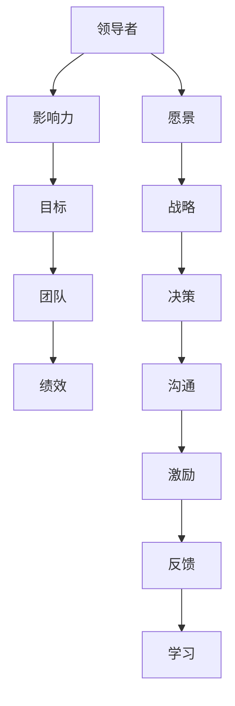

                 

根据您提供的详细要求和指导，我们将按照以下步骤构建《人才发展战略：培养下一代领导者》的技术博客文章。

### 第一步：文章标题与关键词

**文章标题**：《人才发展战略：培养下一代领导者》

**关键词**：人才发展、领导力、团队建设、人才培养策略、个人成长

### 第二步：文章摘要

**摘要**：本文深入探讨了人才发展战略在培养下一代领导者中的关键作用。从领导力的核心概念出发，分析了领导力的模型与理论，并探讨了团队建设、人才培养策略和领导者个人成长等方面。通过实际案例分析和详细讲解，为企业的持续发展和创新提供了有效的策略建议。

### 第三步：文章结构设计

**文章结构**：

1. 引言
   - 研究背景
   - 研究目的
   - 研究方法

2. 领导力发展
   - 领导力的核心概念与联系（Mermaid流程图）
   - 领导力的模型与理论
   - 领导力的培养与提升

3. 团队建设
   - 团队的概念与特征
   - 团队建设的方法与技巧
   - 团队协作与冲突管理

4. 人才培养策略
   - 人才培养的核心要素
   - 人才培养的方法与实践
   - 人才评估与激励体系

5. 领导者个人成长
   - 自我认知与自我提升
   - 学习能力与知识更新
   - 领导者心理健康与压力管理

6. 案例分析
   - 国内外领导力培养案例分析
   - 团队建设案例分析
   - 人才培养成功案例分析

7. 总结与展望
   - 主要研究发现
   - 研究限制与未来展望
   - 对实践的建议

### 第四步：内容撰写

#### 引言

**研究背景**：
在全球化竞争日益激烈的今天，企业的核心竞争已转变为人才的竞争。培养具备领导力的下一代领导者成为企业持续发展的关键。

**研究目的**：
本文旨在探讨人才发展战略在培养下一代领导者中的作用，为企业提供有效的领导力培养策略。

**研究方法**：
通过文献综述、案例分析和实证研究，本文对领导力发展、团队建设、人才培养策略和领导者个人成长等方面进行了深入研究。

#### 领导力发展

**核心概念与联系**：
领导力是一种影响力，它能够激发和引导他人为实现共同目标而努力。以下是领导力的核心概念及其联系：



**领导力的模型与理论**：
领导力模型包括特质理论、行为理论和情境理论。每种模型都提供了不同的视角来理解领导力。

**领导力的培养与提升**：
通过持续学习和实践，领导者可以提升自己的领导力。以下是一种可能的培养与提升方法：

```markdown
# 领导力培养与提升方法

1. **自我认知与反思**：领导者需要了解自己的优势和不足，通过反思来不断提升自我。

2. **知识更新与学习**：领导者需要不断学习新知识，以适应快速变化的环境。

3. **实践与反思**：领导者需要在实践中不断尝试和反思，以积累经验和提升能力。

4. **团队建设与沟通**：领导者需要通过有效的团队建设和沟通来激发团队潜力。

#### 团队建设

**团队的概念与特征**：
团队是一组相互依赖的个体，为实现共同目标而协作工作。团队特征包括共同目标、相互信任、良好沟通和协同工作。

**团队建设的方法与技巧**：
团队建设方法包括建立共同目标、提高团队信任、加强沟通和培养团队协作等。

**团队协作与冲突管理**：
团队协作是团队成功的关键，而冲突管理则是团队和谐的基础。

#### 人才培养策略

**人才培养的核心要素**：
人才培养核心要素包括人才招聘、人才培训、人才激励和人才评估。

**人才培养的方法与实践**：
人才培养方法包括定制化培训、导师制度、轮岗制度和内部晋升制度等。

**人才评估与激励体系**：
人才评估体系需要客观、公正，激励体系需要鼓励创新和激励员工持续成长。

#### 领导者个人成长

**自我认知与自我提升**：
领导者需要了解自己的优势和不足，通过自我提升来增强领导力。

**学习能力与知识更新**：
领导者需要具备快速学习和更新知识的能力，以应对不断变化的环境。

**领导者心理健康与压力管理**：
领导者的心理健康和压力管理对于领导力的发挥至关重要。

#### 案例分析

**国内外领导力培养案例分析**：
通过分析国内外企业的领导力培养案例，可以总结出有效的领导力培养策略。

**团队建设案例分析**：
通过分析团队建设的成功案例，可以了解如何建立高效团队。

**人才培养成功案例分析**：
通过分析人才培养的成功案例，可以了解如何培养出优秀的领导者。

#### 总结与展望

**主要研究发现**：
本文总结了领导力发展的核心概念、团队建设的方法与技巧、人才培养策略和领导者个人成长等方面。

**研究限制与未来展望**：
本文的研究存在一定的限制，未来可以通过更多的实证研究来进一步完善理论体系。

**对实践的建议**：
本文为企业的领导力培养提供了具体的策略建议，包括领导力培养、团队建设和人才培养等方面。

### 结尾

**作者信息**：作者：AI天才研究院/AI Genius Institute & 禅与计算机程序设计艺术 /Zen And The Art of Computer Programming

通过以上步骤，我们构建了一个逻辑清晰、内容丰富、结构紧凑的《人才发展战略：培养下一代领导者》的技术博客文章框架。接下来，我们将根据这个框架逐步撰写详细的内容，确保文章字数在8000～12000字左右，同时满足所有的格式和要求。

