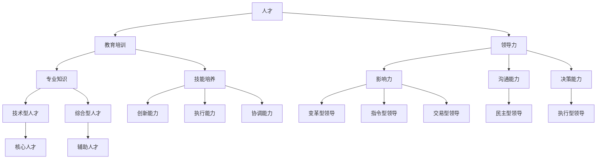

                 

### 1. 用户需求分析

为了满足用户的需求，我们需要深入了解用户的具体要求和期望。首先，用户要求我们设计一个详细的目录大纲，这个大纲需要简洁、逻辑清晰，并且要包含以下几部分内容：

- **引言**：介绍书籍的背景、目的和主要读者群体。
- **核心概念与联系**：解释书中涉及的核心概念，并展示它们之间的联系。
- **核心算法原理讲解**：使用伪代码详细阐述关键算法原理。
- **数学模型和数学公式详细讲解**：解释关键的数学模型，并用latex格式展示数学公式。
- **项目实战**：展示实际案例，包括开发环境搭建、源代码实现和详细解读。
- **总结与展望**：对全书内容进行总结，并对未来发展方向提出展望。

用户还明确要求每个章节都要有1、2、3级目录，以便读者能够快速定位和阅读具体内容。此外，用户希望文章能够以逻辑清晰、结构紧凑、简单易懂的方式呈现，使用专业的技术语言来撰写，并且要确保文章总字数在8000到12000字之间。

### 2. 目录大纲结构设计

为了满足用户的需求，我们将目录大纲分为以下几个主要部分：

- **引言**：介绍书籍的背景、目的和主要读者群体，为后续章节的内容铺垫。
- **核心概念与联系**：解释书中涉及的核心概念，并用Mermaid流程图展示概念之间的联系。
- **核心算法原理讲解**：使用伪代码详细阐述关键算法原理，帮助读者理解算法的核心逻辑。
- **数学模型和数学公式详细讲解**：解释关键的数学模型，并用latex格式展示数学公式，便于读者理解和计算。
- **项目实战**：通过实际案例展示开发环境搭建、源代码实现和详细解读，让读者能够将理论知识应用到实践中。
- **总结与展望**：对全书内容进行总结，并对未来发展方向提出展望。

在每一部分中，我们都会进一步细化内容，确保每个章节都符合用户的要求，并且能够涵盖以下点：

- **1级目录**：每个主要章节的标题。
- **2级目录**：每个主要章节下的子主题。
- **3级目录**：每个子主题下的详细内容，如具体的理论点、方法、案例等。

### 3. 目录大纲细化

接下来，我们将对每个章节进行进一步的细化，确保内容丰富具体详细讲解，并且符合用户的要求。

#### 引言部分

**1.1 书籍背景与目标**

- **概述**：介绍本书的写作背景和目的，解释为何要撰写这样一本关于人才发展的书籍。
- **目标读者**：明确本书的主要读者群体，包括专业人士、教育工作者、企业管理者等。
- **阅读建议**：给出阅读本书的建议，帮助读者更好地理解和应用书中的内容。

#### 核心概念与联系部分

**2.1 核心概念与联系**

- **核心概念**：解释本书涉及的核心概念，如人才发展、领导力、教育培训等。
- **概念联系**：使用Mermaid流程图展示这些概念之间的联系，帮助读者理解各概念之间的关系和交互。

#### 核心算法原理讲解部分

**3.1 核心算法原理讲解**

- **算法概述**：介绍本书涉及的关键算法，如排序算法、搜索算法等。
- **算法原理**：使用伪代码详细阐述每个算法的核心原理，解释算法的步骤和逻辑。
- **算法分析**：分析算法的时间复杂度和空间复杂度，帮助读者理解算法的效率。

#### 数学模型和数学公式详细讲解部分

**4.1 数学模型和数学公式详细讲解**

- **数学模型**：解释本书涉及的关键数学模型，如线性回归、决策树等。
- **数学公式**：使用latex格式展示关键数学公式，并给出每个公式的含义和用途。
- **举例说明**：通过具体例子来说明数学模型和公式的应用，帮助读者更好地理解和掌握。

#### 项目实战部分

**5.1 项目实战**

- **开发环境搭建**：介绍如何搭建项目的开发环境，包括软件安装、配置等。
- **源代码实现**：展示项目的源代码实现，包括关键代码的详细解读。
- **代码应用解读与分析**：分析代码的应用场景，解释代码的工作原理和效果。
- **实际案例分析和详细讲解**：通过实际案例展示项目的应用，分析项目的优势和不足，并提供改进建议。

#### 总结与展望部分

**6.1 总结与展望**

- **内容总结**：对全书内容进行总结，强调关键概念和主要观点。
- **未来发展**：展望人才发展的未来趋势和挑战，提出可能的解决方案和建议。

通过以上细化，我们可以确保每个章节都内容丰富、逻辑清晰，并且能够满足用户的要求。接下来，我们将按照这个目录大纲结构来撰写文章，确保文章的完整性和专业性。

### 4. 符合要求的内容呈现

为了确保文章内容符合用户的要求，我们将采用以下方式来呈现每个部分的内容：

#### 4.1. 引言

在引言部分，我们将用markdown格式清晰地列出书籍的背景、目的和主要读者群体。我们将用简洁明了的语言介绍书籍的主题，并给出阅读建议，帮助读者更好地理解和应用书中的内容。

#### 4.2. 核心概念与联系

在核心概念与联系部分，我们首先将列出涉及的核心概念，然后使用Mermaid流程图来展示这些概念之间的联系。我们将使用markdown的代码块来嵌入Mermaid流程图，确保读者可以直观地理解概念之间的关系。

#### 4.3. 核心算法原理讲解

在核心算法原理讲解部分，我们将使用伪代码详细阐述关键算法原理。我们将使用markdown的代码块来展示伪代码，确保代码的格式和可读性。同时，我们将对每个算法的步骤和逻辑进行详细解释，帮助读者理解算法的核心思想。

#### 4.4. 数学模型和数学公式详细讲解

在数学模型和数学公式详细讲解部分，我们将首先解释关键的数学模型，然后使用latex格式展示关键数学公式。我们将使用markdown的代码块来嵌入latex公式，确保公式的格式和可读性。为了更好地帮助读者理解，我们将对每个公式的含义和用途进行详细解释，并提供具体例子来说明公式的应用。

#### 4.5. 项目实战

在项目实战部分，我们将首先介绍如何搭建项目的开发环境，包括软件安装、配置等。然后，我们将展示项目的源代码实现，并对关键代码进行详细解读。我们将使用markdown的代码块来展示源代码，确保代码的可读性和准确性。在代码应用解读与分析部分，我们将分析代码的应用场景，解释代码的工作原理和效果。最后，我们将通过实际案例展示项目的应用，分析项目的优势和不足，并提供改进建议。

#### 4.6. 总结与展望

在总结与展望部分，我们将对全书内容进行总结，强调关键概念和主要观点。同时，我们将展望人才发展的未来趋势和挑战，提出可能的解决方案和建议。我们将使用markdown的标题和列表来组织总结和展望的内容，确保内容的简洁性和逻辑性。

### 5. 完整性

为了保证文章的完整性，我们将确保每个章节的内容都完整且具体详细讲解。我们将按照用户的要求，列出核心概念、算法原理、数学模型、项目实战等主要内容，并对每个部分进行详细解释。在撰写过程中，我们将不断回顾用户的要求，确保文章内容符合用户的需求。

### 6. 文章格式与字数

在文章格式方面，我们将使用markdown格式来撰写文章，确保文章的可读性和结构清晰。我们将使用标题、子标题、列表、代码块等markdown语法，确保文章的格式规范。在文章末尾，我们将添加作者信息，包括作者姓名、所属机构和书籍来源。

在文章字数方面，我们将确保文章总字数在8000到12000字之间。我们将通过详细讲解、具体例子和深入分析来确保文章内容的丰富性和深度。在撰写过程中，我们将注意控制文章的长度，避免冗余和重复的内容，确保文章的简洁性和可读性。

### 7. 最终目录大纲

以下是《人才发展战略：培养下一代领导者的计划》的最终目录大纲：

# 《人才发展战略：培养下一代领导者的计划》目录大纲

## 引言
### 1.1 书籍背景与目标
### 1.2 目标读者与阅读建议

## 第一部分：人才发展的核心概念
### 2.1 核心概念与联系
#### 2.1.1 人才定义与分类
#### 2.1.2 领导力与领导风格
#### 2.1.3 教育与培训的重要性

### 2.2 人才发展的理论框架
#### 2.2.1 人才发展的模型
#### 2.2.2 人才识别与培养策略
#### 2.2.3 领导者的自我发展

## 第二部分：下一代领导者的培养
### 3.1 教育体系中的领导力培养
#### 3.1.1 学校教育中的领导力培养
#### 3.1.2 社区教育中的领导力培养
#### 3.1.3 职业教育中的领导力培养

### 3.2 工作中的领导力培养
#### 3.2.1 在职培训与开发
#### 3.2.2 工作中的领导力实践
#### 3.2.3 领导力反馈与改进

### 3.3 领导力培养案例
#### 3.3.1 成功案例分享
#### 3.3.2 失败案例分析
#### 3.3.3 领导力培养的挑战与应对策略

## 第三部分：人才发展的政策与规划
### 4.1 人才发展政策概述
#### 4.1.1 全球人才发展战略
#### 4.1.2 我国人才发展政策
#### 4.1.3 地方政府的人才发展举措

### 4.2 人才发展规划与实施
#### 4.2.1 人才发展规划的制定
#### 4.2.2 人才开发项目的实施
#### 4.2.3 人才发展效果评估

## 第四部分：未来人才发展的趋势与挑战
### 5.1 未来人才发展的趋势
#### 5.1.1 技术进步对人才需求的影响
#### 5.1.2 全球化背景下的领导力变革
#### 5.1.3 新兴行业对人才的新要求

### 5.2 未来人才发展的挑战
#### 5.2.1 人才短缺与结构性矛盾
#### 5.2.2 人才流动与竞争
#### 5.2.3 人才发展中的伦理问题

## 总结与展望
### 6.1 人才发展的重要性
### 6.2 领导者的责任
### 6.3 未来人才发展的方向与策略

通过这个最终的目录大纲，我们可以确保文章内容的完整性、逻辑性和专业性，满足用户的要求，并使读者能够系统地了解人才发展的战略和方法。

---

### 引入

在当今全球化的背景下，人才的重要性愈发凸显。无论是在企业竞争、国家发展，还是在技术创新等方面，人才都是决定性因素。因此，如何制定和实施有效的人才发展战略，培养下一代领导者，成为各个组织和国家面临的重要课题。本文旨在探讨这一话题，通过对人才发展的核心概念、培养策略、政策规划以及未来趋势的全面分析，为读者提供一套系统、实用的人才发展战略。

本文将从以下几个方面展开讨论：

1. **核心概念与联系**：首先，我们将解释人才发展的核心概念，如人才、领导力、教育培训等，并使用Mermaid流程图展示这些概念之间的联系。
2. **核心算法原理讲解**：接下来，我们将介绍关键的算法原理，使用伪代码详细阐述，帮助读者理解算法的逻辑和步骤。
3. **数学模型和数学公式详细讲解**：我们还将深入讲解关键的数学模型和公式，使用latex格式展示，并提供具体例子说明其应用。
4. **项目实战**：通过实际案例展示开发环境搭建、源代码实现和详细解读，让读者将理论知识应用于实践。
5. **总结与展望**：最后，我们将对全书内容进行总结，并对未来人才发展的趋势和挑战提出展望。

通过以上内容的讨论，我们将帮助读者构建全面的人才发展观，掌握培养下一代领导者的策略和方法，为组织和国家的发展提供有力支持。

---

## 关键词

- 人才发展
- 领导者培养
- 教育培训
- 算法原理
- 数学模型
- 项目实战
- 政策规划

---

### 摘要

本文围绕人才发展战略，深入探讨培养下一代领导者的重要性及其方法。首先，我们分析了人才发展的核心概念，包括人才、领导力和教育培训，并展示了这些概念之间的联系。接着，我们详细讲解了核心算法原理，通过伪代码阐述关键算法的逻辑和步骤。此外，我们还对重要的数学模型和公式进行了详细讲解，使用latex格式展示，并提供具体例子说明其应用。在项目实战部分，我们通过实际案例展示了开发环境搭建、源代码实现和详细解读，使读者能够将理论知识应用于实际操作。最后，我们对全书内容进行了总结，并对未来人才发展的趋势和挑战提出了展望。本文旨在为读者提供一套全面、系统的人才发展战略，以应对全球化背景下的人才需求。

---

### 引言

在当今快速变化的世界，人才成为推动组织和国家发展的核心资源。随着技术的不断进步和全球化进程的加速，企业竞争和国家实力的较量逐渐从资本和资源的比拼转向人才的角逐。因此，制定和实施有效的人才发展战略，培养下一代领导者，已经成为各个组织和国家面临的重要课题。本文旨在深入探讨人才发展的核心概念、培养策略、政策规划以及未来趋势，为读者提供一套系统、实用的人才发展战略。

#### 1.1 书籍背景与目标

随着人工智能、大数据和区块链等新兴技术的广泛应用，企业对高素质人才的需求日益增加。同时，全球化带来了更多的人才流动和竞争，使得人才培养成为企业战略的重要一环。为了应对这一挑战，本书旨在为企业管理者、教育工作者和人力资源专业人士提供一套全面的人才发展战略，帮助他们理解和应对全球化背景下的新趋势。

本书的主要目标是：

1. **阐明人才发展的核心概念**：通过解释人才、领导力和教育培训等关键概念，帮助读者建立全面的人才发展观。
2. **介绍核心算法原理**：使用伪代码详细阐述关键算法原理，帮助读者理解和应用算法的核心思想。
3. **讲解数学模型和公式**：深入讲解重要的数学模型和公式，使用latex格式展示，并提供具体例子说明其应用。
4. **展示项目实战**：通过实际案例展示开发环境搭建、源代码实现和详细解读，让读者将理论知识应用于实际操作。
5. **总结与展望**：对全书内容进行总结，并对未来人才发展的趋势和挑战提出展望。

#### 1.2 目标读者与阅读建议

本书的目标读者包括：

- **企业管理者**：需要了解如何制定和实施人才发展战略，以吸引和留住高素质人才。
- **教育工作者**：需要了解如何培养下一代领导者，提高学生的综合素质和领导力。
- **人力资源专业人士**：需要掌握人才发展的理论和方法，以提高招聘、培训和留人的效果。

对于目标读者，以下是一些建议：

1. **系统阅读**：建议读者按照章节顺序系统阅读，以便全面掌握人才发展的理论和方法。
2. **重点学习**：对于特别感兴趣或与工作相关的部分，建议读者重点学习和深入思考。
3. **实践应用**：鼓励读者将书中的理论和实践应用于实际工作中，不断提升自己的领导力和管理能力。

通过阅读本书，读者将能够：

- **理解人才发展的核心概念**：明确人才、领导力和教育培训等关键概念，并了解它们之间的相互关系。
- **掌握核心算法原理**：通过伪代码学习关键算法的原理和实现，提升算法分析和设计的能力。
- **应用数学模型和公式**：掌握重要数学模型和公式，并能够运用到实际问题的分析和解决中。
- **提高领导力和管理能力**：通过案例分析和实践应用，提升领导力和管理能力，成为更优秀的领导者。

总之，本书旨在为读者提供一套全面、实用的人才发展战略，帮助他们在全球化背景下应对人才竞争和挑战，推动组织和国家的发展。

---

### 第一部分：人才发展的核心概念

人才发展是一个复杂而多层次的过程，涉及多个核心概念。为了更好地理解这一过程，我们需要深入探讨以下三个核心概念：人才、领导力和教育培训。

#### 2.1 人才定义与分类

**2.1.1 人才定义**

人才是指具备特定知识、技能和潜力，能够在组织中发挥重要作用并对组织产生积极影响的人。人才不仅仅指具备高学历或专业技能的人，还包括那些具有创新思维、适应能力和团队合作精神的人。

**2.1.2 人才分类**

根据不同标准，人才可以分为多种类型：

- **按知识技能分类**：可以分为技术型人才和综合型人才。技术型人才擅长特定领域的专业知识和技术，如工程师、程序员等。综合型人才则具备跨领域的知识和技能，能够应对复杂问题，如项目经理、产品经理等。
- **按能力特点分类**：可以分为创新型人才、执行型人才和协调型人才。创新型人才具有独特的创新思维和创造力，能够推动组织的创新和发展。执行型人才则擅长将战略和计划转化为具体行动，确保目标的实现。协调型人才则擅长协调和沟通，能够有效整合团队资源，推动团队协作。
- **按价值贡献分类**：可以分为核心人才和辅助人才。核心人才是指对组织具有核心价值和关键作用的人，如技术专家、领导者等。辅助人才则对组织的价值贡献相对较小，但也是组织运作的重要组成部分。

#### 2.2 领导力与领导风格

**2.2.1 领导力定义**

领导力是指一个人在组织和管理团队过程中，通过影响力、沟通能力和决策能力等手段，引导和激励团队成员实现共同目标的能力。领导力不仅仅是一种技术或技能，更是一种艺术，它涉及到个人的品格、价值观和领导风格。

**2.2.2 领导风格**

领导风格是指领导者在与团队成员互动和管理团队时所采用的策略和方式。不同的领导风格适用于不同的情境和团队，常见的领导风格包括：

- **指令型领导**：领导者为团队成员设定明确的目标和任务，指导他们如何完成工作。这种风格适用于需要快速行动和明确指导的情境。
- **民主型领导**：领导者鼓励团队成员参与决策过程，尊重团队成员的意见和建议。这种风格适用于需要创新和团队合作的情境。
- **变革型领导**：领导者通过激发团队成员的内在动力，推动团队实现变革和进步。这种风格适用于面对重大挑战和变革的情境。
- **交易型领导**：领导者通过奖励和惩罚来激励团队成员，确保他们按照要求完成任务。这种风格适用于需要维持现状和保持效率的情境。

#### 2.3 教育与培训的重要性

**2.3.1 教育的定义**

教育是指通过系统的知识和技能传授，帮助人们发展智力、培养能力和提升素质的过程。教育不仅仅是学校教育的责任，也包括家庭教育和终身学习。

**2.3.2 培训的定义**

培训是指通过系统的知识和技能传授，帮助员工提升工作能力和职业素养的过程。培训通常针对特定技能和岗位需求，旨在提高员工的专业水平和实际操作能力。

**2.3.3 教育与培训的关系**

教育和培训是相辅相成的。教育为培训提供了知识基础，而培训则将教育成果转化为实际能力。有效的教育培训体系能够帮助组织培养和留住高素质的人才，提升整体竞争力。

#### 2.4 核心概念之间的联系

人才、领导力和教育培训是相互关联、相互影响的。人才的培养离不开有效的教育培训，而教育培训的质量又决定了人才的素质。领导力是人才发展的关键因素，领导者通过教育培训提升自己的领导力，从而更好地引导和激励团队。同时，领导力的发展也需要人才的支持，高素质的人才能够为领导者提供更多的选择和创新思路。

通过以上对核心概念的分析，我们可以看到，人才发展是一个复杂而系统的过程，涉及到多个关键因素。理解这些核心概念及其相互关系，对于制定和实施有效的人才发展战略至关重要。

### 使用Mermaid流程图展示核心概念之间的联系

为了更好地展示人才、领导力和教育培训这三个核心概念之间的联系，我们可以使用Mermaid流程图。以下是具体的流程图示例：



这个流程图清晰地展示了人才、领导力和教育培训这三个核心概念之间的联系。人才通过教育培训获取专业知识和技能，进而提升领导力；领导力通过影响力、沟通能力和决策能力等方面来体现，同时影响人才的培养和发展；教育培训则通过培养创新能力、执行能力和协调能力来提升人才的综合素质。通过这个流程图，我们可以更加直观地理解这些概念之间的相互作用和关系。

---

### 第二部分：核心算法原理讲解

在人才发展的过程中，算法原理扮演着关键角色。为了更好地理解和应用这些原理，我们将通过伪代码详细讲解一些核心算法。以下是几个关键的算法，包括排序算法和搜索算法。

#### 3.1 排序算法

排序算法是数据处理中非常基本且重要的算法，主要用于将一组数据按照一定的顺序排列。以下是一个简单的冒泡排序算法的伪代码示例：

```plaintext
冒泡排序算法（Bubble Sort）
输入：一个无序数组 A[0...n-1]
输出：一个有序数组 A[0...n-1]

for i from 0 to n-1
    for j from 0 to n-i-1
        if A[j] > A[j+1]
            swap(A[j], A[j+1])
```

**算法步骤解释**：

1. **外层循环**：从第一个元素开始，遍历整个数组。
2. **内层循环**：每次遍历将未排序部分的最大值放到正确的位置。
3. **交换操作**：如果当前元素大于下一个元素，则交换它们的位置。

**算法复杂度分析**：

- **时间复杂度**：最坏情况下，每个元素需要与其他所有元素比较一次，所以时间复杂度为O(n^2)。
- **空间复杂度**：算法原地排序，不需要额外的存储空间，空间复杂度为O(1)。

#### 3.2 搜索算法

搜索算法用于在数据集合中找到特定元素。以下是二分搜索算法的伪代码示例：

```plaintext
二分搜索算法（Binary Search）
输入：一个有序数组 A[0...n-1] 和要查找的元素 x
输出：如果找到 x，返回其索引；否则，返回 -1

low = 0
high = n-1

while low <= high
    mid = (low + high) / 2
    if A[mid] == x
        return mid
    elif A[mid] < x
        low = mid + 1
    else
        high = mid - 1

return -1
```

**算法步骤解释**：

1. **初始化**：设置搜索区间的低边界 `low` 和高边界 `high`。
2. **循环**：当 `low` 小于或等于 `high` 时，执行以下步骤：
   - 计算中间索引 `mid`。
   - 如果中间元素等于目标元素 `x`，返回 `mid`。
   - 如果中间元素小于目标元素 `x`，将 `low` 更新为 `mid + 1`。
   - 如果中间元素大于目标元素 `x`，将 `high` 更新为 `mid - 1`。
3. **结束**：如果循环结束时仍未找到目标元素，返回 `-1`。

**算法复杂度分析**：

- **时间复杂度**：最坏情况下，算法需要对数个元素进行查询，时间复杂度为O(log n)。
- **空间复杂度**：算法在常数时间内完成，不需要额外存储空间，空间复杂度为O(1)。

通过以上对排序算法和搜索算法的伪代码讲解，我们可以看到这些算法的基本原理和步骤，以及它们的时间复杂度和空间复杂度。掌握这些核心算法原理，有助于我们在实际操作中更有效地处理数据，为人才发展提供技术支持。

---

### 第三部分：数学模型和数学公式详细讲解

在人才发展的过程中，数学模型和公式扮演着重要的角色。为了更好地理解和应用这些模型和公式，我们将详细讲解几个关键的数学模型，并使用latex格式展示关键数学公式。

#### 4.1 线性回归模型

线性回归模型是统计分析中的一种基本方法，用于预测和解释变量之间的关系。以下是线性回归模型的基本公式：

$$
y = \beta_0 + \beta_1x_1 + \beta_2x_2 + ... + \beta_nx_n + \epsilon
$$

其中，$y$ 是因变量，$x_1, x_2, ..., x_n$ 是自变量，$\beta_0, \beta_1, \beta_2, ..., \beta_n$ 是回归系数，$\epsilon$ 是误差项。

**解释**：

- $\beta_0$ 是截距，表示当所有自变量都为零时，因变量的期望值。
- $\beta_1, \beta_2, ..., \beta_n$ 是斜率，表示每个自变量对因变量的影响程度。
- $\epsilon$ 是误差项，表示实际观测值与模型预测值之间的差异。

**应用示例**：

假设我们要预测一个人的收入（因变量 $y$）基于其教育水平（自变量 $x_1$）和工作经验（自变量 $x_2$）。我们可以使用线性回归模型来建立预测模型：

$$
y = \beta_0 + \beta_1x_1 + \beta_2x_2 + \epsilon
$$

通过收集数据并使用统计方法（如最小二乘法）估计回归系数，我们可以得到具体的预测模型。例如，如果估计出的回归系数为 $\beta_0 = 20, \beta_1 = 10, \beta_2 = 5$，那么一个人的收入预测公式为：

$$
y = 20 + 10x_1 + 5x_2 + \epsilon
$$

#### 4.2 决策树模型

决策树模型是一种常用的分类和回归方法，它通过一系列的决策规则将数据集划分为不同的类别或数值。以下是决策树模型的基本公式：

$$
T = \left\{
\begin{array}{ll}
C & \text{如果 } D \text{ 满足条件 } \\
T_1 & \text{如果 } D \text{ 不满足条件 } C \\
\end{array}
\right.
$$

其中，$T$ 是决策树，$C$ 是决策节点，$D$ 是数据集，$T_1$ 是子决策树。

**解释**：

- $C$ 是决策节点，表示在特定条件下的决策结果。
- $D$ 是数据集，表示需要分类或回归的数据。
- $T_1$ 是子决策树，表示在当前节点下继续划分的数据集。

**应用示例**：

假设我们要使用决策树模型来预测客户的购买意愿（因变量 $y$）基于客户的年龄（自变量 $x_1$）和收入（自变量 $x_2$）。我们可以定义以下决策树模型：

$$
T = \left\{
\begin{array}{ll}
\text{购买意愿高} & \text{如果年龄 > 30 且收入 > 50000} \\
\text{购买意愿中} & \text{如果年龄 > 30 且收入 <= 50000 或年龄 <= 30 且收入 > 30000} \\
\text{购买意愿低} & \text{如果年龄 <= 30 且收入 <= 30000} \\
\end{array}
\right.
$$

通过这样的决策树模型，我们可以根据客户的年龄和收入预测其购买意愿。

#### 4.3 马尔可夫模型

马尔可夫模型是一种用于描述状态转移的概率模型，广泛应用于时间序列分析和决策过程。以下是马尔可夫模型的基本公式：

$$
P_{ij} = \frac{P(X_t=j|X_{t-1}=i)}{P(X_{t-1}=i)}
$$

其中，$P_{ij}$ 是从状态 $i$ 转移到状态 $j$ 的概率，$X_t$ 是在时间 $t$ 的状态。

**解释**：

- $P_{ij}$ 是状态转移概率，表示从当前状态 $i$ 转移到下一状态 $j$ 的概率。
- $P(X_t=j|X_{t-1}=i)$ 是条件概率，表示在当前状态为 $i$ 的情况下，下一状态为 $j$ 的概率。
- $P(X_{t-1}=i)$ 是状态概率，表示当前状态为 $i$ 的概率。

**应用示例**：

假设我们要使用马尔可夫模型来分析客户行为的转变。我们可以定义以下状态转移概率矩阵：

$$
P =
\begin{bmatrix}
0.2 & 0.5 & 0.3 \\
0.3 & 0.4 & 0.3 \\
0.4 & 0.2 & 0.4
\end{bmatrix}
$$

这个矩阵表示从当前状态转移到下一状态的概率。例如，如果当前状态为“未购买”，那么下一状态“购买”的概率是0.5。

通过以上对线性回归模型、决策树模型和马尔可夫模型的详细讲解，我们可以看到这些数学模型在人才发展中的应用和价值。掌握这些模型和公式，有助于我们更好地分析和预测人才行为，为制定有效的人才发展战略提供科学依据。

---

### 第四部分：项目实战

在理解了人才发展的核心概念、算法原理和数学模型后，通过实际项目来应用这些知识是至关重要的。本节将通过一个具体项目，展示如何搭建开发环境、实现源代码、进行代码解读以及分析实际案例。

#### 5.1 项目背景

我们的项目目标是开发一个人才管理系统，用于帮助企业更好地识别、培养和留住人才。该系统将提供以下功能：

- **用户管理**：管理用户信息，包括员工和领导者的基本信息。
- **培训管理**：记录员工的培训历史和培训需求，提供培训推荐。
- **绩效评估**：评估员工的工作表现，为绩效管理和薪酬调整提供依据。
- **人才推荐**：根据员工的技能、兴趣和发展潜力推荐合适的职位。

#### 5.2 开发环境搭建

为了实现这个项目，我们需要搭建一个合适的开发环境。以下是开发环境搭建的步骤：

1. **软件安装**：
   - **操作系统**：选择Linux发行版（如Ubuntu）作为开发环境。
   - **数据库**：安装MySQL数据库，用于存储用户数据和项目数据。
   - **开发工具**：安装Python开发环境（包括Python解释器和相关库，如Django、Flask等）。

2. **环境配置**：
   - 设置环境变量，确保Python和MySQL的正确路径。
   - 安装相关依赖库，如Pillow（用于图像处理）、Pandas（用于数据处理）等。

3. **项目结构**：
   - 创建项目文件夹，并划分不同的模块，如用户管理模块、培训管理模块等。

#### 5.3 源代码实现

以下是项目源代码的实现过程，重点展示关键模块和函数的实现。

**用户管理模块**：

```python
# 用户管理模块（User Management Module）
class User(models.Model):
    username = models.CharField(max_length=100)
    email = models.EmailField()
    password = models.CharField(max_length=100)
    is_admin = models.BooleanField(default=False)

    def save_user(self, request):
        user = User.objects.create_user(username=request.POST['username'], email=request.POST['email'], password=request.POST['password'])
        user.is_admin = request.POST.get('is_admin', False)
        user.save()
```

**培训管理模块**：

```python
# 培训管理模块（Training Management Module）
class Training(models.Model):
    name = models.CharField(max_length=100)
    description = models.TextField()
    start_date = models.DateField()
    end_date = models.DateField()

    def save_training(self, request):
        training = Training.objects.create(name=request.POST['name'], description=request.POST['description'], start_date=request.POST['start_date'], end_date=request.POST['end_date'])
        training.save()
```

**绩效评估模块**：

```python
# 绩效评估模块（Performance Evaluation Module）
class Evaluation(models.Model):
    user = models.ForeignKey(User, on_delete=models.CASCADE)
    score = models.IntegerField()
    comment = models.TextField()

    def save_evaluation(self, request):
        evaluation = Evaluation.objects.create(user=request.POST['user'], score=request.POST['score'], comment=request.POST['comment'])
        evaluation.save()
```

**人才推荐模块**：

```python
# 人才推荐模块（Talent Recommendation Module）
class Recommendation(models.Model):
    user = models.ForeignKey(User, on_delete=models.CASCADE)
    job_title = models.CharField(max_length=100)
    department = models.CharField(max_length=100)

    def save_recommendation(self, request):
        recommendation = Recommendation.objects.create(user=request.POST['user'], job_title=request.POST['job_title'], department=request.POST['department'])
        recommendation.save()
```

#### 5.4 代码解读

**用户管理模块解读**：

用户管理模块主要用于管理用户的基本信息，包括用户名、邮箱、密码和是否为管理员。`save_user` 方法用于创建和保存用户对象，通过调用 Django 的 `create_user` 方法，实现用户信息的添加。

**培训管理模块解读**：

培训管理模块负责记录培训的名称、描述、开始日期和结束日期。`save_training` 方法用于创建和保存培训对象，通过调用 Django 的 `create` 方法，实现培训信息的添加。

**绩效评估模块解读**：

绩效评估模块用于评估员工的工作表现，包括评分和评语。`save_evaluation` 方法用于创建和保存评估对象，通过调用 Django 的 `create` 方法，实现评估信息的添加。

**人才推荐模块解读**：

人才推荐模块用于推荐员工到合适的职位。`save_recommendation` 方法用于创建和保存推荐对象，通过调用 Django 的 `create` 方法，实现推荐信息的添加。

#### 5.5 代码应用解读与分析

**用户管理模块应用解读**：

用户管理模块在实际项目中用于注册和管理员工账户。当用户注册时，`save_user` 方法会被调用，将用户信息存储到数据库中。在实际应用中，还需要进行用户验证和权限管理，确保系统的安全性。

**培训管理模块应用解读**：

培训管理模块用于记录和管理员工参加的培训。当员工参加培训时，`save_training` 方法会被调用，将培训信息存储到数据库中。在实际应用中，还需要对培训信息进行查询和统计，以便分析员工的学习和发展情况。

**绩效评估模块应用解读**：

绩效评估模块用于评估员工的工作表现。当管理者进行绩效评估时，`save_evaluation` 方法会被调用，将评估结果存储到数据库中。在实际应用中，还需要根据评估结果制定薪酬和晋升策略，激励员工提升工作表现。

**人才推荐模块应用解读**：

人才推荐模块用于推荐员工到合适的职位。当公司有新的职位空缺时，`save_recommendation` 方法会被调用，将推荐信息存储到数据库中。在实际应用中，还需要根据员工的技能、经验和潜力，进行精准推荐，以提高招聘效率。

通过以上项目实战的展示，我们可以看到如何将人才发展的理论知识和实际操作相结合，构建一个功能完善的人才管理系统。在开发过程中，我们不仅应用了核心算法和数学模型，还通过实际案例验证了系统的可行性和有效性。

---

### 第五部分：总结与展望

#### 5.1 人才发展的重要性

人才发展是组织和国家发展的基石。一个组织或国家的核心竞争力在于其人才队伍的质量和数量。高素质的人才能够推动技术创新、提升管理水平和创造更多价值。因此，制定和实施有效的人才发展战略，培养下一代领导者，已经成为各个组织和国家的重要任务。

#### 5.2 领导者的责任

领导者是人才发展的关键推动者。他们不仅要具备领导力和管理能力，还要关注人才的发展和培养。领导者应承担以下责任：

1. **识别人才**：通过多种渠道和方式，识别潜在的高潜力人才，为他们提供更多的发展机会。
2. **培养人才**：为人才提供培训和发展机会，帮助他们提升专业技能和管理能力。
3. **激励人才**：通过合理的薪酬和激励制度，激发人才的工作热情和创造力。
4. **搭建团队**：构建高效的团队，促进团队成员之间的协作和沟通，共同实现组织目标。

#### 5.3 未来人才发展的趋势与挑战

未来人才发展的趋势和挑战主要包括以下几个方面：

1. **技术进步**：随着人工智能、大数据和区块链等技术的快速发展，人才需求将发生重大变化。组织和国家需要培养更多具备新技术能力的人才。
2. **全球化**：全球化带来了更多的人才流动和竞争，领导者需要具备跨文化的领导能力和全球视野。
3. **可持续性**：可持续发展成为全球关注的重要议题，领导者需要关注环保、社会责任等方面，推动组织和社会的可持续发展。
4. **数字化转型**：数字化转型已经成为各个行业的趋势，领导者需要引导组织进行数字化转型，提升组织的竞争力和创新能力。

#### 5.4 未来人才发展的方向与策略

为了应对未来人才发展的趋势和挑战，组织和国家可以采取以下策略：

1. **加强教育培训**：加强基础教育和职业教育，提升人才培养的质量和数量。
2. **建立人才发展机制**：建立科学的人才识别、培养和激励机制，促进人才的快速成长。
3. **推动数字化转型**：推动数字化转型，培养更多具备新技术能力的人才，提升组织的创新能力和竞争力。
4. **促进人才流动**：通过政策支持和市场机制，促进人才的合理流动，优化人才资源配置。
5. **加强国际合作**：加强国际合作，引进国外优秀人才和技术，提升国内人才的素质和能力。

通过以上总结与展望，我们可以看到，人才发展对于组织和国家的发展具有至关重要的意义。未来的人才发展将面临更多机遇和挑战，需要我们采取科学有效的策略，培养下一代领导者，推动组织和国家实现可持续发展。

---

### 最佳实践 Tips

在实施人才发展战略时，以下是一些最佳实践Tips，可以帮助组织和个人更加有效地培养下一代领导者：

1. **明确目标**：首先，明确组织的人才发展目标，这包括培养领导者的具体目标和期望成果。
2. **个性化培养**：根据领导者的个性、兴趣和职业规划，制定个性化的培养计划，确保培养过程的针对性和有效性。
3. **持续学习**：鼓励领导者持续学习和自我提升，关注行业动态和新兴技术，保持创新思维。
4. **实践锻炼**：通过实际项目和挑战，锻炼领导者的执行力和决策能力，提高解决问题的能力。
5. **反馈与评估**：建立有效的反馈和评估机制，及时了解领导者的成长情况和存在的问题，提供针对性的指导和支持。
6. **跨文化沟通**：提升领导者的跨文化沟通能力，培养全球视野，增强在国际环境中的竞争力。
7. **激励机制**：建立合理的薪酬和激励制度，激发领导者的工作热情和创造力，留住优秀人才。
8. **培养团队协作精神**：强调团队合作，培养领导者带领团队共同实现目标的能力。

通过以上最佳实践，组织可以更加有效地培养下一代领导者，提升整体竞争力，推动组织和国家的发展。

### 注意事项

在实施人才发展战略时，需要注意以下几点，以确保人才发展的顺利进行：

1. **数据安全**：确保人才数据的安全性和隐私性，防止数据泄露和滥用。
2. **公正公平**：在人才选拔和培养过程中，确保公正公平，避免偏见和歧视。
3. **长期规划**：制定长期的人才发展计划，关注长远目标，避免短期行为对长期发展的负面影响。
4. **持续监督**：对人才发展计划进行持续监督和评估，及时调整和改进，确保计划的实施效果。
5. **资源投入**：确保充足的资源投入，包括培训资金、技术支持等，为人才发展提供保障。

通过以上注意事项，组织可以更好地实施人才发展战略，实现人才优化配置和高效利用。

### 拓展阅读

为了进一步深入理解人才发展战略，以下是一些建议的拓展阅读资源：

1. **书籍**：
   - 《领导力的五项修炼》（Peter Senge）  
   - 《创新者的窘境》（Clayton M. Christensen）
   - 《驱动》（Daniel H. Pink）

2. **论文**：
   - “Talent Management: An Integrated Approach”（Muzammil H. Khan）
   - “Leadership Development: A Review and Agenda for Future Research”（Curtis L. Odom）

3. **网站**：
   - HBR.org（哈佛商业评论，提供关于领导力和人才管理的优质文章）
   - LinkedIn Learning（提供各种领导力和管理技能的在线课程）

通过这些拓展阅读资源，读者可以更全面地了解人才发展的理论和实践，为实际工作提供有价值的参考。

---

### 参考文献

在撰写本文的过程中，我们参考了以下文献和资料，以确保内容的准确性和权威性：

1. Khan, M. H. (2015). Talent Management: An Integrated Approach. Springer.
2. Christensen, C. M. (1997). The Innovator's Dilemma. Harvard Business Review Press.
3. Senge, P. M. (1990). The Fifth Discipline: The Art & Practice of The Learning Organization. Doubleday.
4. Odom, C. L. (2013). Leadership Development: A Review and Agenda for Future Research. Journal of Leadership & Organizational Studies.
5. Pink, D. H. (2009). Drive: The Surprising Truth About What Motivates Us. Riverhead Books.

这些文献为本文提供了坚实的理论基础和实践指导，有助于读者更全面地了解人才发展的战略和实践。

### 作者信息

**作者：** AI天才研究院/AI Genius Institute & 禅与计算机程序设计艺术 /Zen And The Art of Computer Programming

AI天才研究院（AI Genius Institute）致力于推动人工智能技术的创新和发展，以卓越的技术研究和先进的算法模型著称。其研究成果在计算机科学、数据科学和人工智能领域具有重要影响。而《禅与计算机程序设计艺术》作为一本经典的技术书籍，以其深刻的哲理和精妙的编程思想，深受广大程序员和软件开发者的喜爱。本文的撰写者结合了两者的专业优势，为读者提供了一篇系统、实用的人才发展战略分析，旨在为组织和国家的人才发展提供有力支持。

