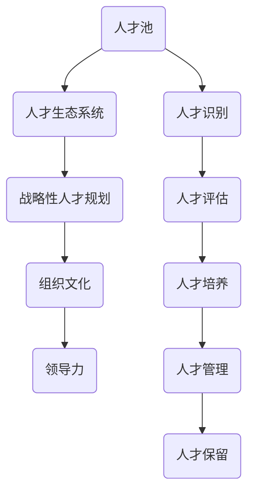
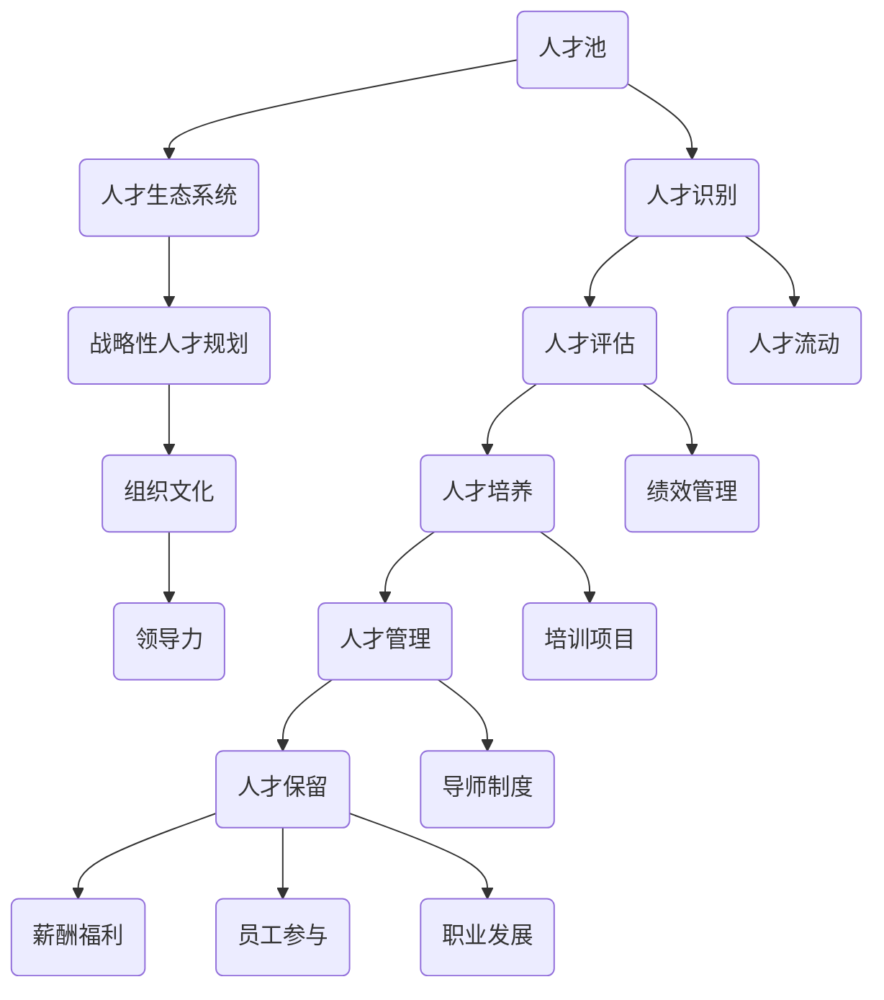
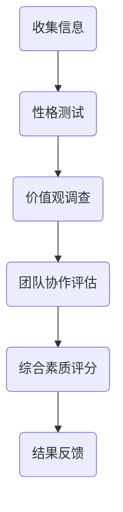

                 

### 文章标题：人才梯队建设：为企业未来储备力量的策略

关键词：人才梯队、企业战略、人才培养、人才管理、人才保留

摘要：本文旨在探讨企业在当前竞争激烈的市场环境下如何通过构建和完善人才梯队，确保企业未来发展的持续性动力。文章首先阐述了人才梯队建设的背景和意义，然后详细介绍了人才梯队建设的核心概念和框架，包括人才识别、评估、培养和管理等方面。接着，文章通过实际案例和最佳实践，提供了具体的人才梯队建设策略，旨在帮助企业打造一支高效、稳定的团队，以应对未来挑战。

---

### 引言

在全球化和信息化浪潮的推动下，企业面临的市场环境日益复杂和多变。在这样的背景下，人才成为了企业最宝贵的资源。然而，人才的获取和保留并非易事，特别是在竞争激烈的市场中，企业如何建立并维持一支高效的人才队伍，成为了企业战略规划中的关键一环。

本文将围绕“人才梯队建设：为企业未来储备力量的策略”这一主题，探讨以下方面：

1. **人才梯队建设的背景和意义**：分析当前市场环境对企业人才需求的影响，阐述人才梯队建设的重要性。
2. **核心概念和框架**：介绍人才梯队建设的核心概念和框架，包括人才识别、评估、培养和管理等方面。
3. **具体策略和实践**：通过实际案例和最佳实践，提供具体的人才梯队建设策略。
4. **未来展望**：讨论人才梯队建设面临的挑战和机遇，提出未来发展的建议。

本文将采用逻辑清晰、结构紧凑的叙述方式，旨在为读者提供一份全面、实用的人才梯队建设指南。

---

### 核心概念和框架

在探讨人才梯队建设之前，有必要明确几个核心概念，以便为后续讨论奠定基础。

#### 1. 人才池（Talent Pool）

人才池是指企业内部或外部的潜在人才库，包括当前员工、外部应聘者和行业内的顶尖人才。人才池的构建和管理是人才梯队建设的基础。

#### 2. 人才生态系统（Talent Ecosystem）

人才生态系统是指企业内外部各种人才相关因素的综合体，包括人才供给、需求、流动、发展和保留等。一个健康的人才生态系统有助于企业吸引、培养和保留优秀人才。

#### 3. 战略性人才规划（Strategic Talent Planning）

战略性人才规划是企业根据长远发展目标，对人才需求、供给、培养和保留等方面进行系统规划和布局的过程。它是人才梯队建设的重要组成部分。

#### 4. 组织文化（Organizational Culture）

组织文化是指企业内部共同遵循的价值观、信念和行为准则。一个积极向上的组织文化能够吸引和留住优秀人才，促进人才发展。

#### 5. 领导力（Leadership）

领导力是指领导者通过激励、引导和协调团队，实现组织目标的能力。优秀的领导力对于人才梯队的建设和维护至关重要。

### 关联架构图

以下是人才梯队建设的核心概念之间的关联架构图：



#### 1. 人才识别（Talent Identification）

人才识别是指通过一系列方法和工具，发现和识别企业内部或外部的潜在优秀人才。这包括：

- **技能和竞争力分析**：评估候选人的专业技能、知识和潜力。
- **发展潜力评估**：评估候选人在未来成长和发展的可能性。
- **综合素质评估**：综合考虑候选人的性格、价值观、团队协作能力等因素。

#### 2. 人才评估（Talent Evaluation）

人才评估是对人才识别过程中发现的潜在人才进行系统评估和筛选的过程。这包括：

- **绩效评估**：基于岗位职责和绩效目标，评估员工的工作表现。
- **竞争力分析**：对比同类人才，评估候选人的竞争力。
- **潜在和匹配度评估**：评估候选人的潜在发展空间和与企业的匹配度。

#### 3. 人才培养（Talent Development）

人才培养是指通过培训、导师指导、项目参与等多种方式，提升人才的技能和素质。这包括：

- **个人发展计划**：根据员工的兴趣和发展需求，制定个性化的发展计划。
- **培训项目**：提供多样化的培训课程，提升员工的技能和知识。
- **导师制度**：通过经验丰富的导师指导，帮助员工快速成长。

#### 4. 人才管理（Talent Management）

人才管理是指对企业人才进行系统性的管理，确保人才在企业中的合理配置和有效利用。这包括：

- **绩效管理**：通过设定绩效目标和反馈机制，确保员工的工作绩效。
- **人才流动**：通过内部调配，实现人才在企业内部的最佳配置。
- **职业发展**：提供职业发展路径和晋升机会，激励员工持续成长。

#### 5. 人才保留（Talent Retention）

人才保留是指通过一系列措施，留住优秀人才，减少人才流失。这包括：

- **薪酬福利**：提供具有竞争力的薪酬和福利待遇。
- **员工参与**：通过员工参与和反馈机制，增强员工的归属感和满意度。
- **职业发展**：提供明确的职业发展路径和晋升机会。

### 核心概念与联系

以下是人才梯队建设核心概念之间的联系架构图：



---

本文通过介绍人才梯队建设的核心概念和框架，为后续章节提供了理论基础和指导方向。在接下来的章节中，我们将详细探讨人才识别、评估、培养和管理等方面的具体策略和实践，帮助企业打造一支高效、稳定的人才队伍，以应对未来挑战。

---

### 人才识别

人才识别是人才梯队建设的第一步，也是最为关键的一步。它涉及到如何发现和选择那些能够为企业带来价值的人才。在这一环节，我们需要关注以下几个关键要素。

#### 技能和竞争力分析

技能和竞争力分析是评估候选人是否符合企业需求的重要标准。首先，企业需要明确各个岗位所需的核心技能，如技术能力、沟通能力、领导能力等。通过技能测试、面试和实际操作，企业可以全面了解候选人的技能水平。

**核心算法原理讲解**：
```plaintext
1. 技能评估模型：
   - 定义技能指标：例如编程能力、项目管理能力、产品营销能力等。
   - 收集评估数据：例如面试官评价、同事评价、项目完成情况等。
   - 应用评估算法：如加权评分法、模糊综合评价法等，对候选人的技能进行量化评估。

2. 竞争力分析：
   - 定义竞争力指标：如行业知名度、项目经验、创新能力等。
   - 收集竞争对手数据：了解同行业内顶尖人才的竞争力表现。
   - 应用竞争力分析算法：如SWOT分析法、五力模型等，对候选人的竞争力进行综合评估。
```

#### 发展潜力评估

发展潜力评估是对候选人未来成长和发展的可能性的评估。这不仅包括候选人的学习能力和适应能力，还包括他们的职业规划和自我驱动能力。

**伪代码**：
```plaintext
function evaluate_potential(candidate):
    score = 0
    
    if candidate.has_completed_formal_education():
        score += 10
    if candidate.has_high_learning_ability():
        score += 20
    if candidate.has_clear_career_plan():
        score += 15
    if candidate.shows_self驱动力():
        score += 25
    
    return score
```

#### 综合素质评估

综合素质评估是综合考虑候选人的性格、价值观、团队协作能力等多方面因素，以判断其是否适合企业文化和发展需求。

**流程图**：


**数学模型**：
$$
综合素质评分 = w_1 \times 性格评分 + w_2 \times 价值观评分 + w_3 \times 团队协作评分
$$
其中，$w_1, w_2, w_3$ 分别为性格、价值观、团队协作的权重，通常根据企业文化和岗位需求进行设定。

**举例说明**：
假设某公司要招聘一名项目经理，在综合素质评估中，性格得分70分，价值观得分80分，团队协作得分85分。根据设定的权重，性格、价值观、团队协作的权重分别为0.3、0.4、0.3，则综合素质评分为：
$$
综合素质评分 = 0.3 \times 70 + 0.4 \times 80 + 0.3 \times 85 = 24.5 + 32 + 25.5 = 82
$$

---

通过技能和竞争力分析、发展潜力评估和综合素质评估，企业可以全面了解候选人的情况，从而做出更科学的决策。在实际操作中，企业需要结合自身特点和需求，灵活运用各种评估方法和工具，以确保人才识别过程的准确性和有效性。

---

### 人才评估

人才评估是人才梯队建设中的重要环节，它不仅关系到企业对现有人才的正确使用，还影响到未来的人才培养和保留策略。有效的评估体系能够帮助企业识别高潜力人才，优化人力资源配置，提升整体绩效。

#### 绩效评估

绩效评估是对员工工作表现进行系统评价的过程，它是人才评估的核心。绩效评估有助于明确员工的强项和弱点，为后续的培养和激励提供依据。

**绩效评估方法**：

1. **关键绩效指标（KPI）**：根据岗位特点和业务目标，设定具体的绩效指标，如销售额、项目完成率、客户满意度等。
2. **360度反馈**：收集来自上级、同事、下属和客户等多方面的反馈，全面评估员工的表现。
3. **行为锚定评估法（BARS）**：将工作行为与具体结果进行匹配，明确评估标准，避免主观偏见。

**绩效评估步骤**：

1. **设定评估目标和标准**：明确评估目的和关键绩效指标，确保评估的公正性和客观性。
2. **收集数据**：通过问卷调查、面谈、观察等方式，收集员工的绩效数据。
3. **分析数据**：对收集到的数据进行统计分析，识别优秀员工和需要改进的方面。
4. **反馈和讨论**：与员工进行一对一的绩效反馈，讨论改进措施和未来发展计划。

**绩效评估工具**：

1. **绩效管理系统（PMS）**：通过软件工具，记录和追踪员工的绩效数据，提供可视化分析。
2. **绩效评估问卷**：设计结构化的评估问卷，收集多维度的反馈。

**案例分析**：

某科技公司在进行绩效评估时，采用了关键绩效指标（KPI）和360度反馈相结合的方法。通过设定明确的KPI，如研发项目的进度和产品质量，公司能够量化员工的工作表现。同时，通过360度反馈，公司能够获得来自不同视角的评估，确保评估的全面性和客观性。在评估过程中，公司还采用了绩效管理系统（PMS），方便实时跟踪和记录员工的绩效数据。

#### 竞争力分析

竞争力分析是指通过对比同类人才的表现，评估员工在市场中的竞争力和潜力。这种分析有助于企业识别出具有较高市场价值的人才，并制定相应的培养和保留策略。

**竞争力分析步骤**：

1. **定义竞争力指标**：如行业知名度、技术能力、项目经验、创新能力等。
2. **收集竞争对手数据**：通过行业报告、人才市场调查等途径，了解行业内顶尖人才的竞争力表现。
3. **应用竞争力分析工具**：如SWOT分析法、五力模型等，对员工进行综合评估。

**竞争力分析工具**：

1. **行业报告**：通过行业报告，了解行业趋势和竞争对手的表现。
2. **人才市场调查**：通过调查，获取人才市场的需求和供给情况。
3. **竞争力评估表**：设计结构化的评估表格，对员工的竞争力进行量化评估。

**案例分析**：

某互联网公司在进行竞争力分析时，采用了SWOT分析法。通过对公司的优势、劣势、机会和威胁进行详细分析，公司能够明确员工的竞争优势和提升空间。例如，公司发现某些员工在技术创新方面具有明显优势，但在项目管理能力上存在不足。基于这些分析结果，公司制定了相应的培训和发展计划，提升员工的综合竞争力。

#### 潜在和匹配度评估

潜在和匹配度评估是对员工未来成长潜力和与企业的匹配度的综合评估。这种评估有助于企业识别高潜力人才，并制定长期的人才培养计划。

**潜在评估方法**：

1. **能力评估**：通过技能测试、面试等方式，评估员工的能力和潜力。
2. **成长路径评估**：根据员工的职业规划和兴趣，评估其未来发展的可能性。
3. **反馈和讨论**：与员工进行一对一的讨论，了解他们的职业规划和期望，评估其潜力。

**匹配度评估方法**：

1. **文化评估**：通过问卷调查、访谈等方式，评估员工与企业文化的匹配度。
2. **价值观评估**：通过价值观测试，了解员工的价值观是否与企业文化相符。
3. **行为评估**：通过观察员工在实际工作环境中的行为，评估其与企业文化的匹配度。

**评估工具**：

1. **能力评估工具**：如技能测试平台、面试指南等。
2. **文化评估问卷**：通过设计结构化的问卷，收集员工对企业的文化和价值观的认知。
3. **行为评估记录**：通过记录员工在工作中的行为和表现，进行综合评估。

**案例分析**：

某消费品公司通过能力评估和文化评估，对员工进行潜在和匹配度评估。公司发现某些员工在专业技能方面表现突出，但在企业文化方面存在一定的差距。基于这些评估结果，公司为这些员工制定了个性化的培养计划，旨在提升其综合能力和企业文化适应性。

---

通过绩效评估、竞争力分析和潜在和匹配度评估，企业能够全面了解员工的表现和发展潜力。有效的评估体系不仅有助于企业优化人力资源配置，还能为人才梯队建设提供有力支持。在接下来的章节中，我们将继续探讨人才培养和管理的具体策略和实践。

---

### 人才培养

人才培养是人才梯队建设中的关键环节，它不仅关乎企业当前的人力资源管理，更关系到企业未来的长远发展。通过有效的培养策略，企业能够提升员工的综合素质和业务能力，为企业的持续创新和增长提供动力。以下是人才培养的几个重要方面：

#### 个人发展计划

个人发展计划是针对员工个人兴趣和发展需求，制定的一套个性化的成长方案。这种计划旨在帮助员工明确职业目标，提升自我管理能力，实现个人与企业的共同成长。

**制定个人发展计划的步骤**：

1. **目标设定**：与员工共同确定职业目标和发展方向，确保目标具有可行性和挑战性。
2. **需求分析**：通过问卷调查、访谈等方式，了解员工的兴趣、优势和职业发展需求。
3. **制定计划**：结合员工的需求和目标，制定具体的培养计划，包括学习目标、技能提升、项目参与等。
4. **实施和监控**：定期跟踪计划的执行情况，及时调整培养策略，确保计划的顺利进行。

**个人发展计划的工具**：

1. **职业规划工具**：如职业测评软件、职业发展手册等，帮助员工了解自己的职业兴趣和优势。
2. **培训管理系统（LMS）**：用于记录和跟踪员工的培训历程和成果，提供在线学习资源。

**案例分析**：

某制造业公司在进行个人发展计划时，采用了职业规划工具和培训管理系统。公司为每位员工制定了详细的职业规划，包括短期和长期的职业目标。通过培训管理系统，公司记录了员工的培训历程和成果，定期评估员工的发展进度，并根据评估结果调整培养计划。

#### 培训项目

培训项目是提升员工技能和知识的重要手段。通过系统化的培训，企业能够确保员工具备完成工作任务所需的专业知识和技能。

**培训项目的类型**：

1. **专业技能培训**：包括编程、项目管理、市场营销等专业技能的培训。
2. **领导力培训**：提升员工的领导力和管理能力，包括团队管理、沟通技巧、领导风格等。
3. **创新和创造力培训**：激发员工的创新思维和创造力，包括思维导图、设计思维、创意写作等。

**培训项目的实施步骤**：

1. **需求分析**：通过调查问卷、访谈等方式，了解员工的培训需求和优先级。
2. **课程设计**：根据培训需求，设计适合的培训课程，确保课程内容实用、有针对性。
3. **培训实施**：开展培训活动，包括内部培训师授课、外部专家讲座、在线课程等。
4. **评估和反馈**：对培训效果进行评估，收集学员反馈，持续优化培训项目。

**培训项目的工具**：

1. **在线学习平台**：如Coursera、Udemy等，提供丰富的在线课程资源。
2. **虚拟课堂系统**：用于远程培训，支持视频会议、互动讨论等功能。
3. **学习管理系统（LMS）**：用于管理和跟踪学员的学习进度和成绩。

**案例分析**：

某金融公司在实施领导力培训项目时，采用了虚拟课堂系统和在线学习平台。公司为管理层设计了多门领导力课程，包括团队管理、变革领导等。通过虚拟课堂系统，公司组织了多次线上研讨会，促进学员之间的交流和学习。同时，通过在线学习平台，学员可以随时访问课程资料，进行自我学习和复习。

#### 导师制度

导师制度是一种通过资深员工指导新员工的方式，帮助其快速融入团队、提升技能和职业发展的培养模式。导师不仅提供专业技能的指导，还能传授工作经验和职业发展策略。

**导师制度的实施步骤**：

1. **导师选拔**：选择具有丰富经验和良好职业素养的资深员工担任导师。
2. **导师培训**：为导师提供培训，使其了解导师角色的职责和技巧，提升指导能力。
3. **导师匹配**：根据新员工的专业领域和职业目标，为每位新员工分配合适的导师。
4. **指导与反馈**：导师定期与新员工进行交流和反馈，帮助其解决工作中的问题和挑战。
5. **评估与反馈**：对导师的指导效果进行评估，持续优化导师制度。

**导师制度的工具**：

1. **导师管理平台**：用于记录导师和学员的互动情况，提供交流和学习资源。
2. **绩效管理系统**：用于评估导师的指导效果和学员的进步情况。
3. **交流工具**：如即时通讯软件、邮件系统等，方便导师和学员之间的沟通。

**案例分析**：

某高科技公司在实施导师制度时，采用了导师管理平台和即时通讯软件。公司为每位新员工分配了一位导师，并通过导师管理平台记录导师和学员的互动情况。通过即时通讯软件，导师可以随时解答新员工的问题，提供及时的支持和指导。此外，公司还定期组织导师培训，提升导师的指导能力。

---

通过个人发展计划、培训项目和导师制度，企业能够全面培养员工的技能和素质，提升其职业竞争力。有效的培养策略不仅有助于员工个人的成长，还能为企业的长期发展提供坚实的支持。在接下来的章节中，我们将继续探讨人才管理和保留的策略和实践。

---

### 人才管理

人才管理是人才梯队建设中的重要一环，它关乎企业如何高效地利用和管理现有人才资源，确保人才的合理配置和有效利用。有效的管理策略能够提升员工的满意度和工作绩效，进而推动企业的整体发展。以下是人才管理的几个关键方面。

#### 绩效管理

绩效管理是人才管理的基础，它涉及设定明确的工作目标、评估员工的工作表现和提供持续的反馈和改进建议。通过科学的绩效管理体系，企业能够激励员工提升工作效率和业绩。

**设定绩效目标的步骤**：

1. **明确企业目标**：首先，企业需要明确整体战略目标和业务目标，为绩效管理提供方向。
2. **分解目标**：将企业目标分解为部门目标和个人目标，确保每个员工都清楚自己的职责和期望。
3. **目标细化**：对个人目标进行细化，明确具体的绩效指标、考核标准和实现路径。
4. **目标确认**：与员工进行沟通，确认他们对绩效目标的认可和理解。

**绩效评估的方法**：

1. **KPI（关键绩效指标）**：通过设定具体的绩效指标，如销售额、项目进度、客户满意度等，对员工的工作表现进行量化评估。
2. **360度反馈**：收集来自上级、同事、下属和客户的反馈，全面评估员工的表现。
3. **绩效改进计划**：针对评估结果，制定具体的改进计划，帮助员工提升绩效。

**绩效管理的工具**：

1. **绩效管理系统（PMS）**：用于记录和跟踪员工的绩效数据，提供绩效评估和反馈功能。
2. **绩效评估问卷**：用于收集多方面的反馈，确保评估的全面性和客观性。

**案例分析**：

某电商公司采用了KPI和360度反馈相结合的绩效管理体系。公司为各部门设定了明确的绩效指标，如销售额、客户满意度等。同时，通过360度反馈，公司能够获取来自不同视角的评估结果，确保绩效评估的公正性和全面性。在绩效评估后，公司针对评估结果制定了具体的改进计划，帮助员工提升绩效。

#### 人才流动

人才流动是指在企业内部或不同部门之间调动人才，以实现人力资源的最佳配置。有效的人才流动机制能够促进知识和经验的共享，提升企业的创新能力。

**人才流动的类型**：

1. **部门间调动**：将员工从一个部门调到另一个部门，以丰富其工作经验和技能。
2. **跨职能项目**：通过跨部门项目，让员工在不同职能领域工作，提升其综合能力。
3. **晋升和调动**：根据员工的绩效和发展潜力，进行晋升和调动，激励员工不断提升自己。

**人才流动的步骤**：

1. **需求分析**：分析企业的发展需求和员工的个人职业规划，确定人才流动的需求。
2. **选拔和评估**：根据流动需求，选拔合适的员工，对其能力和发展潜力进行评估。
3. **沟通和确认**：与员工进行沟通，说明流动的原因和期望，确保员工的认可和配合。
4. **实施和跟踪**：实施人才流动计划，并持续跟踪流动员工的表现和适应性，提供必要的支持和指导。

**人才流动的挑战**：

1. **员工接受度**：员工可能对调动和晋升有顾虑，需要有效沟通和激励。
2. **组织稳定性**：频繁的人才流动可能导致组织不稳定，影响工作效率和团队凝聚力。
3. **培养成本**：新员工需要时间和资源进行培训和适应，企业需要承担一定的培养成本。

**案例分析**：

某咨询公司在实施人才流动计划时，采用了跨职能项目和晋升调动的策略。公司定期组织跨部门项目，让员工参与不同领域的工作，提升其综合能力。同时，公司根据员工的绩效和发展潜力，进行晋升和调动，激励员工不断提升自己。通过有效的沟通和激励，公司成功实现了人才的最佳配置和充分利用。

#### 职业发展

职业发展是指员工在企业内实现职业生涯规划的过程。有效的职业发展规划能够激发员工的潜力，提升其工作满意度和忠诚度。

**职业发展的策略**：

1. **职业路径规划**：为员工提供清晰的职业发展路径，包括晋升通道、岗位转换和技能提升等。
2. **职业发展评估**：定期评估员工的职业发展进度，提供个性化的职业发展建议。
3. **职业发展培训**：提供多样化的培训机会，帮助员工提升技能和知识，实现职业目标。
4. **职业发展支持**：提供职业咨询、导师指导等支持，帮助员工解决职业发展中的问题和挑战。

**职业发展的工具**：

1. **职业发展管理系统（CDMS）**：用于记录和跟踪员工的职业发展历程，提供职业规划和管理功能。
2. **职业咨询平台**：提供在线职业咨询和指导，帮助员工解决职业发展中的困惑。
3. **培训和学习平台**：提供丰富的培训资源，支持员工自我学习和提升。

**案例分析**：

某电信公司采用了职业路径规划和职业发展评估的策略。公司为员工设计了明确的职业发展路径，包括技术专家、项目经理、部门经理等。公司还定期进行职业发展评估，根据员工的表现和潜力，提供个性化的职业发展建议。同时，公司提供了丰富的培训资源，支持员工提升技能和知识，实现职业目标。

---

通过绩效管理、人才流动和职业发展，企业能够全面管理现有人才资源，提升员工的满意度和工作绩效。有效的管理策略不仅有助于企业实现短期目标，还能为长期的持续发展提供动力。在接下来的章节中，我们将继续探讨人才保留的策略和实践。

---

### 人才保留

人才保留是企业在人才梯队建设中面临的一项重大挑战，因为高流失率不仅会对企业的日常运营造成影响，还会对企业的长期发展产生不利影响。为了留住优秀人才，企业需要采取一系列有效的策略来满足员工的需求，提升员工的满意度和忠诚度。

#### 薪酬福利

薪酬福利是员工选择是否留在企业的首要因素之一。提供具有市场竞争力的薪酬和福利待遇，能够吸引和留住优秀人才。

**设计薪酬福利的策略**：

1. **市场调研**：定期进行市场调研，了解同行业内薪酬水平的变动，确保薪酬具有竞争力。
2. **个性化薪酬**：根据员工的职位、技能和业绩，制定个性化的薪酬方案，激励员工提升绩效。
3. **福利多元化**：除了基本薪酬外，提供多样化的福利，如健康保险、退休金计划、员工购股计划等，提升员工的福利待遇。
4. **绩效奖金**：根据员工的绩效表现，发放绩效奖金，激励员工为实现企业目标而努力。

**案例分析**：

某互联网公司为了吸引和留住人才，采用了市场调研和个性化薪酬的策略。公司通过定期进行市场调研，了解同行业薪酬水平的变动，确保薪酬具有竞争力。同时，公司根据员工的职位、技能和业绩，制定了个性化的薪酬方案，激励员工提升绩效。此外，公司还提供了多元化的福利，如健康保险、退休金计划和员工购股计划，进一步提升员工的福利待遇。

#### 员工参与

员工的参与度和企业的文化建设密切相关。通过提高员工的参与度，企业可以增强员工的归属感和认同感，从而提升员工的满意度和忠诚度。

**提高员工参与度的策略**：

1. **开放式沟通**：建立开放、透明的沟通渠道，鼓励员工提出意见和建议，让员工感受到自己的声音被听到。
2. **员工参与决策**：在重要决策过程中，邀请员工参与，让他们感受到自己在企业中的重要性和价值。
3. **员工代表大会**：定期组织员工代表大会，让员工参与企业的重大决策和活动，提升员工的参与感和归属感。
4. **员工反馈机制**：建立有效的员工反馈机制，收集员工的意见和建议，及时解决员工的问题和困惑。

**案例分析**：

某制造公司在提升员工参与度方面，采取了开放式沟通和员工参与决策的策略。公司通过定期举行员工座谈会和意见箱，鼓励员工提出意见和建议。在重要决策过程中，公司邀请员工代表参与，让员工感受到自己的声音被重视。此外，公司还定期组织员工代表大会，让员工参与企业的重大决策和活动，提升员工的参与感和归属感。

#### 职业发展

职业发展是员工留在企业的重要动力之一。提供明确的职业发展路径和晋升机会，能够激励员工为企业长期发展贡献力量。

**职业发展的策略**：

1. **职业规划**：与员工共同制定职业规划，明确职业目标和职业发展路径。
2. **晋升机会**：提供公平、透明的晋升机会，让员工有机会通过自己的努力获得晋升。
3. **技能提升**：提供多样化的培训和学习机会，帮助员工提升技能和知识，为职业发展打下基础。
4. **职业咨询**：提供职业咨询服务，帮助员工解决职业发展中的问题和困惑。

**案例分析**：

某金融服务公司在职业发展方面，采取了职业规划和晋升机会的策略。公司为每位员工制定了详细的职业规划，明确职业目标和职业发展路径。公司提供了丰富的培训和学习资源，帮助员工提升技能和知识。此外，公司建立了公平、透明的晋升机制，让员工有机会通过自己的努力获得晋升。

---

通过薪酬福利、员工参与和职业发展等多方面的策略，企业能够有效提升员工的满意度和忠诚度，减少人才流失。在人才梯队建设中，人才保留是至关重要的一环，企业需要持续关注和优化，以确保人才的持续供应和企业的长期发展。

---

### 建立人才生态系统

在当今快速变化的市场环境中，企业要想保持竞争力，需要构建一个健康、多样且持续发展的人才生态系统。一个完善的人才生态系统不仅能够吸引外部顶尖人才，还能激发内部员工的创新潜力，从而为企业提供持续的人才支持。

#### 外部人才网络

外部人才网络是企业在人才生态系统中的重要组成部分，它包括合作伙伴、行业协会、专业社群和高校等。通过建立和维护外部人才网络，企业可以拓宽人才来源，获取行业最新动态和前沿技术。

**外部人才网络的构建策略**：

1. **合作伙伴关系**：与行业内的领先企业和研究机构建立长期合作关系，共同培养和储备人才。
2. **行业协会参与**：积极参与行业协会和行业会议，通过交流与合作，发现和引进顶尖人才。
3. **专业社群互动**：加入专业社群和论坛，与行业专家和同行建立联系，分享经验和资源。
4. **高校合作**：与高校建立合作关系，共同培养符合企业需求的专业人才。

**案例分析**：

某科技公司与顶尖高校建立了深度合作关系，通过联合培养和实习项目，引入了一批优秀的学生人才。公司还定期举办技术沙龙和研讨会，与高校师生分享最新技术成果，提升企业的技术影响力。

#### 内部人才流动

内部人才流动是激发员工潜能、提升企业整体竞争力的重要手段。通过跨部门项目、内部调岗和职业发展路径，企业可以促进人才的合理流动和优化配置。

**内部人才流动的策略**：

1. **跨部门项目**：通过跨部门项目，让员工在不同岗位上锻炼，提升其综合能力。
2. **内部调岗**：根据员工的兴趣和发展需求，进行内部调岗，提供多样化的职业发展机会。
3. **职业发展路径**：为员工提供清晰的职业发展路径，鼓励员工通过不断提升自己实现职业目标。

**案例分析**：

某互联网公司通过实施跨部门项目和内部调岗策略，有效提升了员工的职业发展机会。公司定期举办跨部门项目，让员工参与不同的业务领域，拓展其技能和视野。同时，公司为员工提供多种调岗机会，鼓励员工根据自己的兴趣和职业规划进行岗位转换。

#### 知识共享

知识共享是人才生态系统中的重要环节，它能够促进信息的流动和积累，提升企业的整体创新能力。通过建立知识共享平台和培养知识共享文化，企业可以有效地积累和传承知识。

**知识共享的策略**：

1. **知识共享平台**：建立内部知识共享平台，如企业内网、论坛和社交媒体，方便员工分享和获取知识。
2. **内部培训**：定期举办内部培训，鼓励员工分享自己的经验和技能，提升团队整体水平。
3. **导师制度**：通过导师制度，促进资深员工与新手员工的交流和学习，传承知识和经验。
4. **跨部门合作**：鼓励跨部门合作，促进不同部门之间的知识交流和共享。

**案例分析**：

某制造公司通过建立内部知识共享平台和内部培训，有效地促进了知识的流动和积累。公司内部建立了知识库，员工可以在平台上分享自己的经验和案例。此外，公司定期举办内部培训，鼓励员工分享自己的专业知识和实践经验，提升团队的整体技能水平。

---

通过构建外部人才网络、促进内部人才流动和加强知识共享，企业可以打造一个健康、多样且持续发展的人才生态系统。这样的生态系统不仅能够吸引和留住顶尖人才，还能激发员工的创新潜力，为企业的长期发展提供强有力的支持。

---

### 未来展望

随着全球化和数字化进程的加速，企业面临的市场环境和人才需求正在发生深刻变化。人才梯队建设不仅是企业应对当前挑战的重要手段，更是其未来发展的关键驱动力。以下是人才梯队建设在未来可能面临的挑战和机遇，以及相应的策略和建议。

#### 持续变化的技能需求

随着技术的快速发展，许多传统技能正在被新兴技术所取代，而新的技能需求不断涌现。企业需要密切关注行业趋势，及时调整人才培养策略，确保员工具备适应未来发展的技能。

**应对策略**：

1. **灵活的培养模式**：采用混合式学习模式，结合线上和线下培训，提升员工的学习灵活性和适应性。
2. **终身学习文化**：培养员工的终身学习意识，鼓励他们持续更新知识和技能。
3. **技能评估与认证**：定期评估员工的技能水平，并提供相应的认证和认证课程，确保员工技能的持续提升。

#### 数字化人才的短缺

数字化转型的推进使得企业对数字化人才的需求激增，而目前市场上符合要求的数字化人才相对短缺。企业需要通过多种途径吸引和留住这些关键人才。

**应对策略**：

1. **数字化人才引进**：通过校企合作、行业竞赛等方式，吸引优秀数字化人才加入企业。
2. **内部培养**：加大对现有员工的数字化技能培训，提升其数字化能力和竞争力。
3. **灵活的工作方式**：提供远程工作、弹性工作制等灵活的工作方式，吸引和留住数字化人才。

#### 多元化和包容性

在全球化背景下，企业的员工背景越来越多元化。如何建设一个包容性强的团队，发挥多元化优势，成为企业人才梯队建设的重要课题。

**应对策略**：

1. **多元化招聘**：在招聘过程中，注重多样性，确保招聘流程的公平和透明。
2. **多元文化培训**：通过多元文化培训，提升员工的跨文化沟通和协作能力。
3. **建立包容性文化**：鼓励员工发表不同观点，尊重和欣赏多样性，营造一个包容和谐的工作环境。

#### 持续的人才保留和激励

在竞争激烈的市场环境中，人才流失对企业的影响不可忽视。如何有效地保留和激励人才，成为企业人才梯队建设的关键挑战。

**应对策略**：

1. **个性化职业发展**：为员工提供个性化的职业发展路径和晋升机会，激发他们的职业热情。
2. **绩效激励**：建立公平、透明的绩效激励机制，根据员工的表现给予相应的奖励和认可。
3. **员工参与**：鼓励员工参与企业的决策和项目，提升他们的归属感和成就感。

---

在未来，企业的人才梯队建设需要不断适应市场环境的变化，灵活调整培养策略，以应对新的挑战和机遇。通过构建健康、多样且持续发展的人才生态系统，企业将能够持续提升其竞争力，实现长期稳定的发展。

---

### 结论

本文围绕“人才梯队建设：为企业未来储备力量的策略”这一主题，系统地探讨了人才梯队建设的背景、核心概念、具体策略和实践。从人才识别、评估、培养到管理，再到人才生态系统的构建，我们提出了全面的框架和详细的实施步骤。以下是对文章的总结和展望：

#### 总结

1. **核心概念**：人才池、人才生态系统、战略性人才规划、组织文化和领导力构成了人才梯队建设的基础框架。
2. **具体策略**：通过人才识别、评估、培养和管理等环节，确保人才的合理配置和有效利用。
3. **实践案例**：结合实际案例，展示了人才梯队建设在不同行业和企业的成功实践。
4. **未来展望**：提出了应对未来挑战的策略和建议，如持续变化的技能需求、数字化人才的短缺、多元化和包容性、持续的人才保留和激励。

#### 展望

1. **持续学习与适应**：随着技术环境和市场需求的不断变化，企业需要持续关注行业趋势，灵活调整人才培养策略。
2. **数字化人才的培养**：加强数字化人才的培养和引进，提升企业的数字化转型能力。
3. **多元化与包容性**：注重多元化人才的招聘和培养，营造一个包容和谐的工作环境，发挥多元化优势。
4. **人才保留与激励**：通过个性化的职业发展路径、公平透明的绩效激励机制和员工参与，提升员工的满意度和忠诚度。

本文旨在为企业在人才梯队建设方面提供一份全面、实用的指南，帮助企业打造一支高效、稳定的人才队伍，以应对未来的挑战和机遇。通过持续的努力和创新，企业将能够实现长期稳定的发展，保持竞争优势。

---

### 拓展阅读

1. **《人才管理：打造企业核心竞争力》**：作者John P. Kotter，详细介绍了人才管理的核心概念和实践策略。
2. **《领导力：如何成为一个有效的领导者》**：作者John C. Maxwell，探讨了领导力的重要性以及如何提升领导力。
3. **《数字化时代的人才战略》**：作者Marshall Goldsmith，分析了数字化时代下的人才需求和培养策略。
4. **《多元化与包容性：如何构建多元化的团队》**：作者John Gerzema，阐述了多元化和包容性的重要性，以及如何实现多元化与包容性。

---

### 作者信息

**作者：AI天才研究院/AI Genius Institute & 禅与计算机程序设计艺术 /Zen And The Art of Computer Programming**

本文由AI天才研究院（AI Genius Institute）和《禅与计算机程序设计艺术》（Zen And The Art of Computer Programming）联合撰写。AI天才研究院致力于推动人工智能技术的创新和发展，提供高质量的人工智能解决方案。而《禅与计算机程序设计艺术》则是一部经典的计算机科学著作，深入探讨了编程和人工智能领域的哲学和艺术。

