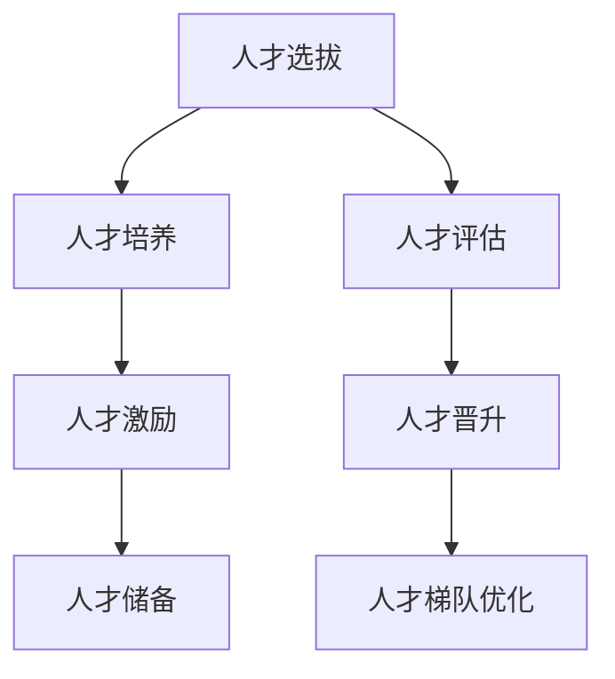

                 


### 《人才梯队建设：为未来储备力量》

#### 关键词：人才梯队建设、战略框架、核心算法、数学模型、项目实战、实施策略

#### 摘要：

在当今竞争激烈的技术领域，人才梯队建设成为企业持续发展的关键。本文将探讨人才梯队建设的理论基础、核心算法原理、数学模型、项目实战以及实施策略，旨在为企业提供一种系统化、科学化的人才培养方案，为未来储备力量。

## 引言

### 1.1 人才梯队建设的重要性

人才是企业发展最重要的资源。一个强大的人才梯队不仅能提升企业的核心竞争力，还能保证企业在面对市场变化和挑战时具备足够的应变能力。人才梯队建设的重要性体现在以下几个方面：

- **提高企业竞争力**：优秀的人才能够推动企业技术创新，提高产品质量，优化业务流程，从而在激烈的市场竞争中脱颖而出。
- **确保可持续发展**：企业要想实现长期发展，必须拥有源源不断的人才储备。人才梯队建设能够为企业提供持续的人力资源支持。
- **传承企业文化**：通过人才梯队建设，企业可以将自身的文化、价值观和经验传承给新一代员工，确保企业文化的持续传承和发展。

### 1.2 人才梯队建设的挑战

尽管人才梯队建设的重要性显而易见，但在实际操作中，企业面临着诸多挑战：

- **人才流失**：优秀人才往往容易受到外部诱惑，导致企业人才流失。
- **人才培养成本**：培养高素质人才需要投入大量的人力、物力和财力，这对企业的经营压力造成了影响。
- **人才结构不合理**：企业人才结构不合理，可能导致某些关键岗位的人才短缺，影响企业业务的正常运营。

### 1.3 本书的目标和结构

本书旨在为企业提供一套系统化、科学化的人才梯队建设方案，包括理论基础、核心算法、数学模型、项目实战和实施策略。具体结构如下：

- **理论基础**：介绍人才梯队建设的概念、战略框架和核心要素。
- **核心算法原理讲解**：讲解人才评估与分类算法、人才晋升与培养算法。
- **数学模型和数学公式**：介绍人才梯队建设的数学模型，并提供数学公式和推导。
- **项目实战**：通过实际案例，展示人才梯队建设的实施方案和效果。
- **实施策略与方法**：提供人才梯队建设的实施步骤、不同行业的策略以及面向未来的趋势。

## 人才梯队建设的理论基础

### 2.1 人才梯队建设的概念

人才梯队建设是指企业在不同层级、不同岗位培养和储备人才的过程，旨在构建一个结构合理、能力互补、持续发展的多层次人才队伍。人才梯队建设包括以下几个方面：

- **初级人才**：具备基本技能和素质，能够适应企业日常业务需求的员工。
- **中级人才**：具备较丰富的经验和专业技能，能够在企业关键岗位上发挥重要作用的人才。
- **高级人才**：具备卓越的领导力、创新能力和战略思维，能够引领企业发展的顶尖人才。

### 2.2 人才梯队建设的战略框架

人才梯队建设的战略框架主要包括以下几个方面：

- **人才培养**：通过培训、轮岗等方式，提高员工的综合素质和专业能力。
- **人才选拔**：建立健全的选拔机制，确保优秀人才脱颖而出。
- **人才激励**：通过薪酬、股权、荣誉等多种方式，激发员工的积极性和创造力。
- **人才储备**：针对企业未来发展需求，提前储备关键岗位的人才。

### 2.3 人才梯队建设的核心要素

人才梯队建设的核心要素包括以下几个方面：

- **组织架构**：明确企业的组织架构，为人才梯队建设提供良好的环境。
- **人才库**：建立企业内部的人才库，记录员工的个人信息、技能水平和职业发展轨迹。
- **培训体系**：构建完善的培训体系，为员工提供持续的学习和成长机会。
- **激励机制**：建立有效的激励机制，激发员工的工作热情和创新能力。

## 核心概念与联系

### 3.1 Mermaid流程图：人才梯队建设的核心环节

下面是一个用于描述人才梯队建设核心环节的Mermaid流程图：



### 3.2 人才梯队建设中的关键概念解释

- **人才选拔**：通过面试、笔试、工作经历等方式，选拔具备一定能力和素质的员工。
- **人才培养**：通过培训、轮岗、导师制等方式，提高员工的综合素质和专业能力。
- **人才激励**：通过薪酬、股权、荣誉等方式，激发员工的工作热情和创新能力。
- **人才储备**：针对企业未来发展需求，提前储备关键岗位的人才。
- **人才评估**：通过定期的评估，了解员工的实际表现，为人才晋升和激励提供依据。
- **人才晋升**：根据员工的绩效和潜力，给予晋升机会，提升其在企业中的地位和薪酬待遇。
- **人才梯队优化**：根据企业的发展需求和人才储备情况，对人才梯队进行优化和调整，确保企业始终拥有合适的的人才队伍。

## 核心算法原理讲解

### 4.1 人才评估与分类算法

#### 4.1.1 评估指标

人才评估指标主要包括以下几个方面：

- **专业知识**：员工的学历、工作经验、专业技能等。
- **工作能力**：员工的工作效率、解决问题的能力、团队协作能力等。
- **工作态度**：员工的责任心、积极主动性、学习能力等。
- **综合素质**：员工的沟通能力、领导力、创新能力等。

#### 4.1.2 分类算法

在人才评估过程中，可以采用以下分类算法：

- **K-Means**：基于距离的聚类算法，将人才分为不同的类别。
- **决策树**：基于特征的划分算法，根据不同的特征值将人才划分为不同的类别。

#### 4.1.3 伪代码

以下是一个基于K-Means算法的人才分类的伪代码示例：

```plaintext
初始化聚类中心
while 未收敛 do
    计算每个员工的聚类中心距离
    更新聚类中心
end while
根据聚类中心将员工分类
```

### 4.2 人才晋升与培养算法

#### 4.2.1 晋升策略

晋升策略主要包括以下几个方面：

- **绩效评估**：根据员工的绩效表现，给予晋升机会。
- **潜力评估**：根据员工的潜力和发展空间，给予晋升机会。
- **岗位需求**：根据企业岗位需求，给予晋升机会。

#### 4.2.2 培养模式

培养模式主要包括以下几个方面：

- **内部培训**：通过内部培训，提升员工的专业能力和综合素质。
- **外部培训**：通过外部培训，拓展员工的视野和技能。
- **导师制**：通过导师制，为员工提供职业发展的指导和帮助。

## 数学模型和数学公式

### 5.1 人才梯队建设的数学模型

#### 5.1.1 模型构建

人才梯队建设的数学模型主要包括以下几个方面：

- **人才储备模型**：用于预测企业未来的人才需求，并提供人才储备策略。
- **绩效评估模型**：用于评估员工的工作表现，为晋升和激励提供依据。
- **晋升模型**：用于确定员工的晋升路径和晋升机会。

#### 5.1.2 模型优化

模型优化主要包括以下几个方面：

- **参数优化**：通过调整模型参数，提高模型的预测精度。
- **算法优化**：通过改进算法，提高模型的计算效率。

### 5.2 数学公式与推导

以下是一个关于人才储备模型的基本数学公式：

$$
P(t) = \sum_{i=1}^{n} p_i \cdot e^{-\lambda t}
$$

其中，$P(t)$表示在时间$t$内企业储备的人才数量，$p_i$表示第$i$个岗位的人才储备比例，$\lambda$表示人才流失率。

## 项目实战

### 6.1 人才梯队建设实战案例

#### 6.1.1 案例背景

某科技公司是一家致力于软件开发和提供解决方案的企业，随着市场竞争的加剧，公司意识到人才梯队建设的重要性，决定开展人才梯队建设项目。

#### 6.1.2 实施方案

1. **组织架构调整**：根据企业的发展需求，对组织架构进行调整，明确各岗位职责和权限。
2. **人才选拔**：建立完善的选拔机制，通过面试、笔试等方式，选拔具备能力和素质的员工。
3. **人才培训**：制定培训计划，包括内部培训和外部培训，提升员工的综合素质和专业能力。
4. **人才激励**：通过薪酬、股权、荣誉等方式，激发员工的工作热情和创新能力。
5. **人才储备**：针对企业未来的人才需求，提前储备关键岗位的人才。
6. **绩效评估**：建立绩效评估机制，定期对员工的工作表现进行评估，为晋升和激励提供依据。

#### 6.1.3 实施效果分析

通过人才梯队建设项目的实施，公司实现了以下效果：

1. **员工满意度提升**：员工通过培训和激励，感受到了企业对他们的重视，员工满意度显著提高。
2. **业务能力提升**：员工的专业能力和综合素质得到提升，公司业务能力得到增强。
3. **人才流失率降低**：通过人才储备和激励措施，降低了人才流失率，保证了企业的人力资源稳定。
4. **企业竞争力提升**：通过人才梯队建设，企业拥有了强大的核心竞争力，在市场竞争中占据有利地位。

#### 6.1.4 项目小结

人才梯队建设是一项长期而复杂的任务，需要企业从组织架构、人才选拔、培训、激励、储备等多个方面进行系统化、科学化的管理。通过成功的项目实践，企业可以不断提升自身的核心竞争力，为未来的发展储备力量。

## 实施策略与方法

### 7.1 人才梯队建设的实施步骤

1. **需求分析**：明确企业的发展目标、业务需求和人才缺口。
2. **组织架构调整**：根据需求分析结果，对组织架构进行调整，明确各岗位职责和权限。
3. **人才选拔**：建立完善的选拔机制，通过面试、笔试等方式，选拔具备能力和素质的员工。
4. **人才培训**：制定培训计划，包括内部培训和外部培训，提升员工的综合素质和专业能力。
5. **人才激励**：通过薪酬、股权、荣誉等方式，激发员工的工作热情和创新能力。
6. **人才储备**：针对企业未来的人才需求，提前储备关键岗位的人才。
7. **绩效评估**：建立绩效评估机制，定期对员工的工作表现进行评估，为晋升和激励提供依据。
8. **持续优化**：根据实施效果，不断调整和优化人才梯队建设方案。

### 7.2 不同行业的人才梯队建设策略

不同行业的人才梯队建设策略有所不同，以下是一些常见行业的策略：

- **互联网行业**：注重技术创新和团队协作，强调员工的专业能力和创新能力。
- **金融行业**：注重合规性、风险控制和客户服务，强调员工的职业素养和风险管理能力。
- **制造业**：注重生产效率和产品质量，强调员工的操作技能和团队协作能力。
- **服务业**：注重客户体验和服务质量，强调员工的沟通能力、服务意识和创新能力。

### 7.3 面向未来的人才梯队建设趋势

随着科技的快速发展，人才梯队建设呈现出以下趋势：

- **数字化转型**：企业将加大对数字化人才的培养和储备，以满足数字化转型需求。
- **跨界融合**：企业将注重跨界人才的培养和储备，以应对跨界竞争和合作需求。
- **个性化培养**：企业将根据员工的个性和潜力，提供个性化的培养和激励方案。
- **全球视野**：企业将注重国际化人才的培养和储备，以应对全球化竞争和合作需求。

## 附录

### 8.1 人才梯队建设工具与资源

- **人力资源管理系统**：用于人才选拔、培训、激励和绩效评估等。
- **在线学习平台**：用于员工在线学习和培训。
- **人才库系统**：用于记录和管理企业内部人才信息。
- **绩效管理系统**：用于员工绩效评估和晋升决策。

### 8.2 相关法律法规与政策

- **劳动法**：规范员工招聘、培训、薪酬、福利等。
- **劳动合同法**：规范员工与企业之间的劳动合同关系。
- **职业培训条例**：规范企业职业培训的实施和管理。
- **人才发展政策**：鼓励企业加强人才梯队建设，提供相关政策支持。

### 作者信息

**作者：AI天才研究院/AI Genius Institute & 禅与计算机程序设计艺术 /Zen And The Art of Computer Programming**

