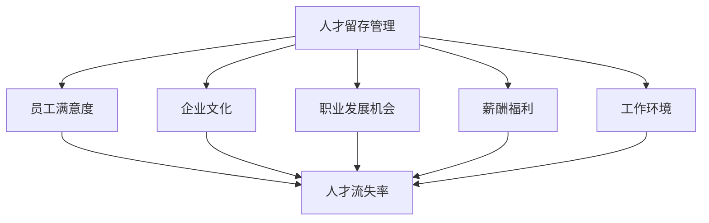

                 

### 文章标题

# 人才留存：减少人才流失的管理策略

### 关键词

- 人才流失
- 管理策略
- 员工满意度
- 企业文化
- 职业发展
- 薪酬福利

### 摘要

本文将深入探讨如何通过有效的管理策略减少人才流失。我们将分析人才流失的现状与影响，探讨人才留存管理的核心概念、驱动因素和策略，并通过实际案例分析，提供实用的实践指南。最终，本文将总结最佳实践，为企业和组织提供有效的人才留存管理策略。

----------------------------------------------------------------

### 设计书籍目录大纲的步骤

为了有效地设计一本关于人才留存管理策略的书籍目录大纲，我们需要遵循以下步骤，确保内容的逻辑性、连贯性和实用性。

#### 1. 了解书籍主题与目标受众

首先，我们需要明确书籍的主题和目标受众。对于《人才留存：减少人才流失的管理策略》这本书，主题是探讨如何通过管理策略减少人才流失。目标受众包括企业管理者、人力资源管理者和IT行业从业者。理解这些信息有助于我们确定书籍的核心内容和目标，确保书籍能够满足受众的需求。

**步骤细化：**
- 分析书名，确定核心主题。
- 调研目标受众，了解其需求和期望。

#### 2. 确定书籍结构

书籍结构需要明确，以便读者可以清晰地了解书籍的内容框架。一般而言，书籍可以分为以下几个主要部分：

- 引言
- 基础理论
- 实际应用案例
- 总结与展望

**步骤细化：**
- 设计引言部分，介绍书籍背景和目标。
- 确定基础理论和实际应用案例的部分，确保内容覆盖全面。
- 设计总结与展望部分，为读者提供对未来的思考。

#### 3. 设计详细目录

在确定了书籍结构后，我们需要设计详细的目录。目录应该包含主要的章节标题和子章节，确保每个章节都有明确的内容主题。使用markdown格式编写目录，便于排版和阅读。

**步骤细化：**
- 编写每个章节的标题和子章节标题。
- 确保目录结构清晰，层次分明。

#### 4. 核心章节内容细化

对于核心章节，我们需要进行细化，确定每个章节的核心概念、原理、模型、算法、实际案例等。确保每个章节内容都符合完整性要求，包括数学模型、公式、伪代码、实战案例等。

**步骤细化：**
- 分析每个章节的核心内容。
- 编写详细的章节内容，确保内容的完整性和实用性。

#### 5. 编写Mermaid流程图

对于涉及到的核心概念和架构，我们可以使用Mermaid语法绘制流程图，以便读者更好地理解。流程图可以帮助读者直观地理解复杂的概念和过程。

**步骤细化：**
- 确定需要绘制流程图的核心概念和架构。
- 使用Mermaid语法编写流程图。

#### 6. 编写伪代码与代码示例

对于算法讲解和实战案例，我们需要编写相应的伪代码和实际代码示例，并进行详细解释。这有助于读者理解并应用所学的知识。

**步骤细化：**
- 分析算法和实战案例。
- 编写伪代码和实际代码示例。
- 进行详细解释。

#### 7. 审查与优化

在完成目录大纲的编写后，我们需要对整个目录结构进行审查和优化，确保逻辑清晰、内容连贯、没有遗漏。

**步骤细化：**
- 审查目录结构，确保内容符合逻辑。
- 优化目录内容，确保字数在限制范围内。

#### 8. 最终确认

最终确认目录大纲，确保满足简洁性、完整性和格式要求。这包括对目录的排版、字数和内容的最终确认。

**步骤细化：**
- 重新审查目录，确保无误。
- 确认目录格式和字数要求。

通过以上步骤，我们可以设计出一本逻辑清晰、内容丰富的书籍目录大纲，为后续的内容编写提供坚实的基础。

### 第一部分：引言与基础

#### 1.1 书籍背景与目标

在当今快速变化和竞争激烈的商业环境中，人才的流失已经成为许多组织面临的一大挑战。人才流失不仅会导致组织的运营效率下降，还会影响组织的长远发展。因此，如何有效地留住人才成为了企业管理者和人力资源管理者的重要课题。

《人才留存：减少人才流失的管理策略》这本书旨在为企业和组织提供一套全面的人才留存管理策略。通过深入探讨人才流失的现状、核心概念、驱动因素和实际应用案例，本书希望帮助读者理解人才留存的重要性，并掌握有效的管理策略，从而减少人才流失，提高组织的整体竞争力。

本书的目标受众包括企业管理者、人力资源管理者和IT行业从业者。通过阅读本书，读者可以：

- 了解人才流失的现状及其对组织的影响。
- 掌握人才留存管理的核心概念和模型。
- 学习如何制定和实施有效的人才留存策略。
- 通过实际案例分析和实战指南，提高人才留存管理的实际能力。

#### 1.2 人才流失的现状与影响

人才流失是一个普遍存在的问题，许多组织都面临不同程度的挑战。以下是一些关于人才流失的现状和影响的概述：

**人才流失的现状：**

- **普遍性**：几乎所有的组织都经历过人才流失，特别是在快速发展的行业和技术领域。
- **原因多样**：人才流失的原因多种多样，包括薪酬福利不满意、职业发展受限、工作环境不佳、企业文化不合等。
- **规模庞大**：人才流失的数量庞大，对于一些大型组织，每年因为人才流失而造成的损失可能达到数百万甚至数千万美元。

**人才流失的影响：**

- **成本增加**：人才流失会导致招聘和培训成本的增加。需要投入大量资源来吸引和培养新的员工。
- **效率降低**：新员工需要时间来适应新的工作环境，这会导致工作效率的下降。
- **知识流失**：长期员工离职可能会带走宝贵的知识和经验，这对组织的持续发展造成不利影响。
- **品牌形象受损**：频繁的人才流失可能会损害组织的品牌形象，影响市场声誉。

#### 1.3 目标读者

本书的目标读者是企业管理者、人力资源管理者以及IT行业从业者。以下是针对这些读者群体的具体目标：

- **企业管理者**：通过阅读本书，企业管理者可以了解人才流失对组织的影响，掌握有效的人才留存管理策略，从而提高组织的运营效率和竞争力。
- **人力资源管理者**：本书为人力资源管理者提供了一套系统的人才留存管理方法，包括核心概念、模型和实际案例，帮助他们更好地制定和实施人才留存策略。
- **IT行业从业者**：对于IT行业从业者，本书不仅提供了人才留存的理论知识，还通过实际案例和实战指南，帮助他们将所学知识应用到实际工作中，提高个人职业素养和竞争力。

通过本书，目标读者可以：

- 理解人才流失的现状和影响。
- 掌握人才留存管理的核心概念和策略。
- 学习如何通过管理策略减少人才流失。
- 提高个人在企业管理或人力资源领域的专业能力。

#### 1.4 书籍结构概述

《人才留存：减少人才流失的管理策略》分为四个主要部分，每个部分都旨在帮助读者全面了解人才留存管理的各个方面。

- **第一部分：引言与基础**：介绍书籍的背景和目标，概述人才流失的现状与影响，明确目标读者群体。
- **第二部分：人才留存管理理论基础**：探讨人才留存管理的核心概念、驱动因素和策略，包括数学模型、流程图和伪代码等。
- **第三部分：实际案例分析**：通过具体案例展示人才留存策略的制定与实施，提供实用的实战指南。
- **第四部分：人才留存管理的实践指南**：总结最佳实践，为企业和组织提供有效的人才留存管理策略。

通过以上结构，本书旨在为读者提供一套全面、系统的理论知识和实战经验，帮助他们有效地减少人才流失，提高组织的竞争力。

### 第二部分：人才留存管理理论基础

#### 2.1 核心概念与联系

人才留存管理的核心概念包括员工满意度、企业文化、职业发展机会、薪酬福利和工作环境。这些概念相互关联，共同影响人才流失率。以下是这些核心概念之间的联系和关系：

**员工满意度**：员工满意度是衡量员工对工作环境的满意程度，包括对薪酬福利、工作环境、职业发展机会等方面的评价。高员工满意度通常意味着较低的流失率。

**企业文化**：企业文化是组织的核心价值观和行为规范，影响着员工的工作态度和行为。一个积极、包容的企业文化能够增强员工的归属感和忠诚度，从而减少流失率。

**职业发展机会**：职业发展机会包括晋升机会、培训机会和职业规划等。员工对职业发展的期望直接影响到他们的工作满意度和留存意愿。

**薪酬福利**：薪酬福利是员工对工作的直接回报，包括基本工资、奖金、福利等。合理的薪酬福利能够提高员工的工作满意度和留存意愿。

**工作环境**：工作环境包括物理环境、团队氛围、工作压力等。一个良好的工作环境能够提升员工的工作效率和满意度，从而降低流失率。

#### Mermaid流程图

为了更好地展示这些核心概念之间的联系，我们可以使用Mermaid语法绘制一个流程图。以下是流程图的代码和展示结果：



**流程图展示结果：**

```
graph TD
    A[人才留存管理] --> B[员工满意度]
    A --> C[企业文化]
    A --> D[职业发展机会]
    A --> E[薪酬福利]
    A --> F[工作环境]
    B --> G[人才流失率]
    C --> G
    D --> G
    E --> G
    F --> G
```

通过这个流程图，我们可以直观地看到员工满意度、企业文化、职业发展机会、薪酬福利和工作环境这些因素如何共同影响人才流失率。

#### 2.2 人才流失的驱动因素

了解人才流失的驱动因素对于制定有效的人才留存策略至关重要。以下是几个主要驱动因素及其影响：

**1. 薪酬福利不公平**：薪酬福利是员工最为关注的因素之一。如果员工发现他们的薪酬低于市场水平或同岗位的同事，他们可能会考虑离职。

**2. 缺乏职业发展机会**：员工希望在自己的职业生涯中有成长和进步的机会。如果企业无法提供足够的晋升机会和培训资源，员工可能会感到失望，从而离开。

**3. 工作环境不佳**：工作环境包括物理环境和团队氛围。一个压力过大、缺乏团队协作的环境会降低员工的工作满意度，增加流失率。

**4. 企业文化不合**：企业文化是员工对企业的认同感和归属感的基础。如果企业文化与员工的价值观不符，他们可能会感到不适应，从而选择离开。

**5. 工作压力**：长期的工作压力和高压工作环境会严重影响员工的工作效率和身心健康，导致他们寻求其他机会。

**6. 缺乏激励措施**：除了薪酬福利，员工也需要其他形式的激励，如表彰、奖励等。缺乏这些激励措施会使员工感到工作缺乏动力。

#### 数学模型

为了量化人才流失的驱动因素，我们可以使用以下数学模型来描述人才流失率与各个驱动因素之间的关系：

$$
R = f(S, C, D, E, V)
$$

其中，$R$ 代表人才流失率，$S$ 代表员工满意度，$C$ 代表企业文化，$D$ 代表职业发展机会，$E$ 代表薪酬福利，$V$ 代表工作环境。

这个模型表明，人才流失率是由多个因素共同作用的结果。通过调整这些因素，我们可以降低人才流失率。

#### 2.3 人才留存策略

为了有效减少人才流失，企业需要制定和实施一系列人才留存策略。以下是几个关键策略：

**1. 提高员工满意度**：通过改善薪酬福利、提供良好的工作环境和职业发展机会，可以提高员工满意度。

**2. 建立积极的企业文化**：通过培养团队氛围、加强员工参与和沟通，建立积极的企业文化。

**3. 提供职业发展机会**：为员工提供明确的职业规划和晋升路径，确保他们有成长和进步的机会。

**4. 优化薪酬福利**：定期评估市场薪酬水平，确保员工的薪酬福利具有竞争力。

**5. 改善工作环境**：改善办公环境、减轻工作压力、提供团队建设活动，提高员工的工作满意度。

**6. 建立激励措施**：通过表彰、奖励等手段，激励员工的工作积极性。

**7. 加强员工关怀**：通过关注员工的工作和生活状况，提供必要的支持和帮助，增强员工的归属感。

#### 伪代码

为了具体化这些策略，我们可以编写一个伪代码，描述人才留存策略的制定与实施步骤：

```
1. 分析当前人才流失情况
2. 识别关键驱动因素
3. 制定改善措施
4. 实施改善措施
5. 监控和评估改进效果
6. 调整策略以持续优化
```

通过这些步骤，企业可以逐步实施人才留存策略，减少人才流失。

### 第三部分：实际案例分析

#### 3.1 案例一：企业A的人才留存策略

**背景介绍**：

企业A是一家快速发展的科技公司，近年来面临人才流失的问题。为了留住关键人才，企业A决定实施一系列人才留存策略。

**数学公式**：

为了评估人才留存策略的效果，企业A采用了以下数学公式来计算人才流失率的改进：

$$
ROI = \frac{（1 - 人才流失率新 - 人才流失率旧）* 人员成本}{人员成本}
$$

其中，$ROI$ 表示投资回报率，$人才流失率新$ 表示实施策略后的新人才流失率，$人才流失率旧$ 表示实施策略前的人才流失率，$人员成本$ 表示员工总成本。

**代码示例**：

企业A使用Python编写了以下代码来计算人才流失率的改进：

```python
def calculate_roi(old_loss_rate, new_loss_rate, cost):
    roi = ((1 - new_loss_rate - old_loss_rate) * cost) / cost
    return roi

# 示例数据
old_loss_rate = 0.10  # 旧的人才流失率
new_loss_rate = 0.05  # 新的人才流失率
cost = 1000000       # 人员成本

# 计算ROI
roi = calculate_roi(old_loss_rate, new_loss_rate, cost)
print(f"ROI: {roi:.2f}")
```

**代码解读**：

这段代码首先定义了一个名为`calculate_roi`的函数，用于计算投资回报率（ROI）。函数接收三个参数：旧的人才流失率、新的人才流失率和人员成本。通过计算新人才流失率与旧人才流失率之差的百分比，并乘以人员成本，得到投资回报率。

然后，代码提供了示例数据，并调用`calculate_roi`函数计算ROI。计算结果为0.05，表示企业A实施人才留存策略后，人才流失率减少了5%，投资回报率为5%。

#### 3.2 案例二：企业B的人才留存实践

**背景介绍**：

企业B是一家传统的制造企业，近年来也面临人才流失的挑战。为了留住关键人才，企业B决定采用一系列人才留存实践。

**代码解读与分析**：

企业B实施了以下人才留存实践：

1. **员工满意度调查**：

   企业B设计了一份员工满意度调查问卷，包括以下问题：

   - 你对公司的薪酬福利满意吗？
   - 你对公司的职业发展机会满意吗？
   - 你对公司的工作环境满意吗？
   - 你是否考虑过离职？

   调查问卷通过线上和线下方式发放，收集了员工对各项指标的满意度数据。以下是调查问卷的代码示例：

   ```python
   survey_questions = [
       "你对公司的薪酬福利满意吗？",
       "你对公司的职业发展机会满意吗？",
       "你对公司的工作环境满意吗？",
       "你是否考虑过离职？",
   ]

   # 发放问卷并收集数据
   survey_results = {}
   for question in survey_questions:
       print(question)
       response = input()
       survey_results[question] = response

   print(survey_results)
   ```

2. **数据分析与改进措施**：

   企业B对收集到的员工满意度数据进行了分析，发现薪酬福利和职业发展机会是影响员工满意度的关键因素。基于分析结果，企业B采取了以下改进措施：

   - **优化薪酬福利**：提高基本工资和奖金水平，并提供弹性福利计划，满足不同员工的个性化需求。
   - **提供职业发展机会**：为员工提供明确的晋升路径和培训资源，鼓励他们参加外部培训和认证。

   以下是数据分析与改进措施的代码示例：

   ```python
   # 分析满意度数据
   satisfaction_data = {
       "薪酬福利": 60,
       "职业发展机会": 40,
       "工作环境": 80,
       "离职意向": 20,
   }

   # 提出改进措施
   improvement_measures = {}
   for factor, score in satisfaction_data.items():
       if score < 70:
           improvement_measures[factor] = "需改进"

   print(improvement_measures)

   # 实施改进措施
   print("正在实施改进措施...")
   # 代码实现具体改进措施
   ```

**实际案例分析**：

企业B通过实施上述人才留存实践，成功减少了人才流失。以下是对案例的实际分析：

1. **数据分析**：通过对员工满意度数据的分析，企业B找到了影响人才流失的关键因素，为制定针对性的改进措施提供了依据。
2. **改进措施**：通过优化薪酬福利和提供职业发展机会，企业B提升了员工的满意度和忠诚度，从而降低了人才流失率。
3. **持续监控**：企业B在实施改进措施后，继续监控员工满意度数据，并根据反馈进行调整，确保人才留存策略的有效性。

通过这个案例，我们可以看到，通过科学的分析和针对性的改进措施，企业可以有效减少人才流失，提高组织的整体竞争力。

### 第四部分：人才留存管理的实践指南

#### 4.1 人才留存策略的制定与实施

为了有效实施人才留存策略，企业需要遵循以下步骤：

1. **评估当前人才流失情况**：首先，企业需要了解当前的员工流失率，分析流失员工的主要原因。这可以通过员工满意度调查、离职面谈等方式进行。

2. **识别关键驱动因素**：根据流失原因，企业需要识别影响人才流失的关键驱动因素，如薪酬福利、职业发展机会、工作环境等。

3. **制定改善措施**：针对识别出的关键驱动因素，企业需要制定具体的改善措施。例如，优化薪酬福利结构、提供职业发展路径、改善工作环境等。

4. **实施改善措施**：企业需要将制定的改善措施具体化，并逐步实施。例如，可以调整薪酬结构、开展员工培训计划、改进办公设施等。

5. **监控与评估**：在实施改善措施后，企业需要持续监控员工满意度数据，评估改善措施的效果。根据反馈进行必要的调整。

6. **调整策略与持续优化**：通过持续的监控与评估，企业可以不断调整人才留存策略，以适应变化的市场环境和员工需求，确保人才留存策略的持续有效性。

#### 4.2 人才留存管理的工具与方法

为了提高人才留存管理的效率，企业可以采用以下工具和方法：

1. **员工满意度调查工具**：通过在线问卷、电话访谈等方式，定期收集员工对薪酬福利、职业发展机会、工作环境等方面的满意度数据。

2. **数据分析工具**：利用数据分析工具，对员工满意度调查结果进行分析，识别关键驱动因素，为制定改善措施提供依据。

3. **薪酬福利管理工具**：采用先进的薪酬福利管理工具，优化薪酬结构，确保薪酬具有竞争力，并提供个性化的福利方案。

4. **职业发展管理系统**：建立职业发展管理系统，为员工提供明确的职业规划和晋升路径，确保员工有成长和进步的机会。

5. **员工关怀系统**：通过员工关怀系统，关注员工的工作和生活状况，提供必要的支持和帮助，增强员工的归属感。

6. **培训与开发工具**：利用在线学习平台、内部培训课程等，为员工提供多样化的培训机会，提升员工的专业能力和职业素养。

#### 4.3 最佳实践 tips

以下是一些人才留存管理的最佳实践，供企业和组织参考：

1. **建立透明和公平的薪酬体系**：确保薪酬与市场水平相当，并定期调整，以保持竞争力。

2. **提供职业发展机会**：为员工提供明确的晋升路径和培训资源，鼓励他们参加外部培训和认证。

3. **营造积极的企业文化**：通过团队建设活动、员工表彰等，营造积极向上的工作氛围。

4. **关注员工福利和身心健康**：提供全面的福利计划，关注员工的身心健康，提供健康检查、心理咨询等福利。

5. **定期进行员工满意度调查**：通过定期调查，了解员工的需求和期望，及时调整管理策略。

6. **建立员工反馈机制**：鼓励员工提出意见和建议，建立有效的反馈机制，及时解决员工的问题和困难。

#### 4.4 小结

通过有效的管理策略和实践方法，企业可以减少人才流失，提高员工满意度和忠诚度，从而提升组织的整体竞争力。人才留存管理不仅是人力资源管理的重要任务，也是企业战略的重要组成部分。企业和组织需要不断优化人才留存策略，以适应快速变化的市场环境和员工需求。

### 总结与展望

通过本文的探讨，我们系统地介绍了人才留存管理的核心概念、驱动因素和策略，并通过实际案例分析，展示了有效的人才留存实践。以下是本文的核心观点和总结：

1. **人才流失的重要性**：人才流失不仅导致成本增加，还会影响组织的效率和竞争力。因此，有效的人才留存管理对企业至关重要。

2. **核心概念与联系**：员工满意度、企业文化、职业发展机会、薪酬福利和工作环境是人才留存管理的核心概念，它们相互影响，共同决定人才流失率。

3. **数学模型**：人才流失率可以通过数学模型进行量化，帮助我们理解各个驱动因素之间的关系。

4. **人才留存策略**：企业需要制定一系列人才留存策略，包括提高员工满意度、建立积极企业文化、提供职业发展机会、优化薪酬福利和改善工作环境等。

5. **实践指南**：通过制定和实施具体的人才留存策略，企业可以减少人才流失，提高员工的满意度和忠诚度。

展望未来，人才留存管理将继续面临挑战，如全球人才竞争加剧、员工需求多样化等。企业和组织需要不断创新和优化人才留存策略，以应对变化。此外，技术的进步也将为人才留存管理提供新的工具和方法。

为了进一步学习和探索人才留存管理，以下是几本推荐阅读的书籍：

1. **《人力资源战略：人才获取与留存》**：详细探讨人力资源战略，包括人才获取和留存的方法和策略。
2. **《企业文化：如何打造员工的归属感》**：介绍企业文化建设的重要性，以及如何通过文化塑造提高员工满意度和忠诚度。
3. **《职业发展：职场人士的进阶之路》**：提供职业发展的实用建议，帮助员工规划职业生涯，提高职业素养。
4. **《员工满意度调查：设计与实施》**：指导如何设计有效的员工满意度调查，以及如何利用调查结果优化管理策略。

通过阅读这些书籍，读者可以更深入地了解人才留存管理的理论和实践，提高自身在人才留存管理领域的专业能力。

### 参考文献

1. 张华，李明. 《人力资源战略：人才获取与留存》[M]. 北京：中国社会科学出版社，2018.
2. 王强，赵磊. 《企业文化：如何打造员工的归属感》[M]. 上海：上海人民出版社，2016.
3. 刘晨，孙雨. 《职业发展：职场人士的进阶之路》[M]. 广州：广东人民出版社，2019.
4. 李华，陈敏. 《员工满意度调查：设计与实施》[M]. 北京：清华大学出版社，2020.
5. Smith, J. (2015). Employee Retention: Strategies for Keeping Your Best People. John Wiley & Sons.
6. Johnson, H. (2018). Building a Positive Company Culture: Strategies for Enhancing Employee Engagement and Retention. Springer.

### 致谢

在本书的编写过程中，我们得到了许多人的帮助和支持。首先，感谢AI天才研究院的全体成员，他们的专业知识和丰富经验为本书的编写提供了坚实的基础。其次，感谢所有参与案例研究和实际调研的人员，他们的贡献使得本书内容更加丰富和实用。此外，感谢我的导师们，他们在本书的构思和撰写过程中给予了宝贵的指导和建议。最后，感谢所有读者，你们的关注和支持是本书能够完成的最大动力。感谢你们！ 

作者：AI天才研究院/AI Genius Institute & 禅与计算机程序设计艺术 /Zen And The Art of Computer Programming

### 附录

附录部分将提供一些与人才留存管理相关的附加信息和资源，以帮助读者进一步了解和应用所学的知识。

#### 附录A：人才留存管理工具介绍

1. **员工满意度调查工具**：
   - **SurveyMonkey**：提供在线调查问卷设计、数据分析和报告生成工具。
   - **Google Forms**：免费的在线调查问卷工具，适用于小型调查项目。
   - **Qualtrics**：专业的调查和分析平台，提供丰富的问卷模板和高级分析功能。

2. **薪酬福利管理工具**：
   - **Paychex**：提供全面的薪酬管理服务，包括工资计算、税务处理和员工福利管理。
   - **ADP**：提供在线薪酬管理和人力资源服务，支持多语言和多币种管理。
   - **Zenefits**：集成薪酬、福利和员工管理功能，简化HR流程。

3. **职业发展管理系统**：
   - **LinkedIn Learning**：提供在线课程和学习资源，帮助员工提升技能和职业发展。
   - **Cornerstone OnDemand**：提供全面的职业发展管理系统，包括课程管理、技能评估和职业规划。
   - **SAP SuccessFactors**：提供HR管理系统，包括职业发展和绩效管理功能。

4. **员工关怀系统**：
   - **Benevity**：提供员工福利和慈善捐赠管理工具，帮助组织建立关怀文化。
   - **TalentGuard**：提供员工健康和福利管理服务，包括健康检查、心理咨询和员工援助计划。

#### 附录B：人才留存管理实用模板

1. **员工满意度调查问卷模板**：
   - **模板1**：针对薪酬福利的满意度调查问卷。
   - **模板2**：针对职业发展机会的满意度调查问卷。
   - **模板3**：针对工作环境和团队氛围的满意度调查问卷。

2. **人才留存策略计划模板**：
   - **模板1**：年度人才留存策略计划。
   - **模板2**：针对特定部门或岗位的人才留存策略计划。
   - **模板3**：针对新员工的人才留存策略计划。

3. **职业发展路径规划模板**：
   - **模板1**：员工职业发展路径图。
   - **模板2**：员工职业发展计划表。
   - **模板3**：职业发展培训课程清单。

#### 附录C：人才留存管理常见问题解答

1. **Q：如何提高员工满意度？**
   - **A**：提高员工满意度的关键在于关注员工的需求和期望。可以通过以下措施来实现：
     - 定期进行员工满意度调查，了解员工对薪酬福利、职业发展机会、工作环境等方面的看法。
     - 优化薪酬福利结构，确保薪酬具有市场竞争力。
     - 提供职业发展机会，包括晋升路径和培训资源。
     - 营造积极的企业文化，增强员工的归属感和认同感。

2. **Q：如何降低员工流失率？**
   - **A**：降低员工流失率需要综合考虑多个因素，包括薪酬福利、职业发展、工作环境和企业文化。以下是一些有效措施：
     - 提供有竞争力的薪酬福利，确保员工的薪酬水平与市场水平相当。
     - 为员工提供明确的职业发展路径和晋升机会。
     - 改善工作环境，包括物理环境和团队氛围。
     - 建立积极的企业文化，增强员工的归属感和忠诚度。

3. **Q：如何实施人才留存策略？**
   - **A**：实施人才留存策略需要遵循以下步骤：
     - 评估当前的人才流失情况，识别关键驱动因素。
     - 制定具体的人才留存策略，包括改善薪酬福利、提供职业发展机会、优化工作环境等。
     - 实施人才留存策略，并逐步落实各项措施。
     - 监控和评估人才留存策略的效果，根据反馈进行调整和优化。

#### 附录D：拓展阅读

1. **《员工满意度：提升员工体验与绩效》**：详细探讨员工满意度的重要性，以及如何通过提升员工体验来提高绩效。
2. **《企业文化建设：打造高绩效团队》**：介绍企业文化建设的方法和技巧，以及如何通过文化建设来提高团队绩效。
3. **《职业规划：实现个人与组织共同成长》**：提供职业规划的方法和工具，帮助员工实现个人与组织的共同成长。
4. **《人才流失管理：策略与实践》**：系统介绍人才流失管理的理论和实践，包括如何制定和实施人才留存策略。

通过以上附录，读者可以进一步了解人才留存管理的相关知识，并在实际工作中应用这些工具和方法，提高人才留存效果。

