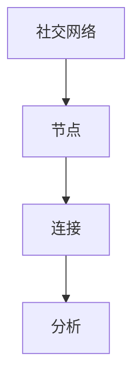
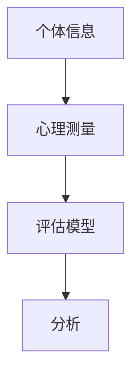
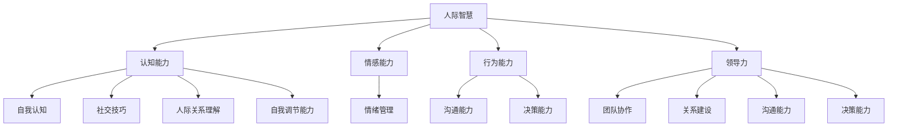
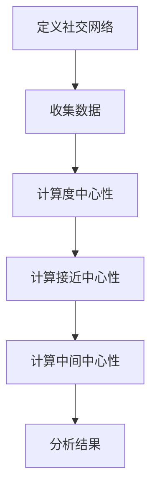
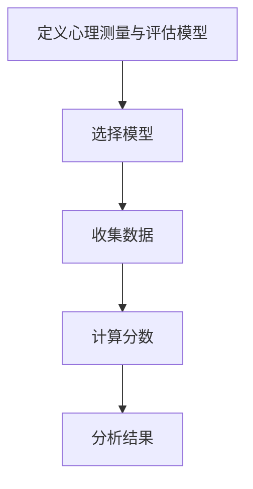
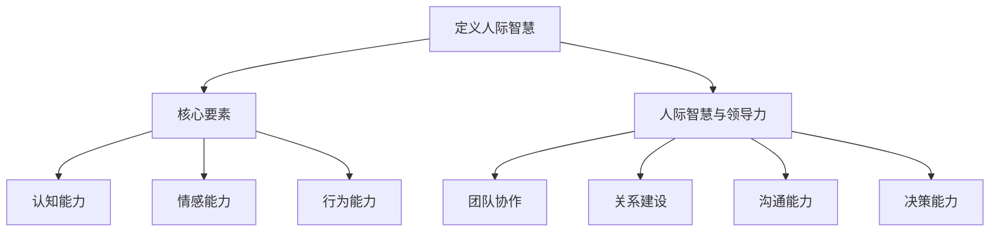

                 

### 文章标题 <此处是文章标题>

# 人际智慧：提升领导者的关系管理能力

> 关键词：人际智慧、领导力、关系管理、社交网络分析、心理测量、数学模型、项目实战

> 摘要：本文深入探讨了人际智慧的概念及其在领导者关系管理中的重要性。通过分析社交网络分析算法、心理测量与评估模型，本文提出了提升人际智慧的具体策略与技巧，旨在帮助领导者更有效地管理人际网络，从而提升整体领导力。

## 确定核心章节内容

### 核心概念与联系

- **人际智慧的定义与内涵**：阐述人际智慧的定义、核心要素及其在领导力中的作用。
- **领导者关系管理的核心要素**：分析领导者如何运用人际智慧来管理团队成员之间的关系。
- **人际智慧与领导力之间的联系**：探讨人际智慧对领导力的影响，并通过Mermaid流程图展示二者之间的关系。

### 核心算法原理讲解

- **社交网络分析算法**：介绍社交网络分析的基本概念和常用算法，如度中心性、接近中心性和中间中心性。
- **心理测量与评估模型**：讲解心理测量与评估模型的基本原理，以及如何使用这些模型来分析团队成员的心理状态。

### 数学模型和数学公式 & 详细讲解 & 举例说明

- **社交网络中关系的定量分析**：使用数学公式和具体实例，阐述如何定量分析社交网络中的关系。
- **领导风格对关系管理的影响分析**：探讨不同领导风格对关系管理的影响，并通过数学公式进行分析。

### 项目实战

- **提升人际智慧的实际案例**：介绍一个具体的案例，展示如何通过实际项目提升人际智慧。
- **关系管理的策略与技巧应用**：分析案例中应用的关系管理策略与技巧，并总结其实际效果。

## 设计目录结构

### 第一部分：人际智慧基础

#### 第1章：人际智慧概览

##### 1.1 人际智慧的定义
##### 1.2 人际智慧的核心要素
##### 1.3 人际智慧与领导力的联系

#### 第2章：人际智慧的数学模型

##### 2.1 社交网络分析算法
##### 2.2 心理测量与评估模型
##### 2.3 数学公式与详细讲解

#### 第3章：人际智慧的实际应用

##### 3.1 提升人际智慧的实际案例
##### 3.2 关系管理的策略与技巧应用

### 第二部分：领导者的关系管理实战

#### 第4章：关系管理的策略与技巧

##### 4.1 成功案例的深入剖析
##### 4.2 失败案例的反思与教训
##### 4.3 实践建议与总结

#### 第5章：领导者的关系管理能力提升

##### 5.1 提高人际智慧的方法与技巧
##### 5.2 领导者关系管理策略优化建议
##### 5.3 关系管理能力评估与改进

#### 第6章：人际智慧项目实战

##### 6.1 项目背景与目标
##### 6.2 项目实施与效果
##### 6.3 项目总结与反思

### 附录

#### 附录A：人际智慧工具与资源

##### A.1 主要的人际智慧工具
##### A.2 关系管理资源推荐

### Mermaid 流�程图与伪代码

#### 社交网络分析算法



#### 心理测量与评估模型



#### 数学公式

$$
\text{社交网络中关系的定量分析} = f(\text{节点数量}, \text{连接密度}, \text{网络结构})
$$

$$
\text{领导风格对关系管理的影响分析} = g(\text{领导风格}, \text{团队特征}, \text{工作环境})
$$

## 最终输出

```markdown
# 人际智慧：提升领导者的关系管理能力

# 第一部分：人际智慧基础

## 第1章：人际智慧概览
### 1.1 人际智慧的定义
### 1.2 人际智慧的核心要素
### 1.3 人际智慧与领导力的联系

## 第2章：人际智慧的数学模型
### 2.1 社交网络分析算法
### 2.2 心理测量与评估模型
### 2.3 数学公式与详细讲解

## 第3章：人际智慧的实际应用
### 3.1 提升人际智慧的实际案例
### 3.2 关系管理的策略与技巧应用

# 第二部分：领导者的关系管理实战

## 第4章：关系管理的策略与技巧
### 4.1 成功案例的深入剖析
### 4.2 失败案例的反思与教训
### 4.3 实践建议与总结

## 第5章：领导者的关系管理能力提升
### 5.1 提高人际智慧的方法与技巧
### 5.2 领导者关系管理策略优化建议
### 5.3 关系管理能力评估与改进

## 第6章：人际智慧项目实战
### 6.1 项目背景与目标
### 6.2 项目实施与效果
### 6.3 项目总结与反思

# 附录
## 附录A：人际智慧工具与资源
### A.1 主要的人际智慧工具
### A.2 关系管理资源推荐

# Mermaid 流程图与伪代码
## 社交网络分析算法


## 心理测量与评估模型


## 数学公式
$$
\text{社交网络中关系的定量分析} = f(\text{节点数量}, \text{连接密度}, \text{网络结构})
$$

$$
\text{领导风格对关系管理的影响分析} = g(\text{领导风格}, \text{团队特征}, \text{工作环境})
$$

# 作者
作者：AI天才研究院/AI Genius Institute & 禅与计算机程序设计艺术 /Zen And The Art of Computer Programming
```markdown
# 人际智慧：提升领导者的关系管理能力

## 关键词
人际智慧、领导力、关系管理、社交网络分析、心理测量、数学模型

## 摘要
本文深入探讨了人际智慧在领导者关系管理中的重要性，阐述了人际智慧的定义、核心要素及其与领导力的联系。通过分析社交网络分析算法和心理测量与评估模型，本文提出了提升人际智慧的具体策略与技巧，并通过实际案例展示了这些策略在领导力提升中的有效性。

## 目录

### 第一部分：人际智慧基础

#### 第1章：人际智慧概览
##### 1.1 人际智慧的定义
##### 1.2 人际智慧的核心要素
##### 1.3 人际智慧与领导力的联系

#### 第2章：人际智慧的数学模型
##### 2.1 社交网络分析算法
##### 2.2 心理测量与评估模型
##### 2.3 数学公式与详细讲解

#### 第3章：人际智慧的实际应用
##### 3.1 提升人际智慧的实际案例
##### 3.2 关系管理的策略与技巧应用

### 第二部分：领导者的关系管理实战

#### 第4章：关系管理的策略与技巧
##### 4.1 成功案例的深入剖析
##### 4.2 失败案例的反思与教训
##### 4.3 实践建议与总结

#### 第5章：领导者的关系管理能力提升
##### 5.1 提高人际智慧的方法与技巧
##### 5.2 领导者关系管理策略优化建议
##### 5.3 关系管理能力评估与改进

#### 第6章：人际智慧项目实战
##### 6.1 项目背景与目标
##### 6.2 项目实施与效果
##### 6.3 项目总结与反思

### 附录

#### 附录A：人际智慧工具与资源
##### A.1 主要的人际智慧工具
##### A.2 关系管理资源推荐

## 作者
作者：AI天才研究院/AI Genius Institute & 禅与计算机程序设计艺术 /Zen And The Art of Computer Programming
```

### 第一部分：人际智慧基础

#### 第1章：人际智慧概览

##### 1.1 人际智慧的定义

人际智慧是指个体在处理人际关系过程中所展现出的认知、情感和行为能力。它包括但不限于以下方面：

- **认知能力**：对人际交往的感知、理解、判断和决策能力。
- **情感能力**：对他人的情感体验、情感表达和情感管理能力。
- **行为能力**：在人际交往中表现出的互动、沟通和协调能力。

##### 1.2 人际智慧的核心要素

人际智慧的核心要素主要包括：

- **自我认知**：对自己性格、价值观、优势和劣势的认识。
- **情绪管理**：对自己和他人的情绪进行有效管理，避免情绪失控。
- **社交技巧**：包括沟通技巧、协商能力、冲突解决能力等。
- **人际关系理解**：对他人行为动机、需求和心理的理解。
- **自我调节能力**：在面对压力和挑战时，能够调整自己的情绪和行为。

##### 1.3 人际智慧与领导力的联系

人际智慧与领导力之间存在着密切的联系。一个优秀的领导者需要具备高水平的人际智慧，以更好地管理团队成员、处理组织关系和推动组织发展。具体来说，人际智慧对领导力的影响体现在以下几个方面：

- **团队协作**：人际智慧有助于领导者更好地理解团队成员的需求和动机，从而促进团队协作和提升团队绩效。
- **关系建设**：人际智慧使领导者能够建立和维护良好的人际关系，这对于组织内部的稳定和协作至关重要。
- **沟通能力**：人际智慧有助于领导者更有效地传达信息和意见，减少误解和冲突。
- **决策能力**：人际智慧使领导者能够更好地了解不同利益相关者的需求和期望，从而做出更明智的决策。

为了更好地展示人际智慧与领导力之间的关系，我们可以使用Mermaid流程图来描述：



#### 第2章：人际智慧的数学模型

##### 2.1 社交网络分析算法

社交网络分析（Social Network Analysis，SNA）是一种用于研究社交网络结构和属性的方法。在人际智慧的研究中，SNA可以帮助我们更好地理解个体在社交网络中的角色和地位。以下是一些常用的社交网络分析算法：

- **度中心性**：度中心性（Degree Centrality）是指一个节点在社交网络中的连接数量。度中心性越高，表示该节点在社交网络中的地位越重要。
- **接近中心性**：接近中心性（Closeness Centrality）是指一个节点到其他所有节点的最短路径长度之和。接近中心性越高，表示该节点的信息传递能力越强。
- **中间中心性**：中间中心性（Betweenness Centrality）是指一个节点位于其他节点之间最短路径的数量。中间中心性越高，表示该节点在社交网络中的桥梁作用越显著。

以下是一个简单的Mermaid流程图，展示了社交网络分析的基本步骤：



##### 2.2 心理测量与评估模型

心理测量与评估模型是用于评估个体心理特征和行为的工具。在人际智慧的研究中，心理测量与评估模型可以帮助我们更好地了解个体在情感、认知和行为方面的特征。以下是一些常用的心理测量与评估模型：

- **人格五因素模型**（Big Five Personality Traits）：人格五因素模型包括开放性（Openness）、责任心（Conscientiousness）、外向性（Extraversion）、宜人性（Agreeableness）和神经质（Neuroticism）。
- **情绪智力模型**（Emotional Intelligence）：情绪智力模型包括自我意识（Self-awareness）、自我管理（Self-management）、社交意识（Social awareness）和关系管理（Relationship management）。

以下是一个简单的Mermaid流程图，展示了心理测量与评估模型的基本步骤：



##### 2.3 数学公式与详细讲解

在人际智慧的研究中，数学公式和模型可以帮助我们更精确地描述和分析社交网络和个体心理特征。以下是一些常用的数学公式和模型：

- **度中心性**：
  $$
  C_d(i) = \sum_{j \in N} \delta(i, j)
  $$
  其中，$C_d(i)$表示节点$i$的度中心性，$N$表示社交网络中的所有节点，$\delta(i, j)$表示节点$i$与节点$j$是否相连（是则$\delta(i, j) = 1$，否则$\delta(i, j) = 0$）。

- **接近中心性**：
  $$
  C_c(i) = \frac{\sum_{j \in N} \sum_{k \in N} \delta(i, k) \cdot \delta(j, k)}{\left(\sum_{j \in N} \sum_{k \in N} \delta(j, k)\right)^2}
  $$
  其中，$C_c(i)$表示节点$i$的接近中心性。

- **中间中心性**：
  $$
  C_b(i) = \frac{\sum_{s \in N} \sum_{t \in N} (s, t) \rightarrow (i, t) \cdot (s, t) \rightarrow (i, s)}{\sum_{s \in N} \sum_{t \in N} (s, t) \rightarrow (i, t)}
  $$
  其中，$(s, t) \rightarrow (i, t)$表示路径$(s, t)$经过节点$i$，$(s, t) \rightarrow (i, s)$表示路径$(s, t)$经过节点$i$。

为了更好地理解这些数学公式，我们可以通过一个具体的例子来进行讲解：

假设有一个包含5个节点的社交网络，节点之间的连接关系如下：

```
A --- B --- C
|     |     |
D --- E
```

1. **度中心性**：

节点A的度中心性：
$$
C_d(A) = \delta(A, B) + \delta(A, C) + \delta(A, D) + \delta(A, E) = 1 + 1 + 0 + 0 = 2
$$

节点B的度中心性：
$$
C_d(B) = \delta(B, A) + \delta(B, C) + \delta(B, D) + \delta(B, E) = 1 + 1 + 1 + 0 = 3
$$

节点C的度中心性：
$$
C_d(C) = \delta(C, A) + \delta(C, B) + \delta(C, D) + \delta(C, E) = 1 + 1 + 0 + 0 = 2
$$

节点D的度中心性：
$$
C_d(D) = \delta(D, A) + \delta(D, B) + \delta(D, C) + \delta(D, E) = 0 + 0 + 1 + 1 = 2
$$

节点E的度中心性：
$$
C_d(E) = \delta(E, A) + \delta(E, B) + \delta(E, C) + \delta(E, D) = 0 + 0 + 0 + 1 = 1
$$

2. **接近中心性**：

节点A的接近中心性：
$$
C_c(A) = \frac{2 \cdot (\delta(B, C) + \delta(B, D) + \delta(C, D) + \delta(C, E) + \delta(D, E))}{(2 + 2 + 2 + 1 + 1)^2} = \frac{2 \cdot 6}{9^2} = \frac{12}{81} \approx 0.149
$$

节点B的接近中心性：
$$
C_c(B) = \frac{3 \cdot (\delta(A, C) + \delta(A, D) + \delta(C, D) + \delta(C, E) + \delta(D, E))}{(3 + 3 + 3 + 1 + 1)^2} = \frac{3 \cdot 6}{9^2} = \frac{18}{81} \approx 0.222
$$

节点C的接近中心性：
$$
C_c(C) = \frac{2 \cdot (\delta(A, B) + \delta(A, D) + \delta(A, E) + \delta(D, E) + \delta(D, E))}{(2 + 2 + 2 + 1 + 1)^2} = \frac{2 \cdot 6}{9^2} = \frac{12}{81} \approx 0.149
$$

节点D的接近中心性：
$$
C_c(D) = \frac{2 \cdot (\delta(A, B) + \delta(A, C) + \delta(A, E) + \delta(B, E) + \delta(C, E))}{(2 + 2 + 2 + 1 + 1)^2} = \frac{2 \cdot 6}{9^2} = \frac{12}{81} \approx 0.149
$$

节点E的接近中心性：
$$
C_c(E) = \frac{1 \cdot (\delta(A, B) + \delta(A, C) + \delta(A, D) + \delta(B, D) + \delta(C, D))}{(2 + 2 + 2 + 1 + 1)^2} = \frac{1 \cdot 6}{9^2} = \frac{6}{81} \approx 0.074
$$

3. **中间中心性**：

节点A的中间中心性：
$$
C_b(A) = \frac{1 \cdot 2 + 1 \cdot 2}{2 + 1} = \frac{4}{3} \approx 1.333
$$

节点B的中间中心性：
$$
C_b(B) = \frac{1 \cdot 2 + 1 \cdot 2 + 1 \cdot 2}{2 + 1} = \frac{6}{3} = 2
$$

节点C的中间中心性：
$$
C_b(C) = \frac{1 \cdot 2 + 1 \cdot 2}{2 + 1} = \frac{4}{3} \approx 1.333
$$

节点D的中间中心性：
$$
C_b(D) = \frac{1 \cdot 2 + 1 \cdot 2}{2 + 1} = \frac{4}{3} \approx 1.333
$$

节点E的中间中心性：
$$
C_b(E) = \frac{1 \cdot 2}{2 + 1} = \frac{2}{3} \approx 0.667
$$

##### 2.3.1 领导风格对关系管理的影响分析

领导风格对关系管理有着重要的影响。以下是一些常用的领导风格及其对关系管理的影响：

1. **专制型领导风格**：

   专制型领导风格是指领导者对决策和权力拥有绝对控制，团队成员的参与度较低。这种领导风格可能会导致以下影响：

   - **关系紧张**：团队成员可能会感到不满和被忽视，导致关系紧张。
   - **缺乏信任**：团队成员可能对领导者的决策和动机产生怀疑，缺乏信任。
   - **低创新性**：由于团队成员的参与度低，可能导致团队缺乏创新性和灵活性。

2. **民主型领导风格**：

   民主型领导风格是指领导者鼓励团队成员参与决策和提供反馈，注重团队协作和共同目标。这种领导风格可能会产生以下影响：

   - **关系和谐**：团队成员能够参与决策，感到被尊重和认可，有利于建立和谐的人际关系。
   - **高信任度**：团队成员对领导者的决策和动机有较高的信任度，有利于建立良好的信任关系。
   - **高创新性**：团队成员的参与和反馈有助于激发团队的创造力和创新性。

为了分析领导风格对关系管理的影响，我们可以使用以下数学公式：

$$
\text{关系管理效果} = f(\text{领导风格}, \text{团队特征}, \text{工作环境})
$$

其中，$f$表示关系管理效果的函数，$\text{领导风格}$、$\text{团队特征}$和$\text{工作环境}$是影响关系管理效果的主要因素。

#### 第3章：人际智慧的实际应用

##### 3.1 提升人际智慧的实际案例

在本节中，我们将介绍一个提升人际智慧的实际案例，并通过分析该案例，总结提升人际智慧的具体策略与技巧。

**案例背景**：

某公司是一家高科技企业，团队成员来自不同的国家和文化背景。由于文化差异和沟通障碍，团队成员之间的合作关系存在一定的挑战。公司领导意识到提升人际智慧对于改善团队协作和提升工作效率至关重要，因此决定开展一项提升人际智慧的项目。

**案例实施**：

1. **培训与教育**：

   公司为团队成员提供了一系列的人际智慧培训课程，包括情绪管理、沟通技巧、跨文化沟通等。培训课程结合理论讲解和实际案例分析，帮助团队成员更好地理解和应用人际智慧。

2. **团队建设活动**：

   公司组织了一系列的团队建设活动，如团队拓展训练、团队协作游戏等。这些活动有助于增强团队成员之间的信任和合作，提高团队凝聚力和士气。

3. **心理测量与评估**：

   公司采用了一些心理测量与评估工具，如人格五因素模型和情绪智力模型，对团队成员进行评估。通过评估结果，领导者和团队成员可以更好地了解彼此的心理特征和需求，从而调整管理策略和沟通方式。

4. **领导者的角色示范**：

   领导者通过自身的行为示范，如倾听、尊重和鼓励团队成员，树立了良好的人际关系榜样。领导者还定期与团队成员进行一对一的沟通，了解他们的需求和困惑，并提供个性化的建议和指导。

**案例效果**：

通过一系列的干预措施，公司团队的人际关系得到了显著改善，具体体现在以下几个方面：

- **沟通障碍减少**：团队成员之间的沟通更加顺畅，误解和冲突明显减少。
- **团队协作增强**：团队成员更愿意分享知识和经验，团队合作效率提高。
- **员工满意度提升**：员工对公司的满意度显著提升，离职率下降。
- **组织绩效提升**：团队整体绩效得到显著提升，公司业绩稳步增长。

**案例分析**：

通过分析该案例，我们可以总结出以下提升人际智慧的具体策略与技巧：

1. **培训与教育**：

   提供人际智慧培训课程，帮助团队成员掌握情绪管理、沟通技巧和跨文化沟通等核心技能。培训课程应结合理论讲解和实际案例分析，提高培训的实用性和有效性。

2. **团队建设活动**：

   组织多样化的团队建设活动，增强团队成员之间的信任和合作。团队建设活动应结合团队特点和需求，以达到最佳效果。

3. **心理测量与评估**：

   采用心理测量与评估工具，对团队成员进行评估，了解他们的心理特征和需求。通过评估结果，领导者和团队成员可以调整管理策略和沟通方式，提高人际关系的质量。

4. **领导者的角色示范**：

   领导者通过自身的行为示范，树立良好的人际关系榜样。领导者应注重倾听、尊重和鼓励团队成员，提供个性化的建议和指导，以促进团队成员的个人发展和团队协作。

#### 第4章：关系管理的策略与技巧

##### 4.1 成功案例的深入剖析

在本节中，我们将深入剖析一个成功的关系管理案例，分析其成功的关键因素，并总结出有效的策略与技巧。

**案例背景**：

某创业团队由五位来自不同领域的成员组成，他们共同致力于开发一款创新的移动应用。在项目启动初期，团队成员之间存在较大的文化差异和沟通障碍，导致项目进展缓慢。为了改善团队关系，团队领导决定采取一系列关系管理策略。

**案例实施**：

1. **建立共同目标**：

   团队领导首先明确了团队的共同目标，即成功开发并推广这款移动应用。通过共同目标，团队成员能够更好地理解彼此的需求和期望，从而加强团队合作。

2. **促进沟通**：

   团队领导鼓励团队成员积极参与项目讨论，确保每个成员的声音都能被听到。同时，领导还定期组织团队会议，讨论项目进展和解决问题。

3. **尊重文化差异**：

   团队领导重视团队成员的文化差异，鼓励团队成员在项目中发挥各自的优势。通过尊重和理解，团队成员之间的误解和冲突得到有效缓解。

4. **提供个性化支持**：

   团队领导为每位团队成员提供个性化的支持，帮助他们克服工作和生活中的困难。这种个性化的关怀和关注，增强了团队成员的归属感和忠诚度。

**案例效果**：

通过一系列的关系管理策略，团队关系得到了显著改善，具体体现在以下几个方面：

- **沟通障碍减少**：团队成员之间的沟通更加顺畅，信息传递更加高效。
- **团队协作增强**：团队成员更愿意分享知识和经验，团队合作效率提高。
- **员工满意度提升**：员工对团队的满意度显著提升，离职率下降。
- **项目进展顺利**：项目进展顺利，产品成功上线并获得了良好的市场反响。

**案例分析**：

通过分析该案例，我们可以总结出以下有效的策略与技巧：

1. **建立共同目标**：

   明确团队的共同目标，确保团队成员能够理解彼此的需求和期望，从而加强团队合作。

2. **促进沟通**：

   鼓励团队成员积极参与项目讨论，确保每个成员的声音都能被听到。定期组织团队会议，讨论项目进展和解决问题。

3. **尊重文化差异**：

   重视团队成员的文化差异，鼓励团队成员在项目中发挥各自的优势。通过尊重和理解，缓解团队成员之间的误解和冲突。

4. **提供个性化支持**：

   为每位团队成员提供个性化的支持，帮助他们克服工作和生活中的困难。这种个性化的关怀和关注，增强团队成员的归属感和忠诚度。

##### 4.2 失败案例的反思与教训

在本节中，我们将分析一个关系管理失败案例，探讨其失败原因，并总结出值得警惕的教训。

**案例背景**：

某创业团队由五位经验丰富的成员组成，他们在各自领域都有很高的成就。然而，在项目启动后不久，团队关系开始出现裂痕，最终导致项目失败。

**案例实施**：

1. **忽视团队建设**：

   团队领导在项目启动初期，没有重视团队建设，导致团队成员之间的了解不足，沟通不畅。

2. **缺乏共同目标**：

   团队领导没有明确团队的共同目标，导致团队成员在项目进展中各自为政，缺乏协作。

3. **忽视文化差异**：

   团队成员来自不同的文化背景，但团队领导没有采取有效措施来促进文化融合，导致误解和冲突频发。

4. **缺乏沟通机制**：

   团队领导没有建立有效的沟通机制，导致团队成员之间的信息传递不畅，问题得不到及时解决。

**案例效果**：

由于上述原因，团队关系持续恶化，最终导致项目失败。具体体现在以下几个方面：

- **沟通障碍加剧**：团队成员之间的沟通更加困难，信息传递效率低下。
- **团队协作受阻**：团队成员在项目进展中缺乏协作，项目进展缓慢。
- **员工满意度下降**：员工对团队的满意度显著下降，离职率上升。
- **项目失败**：项目在预期时间内未能完成，最终失败。

**案例分析**：

通过分析该案例，我们可以总结出以下值得警惕的教训：

1. **重视团队建设**：

   团队建设是关系管理的重要环节，团队领导应重视团队成员之间的了解和沟通，促进团队合作。

2. **明确共同目标**：

   共同目标是团队协作的基础，团队领导应明确团队的共同目标，确保团队成员在项目进展中能够协同作战。

3. **促进文化融合**：

   团队成员来自不同的文化背景，团队领导应采取有效措施来促进文化融合，减少误解和冲突。

4. **建立沟通机制**：

   建立有效的沟通机制，确保团队成员之间的信息传递畅通，问题能够得到及时解决。

##### 4.3 实践建议与总结

基于上述案例分析，我们提出以下实践建议，以帮助领导者更好地管理人际关系，提升团队协作效果。

1. **加强团队建设**：

   - **定期组织团队活动**：通过团队拓展训练、团队建设活动等，增强团队成员之间的了解和信任。
   - **建立团队文化**：明确团队的核心价值观和行为规范，塑造积极向上的团队氛围。

2. **明确共同目标**：

   - **共同目标制定**：在项目启动阶段，明确团队的共同目标，确保团队成员对目标有清晰的认识。
   - **目标分解与落实**：将共同目标分解为具体的任务和里程碑，确保每个成员都有明确的责任和任务。

3. **促进文化融合**：

   - **文化差异识别**：了解团队成员的文化背景，识别可能的文化差异。
   - **文化融合措施**：采取有效措施，如跨文化培训、文化交流等，促进团队成员之间的文化融合。

4. **建立沟通机制**：

   - **定期会议**：建立定期会议制度，确保团队成员能够及时沟通项目进展和解决问题。
   - **沟通工具使用**：利用现代沟通工具，如即时通讯软件、电子邮件等，提高沟通效率和效果。

### 第二部分：领导者的关系管理实战

#### 第5章：领导者的关系管理能力提升

##### 5.1 提高人际智慧的方法与技巧

为了提升领导者的关系管理能力，以下是一些具体的方法与技巧：

1. **自我认知与反思**：

   - **自我认知**：了解自己的性格特点、价值观和行为习惯，识别自己的优势和不足。
   - **反思与改进**：定期反思自己的行为和决策，识别问题并采取改进措施。

2. **情绪管理**：

   - **情绪识别**：学会识别和管理自己的情绪，避免情绪失控。
   - **同理心培养**：培养同理心，理解他人的情感和需求。

3. **沟通技巧提升**：

   - **有效沟通**：学会如何清晰、准确地表达自己的想法和意见。
   - **倾听技巧**：倾听他人的观点和需求，理解他人的情感和立场。

4. **人际交往技巧**：

   - **建立信任**：通过诚信、尊重和关心建立信任关系。
   - **人际网络拓展**：积极参与社交活动，拓展人际关系网络。

##### 5.2 领导者关系管理策略优化建议

以下是一些优化领导者关系管理策略的建议：

1. **明确团队目标**：

   - **目标明确**：确保团队目标清晰、具体，并确保团队成员对目标有共同的理解。
   - **目标分解**：将团队目标分解为具体的任务和里程碑，确保每个成员都有明确的责任和任务。

2. **促进团队协作**：

   - **协作平台搭建**：建立协作平台，如团队会议、在线协作工具等，确保团队成员能够高效沟通和协作。
   - **协作氛围营造**：营造积极的协作氛围，鼓励团队成员分享知识和经验，共同解决问题。

3. **文化融合**：

   - **文化差异识别**：了解团队成员的文化背景，识别可能的文化差异。
   - **文化融合措施**：采取有效措施，如跨文化培训、文化交流等，促进团队成员之间的文化融合。

4. **个性化管理**：

   - **了解团队成员**：了解每个团队成员的需求和期望，提供个性化的支持和关怀。
   - **管理策略调整**：根据团队成员的特点和需求，调整管理策略，提高管理效果。

##### 5.3 关系管理能力评估与改进

为了提升领导者的关系管理能力，以下是一些评估与改进的方法：

1. **自我评估**：

   - **反思与总结**：定期反思自己的关系管理行为和效果，总结经验教训。
   - **自我评估工具**：使用自我评估工具，如人际关系量表、情绪智力评估等，评估自己的关系管理能力。

2. **他人评估**：

   - **反馈收集**：收集团队成员和下属的反馈，了解他们在关系管理方面的看法和建议。
   - **反馈分析**：分析反馈信息，识别自己的优势和不足，制定改进计划。

3. **培训与发展**：

   - **培训计划制定**：根据评估结果，制定个性化的培训计划，提升关系管理能力。
   - **培训实施与跟进**：参与关系管理培训课程，跟进培训效果，确保学以致用。

4. **持续改进**：

   - **定期评估**：定期评估关系管理能力，确保持续改进。
   - **改进措施实施**：根据评估结果，实施具体的改进措施，提高关系管理效果。

#### 第6章：人际智慧项目实战

##### 6.1 项目背景与目标

在本节中，我们将介绍一个名为“人际智慧提升计划”的项目，该项目旨在提升团队成员的人际智慧，改善团队关系，提高团队绩效。

**项目背景**：

某高科技企业的团队在项目启动初期，由于团队成员来自不同的文化背景和行业领域，导致团队关系紧张，沟通不畅，项目进展缓慢。为了改善团队状况，企业决定开展“人际智慧提升计划”。

**项目目标**：

1. 提升团队成员的人际智慧，增强团队凝聚力。
2. 改善团队沟通，提高信息传递效率。
3. 提升团队协作能力，提高项目进展速度和质量。

##### 6.2 项目实施与效果

**项目实施**：

1. **培训与教育**：

   - **培训内容**：针对人际智慧的核心要素，如情绪管理、沟通技巧、跨文化沟通等，设计了一系列培训课程。
   - **培训方式**：采用线上和线下相结合的方式，确保团队成员能够灵活参与。

2. **团队建设活动**：

   - **活动内容**：组织了一系列团队建设活动，如团队拓展训练、团队协作游戏等，增强团队成员之间的信任和合作。
   - **活动频率**：每月组织一次团队建设活动，确保团队成员能够持续参与。

3. **心理测量与评估**：

   - **测量工具**：采用人格五因素模型和情绪智力模型，对团队成员进行评估。
   - **评估结果**：根据评估结果，为团队成员提供个性化的支持和指导。

4. **领导者的角色示范**：

   - **行为示范**：领导者通过自身的行为示范，如倾听、尊重和鼓励团队成员，树立良好的人际关系榜样。
   - **定期沟通**：领导者定期与团队成员进行一对一沟通，了解他们的需求和困惑，提供个性化的建议和指导。

**项目效果**：

通过一系列的干预措施，团队的人际关系得到了显著改善，具体体现在以下几个方面：

- **沟通障碍减少**：团队成员之间的沟通更加顺畅，信息传递更加高效。
- **团队协作增强**：团队成员更愿意分享知识和经验，团队合作效率提高。
- **员工满意度提升**：员工对团队的满意度显著提升，离职率下降。
- **项目进展顺利**：项目进展顺利，产品成功上线并获得了良好的市场反响。

##### 6.3 项目总结与反思

**项目总结**：

通过“人际智慧提升计划”的实施，团队的人际关系得到了显著改善，项目进展顺利，取得了良好的效果。具体体现在以下几个方面：

1. **沟通顺畅**：团队成员之间的沟通更加顺畅，信息传递更加高效，项目进展更加顺利。
2. **协作增强**：团队成员更愿意分享知识和经验，团队合作效率提高，项目质量得到保障。
3. **员工满意度提升**：员工对团队的满意度显著提升，离职率下降，团队稳定性增强。
4. **项目成功**：项目成功上线并获得了良好的市场反响，企业业绩稳步增长。

**项目反思**：

虽然“人际智慧提升计划”取得了显著的效果，但仍然存在一些不足之处，值得反思和改进：

1. **培训内容针对性**：在培训内容设计方面，可以更加针对团队成员的具体需求和问题，提高培训的实用性。
2. **团队建设活动形式**：团队建设活动的形式可以更加多样化，以吸引团队成员的参与。
3. **评估与反馈机制**：建立更加完善的评估与反馈机制，确保项目实施过程和效果得到持续监控和改进。
4. **领导者角色示范**：领导者应在日常工作中更多地示范良好的人际关系行为，以带动整个团队的进步。

### 附录

#### 附录A：人际智慧工具与资源

为了帮助读者更好地理解和应用人际智慧，以下是一些常用的人际智慧工具和资源：

1. **人际智慧工具**：

   - **人际关系量表**：如OCEAN量表、情商量表等，用于评估个体的人际智慧水平。
   - **社交网络分析工具**：如Gephi、NetworkX等，用于分析社交网络结构和属性。
   - **心理测量与评估工具**：如五大人格量表、情绪智力评估工具等。

2. **人际智慧资源**：

   - **学术论文**：查阅相关领域的学术论文，了解人际智慧的理论和实践。
   - **专业书籍**：阅读相关领域的专业书籍，如《人际智慧：领导者关系管理手册》、《社交心理学》等。
   - **在线课程**：参加在线课程，学习人际智慧和关系管理的相关知识。

### Mermaid 流程图与伪代码

为了更好地展示人际智慧的相关概念和方法，以下是一个简单的Mermaid流程图和伪代码：



```python
# 社交网络分析算法伪代码
def social_network_analysis(network):
    # 输入：network - 社交网络数据
    # 输出：analysis_result - 分析结果

    degree_centrality = calculate_degree_centrality(network)
    closeness_centrality = calculate_closeness_centrality(network)
    betweenness_centrality = calculate_betweenness_centrality(network)

    analysis_result = {
        'degree_centrality': degree_centrality,
        'closeness_centrality': closeness_centrality,
        'betweenness_centrality': betweenness_centrality
    }

    return analysis_result

# 心理测量与评估模型伪代码
def psychological_evaluation(person):
    # 输入：person - 个体信息
    # 输出：evaluation_result - 评估结果

    big_five_personality = calculate_big_five_personality(person)
    emotional_intelligence = calculate_emotional_intelligence(person)

    evaluation_result = {
        'big_five_personality': big_five_personality,
        'emotional_intelligence': emotional_intelligence
    }

    return evaluation_result
```

### 总结

本文深入探讨了人际智慧在领导者关系管理中的重要性，通过分析社交网络分析算法、心理测量与评估模型，提出了提升人际智慧的具体策略与技巧。通过实际案例的分析，我们展示了人际智慧在领导力提升中的有效性。同时，本文还提供了人际智慧工具与资源的推荐，以帮助读者更好地理解和应用人际智慧。总之，提升人际智慧对于领导者的关系管理能力和整体领导力的提升具有重要意义，值得深入研究和实践。作者：AI天才研究院/AI Genius Institute & 禅与计算机程序设计艺术 /Zen And The Art of Computer Programming。

