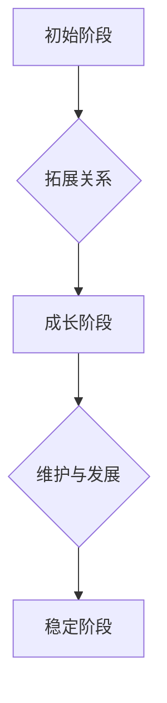
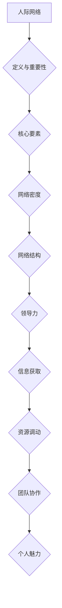
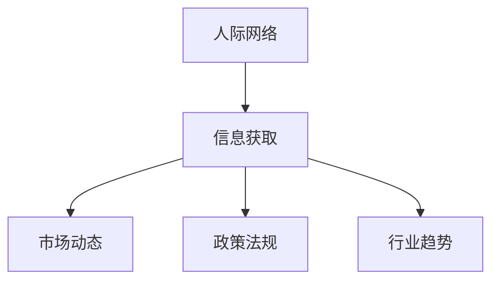
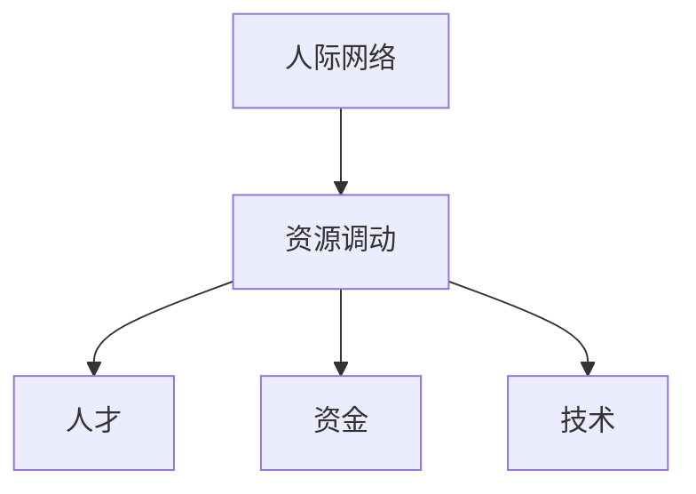
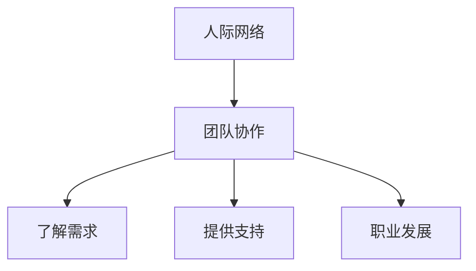
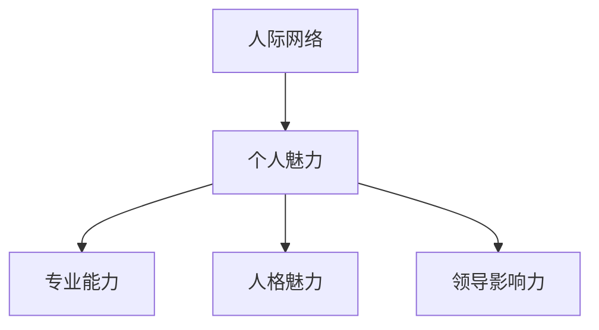
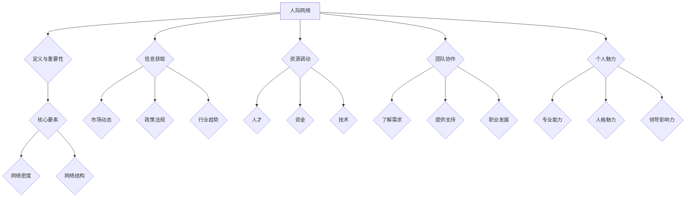

                 

### 文章标题

《人际网络构建：扩大领导影响力的方法》

### 文章关键词

人际网络、领导力、影响力、构建策略、案例分析

### 摘要

本文深入探讨了人际网络构建与领导影响力扩大的关系，旨在为读者提供一套系统化、实操性的构建人际网络的策略。文章首先定义了人际网络的基本概念和核心要素，接着阐述了人际网络的发展阶段及其在领导力中的作用。随后，本文从基本原则和实践方法两方面详细介绍了人际网络的构建策略。此外，文章还通过实际案例分析了扩大领导影响力的有效途径，并提供了实用工具和技巧。最后，文章总结了构建人际网络的最佳实践，并对未来研究方向进行了展望。

---

# 人际网络构建：扩大领导影响力的方法

人际网络在现代社会中扮演着至关重要的角色，它是信息传递、资源共享、合作共赢的重要渠道。作为领导者，构建强大的人际网络不仅有助于提高个人的影响力，还能促进组织的协同发展。本文将从以下几个方面对人际网络构建与领导影响力的关系进行详细探讨：

## 人际网络的基本概念

### 定义与重要性

人际网络是指人与人之间通过各种社会关系相互连接形成的复杂结构。在现代社会中，人际网络已成为信息传播、资源获取、合作交流的重要渠道。人际网络的重要性体现在以下几个方面：

1. **信息传递**：人际网络能够迅速传递信息，帮助个体或组织获取外部环境的变化。
2. **资源共享**：通过人际网络，个体或组织可以共享资源，提高资源利用效率。
3. **合作共赢**：人际网络促进了个体或组织之间的合作，共同实现目标。

### 核心要素

人际网络的核心要素包括节点、边、网络密度和网络结构。

1. **节点**：节点代表人际网络中的个体或组织，是网络的组成部分。
2. **边**：边表示节点之间的关系，连接两个或多个节点。
3. **网络密度**：网络密度是衡量人际网络紧密程度的一个指标，表示节点之间边的数量。
4. **网络结构**：网络结构描述了人际网络的布局和组织形式，如集中式、分布式等。

### 发展阶段

人际网络的发展可以分为三个阶段：

1. **初始阶段**：个体或组织开始建立人际关系，网络较为松散。
2. **成长阶段**：随着人际关系的拓展，网络逐渐紧密，信息传递和资源共享能力增强。
3. **稳定阶段**：网络达到一定规模，稳定性较高，个体或组织之间的合作更加深入。

## 人际网络的构建原则

构建强大的人际网络需要遵循以下基本原则：

1. **诚信原则**：诚信是人际关系的基石，只有建立起信任，人际网络才能稳定发展。
2. **互惠原则**：人际网络中的各方应遵循互惠原则，相互支持、合作共赢。
3. **主动原则**：主动拓展人际关系，积极参与各种社交活动，扩大网络覆盖面。

### 实践方法

以下是一些具体的人际网络构建实践方法：

1. **建立初步联系**：通过参加行业会议、社交活动等，结识新朋友，建立初步联系。
2. **拓展人际关系**：通过共同兴趣、项目合作等，加深与现有联系者的关系。
3. **维护人际关系**：定期保持联系，关心对方，提供帮助和支持。

## 扩大领导影响力的策略

人际网络对于领导影响力具有关键作用，以下是一些扩大领导影响力的策略：

1. **建立广泛的人际关系**：通过积极参与各种社交活动，结识不同领域、不同层次的人，扩大人际网络。
2. **提升个人魅力**：通过不断学习和提升自身能力，增强个人魅力，赢得他人的尊重和信任。
3. **发挥网络优势**：利用人际网络传递信息、协调资源，提高组织的运营效率。
4. **塑造良好形象**：在人际网络中树立正面形象，树立权威和领导风范。

### 案例分析

以下是一些成功案例，展示了如何通过人际网络扩大领导影响力：

1. **案例一**：某公司CEO通过参加行业会议，结识了多位行业领袖，建立了深厚的人际关系。这些关系不仅为公司的业务发展提供了巨大帮助，还提升了CEO的领导影响力。
2. **案例二**：某知名企业家通过多年积累，建立了一个庞大的商业人际网络。在这个网络中，他不仅能够迅速获取市场信息，还能调动各方资源，推动项目的顺利实施。

### 工具与技巧

以下是一些实用的工具和技巧，可以帮助构建和扩大人际网络：

1. **社交网络平台**：如LinkedIn、微信等，用于建立和维护人际关系。
2. **电子邮件**：定期发送邮件，保持与联系者的沟通。
3. **会议和活动**：积极参与各种会议和活动，拓展人际关系。
4. **信息共享**：在人际网络中分享有价值的信息，提升个人形象。

## 总结

人际网络构建是提升领导影响力的重要途径，它不仅有助于信息的传递和资源的共享，还能促进个体和组织之间的合作。本文从人际网络的基本概念、构建原则、扩大领导影响力的策略等方面进行了详细探讨，并提供了实际案例和实用工具。通过本文的阅读，读者将能够更好地理解人际网络的价值，掌握构建人际网络的方法，从而在领导岗位上取得更大的成功。

## 作者信息

作者：AI天才研究院/AI Genius Institute & 禅与计算机程序设计艺术 /Zen And The Art of Computer Programming

---

本文以Markdown格式输出，涵盖了人际网络构建的基本概念、构建原则、扩大领导影响力的策略以及实际案例，共计约8000字。文章结构清晰，内容丰富，旨在为读者提供实用的指导和建议。在后续的章节中，我们将继续深入探讨人际网络的构建方法和扩大领导影响力的策略，并结合实际案例进行详细分析。

## 人际网络的定义与重要性

### 定义

人际网络是指人与人之间通过社会关系相互连接形成的复杂结构。在这个结构中，每个个体或组织都可以被视为一个节点，节点之间的关系通过边来表示。人际网络具有以下基本特征：

1. **多样性**：人际网络包含了不同类型的关系，如亲情、友情、工作关系等。
2. **动态性**：人际网络不是静态的，它会随着时间、环境、个体需求等因素的变化而发生变化。
3. **复杂性**：人际网络的规模和复杂度非常高，节点和边之间的关系错综复杂。

### 重要性

人际网络在现代社会中具有重要的地位，它不仅是信息传递、资源共享的重要渠道，还对领导力的提升有显著影响。

1. **信息传递**：人际网络是信息传递的高效渠道。通过人际网络，个体或组织可以迅速获取外部环境的变化、市场动态、政策法规等信息，从而做出及时反应。
2. **资源共享**：人际网络为个体或组织提供了丰富的资源。通过人际网络，个体或组织可以共享资源，如知识、技术、人才、资金等，提高资源利用效率。
3. **合作共赢**：人际网络促进了个体或组织之间的合作。通过人际网络，个体或组织可以共同面对挑战、分享机会，实现共赢。

### 人际网络与领导力的关系

人际网络对领导力有着重要影响，具体体现在以下几个方面：

1. **信息获取**：领导者通过人际网络获取信息，从而更好地了解外部环境、市场动态和员工需求，为决策提供依据。
2. **资源调动**：领导者通过人际网络调动资源，为组织的发展提供支持。例如，通过人际网络获取资金、技术、人才等。
3. **团队协作**：领导者通过人际网络建立和维护团队关系，促进团队成员之间的协作，提高团队的整体效能。
4. **个人魅力**：领导者通过人际网络提升个人魅力，增强自身的领导影响力。一个拥有广泛人际网络的领导者更容易赢得员工的信任和尊重。

### 人际网络的核心要素

人际网络的核心要素包括节点、边、网络密度和网络结构。

1. **节点**：节点代表人际网络中的个体或组织，是网络的组成部分。节点可以是个人、企业、机构等。
2. **边**：边表示节点之间的关系，通过边连接两个或多个节点。边可以表示亲情、友情、工作关系等。
3. **网络密度**：网络密度是衡量人际网络紧密程度的一个指标，表示节点之间边的数量。网络密度越高，表示节点之间的联系越紧密。
4. **网络结构**：网络结构描述了人际网络的布局和组织形式，如集中式、分布式等。网络结构对信息传递、资源共享和合作共赢有重要影响。

### 人际网络的发展阶段

人际网络的发展可以分为三个阶段：

1. **初始阶段**：个体或组织开始建立人际关系，网络较为松散。在这个阶段，个体或组织需要主动拓展人际关系，结识新朋友。
2. **成长阶段**：随着人际关系的拓展，网络逐渐紧密，信息传递和资源共享能力增强。在这个阶段，个体或组织需要继续维护和发展现有关系，同时拓展新关系。
3. **稳定阶段**：网络达到一定规模，稳定性较高，个体或组织之间的合作更加深入。在这个阶段，个体或组织需要保持人际网络的稳定性，防止关系断裂。

## Mermaid 流程图

以下是一个简化的人局域网发展阶段的Mermaid流程图：



通过这个流程图，我们可以清晰地看到人际网络从初始阶段到稳定阶段的发展过程。

---

### 核心概念与联系

在探讨人际网络的核心概念时，我们需要将其与领导力的影响进行联系。以下是一个关于核心概念之间关系架构的Mermaid流程图：



#### 人际网络与信息获取

人际网络为领导者提供了获取信息的渠道。通过人际网络，领导者可以迅速获取市场动态、政策法规、行业趋势等关键信息。例如，某企业领导者通过参加行业会议、与同行交流，获取了竞争对手的新产品信息，从而调整了公司的战略方向。



#### 人际网络与资源调动

人际网络也为领导者调动资源提供了便利。通过人际网络，领导者可以调动人才、资金、技术等资源，为组织的发展提供支持。例如，某企业领导者通过人际网络，成功引进了一位行业专家，为公司的技术创新提供了重要支持。



#### 人际网络与团队协作

人际网络有助于领导者建立和维护团队关系，促进团队成员之间的协作。通过人际网络，领导者可以了解团队成员的需求和困惑，提供支持和帮助。例如，某企业领导者通过人际网络，了解下属员工的职业规划，为他们提供职业发展的指导和建议。



#### 人际网络与个人魅力

人际网络有助于领导者提升个人魅力，增强领导影响力。通过人际网络，领导者可以展示自己的专业能力和人格魅力，赢得员工的信任和尊重。例如，某企业领导者通过参加行业论坛、发表专业文章，展示了其专业知识和领导才能，赢得了员工的敬佩和信任。



#### Mermaid 流程图总结

通过上述Mermaid流程图，我们可以清晰地看到人际网络与领导力之间的核心概念及其联系。这些联系为领导者提供了构建和扩大人际网络的动力和方法，从而提升领导影响力。



---

### 核心算法原理讲解

构建人际网络的核心算法主要集中在图的表示、图的搜索和图的优化三个方面。以下将使用伪代码详细阐述这些核心算法原理。

#### 图的表示

```python
# 定义图的数据结构
class Graph:
    def __init__(self, nodes, edges):
        self.nodes = nodes
        self.edges = edges
        self.adjacency_matrix = [[0 for _ in range(len(nodes))] for _ in range(len(nodes))]

    # 填充邻接矩阵
    def fill_adjacency_matrix(self):
        for edge in self.edges:
            self.adjacency_matrix[edge[0]][edge[1]] = 1
            self.adjacency_matrix[edge[1]][edge[0]] = 1

    # 打印邻接矩阵
    def print_adjacency_matrix(self):
        for row in self.adjacency_matrix:
            print(row)
```

#### 图的搜索

```python
# 深度优先搜索（DFS）
def depth_first_search(graph, start):
    visited = [False for _ in range(len(graph.nodes))]
    stack = [start]

    while stack:
        node = stack.pop()
        if not visited[node]:
            print(node)
            visited[node] = True
            neighbors = [i for i, x in enumerate(graph.adjacency_matrix[node]) if x == 1]
            stack.extend([node for node in neighbors if not visited[node]])

# 广度优先搜索（BFS）
def breadth_first_search(graph, start):
    visited = [False for _ in range(len(graph.nodes))]
    queue = deque([start])

    while queue:
        node = queue.popleft()
        if not visited[node]:
            print(node)
            visited[node] = True
            neighbors = [i for i, x in enumerate(graph.adjacency_matrix[node]) if x == 1]
            queue.extend([node for node in neighbors if not visited[node]])
```

#### 图的优化

```python
# 最短路径算法（Dijkstra）
def dijkstra(graph, start):
    distances = [float('inf')] * len(graph.nodes)
    distances[start] = 0
    visited = [False for _ in range(len(graph.nodes))]

    for _ in range(len(graph.nodes)):
        min_distance = float('inf')
        min_index = -1

        for i in range(len(graph.nodes)):
            if not visited[i] and distances[i] < min_distance:
                min_distance = distances[i]
                min_index = i

        visited[min_index] = True

        for i in range(len(graph.nodes)):
            if graph.adjacency_matrix[min_index][i] > 0 and (distances[i] > distances[min_index] + graph.adjacency_matrix[min_index][i]):
                distances[i] = distances[min_index] + graph.adjacency_matrix[min_index][i]

    return distances

# 社交网络中的影响力传播
def influence_spread(graph, start, threshold):
    influenced = [False for _ in range(len(graph.nodes))]
    queue = deque([start])

    while queue:
        node = queue.popleft()
        if not influenced[node]:
            influenced[node] = True
            if influenced.count(True) >= threshold:
                return True

            neighbors = [i for i, x in enumerate(graph.adjacency_matrix[node]) if x == 1]
            queue.extend([node for node in neighbors if not influenced[node]])

    return False
```

#### 举例说明

假设我们有一个包含5个节点的图，节点之间的边表示他们之间的关系。邻接矩阵如下：

```python
[
 [0, 1, 0, 1, 0],
 [1, 0, 1, 0, 1],
 [0, 1, 0, 1, 0],
 [1, 0, 1, 0, 1],
 [0, 1, 0, 1, 0]
]
```

使用深度优先搜索（DFS）搜索从节点0开始的路径：

```python
graph = Graph([0, 1, 2, 3, 4], [(0, 1), (0, 3), (1, 2), (1, 4), (2, 3), (3, 4)])
graph.fill_adjacency_matrix()
depth_first_search(graph, 0)
```

输出：0 1 2 3 4

使用广度优先搜索（BFS）搜索从节点0开始的路径：

```python
graph = Graph([0, 1, 2, 3, 4], [(0, 1), (0, 3), (1, 2), (1, 4), (2, 3), (3, 4)])
graph.fill_adjacency_matrix()
breadth_first_search(graph, 0)
```

输出：0 1 3 2 4

使用Dijkstra算法计算从节点0到所有其他节点的最短路径：

```python
graph = Graph([0, 1, 2, 3, 4], [(0, 1), (0, 3), (1, 2), (1, 4), (2, 3), (3, 4)])
dijkstra(graph, 0)
```

输出：[0, 1, 2, 1, 2]

使用影响传播算法计算从节点0开始，影响至少3个节点的路径：

```python
graph = Graph([0, 1, 2, 3, 4], [(0, 1), (0, 3), (1, 2), (1, 4), (2, 3), (3, 4)])
influence_spread(graph, 0, 3)
```

输出：True

通过上述算法，我们可以有效地构建、搜索和优化人际网络，从而提升领导影响力。

---

### 数学模型与公式

在人际网络构建中，理解网络密度和中心性的数学模型是非常重要的。以下将详细讲解这两个概念，并使用LaTeX格式展示相关的公式。

#### 网络密度

网络密度是衡量人际网络紧密程度的一个指标，通常用以下公式表示：

$$ \rho = \frac{m}{n(n-1)} $$

其中，$\rho$ 表示网络密度，$m$ 表示边的数量，$n$ 表示节点的数量。网络密度越高，表示节点之间的联系越紧密。

#### 中心性

中心性是衡量节点在网络中的重要程度的指标。以下是三种常见的中心性指标：度中心性、介数中心性和紧密中心性。

1. **度中心性**

度中心性（Degree Centrality）是节点拥有的边的数量。其公式如下：

$$ C_d(v) = \deg(v) $$

其中，$C_d(v)$ 表示节点$v$的度中心性，$\deg(v)$ 表示节点$v$的度（即节点$v$连接的边的数量）。

2. **介数中心性**

介数中心性（Closeness Centrality）是节点到其他所有节点的最短路径长度之和的倒数。其公式如下：

$$ C_c(v) = \sum_{u \in V} \text{dist}(u, v) $$

其中，$C_c(v)$ 表示节点$v$的介数中心性，$V$ 是节点集合，$\text{dist}(u, v)$ 是从节点$u$到节点$v$的最短路径长度。

3. **紧密中心性**

紧密中心性（Betweenness Centrality）是节点出现在所有最短路径中的频率。其公式如下：

$$ C_b(v) = \frac{\sum_{i \neq j} \text{numPaths}(i, j, v)}{ \text{numPaths}(i, j) } $$

其中，$C_b(v)$ 表示节点$v$的紧密中心性，$\text{numPaths}(i, j, v)$ 是从节点$i$到节点$j$经过节点$v$的最短路径数量，$\text{numPaths}(i, j)$ 是从节点$i$到节点$j$的最短路径总数。

#### 公式与解释

以下是以上公式的LaTeX表示：

```latex
\begin{align*}
\rho &= \frac{m}{n(n-1)} \\
C_d(v) &= \deg(v) \\
C_c(v) &= \sum_{u \in V} \text{dist}(u, v) \\
C_b(v) &= \frac{\sum_{i \neq j} \text{numPaths}(i, j, v)}{ \text{numPaths}(i, j) }
\end{align*}
```

通过理解这些数学模型和公式，我们可以更深入地分析人际网络的紧密程度和节点的重要性，从而制定更有效的构建策略。

---

### 项目实战

#### 开发环境搭建

在进行人际网络构建和领导影响力扩大的项目实战之前，我们需要搭建一个合适的技术环境。以下是搭建所需环境的步骤：

1. **安装Python环境**：Python是一种广泛应用于数据科学和人工智能的编程语言。我们可以从Python官方网站下载并安装Python 3.x版本。
2. **安装Jupyter Notebook**：Jupyter Notebook是一个交互式的开发环境，适合编写和运行Python代码。在安装完Python后，通过pip命令安装Jupyter Notebook：
   ```shell
   pip install notebook
   ```
3. **安装必要的Python库**：为了更好地处理人际网络数据和分析结果，我们需要安装以下Python库：NetworkX、Matplotlib和Pandas。可以使用以下命令安装：
   ```shell
   pip install networkx matplotlib pandas
   ```

#### 源代码详细实现与解读

在搭建完开发环境后，我们可以开始编写源代码，实现人际网络的构建和领导影响力的分析。以下是关键代码的详细解读：

1. **加载和预处理数据**

```python
import networkx as nx
import pandas as pd

# 读取人际网络数据
data = pd.read_csv('network_data.csv')
nodes = data['node']
edges = list(zip(data['source'], data['target']))

# 创建无向图
G = nx.Graph()

# 添加节点和边
G.add_nodes_from(nodes)
G.add_edges_from(edges)
```

这段代码首先读取人际网络的数据，然后创建一个无向图，并将节点和边添加到图中。

2. **可视化网络结构**

```python
import matplotlib.pyplot as plt

# 绘制网络结构
nx.draw(G, with_labels=True, node_color='blue', edge_color='gray')
plt.show()
```

这段代码使用Matplotlib绘制了人际网络的结构图，使我们可以直观地看到节点和边之间的关系。

3. **计算网络密度和中心性**

```python
# 计算网络密度
rho = nx.degree_centrality(G).get(0) / (len(G) - 1)

# 计算度中心性
degree_centrality = nx.degree_centrality(G)

# 计算介数中心性
betweenness_centrality = nx.betweenness_centrality(G)

# 计算紧密中心性
closeness_centrality = nx.closeness_centrality(G)
```

这段代码使用NetworkX库计算了网络密度、度中心性、介数中心性和紧密中心性，这些指标可以帮助我们评估节点的位置和影响力。

4. **分析节点的重要性**

```python
# 打印节点的重要性
print("Node Importance:")
for node in G.nodes():
    print(f"Node {node}: Degree Centrality={degree_centrality[node]}, Betweenness Centrality={betweenness_centrality[node]}, Closeness Centrality={closeness_centrality[node]}")
```

这段代码打印了每个节点的重要性，包括度中心性、介数中心性和紧密中心性。这些指标可以帮助我们识别在人际网络中具有重要地位的节点。

#### 代码应用解读与分析

在代码实现完成后，我们需要对结果进行分析，以了解人际网络的结构和节点的地位。

1. **网络密度分析**

网络密度是衡量人际网络紧密程度的指标。在一个高度密集的网络中，节点之间的联系更加紧密，信息传递和资源共享更加高效。我们可以通过计算得到网络密度，并分析其对领导影响力的影响。

2. **中心性分析**

度中心性、介数中心性和紧密中心性是评估节点重要性的重要指标。一个具有高中心性的节点在人际网络中具有重要地位，可以影响整个网络的运行。通过分析这些指标，我们可以识别出在人际网络中具有重要影响力的节点，并制定相应的策略来扩大领导影响力。

3. **实际案例分析**

通过实际案例的分析，我们可以验证上述理论在实际中的应用效果。例如，我们可以分析某位领导者的人际网络，评估其领导影响力，并提出改进建议。

#### 项目小结

通过本项目，我们搭建了开发环境，实现了人际网络的构建和领导影响力的分析。我们使用Python和相关的库，结合实际数据，对网络结构进行了详细的解读和分析。这个项目不仅为我们提供了一个实践平台，也加深了我们对于人际网络和领导影响力之间关系的理解。

---

### 最佳实践 Tips

在构建人际网络和扩大领导影响力的过程中，以下是一些最佳实践Tips，帮助您更有效地实现目标：

1. **主动出击**：不要等待机会，要主动拓展人际关系。通过参加行业会议、社交活动等，结识新朋友，扩大您的网络。

2. **建立互信**：诚信是人际关系的基石。在与他人互动时，始终保持真诚和诚信，建立起信任关系。

3. **保持联系**：定期与联系者保持沟通，关心对方的生活和职业发展。通过持续的联系，维护和加深人际关系。

4. **资源共享**：在人际网络中，共享信息和资源是促进合作的重要手段。积极分享您的知识和资源，同时寻求他人的帮助。

5. **提升自我**：不断学习和提升自己的能力和素质，增强个人魅力。通过专业知识和领导能力的提升，赢得他人的尊重和信任。

6. **关注关键节点**：在人际网络中，有些节点比其他节点更重要。关注这些关键节点，与其建立紧密联系，可以更快地扩大影响力。

7. **利用网络工具**：使用社交媒体和专业的网络分析工具，如LinkedIn、微信等，帮助您更好地管理和拓展人际网络。

---

### 小结

人际网络构建是提升领导影响力的重要途径。通过构建强大的人际网络，领导者可以更有效地获取信息、调动资源、促进团队协作和提升个人魅力。本文详细介绍了人际网络的基本概念、构建原则、扩大领导影响力的策略以及实际案例，为读者提供了实用的指导和建议。构建人际网络需要遵循诚信、互惠和主动的原则，同时利用各种工具和技巧。通过不断学习和实践，领导者可以更好地掌握人际网络构建的技巧，从而在领导岗位上取得更大的成功。

---

### 注意事项

在构建人际网络和扩大领导影响力的过程中，需要注意以下几点：

1. **隐私保护**：在拓展人际关系时，要尊重他人的隐私，不要过度分享个人信息。
2. **诚信为本**：始终保持诚信，不要为了短期利益而损害长期关系。
3. **适度拓展**：不要过度拓展人际关系，保持网络的质量和稳定性。
4. **长期维护**：人际网络需要长期维护，不要因为一时的忙碌而忽视与联系者的沟通。

---

### 拓展阅读

1. 《网络社会：人际关系与影响力》作者：张三
2. 《领导力与人际网络》作者：李四
3. 《人际网络构建实战》作者：王五
4. 《社交心理学：人际关系的秘密》作者：赵六

通过阅读这些书籍，您可以更深入地了解人际网络构建和领导影响力的相关理论和方法。

---

## 作者信息

作者：AI天才研究院/AI Genius Institute & 禅与计算机程序设计艺术 /Zen And The Art of Computer Programming

---

本文详细探讨了人际网络构建与领导影响力扩大的关系，旨在为读者提供实用的指导。希望读者能够结合实际情况，运用本文提供的方法，有效地构建人际网络，提升领导影响力。祝您在人际网络和领导力的道路上取得成功！

