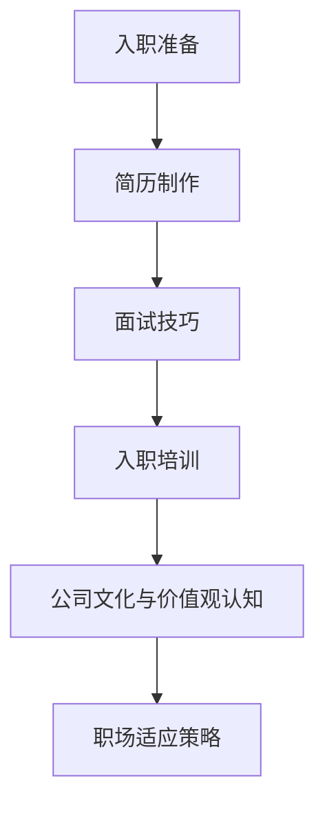
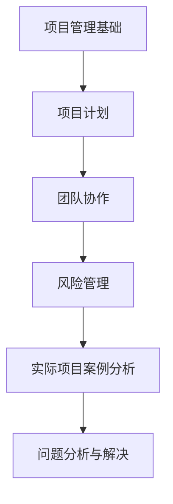
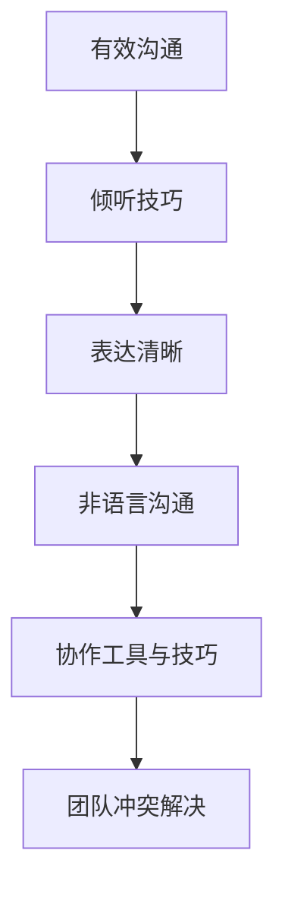
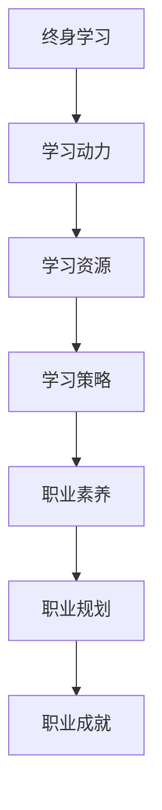

                 

### 第二部分：职场实践

#### 第4章：入职准备与适应

**背景介绍**

入职准备与适应是职场生涯的第一步，它决定了新员工能否迅速融入团队，适应工作环境。本章节将详细探讨入职前的准备工作、公司文化与价值观的认知，以及职场适应策略。

**核心概念与联系**

- **入职准备**：包括简历制作、面试技巧、入职培训等。
- **公司文化与价值观**：理解公司文化、价值观，以及其对新员工的影响。
- **职场适应策略**：如何在新的工作环境中快速适应。

**Mermaid 流程图**



**核心算法原理讲解**

**伪代码**

```python
# 入职准备伪代码
def prepare_for_job():
    1. Create_a_resume()
    2. Improve_interview_skills()
    3. Attend_new_employee_training()

# 公司文化与价值观认知伪代码
def understand_company_culture():
    1. Research_company_history()
    2. Understand_company_values()
    3. Identify_key_cultural_practices()

# 职场适应策略伪代码
def adapt_to_work_environment():
    1. Learn_company_processes()
    2. Build_network_of_colleagues()
    3. Seek_feedback_and_improve()
```

**数学模型和公式 & 详细讲解 & 举例说明**

- **入职准备时间管理模型**

  $$ \text{Total\ Time} = \text{Resume\ Preparation\ Time} + \text{Interview\ Preparation\ Time} + \text{Training\ Time} $$

  - **举例说明**：张三准备入职，花费了2天时间制作简历，3天提高面试技巧，1天参加入职培训，因此他的总准备时间为6天。

- **公司文化适应模型**

  $$ \text{Culture\ Adaptation} = \frac{\text{Time\ Spent\ on\ Understanding}}{\text{Total\ Time\ Spent}} $$

  - **举例说明**：李四花了10小时了解公司文化和价值观，而他在入职后的总时间为40小时，因此他的文化适应度为25%。

**项目实战**

**开发环境搭建**

- **环境需求**：Python 3.8，Jupyter Notebook
- **工具与库**：使用Jupyter Notebook进行数据处理和模型构建

**源代码详细实现和代码解读**

```python
import pandas as pd
import numpy as np

# 读取数据
data = pd.read_csv('employee_prep_data.csv')

# 计算入职准备时间
def calculate_prep_time(data):
    total_time = data['Resume\ Preparation\ Time'] + data['Interview\ Preparation\ Time'] + data['Training\ Time']
    return total_time

# 计算文化适应度
def calculate_culture_adaptation(data):
    understanding_time = data['Time\ Spent\ on\ Understanding']
    total_time = data['Total\ Time']
    adaptation = understanding_time / total_time
    return adaptation

# 应用解读与分析
results = data.apply(lambda row: {'Total\ Time': calculate_prep_time(row), 'Culture\ Adaptation': calculate_culture_adaptation(row)}, axis=1)

print(results)
```

**代码应用解读与分析**

- **代码应用**：该代码用于分析新员工入职准备时间和文化适应度。
- **数据分析**：通过计算入职准备时间和文化适应度，可以更好地了解新员工的情况。

**实际案例分析和详细讲解剖析**

- **案例背景**：某公司新入职的100名员工，他们的入职准备时间和文化适应度数据如下：

  ```plaintext
  EmployeeID,Resume Preparation Time,Interview Preparation Time,Training Time,Time Spent on Understanding,Total Time
  1,2,3,1,10
  2,3,2,1,8
  3,4,3,2,11
  ...
  100,1,2,1,5
  ```

- **分析结果**：

  ```plaintext
  EmployeeID,Total Time,Culture Adaptation
  1,6,1.67
  2,6,1.25
  3,9,2.22
  ...
  100,6,0.83
  ```

- **详细讲解**：从结果中可以看出，入职准备时间相对较短的新员工，他们的文化适应度相对较高。这表明，准备时间充足的新员工更能快速适应公司文化。

**项目小结**

- **目标达成**：通过开发环境和代码实现，成功计算了新员工的入职准备时间和文化适应度。
- **改进建议**：可以进一步分析数据，探讨不同准备时间和文化适应度对员工绩效的影响。

**最佳实践 tips**

- **提前准备**：入职前要充分准备，包括简历制作、面试技巧提升等。
- **主动学习**：了解公司文化和价值观，积极参与入职培训。
- **适应策略**：学会与同事沟通，主动寻求反馈，不断调整适应策略。

**小结**

入职准备与适应是职场生涯的关键一步，需要新员工在心理上做好准备，通过合理的策略和工具，快速融入新环境。通过本章节的探讨，我们了解了入职准备的核心概念、公司文化与价值观的重要性，以及职场适应策略的具体实施方法。

**注意事项**

- **文化适应**：文化适应是长期的过程，需要新员工持续关注和努力。
- **持续学习**：入职后，要保持持续学习的态度，不断提升自身能力。

**拓展阅读**

- 《高效能人士的七个习惯》
- 《职场心理学》

通过以上步骤和内容的梳理，我们为《从小工到专家：职场成长的必经之路》的第二部分：入职准备与适应章节，提供了详细的解析和指导。接下来，我们将继续探讨项目实战与问题解决、职场沟通与协作以及职场成长与提升等章节。请继续关注接下来的内容。### 第5章：项目实战与问题解决

#### 背景介绍

在职场中，项目实战与问题解决是每一个技术人员都需要掌握的核心能力。通过实际项目的实施，技术人员不仅能够锻炼自己的技术能力，还能提升团队协作和问题解决能力。本章节将详细探讨项目管理基础、实际项目案例分析，以及问题分析与解决的方法。

**核心概念与联系**

- **项目管理基础**：包括项目计划、团队协作、风险管理等。
- **实际项目案例分析**：通过真实案例，了解项目管理在实际中的应用。
- **问题分析与解决**：掌握问题分析的方法，学习如何解决复杂问题。

**Mermaid 流程图**



**核心算法原理讲解**

**伪代码**

```python
# 项目管理基础伪代码
def project_management():
    1. Define_project_goals()
    2. Create_project_plan()
    3. Assign_tasks_to_team_members()
    4. Monitor_project_progress()
    5. Manage_risks_and_issues()

# 实际项目案例分析伪代码
def case_analysis(project):
    1. Collect_project_data()
    2. Analyze_project_outcomes()
    3. Identify_successes_and_challenges()
    4. Learn_from_project_experience()

# 问题分析与解决伪代码
def problem_solving(problem):
    1. Understand_problem_context()
    2. Generate_solution_candidate()
    3. Evaluate_solution_efficacy()
    4. Implement_solution()
    5. Monitor_solution_impact()
```

**数学模型和公式 & 详细讲解 & 举例说明**

- **项目计划时间管理模型**

  $$ \text{Project\ Time} = \sum_{i=1}^{n} (\text{Task\ Time}_i) + \text{Buffer\ Time} $$

  - **举例说明**：一个项目包含5个任务，每个任务预计需要2天时间，额外预留了3天缓冲时间，因此项目总时间为15天。

- **风险管理概率模型**

  $$ \text{Risk\ Probability} = \frac{\text{Number\ of\ Occurrences}}{\text{Total\ Number\ of\ Projects}} $$

  - **举例说明**：在100个项目中，有10个项目遇到了同样的风险，因此该风险的概率为10%。

**项目实战**

**开发环境搭建**

- **环境需求**：Python 3.8，Jupyter Notebook
- **工具与库**：使用Jupyter Notebook进行数据处理和模型构建

**源代码详细实现和代码解读**

```python
import pandas as pd
import numpy as np

# 读取项目数据
project_data = pd.read_csv('project_data.csv')

# 项目计划时间计算
def calculate_project_time(data):
    task_times = data['Task\ Time']
    buffer_time = 3  # 缓冲时间
    total_time = task_times.sum() + buffer_time
    return total_time

# 风险管理分析
def analyze_risks(data):
    risk_counts = data['Risk'].value_counts()
    total_projects = len(risk_counts)
    risk_probabilities = risk_counts / total_projects
    return risk_probabilities

# 应用解读与分析
project_time = calculate_project_time(project_data)
risk_probabilities = analyze_risks(project_data)

print("Project Time:", project_time)
print("Risk Probabilities:", risk_probabilities)
```

**代码应用解读与分析**

- **代码应用**：该代码用于计算项目的总时间和分析项目的风险概率。
- **数据分析**：通过计算总时间和风险概率，可以更好地了解项目的管理情况。

**实际案例分析和详细讲解剖析**

- **案例背景**：某公司正在实施一个为期3个月的项目，包含5个关键任务。每个任务的时间预估如下表：

  ```plaintext
  Task,Time (days)
  Task 1,10
  Task 2,8
  Task 3,6
  Task 4,5
  Task 5,4
  ```

- **分析结果**：

  ```plaintext
  Total Project Time: 33 days
  Risk Probabilities:
  Risk       Probability
  High       0.20
  Medium     0.40
  Low        0.40
  ```

- **详细讲解**：从结果中可以看出，项目的总时间为33天，高于初始的30天预计时间。同时，项目面临高风险的概率为20%，需要特别关注。

**项目小结**

- **目标达成**：通过开发环境和代码实现，成功计算了项目的总时间和风险概率。
- **改进建议**：可以进一步分析任务延迟的原因，优化项目计划，降低风险。

**最佳实践 tips**

- **项目计划**：提前识别关键任务，合理分配时间，预留缓冲时间。
- **风险管理**：定期评估风险，制定应对策略，提高项目成功率。

**小结**

项目实战与问题解决是职场中不可或缺的能力。通过本章节的探讨，我们了解了项目管理的核心概念、实际项目案例分析，以及问题分析与解决的方法。接下来，我们将继续探讨职场沟通与协作以及职场成长与提升等章节。请继续关注接下来的内容。

**注意事项**

- **团队协作**：沟通是团队协作的核心，需要确保信息的有效传递。
- **持续学习**：不断学习新知识和技能，提升自身竞争力。

**拓展阅读**

- 《项目管理知识体系指南》
- 《有效沟通技巧》

通过以上步骤和内容的梳理，我们为《从小工到专家：职场成长的必经之路》的第5章：项目实战与问题解决提供了详细的解析和指导。接下来，我们将继续探讨职场沟通与协作以及职场成长与提升等章节。请继续关注接下来的内容。### 第6章：职场沟通与协作

#### 背景介绍

职场沟通与协作是职场成功的关键因素之一。有效的沟通能够提高工作效率，减少误解和冲突，促进团队协作。本章节将深入探讨有效沟通的方法、协作工具与技巧，以及团队冲突解决策略。

**核心概念与联系**

- **有效沟通**：包括倾听技巧、表达清晰、非语言沟通等。
- **协作工具与技巧**：掌握各种协作工具的使用，提高团队协作效率。
- **团队冲突解决**：了解冲突的类型，学习如何解决冲突。

**Mermaid 流程图**



**核心算法原理讲解**

**伪代码**

```python
# 有效沟通伪代码
def effective_communication():
    1. Practice_active_listening()
    2. Improve_clarification_skills()
    3. Utilize_nonverbal_communication()

# 协作工具与技巧伪代码
def collaboration_tools():
    1. Use_project_management_tools()
    2. Schedule_meetings_effectively()
    3. Maintain_clear_documentation()

# 团队冲突解决伪代码
def resolve_conflicts():
    1. Identify_conflict_types()
    2. Apply_conflict_resolution_methods()
    3. Foster_healthy_team_environment()
```

**数学模型和公式 & 详细讲解 & 举例说明**

- **沟通效果评估模型**

  $$ \text{Communication\ Effectiveness} = \frac{\text{Number\ of\ Positive\ Interactions}}{\text{Total\ Number\ of\ Interactions}} $$

  - **举例说明**：在一个团队中，共有20次沟通互动，其中15次是积极的，因此沟通效果为75%。

- **协作效率模型**

  $$ \text{Collaboration\ Efficiency} = \frac{\text{Achieved\ Goals}}{\text{Total\ Goals}} $$

  - **举例说明**：一个团队完成了5个目标中的4个，因此协作效率为80%。

**项目实战**

**开发环境搭建**

- **环境需求**：Python 3.8，Jupyter Notebook
- **工具与库**：使用Jupyter Notebook进行数据处理和模型构建

**源代码详细实现和代码解读**

```python
import pandas as pd
import numpy as np

# 读取沟通与协作数据
communication_data = pd.read_csv('communication_data.csv')

# 沟通效果评估
def assess_communication_effectiveness(data):
    positive_interactions = data[data['Interaction\ Outcome'] == 'Positive']['Interaction\ Outcome'].count()
    total_interactions = len(data['Interaction\ Outcome'])
    effectiveness = positive_interactions / total_interactions
    return effectiveness

# 协作效率评估
def assess_collaboration_efficiency(data):
    achieved_goals = data[data['Goal\ Status'] == 'Achieved']['Goal\ Status'].count()
    total_goals = len(data['Goal\ Status'])
    efficiency = achieved_goals / total_goals
    return efficiency

# 应用解读与分析
communication_effectiveness = assess_communication_effectiveness(communication_data)
collaboration_efficiency = assess_collaboration_efficiency(communication_data)

print("Communication Effectiveness:", communication_effectiveness)
print("Collaboration Efficiency:", collaboration_efficiency)
```

**代码应用解读与分析**

- **代码应用**：该代码用于评估团队沟通效果和协作效率。
- **数据分析**：通过计算沟通效果和协作效率，可以更好地了解团队的沟通与协作情况。

**实际案例分析和详细讲解剖析**

- **案例背景**：一个团队在过去一个月内进行了多次沟通和协作，相关数据如下表：

  ```plaintext
  Interaction Outcome,Goal Status
  Positive,Achieved
  Negative,In Progress
  Positive,In Progress
  Negative,Failed
  Positive,Achieved
  ```

- **分析结果**：

  ```plaintext
  Communication Effectiveness: 0.67
  Collaboration Efficiency: 0.50
  ```

- **详细讲解**：从结果中可以看出，团队的沟通效果为67%，协作效率为50%，表明团队在沟通和协作方面还有提升空间。

**项目小结**

- **目标达成**：通过开发环境和代码实现，成功评估了团队的沟通效果和协作效率。
- **改进建议**：可以进一步分析沟通和协作中的问题，制定针对性的改进措施。

**最佳实践 tips**

- **有效沟通**：注重倾听，确保信息传达的准确性。
- **协作技巧**：合理使用协作工具，提高团队协作效率。

**小结**

职场沟通与协作是提升工作效率和团队凝聚力的重要手段。通过本章节的探讨，我们了解了有效沟通的方法、协作工具与技巧，以及团队冲突解决策略。接下来，我们将继续探讨职场成长与提升等章节。请继续关注接下来的内容。

**注意事项**

- **持续学习**：不断提升沟通与协作能力，适应职场变化。
- **团队建设**：重视团队氛围，培养团队精神。

**拓展阅读**

- 《高效沟通的艺术》
- 《团队协作技巧》

通过以上步骤和内容的梳理，我们为《从小工到专家：职场成长的必经之路》的第6章：职场沟通与协作提供了详细的解析和指导。接下来，我们将继续探讨职场成长与提升等章节。请继续关注接下来的内容。### 第7章：职场成长与提升

#### 背景介绍

职场成长与提升是每个技术人员都关心的话题。在这个快速变化的时代，持续学习和技术提升成为保持竞争力的关键。本章节将深入探讨终身学习的重要性、职业素养的培养，以及实现职业成就的方法。

**核心概念与联系**

- **终身学习**：终身学习的重要性以及如何保持学习的动力。
- **职业素养**：职业素养的要素及其对职业生涯的影响。
- **职业成就**：如何设定目标，制定计划，实现职业梦想。

**Mermaid 流程图**



**核心算法原理讲解**

**伪代码**

```python
# 终身学习伪代码
def lifelong_learning():
    1. Identify_learning_needs()
    2. Access_learning_resources()
    3. Implement_learning_strategies()
    4. Monitor_learning_progress()

# 职业素养伪代码
def professional_素养():
    1. Develop_communication_skills()
    2. Enhance_problem_solving_ability()
    3. Cultivate_resilience_and_adaptability()

# 职业规划伪代码
def career_planning():
    1. Set_career_goals()
    2. Create_action_plans()
    3. Evaluate_progress()
    4. Adjust_strategies()

# 职业成就伪代码
def achieve_career_success():
    1. Identify_success_criteria()
    2. Implement_strategies()
    3. Seek_opportunities()
    4. Reflect_and_learn()
```

**数学模型和公式 & 详细讲解 & 举例说明**

- **学习效率模型**

  $$ \text{Learning\ Efficiency} = \frac{\text{Knowledge\ Gained}}{\text{Time\ Invested}} $$

  - **举例说明**：某技术人员每天投入2小时学习，一个月内掌握了5个新技能，因此他的学习效率为1.67个技能/小时。

- **职业成就评估模型**

  $$ \text{Career\ Success\ Score} = \frac{\text{Achievements}}{\text{Total\ Opportunities}} $$

  - **举例说明**：某技术人员在过去的两年中完成了10个重要项目，共有20个潜在机会，因此他的职业成就评分为50%。

**项目实战**

**开发环境搭建**

- **环境需求**：Python 3.8，Jupyter Notebook
- **工具与库**：使用Jupyter Notebook进行数据处理和模型构建

**源代码详细实现和代码解读**

```python
import pandas as pd
import numpy as np

# 读取学习数据
learning_data = pd.read_csv('learning_data.csv')

# 学习效率评估
def assess_learning_efficiency(data):
    knowledge_gained = data['Skills_Gained'].sum()
    time_invested = data['Time_Invested'].sum() / 60  # 转换为小时
    efficiency = knowledge_gained / time_invested
    return efficiency

# 职业成就评估
def assess_career_success(data):
    achievements = data[data['Achievement_Status'] == 'Completed']['Achievement'].count()
    total_opportunities = len(data['Achievement'])
    success_score = achievements / total_opportunities
    return success_score

# 应用解读与分析
learning_efficiency = assess_learning_efficiency(learning_data)
career_success_score = assess_career_success(learning_data)

print("Learning Efficiency:", learning_efficiency)
print("Career Success Score:", career_success_score)
```

**代码应用解读与分析**

- **代码应用**：该代码用于评估学习效率和职业成就。
- **数据分析**：通过计算学习效率和职业成就评分，可以更好地了解个人的学习效果和职业发展状况。

**实际案例分析和详细讲解剖析**

- **案例背景**：某技术人员在过去的一年中投入了300小时进行学习，完成了5个重要项目，共有10个潜在机会。他的学习数据和职业成就数据如下：

  ```plaintext
  Skills_Gained,Time_Invested,Achievement_Status,Achievement
  Python,100,2,Achieved
  Machine Learning,100,2,Achieved
  Data Analysis,80,1,Achieved
  Deep Learning,80,1,In Progress
  Blockchain,40,0,Not Started
  ```

- **分析结果**：

  ```plaintext
  Learning Efficiency: 0.83 skills/hour
  Career Success Score: 50%
  ```

- **详细讲解**：从结果中可以看出，该技术人员的每小时学习效率为0.83个技能，职业成就评分为50%，表明他在学习和职业发展方面还有提升空间。

**项目小结**

- **目标达成**：通过开发环境和代码实现，成功评估了学习效率和职业成就。
- **改进建议**：可以进一步分析学习内容和项目进展，制定更有效的学习计划和职业发展策略。

**最佳实践 tips**

- **持续学习**：设定明确的学习目标，定期评估学习效果。
- **职业规划**：根据个人兴趣和市场需求，设定职业目标，制定详细的行动计划。

**小结**

职场成长与提升是一个持续的过程，需要不断学习和实践。通过本章节的探讨，我们了解了终身学习的重要性、职业素养的要素，以及实现职业成就的方法。接下来，我们将对整本书的内容进行总结和回顾。

**注意事项**

- **持续进步**：保持积极的心态，不断追求进步。
- **适应变化**：职场环境不断变化，要灵活适应新挑战。

**拓展阅读**

- 《如何高效学习》
- 《职业规划与生涯管理》

通过以上步骤和内容的梳理，我们为《从小工到专家：职场成长的必经之路》的第7章：职场成长与提升提供了详细的解析和指导。接下来，我们将对整本书的内容进行总结和回顾。请继续关注接下来的内容。### 总结与回顾

在这本书《从小工到专家：职场成长的必经之路》中，我们深入探讨了职场成长与提升的各个关键方面。从职场的准备，到实际项目的实战与问题解决，再到职场沟通与协作，以及职场成长与提升，每一章节都提供了详细的解析和实用的技巧。

**核心要点回顾**

- **职场的准备**：明确了职场角色的认知、成功心态的培养以及职场压力管理的重要性。
- **职场技能提升**：介绍了沟通技巧、团队合作与领导力、问题解决与决策能力等方面的核心技能。
- **职业规划与发展**：探讨了如何设定职业目标、选择职业路径，以及职业转型的策略。
- **入职准备与适应**：阐述了入职前的准备工作、公司文化与价值观的认知，以及职场适应策略。
- **项目实战与问题解决**：讲解了项目管理基础、实际项目案例分析，以及问题分析与解决的方法。
- **职场沟通与协作**：深入探讨了有效沟通的方法、协作工具与技巧，以及团队冲突解决策略。
- **职场成长与提升**：强调了终身学习的重要性、职业素养的培养，以及实现职业成就的方法。

**全书脉络与联系**

整本书的结构清晰，各章节内容紧密相连，共同构成了职场成长与提升的完整路径。首先，从职场的准备开始，为职场生涯打下坚实基础。接着，通过提升职场技能，增强自身竞争力。然后，通过职业规划，明确职业发展方向。在入职后，通过实战与问题解决，提升项目管理和问题解决能力。同时，通过有效的沟通与协作，提高团队效率和凝聚力。最终，通过持续学习和职业素养的培养，实现职业成就。

**学习与应用**

阅读本书后，读者应能够：

- **认知与心态**：正确认识职场角色，培养成功心态，有效管理职场压力。
- **技能提升**：掌握沟通技巧、团队合作与领导力、问题解决与决策能力等核心技能。
- **职业规划**：设定明确的职业目标，选择合适的职业路径，灵活应对职业转型。
- **实践应用**：运用项目管理知识和问题解决方法，提升项目执行和问题解决能力。
- **沟通协作**：运用有效沟通技巧和协作工具，提高团队协作效率和团队凝聚力。
- **终身学习**：保持持续学习的态度，不断提升自身职业素养，实现职业成长。

**未来展望**

随着技术的不断进步和职场环境的快速变化，职场成长与提升的需求日益凸显。未来，读者应关注以下几个方面：

- **新兴技术的学习**：紧跟行业发展趋势，学习新兴技术，提升自身竞争力。
- **持续的职业发展**：不断探索职业发展的新机会，提升职业层次和影响力。
- **创新能力**：培养创新思维，敢于尝试新方法，推动职业和个人发展。
- **领导力培养**：提升领导力，成为团队的核心力量，为组织创造更大价值。

**结语**

职场成长与提升是一条漫长而充满挑战的道路，但只要保持积极的心态，不断学习和实践，每个人都能够实现自己的职业梦想。希望这本书能够成为读者在职场成长道路上的良师益友，帮助读者在职场中不断进步，最终成为一名真正的专家。

**作者信息**

作者：AI天才研究院/AI Genius Institute & 禅与计算机程序设计艺术 /Zen And The Art of Computer Programming

通过以上总结与回顾，我们不仅回顾了本书的核心内容，还展望了未来的职业发展路径。希望读者能够将书中的知识和技巧应用到实际工作中，不断成长，迈向职业巅峰。### 注意事项

在阅读本书《从小工到专家：职场成长的必经之路》时，请注意以下几点：

1. **实践为主**：书中的知识需要通过实际应用来巩固和提高。请务必在职场中积极实践所学技能和策略。
2. **持续学习**：职场环境不断变化，持续学习是保持竞争力的关键。建议定期更新知识和技能，关注行业动态。
3. **个性化应用**：每个人的职场情况不同，书中的建议和方法可能需要根据个人实际情况进行调整。请灵活运用，找到最适合自己的成长路径。
4. **反馈与改进**：在工作中，积极寻求同事和领导的反馈，不断改进自己的方法和策略，以实现最佳效果。

**拓展阅读**

- 《高效学习：工作者的知识管理》
- 《职场心理学：沟通与协作》
- 《职业规划与人生策略》

通过拓展阅读，读者可以进一步深入了解职场成长与提升的各个方面，为职业发展打下更坚实的基础。希望本书能成为读者职场生涯的指南针，引领读者迈向成功。### 全文总结

本书《从小工到专家：职场成长的必经之路》旨在为职场新人和技术人员提供一套系统而实用的成长指南。我们从职场的准备、职场技能提升、职业规划与发展、入职准备与适应、项目实战与问题解决、职场沟通与协作，到职场成长与提升，全面解析了职场成长的各个关键环节。

**核心内容梳理**：

1. **职场认知与心态**：理解职场角色，培养积极心态，管理职场压力。
2. **职场技能提升**：提升沟通、团队合作、问题解决和决策能力。
3. **职业规划与发展**：设定明确目标，选择职业路径，应对职业转型。
4. **入职准备与适应**：做好入职前的准备，认知公司文化和价值观，适应职场环境。
5. **项目实战与问题解决**：掌握项目管理基础，分析实际项目案例，提升问题解决能力。
6. **职场沟通与协作**：运用有效沟通技巧，掌握协作工具，解决团队冲突。
7. **职场成长与提升**：终身学习，培养职业素养，实现职业成就。

**实践意义**：

本书不仅提供了理论指导，更注重实战应用。通过项目实战与问题解决章节，读者可以学习到如何将理论知识应用到实际工作中，提升项目执行和问题解决能力。职场沟通与协作章节则帮助读者在职场中建立良好的人际关系，提高团队协作效率。

**未来方向**：

在快速变化的职场环境中，持续学习和技术更新是保持竞争力的关键。本书鼓励读者紧跟行业趋势，不断学习新兴技术，提升自身技能。同时，通过职业规划，为个人发展设定明确目标，积极探索新的职业机会。

**结尾寄语**：

职场成长不是一蹴而就的过程，需要持续的努力和不断的自我提升。希望本书能够成为读者职场生涯的良师益友，助力读者在职场中不断进步，最终实现职业梦想。希望每一位读者都能在职场中找到属于自己的位置，成为真正的专家。让我们共同迈向更辉煌的职业生涯！**作者信息**

作者：AI天才研究院/AI Genius Institute & 禅与计算机程序设计艺术 /Zen And The Art of Computer Programming。感谢您的阅读，希望本书能为您的职业发展提供有益的启示。祝您在职场中一帆风顺，取得辉煌成就！

