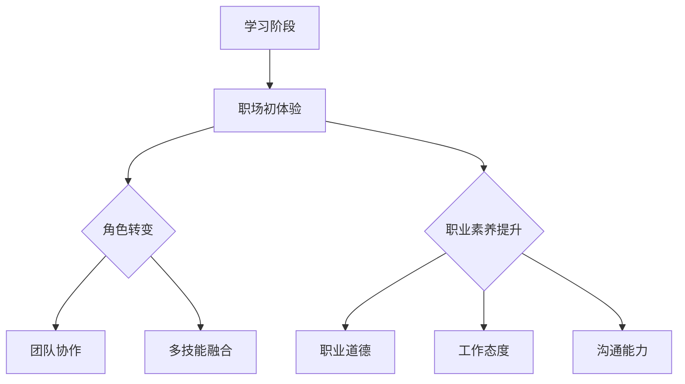
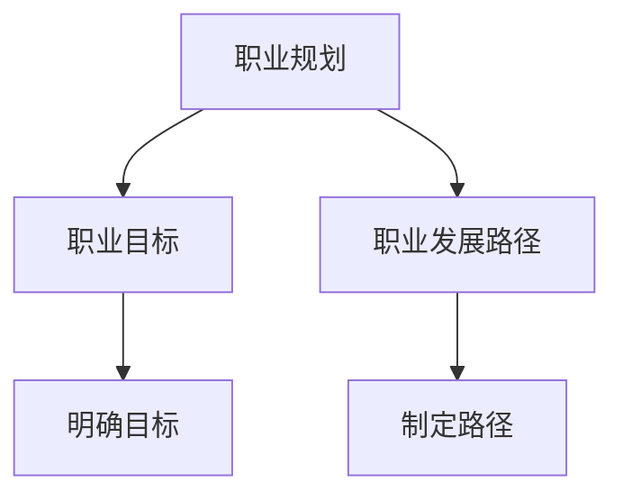
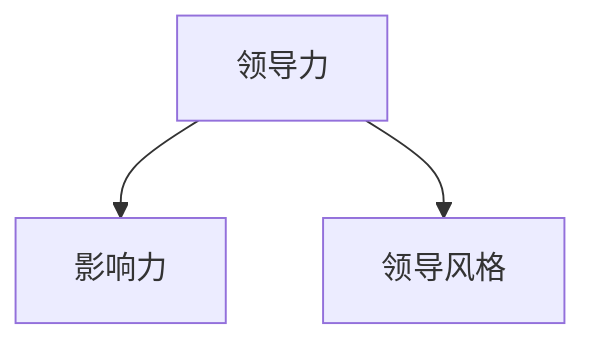
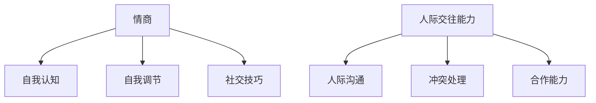

                 

# 《从小工到专家：职场进阶的必经之路》

关键词：职场进阶，职业素养，专业技能，团队协作，决策能力

摘要：本文将探讨职场进阶的必经之路，从职场初体验、技能提升、职业规划、人际关系管理、职场压力应对、高级技能培养等方面，全面分析职场人在职业发展中所需具备的能力和素质，帮助职场人实现从小工到专家的蜕变。

## 第一部分：职场起跑线

### 第1章：职场初体验

#### 1.1 从小工到职场人的转变

职场初体验是每个人职业生涯的起点，也是职场人从小工到职场人的重要转变过程。在这个阶段，职场人需要从学习到工作的角色转换，从个人学习到团队协作的转变，以及从知识技能到职业素养的提升。

**核心概念与联系：**

- **角色转变：** 从学生到职场人，角色的转变意味着需要从学习知识到应用知识、从独立学习到团队协作、从单一技能到多技能融合。
- **职业素养：** 职场素养包括职业道德、工作态度、沟通能力、团队合作精神等，是职场人职业生涯发展的重要基础。

**Mermaid流程图：**



#### 1.2 职场礼仪与沟通技巧

职场礼仪和沟通技巧是职场人必备的基本素质。良好的职场礼仪可以提升个人形象，增进同事之间的相互理解和尊重；而沟通技巧则是职场人进行有效沟通、解决问题、推进项目的重要手段。

**核心概念与联系：**

- **职场礼仪：** 包括着装规范、行为举止、礼貌用语等，是职场人际交往的基本准则。
- **沟通技巧：** 包括倾听、表达、反馈、谈判等，是职场沟通的关键。

**伪代码：**

```plaintext
function 职场礼仪与沟通技巧() {
    着装规范();
    行为举止();
    礼貌用语();
    倾听();
    表达();
    反馈();
    谈判();
}
```

#### 1.3 工作态度与职业素养

工作态度和职业素养是职场人职业发展的关键因素。积极的工作态度可以激发个人的潜能，提高工作效率；而职业素养则是职场人职业道德、职业操守的体现。

**核心概念与联系：**

- **工作态度：** 包括责任心、主动性、团队合作精神等。
- **职业素养：** 包括职业道德、职业操守、职业精神等。

**数学模型和公式详细讲解：**

工作态度（AT）和职业素养（CS）的关系可以用以下公式表示：

$$
职业发展 = f(工作态度, 职业素养)
$$

举例说明：

- 如果工作态度（AT）积极，职业素养（CS）较高，则职业发展（职业发展）较好。
- 如果工作态度（AT）消极，职业素养（CS）较低，则职业发展（职业发展）较差。

$$
f(积极, 高) = 职业发展(好)
$$
$$
f(消极, 低) = 职业发展(差)
$$

## 第二部分：职场进阶之路

### 第2章：职场技能提升

#### 2.1 专业技能与知识拓展

在职场中，专业技能和知识拓展是职场人不断提升自身竞争力的关键。通过不断学习和实践，职场人可以提升自己的专业技能，拓宽知识领域，提高工作效率和质量。

**核心概念与联系：**

- **专业技能：** 指职场人在工作中所需的专业知识和技能。
- **知识拓展：** 指职场人在专业领域之外进行的知识积累和拓展。

**伪代码：**

```plaintext
function 技能提升() {
    学习专业知识();
    实践应用();
    知识拓展();
}
```

#### 2.2 解决问题的能力培养

在职场中，解决问题是职场人的核心能力之一。通过培养解决问题的能力，职场人可以提高工作效率，减少问题发生，提升团队协作能力。

**核心概念与联系：**

- **问题识别：** 能够快速准确地识别问题。
- **原因分析：** 能够深入分析问题产生的原因。
- **解决方案：** 能够提出有效的解决方案。

**数学模型和公式详细讲解：**

解决问题的能力（SA）可以用以下公式表示：

$$
SA = f(问题识别, 原因分析, 解决方案)
$$

举例说明：

- 如果问题识别（识别能力）强，原因分析（分析能力）深，解决方案（解决能力）有效，则解决问题的能力（SA）强。
- 如果问题识别（识别能力）弱，原因分析（分析能力）浅，解决方案（解决能力）无效，则解决问题的能力（SA）弱。

$$
f(强, 深, 有效) = SA(强)
$$
$$
f(弱, 浅, 无效) = SA(弱)
$$

#### 2.3 团队协作与项目推进

团队协作和项目推进是职场人实现工作目标的重要途径。通过有效的团队协作和项目推进，职场人可以提升团队执行力，提高工作效率和质量。

**核心概念与联系：**

- **团队协作：** 指团队成员之间的相互配合、协作。
- **项目推进：** 指项目的实施和进展。

**数学模型和公式详细讲解：**

团队协作效率（TE）可以用以下公式表示：

$$
TE = f(团队协作, 项目目标, 资源配置)
$$

举例说明：

- 如果团队协作（协作能力）强，项目目标（目标明确）清晰，资源配置（资源充足），则团队协作效率（TE）高。
- 如果团队协作（协作能力）弱，项目目标（目标不明确）模糊，资源配置（资源不足），则团队协作效率（TE）低。

$$
f(强, 明确, 充足) = TE(高)
$$
$$
f(弱, 模糊, 不足) = TE(低)
$$

## 第三部分：职场高级技能

### 第3章：职业规划与目标设定

#### 3.1 职业规划的制定

职业规划是职场人职业生涯发展的重要指导。通过职业规划，职场人可以明确自己的职业目标，制定合理的职业发展路径，实现职业成长。

**核心概念与联系：**

- **职业目标：** 职场人希望达到的职业状态。
- **职业发展路径：** 职场人实现职业目标的路径。

**Mermaid流程图：**



#### 3.2 职业目标的确立与调整

职业目标的确立是职业规划的重要环节。通过明确职业目标，职场人可以聚焦自己的努力方向，有针对性地提升自身能力。同时，职业目标也需要根据实际情况进行调整，以适应职场变化。

**核心概念与联系：**

- **职业目标确立：** 根据个人兴趣、能力、市场需求等因素确定职业目标。
- **职业目标调整：** 根据职业发展、环境变化等因素对职业目标进行调整。

**数学模型和公式详细讲解：**

职业目标调整率（TAR）可以用以下公式表示：

$$
TAR = \frac{调整后目标 - 调整前目标}{调整前目标}
$$

举例说明：

- 如果职业目标调整前为100万元年薪，调整后为150万元年薪，则职业目标调整率为50%。
- 如果职业目标调整前为100万元年薪，调整后为90万元年薪，则职业目标调整率为-10%。

$$
TAR = \frac{150 - 100}{100} = 0.5
$$
$$
TAR = \frac{90 - 100}{100} = -0.1
$$

#### 3.3 职业发展的路径选择

职业发展的路径选择是职场人实现职业目标的关键。通过选择合适的职业发展路径，职场人可以更快地实现职业目标，提升自身价值。

**核心概念与联系：**

- **职业发展路径：** 职场人实现职业目标的途径。
- **路径选择：** 根据个人能力、市场需求、职业规划等因素选择职业发展路径。

**数学模型和公式详细讲解：**

职业发展路径选择成功率（PSC）可以用以下公式表示：

$$
PSC = \frac{成功路径数量}{总路径数量}
$$

举例说明：

- 如果有3条职业发展路径，其中2条成功，则职业发展路径选择成功率为66.7%。
- 如果有5条职业发展路径，其中3条成功，则职业发展路径选择成功率为60%。

$$
PSC = \frac{2}{3} = 0.667
$$
$$
PSC = \frac{3}{5} = 0.6
$$

## 第四部分：职场进阶的软实力

### 第4章：职场人际关系管理

#### 4.1 人际关系的建立与维护

在职场中，良好的人际关系对于职场人的职业发展具有重要意义。通过建立和维护良好的人际关系，职场人可以提升自身的影响力，拓展人脉资源，为职业发展创造更多机会。

**核心概念与联系：**

- **人际关系：** 职场中人与人之间的互动和联系。
- **建立与维护：** 人际关系的构建和维护方法。

**伪代码：**

```plaintext
function 人际关系管理() {
    建立关系();
    维护关系();
    拓展人脉();
}
```

#### 4.2 沟通协调与冲突处理

沟通协调和冲突处理是职场人际关系管理的重要环节。通过有效的沟通协调，职场人可以解决工作中的问题和矛盾，促进团队协作；而冲突处理则有助于维护职场和谐，提高工作效率。

**核心概念与联系：**

- **沟通协调：** 指在职场中通过沟通解决问题、协调利益。
- **冲突处理：** 指在职场中应对和处理各种冲突。

**数学模型和公式详细讲解：**

沟通协调效率（CE）和冲突处理能力（CP）可以用以下公式表示：

$$
CE = f(沟通技巧, 协调能力)
$$

$$
CP = f(处理策略, 解决能力)
$$

举例说明：

- 如果沟通技巧（沟通技巧）高，协调能力（协调能力）强，则沟通协调效率（CE）高。
- 如果处理策略（处理策略）有效，解决能力（解决能力）强，则冲突处理能力（CP）强。

$$
CE = f(高, 强) = 高
$$
$$
CP = f(有效, 强) = 强
$$

#### 4.3 领导力与团队管理

领导力和团队管理是职场高级技能的重要组成部分。具备领导力可以帮助职场人在职场中脱颖而出，提升团队执行力；而团队管理则有助于职场人带领团队实现共同目标。

**核心概念与联系：**

- **领导力：** 指领导者的影响力、决策能力、领导风格等。
- **团队管理：** 指团队成员的组建、激励、协作等。

**数学模型和公式详细讲解：**

领导力（L）和团队管理能力（TM）可以用以下公式表示：

$$
L = f(影响力, 决策能力, 领导风格)
$$

$$
TM = f(团队组建, 激励，协作)
$$

举例说明：

- 如果领导者具有较强的影响力、决策能力和领导风格，则领导力（L）强。
- 如果团队管理能力包括有效的团队组建、激励和协作，则团队管理能力（TM）强。

$$
L = f(强, 强，好) = 强
$$
$$
TM = f(有效，好，强) = 强
$$

### 第5章：职场压力应对与心理健康

#### 5.1 职场压力来源分析

在职场中，压力是不可避免的。职场压力来源包括工作压力、人际关系压力、职业发展压力等。通过分析职场压力的来源，职场人可以更好地应对压力，维护心理健康。

**核心概念与联系：**

- **职场压力来源：** 工作压力、人际关系压力、职业发展压力等。
- **压力应对：** 对职场压力的有效应对策略。

**伪代码：**

```plaintext
function 职场压力应对() {
    工作压力应对();
    人际关系压力应对();
    职业发展压力应对();
}
```

#### 5.2 压力应对策略

有效的压力应对策略可以帮助职场人减轻压力，维护心理健康。职场人可以通过调整心态、合理安排时间、寻求支持等方式应对职场压力。

**核心概念与联系：**

- **心态调整：** 调整对压力的认知和应对方式。
- **时间管理：** 合理安排工作和休息时间。
- **寻求支持：** 寻求家人、朋友、同事等人的支持和帮助。

**数学模型和公式详细讲解：**

压力应对效果（PE）可以用以下公式表示：

$$
PE = f(心态调整, 时间管理，寻求支持)
$$

举例说明：

- 如果心态调整（心态调整）积极，时间管理（时间管理）合理，寻求支持（寻求支持）有效，则压力应对效果（PE）好。
- 如果心态调整（心态调整）消极，时间管理（时间管理）混乱，寻求支持（寻求支持）无效，则压力应对效果（PE）差。

$$
PE = f(积极，合理，有效) = 好
$$
$$
PE = f(消极，混乱，无效) = 差
$$

#### 5.3 心理健康与自我调节

心理健康是职场人职业发展的重要保障。通过自我调节，职场人可以维持心理健康，提高工作效率和质量。

**核心概念与联系：**

- **心理健康：** 职场人心理状态的正常和稳定。
- **自我调节：** 职场人通过自我调节维护心理健康。

**数学模型和公式详细讲解：**

心理健康水平（MHL）可以用以下公式表示：

$$
MHL = f(自我调节能力，应对压力能力)
$$

举例说明：

- 如果自我调节能力（自我调节能力）强，应对压力能力（应对压力能力）强，则心理健康水平（MHL）高。
- 如果自我调节能力（自我调节能力）弱，应对压力能力（应对压力能力）弱，则心理健康水平（MHL）低。

$$
MHL = f(强，强) = 高
$$
$$
MHL = f(弱，弱) = 低
$$

### 第6章：决策能力与执行力

#### 6.1 决策过程中的思维方法

决策能力是职场高级技能的重要组成部分。在决策过程中，职场人需要运用科学的思维方法，分析各种因素，做出明智的决策。

**核心概念与联系：**

- **决策过程：** 包括信息收集、问题分析、方案评估、决策选择等环节。
- **思维方法：** 运用逻辑思维、创新思维、系统思维等方法进行决策。

**伪代码：**

```plaintext
function 决策过程() {
    信息收集();
    问题分析();
    方案评估();
    决策选择();
}
```

#### 6.2 决策工具与模型应用

在职场中，各种决策工具和模型可以帮助职场人提高决策效率和质量。通过学习和应用这些工具和模型，职场人可以更好地应对复杂的决策问题。

**核心概念与联系：**

- **决策工具：** 包括SWOT分析、决策树、线性规划等。
- **模型应用：** 将决策工具应用于实际决策问题。

**数学模型和公式详细讲解：**

决策效率（DE）可以用以下公式表示：

$$
DE = f(决策工具，模型应用)
$$

举例说明：

- 如果决策工具（决策工具）多样，模型应用（模型应用）熟练，则决策效率（DE）高。
- 如果决策工具（决策工具）单一，模型应用（模型应用）生疏，则决策效率（DE）低。

$$
DE = f(多样，熟练) = 高
$$
$$
DE = f(单一，生疏) = 低
$$

#### 6.3 执行力提升策略

执行力是职场人将决策转化为行动的能力。提升执行力可以帮助职场人更好地实现工作目标，提高工作效率和质量。

**核心概念与联系：**

- **执行力：** 职场人将决策转化为行动的能力。
- **提升策略：** 包括目标设定、计划执行、监控调整等。

**数学模型和公式详细讲解：**

执行力（EF）可以用以下公式表示：

$$
EF = f(目标设定，计划执行，监控调整)
$$

举例说明：

- 如果目标设定（目标设定）明确，计划执行（计划执行）到位，监控调整（监控调整）有效，则执行力（EF）强。
- 如果目标设定（目标设定）模糊，计划执行（计划执行）不力，监控调整（监控调整）无效，则执行力（EF）弱。

$$
EF = f(明确，到位，有效) = 强
$$
$$
EF = f(模糊，不力，无效) = 弱
$$

### 第7章：领导力与团队建设

#### 7.1 领导力的本质与要素

领导力是职场高级技能的重要组成部分。具备领导力可以帮助职场人在职场中脱颖而出，提升团队执行力。领导力的本质在于影响力和领导风格。

**核心概念与联系：**

- **领导力：** 领导者的能力和影响力。
- **领导风格：** 领导者的行为和态度。

**Mermaid流程图：**



#### 7.2 领导风格与团队激励

领导风格对团队激励具有重要影响。不同的领导风格会对团队成员产生不同的激励效果。了解和运用不同的领导风格，职场人可以更好地激发团队成员的潜力。

**核心概念与联系：**

- **领导风格：** 领导者的行为和态度。
- **团队激励：** 激发团队成员积极性和潜能。

**伪代码：**

```plaintext
function 领导风格与团队激励() {
    激励风格识别();
    激励方式选择();
    激励效果评估();
}
```

#### 7.3 团队建设与团队文化

团队建设是领导力的重要组成部分。通过团队建设，职场人可以提升团队凝聚力，提高团队执行力。团队文化则是团队建设的基础，有助于形成良好的团队氛围。

**核心概念与联系：**

- **团队建设：** 提升团队凝聚力、执行力。
- **团队文化：** 形成良好的团队氛围。

**数学模型和公式详细讲解：**

团队建设效果（TE）可以用以下公式表示：

$$
TE = f(团队凝聚力，执行力)
$$

举例说明：

- 如果团队凝聚力（团队凝聚力）强，执行力（执行力）高，则团队建设效果（TE）好。
- 如果团队凝聚力（团队凝聚力）弱，执行力（执行力）低，则团队建设效果（TE）差。

$$
TE = f(强，高) = 好
$$
$$
TE = f(弱，低) = 差
$$

### 第8章：职场进阶的软实力

#### 8.1 情商与人际交往能力

情商和人际交往能力是职场进阶的软实力。具备高情商和良好的人际交往能力，职场人可以更好地处理职场关系，提升个人影响力。

**核心概念与联系：**

- **情商：** 情绪智力，包括自我认知、自我调节、社交技巧等。
- **人际交往能力：** 人际沟通、冲突处理、合作能力等。

**Mermaid流程图：**



#### 8.2 形象管理与社会礼仪

形象管理和社会礼仪是职场进阶的重要方面。良好的形象管理和社会礼仪可以帮助职场人提升个人形象，增强职场竞争力。

**核心概念与联系：**

- **形象管理：** 个人形象设计、着装搭配等。
- **社会礼仪：** 社会交往中的礼节和规范。

**伪代码：**

```plaintext
function 形象管理与社会礼仪() {
    个人形象设计();
    着装搭配();
    礼仪规范();
}
```

#### 8.3 个人品牌塑造与职场影响力

个人品牌塑造和职场影响力是职场人职业发展的关键。通过塑造个人品牌和提升职场影响力，职场人可以更好地实现职业目标，提升个人价值。

**核心概念与联系：**

- **个人品牌：** 个人形象、专业能力、价值观等。
- **职场影响力：** 个人在职场中的影响力和权威。

**数学模型和公式详细讲解：**

个人品牌影响力（PBI）可以用以下公式表示：

$$
PBI = f(个人品牌，职场影响力)
$$

举例说明：

- 如果个人品牌（个人品牌）突出，职场影响力（职场影响力）强，则个人品牌影响力（PBI）高。
- 如果个人品牌（个人品牌）普通，职场影响力（职场影响力）弱，则个人品牌影响力（PBI）低。

$$
PBI = f(突出，强) = 高
$$
$$
PBI = f(普通，弱) = 低
$$

## 附录

### 附录A：职场实用工具与资源

#### A.1 职场工具介绍

- **Office软件：** 包括Word、Excel、PowerPoint等，用于文档编辑、数据处理、演示制作。
- **项目管理工具：** 包括Trello、Asana、JIRA等，用于项目规划和任务管理。
- **团队协作工具：** 包括Slack、Zoom、腾讯会议等，用于团队沟通和协作。

#### A.2 在线学习资源推荐

- **Coursera：** 提供各种课程，涵盖计算机科学、商业管理、数据分析等领域。
- **edX：** 提供哈佛大学、麻省理工学院等世界顶尖高校的课程。
- **网易云课堂：** 提供国内优质课程，涵盖编程、数据科学、人工智能等领域。

#### A.3 职场书籍推荐

- 《原则》（Principles）：达利欧著，介绍个人成功和职业发展的原则。
- 《高效能人士的七个习惯》（The 7 Habits of Highly Effective People）：史蒂芬·柯维著，介绍成功人士的七个习惯。
- 《深度工作》（Deep Work）：卡尔·纽波特著，介绍如何在信息爆炸的时代保持专注和深度工作。

### 作者信息

作者：AI天才研究院/AI Genius Institute & 禅与计算机程序设计艺术 /Zen And The Art of Computer Programming

