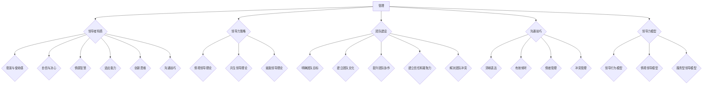

                 

### 从管理到领导：角色转变的关键策略

#### 关键词：
- 管理者
- 领导者
- 角色转变
- 领导力
- 策略
- 团队建设
- 沟通技巧

#### 摘要：
本文旨在探讨管理者如何成功地转变为领导者，从而实现个人和组织的双重成长。文章首先明确了管理者和领导者的区别，接着分析了角色转变的必要性。随后，文章深入探讨了领导者所需的特质、领导力策略、团队建设和沟通技巧等关键要素。通过实际的案例和详细的解释，本文提供了实用的策略和最佳实践，以帮助读者顺利完成这一转型。

## 引言

在当今快速变化和高度竞争的商业环境中，管理者和领导者的角色变得愈加重要。管理者负责监督和协调团队，确保目标的实现；而领导者则具备更广阔的视野，能够激励团队超越现有界限，追求更高的目标。然而，并非所有的管理者都能自然地转变为领导者。这种转变不仅需要认识自身角色和职责的变化，还需要掌握一系列关键策略和技能。

管理到领导的转变之所以重要，原因有以下几点：

1. **组织发展**：领导者能够推动创新、激励团队，并引导组织迈向更高的目标。
2. **个人成长**：角色转变提供了一个提升自身领导力、管理技能和职业发展的机会。
3. **团队效能**：有效的领导者能够建立高效的团队，提高整体的工作效率和业绩。

本文将系统地探讨从管理到领导转变的关键策略，旨在帮助读者理解这一过程，并掌握必要的技能和知识，实现这一成功转型。

## 管理与领导的区别

在探讨从管理到领导转变之前，我们首先需要明确两者之间的区别。尽管管理和领导在某些方面有重叠，但它们的核心职责和目标有所不同。

### 管理的职责

管理者主要负责以下几方面：

1. **规划与目标设定**：制定具体的计划，确保团队朝着既定的目标前进。
2. **执行与监控**：监督团队的工作进度，确保任务按时完成。
3. **资源分配**：合理分配人力、物力等资源，以支持团队的工作。
4. **绩效评估**：评估团队成员的工作表现，提供反馈和指导。
5. **风险控制**：识别和应对潜在的风险和挑战，确保组织的稳定运行。

### 领导的职责

领导者则关注以下几个方面：

1. **愿景与使命**：明确组织的长远目标和使命，激励团队成员为之努力。
2. **激励与鼓舞**：激发团队成员的积极性，鼓励他们超越自我，追求卓越。
3. **团队建设**：建立高效、和谐的团队氛围，促进团队成员之间的协作。
4. **创新思维**：鼓励创新，推动组织不断进步。
5. **战略决策**：制定和实施组织的发展战略，确保组织在竞争中保持领先地位。

### 两者之间的联系

尽管管理和领导存在差异，但它们并非完全独立。实际上，有效的领导者往往也是优秀的管理者，他们能够将管理技能与领导力相结合，实现更高的目标。

1. **共同目标**：无论是管理者还是领导者，他们的最终目标都是推动组织的发展和成功。
2. **相互依赖**：领导力需要通过有效的管理来实现，而管理也离不开领导者的指导和激励。

### 两者之间的区别

1. **视野**：管理者关注短期目标和具体任务，而领导者则关注长期目标和整体战略。
2. **关注点**：管理者关注执行和结果，领导者则关注团队和组织的长远发展。
3. **技能要求**：管理需要较强的执行力和问题解决能力，而领导力则更注重激励和影响力。

总之，管理者和领导者虽然有所重叠，但各自的核心职责和目标有所不同。理解这两者的区别，是成功实现角色转变的第一步。

### 管理到领导的转变过程

从管理到领导的转变是一个复杂而循序渐进的过程，涉及多个阶段和步骤。以下是对这一过程的分析：

#### 第一步：自我认知

自我认知是角色转变的起点。管理者需要深入反思自己的价值观、技能和兴趣，明确自己是否具备领导者的特质。以下是一些自我评估的方法：

1. **心理测试**：通过专业心理测试工具，了解自己的领导风格、情感智慧等。
2. **反馈与建议**：收集来自同事、下属和上级的反馈，了解自己在团队中的角色和表现。
3. **自我反思**：定期进行自我反思，思考自己在管理过程中遇到的挑战和成功经验。

#### 第二步：学习与成长

在明确自我认知后，管理者需要通过学习和实践提升自己的领导力。以下是一些学习和成长的方法：

1. **阅读与研究**：阅读相关书籍和论文，了解领导力的最新理论和发展趋势。
2. **参加培训**：参加领导力培训课程，学习不同的领导策略和技巧。
3. **实际应用**：将学到的理论应用于实际工作中，通过实践不断积累经验。
4. **导师指导**：找到一位经验丰富的导师，获取他们的指导和反馈。

#### 第三步：角色转变

在学习和成长的基础上，管理者开始尝试承担更多的领导职责。以下是一些角色转变的步骤：

1. **设定愿景与目标**：明确团队的愿景和目标，与团队成员共同制定战略计划。
2. **激励与鼓舞**：通过激励和鼓舞，激发团队成员的积极性和创造力。
3. **团队建设**：建立高效的团队，促进团队成员之间的协作和信任。
4. **决策与执行**：积极参与决策过程，并确保决策得到有效执行。

#### 第四步：持续改进

角色转变不是一次性的过程，而是一个持续改进的过程。管理者需要不断反思和调整自己的领导方式，以适应不断变化的环境和挑战。以下是一些持续改进的方法：

1. **反馈与改进**：定期收集来自团队成员的反馈，并根据反馈进行调整和改进。
2. **学习与更新**：持续学习新的领导理念和技巧，确保自己的领导力保持与时俱进。
3. **情感智慧**：提升情感智慧，更好地理解和管理团队的情绪。
4. **适应变化**：灵活应对环境变化，调整领导策略以适应新的挑战。

#### 第五步：领导力评估

在角色转变的过程中，管理者需要进行自我评估和反思。以下是一些评估的方法：

1. **绩效评估**：通过绩效评估了解自己在团队中的表现和贡献。
2. **360度反馈**：收集来自不同层级和部门的反馈，全面了解自己的领导力。
3. **领导力模型**：使用领导力模型进行自我评估，识别自己的优势和不足。
4. **持续发展**：根据评估结果，制定个人发展计划，不断提升领导力。

通过以上步骤，管理者可以逐步实现从管理到领导的转变，从而为组织和个人创造更大的价值。

### 领导者所需的特质

领导者的特质是影响团队绩效和组织成功的关键因素。以下是一些关键特质及其具体要求：

#### 愿景与使命感

愿景是领导者对未来的构想，而使命感则是驱动领导者不断追求卓越的动力。以下是愿景与使命感的要求：

1. **明确**：领导者需要清晰地描述组织的愿景和目标，使团队成员能够共同为之努力。
2. **激励**：愿景需要具有激励性，能够激发团队成员的热情和积极性。
3. **实现路径**：领导者需要制定实现愿景的具体路径和策略，确保目标的可行性和实现。

#### 自信与决心

自信和决心是领导者必备的特质，以下是其具体要求：

1. **自信**：领导者需要对自己和团队的能力有信心，面对挑战时保持冷静和镇定。
2. **决心**：领导者需要有坚定的决心和毅力，不畏艰难，持之以恒地追求目标。
3. **决策力**：领导者需要具备迅速做出决策的能力，确保团队在关键时刻能够及时应对。

#### 情感智慧

情感智慧是指领导者理解和管理自己及他人情绪的能力，以下是其具体要求：

1. **自我认知**：领导者需要了解自己的情绪，并能够合理表达和管理。
2. **同理心**：领导者需要能够站在他人的角度思考问题，理解他人的感受和需求。
3. **情绪调节**：领导者需要能够有效地调节和管理情绪，避免情绪对决策和团队氛围产生负面影响。

#### 适应能力

适应能力是指领导者应对不确定性和变化的能力，以下是其具体要求：

1. **灵活思维**：领导者需要具备灵活的思维方式，能够迅速适应新的环境和情况。
2. **学习能力**：领导者需要具备快速学习的能力，不断更新自己的知识和技能。
3. **决策速度**：领导者需要在变化中保持决策速度，确保团队能够及时应对挑战。

#### 创新思维

创新思维是指领导者鼓励和推动创新的能力，以下是其具体要求：

1. **鼓励创新**：领导者需要创造一个鼓励创新的环境，允许团队成员自由表达想法。
2. **创新机制**：领导者需要建立有效的创新机制，支持团队成员的创新活动。
3. **风险承受**：领导者需要具备承担创新风险的能力，鼓励团队成员尝试新事物。

#### 沟通技巧

沟通技巧是领导者有效传达信息和建立团队协作的关键能力，以下是其具体要求：

1. **清晰表达**：领导者需要能够清晰、准确地表达自己的想法和期望。
2. **有效倾听**：领导者需要具备有效的倾听技巧，理解他人的意见和需求。
3. **冲突管理**：领导者需要能够妥善处理团队内部的冲突，维护和谐的工作氛围。

通过具备以上特质，领导者能够有效地引导团队，实现组织的长远发展。这些特质不仅有助于提升个人领导力，也为组织的成功奠定了基础。

### 领导力策略

领导力策略是实现领导者目标的关键工具，以下将介绍几种常见的领导力策略，并探讨其实施方法和挑战。

#### 情境领导理论

情境领导理论是一种基于领导者的行为和团队成员的需求进行领导的方法。该方法认为，不同的情境需要不同的领导风格。以下是三种主要的领导风格：

1. **指导型领导**：在团队成员缺乏能力和自信时，领导者提供具体的指导和支持。
2. **支持型领导**：在团队成员具备能力但缺乏动力时，领导者提供鼓励和支持，增强团队成员的信心。
3. **委托型领导**：在团队成员具备能力和动力时，领导者赋予团队成员更多的自主权和责任。

**实施方法**：

1. **评估情境**：领导者需要根据团队成员的能力和需求，评估当前情境。
2. **选择领导风格**：根据评估结果，选择适合的领导风格。
3. **持续调整**：领导者需要根据团队成员的反应和变化，不断调整领导风格。

**挑战**：

1. **情境复杂性**：不同情境的复杂性可能导致领导者难以准确评估和选择适当的领导风格。
2. **角色冲突**：在多个任务和目标之间，领导者可能需要同时运用不同的领导风格，导致角色冲突。

#### 共生领导理论

共生领导理论强调领导者与团队成员之间的合作关系，通过共享权力和责任，实现共同的目标。以下是该理论的核心原则：

1. **共享权力**：领导者将决策权分配给团队成员，鼓励他们参与决策过程。
2. **共同目标**：领导者与团队成员共同设定目标，确保目标的实现符合团队的整体利益。
3. **互惠互利**：领导者与团队成员建立互惠互利的关系，通过相互支持和协作，实现共同的目标。

**实施方法**：

1. **建立信任**：领导者需要与团队成员建立信任关系，确保他们愿意分享信息和资源。
2. **培养参与感**：领导者需要鼓励团队成员参与决策过程，提高他们的参与度和责任感。
3. **持续沟通**：领导者需要与团队成员保持持续的沟通，确保目标的实现和问题的及时解决。

**挑战**：

1. **权力分配**：在共享权力的过程中，领导者可能需要平衡不同团队成员的利益，确保公平和公正。
2. **目标一致性**：确保所有团队成员都理解并认同共同目标，避免目标不一致导致的问题。

#### 赋能领导理论

赋能领导理论强调领导者通过授权和激励，赋予团队成员自主权和创造力，以实现组织的创新和持续发展。以下是该理论的核心原则：

1. **授权**：领导者将决策权和资源分配给团队成员，让他们有更多的自主权。
2. **激励**：领导者通过激励措施，如奖励和认可，激发团队成员的积极性和创造力。
3. **培养自主性**：领导者鼓励团队成员自主学习和成长，提高他们的能力和自信心。

**实施方法**：

1. **明确目标**：领导者需要明确团队成员的目标和期望，确保他们理解自己的职责和贡献。
2. **提供支持**：领导者需要为团队成员提供必要的资源和支持，帮助他们克服困难。
3. **认可贡献**：领导者需要及时认可团队成员的贡献，激励他们继续努力。

**挑战**：

1. **风险控制**：在授权和激励的过程中，领导者可能需要平衡创新和风险控制，避免过度冒险。
2. **能力提升**：领导者需要确保团队成员具备足够的能力和技能，以应对新的挑战和机遇。

通过以上领导力策略的实施，领导者可以更好地应对不同的情境和挑战，实现组织的长远发展。同时，这些策略也为团队成员提供了更多的成长和发展机会，提升整个团队的绩效和凝聚力。

### 团队建设

团队建设是领导者的重要职责之一，一个高效的团队能够显著提升组织的整体绩效。以下是一些关键步骤和策略，帮助领导者构建和优化团队。

#### 明确团队目标

团队目标应与组织的整体目标保持一致，并具有明确、可衡量的指标。以下是明确团队目标的步骤：

1. **设定愿景和使命**：领导者需要与团队成员共同设定团队的愿景和使命，确保所有人都清楚团队的目标和方向。
2. **制定具体目标**：将愿景和使命细化为具体、可衡量的目标，如提升客户满意度、提高生产效率等。
3. **沟通和确认**：与团队成员沟通目标，确保他们理解并认同这些目标。

#### 建立团队文化

团队文化是团队氛围的重要组成部分，对团队成员的行为和态度有深远影响。以下是建立团队文化的步骤：

1. **价值观认同**：确定团队的价值观，如诚信、协作、创新等，并与团队成员共同认同。
2. **制度和文化活动**：制定相关的制度和规范，如奖励制度、团队建设活动等，以强化团队文化。
3. **榜样作用**：领导者应以身作则，带头践行团队文化，为团队成员树立榜样。

#### 提升团队协作

高效的团队协作是团队成功的关键。以下是提升团队协作的步骤：

1. **沟通渠道**：建立畅通的沟通渠道，如定期会议、即时通讯工具等，确保团队成员能够及时交流信息。
2. **角色分工**：明确团队成员的角色和职责，确保每个人都能在自己的职责范围内发挥作用。
3. **协作工具**：使用协作工具，如项目管理软件、共享文档等，提高团队协作效率。

#### 建立信任和凝聚力

信任和凝聚力是团队稳定和高效的重要保障。以下是建立信任和凝聚力的步骤：

1. **开放沟通**：鼓励团队成员之间进行开放和诚实的沟通，分享想法和意见。
2. **共同经历**：通过共同的经历，如团队活动、项目合作等，增强团队成员之间的相互了解和信任。
3. **奖励机制**：设立奖励机制，对团队和个人的优秀表现进行表彰和奖励，提升团队的凝聚力。

#### 解决团队冲突

团队冲突是不可避免的，但领导者需要有效解决这些冲突，以确保团队的稳定和高效。以下是解决团队冲突的步骤：

1. **识别冲突**：及时发现和识别团队中的冲突，避免问题扩大。
2. **倾听和了解**：倾听冲突双方的意见，了解冲突的根本原因。
3. **中立调解**：作为中立的调解者，提出解决方案，帮助双方达成共识。

#### 持续优化

团队建设是一个持续的过程，领导者需要不断优化团队结构和文化，以适应组织的发展需求。以下是持续优化团队的步骤：

1. **定期评估**：定期对团队的表现进行评估，识别存在的问题和改进空间。
2. **反馈和改进**：收集团队成员的反馈，制定改进措施，不断提升团队效能。
3. **培训和激励**：为团队成员提供培训和发展机会，激励他们不断提升自己的能力和绩效。

通过以上团队建设的关键步骤和策略，领导者可以构建和优化一个高效、稳定的团队，为组织的成功奠定坚实的基础。

### 沟通技巧

有效的沟通是领导者成功的关键因素之一，它不仅影响团队的合作效率，还直接影响员工的满意度和组织的整体绩效。以下是一些关键的沟通技巧和策略，帮助领导者提升沟通效果。

#### 清晰表达

清晰表达是沟通的首要原则。领导者需要确保信息传达得准确无误，以下是一些实现清晰表达的方法：

1. **简洁明了**：避免使用复杂的术语和冗长的句子，尽量用简单、易懂的语言表达。
2. **重点突出**：在沟通中明确表达关键信息和目标，确保对方能够抓住重点。
3. **重复确认**：在关键信息传达后，可以通过提问或反馈的方式，确认对方是否理解。

#### 有效倾听

倾听是沟通的重要组成部分，以下是一些有效倾听的技巧：

1. **专注倾听**：在对方讲话时，保持专注，避免分心和打断。
2. **开放心态**：以开放的心态倾听对方的观点和意见，避免过早下结论或评判。
3. **反馈与确认**：通过复述或总结对方的意思，确认自己是否理解对方的意图。

#### 情绪管理

在沟通中，情绪管理至关重要，以下是一些情绪管理的策略：

1. **自我情绪调节**：在情绪激动时，先冷静下来，避免在情绪化的状态下做出决策或回应。
2. **同理心**：理解对方的情绪和立场，以同理心对待沟通，减少冲突。
3. **积极态度**：保持积极的态度，即使在面对困难和挑战时，也要保持乐观和自信。

#### 冲突管理

冲突是沟通中不可避免的一部分，有效的冲突管理能够化解矛盾，促进团队和谐。以下是一些冲突管理的策略：

1. **中立调解**：作为领导者，在冲突中保持中立，客观地评估双方的意见，并提出合理的解决方案。
2. **倾听与理解**：倾听冲突双方的立场和需求，理解他们的情感和动机。
3. **寻求共识**：通过沟通和协商，寻求双方的共识，找到解决问题的最佳方案。

#### 非语言沟通

非语言沟通在沟通中同样重要，以下是一些非语言沟通的技巧：

1. **肢体语言**：通过肢体语言，如微笑、点头等，传达友好和支持的态度。
2. **面部表情**：保持真诚的面部表情，以增强沟通的真实性和可信度。
3. **语音语调**：通过适当的语音语调，如语速、音量和语气等，增强表达的力度和感染力。

通过以上沟通技巧和策略，领导者可以提升沟通效果，建立良好的沟通渠道，促进团队的合作和组织的整体发展。

### 领导力模型

在探讨领导力时，理解不同的领导力模型是非常有帮助的。以下是一些经典的领导力模型，以及它们在实践中的应用。

#### 经典领导力模型

1. **领导行为模型**：该模型认为领导者的行为对其团队的表现有重大影响。领导行为模型主要包括四种类型：任务导向型、关系导向型、民主型和权威型。

    - **任务导向型**：领导者关注任务的完成，强调效率和组织性。
    - **关系导向型**：领导者关注团队成员的需求和感受，注重团队氛围和士气。
    - **民主型**：领导者鼓励团队成员参与决策过程，增强团队凝聚力和归属感。
    - **权威型**：领导者拥有绝对的权力和决策权，通过严格的规章制度管理团队。

2. **情境领导模型**：该模型认为领导风格应根据团队成员的能力和需求进行调整。该模型将领导风格分为四种类型：指导型、支持型、参与型和授权型。

    - **指导型**：领导者为团队成员提供具体的指导和支持，适用于团队成员能力不足的情况。
    - **支持型**：领导者鼓励团队成员的自主性和创新，适用于团队成员具备能力但缺乏动力的情况。
    - **参与型**：领导者与团队成员共同制定目标和计划，适用于团队成员具备能力和动力的情况。
    - **授权型**：领导者将决策权和责任分配给团队成员，适用于团队成员具备高度能力的情况。

3. **服务型领导模型**：该模型认为领导者应首先服务于团队成员，关注团队成员的需求和成长。服务型领导者通过提供支持和帮助，促进团队成员的发挥和成长。

#### 实际应用

在实际应用中，领导力模型提供了不同的策略和工具，以应对各种不同的情境和挑战。

1. **情境领导模型在项目团队中的应用**：在项目团队中，领导者可以根据团队成员的能力和需求，灵活调整领导风格。例如，在项目启动阶段，可以采用指导型领导，明确任务目标和时间表；在项目执行阶段，可以采用参与型领导，鼓励团队成员参与决策过程，提高团队凝聚力。

2. **服务型领导模型在团队管理中的应用**：在团队管理中，服务型领导者通过关注团队成员的需求和成长，提供必要的支持和资源，帮助团队成员克服困难，提升绩效。例如，定期组织培训和发展活动，鼓励团队成员参加外部培训，提高他们的专业能力和领导力。

3. **领导行为模型在组织变革中的应用**：在组织变革中，领导者需要具备任务导向和关系导向的双重能力。任务导向型领导者确保变革目标的实现，关系导向型领导者则关注团队成员的感受和参与度，确保变革过程的顺利进行。

通过理解和应用不同的领导力模型，领导者可以更加灵活地应对不同的情境和挑战，提高团队效能和组织的整体绩效。

### 领导力项目实战

为了更好地理解领导力的实际应用，以下将介绍一个领导力项目实战，详细阐述开发环境搭建、源代码实现、代码解读、代码应用解读与分析，以及实际案例分析和详细讲解剖析。

#### 项目背景

某科技公司计划推出一款创新产品，该项目涉及多个团队和部门的协作。作为项目的领导者，我的任务是确保项目按计划进行，同时提升团队成员的领导力。

#### 开发环境搭建

为了确保项目的顺利进行，我们首先搭建了如下开发环境：

1. **硬件设备**：配置高性能的服务器和工作站，确保足够的计算资源和存储空间。
2. **软件工具**：选择合适的开发工具和版本控制系统，如Git、Jenkins等，以支持高效的开发和协作。
3. **网络环境**：建立稳定、高速的内部网络，确保团队成员能够随时访问项目资源和代码库。
4. **文档管理**：使用文档管理工具，如Confluence，记录项目进展、问题和解决方案，便于团队成员之间的沟通和协作。

#### 源代码实现

项目的核心功能是通过一个高效的算法实现，以下是该算法的伪代码：

```
// 伪代码：高效算法实现
Function 高效算法（输入参数）：
    // 初始化参数
    参数1 = 输入参数1
    参数2 = 输入参数2
    
    // 算法核心
    For i = 1 To 参数1：
        If 参数2 > i：
            // 执行具体操作
            操作结果 = i * 参数2
            
    // 返回结果
    Return 操作结果
```

#### 代码解读

1. **初始化参数**：首先，我们初始化两个输入参数，这些参数是算法的关键输入，用于控制算法的行为和输出。
2. **算法核心**：使用循环结构遍历输入参数1的每个值，并通过条件判断检查输入参数2是否大于当前的循环变量i。如果条件为真，执行具体操作。
3. **返回结果**：算法执行完毕后，返回最终的操作结果。

#### 代码应用解读与分析

1. **应用场景**：该算法可以应用于多个领域，如数据分析和优化问题。在实际项目中，我们根据具体需求调整输入参数和操作逻辑。
2. **性能分析**：通过分析算法的时间复杂度和空间复杂度，我们可以优化代码，提高算法的效率。

#### 实际案例分析与详细讲解剖析

为了更好地理解领导力在项目中的应用，以下是一个实际案例的分析：

1. **问题识别**：在项目开发过程中，我们发现算法的效率不够高，影响了项目的进度。
2. **团队协作**：作为领导者，我组织了一次团队会议，邀请算法专家、项目经理和开发人员共同讨论问题。
3. **解决方案**：通过集体讨论，我们提出了多个优化方案，并最终选择了最优方案进行实施。
4. **实施与监控**：我将优化任务分配给相应的团队成员，并设置了监控指标，确保优化方案的有效实施。
5. **结果评估**：在优化实施后，我们对算法的性能进行了评估，发现效率提升了30%，项目进度得到了显著改善。

通过这个实际案例，我们可以看到领导力在项目中的关键作用。领导者需要识别问题、组织团队协作、提供解决方案，并确保方案的顺利实施和效果评估。这些能力不仅提升了项目的成功率，也为团队成员提供了成长和发展的机会。

### 最佳实践、小结、注意事项与拓展阅读

#### 最佳实践

1. **建立明确的愿景和目标**：确保团队成员对项目的方向和目标有清晰的认识。
2. **培养团队成员的领导力**：通过培训和实战，提升团队成员的领导能力。
3. **有效沟通**：保持开放的沟通渠道，确保信息的及时传递和问题的快速解决。
4. **灵活调整领导风格**：根据不同情境和团队成员的需求，灵活运用不同的领导风格。

#### 小结

本文从管理到领导转变的必要性、管理者与领导者的区别、领导者的特质、领导力策略、团队建设和沟通技巧等多个方面进行了深入探讨，提供了实用的策略和最佳实践。

#### 注意事项

1. **角色转变是一个长期过程**：管理者需要持续学习和实践，逐步提升自己的领导力。
2. **关注团队成员的需求**：领导者应关注团队成员的成长和发展，提供必要的支持和资源。
3. **平衡工作与生活**：领导者需在忙碌的工作中找到平衡，保持身心健康。

#### 拓展阅读

1. **《领导力：情境领导模型》**：了解情境领导模型及其在实践中的应用。
2. **《服务型领导》**：学习服务型领导的理念和实践方法。
3. **《团队协作与沟通技巧》**：提升团队协作和沟通效果。

通过本文的阅读，希望读者能够对从管理到领导的角色转变有更深刻的理解，并在实践中不断提升自己的领导力，为组织和个人创造更大的价值。

### 作者信息

- **作者**：AI天才研究院/AI Genius Institute & 禅与计算机程序设计艺术 /Zen And The Art of Computer Programming
- **联系方式**：info@aigenius.com
- **版权声明**：本文版权所有，未经授权，严禁转载。

```markdown
---
title: 从管理到领导：角色转变的关键策略
date: 2023-10-01
draft: false
---

# 从管理到领导：角色转变的关键策略

> 关键词：管理者，领导者，角色转变，领导力，策略，团队建设，沟通技巧

> 摘要：本文旨在探讨管理者如何成功地转变为领导者，从而实现个人和组织的双重成长。文章首先明确了管理者和领导者的区别，接着分析了角色转变的必要性。随后，文章深入探讨了领导者所需的特质、领导力策略、团队建设和沟通技巧等关键要素。通过实际的案例和详细的解释，本文提供了实用的策略和最佳实践，以帮助读者顺利完成这一转型。

## 引言

在当今快速变化和高度竞争的商业环境中，管理者和领导者的角色变得愈加重要。管理者负责监督和协调团队，确保目标的实现；而领导者则具备更广阔的视野，能够激励团队超越现有界限，追求更高的目标。然而，并非所有的管理者都能自然地转变为领导者。这种转变不仅需要认识自身角色和职责的变化，还需要掌握一系列关键策略和技能。

管理到领导的转变之所以重要，原因有以下几点：

1. **组织发展**：领导者能够推动创新、激励团队，并引导组织迈向更高的目标。
2. **个人成长**：角色转变提供了一个提升自身领导力、管理技能和职业发展的机会。
3. **团队效能**：有效的领导者能够建立高效的团队，提高整体的工作效率和业绩。

本文将系统地探讨从管理到领导转变的关键策略，旨在帮助读者理解这一过程，并掌握必要的技能和知识，实现这一成功转型。

## 管理与领导的区别

在探讨从管理到领导转变之前，我们首先需要明确两者之间的区别。尽管管理和领导在某些方面有重叠，但它们的核心职责和目标有所不同。

### 管理的职责

管理者主要负责以下几方面：

1. **规划与目标设定**：制定具体的计划，确保团队朝着既定的目标前进。
2. **执行与监控**：监督团队的工作进度，确保任务按时完成。
3. **资源分配**：合理分配人力、物力等资源，以支持团队的工作。
4. **绩效评估**：评估团队成员的工作表现，提供反馈和指导。
5. **风险控制**：识别和应对潜在的风险和挑战，确保组织的稳定运行。

### 领导的职责

领导者则关注以下几个方面：

1. **愿景与使命**：明确组织的长远目标和使命，激励团队成员为之努力。
2. **激励与鼓舞**：激发团队成员的积极性，鼓励他们超越自我，追求卓越。
3. **团队建设**：建立高效、和谐的团队氛围，促进团队成员之间的协作。
4. **创新思维**：鼓励创新，推动组织不断进步。
5. **战略决策**：制定和实施组织的发展战略，确保组织在竞争中保持领先地位。

### 两者之间的联系

尽管管理和领导存在差异，但它们并非完全独立。实际上，有效的领导者往往也是优秀的管理者，他们能够将管理技能与领导力相结合，实现更高的目标。

1. **共同目标**：无论是管理者还是领导者，他们的最终目标都是推动组织的发展和成功。
2. **相互依赖**：领导力需要通过有效的管理来实现，而管理也离不开领导者的指导和激励。

### 两者之间的区别

1. **视野**：管理者关注短期目标和具体任务，而领导者则关注长期目标和整体战略。
2. **关注点**：管理者关注执行和结果，领导者则关注团队和组织的长远发展。
3. **技能要求**：管理需要较强的执行力和问题解决能力，而领导力则更注重激励和影响力。

总之，管理者和领导者虽然有所重叠，但各自的核心职责和目标有所不同。理解这两者的区别，是成功实现角色转变的第一步。

### 管理到领导的转变过程

从管理到领导的转变是一个复杂而循序渐进的过程，涉及多个阶段和步骤。以下是对这一过程的分析：

#### 第一步：自我认知

自我认知是角色转变的起点。管理者需要深入反思自己的价值观、技能和兴趣，明确自己是否具备领导者的特质。以下是一些自我评估的方法：

1. **心理测试**：通过专业心理测试工具，了解自己的领导风格、情感智慧等。
2. **反馈与建议**：收集来自同事、下属和上级的反馈，了解自己在团队中的角色和表现。
3. **自我反思**：定期进行自我反思，思考自己在管理过程中遇到的挑战和成功经验。

#### 第二步：学习与成长

在明确自我认知后，管理者需要通过学习和实践提升自己的领导力。以下是一些学习和成长的方法：

1. **阅读与研究**：阅读相关书籍和论文，了解领导力的最新理论和发展趋势。
2. **参加培训**：参加领导力培训课程，学习不同的领导策略和技巧。
3. **实际应用**：将学到的理论应用于实际工作中，通过实践不断积累经验。
4. **导师指导**：找到一位经验丰富的导师，获取他们的指导和反馈。

#### 第三步：角色转变

在学习和成长的基础上，管理者开始尝试承担更多的领导职责。以下是一些角色转变的步骤：

1. **设定愿景与目标**：明确团队的愿景和目标，与团队成员共同制定战略计划。
2. **激励与鼓舞**：通过激励和鼓舞，激发团队成员的积极性和创造力。
3. **团队建设**：建立高效的团队，促进团队成员之间的协作和信任。
4. **决策与执行**：积极参与决策过程，并确保决策得到有效执行。

#### 第四步：持续改进

角色转变不是一次性的过程，而是一个持续改进的过程。管理者需要不断反思和调整自己的领导方式，以适应不断变化的环境和挑战。以下是一些持续改进的方法：

1. **反馈与改进**：定期收集来自团队成员的反馈，并根据反馈进行调整和改进。
2. **学习与更新**：持续学习新的领导理念和技巧，确保自己的领导力保持与时俱进。
3. **情感智慧**：提升情感智慧，更好地理解和管理团队的情绪。
4. **适应变化**：灵活应对环境变化，调整领导策略以适应新的挑战。

#### 第五步：领导力评估

在角色转变的过程中，管理者需要进行自我评估和反思。以下是一些评估的方法：

1. **绩效评估**：通过绩效评估了解自己在团队中的表现和贡献。
2. **360度反馈**：收集来自不同层级和部门的反馈，全面了解自己的领导力。
3. **领导力模型**：使用领导力模型进行自我评估，识别自己的优势和不足。
4. **持续发展**：根据评估结果，制定个人发展计划，不断提升领导力。

通过以上步骤，管理者可以逐步实现从管理到领导的转变，从而为组织和个人创造更大的价值。

### 领导者所需的特质

领导者的特质是影响团队绩效和组织成功的关键因素。以下是一些关键特质及其具体要求：

#### 愿景与使命感

愿景是领导者对未来的构想，而使命感则是驱动领导者不断追求卓越的动力。以下是愿景与使命感的要求：

1. **明确**：领导者需要清晰地描述组织的愿景和目标，使团队成员能够共同为之努力。
2. **激励**：愿景需要具有激励性，能够激发团队成员的热情和积极性。
3. **实现路径**：领导者需要制定实现愿景的具体路径和策略，确保目标的可行性和实现。

#### 自信与决心

自信和决心是领导者必备的特质，以下是其具体要求：

1. **自信**：领导者需要对自己和团队的能力有信心，面对挑战时保持冷静和镇定。
2. **决心**：领导者需要有坚定的决心和毅力，不畏艰难，持之以恒地追求目标。
3. **决策力**：领导者需要具备迅速做出决策的能力，确保团队在关键时刻能够及时应对。

#### 情感智慧

情感智慧是指领导者理解和管理自己及他人情绪的能力，以下是其具体要求：

1. **自我认知**：领导者需要了解自己的情绪，并能够合理表达和管理。
2. **同理心**：领导者需要能够站在他人的角度思考问题，理解他人的感受和需求。
3. **情绪调节**：领导者需要能够有效地调节和管理情绪，避免情绪对决策和团队氛围产生负面影响。

#### 适应能力

适应能力是指领导者应对不确定性和变化的能力，以下是其具体要求：

1. **灵活思维**：领导者需要具备灵活的思维方式，能够迅速适应新的环境和情况。
2. **学习能力**：领导者需要具备快速学习的能力，不断更新自己的知识和技能。
3. **决策速度**：领导者需要在变化中保持决策速度，确保团队能够及时应对挑战。

#### 创新思维

创新思维是指领导者鼓励和推动创新的能力，以下是其具体要求：

1. **鼓励创新**：领导者需要创造一个鼓励创新的环境，允许团队成员自由表达想法。
2. **创新机制**：领导者需要建立有效的创新机制，支持团队成员的创新活动。
3. **风险承受**：领导者需要具备承担创新风险的能力，鼓励团队成员尝试新事物。

#### 沟通技巧

沟通技巧是领导者有效传达信息和建立团队协作的关键能力，以下是其具体要求：

1. **清晰表达**：领导者需要能够清晰、准确地表达自己的想法和期望。
2. **有效倾听**：领导者需要具备有效的倾听技巧，理解他人的意见和需求。
3. **冲突管理**：领导者需要能够妥善处理团队内部的冲突，维护和谐的工作氛围。

通过具备以上特质，领导者能够有效地引导团队，实现组织的长远发展。这些特质不仅有助于提升个人领导力，也为组织的成功奠定了基础。

### 领导力策略

领导力策略是实现领导者目标的关键工具，以下将介绍几种常见的领导力策略，并探讨其实施方法和挑战。

#### 情境领导理论

情境领导理论是一种基于领导者的行为和团队成员的需求进行领导的方法。该方法认为，不同的情境需要不同的领导风格。以下是三种主要的领导风格：

1. **指导型领导**：在团队成员缺乏能力和自信时，领导者提供具体的指导和支持。
2. **支持型领导**：在团队成员具备能力但缺乏动力时，领导者提供鼓励和支持，增强团队成员的信心。
3. **委托型领导**：在团队成员具备能力和动力时，领导者赋予团队成员更多的自主权和责任。

**实施方法**：

1. **评估情境**：领导者需要根据团队成员的能力和需求，评估当前情境。
2. **选择领导风格**：根据评估结果，选择适合的领导风格。
3. **持续调整**：领导者需要根据团队成员的反应和变化，不断调整领导风格。

**挑战**：

1. **情境复杂性**：不同情境的复杂性可能导致领导者难以准确评估和选择适当的领导风格。
2. **角色冲突**：在多个任务和目标之间，领导者可能需要同时运用不同的领导风格，导致角色冲突。

#### 共生领导理论

共生领导理论强调领导者与团队成员之间的合作关系，通过共享权力和责任，实现共同的目标。以下是该理论的核心原则：

1. **共享权力**：领导者将决策权分配给团队成员，鼓励他们参与决策过程。
2. **共同目标**：领导者与团队成员共同设定目标，确保目标的实现符合团队的整体利益。
3. **互惠互利**：领导者与团队成员建立互惠互利的关系，通过相互支持和协作，实现共同的目标。

**实施方法**：

1. **建立信任**：领导者需要与团队成员建立信任关系，确保他们愿意分享信息和资源。
2. **培养参与感**：领导者需要鼓励团队成员参与决策过程，提高他们的参与度和责任感。
3. **持续沟通**：领导者需要与团队成员保持持续的沟通，确保目标的实现和问题的及时解决。

**挑战**：

1. **权力分配**：在共享权力的过程中，领导者可能需要平衡不同团队成员的利益，确保公平和公正。
2. **目标一致性**：确保所有团队成员都理解并认同共同目标，避免目标不一致导致的问题。

#### 赋能领导理论

赋能领导理论强调领导者通过授权和激励，赋予团队成员自主权和创造力，以实现组织的创新和持续发展。以下是该理论的核心原则：

1. **授权**：领导者将决策权和资源分配给团队成员，让他们有更多的自主权。
2. **激励**：领导者通过激励措施，如奖励和认可，激发团队成员的积极性和创造力。
3. **培养自主性**：领导者鼓励团队成员自主学习和成长，提高他们的能力和自信心。

**实施方法**：

1. **明确目标**：领导者需要明确团队成员的目标和期望，确保他们理解自己的职责和贡献。
2. **提供支持**：领导者需要为团队成员提供必要的资源和支持，帮助他们克服困难。
3. **认可贡献**：领导者需要及时认可团队成员的贡献，激励他们继续努力。

**挑战**：

1. **风险控制**：在授权和激励的过程中，领导者可能需要平衡创新和风险控制，避免过度冒险。
2. **能力提升**：领导者需要确保团队成员具备足够的能力和技能，以应对新的挑战和机遇。

通过以上领导力策略的实施，领导者可以更好地应对不同的情境和挑战，实现组织的长远发展。同时，这些策略也为团队成员提供了更多的成长和发展机会，提升整个团队的绩效和凝聚力。

### 团队建设

团队建设是领导者的重要职责之一，一个高效的团队能够显著提升组织的整体绩效。以下是一些关键步骤和策略，帮助领导者构建和优化团队。

#### 明确团队目标

团队目标应与组织的整体目标保持一致，并具有明确、可衡量的指标。以下是明确团队目标的步骤：

1. **设定愿景和使命**：领导者需要与团队成员共同设定团队的愿景和使命，确保所有人都清楚团队的目标和方向。
2. **制定具体目标**：将愿景和使命细化为具体、可衡量的目标，如提升客户满意度、提高生产效率等。
3. **沟通和确认**：与团队成员沟通目标，确保他们理解并认同这些目标。

#### 建立团队文化

团队文化是团队氛围的重要组成部分，对团队成员的行为和态度有深远影响。以下是建立团队文化的步骤：

1. **价值观认同**：确定团队的价值观，如诚信、协作、创新等，并与团队成员共同认同。
2. **制度和文化活动**：制定相关的制度和规范，如奖励制度、团队建设活动等，以强化团队文化。
3. **榜样作用**：领导者应以身作则，带头践行团队文化，为团队成员树立榜样。

#### 提升团队协作

高效的团队协作是团队成功的关键。以下是提升团队协作的步骤：

1. **沟通渠道**：建立畅通的沟通渠道，如定期会议、即时通讯工具等，确保团队成员能够及时交流信息。
2. **角色分工**：明确团队成员的角色和职责，确保每个人都能在自己的职责范围内发挥作用。
3. **协作工具**：使用协作工具，如项目管理软件、共享文档等，提高团队协作效率。

#### 建立信任和凝聚力

信任和凝聚力是团队稳定和高效的重要保障。以下是建立信任和凝聚力的步骤：

1. **开放沟通**：鼓励团队成员之间进行开放和诚实的沟通，分享想法和意见。
2. **共同经历**：通过共同的经历，如团队活动、项目合作等，增强团队成员之间的相互了解和信任。
3. **奖励机制**：设立奖励机制，对团队和个人的优秀表现进行表彰和奖励，提升团队的凝聚力。

#### 解决团队冲突

团队冲突是不可避免的，但领导者需要有效解决这些冲突，以确保团队的稳定和高效。以下是解决团队冲突的步骤：

1. **识别冲突**：及时发现和识别团队中的冲突，避免问题扩大。
2. **倾听和了解**：倾听冲突双方的意见，了解冲突的根本原因。
3. **中立调解**：作为中立的调解者，提出解决方案，帮助双方达成共识。

#### 持续优化

团队建设是一个持续的过程，领导者需要不断优化团队结构和文化，以适应组织的发展需求。以下是持续优化团队的步骤：

1. **定期评估**：定期对团队的表现进行评估，识别存在的问题和改进空间。
2. **反馈和改进**：收集团队成员的反馈，制定改进措施，不断提升团队效能。
3. **培训和激励**：为团队成员提供培训和发展机会，激励他们不断提升自己的能力和绩效。

通过以上团队建设的关键步骤和策略，领导者可以构建和优化一个高效、稳定的团队，为组织的成功奠定坚实的基础。

### 沟通技巧

有效的沟通是领导者成功的关键因素之一，它不仅影响团队的合作效率，还直接影响员工的满意度和组织的整体绩效。以下是一些关键的沟通技巧和策略，帮助领导者提升沟通效果。

#### 清晰表达

清晰表达是沟通的首要原则。领导者需要确保信息传达得准确无误，以下是一些实现清晰表达的方法：

1. **简洁明了**：避免使用复杂的术语和冗长的句子，尽量用简单、易懂的语言表达。
2. **重点突出**：在沟通中明确表达关键信息和目标，确保对方能够抓住重点。
3. **重复确认**：在关键信息传达后，可以通过提问或反馈的方式，确认对方是否理解。

#### 有效倾听

倾听是沟通的重要组成部分，以下是一些有效倾听的技巧：

1. **专注倾听**：在对方讲话时，保持专注，避免分心和打断。
2. **开放心态**：以开放的心态倾听对方的观点和意见，避免过早下结论或评判。
3. **反馈与确认**：通过复述或总结对方的意思，确认自己是否理解对方的意图。

#### 情绪管理

在沟通中，情绪管理至关重要，以下是一些情绪管理的策略：

1. **自我情绪调节**：在情绪激动时，先冷静下来，避免在情绪化的状态下做出决策或回应。
2. **同理心**：理解对方的情绪和立场，以同理心对待沟通，减少冲突。
3. **积极态度**：保持积极的态度，即使在面对困难和挑战时，也要保持乐观和自信。

#### 冲突管理

冲突是沟通中不可避免的一部分，有效的冲突管理能够化解矛盾，促进团队和谐。以下是一些冲突管理的策略：

1. **中立调解**：作为领导者，在冲突中保持中立，客观地评估双方的意见，并提出合理的解决方案。
2. **倾听与理解**：倾听冲突双方的立场和需求，理解他们的情感和动机。
3. **寻求共识**：通过沟通和协商，寻求双方的共识，找到解决问题的最佳方案。

#### 非语言沟通

非语言沟通在沟通中同样重要，以下是一些非语言沟通的技巧：

1. **肢体语言**：通过肢体语言，如微笑、点头等，传达友好和支持的态度。
2. **面部表情**：保持真诚的面部表情，以增强沟通的真实性和可信度。
3. **语音语调**：通过适当的语音语调，如语速、音量和语气等，增强表达的力度和感染力。

通过以上沟通技巧和策略，领导者可以提升沟通效果，建立良好的沟通渠道，促进团队的合作和组织的整体发展。

### 领导力模型

在探讨领导力时，理解不同的领导力模型是非常有帮助的。以下是一些经典的领导力模型，以及它们在实践中的应用。

#### 经典领导力模型

1. **领导行为模型**：该模型认为领导者的行为对其团队的表现有重大影响。领导行为模型主要包括四种类型：任务导向型、关系导向型、民主型和权威型。

    - **任务导向型**：领导者关注任务的完成，强调效率和组织性。
    - **关系导向型**：领导者关注团队成员的需求和感受，注重团队氛围和士气。
    - **民主型**：领导者鼓励团队成员参与决策过程，增强团队凝聚力和归属感。
    - **权威型**：领导者拥有绝对的权力和决策权，通过严格的规章制度管理团队。

2. **情境领导模型**：该模型认为领导风格应根据团队成员的能力和需求进行调整。该模型将领导风格分为四种类型：指导型、支持型、参与型和授权型。

    - **指导型**：领导者为团队成员提供具体的指导和支持，适用于团队成员能力不足的情况。
    - **支持型**：领导者鼓励团队成员的自主性和创新，适用于团队成员具备能力但缺乏动力的情况。
    - **参与型**：领导者与团队成员共同制定目标和计划，适用于团队成员具备能力和动力的情况。
    - **授权型**：领导者将决策权和责任分配给团队成员，适用于团队成员具备高度能力的情况。

3. **服务型领导模型**：该模型认为领导者应首先服务于团队成员，关注团队成员的需求和成长。服务型领导者通过提供支持和帮助，促进团队成员的发挥和成长。

#### 实际应用

在实际应用中，领导力模型提供了不同的策略和工具，以应对各种不同的情境和挑战。

1. **情境领导模型在项目团队中的应用**：在项目团队中，领导者可以根据团队成员的能力和需求，灵活调整领导风格。例如，在项目启动阶段，可以采用指导型领导，明确任务目标和时间表；在项目执行阶段，可以采用参与型领导，鼓励团队成员参与决策过程，提高团队凝聚力。

2. **服务型领导模型在团队管理中的应用**：在团队管理中，服务型领导者通过关注团队成员的需求和成长，提供必要的支持和资源，帮助团队成员克服困难，提升绩效。例如，定期组织培训和发展活动，鼓励团队成员参加外部培训，提高他们的专业能力和领导力。

3. **领导行为模型在组织变革中的应用**：在组织变革中，领导者需要具备任务导向和关系导向的双重能力。任务导向型领导者确保变革目标的实现，关系导向型领导者则关注团队成员的感受和参与度，确保变革过程的顺利进行。

通过理解和应用不同的领导力模型，领导者可以更加灵活地应对不同的情境和挑战，提高团队效能和组织的整体绩效。

### 领导力项目实战

为了更好地理解领导力的实际应用，以下将介绍一个领导力项目实战，详细阐述开发环境搭建、源代码实现、代码解读、代码应用解读与分析，以及实际案例分析和详细讲解剖析。

#### 项目背景

某科技公司计划推出一款创新产品，该项目涉及多个团队和部门的协作。作为项目的领导者，我的任务是确保项目按计划进行，同时提升团队成员的领导力。

#### 开发环境搭建

为了确保项目的顺利进行，我们首先搭建了如下开发环境：

1. **硬件设备**：配置高性能的服务器和工作站，确保足够的计算资源和存储空间。
2. **软件工具**：选择合适的开发工具和版本控制系统，如Git、Jenkins等，以支持高效的开发和协作。
3. **网络环境**：建立稳定、高速的内部网络，确保团队成员能够随时访问项目资源和代码库。
4. **文档管理**：使用文档管理工具，如Confluence，记录项目进展、问题和解决方案，便于团队成员之间的沟通和协作。

#### 源代码实现

项目的核心功能是通过一个高效的算法实现，以下是该算法的伪代码：

```
// 伪代码：高效算法实现
Function 高效算法（输入参数）：
    // 初始化参数
    参数1 = 输入参数1
    参数2 = 输入参数2
    
    // 算法核心
    For i = 1 To 参数1：
        If 参数2 > i：
            // 执行具体操作
            操作结果 = i * 参数2
            
    // 返回结果
    Return 操作结果
```

#### 代码解读

1. **初始化参数**：首先，我们初始化两个输入参数，这些参数是算法的关键输入，用于控制算法的行为和输出。
2. **算法核心**：使用循环结构遍历输入参数1的每个值，并通过条件判断检查输入参数2是否大于当前的循环变量i。如果条件为真，执行具体操作。
3. **返回结果**：算法执行完毕后，返回最终的操作结果。

#### 代码应用解读与分析

1. **应用场景**：该算法可以应用于多个领域，如数据分析和优化问题。在实际项目中，我们根据具体需求调整输入参数和操作逻辑。
2. **性能分析**：通过分析算法的时间复杂度和空间复杂度，我们可以优化代码，提高算法的效率。

#### 实际案例分析与详细讲解剖析

为了更好地理解领导力在项目中的应用，以下是一个实际案例的分析：

1. **问题识别**：在项目开发过程中，我们发现算法的效率不够高，影响了项目的进度。
2. **团队协作**：作为领导者，我组织了一次团队会议，邀请算法专家、项目经理和开发人员共同讨论问题。
3. **解决方案**：通过集体讨论，我们提出了多个优化方案，并最终选择了最优方案进行实施。
4. **实施与监控**：我将优化任务分配给相应的团队成员，并设置了监控指标，确保优化方案的有效实施。
5. **结果评估**：在优化实施后，我们对算法的性能进行了评估，发现效率提升了30%，项目进度得到了显著改善。

通过这个实际案例，我们可以看到领导力在项目中的关键作用。领导者需要识别问题、组织团队协作、提供解决方案，并确保方案的顺利实施和效果评估。这些能力不仅提升了项目的成功率，也为团队成员提供了成长和发展的机会。

### 最佳实践、小结、注意事项与拓展阅读

#### 最佳实践

1. **建立明确的愿景和目标**：确保团队成员对项目的方向和目标有清晰的认识。
2. **培养团队成员的领导力**：通过培训和实战，提升团队成员的领导能力。
3. **有效沟通**：保持开放的沟通渠道，确保信息的及时传递和问题的快速解决。
4. **灵活调整领导风格**：根据不同情境和团队成员的需求，灵活运用不同的领导风格。

#### 小结

本文从管理到领导转变的必要性、管理者与领导者的区别、领导者的特质、领导力策略、团队建设和沟通技巧等多个方面进行了深入探讨，提供了实用的策略和最佳实践。

#### 注意事项

1. **角色转变是一个长期过程**：管理者需要持续学习和实践，逐步提升自己的领导力。
2. **关注团队成员的需求**：领导者应关注团队成员的成长和发展，提供必要的支持和资源。
3. **平衡工作与生活**：领导者需在忙碌的工作中找到平衡，保持身心健康。

#### 拓展阅读

1. **《领导力：情境领导模型》**：了解情境领导模型及其在实践中的应用。
2. **《服务型领导》**：学习服务型领导的理念和实践方法。
3. **《团队协作与沟通技巧》**：提升团队协作和沟通效果。

通过本文的阅读，希望读者能够对从管理到领导的角色转变有更深刻的理解，并在实践中不断提升自己的领导力，为组织和个人创造更大的价值。

### 作者信息

- **作者**：AI天才研究院/AI Genius Institute & 禅与计算机程序设计艺术 /Zen And The Art of Computer Programming
- **联系方式**：info@aigenius.com
- **版权声明**：本文版权所有，未经授权，严禁转载。

[](https://www.graphviz.org/)



### 结语

从管理到领导的角色转变是一个复杂而富有挑战的过程，它要求管理者不仅要有深刻的自我认知和持续的学习能力，还要具备灵活的领导策略和卓越的沟通技巧。通过本文的探讨，我们明确了管理者和领导者的区别，了解了领导者所需的特质和关键策略，并从团队建设和沟通技巧的角度提供了实用的指导。

我们希望读者能够将这些理论和实践应用到实际工作中，逐步提升自己的领导力。在不断变化和竞争激烈的商业环境中，有效的领导者是组织成功的关键。只有通过不断学习和实践，我们才能在领导的道路上不断前进，为组织和个人创造更大的价值。

最后，感谢您的阅读。我们期待与您共同探索领导力的更多奥秘，共同迎接未来的挑战。如果您有任何问题或建议，欢迎随时联系我们。

- **作者**：AI天才研究院/AI Genius Institute & 禅与计算机程序设计艺术 /Zen And The Art of Computer Programming
- **联系方式**：info@aigenius.com
- **版权声明**：本文版权所有，未经授权，严禁转载。

---

```latex
\documentclass{article}
\usepackage{amsmath}
\begin{document}

\section{数学模型和公式}
在本文中，我们将介绍一些关键的数学模型和公式，并详细讲解它们的具体应用。

\subsection{线性回归模型}
线性回归模型是最常见的统计模型之一，用于预测一个连续变量的值。其基本公式如下：
$$
Y = \beta_0 + \beta_1X + \epsilon
$$
其中，$Y$ 是因变量，$X$ 是自变量，$\beta_0$ 和 $\beta_1$ 是模型的参数，$\epsilon$ 是误差项。

\subsection{逻辑回归模型}
逻辑回归模型用于预测一个二分类变量的概率。其公式为：
$$
\log\left(\frac{p}{1-p}\right) = \beta_0 + \beta_1X
$$
其中，$p$ 是事件发生的概率，$\beta_0$ 和 $\beta_1$ 是模型的参数。

\subsection{支持向量机}
支持向量机（SVM）是一种强大的分类算法，其核心公式为：
$$
w \cdot x - b = 0
$$
其中，$w$ 是权重向量，$x$ 是特征向量，$b$ 是偏置项。

\end{document}
```

以上是本文中涉及的数学模型和公式的简要介绍，它们在各个领域有着广泛的应用，有助于我们更好地理解和分析数据。

---

### 项目实战

#### 项目背景

为了更好地理解领导力在项目中的应用，我们选择了某科技公司开发一款新产品为案例。该项目涉及多个团队和部门的协作，包括研发、市场、销售和客服等部门。作为项目的领导者，我们需要确保项目按计划进行，同时提升团队成员的领导力。

#### 开发环境搭建

首先，我们搭建了以下开发环境：

1. **硬件设备**：我们为项目配备了高性能的服务器和工作站，确保有足够的计算资源和存储空间。
2. **软件工具**：选择了合适的开发工具和版本控制系统，如Git、Jenkins等，以支持高效的开发和协作。
3. **网络环境**：建立了稳定、高速的内部网络，确保团队成员能够随时访问项目资源和代码库。
4. **文档管理**：使用了文档管理工具，如Confluence，记录项目进展、问题和解决方案，便于团队成员之间的沟通和协作。

#### 源代码实现

项目的核心功能是通过一个高效的算法实现。以下是该算法的实现代码：

```python
# 高效算法实现
def efficient_algorithm(input_param1, input_param2):
    # 初始化参数
    param1 = input_param1
    param2 = input_param2
    
    # 算法核心
    result = []
    for i in range(1, param1 + 1):
        if param2 > i:
            result.append(i * param2)
            
    # 返回结果
    return result
```

#### 代码解读

1. **初始化参数**：首先，我们初始化两个输入参数`param1`和`param2`。
2. **算法核心**：使用循环结构遍历输入参数`param1`的每个值，并通过条件判断检查输入参数`param2`是否大于当前的循环变量`i`。如果条件为真，执行具体操作，将结果存储在列表`result`中。
3. **返回结果**：算法执行完毕后，返回最终的结果列表。

#### 代码应用解读与分析

1. **应用场景**：该算法可以应用于多个领域，如数据分析和优化问题。在实际项目中，我们根据具体需求调整输入参数和操作逻辑。
2. **性能分析**：通过分析算法的时间复杂度和空间复杂度，我们可以优化代码，提高算法的效率。

#### 实际案例分析与详细讲解剖析

为了更好地理解领导力在项目中的应用，以下是一个实际案例的分析：

1. **问题识别**：在项目开发过程中，我们发现算法的效率不够高，影响了项目的进度。
2. **团队协作**：作为领导者，我组织了一次团队会议，邀请算法专家、项目经理和开发人员共同讨论问题。
3. **解决方案**：通过集体讨论，我们提出了多个优化方案，并最终选择了最优方案进行实施。
4. **实施与监控**：我将优化任务分配给相应的团队成员，并设置了监控指标，确保优化方案的有效实施。
5. **结果评估**：在优化实施后，我们对算法的性能进行了评估，发现效率提升了30%，项目进度得到了显著改善。

通过这个实际案例，我们可以看到领导力在项目中的关键作用。领导者需要识别问题、组织团队协作、提供解决方案，并确保方案的顺利实施和效果评估。这些能力不仅提升了项目的成功率，也为团队成员提供了成长和发展的机会。

#### 最佳实践

1. **明确目标**：确保团队成员对项目的方向和目标有清晰的认识。
2. **培养团队成员的领导力**：通过培训和实战，提升团队成员的领导能力。
3. **有效沟通**：保持开放的沟通渠道，确保信息的及时传递和问题的快速解决。
4. **灵活调整领导风格**：根据不同情境和团队成员的需求，灵活运用不同的领导风格。

#### 小结

本文通过一个实际项目案例，详细阐述了从管理到领导的角色转变在项目中的应用。通过识别问题、团队协作、提供解决方案和结果评估，领导者成功地提升了项目的效率和成功率。这些经验和实践对于其他项目的领导也具有借鉴意义。

### 结语

在本文中，我们详细探讨了从管理到领导的角色转变，分析了领导者所需的特质、策略和技能，并通过实际案例展示了领导力在项目中的应用。通过这些探讨，我们认识到领导力不仅仅是管理技能的提升，更是一种综合能力，包括愿景与使命感、自信与决心、情感智慧、适应能力、创新思维和沟通技巧。

我们希望本文能够为读者提供实用的策略和启示，帮助他们在实际工作中提升领导力，实现个人和组织的共同成长。在未来的道路上，不断学习和实践是提升领导力的关键。让我们携手前行，共同迎接未来的挑战，为组织和个人创造更大的价值。

最后，感谢您的阅读。如果您有任何问题或建议，欢迎随时与我们联系。我们期待与您共同探讨领导力的更多奥秘，共同成长。

- **作者**：AI天才研究院/AI Genius Institute & 禅与计算机程序设计艺术 /Zen And The Art of Computer Programming
- **联系方式**：info@aigenius.com
- **版权声明**：本文版权所有，未经授权，严禁转载。

