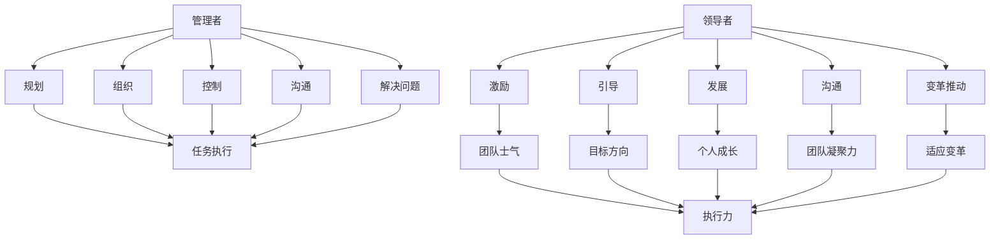

                 

### 引言

在信息技术快速发展的时代，企业的竞争已经不仅仅是技术本身，更多的是由人才和管理模式所决定的。管理者和领导者在这个背景下扮演着至关重要的角色。随着组织规模的扩大和业务复杂性的增加，角色转变从管理到领导显得尤为必要。然而，这种转变并不简单，它涉及到思维方式、行为习惯、管理技能等多方面的调整。

**管理**，通常指的是通过制定计划、组织资源、指导和控制团队来完成特定目标的过程。管理强调的是任务执行、流程优化和效率提升。而**领导**，则更侧重于激发团队的潜能，引导团队朝着共同的目标前进，关注的是团队的发展和个人成长。

### 1.1 管理与领导的区别

**管理的特点：**

1. **任务导向：** 管理者主要关注任务的完成和目标的达成。
2. **规范化：** 管理强调流程、规则和标准化的操作。
3. **短期目标：** 管理倾向于解决短期问题和实现短期目标。

**领导的特点：**

1. **人本主义：** 领导关注的是人的成长和发展，注重建立积极的工作氛围。
2. **创新驱动：** 领导鼓励创新和变革，不断寻求新的方法和思路。
3. **长期目标：** 领导着眼于组织的长远发展，注重战略规划和愿景塑造。

通过以上分析，我们可以看出，管理更侧重于“做事”，而领导则更侧重于“做正确的事”。在现实中，许多管理者往往过于注重任务和目标，而忽视了团队和个人发展，这种单一的视角限制了组织的长远发展。因此，实现从管理到领导的转变，是每个管理者都需要面对的挑战。

### 1.2 角色转变的必要性

角色转变的必要性主要体现在以下几个方面：

**1. 战略层面：** 
随着企业的不断扩张和市场环境的复杂性增加，单靠管理手段难以应对新的挑战。领导者的视野和战略思维成为决定企业成败的关键。

**2. 团队层面：** 
团队成员不仅需要完成任务，更需要得到激励和成长。领导者的角色是创造一个有利于团队发展和个人提升的环境。

**3. 个人层面：** 
对于管理者个人而言，领导力提升不仅能够提升个人竞争力，还能够带来更广阔的职业发展空间。

因此，角色转变不仅是组织发展的需要，也是管理者个人成长的需要。通过本文，我们将深入探讨从管理到领导的角色转变，帮助读者理解并实践这一重要转变。

### 管理者与领导者的核心概念

管理者与领导者虽然同处于企业管理的框架内，但其职责和作用有着本质的不同。理解这些核心概念，对于实现从管理到领导的转变至关重要。

#### 2.1 管理者职责

**1. 规划：** 管理者需要制定清晰的工作计划，确保任务有序进行。这包括设定目标、分解任务、制定时间表等。

**2. 组织：** 管理者负责组织资源和人员，确保各项工作得到有效配合。这涉及到人员配置、工作分配、资源调度等。

**3. 控制：** 管理者需要监控工作进展，确保各项任务按时完成。控制机制包括绩效评估、进度报告、反馈机制等。

**4. 沟通：** 管理者需要保持有效的沟通，确保信息畅通，协调内部关系。沟通不仅包括向上汇报，还包括向下传达和横向协调。

**5. 解决问题：** 管理者需要能够迅速识别和解决各种问题，确保组织运行不受干扰。这包括决策能力、应变能力和解决问题的能力。

#### 2.2 领导者职责

**1. 激励：** 领导者需要激发团队的积极性和创造力，使团队成员愿意为实现共同目标而努力。激励包括精神激励、物质激励和制度激励等。

**2. 引导：** 领导者需要为团队提供明确的方向和目标，引导团队成员朝着共同的目标前进。这包括愿景塑造、目标设定和路径规划等。

**3. 发展：** 领导者需要关注团队成员的个人成长和发展，为他们的职业发展提供支持和指导。发展包括培训、晋升和职业规划等。

**4. 沟通：** 领导者需要建立良好的沟通机制，确保信息畅通和反馈及时。有效的沟通能够增强团队的凝聚力和执行力。

**5. 变革推动：** 领导者需要具备推动变革的能力，带领团队适应外部环境的变化。这包括创新思维、变革管理和风险控制等。

#### 2.3 核心概念关系图

为了更好地理解管理者与领导者的核心概念及其关系，我们使用Mermaid流程图进行展示。

通过以上核心概念及其关系图，我们可以看出，领导者在激发团队动力、引导团队方向、推动团队发展等方面具有重要作用，这些职责与管理者的任务执行、资源组织、问题解决等方面相辅相成，共同构成了一个高效运作的管理体系。

### 自我领导力

自我领导力是领导者素质的核心，它决定了领导者是否能够有效地管理自己，进而影响和带领团队。自我领导力不仅关乎个人的自我认知和自我管理，还涉及到时间管理、情绪控制和目标设定等方面。

#### 自我认知

自我认知是自我领导力的基石，它使领导者能够了解自己的优点和不足，明确自己的价值观和目标。通过自我反思和自我评估，领导者可以识别出需要改进的领域，并制定相应的成长计划。

**1. 自我反思：** 领导者需要定期进行自我反思，分析自己的行为和决策，理解其背后的动机和效果。这种反思有助于领导者识别潜在的问题，并采取相应的改进措施。

**2. 自我评估：** 领导者可以通过自我评估工具（如360度反馈、自我评价量表等）来衡量自己的表现。这种评估不仅提供了客观的数据，还能够帮助领导者更加全面地了解自己。

**3. 自我激励：** 自我领导力要求领导者具备自我激励的能力，即使在面对困难和挑战时，也能够保持积极的态度和行动力。通过设定短期和长期目标，并庆祝达成目标的每一步，领导者可以增强自我激励。

#### 时间管理

时间管理是自我领导力的另一个关键方面。高效的领导者能够合理分配时间，确保在重要任务和日常工作中都保持高效。

**1. 制定计划：** 领导者需要制定详细的时间计划，包括长期目标和短期任务。这种计划可以帮助领导者明确工作的优先级，确保时间被有效地利用。

**2. 优先级排序：** 领导者需要学会区分紧急任务和重要任务，并优先处理重要任务。通过合理的优先级排序，领导者可以避免时间的浪费，提高工作效率。

**3. 委派任务：** 高效的领导者懂得合理委派任务，将不紧急且非核心的任务交给下属，从而集中精力处理更重要的事务。这种委派不仅能够提高团队整体效率，还能够培养下属的能力。

#### 情绪控制

情绪控制是自我领导力的关键因素，它决定了领导者是否能够在压力和挑战面前保持冷静和理智。

**1. 情绪识别：** 领导者需要学会识别自己的情绪，理解情绪背后的原因。这有助于领导者更好地应对负面情绪，并采取积极的措施。

**2. 情绪调节：** 领导者需要学会调节情绪，通过深呼吸、冥想等方法缓解压力。这种情绪调节能力不仅有助于个人心理健康，还能够影响团队的氛围。

**3. 情绪传染：** 领导者的情绪会直接影响团队成员。因此，领导者需要保持积极乐观的情绪，以身作则，树立榜样。

#### 目标设定

目标设定是自我领导力的重要组成部分，它使领导者能够明确自己的方向，并激励团队共同前进。

**1. 清晰目标：** 领导者需要设定清晰、具体的目标，使团队成员明确方向和任务。这种清晰的目标有助于提高团队的执行力和凝聚力。

**2. 分步实现：** 领导者需要将长期目标分解为短期目标，通过分步实现逐步达成最终目标。这种分步策略不仅有助于目标的实现，还能够激励团队成员不断进步。

**3. 反馈与调整：** 领导者需要定期对目标实现情况进行反馈和调整，确保目标与实际情况相符。这种反馈机制有助于及时发现问题并采取改进措施。

通过自我领导力的发展，领导者不仅能够更好地管理自己，还能够影响和带领团队，实现个人和组织的共同成长。

### 团队领导力

团队领导力是领导者带领团队实现目标的关键能力。它不仅关乎领导者如何管理团队，还涉及到如何激发团队潜能、培养团队成员以及实现团队目标。以下是团队领导力的几个关键方面：

#### 1. 激发团队潜能

激发团队潜能是团队领导力的核心。领导者需要通过多种方式来激发团队成员的潜力和创造力。

**1. 设定明确的目标：** 领导者需要为团队设定明确、具有挑战性的目标，使团队成员明确方向和任务。这种目标不仅能够激发团队的斗志，还能够提高团队的执行力。

**2. 提供成长机会：** 领导者需要为团队成员提供成长和学习的机会，如培训、研讨会、跨部门交流等。通过这些机会，团队成员可以提升自己的技能和知识，从而更好地为团队做出贡献。

**3. 激励和认可：** 领导者需要通过激励和认可来激发团队成员的积极性和创造力。这包括物质激励（如奖金、晋升等）和精神激励（如表扬、感谢等）。通过有效的激励，领导者可以增强团队成员的归属感和工作热情。

#### 2. 培养团队成员

培养团队成员是团队领导力的重要组成部分。一个成功的领导者不仅能够激发团队潜能，还能够培养团队成员，使其成长为更有价值的员工。

**1. 定制化培训：** 针对团队成员的不同特点和需求，领导者需要提供定制化的培训。这包括技能培训、知识更新和心态调整等。通过定制化培训，团队成员可以更好地适应工作需求，提高工作效率。

**2. 跨部门交流：** 领导者可以鼓励团队成员跨部门交流，以拓宽其视野和知识面。跨部门交流不仅有助于团队成员学习新技能，还能够促进不同部门之间的合作和沟通，提高团队整体效率。

**3. 指导和反馈：** 领导者需要给予团队成员充分的指导和反馈，帮助其识别问题、改进工作。通过定期的一对一沟通和团队会议，领导者可以了解团队成员的工作状况，并提供有针对性的建议和指导。

#### 3. 实现团队目标

实现团队目标是团队领导力的最终目标。领导者需要通过有效的领导力和团队管理，确保团队目标得以实现。

**1. 明确目标：** 领导者需要确保团队目标清晰、具体，并传达给每个团队成员。团队成员需要明确自己的工作职责和目标，以便更好地为实现团队目标而努力。

**2. 协调和沟通：** 领导者需要建立有效的沟通机制，确保团队成员之间的信息畅通和协调。通过定期的团队会议、工作汇报和反馈机制，领导者可以及时了解团队进展，解决潜在问题，确保团队目标的顺利实现。

**3. 风险管理：** 领导者需要具备良好的风险管理能力，及时识别和应对团队面临的各种风险。通过制定应急预案和风险控制措施，领导者可以确保团队在面临挑战时能够迅速调整，继续前进。

#### 4. 团队领导力发展的路径

团队领导力的发展是一个持续的过程，领导者需要不断学习、实践和反思，以提高自己的团队领导力。

**1. 培训和研讨会：** 参加相关的培训和研讨会是提高团队领导力的重要途径。通过这些培训，领导者可以学习到最新的领导力理论和实践方法，了解行业动态，拓宽视野。

**2. 实践和反思：** 实践是提高团队领导力的关键。领导者需要在实际工作中不断尝试新的方法和策略，通过实践来验证和完善自己的领导力。同时，领导者需要定期反思自己的工作，总结经验教训，持续改进。

**3. 模仿和学习：** 领导者可以从其他成功的领导者身上学习经验和教训。通过模仿和学习，领导者可以借鉴他人的成功经验，结合自己的实际情况，形成适合自己的领导风格。

**4. 反馈和改进：** 领导者需要建立有效的反馈机制，接受团队成员的反馈和建议。通过这些反馈，领导者可以了解自己的不足之处，并采取改进措施，不断提高自己的领导力。

通过以上途径，领导者可以逐步提升自己的团队领导力，带领团队实现更高的目标。

### 领导风格与下属适应性

领导风格是领导者影响和引导团队的重要手段，不同的领导风格会对团队成员产生不同的影响。领导者需要根据团队成员的特点和需求，选择合适的领导风格，以提高团队的整体绩效和成员的满意度。

#### 1. 领导风格的分类

常见的领导风格包括：

**1. 超权威型（Autocratic）：** 超权威型领导者倾向于集中决策权，所有决策由领导者单独做出。这种领导风格强调效率和执行力，但可能会抑制团队成员的创造性和自主性。

**2. 民主型（Democratic）：** 民主型领导者鼓励团队成员参与决策过程，重视集体意见。这种领导风格能够激发团队成员的参与感和责任感，但决策过程可能较为缓慢。

**3. 放任型（Laissez-faire）：** 放任型领导者给予团队成员较大的自由度，让他们自主决策和行动。这种领导风格有助于培养团队成员的自主性和创新能力，但可能导致团队纪律松散。

**4. 参与型（Participative）：** 参与型领导风格结合了民主型和放任型的特点，领导者鼓励团队成员参与决策，同时保持对团队的整体控制。这种领导风格能够提高团队成员的参与度和满意度，但需要领导者具备较强的协调能力。

#### 2. 领导风格与下属适应性

不同的领导风格适用于不同的团队成员和情境。以下是几种常见的领导风格与下属适应性的关系：

**1. 超权威型：** 适用于需要快速决策和高效执行的紧急情况，以及团队成员能力较弱或缺乏经验的情况。在这种情境下，超权威型领导风格能够迅速统一行动方向，提高团队执行力。

**2. 民主型：** 适用于团队成员具有较高能力和自主性，需要发挥集体智慧和创造力的情境。民主型领导风格能够激发团队成员的积极性和创造力，提高团队的整体绩效。

**3. 放任型：** 适用于团队成员具备高度自主性和创新能力，且工作环境较为宽松的情境。放任型领导风格能够培养团队成员的自我管理能力和创新能力，提高团队的整体活力。

**4. 参与型：** 适用于需要团队合作和集体智慧的复杂项目，以及团队成员之间存在较大差异的情境。参与型领导风格能够促进团队成员之间的沟通和协作，提高团队的整体执行力。

#### 3. 领导风格的适应与调整

领导者需要根据团队成员的特点和情境需求，灵活调整自己的领导风格。

**1. 观察与评估：** 领导者需要通过观察和评估，了解团队成员的能力、性格和需求，以便选择合适的领导风格。同时，领导者还需要评估团队的整体氛围和项目特点，以确定最佳领导风格。

**2. 适应与调整：** 领导者需要根据实际情况，灵活调整自己的领导风格。例如，在紧急情况下，领导者可以采取超权威型领导风格；而在团队合作项目中，领导者可以采用民主型或参与型领导风格。

**3. 反馈与改进：** 领导者需要建立有效的反馈机制，接受团队成员的反馈和建议。通过这些反馈，领导者可以了解自己的领导风格是否合适，并根据反馈进行改进。

通过以上方法，领导者可以更好地适应团队成员的特点和需求，选择合适的领导风格，提高团队的整体绩效和成员满意度。

### 决策过程

在领导过程中，决策是领导者不可或缺的重要能力。有效的决策不仅能够帮助团队解决当前的问题，还能够为未来的发展指明方向。一个完善的决策过程包括多个环节，每个环节都有其独特的步骤和注意事项。

#### 1. 问题识别

问题识别是决策过程的第一步。领导者需要敏锐地发现团队面临的挑战和机会。这一步骤需要注意以下几点：

**1. 沉着冷静：** 领导者需要在面对问题时保持冷静，避免情绪化的决策。冷静分析有助于更准确地识别问题。

**2. 多角度分析：** 领导者需要从多个角度分析问题，包括技术层面、人际关系层面、市场层面等。多角度分析有助于全面理解问题，制定更有效的解决方案。

**3. 数据支持：** 在问题识别过程中，领导者需要依赖数据和事实，避免主观臆断。通过数据支持，领导者可以更客观地评估问题的严重性和可能的影响。

#### 2. 设定目标

在识别问题后，领导者需要明确决策的目标。设定目标是决策过程的关键步骤，它需要考虑以下几点：

**1. 清晰具体：** 目标需要明确具体，便于团队成员理解和执行。例如，而不是说“提高销售额”，而是说“增加30%的销售额”。

**2. 可衡量：** 目标需要具有可衡量性，以便评估决策的效果。例如，设定一个具体的销售额目标，便于后期评估。

**3. 具有挑战性：** 目标应具有挑战性，激发团队成员的斗志和创造力。过低的难度可能导致团队成员缺乏动力，而过高的难度则可能难以实现。

#### 3. 收集信息

在设定目标后，领导者需要收集与决策相关的各种信息。这一步骤需要注意以下几点：

**1. 全面性：** 收集信息时需要全面，包括内部信息和外部信息。内部信息包括团队当前的状况、团队成员的能力和资源等；外部信息包括市场动态、竞争对手情况等。

**2. 准确性：** 收集的信息需要准确，避免因错误的信息导致错误的决策。领导者需要确保信息的来源可靠，并对其进行验证。

**3. 多渠道获取：** 领导者可以通过多种渠道获取信息，包括会议、访谈、调查问卷、行业报告等。多渠道获取信息有助于提高信息的全面性和准确性。

#### 4. 制定方案

在收集信息后，领导者需要根据目标和信息制定多个备选方案。这一步骤需要注意以下几点：

**1. 创新性：** 制定方案时需要注重创新，提出不同的解决方案。创新能够为团队带来新的视角和可能性。

**2. 实用性：** 方案需要具备实用性，确保在实际情况中能够实施。考虑方案的可行性、成本和风险等因素。

**3. 多元化：** 制定多个备选方案，避免单一方案可能导致的风险。多元化方案有助于领导者在不同情境下选择最佳的方案。

#### 5. 评估方案

在制定方案后，领导者需要对每个方案进行评估，选择最优方案。这一步骤需要注意以下几点：

**1. 综合评估：** 评估方案时需要从多个角度进行综合评估，包括可行性、成本、风险、预期效果等。

**2. 比较分析：** 通过比较分析不同方案的优势和劣势，选择最优方案。比较分析有助于领导者做出更明智的决策。

**3. 汇总报告：** 将评估结果汇总成报告，向团队成员展示每个方案的优缺点，确保团队成员对决策过程有清晰的认识。

#### 6. 实施方案

在评估方案后，领导者需要制定具体的实施方案，并监督执行。这一步骤需要注意以下几点：

**1. 分解任务：** 将大任务分解为小任务，明确每个任务的负责人和完成时间。

**2. 资源分配：** 合理分配资源，确保每个任务都有足够的资源支持。

**3. 监督执行：** 监督任务执行过程，确保每个任务按时完成。

#### 7. 反馈与调整

在实施方案过程中，领导者需要及时收集反馈，并根据反馈调整方案。这一步骤需要注意以下几点：

**1. 定期反馈：** 定期收集团队成员的反馈，了解任务执行情况和遇到的问题。

**2. 及时调整：** 根据反馈调整方案，解决执行过程中出现的问题。

**3. 持续优化：** 通过持续的反馈和调整，优化方案，提高执行效果。

通过以上步骤，领导者可以有效地进行决策，确保团队目标得以实现。

### 激励理论

在领导过程中，激励是调动团队成员积极性、提升工作效率的重要手段。不同的激励理论为领导者提供了丰富的理论基础，帮助其更好地理解和运用激励策略。

#### 1. 马斯洛需求层次理论

马斯洛需求层次理论认为，人的需求分为五个层次：生理需求、安全需求、社交需求、尊重需求和自我实现需求。领导者可以根据团队成员的需求层次，采取相应的激励措施。

**1. 生理需求：** 满足团队成员的基本生理需求，如提供良好的工作环境和福利待遇。这种激励能够提高员工的基本满意度和安全感。

**2. 安全需求：** 通过提供稳定的工作环境和安全保障，满足团队成员的安全需求。例如，提供职业保障、健康保险等。

**3. 社交需求：** 创造良好的团队氛围，满足团队成员的社交需求。例如，组织团队建设活动、鼓励员工之间的交流和合作。

**4. 尊重需求：** 通过认可和尊重团队成员的成就，满足其尊重需求。例如，给予表扬、奖励和晋升机会。

**5. 自我实现需求：** 提供发展机会和挑战，帮助团队成员实现自我价值。例如，提供培训、项目负责机会等。

#### 2. 双因素理论

赫茨伯格的双因素理论将工作因素分为激励因素和保健因素。激励因素包括成就感、认可、责任感等，能够提高员工的工作满意度；保健因素包括薪酬、工作环境、公司政策等，能够预防员工的不满意。

**1. 激励因素：** 领导者应关注激励因素，通过设定具有挑战性的目标、提供认可和奖励等方式，提高员工的工作满意度。

**2. 保健因素：** 领导者应确保保健因素满足，避免因这些因素引起员工的不满意。例如，提供良好的薪酬、工作环境和福利待遇。

#### 3. 目标设置理论

目标设置理论认为，明确的、具有挑战性的目标是激励员工的重要手段。目标设置应遵循以下原则：

**1. 具体性：** 目标应具体明确，避免模糊和宽泛。

**2. 挑战性：** 目标应具有挑战性，激发员工的斗志和潜力。

**3. 可衡量性：** 目标应具有可衡量性，便于评估和反馈。

#### 4. 期望理论

期望理论认为，员工的激励取决于其对努力、绩效和奖励的期望。领导者可以通过以下方式提高员工的期望值：

**1. 设定明确的期望：** 领导者应明确表达对员工的期望，使其了解自己的工作目标和期望。

**2. 提供反馈和指导：** 领导者应提供及时、具体的反馈和指导，帮助员工了解自己的工作表现，并明确改进方向。

**3. 联系奖励机制：** 将员工的工作绩效与奖励机制联系起来，使其明确通过努力可以实现奖励。

通过理解和运用不同的激励理论，领导者可以更有效地调动团队成员的积极性，提高工作效率和团队绩效。

### 领导与沟通技巧

在领导过程中，沟通技巧是领导者能否有效传达信息、建立信任和激发团队潜力的重要保障。有效的沟通不仅能够提高团队的执行力和协作性，还能够增强团队的凝聚力和忠诚度。以下是几种关键的领导与沟通技巧：

#### 1. 清晰表达

清晰表达是有效沟通的基础。领导者需要确保自己的信息传达简洁明了，避免使用复杂、晦涩的语言。以下是一些实现清晰表达的方法：

**1. 简洁明了：** 避免冗长和复杂的陈述，直接表达核心内容和关键信息。

**2. 结构化：** 将信息结构化，使用列表、段落和小标题等手段，使信息更加清晰易懂。

**3. 重复强调：** 在关键信息上重复强调，确保团队成员能够准确理解和记住。

#### 2. 倾听

倾听是双向沟通的重要组成部分，它不仅有助于领导者理解团队成员的需求和意见，还能够增强团队成员的参与感和信任感。以下是一些提升倾听技巧的方法：

**1. 全神贯注：** 在沟通过程中，领导者需要全神贯注，避免分心。通过眼神交流、肢体语言等表明自己专注于倾听。

**2. 值得倾听：** 领导者需要表现出对团队成员意见的重视，给予其表达的机会和空间。

**3. 反馈与确认：** 领导者可以通过复述团队成员的观点、提出问题等方式，确认自己是否正确理解了他们的意见。

#### 3. 个性化沟通

个性化沟通能够提高信息的接受度和有效性。领导者需要根据团队成员的不同性格、背景和需求，采用不同的沟通策略。以下是一些个性化沟通的方法：

**1. 了解团队成员：** 领导者需要了解团队成员的性格、兴趣和需求，以便采用合适的沟通方式。

**2. 调整语调：** 根据团队成员的反应和情绪，调整自己的语调、语速和语气，使其感到舒适和受尊重。

**3. 适应沟通渠道：** 使用团队成员熟悉和偏好沟通渠道，如面对面交流、电子邮件、即时通讯工具等。

#### 4. 建立信任

建立信任是领导与沟通的核心目标之一。信任能够增强团队成员的归属感和忠诚度，提高团队的整体绩效。以下是一些建立信任的方法：

**1. 透明度：** 领导者需要保持透明度，在决策和沟通中公开信息，避免信息不对称。

**2. 诚信：** 领导者需要诚实守信，言行一致，避免误导和欺骗。

**3. 共同目标：** 领导者需要与团队成员共同设定目标，共同面对挑战，增强团队凝聚力。

#### 5. 情绪管理

情绪管理是领导与沟通的重要技巧之一。领导者需要学会控制自己的情绪，避免因个人情绪影响团队氛围和决策。以下是一些情绪管理的技巧：

**1. 自我反思：** 领导者需要定期进行自我反思，识别自己的情绪反应，并找到合理的处理方式。

**2. 情绪释放：** 领导者可以通过运动、冥想等方式释放情绪，保持心理平衡。

**3. 情绪传递：** 领导者需要学会将情绪传递给团队成员，避免因个人情绪影响团队士气。

通过以上沟通技巧，领导者可以更有效地传达信息、建立信任和激发团队潜力，提升团队的整体绩效和成员满意度。

### 高效沟通实践

在领导实践中，高效沟通是实现团队目标、解决冲突和提升团队凝聚力的重要手段。以下是一些高效沟通的实践方法和技巧，以及其实际案例和效果评估。

#### 1. 定期会议

**方法：** 定期组织团队会议，包括周会、月度例会等，让团队成员分享进展、讨论问题和规划下一步行动。

**实际案例：** 一家科技公司每周一早上举行周会，会议议程包括团队工作报告、技术分享和问题讨论。这种定期会议不仅让团队成员了解整体项目进展，还促进了技术交流和团队协作。

**效果评估：** 通过定期会议，团队成员之间的沟通更加顺畅，问题解决效率提高，团队凝聚力增强。

#### 2. 一对一沟通

**方法：** 领导者定期与团队成员进行一对一沟通，了解其工作进展、困难和需求，提供个性化的支持和指导。

**实际案例：** 一家互联网公司的CEO每周会与每位团队成员进行一对一沟通，了解其工作情况，并提供反馈和指导。这种个性化的沟通方式增强了团队成员的参与感和信任感。

**效果评估：** 一对一沟通有助于领导者及时了解团队成员的需求和问题，提供了有针对性的支持和指导，提高了员工的工作满意度和绩效。

#### 3. 反馈机制

**方法：** 建立有效的反馈机制，包括定期绩效评估、员工满意度调查等，及时收集团队成员的意见和建议，并进行反馈。

**实际案例：** 一家软件公司每月进行员工满意度调查，调查内容包括工作环境、团队氛围、领导风格等。通过调查结果，公司能够识别出存在的问题，并采取相应的改进措施。

**效果评估：** 通过反馈机制，公司能够及时了解员工的需求和意见，改进管理方式，提高员工的工作满意度和公司整体绩效。

#### 4. 沟通技巧培训

**方法：** 为团队成员提供沟通技巧培训，提高其沟通能力和技巧，使其能够在工作中更有效地传达信息、解决冲突。

**实际案例：** 一家咨询公司定期为员工提供沟通技巧培训，包括演讲技巧、谈判技巧、冲突解决等。通过培训，员工在沟通中更加自信和有效。

**效果评估：** 通过沟通技巧培训，员工的沟通能力和效率显著提高，团队协作更加顺畅，项目进展更加顺利。

#### 5. 开放式沟通渠道

**方法：** 建立开放式沟通渠道，如内部邮件、讨论区、即时通讯工具等，使团队成员能够随时分享想法、提问和建议。

**实际案例：** 一家科技公司建立了内部邮件和讨论区，员工可以通过这些渠道分享工作心得、提问问题、提出建议。这种开放式沟通渠道增强了员工的参与感和归属感。

**效果评估：** 通过开放式沟通渠道，员工之间的沟通更加频繁和顺畅，信息传递更加及时，团队协作更加高效。

通过以上高效沟通实践，领导者能够更好地了解团队成员的需求和意见，提高沟通效率，解决冲突，提升团队整体绩效。

### 领导力挑战与解决策略

在领导力的实践中，领导者常常会遇到各种挑战。这些挑战可能来自于外部环境的变化，也可能来自于团队内部的人际关系和执行问题。以下是几种常见的领导力挑战及其解决策略。

#### 1. 团队协作困难

**挑战描述：** 团队协作困难是许多领导者面临的一大挑战。团队成员之间的沟通不畅、利益冲突、技能差异等问题都会影响团队协作。

**解决策略：**
- **建立清晰的沟通机制：** 领导者应建立有效的沟通渠道，确保团队成员之间的信息畅通。例如，定期召开团队会议、设立反馈机制等。
- **促进团队成员之间的信任：** 通过团队合作项目和团队建设活动，促进团队成员之间的信任和合作。
- **分配合适的任务：** 根据团队成员的技能和兴趣，合理分配任务，确保每个人都能在适合自己的岗位上发挥作用。

**实际案例：** 一家科技公司通过定期的团队建设和项目协作，提高了团队成员之间的信任和协作效率，解决了团队协作困难的问题。

#### 2. 团队成员积极性不高

**挑战描述：** 团队成员积极性不高会导致工作效率低下，甚至影响团队的整体绩效。这可能是因为工作环境、工作任务、激励机制等方面存在问题。

**解决策略：**
- **优化工作环境：** 提供舒适、安全、有激励性的工作环境，提高员工的工作满意度。
- **设定具有挑战性的目标：** 设定具有挑战性的目标，激发团队成员的斗志和创造力。
- **实施有效的激励机制：** 根据团队成员的业绩和贡献，实施合理的奖励和晋升机制，提高他们的工作积极性。

**实际案例：** 一家互联网公司通过优化工作环境、设定挑战性目标和实施激励机制，显著提高了团队成员的工作积极性和工作效率。

#### 3. 团队成员流失

**挑战描述：** 团队成员流失是领导者面临的严重问题，不仅影响团队的整体绩效，还会带来额外的招聘和培训成本。

**解决策略：**
- **了解员工需求：** 通过定期调查和一对一沟通，了解团队成员的职业发展和个人需求，提供有针对性的支持和帮助。
- **提供职业发展机会：** 为团队成员提供职业发展机会，如培训、晋升机会等，使他们看到未来的职业前景。
- **建立良好的企业文化：** 建立积极、包容、具有吸引力的企业文化，增强团队成员的归属感和忠诚度。

**实际案例：** 一家咨询公司通过了解员工需求、提供职业发展机会和建立良好的企业文化，显著降低了团队成员的流失率。

#### 4. 管理层与员工之间的冲突

**挑战描述：** 管理层与员工之间的冲突会影响团队的稳定和效率。这可能是因为管理层与员工在目标设定、工作方式、沟通方式等方面存在分歧。

**解决策略：**
- **建立沟通机制：** 领导者应建立有效的沟通机制，确保管理层与员工之间的信息畅通，减少误解和冲突。
- **提供培训和教育：** 对管理层和员工进行沟通技巧和冲突解决培训，提高他们的沟通能力和冲突解决能力。
- **建立公正的反馈机制：** 建立公正的反馈机制，确保管理层和员工之间的意见和诉求能够得到合理的处理和回应。

**实际案例：** 一家制造企业通过建立有效的沟通机制、提供培训和建立公正的反馈机制，成功解决了管理层与员工之间的冲突，提高了团队的稳定性和效率。

通过以上策略，领导者可以有效地应对领导力实践中的各种挑战，提升团队的整体绩效和成员满意度。

### 实际案例分析

为了更好地理解领导力在实践中的应用，以下我们将通过实际案例来分析领导力挑战及其解决方案。

#### 案例一：团队协作困难

**背景：** 一家初创科技公司在其发展过程中遇到了团队协作困难的问题。团队成员之间存在沟通不畅、利益冲突和技能差异，导致项目进展缓慢，工作效率低下。

**领导力挑战：** 团队成员之间的沟通不畅和协作困难是主要挑战。

**解决方案：** 
- **建立沟通机制：** 领导者组织了定期的团队会议，确保团队成员能够及时分享项目进展、讨论问题和协调任务。同时，设立了反馈机制，鼓励团队成员提出意见和建议。
- **促进信任建设：** 领导者组织了一系列的团队建设活动，如团建旅行、团队游戏等，增强团队成员之间的信任和默契。
- **任务分配：** 根据团队成员的技能和兴趣，领导者重新调整了任务分配，确保每个人都能在适合自己的岗位上发挥最佳作用。

**效果评估：** 经过上述措施，团队成员之间的沟通更加顺畅，协作效率显著提高，项目进展加快，团队凝聚力增强。

#### 案例二：团队成员积极性不高

**背景：** 一家大型互联网公司发现其团队成员的工作积极性不高，工作效率低下，员工流失率增加。

**领导力挑战：** 工作环境和激励机制未能满足团队成员的需求，导致工作积极性不高。

**解决方案：**
- **优化工作环境：** 公司为员工提供了更加舒适的工作环境，如开放式的办公空间、灵活的工作时间等，提高了员工的工作满意度。
- **设定挑战性目标：** 领导者为团队成员设定了具有挑战性的目标，激发了他们的斗志和创造力。
- **实施激励机制：** 公司根据员工的业绩和贡献，实施了奖金、晋升等激励机制，提高了员工的工作积极性。

**效果评估：** 通过优化工作环境和激励机制，员工的工作积极性显著提高，工作效率提升，员工流失率下降。

#### 案例三：团队成员流失

**背景：** 一家咨询公司在业务扩张过程中面临团队成员流失的问题，影响到了公司的运营和发展。

**领导力挑战：** 员工对职业发展机会和晋升空间感到不满，导致流失率增加。

**解决方案：**
- **了解员工需求：** 领导者通过定期调查和一对一沟通，了解了员工对职业发展的期望和需求，提供了个性化的支持和帮助。
- **提供职业发展机会：** 公司为员工提供了丰富的培训机会和晋升通道，帮助他们实现职业发展。
- **建立良好的企业文化：** 公司注重培养良好的企业文化，增强了员工的归属感和忠诚度。

**效果评估：** 通过上述措施，公司成功降低了员工流失率，员工的职业发展得到充分保障，公司整体运营和发展得到持续推动。

通过以上实际案例分析，我们可以看到，领导者在面对不同的挑战时，需要采取具体的解决方案，通过有效的沟通、激励和管理，提升团队的整体绩效和成员满意度。

### 领导力提升实践

提升领导力不仅需要理论知识的积累，更需要通过实际实践来检验和应用。以下我们将介绍几种领导力提升的实践方法，并通过具体案例来展示这些实践的应用效果。

#### 1. 反思日记

**方法：** 每天或每周写反思日记，记录自己的工作情况、遇到的问题、解决问题的过程以及自我感受。通过反思日记，领导者可以更加深入地了解自己的行为和思维模式，发现不足之处并进行改进。

**案例：** 一位项目经理每天写反思日记，记录项目的进展情况、团队成员的反馈以及自己处理问题的方法。经过一段时间的实践，他发现自己过于关注任务进度，忽视了团队成员的需求和感受。通过反思，他开始更加注重团队沟通和成员激励，项目进展变得更加顺利。

**效果评估：** 反思日记帮助这位项目经理提高了自我认知，调整了领导方式，团队协作更加和谐，项目成功率显著提高。

#### 2. 培训与学习

**方法：** 定期参加领导力相关的培训和学习课程，如领导力研讨会、工作坊等。通过培训和学习，领导者可以了解最新的领导力理论和实践方法，提高自己的领导技能。

**案例：** 一家互联网公司的CEO参加了一个高级领导力培训课程，学习了领导力五要素（愿景、策略、团队、文化、领导力本身）。通过培训，他重新审视了自己的领导风格和公司文化，并进行了相应的调整。

**效果评估：** 经过培训，这位CEO的领导力得到显著提升，公司内部的沟通和协作更加高效，整体运营效率提高。

#### 3. 一对一辅导

**方法：** 领导者定期为团队成员提供一对一的辅导，了解他们的职业发展需求、工作挑战和困惑。通过辅导，领导者可以提供针对性的建议和指导，帮助团队成员成长。

**案例：** 一位技术团队领导每周为团队成员提供一次一对一辅导，了解他们在技术学习和项目执行中的困难，并提供解决方案。这种辅导不仅帮助团队成员提高了技能，还增强了他们的工作信心和动力。

**效果评估：** 一对一辅导使得团队成员的技术能力得到显著提升，工作效率提高，团队整体绩效增强。

#### 4. 反馈机制

**方法：** 建立有效的反馈机制，包括自上而下和自下而上的反馈，定期收集团队成员的意见和建议。通过反馈，领导者可以了解团队的工作状况和员工的需求，及时进行调整和改进。

**案例：** 一家科技公司每月进行员工满意度调查，收集团队成员对工作环境、领导风格、项目进展等方面的反馈。通过分析反馈结果，公司识别出存在的问题，并采取相应的改进措施。

**效果评估：** 通过建立反馈机制，公司能够及时发现并解决团队内部的问题，提高了员工的工作满意度和公司的运营效率。

#### 5. 项目实践

**方法：** 通过实际项目，领导者可以将领导力理论知识应用到实践中，锻炼自己的领导能力。项目实践不仅有助于提升领导技能，还能够积累宝贵的实践经验。

**案例：** 一位新任项目经理在带领团队完成一个复杂项目的过程中，遇到了各种挑战，如资源不足、团队成员技能差异等。通过实际操作，他学会了如何协调资源、解决冲突、激励团队，项目最终成功交付。

**效果评估：** 通过项目实践，这位项目经理的领导力得到了显著提升，团队协作更加顺畅，项目成功率提高。

通过以上领导力提升实践，领导者不仅能够提升自身的领导技能，还能够为团队和组织的长远发展奠定坚实基础。

### 领导力提升计划

为了系统化地提升领导力，企业可以制定一系列的领导力提升计划。以下是一个典型的领导力提升计划的框架，包括关键步骤、实施策略和预期效果。

#### 1. 关键步骤

**1.1. 培训与学习：** 
- **内部分享会：** 邀请内部有经验的领导者分享他们的领导经验和成功案例。
- **外部培训：** 组织参加外部专业的领导力培训课程，如领导力研讨会、工作坊等。
- **在线学习：** 利用在线资源，如领导力书籍、视频课程等，进行自主学习。

**1.2. 反馈与评估：** 
- **360度反馈：** 定期进行360度反馈，收集团队成员和上级的反馈，了解领导者的优缺点。
- **绩效评估：** 结合绩效评估，评估领导者的工作表现和领导能力。

**1.3. 实践与反思：** 
- **实际项目：** 通过参与实际项目，将理论知识应用到实践中，锻炼领导能力。
- **反思日记：** 鼓励领导者写反思日记，记录实践过程中的经验和教训。

**1.4. 培养下属：** 
- **一对一辅导：** 定期为下属提供辅导，帮助他们解决职业发展中的问题。
- **团队建设：** 通过团队建设活动，增强团队成员之间的协作和信任。

#### 2. 实施策略

**2.1. 制定明确的目标：** 
- 确定领导力提升的具体目标和预期成果，如提高团队绩效、提升员工满意度等。
- 将目标分解为可执行的任务，并设定时间表。

**2.2. 资源保障：** 
- 提供必要的培训资源，如培训经费、培训场地等。
- 分配专人负责领导力提升计划的实施和监督。

**2.3. 定期评估与反馈：** 
- 定期评估领导力提升计划的实施情况，确保按计划进行。
- 根据评估结果，调整计划和策略。

**2.4. 建立支持系统：** 
- 建立内部支持系统，如领导力咨询小组，为领导者提供支持和建议。
- 鼓励领导者之间的互助和交流。

#### 3. 预期效果

**3.1. 提升领导技能：** 
- 领导者能够更好地应对各种领导挑战，提升团队管理和领导能力。

**3.2. 提高团队绩效：** 
- 通过有效的领导，团队的整体绩效得到提升，项目完成度和客户满意度提高。

**3.3. 增强员工满意度：** 
- 领导者的领导风格和沟通技巧得到改善，员工的满意度和工作积极性提高。

**3.4. 培养未来领导者：** 
- 通过领导力提升计划，培养出一批具备领导潜力的未来领导者，为企业的长远发展奠定基础。

通过系统化的领导力提升计划，企业可以培养出一批高效的领导者，推动企业的持续发展和创新。

### 领导力提升实践案例

为了更直观地展示领导力提升计划的实施效果，以下将介绍两个领导力提升实践案例，分析其实施步骤、方法、成果以及关键教训。

#### 案例一：某互联网公司领导力提升计划

**背景：** 某互联网公司因快速扩张，管理层发现领导团队的能力存在不足，尤其在跨部门协作、战略规划和团队激励等方面表现不佳。

**实施步骤：**
1. **需求评估：** 通过问卷调查和访谈，了解管理层和员工对领导力的需求和期望。
2. **制定计划：** 结合评估结果，制定领导力提升计划，包括内部分享会、外部培训、一对一辅导等。
3. **实施培训：** 组织内部分享会，邀请有经验的管理者分享领导经验；外部培训，参加专业领导力研讨会；为每位管理者安排一次一对一辅导，解决具体问题。
4. **定期反馈：** 通过定期的领导力评估，收集员工和管理层的反馈，对计划进行持续优化。

**方法：**
- **内部分享会：** 提供一个平台，让有经验的管理者分享自己的成功经验和挑战，促进知识共享。
- **外部培训：** 学习最新的领导力理论和实践方法，提高管理者的战略思维和团队管理能力。
- **一对一辅导：** 针对每位管理者的具体问题，提供个性化建议和指导。

**成果：**
- 管理者的领导能力显著提升，跨部门协作更加顺畅。
- 团队成员的积极性提高，员工满意度上升。
- 项目完成度提高，客户满意度增强。

**关键教训：**
- 领导力提升需要持续投入和时间，不能期望一蹴而就。
- 定期反馈和评估是确保计划有效性的关键。

#### 案例二：某制造企业领导力提升计划

**背景：** 某制造企业在市场竞争加剧的背景下，意识到领导团队需要提升创新能力和管理效率。

**实施步骤：**
1. **培训与学习：** 组织创新思维和战略规划的培训，提高管理层的战略视野和创新能力。
2. **实践项目：** 让管理者参与实际项目，通过实践锻炼领导能力。
3. **反馈与改进：** 定期进行项目反馈，评估管理者的表现，并根据反馈进行调整。

**方法：**
- **培训与学习：** 通过专家讲座、案例分析和团队讨论，提高管理层的理论水平和实践能力。
- **实践项目：** 安排管理者参与重要的公司项目，通过实际操作提升领导技能。
- **反馈与改进：** 通过项目报告和团队讨论，及时反馈管理者的表现，提供改进建议。

**成果：**
- 管理层的创新能力显著提升，新产品开发周期缩短。
- 生产效率提高，成本降低。
- 员工士气提升，企业整体竞争力增强。

**关键教训：**
- 实践是提升领导力的关键，理论必须通过实践来验证和巩固。
- 反馈机制必须透明和有效，确保管理者的改进方向正确。

通过以上案例，我们可以看到，系统化的领导力提升计划能够显著提升管理团队的能力和绩效，为企业的长远发展奠定坚实基础。

### 领导力评估与反馈

领导力评估与反馈是提升领导者效能的关键环节。通过定期评估和反馈，领导者可以了解自己的工作表现，识别不足，制定改进计划。以下将介绍几种常用的领导力评估方法，以及如何通过反馈提升领导能力。

#### 1. 评估方法

**1.1. 自我评估：** 自我评估是领导者自我反思和自我提升的重要方式。通过自我评估，领导者可以识别自己的优势和不足，制定改进计划。

**1.2. 360度反馈：** 360度反馈是一种全面的评估方法，通过收集团队成员、上级、下属和同事的反馈，全面了解领导者的工作表现。这种方法能够提供多角度的视角，帮助领导者更全面地认识自己。

**1.3. 绩效评估：** 绩效评估结合领导者的工作目标和实际表现，通过量化的指标进行评估。绩效评估不仅关注结果，还关注领导者的过程和方法。

**1.4. 领导力评估工具：** 使用专门的领导力评估工具，如领导力问卷、行为观察表等，可以更科学和系统地评估领导者的能力。

#### 2. 反馈方式

**2.1. 定期反馈：** 定期进行反馈是确保领导力提升持续性的关键。通过定期反馈，领导者可以及时了解自己的表现，调整领导策略。

**2.2. 一对一反馈：** 一对一反馈是领导者与评估者（如上级、下属等）之间进行的私人对话。这种方式有助于建立信任，更深入地讨论领导者的表现和改进方向。

**2.3. 团队反馈：** 团队反馈是在团队会议中进行的，通过集体讨论的方式，为领导者提供反馈。这种方式有助于提高领导者的沟通能力和团队协作能力。

**2.4. 多渠道反馈：** 多渠道反馈包括书面反馈、口头反馈、互动反馈等，通过多种方式收集和传达反馈信息，确保领导者能够全面理解自己的表现。

#### 3. 提升领导能力

**3.1. 设定明确目标：** 领导者应根据评估结果，设定具体的改进目标。这些目标应具有可衡量性，便于追踪和评估。

**3.2. 制定行动计划：** 领导者应制定详细的行动计划，包括具体的改进措施、时间表和责任人。行动计划应具有可执行性，确保能够落实。

**3.3. 反馈与调整：** 领导者应定期与评估者沟通，了解改进措施的实施情况，并根据反馈进行调整。通过持续反馈和调整，领导者可以不断提高自己的能力。

**3.4. 持续学习：** 领导者应保持持续学习的态度，通过参加培训、阅读书籍、参与研讨会等方式，不断提升自己的领导能力。

通过科学、系统的评估和反馈机制，领导者可以不断提升自己的领导能力，为团队和组织的发展提供有力支持。

### 未来领导者的特质

在数字化时代，领导者的角色正在发生深刻的变化。未来领导者需要具备一系列全新的特质和技能，以应对不断变化的市场环境和科技发展。以下是未来领导者所需的重要特质：

#### 1. 数字化素养

随着大数据、人工智能、物联网等技术的广泛应用，数字化素养成为未来领导者必备的技能。领导者需要具备以下能力：

- **数据驱动决策：** 利用数据分析工具，从海量数据中提取有价值的信息，支持决策过程。
- **数字化战略规划：** 能够制定并实施数字化战略，利用科技手段提高企业的竞争力。
- **技术领导力：** 能够引领团队掌握和应用新技术，推动企业的数字化转型。

#### 2. 创新思维

在快速变化的市场环境中，创新思维成为领导者的重要特质。未来领导者应具备以下能力：

- **敏捷思维：** 能够快速适应变化，灵活应对各种挑战。
- **前瞻性思维：** 具有前瞻性，能够预见未来的趋势和机会。
- **创意激发：** 能够激发团队成员的创造力，推动创新项目的发展。

#### 3. 协作能力

在全球化背景下，协作能力成为领导者成功的关键。未来领导者应具备以下能力：

- **跨文化沟通：** 能够与来自不同文化背景的团队成员有效沟通，促进团队协作。
- **团队合作：** 能够建立高效的团队合作机制，激发团队协作的潜力。
- **虚拟团队管理：** 在远程办公和虚拟团队日益普及的背景下，能够有效管理虚拟团队。

#### 4. 领导变革

在数字化时代，领导者需要具备推动变革的能力，引领企业不断进步。未来领导者应具备以下能力：

- **变革管理：** 能够制定并实施变革计划，推动企业成功转型。
- **危机管理：** 能够在危机情况下迅速应对，稳定团队，化解风险。
- **创新文化：** 能够建立创新文化，鼓励团队成员勇于尝试和创新。

#### 5. 持续学习

在知识更新速度加快的今天，持续学习成为未来领导者的重要特质。未来领导者应具备以下能力：

- **自我驱动学习：** 具有强烈的求知欲，主动学习新知识和技能。
- **学习分享：** 能够将所学知识和经验与团队成员分享，提升整个团队的能力。
- **适应变化：** 能够迅速适应新技术、新理念，持续提升自己的领导能力。

通过具备以上特质，未来领导者将能够在数字化时代中引领企业不断进步，应对各种挑战，实现持续发展。

### 数字化时代领导者的挑战

在数字化时代，领导者面临着一系列前所未有的挑战，这些挑战不仅源于技术的飞速发展，还涉及到企业战略、团队管理、员工激励等多个层面。

#### 1. 技术变革

**挑战描述：** 数字化时代的到来，带来了人工智能、大数据、物联网等新兴技术的广泛应用，领导者需要不断学习和掌握这些新技术，并将其应用于企业的战略规划和日常运营中。

**应对策略：**
- **持续学习：** 领导者应具备持续学习的意识，通过参加培训、研讨会、在线课程等途径，不断提升自己的技术素养。
- **技术引入：** 积极引入先进技术，通过数字化转型提高企业的效率和竞争力。
- **技术培训：** 为员工提供技术培训，确保团队成员能够熟练掌握和应用新技术。

#### 2. 战略调整

**挑战描述：** 随着市场环境的变化和技术的更新，领导者需要不断调整企业的战略方向，以适应新的竞争态势。

**应对策略：**
- **前瞻性思考：** 领导者应具备前瞻性思维，能够预见未来的市场趋势和变化，及时调整战略。
- **灵活应变：** 领导者应具备灵活应变的能力，能够在面对不确定性和变化时迅速做出决策。
- **战略规划：** 定期进行战略规划，确保企业的战略与市场环境和技术发展趋势保持一致。

#### 3. 团队管理

**挑战描述：** 数字化时代的团队管理更加复杂，团队成员可能分布在不同的地理位置，如何有效管理虚拟团队成为领导者的一大挑战。

**应对策略：**
- **建立信任：** 通过建立透明的沟通机制和信任文化，增强团队成员之间的信任和协作。
- **远程管理：** 利用远程协作工具和平台，提高虚拟团队的工作效率和管理效果。
- **激励机制：** 设立有效的激励机制，确保团队成员在远程工作环境中仍能保持积极性和工作效率。

#### 4. 员工激励

**挑战描述：** 在数字化时代，员工的工作方式和生活节奏发生了很大变化，如何激励和留住人才成为领导者的重要挑战。

**应对策略：**
- **个性化激励：** 根据员工的特点和需求，提供个性化的激励措施，如职业发展机会、灵活的工作安排等。
- **文化建设：** 建立积极向上的企业文化，增强员工的归属感和忠诚度。
- **技术支持：** 提供必要的技术支持，如远程办公工具、在线培训资源等，帮助员工更好地适应数字化工作环境。

#### 5. 数据安全

**挑战描述：** 数字化时代，企业的数据安全面临前所未有的威胁，数据泄露和网络安全问题频发。

**应对策略：**
- **数据保护：** 加强数据保护措施，包括数据加密、访问控制等，确保企业数据安全。
- **安全培训：** 定期为员工提供网络安全和数据保护培训，提高员工的网络安全意识。
- **应急响应：** 建立应急响应机制，确保在数据泄露或网络攻击事件发生时能够迅速响应和处置。

通过以上应对策略，领导者可以更好地应对数字化时代带来的各种挑战，带领企业实现持续发展和创新。

### 成为未来领导者的路径

成为未来领导者是一个系统而漫长的过程，需要不断地学习和实践。以下是一些具体的步骤和方法，帮助读者逐步实现这一目标。

#### 1. 自我认知

**1.1. 了解自己的价值观和愿景：** 领导者需要明确自己的价值观和长期目标，这将指导你做出符合自身原则的决策。

**1.2. 评估个人能力：** 通过自我评估工具，如360度反馈、职业性格测试等，了解自己的优势和劣势，明确需要提升的领域。

**1.3. 定期自我反思：** 通过定期反思自己的行为和决策，总结经验和教训，持续改进自己的领导风格。

#### 2. 持续学习

**2.1. 学习新知识：** 领导者应具备持续学习的意识，通过阅读书籍、参加培训、在线课程等方式，不断更新自己的知识储备。

**2.2. 跨领域学习：** 除了专业知识，领导者还应学习其他领域的知识，如心理学、管理学、经济学等，以提升自己的综合素质。

**2.3. 学习先进理念：** 关注行业动态和新兴理念，学习先进的领导理论和实践方法，以适应快速变化的市场环境。

#### 3. 实践与反思

**3.1. 投身实践：** 通过参与实际项目，将所学知识应用到实践中，锻炼自己的领导能力。

**3.2. 反思与总结：** 在实践中不断反思和总结，识别自己的优点和不足，制定改进计划。

**3.3. 求教于他人：** 向经验丰富的领导者请教，学习他们的成功经验和失败教训，丰富自己的领导经验。

#### 4. 培养关键技能

**4.1. 沟通能力：** 提升沟通能力，包括口头和书面沟通，确保信息传达准确无误。

**4.2. 决策能力：** 提高决策能力，通过数据分析和风险评估，做出明智的决策。

**4.3. 情绪管理：** 学会情绪管理，保持冷静和理智，应对各种挑战和压力。

#### 5. 建立人脉

**5.1. 拓展人脉网络：** 通过参加行业会议、社交活动等，积极拓展人脉网络，建立广泛的社会联系。

**5.2. 建立合作关系：** 与其他领域的专家和领导者建立合作关系，共同应对挑战，互相学习和支持。

**5.3. 保持联系：** 定期与朋友、同事和行业领袖保持联系，分享经验和资源，共同成长。

#### 6. 培养团队精神

**6.1. 建立信任：** 通过透明的沟通和负责任的行动，建立团队信任，促进团队成员之间的合作。

**6.2. 激励团队：** 通过设定具有挑战性的目标、提供激励和认可，激发团队的潜力和创造力。

**6.3. 培养团队成员：** 关注团队成员的职业发展，提供培训和发展机会，帮助他们提升能力。

通过以上步骤和方法，读者可以逐步提升自己的领导能力，迈向未来领导者的角色。

### 总结

本文通过深入分析，探讨了从管理到领导的角色转变，阐述了管理者和领导者之间的区别与联系，以及领导力发展的核心概念和策略。我们总结了自我领导力、团队领导力、领导风格、决策过程、激励理论、沟通技巧等多方面的内容，并结合实际案例展示了领导力提升的实践方法和效果。

在数字化时代，领导者的角色更加重要和多样化。未来领导者需要具备数字化素养、创新思维、协作能力和变革领导力等关键特质，以应对快速变化的市场环境和科技挑战。

**结论：** 从管理到领导的转变不仅关乎个人职业发展，更是企业持续创新和发展的关键。通过不断学习和实践，领导者可以提升自身能力，带领团队实现共同目标，为组织的长远发展奠定坚实基础。

### 拓展阅读

1. 比尔·乔治（Bill George）,《真北：全球顶级CEO的领导法则》
2. 彼得·德鲁克（Peter Drucker）,《管理的实践》
3. 约翰·P·科特（John P. Kotter）,《领导变革》
4. 马克·麦克内尔（Mark McDonald）,《数字化时代的领导力》
5. 约翰·C·马克斯韦尔（John C. Maxwell）,《领导力的五个层次》

这些书籍和资源提供了丰富的领导力理论和实践案例，可以帮助读者进一步深入理解和提升自己的领导能力。通过拓展阅读，读者可以持续学习和成长，成为更卓越的领导者。

