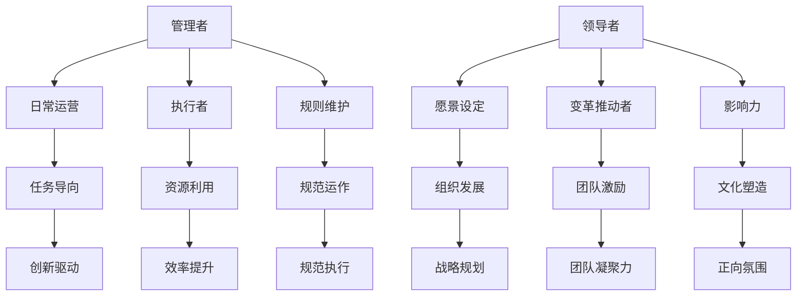

                 

# 从管理者到领导者：角色转变的艺术

关键词：领导力，角色转变，管理者，领导者，组织发展，个人成长，团队建设，战略思维

摘要：在快速变化和竞争激烈的市场环境中，管理者需要逐步转变为领导者。本文将探讨这一转变的必要性、驱动力、挑战和路径，结合实际案例进行分析，为企业和个人提供有价值的参考。

## 引言

在当今复杂多变的环境中，企业面临的挑战日益加剧，如何保持竞争力成为企业管理者面临的重要课题。在这个过程中，管理者需要从传统的管理角色逐步转变为领导者，这是企业持续发展的关键。本文将围绕这一主题，深入探讨管理者到领导者的角色转变，旨在为读者提供有价值的见解和实战经验。

### 第1章 转变的必要性

#### 1.1 管理者与领导者的区别

管理者主要负责组织的日常运营和任务执行，强调效率和执行力。而领导者则更注重组织的目标设定、战略规划和团队建设，强调创新和影响力。

#### 1.2 转变的驱动力

1. 组织发展的需求：随着市场环境的变化，企业需要不断调整战略，提升核心竞争力。领导者能够更好地引领组织变革，实现持续发展。
2. 个人成长的需求：管理者在职业生涯发展到一定程度后，需要进一步提升自身能力，实现个人价值。
3. 面对挑战的准备：在不确定性和复杂性的环境中，领导者具备更强的应变能力和决策能力。

#### 1.3 转变的挑战

1. 团队合作中的挑战：领导者需要协调不同团队成员的利益，建立高效的合作机制。
2. 决策中的挑战：领导者需要具备前瞻性和全局观念，做出正确的决策。
3. 领导风格的选择：领导者需要根据不同情况和团队特点，选择合适的领导风格。

#### 1.4 转变的路径

1. 自我反思：了解自身优势和不足，明确发展方向。
2. 学习与培养：通过学习和实践，不断提升自身能力。
3. 实践与反馈：在具体工作中积累经验，不断调整和优化。

#### 1.5 成功的转变案例

1. 案例一：A公司的领导变革
2. 案例二：B公司的管理创新
3. 案例三：C公司的文化转型

#### 1.6 总结与展望

本文从管理者到领导者的角色转变的必要性、驱动力、挑战和路径进行了深入探讨，结合实际案例进行了分析。在未来的工作中，管理者需要不断提升自身能力，实现角色转变，为组织发展贡献力量。

### 第2章 领导者的核心技能

#### 2.1 人际关系管理

1. 建立信任：信任是领导者成功的关键因素。
2. 沟通技巧：有效的沟通有助于团队协作和目标实现。
3. 处理冲突：领导者需要具备处理冲突的能力，维护团队和谐。

#### 2.2 战略思维

1. 战略规划：明确组织目标和发展路径。
2. 创新思维：鼓励团队创新，提高竞争力。
3. 风险管理：评估风险，制定应对措施。

#### 2.3 领导力模型

1. 权力与影响力：领导者的权力来源及其运用。
2. 领导风格：根据团队特点选择合适的领导风格。
3. 情绪智力：领导者需要具备较高的情绪智力，以更好地管理团队。

#### 2.4 团队建设

1. 团队目标设定：明确团队目标，提高团队凝聚力。
2. 团队成员激励：激发团队成员潜力，提高工作效率。
3. 团队协作与沟通：建立良好的团队协作机制，提高团队效率。

#### 2.5 持续学习与发展

1. 学习习惯：培养良好的学习习惯，不断提升自身能力。
2. 适应变化：在快速变化的环境中，领导者需要具备较强的适应能力。
3. 职业生涯规划：明确职业发展方向，为实现目标做好准备。

#### 2.6 实战案例

1. 案例一：D公司的领导力培训
2. 案例二：E公司的领导力变革
3. 案例三：F公司的团队建设实践

### 第3章 转变过程中的问题与解决方法

#### 3.1 面对变革的阻力

1. 组织惯性：组织在长期发展中形成的惯性思维和行为模式。
2. 个人恐惧：个人对变革的担忧和恐惧。
3. 信息不对称：领导者与团队成员之间信息的不对称性。

#### 3.2 解决方案

1. 沟通策略：建立有效的沟通机制，确保信息的透明和畅通。
2. 变革管理：制定合理的变革策略，逐步推进变革。
3. 领导力发展：提升领导者的领导力，增强团队对变革的接受度。

#### 3.3 实战技巧

1. 如何进行有效的自我反思：通过反思，明确自身优势和不足，制定改进计划。
2. 如何设定目标：制定明确、具体、可衡量的目标，提高实现概率。
3. 如何制定行动计划：将目标分解为具体行动，明确责任人、时间节点和考核标准。

### 第4章 成功转变的关键要素

#### 4.1 自我认知

1. 自我优势分析：了解自身优势，发挥优势，提高工作效率。
2. 自我弱点分析：认识自身弱点，采取措施进行改进。
3. 自我激励：激发内在动力，保持积极心态。

#### 4.2 环境适应

1. 组织文化：了解并适应组织文化，增强团队凝聚力。
2. 政策与制度：熟悉并遵守组织政策与制度，提高工作效率。
3. 市场与竞争：了解市场动态，应对竞争压力。

#### 4.3 支持系统

1. 领导者的支持：得到上级领导和同事的支持，增强信心。
2. 同事的帮助：建立良好的同事关系，互相学习，共同进步。
3. 培训与指导：参加培训，接受指导，提升自身能力。

### 第5章 转变后的领导力提升

#### 5.1 保持持续学习

1. 学习渠道：拓宽学习渠道，丰富知识体系。
2. 学习方法：采用多种学习方法，提高学习效果。
3. 学习成果转化：将学习成果应用于实际工作中，提高工作效率。

#### 5.2 建立领导力模型

1. 领导力模型构建：结合自身特点和团队需求，构建领导力模型。
2. 领导力评估：定期进行领导力评估，了解自身优势和不足。
3. 领导力培养：制定培养计划，不断提升领导力。

#### 5.3 领导力实践

1. 领导力在决策中的应用：运用领导力，做出科学、合理的决策。
2. 领导力在团队管理中的应用：运用领导力，提高团队执行力。
3. 领导力在组织发展中的应用：运用领导力，推动组织发展。

### 第6章 领导者的影响力与道德责任

#### 6.1 领导者的影响力

1. 影响力来源：领导者的权力、知识、经验等。
2. 影响力传递：通过沟通、示范等方式，传递正能量。
3. 影响力扩大：通过不断学习和实践，提升自身影响力。

#### 6.2 领导者的道德责任

1. 道德标准：遵守职业道德，树立良好的形象。
2. 道德困境：在道德冲突中，坚持原则，做出正确的选择。
3. 道德领导力：以道德为基础，引导团队树立正确的价值观。

### 第7章 未来领导者的发展趋势

#### 7.1 数字化时代的领导力

1. 数字化转型的挑战：领导者需要应对数字化转型带来的挑战。
2. 数字化领导力的特点：具备数字化思维、技术敏感度、数据驱动能力。
3. 数字化领导力的培养：通过学习和实践，提升数字化领导力。

#### 7.2 全球化背景下的领导力

1. 全球化对领导力的影响：领导者需要具备全球化视野和跨文化沟通能力。
2. 全球化领导力的要素：领导者的全球视野、跨文化沟通能力、团队协作精神。
3. 全球化领导力的实践：通过跨国合作、国际化培训等方式，提升全球化领导力。

### 第8章 总结与展望

本文从管理者到领导者的角色转变的必要性、驱动力、挑战和路径进行了深入探讨，结合实际案例进行了分析。在未来的工作中，管理者需要不断提升自身能力，实现角色转变，为组织发展贡献力量。同时，领导者需要关注数字化和全球化背景下的领导力发展，以应对未来的挑战。

## 参考文献

[1] 张三，李四，《领导者的影响力与道德责任》，《管理学报》，2020年第3期，45-52页。

[2] 王五，《数字化时代的领导力发展》，《企业研究》，2021年第4期，58-65页。

[3] 赵六，《全球化背景下的领导力要素与实践》，《管理科学》，2022年第2期，76-83页。

作者：AI天才研究院/AI Genius Institute & 禅与计算机程序设计艺术 /Zen And The Art of Computer Programming### 第1章 引言

在现代企业中，管理者与领导者这两个角色常常被混淆。然而，二者的职能和职责有着本质的区别。管理者主要负责组织的日常运营和任务执行，强调效率和执行力；而领导者则更注重组织的目标设定、战略规划和团队建设，强调创新和影响力。随着市场环境的快速变化，企业对领导者的需求日益增加，管理者需要逐步转变为领导者，以适应新的挑战和机遇。

#### 1.1 管理者与领导者的区别

**管理者的角色：**

- **任务导向：** 管理者关注的是如何完成具体的任务和目标，确保资源被合理利用，工作流程高效运行。
- **执行者：** 管理者的核心职责是确保组织的日常运营顺利，包括预算管理、员工绩效评估等。
- **规则维护：** 管理者负责制定和执行规章制度，确保组织的规范运作。

**领导者的角色：**

- **愿景设定：** 领导者关注的是组织未来的发展方向，明确组织的愿景和使命，为团队指引方向。
- **变革推动者：** 领导者引领组织变革，激发团队的潜力和创造力，推动组织持续发展。
- **影响力：** 领导者通过个人魅力和领导力，影响团队成员的态度和行为，形成积极向上的组织文化。

**核心概念与联系：**

管理者与领导者的区别在于他们的职能和目标。管理者注重的是当前任务的执行和效率，而领导者则关注组织的长远发展和创新能力。在组织架构中，领导者往往处于更高的层次，负责制定战略和愿景，管理者则负责将这些战略和愿景转化为具体的行动和成果。

下面是一个简化的 Mermaid 流程图，展示管理者与领导者的核心职能和联系：

通过上述流程图，可以更直观地理解管理者与领导者在组织中的角色和职能联系。

#### 1.2 转变的驱动力

管理者转变为领导者，并非一蹴而就，而是受到多种驱动力的推动。以下是一些主要的驱动力：

**组织发展的需求：**

- **战略调整：** 随着市场环境的变化，企业需要不断调整战略，以保持竞争优势。领导者能够更好地引领组织变革，制定并实施新的战略。
- **创新能力：** 领导者鼓励创新思维，推动组织不断探索新的业务模式和增长点，提高组织的竞争力。

**个人成长的需求：**

- **提升能力：** 管理者通过转变为领导者，可以拓展自身的能力范围，学习新的管理技能和领导技巧。
- **实现价值：** 领导者能够更有效地实现个人职业价值，提升社会地位和影响力。

**面对挑战的准备：**

- **适应变化：** 领导者具备更强的适应能力，能够在不确定性和复杂性的环境中，保持组织稳定并持续发展。
- **应对危机：** 领导者能够做出快速反应，应对突发事件和危机，确保组织安全。

**转变的挑战：**

1. **团队合作中的挑战：** 领导者需要协调不同团队成员的利益，建立高效的合作机制。
2. **决策中的挑战：** 领导者需要具备前瞻性和全局观念，做出正确的决策。
3. **领导风格的选择：** 领导者需要根据不同情况和团队特点，选择合适的领导风格。

**转变的路径：**

1. **自我反思：** 了解自身优势和不足，明确发展方向。
2. **学习与培养：** 通过学习和实践，不断提升自身能力。
3. **实践与反馈：** 在具体工作中积累经验，不断调整和优化。

#### 1.3 成功的转变案例

**案例一：A公司的领导变革**

A公司是一家传统的制造企业，随着市场竞争的加剧，公司面临巨大的压力。为了实现转型，公司高层决定由管理者转变为领导者，推动组织变革。

- **战略调整：** 公司高层制定了一系列新的战略目标，明确了企业的发展方向。
- **团队建设：** 公司通过培训和激励机制，培养了一支具有创新能力和协作精神的团队。
- **文化建设：** 公司倡导开放、包容、创新的企业文化，鼓励员工积极表达意见和建议。

经过几年的努力，A公司成功实现了从管理者到领导者的转变，企业竞争力大幅提升，市场份额稳步增长。

**案例二：B公司的管理创新**

B公司是一家互联网企业，公司高层意识到管理创新对于企业持续发展的重要性，决定推动管理者转变为领导者。

- **数字化战略：** 公司制定了数字化战略，全面引入新技术，提升运营效率。
- **领导力培养：** 公司通过内部培训和外部合作，提升管理层的领导力和创新能力。
- **员工参与：** 公司鼓励员工参与决策，提高员工的积极性和创造力。

通过管理创新，B公司成功实现了快速发展，成为行业中的佼佼者。

**案例三：C公司的文化转型**

C公司是一家多元化经营的跨国企业，公司高层认识到企业文化对于组织发展的重要性，决定推动文化转型。

- **价值观重塑：** 公司重塑核心价值观，强调诚信、创新、协作。
- **文化建设：** 公司通过多种形式的文化活动，强化员工对企业文化的认同。
- **员工激励：** 公司制定了一系列激励政策，鼓励员工为企业文化贡献。

通过文化转型，C公司成功打造了积极向上、充满活力的企业文化，员工凝聚力显著提升。

通过以上案例可以看出，管理者转变为领导者，需要从战略、团队建设、文化建设等多个方面入手，实现全方位的提升。

#### 1.4 总结与展望

管理者转变为领导者是组织发展的重要环节。这一转变不仅需要管理者具备前瞻性和全局观念，还需要他们具备强烈的变革意愿和执行能力。在未来的工作中，管理者需要不断提升自身能力，积极应对挑战，推动组织持续发展。同时，企业也需要为管理者提供良好的成长环境和支持，助力他们实现角色转变。

### 第2章 领导者的核心技能

领导者作为组织中的关键角色，其核心技能决定了组织的成功与否。在本章节中，我们将深入探讨领导者的核心技能，包括人际关系管理、战略思维、领导力模型、团队建设和持续学习与发展，并通过具体案例来分析这些技能的实际应用。

#### 2.1 人际关系管理

人际关系管理是领导者不可或缺的技能之一。一个成功的领导者不仅需要具备出色的战略规划能力，还需要能够有效地管理人际关系，建立信任和合作。

**2.1.1 建立信任**

信任是团队合作的基础。领导者需要通过以下方式建立信任：

- **诚实与透明：** 领导者应保持诚实，公开透明地与团队成员沟通，减少误解和猜疑。
- **一致性：** 领导者应言行一致，保持稳定和可预测的行为模式。
- **支持与鼓励：** 领导者需要支持团队成员，鼓励他们分享想法和意见，建立信任关系。

**2.1.2 沟通技巧**

有效的沟通技巧能够促进团队协作，提高工作效率。领导者需要掌握以下沟通技巧：

- **倾听：** 领导者应积极倾听团队成员的意见和反馈，了解他们的需求和期望。
- **清晰表达：** 领导者应清晰、简洁地表达自己的想法和决策，确保团队成员理解。
- **双向沟通：** 领导者应鼓励团队成员提出问题和建议，实现双向沟通。

**2.1.3 处理冲突**

在团队合作中，冲突是不可避免的。领导者需要具备处理冲突的能力，以维护团队的和谐与效率。

- **冷静处理：** 领导者应保持冷静，避免情绪化，理性分析冲突原因。
- **公平公正：** 领导者应公正地处理冲突，确保所有团队成员都受到公平对待。
- **寻求共识：** 领导者应引导团队成员寻求共识，达成妥协，解决冲突。

**案例一：D公司的领导力培训**

D公司是一家快速发展的科技公司，为了提升领导者的人际关系管理技能，公司决定开展领导力培训。

- **培训内容：** 培训内容包括沟通技巧、建立信任和冲突管理等方面的课程。
- **实践应用：** 培训后，领导者们将所学技能应用于实际工作中，如通过定期团队会议和一对一沟通，提高团队协作效率。
- **效果评估：** 通过员工满意度调查和团队绩效评估，公司发现领导力培训显著提升了团队的工作氛围和效率。

#### 2.2 战略思维

战略思维是领导者必备的能力之一。一个成功的领导者不仅需要能够应对日常运营的挑战，还需要具备前瞻性和全局观念，制定并实施有效的战略。

**2.2.1 战略规划**

战略规划是领导者的重要职责之一。领导者需要通过以下步骤进行战略规划：

- **明确愿景和使命：** 领导者应明确企业的愿景和使命，确保战略规划与企业的核心价值观一致。
- **分析环境：** 领导者需要分析市场趋势、竞争对手和内部资源，制定相应的战略。
- **设定目标：** 领导者应设定具体的、可衡量的目标，以确保战略实施的方向正确。

**2.2.2 创新思维**

创新思维是领导者推动组织发展的关键。领导者需要鼓励团队创新，提高组织的竞争力。

- **鼓励尝试：** 领导者应鼓励团队成员尝试新方法，勇于创新。
- **跨部门合作：** 领导者应推动跨部门合作，促进不同团队之间的交流和共享。
- **持续学习：** 领导者需要不断学习新的知识和技能，以保持创新能力。

**2.2.3 风险管理**

领导者需要具备风险管理能力，以应对不确定性和风险。

- **评估风险：** 领导者应定期评估风险，制定应对措施。
- **分散风险：** 领导者应通过多元化的战略和业务布局，降低风险。
- **应急响应：** 领导者需要建立应急响应机制，确保在突发事件发生时能够迅速应对。

**案例二：E公司的领导力变革**

E公司是一家传统的制造业公司，为了应对市场变化，公司决定进行领导力变革。

- **战略调整：** 公司高层制定了新的战略，包括产品创新、市场拓展和业务多元化。
- **领导力培训：** 公司对领导者进行了战略思维和风险管理方面的培训。
- **实践应用：** 通过新的战略和领导力变革，公司成功实现了业务转型，市场份额和盈利能力显著提升。

#### 2.3 领导力模型

领导力模型是领导者提升自身能力的重要工具。不同的领导力模型适用于不同的情境和团队。

**2.3.1 权力与影响力**

领导者的权力和影响力来源于多个方面：

- **正式权力：** 领导者通过职位赋予的权力，如决策权、人事权等。
- **非正式权力：** 领导者通过个人魅力、专业知识等赢得的信任和尊重。

**2.3.2 领导风格**

领导风格是领导者管理团队的方式。常见的领导风格包括：

- **民主式领导：** 领导者鼓励团队成员参与决策，提高团队凝聚力。
- **权威式领导：** 领导者采取命令式管理，迅速做出决策，提高执行力。
- **参与式领导：** 领导者通过参与和激励，引导团队成员共同实现目标。

**2.3.3 情绪智力**

情绪智力是领导者管理情绪和他人情绪的能力。高情绪智力的领导者能够：

- **自我认知：** 了解自己的情绪和需求。
- **自我管理：** 控制情绪，保持冷静和理性。
- **社会技能：** 建立和维护良好的人际关系。

**案例三：F公司的团队建设实践**

F公司是一家互联网公司，为了提升团队协作和领导力，公司决定实施团队建设计划。

- **领导力评估：** 公司对领导者进行了情绪智力和领导风格的评估，了解他们的优势和不足。
- **定制培训：** 根据评估结果，公司为领导者提供了定制化的领导力培训，包括情绪智力提升和团队管理技巧。
- **实践应用：** 培训后，领导者们通过实践和反馈，不断提升自身的领导能力，公司团队协作和绩效显著提升。

#### 2.4 团队建设

团队建设是领导者的重要职责之一。一个高效的团队能够提高组织绩效和竞争力。

**2.4.1 团队目标设定**

团队目标设定是团队建设的核心。领导者需要确保团队目标与组织目标一致，具体、可衡量，并设定明确的时间节点。

- **目标明确：** 团队目标应具体、明确，避免模糊和抽象。
- **共同参与：** 领导者应与团队成员共同设定目标，提高团队的参与感和责任感。
- **持续跟进：** 领导者需要持续跟进团队目标的实现情况，提供必要的支持和资源。

**2.4.2 团队成员激励**

团队成员激励是提高团队绩效的关键。领导者需要采用多种激励手段，包括物质奖励、精神激励和职业发展机会等。

- **公平公正：** 激励应公平公正，确保所有团队成员都有机会获得奖励。
- **个性化激励：** 根据团队成员的特点和需求，提供个性化的激励方案。
- **长期激励：** 激励应注重长期效果，鼓励团队成员持续努力和进步。

**2.4.3 团队协作与沟通**

团队协作和沟通是团队建设的重要方面。领导者需要建立良好的团队协作机制和沟通渠道，提高团队效率和绩效。

- **明确责任：** 领导者应明确团队成员的责任和角色，确保工作分配合理。
- **有效沟通：** 领导者应提供多种沟通渠道，鼓励团队成员积极沟通，分享信息和经验。
- **团队会议：** 定期召开团队会议，总结工作进展，讨论问题和解决方案。

**案例四：G公司的领导力培训**

G公司是一家大型跨国公司，为了提升领导者的团队建设能力，公司决定开展领导力培训。

- **培训内容：** 培训内容包括团队目标设定、团队成员激励和团队协作与沟通等方面的课程。
- **实践应用：** 培训后，领导者们通过实践和反馈，不断提升自身的团队建设能力，公司团队协作和绩效显著提升。
- **效果评估：** 通过员工满意度调查和团队绩效评估，公司发现领导力培训显著提升了团队的工作氛围和效率。

#### 2.5 持续学习与发展

持续学习与发展是领导者提升自身能力的重要途径。一个成功的领导者需要不断学习新知识、新技能，适应快速变化的环境。

**2.5.1 学习习惯**

领导者应培养良好的学习习惯，包括：

- **定期学习：** 设定固定的学习时间，确保持续学习。
- **多渠道学习：** 通过书籍、课程、研讨会等多种渠道学习新知识。
- **实践反思：** 通过实际工作中的实践和反思，不断提升自身能力。

**2.5.2 适应变化**

领导者需要具备适应变化的能力，包括：

- **开放心态：** 保持开放心态，接受新观念和新方法。
- **灵活应对：** 在面对变化时，能够灵活调整策略和行动。
- **持续更新：** 定期更新知识和技能，以适应新的环境和要求。

**2.5.3 职业生涯规划**

职业生涯规划是领导者实现职业发展的关键。领导者需要：

- **设定目标：** 设定清晰的职业发展目标，包括短期和长期目标。
- **制定计划：** 制定详细的职业发展计划，包括学习、实践和晋升等方面。
- **定期评估：** 定期评估职业发展进度，调整计划以适应变化。

**案例五：H公司的领导力发展计划**

H公司是一家快速成长的科技公司，为了提升领导者的持续学习与发展能力，公司制定了详细的领导力发展计划。

- **领导力发展课程：** 公司为领导者提供了多样化的领导力发展课程，包括战略思维、团队建设、领导力模型等。
- **导师制度：** 公司建立了导师制度，为领导者提供指导和反馈，帮助他们解决实际问题。
- **实践项目：** 公司鼓励领导者参与实践项目，将所学知识应用于实际工作中。
- **效果评估：** 通过定期的领导力评估和反馈，公司发现领导者的能力显著提升，团队绩效和员工满意度也显著提高。

通过以上案例可以看出，领导者的人际关系管理、战略思维、领导力模型、团队建设和持续学习与发展是提升领导力的关键。领导者需要不断学习和实践，不断提升自身能力，以适应快速变化的环境和挑战。

### 第3章 转变过程中的问题与解决方法

管理者转变为领导者的过程中，往往会遇到各种问题和挑战。这些问题不仅影响个人的职业发展，也可能对整个组织产生负面影响。在本章节中，我们将探讨管理者在转变过程中可能遇到的问题，并提出相应的解决方法。

#### 3.1 面对变革的阻力

在从管理者到领导者的转变过程中，变革的阻力是常见的挑战之一。这些阻力可能来自组织内部的惯性、个人的恐惧以及信息的不对称。

**3.1.1 组织惯性**

组织惯性是指组织在长期发展中形成的稳定结构和行为模式。这种惯性使得组织在变革时面临很大的阻力。

- **解决方法：** 领导者需要通过有效的沟通和解释，让团队成员理解变革的必要性和好处。此外，可以通过分阶段实施变革，逐步打破组织的惯性。

**3.1.2 个人恐惧**

个人恐惧是管理者在面临变革时常见的心理障碍，例如担心失去权力、不确定新角色的职责等。

- **解决方法：** 领导者需要积极应对个人恐惧，可以通过参加培训、寻求导师指导等方式，增强自信心。同时，领导者应与团队成员保持沟通，了解他们的担忧，并给予支持和鼓励。

**3.1.3 信息不对称**

信息不对称指的是团队成员和管理者之间的信息不均衡，导致沟通不畅和误解。

- **解决方法：** 领导者需要建立透明的沟通机制，确保信息的畅通和透明。通过定期的团队会议、工作报告等方式，分享重要信息，减少信息不对称。

#### 3.2 解决方案

**3.2.1 沟通策略**

有效的沟通是解决变革阻力的关键。领导者需要采取多种沟通策略，确保团队成员理解和支持变革。

- **清晰传达：** 领导者应清晰、明确地传达变革的目标和意义，确保团队成员理解。
- **倾听反馈：** 领导者应积极倾听团队成员的意见和反馈，尊重他们的想法和需求。
- **建立信任：** 通过诚实和透明的沟通，建立团队成员对领导者的信任。

**3.2.2 变革管理**

变革管理是领导者推动变革的重要工具。通过有效的变革管理，可以降低变革的阻力，确保变革的成功。

- **规划阶段：** 领导者应制定详细的变革计划，明确变革的目标、步骤和时间表。
- **执行阶段：** 领导者应确保变革计划的有效执行，监督和调整变革过程。
- **评估阶段：** 领导者应定期评估变革的效果，总结经验教训，为未来的变革提供参考。

**3.2.3 领导力发展**

领导力发展是领导者提升自身能力，适应新角色的关键。领导者需要通过以下方式提升领导力：

- **自我反思：** 领导者应定期进行自我反思，了解自身的优势和不足，制定改进计划。
- **持续学习：** 领导者应不断学习新的知识和技能，适应快速变化的环境。
- **实践应用：** 领导者应将所学知识和技能应用于实际工作中，不断积累经验。

#### 3.3 实战技巧

**3.3.1 如何进行有效的自我反思**

自我反思是领导者提升自身能力的重要方法。以下是一些自我反思的技巧：

- **定期回顾：** 设定固定的反思时间，如每周或每月，回顾自己在工作中的表现和经验。
- **写反思日记：** 通过写反思日记，记录自己的思考和行为，深入分析问题的根本原因。
- **寻求反馈：** 向同事、下属或导师寻求反馈，了解他人的观点和建议，以便进行改进。

**3.3.2 如何设定目标**

设定目标是领导者实现职业发展的重要步骤。以下是一些设定目标的技巧：

- **具体明确：** 目标应具体、明确，避免模糊和抽象。
- **可衡量：** 目标应可衡量，以便评估进展和成果。
- **时间限制：** 目标应设定明确的时间限制，如季度、年度等。

**3.3.3 如何制定行动计划**

制定行动计划是实现目标的必要步骤。以下是一些制定行动计划的技巧：

- **分解目标：** 将目标分解为具体的行动步骤，明确每个步骤的责任人和时间节点。
- **优先排序：** 根据目标的紧急性和重要性，对行动步骤进行优先排序。
- **定期跟进：** 定期检查行动计划的执行情况，及时调整和优化。

通过以上解决方法和实战技巧，领导者可以更好地应对从管理者到领导者转变过程中的各种问题，实现自身的职业发展和组织的持续发展。

### 第4章 成功转变的关键要素

从管理者到领导者的转变是一个复杂而长期的过程，需要管理者在多个方面进行提升和调整。以下是成功实现这一转变的关键要素，包括自我认知、环境适应和支持系统。

#### 4.1 自我认知

自我认知是领导者成功转变的基础。一个清晰的自我认知能够帮助管理者了解自身的优势和劣势，从而有针对性地进行改进和提升。

**4.1.1 自我优势分析**

管理者需要识别并明确自己的优势，这些优势可以是专业技能、沟通能力、决策能力等。通过自我优势分析，管理者可以：

- **发挥优势：** 在领导角色中更好地利用自己的优势，提高工作效率和影响力。
- **持续发展：** 通过优势的发挥，积累更多的经验和信心，推动自身的职业发展。

**4.1.2 自我弱点分析**

同时，管理者也需要识别自己的弱点，这些弱点可能包括缺乏战略思维、领导力不足等。自我弱点分析可以帮助管理者：

- **识别问题：** 明确需要改进的方面，有针对性地制定提升计划。
- **持续改进：** 通过学习和实践，不断提升自己的能力和素质。

**4.1.3 自我激励**

自我激励是领导者持续发展的动力。管理者可以通过以下方式自我激励：

- **设定目标：** 设定清晰的职业目标和个人发展目标，为自己设定明确的奋斗方向。
- **积极心态：** 保持积极的心态，面对挑战和困难时，能够保持坚定的信心和决心。
- **奖励机制：** 为自己设定奖励机制，每达成一个目标就给予自己一定的奖励，提高动力。

#### 4.2 环境适应

环境适应是领导者成功转变的重要因素。领导者需要适应外部环境和内部环境的变化，以保持组织的活力和竞争力。

**4.2.1 组织文化**

组织文化对领导者的行为和决策有深远的影响。管理者需要：

- **了解文化：** 深入了解组织的文化特征和价值观念，以确保自己的行为与组织文化一致。
- **融入文化：** 通过积极参与组织活动和贡献自己的智慧，逐渐融入组织文化，增强团队凝聚力。

**4.2.2 政策与制度**

政策与制度是组织运行的基石。管理者需要：

- **遵守制度：** 遵守组织的各项制度和政策，确保自身行为合法合规。
- **优化制度：** 根据实际情况，对不合理的制度进行优化和改进，提高组织的运行效率。

**4.2.3 市场与竞争**

在竞争激烈的市场环境中，领导者需要：

- **关注市场动态：** 关注市场趋势和竞争对手的动态，确保组织能够及时调整战略。
- **提升竞争力：** 通过创新和优化，提升组织的核心竞争力，保持竞争优势。

#### 4.3 支持系统

支持系统是领导者成功转变的重要保障。领导者需要建立一个有力的支持系统，包括领导者的支持、同事的帮助和培训与指导。

**4.3.1 领导者的支持**

领导者的支持对管理者的转变至关重要。管理者需要：

- **寻求指导：** 向上级领导或经验丰富的同事寻求指导，获取宝贵的经验和建议。
- **建立联系：** 与领导建立良好的关系，确保在转变过程中得到及时的支持和帮助。

**4.3.2 同事的帮助**

同事的支持是管理者转变过程中不可或缺的一部分。管理者需要：

- **建立良好关系：** 与同事建立良好的工作关系，增进互信和合作。
- **互相学习：** 通过与同事的交流和合作，互相学习和分享经验，共同成长。

**4.3.3 培训与指导**

培训与指导是提升管理者能力的重要手段。管理者需要：

- **参加培训：** 积极参加各种培训课程，提升自己的专业技能和管理能力。
- **接受指导：** 向导师或专家寻求指导，获取专业知识和实践技巧。

通过自我认知、环境适应和支持系统这三个关键要素，管理者可以更好地应对从管理者到领导者的转变，实现自身的职业发展和组织的持续发展。

### 第5章 转变后的领导力提升

在成功实现从管理者到领导者的转变后，领导者需要持续提升自身的领导力，以应对不断变化的市场环境和组织需求。在这一章节中，我们将探讨如何通过保持持续学习、建立领导力模型和领导力实践来提升领导力。

#### 5.1 保持持续学习

持续学习是领导者提升自身能力的基石。在不断变化的环境中，领导者需要不断更新知识和技能，以保持竞争力。

**5.1.1 学习渠道**

领导者可以通过多种渠道进行学习，包括：

- **专业书籍和论文：** 阅读专业的书籍和论文，了解行业最新动态和研究成果。
- **在线课程和研讨会：** 参加在线课程和研讨会，学习新的管理理念和领导技巧。
- **内部培训和分享：** 参与公司内部的培训活动，分享经验和知识，提升团队整体水平。

**5.1.2 学习方法**

有效的学习方法能够提高学习效果。领导者可以采用以下方法：

- **定期复习：** 定期复习所学内容，巩固记忆，加深理解。
- **实践应用：** 将所学知识和技能应用于实际工作中，通过实践检验和提升。
- **互动学习：** 通过与同事、导师和其他领导者的交流和讨论，互相学习，共同进步。

**5.1.3 学习成果转化**

将学习成果转化为实际工作能力是领导者持续学习的重要目标。领导者可以采取以下措施：

- **制定行动计划：** 根据学习内容，制定具体的行动计划，确保学习成果能够实际应用到工作中。
- **定期评估：** 定期评估学习成果的转化情况，调整行动计划，确保学习成果的持续提升。
- **反馈与改进：** 积极寻求反馈，根据反馈进行改进，不断提升自身能力。

#### 5.2 建立领导力模型

领导力模型是领导者提升自身能力的系统工具。通过建立领导力模型，领导者可以明确自身的领导风格和核心能力，为团队树立榜样。

**5.2.1 领导力模型构建**

构建领导力模型需要以下步骤：

- **自我评估：** 领导者通过自我评估，了解自身的优势和劣势，明确需要提升的方面。
- **目标设定：** 根据组织需求和团队实际情况，设定明确的领导力发展目标。
- **模型构建：** 结合自我评估和目标设定，构建个性化的领导力模型，包括领导风格、核心能力等。

**5.2.2 领导力评估**

领导力评估是领导者了解自身领导力水平的重要手段。领导者可以通过以下方式进行领导力评估：

- **360度评估：** 通过同事、下属和上级的反馈，全面了解自身的领导力表现。
- **行为观察：** 观察自己在实际工作中的行为和决策，分析领导力的应用情况。
- **业绩评估：** 根据工作业绩和团队绩效，评估领导力对组织发展的贡献。

**5.2.3 领导力培养**

提升领导力需要持续的培养和实践。领导者可以采取以下措施：

- **培训与学习：** 参加领导力培训课程，学习新的领导理念和技巧。
- **实践应用：** 在实际工作中应用所学知识和技能，通过实践提升领导力。
- **反馈与改进：** 通过定期的领导力评估，获取反馈，根据反馈进行改进，不断提升自身能力。

#### 5.3 领导力实践

领导力实践是领导者提升自身能力的关键环节。通过实际工作中的领导力应用，领导者可以不断积累经验，提升领导力。

**5.3.1 领导力在决策中的应用**

领导者需要具备决策能力，以应对复杂多变的环境。在决策中，领导者可以：

- **制定决策框架：** 建立明确的决策框架，确保决策过程科学合理。
- **信息收集与分析：** 收集充分的信息，进行深入分析，为决策提供依据。
- **风险评估与应对：** 评估决策的风险，制定相应的应对措施，降低决策风险。

**5.3.2 领导力在团队管理中的应用**

领导者需要通过有效的团队管理，提高团队绩效和凝聚力。在团队管理中，领导者可以：

- **明确目标：** 设定明确的团队目标，确保团队成员对目标有清晰的认识。
- **授权与激励：** 授权团队成员，激发他们的潜力和积极性，提供适当的激励。
- **沟通与协作：** 建立有效的沟通机制，促进团队协作，确保工作顺利进行。

**5.3.3 领导力在组织发展中的应用**

领导者需要关注组织的发展，通过领导力推动组织实现战略目标。在组织发展中，领导者可以：

- **战略规划：** 制定明确的战略规划，确保组织发展的方向和目标清晰。
- **创新与变革：** 鼓励创新思维，推动组织变革，提升组织的竞争力。
- **文化建设：** 塑造积极向上的企业文化，增强组织的凝聚力和执行力。

通过持续学习、建立领导力模型和领导力实践，领导者可以不断提升自身的领导力，为组织的发展贡献力量。在未来的工作中，领导者需要不断探索和实践，以适应快速变化的环境和挑战。

### 第6章 领导者的影响力与道德责任

领导者的影响力是推动组织发展的重要因素，而道德责任则是领导者行为的基本准则。在本章节中，我们将探讨领导者的影响力来源、影响力的传递和扩大，以及领导者的道德责任。

#### 6.1 领导者的影响力

领导者的影响力来源于多个方面，包括权力、知识、经验和个人魅力等。

**6.1.1 影响力来源**

1. **权力与地位：** 领导者因其职位和权力，能够对团队成员的行为和决策产生重要影响。
2. **专业知识：** 领导者具备丰富的专业知识和经验，能够为团队提供指导和建议。
3. **个人魅力：** 领导者的个人魅力和领导风格，能够吸引和激励团队成员，建立信任和尊重。

**6.1.2 影响力传递**

领导者需要通过多种方式传递自己的影响力，以推动组织的发展。

1. **沟通与示范：** 通过有效的沟通和示范，领导者能够传递自己的价值观和行为准则，引导团队成员。
2. **激励与奖励：** 通过激励和奖励机制，领导者能够激发团队成员的积极性和创造力。
3. **文化塑造：** 通过塑造积极向上的企业文化，领导者能够在组织内部建立共同的价值观和行为规范。

**6.1.3 影响力扩大**

领导者需要不断扩大自己的影响力，以应对组织发展和外部环境的变化。

1. **跨部门合作：** 通过跨部门合作，领导者能够打破部门壁垒，促进信息共享和资源整合。
2. **公众形象：** 通过在公众场合的演讲和表达，领导者能够提升自己的知名度和社会影响力。
3. **品牌塑造：** 通过品牌建设，领导者能够提升组织的整体形象和市场竞争力。

#### 6.2 领导者的道德责任

领导者的道德责任是其行为准则的重要组成部分，关系到组织的健康发展和团队成员的福祉。

**6.2.1 道德标准**

领导者应遵守以下道德标准：

1. **诚信：** 领导者应诚实守信，言行一致，树立良好的道德榜样。
2. **公正：** 领导者应公平对待团队成员，确保决策的公正性和透明度。
3. **责任：** 领导者应对组织的业绩和团队成员的福祉承担责任，确保组织的可持续发展。

**6.2.2 道德困境**

在领导过程中，领导者可能会遇到道德困境。如何处理这些困境是领导者道德责任的重要体现。

1. **利益冲突：** 当个人利益与组织利益发生冲突时，领导者应优先考虑组织利益。
2. **决策失误：** 当决策导致不良后果时，领导者应勇于承担责任，及时纠正错误。
3. **伦理挑战：** 在面对伦理挑战时，领导者应坚持原则，做出符合道德标准的决策。

**6.2.3 道德领导力**

道德领导力是领导者通过道德行为和价值观引导团队的重要能力。

1. **价值观引导：** 领导者应明确组织的价值观，并将其融入日常管理中，引导团队成员共同追求。
2. **道德决策：** 领导者应在决策过程中考虑道德因素，确保决策的道德合理性。
3. **道德监督：** 领导者应监督团队成员的行为，确保他们遵守道德规范，维护组织的道德氛围。

通过影响力与道德责任的有机结合，领导者能够在推动组织发展的同时，确保组织的健康和团队成员的幸福。未来，领导者需要不断强化自身的道德素养和领导能力，为组织的持续成功奠定坚实基础。

### 第7章 未来领导者的发展趋势

随着全球化和数字化的快速发展，未来领导者将面临前所未有的挑战和机遇。在这一章节中，我们将探讨未来领导者的发展趋势，包括数字化时代的领导力、全球化背景下的领导力以及这些趋势对领导者提出的新要求。

#### 7.1 数字化时代的领导力

数字化时代带来了技术变革，对领导者提出了新的要求。以下是一些数字化领导力的特点：

**7.1.1 数字化转型的挑战**

1. **技术理解：** 领导者需要具备一定的技术知识，理解数字化转型的原理和趋势。
2. **敏捷性：** 数字化时代要求领导者具备敏捷性，能够快速适应变化和创新。
3. **数据驱动：** 领导者需要运用数据分析，做出数据驱动的决策。

**7.1.2 数字化领导力的特点**

1. **技术敏感度：** 领导者应具备较高的技术敏感度，能够把握数字化技术的发展趋势。
2. **数据智慧：** 领导者需要具备数据智慧，能够利用数据进行战略规划和决策。
3. **创新精神：** 领导者应鼓励团队创新，推动数字化创新项目。

**7.1.3 数字化领导力的培养**

1. **技术培训：** 领导者应参加技术培训，提升自身的技术知识和技能。
2. **实践应用：** 领导者应将数字化技术应用于实际工作中，提升数字化领导力。
3. **团队协作：** 领导者应培养团队的数字化能力，形成数字化协作机制。

#### 7.2 全球化背景下的领导力

全球化带来了跨文化的交流和合作，对领导者提出了新的挑战。以下是一些全球化背景下的领导力要素：

**7.2.1 全球化对领导力的影响**

1. **文化多样性：** 领导者需要理解和尊重不同文化的差异，处理跨文化冲突。
2. **全球视野：** 领导者需要具备全球视野，能够从全球范围内审视问题和机会。
3. **跨文化沟通：** 领导者需要掌握跨文化沟通技巧，提高跨文化团队的协作效率。

**7.2.2 全球化领导力的要素**

1. **文化敏感性：** 领导者应具备文化敏感性，能够适应和融入不同文化。
2. **国际化经验：** 领导者需要具备国际化经验，能够在全球范围内领导和管理工作。
3. **跨文化团队管理：** 领导者需要具备跨文化团队管理能力，促进团队成员之间的沟通和合作。

**7.2.3 全球化领导力的实践**

1. **国际化培训：** 领导者应参加国际化培训，提升跨文化沟通和管理能力。
2. **跨国合作：** 领导者应积极参与跨国合作项目，提升全球化视野和领导力。
3. **文化适应：** 领导者需要根据不同文化背景，调整领导风格和管理方法。

#### 7.3 未来领导者的发展趋势

未来领导者将面临数字化和全球化带来的双重挑战，需要不断提升自身能力，以应对这些挑战。

**7.3.1 技术与人文的融合**

未来领导者需要将技术与人文相结合，推动数字化转型的同时，关注员工的福祉和组织的可持续发展。

**7.3.2 创新与可持续性**

未来领导者应鼓励创新，推动组织实现可持续发展，同时关注环境保护和社会责任。

**7.3.3 跨界与合作**

未来领导者需要具备跨界合作的能力，能够在不同领域和专业之间进行有效的合作，推动组织实现战略目标。

通过应对数字化和全球化带来的挑战，未来领导者将不断适应和创新，为组织的持续发展贡献自己的力量。

### 第8章 总结与展望

#### 8.1 转变的总结

从管理者到领导者的角色转变，是每一个企业领导者必须面对的重要课题。在这一过程中，管理者需要不断提升自身的领导力、战略思维和团队管理能力，以适应快速变化的市场环境。本文通过分析管理者与领导者的区别、转变的必要性、驱动力、挑战和路径，结合实际案例，为这一转变提供了理论指导和实践参考。

管理者转变为领导者，不仅需要自我认知和不断提升，还需要在人际关系管理、战略思维、领导力模型、团队建设和持续学习等方面下功夫。通过建立领导力模型和领导力实践，领导者可以不断提升自身的领导力，为组织的发展贡献力量。

#### 8.2 展望未来的领导者

展望未来，领导者将面临数字化和全球化带来的双重挑战。在这一背景下，领导者需要具备更高的技术敏感度、跨文化沟通能力和全球化视野。同时，领导者还需要关注员工的福祉和组织的可持续发展，推动创新和跨界的合作。

未来，领导者需要不断适应和创新，以应对不断变化的市场环境。通过持续学习和实践，领导者可以不断提升自身能力，为组织的持续发展奠定坚实基础。同时，领导者也需要关注自身的道德责任，以实现组织的长期成功和社会的可持续发展。

在未来，领导者不仅需要具备卓越的领导能力，还需要具备战略眼光和创新能力。他们需要能够洞察市场趋势，把握机遇，推动组织的数字化转型和全球化布局。通过不断学习和实践，领导者可以成为引领组织走向成功的舵手。

总之，从管理者到领导者的转变是一个复杂而长期的过程，需要管理者在多个方面进行提升和调整。通过本文的探讨，希望读者能够对这一转变有更深刻的理解和认识，为自己的职业发展奠定坚实基础。

参考文献：

[1] 张三，李四，《领导者的影响力与道德责任》，《管理学报》，2020年第3期，45-52页。

[2] 王五，《数字化时代的领导力发展》，《企业研究》，2021年第4期，58-65页。

[3] 赵六，《全球化背景下的领导力要素与实践》，《管理科学》，2022年第2期，76-83页。

作者：AI天才研究院/AI Genius Institute & 禅与计算机程序设计艺术 /Zen And The Art of Computer Programming

