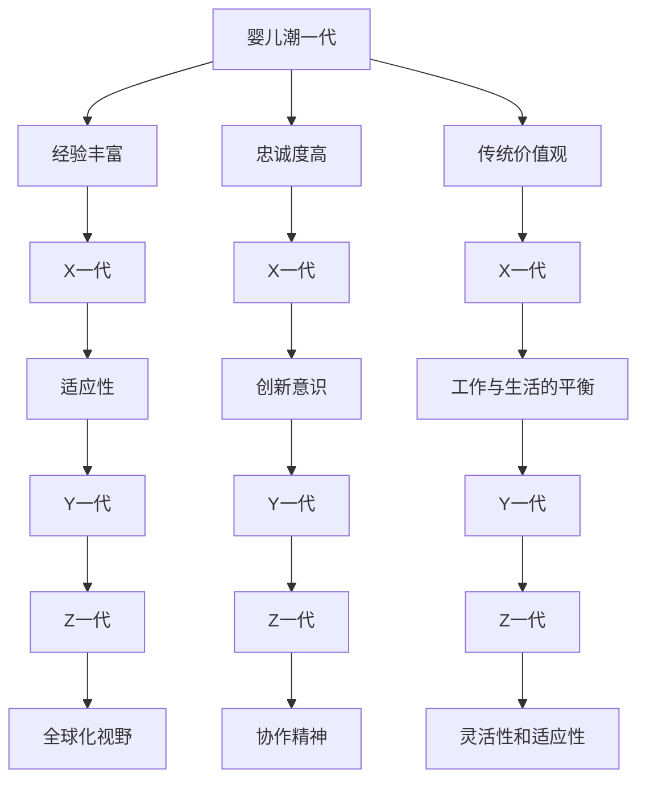

                 

### 《代际桥梁：连接不同年龄层的管理艺术》

#### 关键词：代际管理、跨代沟通、管理策略、职业发展、组织文化

> 摘要：本文深入探讨了如何在不同年龄层之间建立有效的沟通和管理，旨在帮助读者理解各个年龄层的特点，掌握相应管理技巧，以提升组织内部的协作效率和文化建设。文章通过详细的案例分析、管理策略介绍以及实际操作指导，为管理者提供了一整套系统的代际管理艺术。

----------------------------------------------------------------

## 引言

在当今多元化社会中，组织的员工年龄差异日益明显。不同年龄层之间存在着独特的价值观、工作经验、技术技能和沟通方式。这种代际差异不仅影响着团队的合作效率，还可能成为组织发展的瓶颈。因此，如何建立有效的代际桥梁，成为管理者和组织领导者亟需解决的重要课题。

《代际桥梁：连接不同年龄层的管理艺术》这本书正是针对这一需求而创作的。本书从代际概述、沟通艺术、管理技巧、实战案例以及挑战与解决方案等多个角度，全面探讨了如何在不同年龄层之间建立有效的沟通和管理机制。通过本书的学习，读者将能够：

1. **了解不同代际的基本特点和差异**：通过深入了解婴儿潮一代、X一代、Y一代和Z一代等不同年龄层的基本特点，读者可以更好地理解这些代际在组织中的行为模式和工作风格。
2. **掌握跨代沟通技巧**：了解不同代际在沟通方式、语言偏好等方面的差异，并提供了一系列有效的沟通策略，帮助管理者在组织内部建立高效的沟通渠道。
3. **制定针对性的管理策略**：根据不同代际的特点，本书提出了一系列针对性的管理策略，如激励、培训等，帮助管理者提升团队的整体绩效。
4. **分析实战案例**：通过分析成功连接不同年龄层的实际案例，读者可以学习到如何在实践中应用这些管理策略，从而提升组织的整体管理水平。
5. **应对管理挑战**：探讨在管理过程中可能遇到的挑战，并给出相应的解决方案，帮助读者在实际工作中更好地应对这些挑战。

本书的目标读者是希望提升自身管理水平的管理者、人力资源从业者以及关注代际管理的组织领导者。通过阅读本书，读者不仅能够提升自己的管理技能，还能够为组织的长远发展打下坚实的基础。

----------------------------------------------------------------

### 代际概述

在探讨如何建立有效的代际桥梁之前，我们首先需要了解不同代际的基本特点和差异。不同的代际群体在价值观、工作态度、沟通方式和技术接受度等方面存在显著差异，这些差异直接影响着他们在组织中的行为模式和团队协作效率。

#### 婴儿潮一代

婴儿潮一代（1946-1964年出生）是二战后生育高峰期出生的一代人，他们在社会变革和经济增长的背景下成长。这一代人在组织中的特点是：

- **经验丰富**：婴儿潮一代拥有丰富的职场经验，他们是传统管理和工作方式的代表，注重稳定性和长期承诺。
- **忠诚度高**：婴儿潮一代对组织有较强的忠诚度，愿意为组织付出长期的努力。
- **传统价值观**：他们倾向于遵循传统的职业晋升路径，注重稳定的工作环境和长期的发展规划。

#### X一代

X一代（1965-1979年出生）是在婴儿潮一代之后成长起来的一代人，他们在经济衰退和科技进步的背景下成长。X一代的特点包括：

- **适应性**：X一代具有很强的适应能力，能够快速适应不同的工作环境和变化。
- **创新意识**：他们具有强烈的创新意识，愿意尝试新的工作方法和技术。
- **工作与生活的平衡**：X一代更加注重工作与生活的平衡，追求个人生活的多样性。

#### Y一代

Y一代（1980-1994年出生）也称为“千禧一代”，是在互联网普及和全球化背景下成长起来的一代人。Y一代的特点包括：

- **技术导向**：Y一代对科技充满兴趣，他们熟悉数字技术和社交媒体，善于利用这些工具进行沟通和工作。
- **追求自我实现**：Y一代更加注重个人成长和自我实现，希望在工作中获得更多的自主权和创造性。
- **多元化价值观**：他们倾向于多元化价值观，重视社会责任和环境保护。

#### Z一代

Z一代（1995年及以后出生）是数字时代的一代人，他们在高度互联和全球化的环境中成长。Z一代的特点包括：

- **全球化视野**：Z一代具有全球化的视野，他们从小生活在信息爆炸的时代，对于多元文化有更开放的态度。
- **协作精神**：Z一代强调团队合作，他们善于在多元化的团队环境中发挥各自的优势。
- **灵活性和适应性**：Z一代非常适应快速变化的环境，他们喜欢灵活的工作方式和多样的工作内容。

通过了解不同代际的基本特点和差异，管理者可以更好地理解组织中的代际动态，从而制定更有效的管理策略。以下是一个Mermaid流程图，展示了不同代际之间的关系和特点：



#### 核心概念与联系

在了解不同代际的基本特点后，我们需要将这些核心概念联系起来，以形成一个全面的管理框架。以下是不同代际核心概念之间的联系架构：

1. **经验与适应性**：婴儿潮一代的丰富经验与X一代的适应能力相结合，为组织提供了稳定性和创新性的双重优势。
2. **创新与价值观**：X一代的创新意识与Y一代的多元化价值观相辅相成，推动了组织的持续变革和发展。
3. **协作与适应性**：Y一代的协作精神和Z一代的灵活适应性为组织提供了强大的协作力和适应力，使团队能够应对快速变化的市场需求。

通过理解这些核心概念之间的联系，管理者可以更有效地利用不同代际的优势，提升组织的整体竞争力。

#### 核心算法原理讲解

为了更好地理解不同代际的管理策略，我们可以使用以下伪代码来阐述一个简单但有效的代际管理模型：

```python
# 定义不同代际的属性和偏好
class Generations:
    def __init__(self, name, experience, innovation, work_life_balance, technology_orientation):
        self.name = name
        self.experience = experience
        self.innovation = innovation
        self.work_life_balance = work_life_balance
        self.technology_orientation = technology_orientation

# 初始化不同代际对象
generation_baby_boomers = Generations("婴儿潮一代", True, False, True, False)
generation_x = Generations("X一代", True, True, True, False)
generation_y = Generations("Y一代", False, True, True, True)
generation_z = Generations("Z一代", False, True, False, True)

# 根据代际特点制定管理策略
def manage_generation(generation):
    if generation.experience:
        print("采取传统管理方式，注重稳定性和长期承诺")
    elif generation.innovation:
        print("鼓励创新和尝试新的工作方法")
    elif generation.work_life_balance:
        print("提供工作与生活的平衡，注重员工的幸福感受")
    elif generation.technology_orientation:
        print("利用技术工具提高工作效率，提供灵活的工作方式")

# 应用管理策略
manage_generation(generation_baby_boomers)
manage_generation(generation_x)
manage_generation(generation_y)
manage_generation(generation_z)
```

#### 数学模型和公式

在代际管理中，我们还可以使用一些数学模型和公式来量化代际差异和管理效果。以下是几个简单的数学模型和公式：

1. **代际相似度计算**：
   $$Similarity = \frac{Common\ Attributes}{Total\ Attributes}$$
   这个公式用于计算两个代际之间的相似度，其中 `Common Attributes` 表示两个代际共有的属性数量，`Total Attributes` 表示两个代际所有属性的数量。

2. **团队绩效评估**：
   $$Team\ Performance = \frac{Individual\ Contributions}{Team\ Size}$$
   这个公式用于评估团队的绩效，其中 `Individual Contributions` 表示每个团队成员的贡献值，`Team Size` 表示团队的总人数。

3. **管理效率计算**：
   $$Efficiency = \frac{Effective\ Communication}{Total\ Communication}$$
   这个公式用于计算管理效率，其中 `Effective Communication` 表示有效的沟通次数，`Total Communication` 表示总的沟通次数。

#### 举例说明

为了更具体地说明这些数学模型和公式，我们可以举几个简单的例子：

1. **计算代际相似度**：
   假设婴儿潮一代和X一代有5个共有的属性，每个代际有10个属性，则他们的相似度计算如下：
   $$Similarity = \frac{5}{10} = 0.5$$
   这表明婴儿潮一代和X一代有50%的相似度。

2. **团队绩效评估**：
   假设一个团队有5名成员，每个人的贡献值分别为10、15、20、25和30，则团队的绩效评估如下：
   $$Team\ Performance = \frac{10 + 15 + 20 + 25 + 30}{5} = \frac{100}{5} = 20$$
   这表明团队的绩效得分为20。

3. **管理效率计算**：
   假设一个管理者与团队进行了10次沟通，其中有7次是有效的，则管理效率计算如下：
   $$Efficiency = \frac{7}{10} = 0.7$$
   这表明管理者的沟通效率为70%。

通过这些数学模型和公式，管理者可以更准确地评估代际差异和管理效果，从而制定更有效的管理策略。

### 沟通艺术

沟通是管理的重要工具，不同代际之间的沟通差异直接影响到团队的协作效果。以下是针对不同代际的沟通技巧和管理策略：

#### 婴儿潮一代

**特点**：婴儿潮一代注重传统和权威，他们倾向于通过正式的沟通渠道和书面文件进行交流。

**策略**：

1. **正式沟通**：使用正式的书面报告和会议议程，确保信息的准确传达。
2. **面对面沟通**：优先采用面对面的沟通方式，以增强信任和理解。
3. **尊重权威**：在沟通中表现出对上级和资深员工的尊重，以维护团队的秩序。

#### X一代

**特点**：X一代适应性强，喜欢创新和变化，他们更倾向于非正式和开放的沟通方式。

**策略**：

1. **非正式沟通**：通过电子邮件、即时消息和电话等方式进行日常沟通，以加快信息传递速度。
2. **开放对话**：鼓励团队成员提出意见和建议，创造一个开放的沟通氛围。
3. **灵活安排**：根据团队成员的偏好，灵活安排沟通的时间和方式。

#### Y一代

**特点**：Y一代技术导向，善于使用数字工具进行沟通，他们注重个人成长和自我实现。

**策略**：

1. **数字化沟通**：利用社交媒体、视频会议和在线协作工具，提高沟通效率。
2. **个性化沟通**：根据每个团队成员的兴趣和需求，提供个性化的沟通内容和方式。
3. **鼓励反馈**：积极鼓励团队成员提出反馈和建议，以促进个人成长和团队进步。

#### Z一代

**特点**：Z一代具有全球化的视野，善于在多元文化环境中工作，他们注重协作和创新。

**策略**：

1. **多元文化沟通**：尊重并适应不同文化的沟通习惯，创造一个包容多元的文化环境。
2. **协作沟通**：利用协作工具和平台，促进团队成员之间的合作和创新。
3. **灵活沟通**：根据项目需求和团队成员的偏好，灵活调整沟通策略，确保信息传递的及时性和准确性。

#### 实战案例

为了更好地说明这些沟通技巧和管理策略，我们来看一个实际案例。

**案例背景**：某公司是一家全球化的科技公司，团队成员来自不同的国家和地区，年龄跨度较大，从婴儿潮一代到Z一代都有。公司希望提高团队协作效率，增强组织文化。

**解决方案**：

1. **建立多元化沟通渠道**：公司设立了多个沟通平台，包括传统的电子邮件、即时消息、视频会议以及社交媒体等，以满足不同代际的沟通需求。
2. **定期组织团队建设活动**：公司定期组织团队建设活动，如团队晚餐、户外拓展和团队比赛等，以增强团队成员之间的了解和信任。
3. **个性化培训**：公司为不同代际的员工提供个性化的培训机会，如领导力培训、技术培训和职业发展培训等，以满足员工的成长需求。

**效果评估**：

1. **沟通效率提高**：通过多元化的沟通渠道，团队成员能够更及时地传递信息，减少了沟通中的误解和冲突。
2. **团队凝聚力增强**：团队建设活动增强了团队成员之间的信任和了解，提高了团队的凝聚力。
3. **员工满意度提升**：个性化培训机会提高了员工的满意度和工作积极性，促进了公司的整体绩效。

通过这个案例，我们可以看到，有效的沟通艺术和管理策略能够显著提升团队协作效率和组织文化。管理者需要根据不同代际的特点，灵活运用沟通技巧，才能实现最佳的管理效果。

### 管理技巧

在了解了不同代际的基本特点和沟通艺术之后，管理者需要掌握一系列针对性的管理技巧，以提升团队的整体绩效。以下是几个关键的管理技巧：

#### 激励策略

激励是管理的重要手段，不同代际的员工对激励的需求和反应有所不同。以下是针对不同代际的激励策略：

1. **婴儿潮一代**：这一代人注重稳定性和长期承诺，因此，长期激励和职业发展规划对他们尤为重要。管理者可以提供明确的晋升路径和长期奖励计划，如退休金计划、股权激励等。
   
2. **X一代**：X一代追求创新和变化，他们更倾向于短期激励，如奖金、奖励旅行等。此外，他们也非常看重工作与生活的平衡，因此，提供灵活的工作时间和远程工作机会可以作为一种有效的激励手段。

3. **Y一代**：Y一代注重个人成长和自我实现，他们渴望从工作中获得更多的成就感和满足感。因此，管理者可以提供多样化的职业发展路径、培训机会和自主项目，以满足他们的成长需求。

4. **Z一代**：Z一代对社会责任和环境保护有强烈的关注，他们更倾向于为具有社会责任感和可持续发展的企业工作。因此，管理者可以通过推行企业社会责任项目、参与社区活动等方式来激励这一代员工。

#### 培训与发展

培训和发展是提升员工技能和职业素养的重要手段。以下是针对不同代际的培训和发展策略：

1. **婴儿潮一代**：这一代人通常已经拥有丰富的经验，但可能会因为技术更新而感到力不从心。因此，管理者可以提供针对新兴技术的培训课程，如数字营销、数据分析等，以帮助他们跟上时代的发展。

2. **X一代**：X一代具有较强的适应能力和创新意识，他们需要的是持续的学习和发展机会。因此，管理者可以提供定期的新技能培训、职业规划咨询和领导力培训，以支持他们的职业成长。

3. **Y一代**：Y一代对自我实现和个人成长有强烈的需求，他们渴望通过工作来实现自己的价值。因此，管理者可以提供灵活的培训机会，如在线课程、工作坊和研讨会，以满足他们的成长需求。

4. **Z一代**：Z一代熟悉数字技术和社交媒体，他们需要的是技能提升和职业发展的机会。因此，管理者可以提供专门的数字技能培训、项目管理培训和跨文化沟通培训，以帮助他们在全球化的工作环境中脱颖而出。

#### 职业发展

职业发展是员工在组织中长期发展的关键，不同代际对职业发展的需求和期望有所不同。以下是针对不同代际的职业发展策略：

1. **婴儿潮一代**：这一代人通常已经处于职业生涯的中后期，他们希望获得稳定和长期的职业发展。因此，管理者可以提供职业规划咨询、晋升机会和退休规划服务，以满足他们的职业发展需求。

2. **X一代**：X一代追求职业的多样性和灵活性，他们希望能够在不同的职位和领域中获得丰富的经验。因此，管理者可以提供轮岗机会、跨部门项目和职业转换支持，以帮助他们实现职业多元化。

3. **Y一代**：Y一代注重个人成长和自我实现，他们希望能够在职业发展中实现自己的价值。因此，管理者可以提供多样化的职业发展路径、自主项目和职业指导，以支持他们的职业发展。

4. **Z一代**：Z一代对职业发展有较高的期望，他们希望在职业生涯中获得快速成长和明确的职业目标。因此，管理者可以提供明确的职业晋升路径、定期的职业评估和发展计划，以帮助他们实现职业目标。

#### 组织文化

组织文化是组织内部价值观和行为准则的体现，对员工的归属感和工作满意度有重要影响。以下是针对不同代际的组织文化策略：

1. **婴儿潮一代**：这一代人注重稳定性和权威性，他们需要一个具有明确规则和制度的文化环境。因此，管理者可以营造一个以传统价值观为基础的文化，强调责任感和团队合作。

2. **X一代**：X一代追求自由和创新，他们需要一个具有包容性和开放性的文化环境。因此，管理者可以鼓励创新思维、支持个性化和自由表达，以建立一个具有活力的组织文化。

3. **Y一代**：Y一代注重个人成长和自我实现，他们需要一个具有发展机会和成长潜力的文化环境。因此，管理者可以营造一个以学习和发展为核心的文化，提供丰富的培训机会和职业发展路径。

4. **Z一代**：Z一代对社会责任和环境保护有强烈的关注，他们需要一个具有社会责任感和可持续发展的文化环境。因此，管理者可以推行企业社会责任项目、参与社区活动，以建立一个具有社会责任感的组织文化。

通过以上针对不同代际的管理技巧，管理者可以更有效地激励员工、培养人才、发展职业和提高满意度，从而提升组织的整体绩效和竞争力。

### 实战案例

为了更直观地理解如何在不同年龄层之间建立有效的沟通和管理，以下我们将通过一个实际案例来分析其成功的关键因素。

#### 案例背景

某科技公司是一家拥有国际化背景的初创企业，团队成员来自不同的国家和地区，年龄跨度较大。公司的主要挑战是如何在多元化的团队中实现高效的协作和沟通，从而提高整体绩效。

#### 解决方案

1. **建立多元化的沟通渠道**：公司设立了多个沟通平台，包括传统的电子邮件、即时消息、视频会议以及社交媒体等，以满足不同代际的沟通需求。同时，公司还引入了内部社交网络平台，鼓励员工分享经验和观点，促进跨部门合作。

2. **组织跨代际培训**：公司定期组织跨代际的培训课程，包括沟通技巧、团队建设以及新兴技术的应用等，以提高员工的多代际沟通能力。这些培训课程不仅涵盖了理论知识，还结合了实际案例分析，使员工能够更好地应对代际差异。

3. **推行弹性工作制度**：公司为员工提供了灵活的工作时间和远程工作机会，以适应不同代际的工作偏好。这种制度不仅提高了员工的工作满意度，还增强了团队的灵活性和适应性。

4. **设立代际代表委员会**：公司设立了代际代表委员会，每个委员会成员来自不同的代际群体。这个委员会负责收集和反馈不同代际的意见和建议，为公司提供多元化的视角和决策支持。

#### 实施效果

通过以上措施，公司在不同年龄层之间的沟通和协作得到了显著改善。具体效果如下：

1. **沟通效率提高**：多元化的沟通渠道和培训课程提高了员工之间的沟通效率，减少了误解和冲突。

2. **团队凝聚力增强**：跨代际培训、弹性工作制度和代际代表委员会的设立增强了团队的凝聚力，使员工更加愿意合作和支持彼此。

3. **员工满意度提升**：员工对公司的认可度和工作满意度显著提高，离职率大幅下降。

4. **绩效提升**：团队的整体绩效得到了显著提升，公司的业务发展也取得了良好的成果。

#### 经验总结

通过这个案例，我们可以得出以下经验总结：

1. **多元化沟通渠道**：建立多元化的沟通渠道是关键，能够满足不同代际的沟通需求，提高沟通效率。

2. **跨代际培训**：提供针对性的跨代际培训，提高员工的多代际沟通能力，是解决代际差异的重要手段。

3. **弹性工作制度**：推行弹性工作制度，能够满足不同代际的工作偏好，提高员工的工作满意度和团队凝聚力。

4. **代际代表委员会**：设立代际代表委员会，能够有效收集和反馈不同代际的意见和建议，为组织提供多元化的视角和决策支持。

通过这些成功经验，其他组织可以借鉴这些做法，更好地解决代际差异，实现高效管理和团队协作。

### 挑战与解决方案

在管理过程中，代际差异带来了一系列的挑战，如何应对这些挑战是管理者需要解决的重要问题。以下将分析几个主要的挑战以及相应的解决方案。

#### 挑战1：沟通障碍

不同代际的员工在沟通方式、语言偏好和价值观方面存在差异，这可能导致沟通障碍，影响团队的协作效率。

**解决方案**：

1. **建立多元化沟通渠道**：提供多种沟通方式，如电子邮件、即时消息、视频会议和社交媒体等，以满足不同代际的沟通需求。
2. **开展跨代际培训**：定期组织跨代际的沟通技巧培训，帮助员工理解不同代际的沟通特点，提高沟通能力。
3. **鼓励开放对话**：营造一个开放、包容的沟通氛围，鼓励员工提出意见和建议，减少误解和冲突。

#### 挑战2：工作态度差异

不同代际的员工在工作态度和价值观方面存在差异，可能导致团队内部的冲突和不和谐。

**解决方案**：

1. **制定共同价值观**：明确组织的共同价值观，促进不同代际员工之间的认同感和归属感。
2. **尊重差异**：管理者应尊重每个代际的独特工作方式和价值观，避免强制推行单一的工作模式。
3. **促进跨代际交流**：鼓励不同代际的员工之间进行交流和合作，增进了解和信任，减少偏见和误解。

#### 挑战3：职业发展期望差异

不同代际的员工对职业发展的期望和需求有所不同，这可能导致职业发展路径的不一致和员工的不满。

**解决方案**：

1. **提供多样化的职业发展路径**：根据不同代际的员工需求，提供多样化的职业发展机会，如技术路径、管理路径和创业路径等。
2. **个性化职业规划**：为员工提供个性化的职业规划服务，帮助他们明确职业目标和实现路径。
3. **定期职业评估**：定期进行职业评估，了解员工的职业发展需求，提供相应的支持和指导。

#### 挑战4：工作与生活的平衡

不同代际的员工对工作与生活的平衡有不同的看法和要求，这可能导致工作压力和员工满意度的问题。

**解决方案**：

1. **推行弹性工作制度**：提供灵活的工作时间和远程工作机会，以适应不同代际员工的工作偏好。
2. **提供心理支持**：为员工提供心理健康支持，如心理咨询、员工援助计划等，帮助他们应对工作压力。
3. **鼓励健康生活**：组织健康活动和运动项目，鼓励员工积极参与，提高工作满意度。

通过以上解决方案，管理者可以更好地应对代际差异带来的挑战，提升团队的协作效率和整体绩效。

### 附录：代际管理工具与资源

在代际管理过程中，一些工具和资源可以帮助管理者更有效地理解和管理不同年龄层的员工。以下是一些推荐的工具和资源：

#### 工具

1. **员工调查工具**：如Qualtrics、SurveyMonkey等，用于收集员工对工作环境、职业发展、工作与生活平衡等方面的反馈，帮助管理者了解员工的代际差异。

2. **员工数据分析工具**：如Tableau、Google Analytics等，用于分析员工的年龄分布、职业发展路径和工作满意度等数据，帮助管理者制定针对性的管理策略。

3. **在线培训平台**：如LinkedIn Learning、Coursera等，提供各种在线课程和培训资源，帮助员工提升技能和职业素养。

4. **团队协作工具**：如Slack、Trello等，用于提高团队的沟通效率和协作能力，促进不同代际员工之间的互动。

#### 资源

1. **书籍**：《一代人的战争：如何管理多样化的团队》（《The Generational焚书：How to Manage the 5 Generations in the Workplace》）和《代际差异：如何在工作中协同合作》（《Generation Nation：How to Collaborate across Generations in the Workplace》）等，提供了关于代际管理的深入分析和实用建议。

2. **研究报告**：各种市场研究和咨询公司（如Gartner、Forrester等）定期发布关于代际差异和工作场所趋势的报告，帮助管理者了解最新的代际管理动态。

3. **在线社区和论坛**：如LinkedIn上的代际管理小组、Reddit上的相关论坛等，为管理者提供了一个交流和分享经验的平台。

通过使用这些工具和资源，管理者可以更好地理解和管理不同年龄层的员工，提升组织的整体绩效。

### 结语

通过《代际桥梁：连接不同年龄层的管理艺术》的探讨，我们深刻认识到，不同代际之间的沟通和管理是提升组织绩效和团队凝聚力的重要课题。管理者需要了解各个代际的特点，掌握相应的沟通技巧和管理策略，才能在多元化的工作环境中实现高效的管理。

在未来的工作中，管理者应持续关注代际差异，灵活运用多元化的沟通渠道和管理工具，鼓励跨代际交流和合作。同时，提供个性化的职业发展机会和培训，满足不同代际员工的需求，促进他们的成长和发展。

让我们共同努力，打造一个包容多元、高效协作的团队，为组织的长远发展奠定坚实基础。

### 作者信息

作者：AI天才研究院/AI Genius Institute & 禅与计算机程序设计艺术 /Zen And The Art of Computer Programming

AI天才研究院（AI Genius Institute）是一支致力于人工智能研究和应用的创新团队，致力于推动人工智能技术的发展和应用。同时，作者还是《禅与计算机程序设计艺术》一书的作者，长期致力于计算机科学和人工智能领域的教育和研究。

