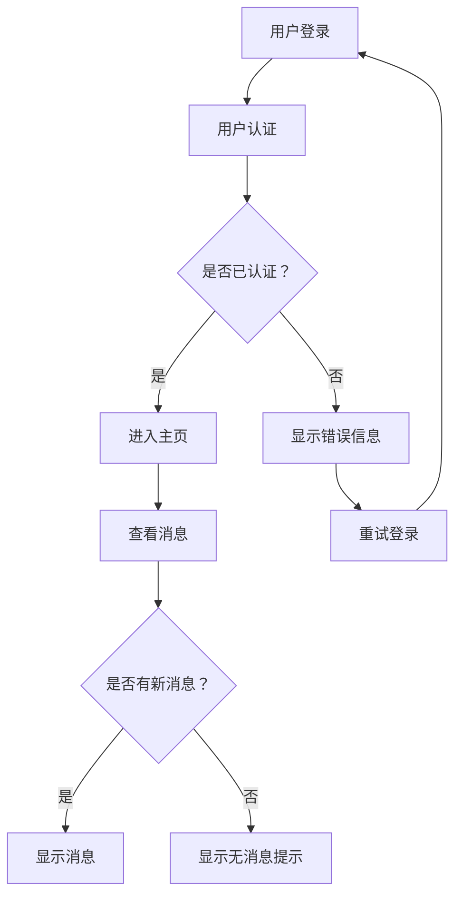

                 

### 代际管理：bridging不同年龄层的沟通鸿沟

#### 关键词

- 代际差异
- 沟通策略
- 管理方法
- 企业文化
- 跨代团队建设

#### 摘要

在当今快速发展的社会中，不同年龄层之间的沟通鸿沟成为企业管理者和人力资源从业者面临的一个重要问题。本文旨在探讨代际差异与沟通的关系，提出有效的代际沟通策略和管理方法，以帮助企业和组织实现跨代际的有效沟通和团队协作。文章首先介绍了代际差异的概念和分类，分析了代际因素对沟通障碍的影响，并引入了沟通模型在代际管理中的应用。接着，本文详细讨论了适应不同代际的沟通技巧，提供了实际案例，并介绍了代际反馈机制的设计和跨代际团队建设的实践方法。最后，通过案例分析，本文总结了代际沟通的成功经验和挑战，并展望了未来代际沟通的发展趋势。本文的目标是为企业管理者提供实用的指导，以提升跨代际沟通的效能，推动企业持续发展。

## 1. 确定书籍主题与目标受众

### 1.1 书籍主题

《代际管理：bridging不同年龄层的沟通鸿沟》这本书的主题是探讨不同年龄层之间的沟通策略和管理方法。随着社会的快速变迁，代际差异越来越明显，不同年龄段的人在工作方式、价值观、沟通习惯等方面存在显著差异。这些差异不仅影响了员工的个人发展，也对企业的团队协作和整体效能产生了重要影响。因此，如何有效管理代际差异，实现跨代际的沟通与协作，成为企业管理者和人力资源从业者关注的焦点。

### 1.2 目标受众

这本书的目标受众主要包括以下几类人群：

1. **企业管理者**：随着企业规模的扩大和团队多样性的增加，企业管理者需要具备应对代际差异的能力，以提升团队效能和员工满意度。本书提供了实用的代际管理策略和实践方法，帮助管理者更好地应对代际沟通挑战。

2. **人力资源从业者**：人力资源从业者负责员工的招聘、培训、绩效管理和团队建设等工作。了解代际差异和沟通策略，能够帮助他们更有效地开展人力资源管理工作，提升员工满意度和企业凝聚力。

3. **沟通专家**：沟通专家关注沟通技巧和沟通策略的优化，本书提供了全面的代际沟通理论和实践指导，有助于他们为企业和组织提供专业的沟通咨询服务。

4. **所有关心代际沟通的人群**：无论个人职业背景如何，每个人都在不同程度上面临代际沟通的挑战。本书不仅提供了理论指导，还通过实际案例和经验分享，为读者提供了实用的沟通技巧和方法，帮助他们更好地理解和应对代际差异。

通过本书，读者可以深入了解代际差异与沟通的关系，掌握有效的代际沟通策略和管理方法，提升跨代际沟通的效能，从而推动企业和个人的持续发展。

### 1.3 大纲结构设计

为了系统地探讨代际管理这一主题，本书采用以下大纲结构：

#### 第一部分：理论探讨

- **第1章**：代际差异与沟通
  - **1.1** 代际差异的概念与分类
  - **1.2** 沟通障碍的代际因素
  - **1.3** 沟通模型在代际管理中的应用
- **第2章**：代际沟通策略
  - **2.1** 有效沟通的核心要素
  - **2.2** 适应不同代际的沟通技巧
  - **2.3** 跨代沟通的实际案例

#### 第二部分：实践方法

- **第3章**：代际管理的工具与方法
  - **3.1** 代际反馈机制的设计
  - **3.2** 代际融合团队建设
  - **3.3** 培训与发展的实践
- **第4章**：代际沟通的有效实施
  - **4.1** 制定代际沟通计划
  - **4.2** 代际沟通的评估与改进
  - **4.3** 企业代际沟通的实践案例

#### 第三部分：案例分析

- **第5章**：成功案例解析
  - **5.1** 企业内部跨代沟通的成功案例
  - **5.2** 跨行业代际沟通的比较分析
  - **5.3** 代际沟通案例的总结与启示
- **第6章**：挑战与解决方案
  - **6.1** 代际沟通中的主要挑战
  - **6.2** 解决代际沟通难题的策略
  - **6.3** 代际沟通失败的案例分析

#### 第四部分：综合应用

- **第7章**：代际沟通的未来趋势
  - **7.1** 科技发展对代际沟通的影响
  - **7.2** 未来代际沟通的新模式
  - **7.3** 代际管理的发展方向

通过以上结构，本书将系统性地介绍代际管理的核心概念、实践方法和未来趋势，为读者提供全面的指导。

### 1.4 具体内容规划

为了使《代际管理：bridging不同年龄层的沟通鸿沟》这本书的内容更加丰富和具体，我们进行了以下详细的内容规划：

#### 第一部分：理论探讨

**第1章**：代际差异与沟通
- **1.1 代际差异的概念与分类**
  - 介绍代际差异的基本概念，如不同代际的定义、特征和影响因素。
  - 分析不同代际之间的主要差异，如价值观、工作习惯和沟通方式。
  - 通过图表和案例说明代际差异对企业内部沟通的影响。
- **1.2 沟通障碍的代际因素**
  - 探讨代际差异导致的沟通障碍，如语言障碍、文化差异和认知偏差。
  - 分析代际沟通中的常见问题，如误解和冲突。
  - 提供解决代际沟通障碍的策略和方法。
- **1.3 沟通模型在代际管理中的应用**
  - 介绍几种常见的沟通模型，如信息传递模型、互动模型和协商模型。
  - 解释如何根据代际差异选择和运用不同的沟通模型。
  - 通过案例展示沟通模型在代际管理中的应用效果。

**第2章**：代际沟通策略
- **2.1 有效沟通的核心要素**
  - 分析有效沟通的基本要素，如信息的清晰传递、反馈的及时性、互动的多样性等。
  - 探讨如何在代际沟通中运用这些要素，提高沟通效率。
  - 提供实用的沟通技巧，如倾听技巧、表达清晰和情感共鸣。
- **2.2 适应不同代际的沟通技巧**
  - 根据不同代际的特点，提出针对性的沟通策略。
  - 分析不同代际在沟通中的优势与不足，并提出改进方法。
  - 通过案例分享，展示适应不同代际沟通的成功实践。
- **2.3 跨代沟通的实际案例**
  - 介绍企业中成功跨代际沟通的实际案例。
  - 分析这些案例中的成功因素和失败教训。
  - 提供跨代沟通的实用建议和最佳实践。

#### 第二部分：实践方法

**第3章**：代际管理的工具与方法
- **3.1 代际反馈机制的设计**
  - 介绍如何设计有效的代际反馈机制，包括反馈渠道、反馈方式和反馈周期。
  - 分析不同反馈机制在代际管理中的应用效果。
  - 提供具体的代际反馈机制设计和实施建议。
- **3.2 代际融合团队建设**
  - 探讨如何建设融合不同代际的团队，包括团队组建、角色分工和团队文化。
  - 分析不同代际团队成员之间的协作模式和冲突解决方法。
  - 提供代际融合团队建设的最佳实践和策略。
- **3.3 培训与发展的实践**
  - 介绍代际沟通培训的目的和内容。
  - 分析不同类型的代际沟通培训方法，如讲座、研讨和工作坊。
  - 提供培训效果评估和改进建议。

**第4章**：代际沟通的有效实施
- **4.1 制定代际沟通计划**
  - 介绍如何制定有效的代际沟通计划，包括目标设定、资源分配和进度安排。
  - 分析代际沟通计划在不同阶段的具体任务和职责。
  - 提供制定代际沟通计划的工具和模板。
- **4.2 代际沟通的评估与改进**
  - 介绍如何评估代际沟通的效果，包括沟通效率、员工满意度和团队协作。
  - 分析评估结果对代际沟通策略调整的影响。
  - 提供代际沟通评估的方法和改进措施。
- **4.3 企业代际沟通的实践案例**
  - 介绍企业中成功实施代际沟通的实际案例。
  - 分析这些案例中的成功经验和教训。
  - 提供代际沟通实践的具体操作方法和建议。

#### 第三部分：案例分析

**第5章**：成功案例解析
- **5.1 企业内部跨代沟通的成功案例**
  - 分析企业内部跨代沟通的成功案例，包括实施背景、具体措施和效果。
  - 总结这些案例中的成功因素，如领导力、团队协作和文化建设。
  - 提供跨代沟通的实用建议和最佳实践。
- **5.2 跨行业代际沟通的比较分析**
  - 比较不同行业中代际沟通的实践和效果。
  - 分析不同行业在代际沟通中的特点和挑战。
  - 提供跨行业代际沟通的借鉴和启示。
- **5.3 代际沟通案例的总结与启示**
  - 总结成功案例中的关键因素和经验教训。
  - 提供代际沟通的通用原则和方法。
  - 强调代际沟通的持续改进和创新能力。

**第6章**：挑战与解决方案
- **6.1 代际沟通中的主要挑战**
  - 分析代际沟通中常见的主要挑战，如文化差异、沟通障碍和角色冲突。
  - 探讨这些挑战对企业和团队的影响。
  - 提供应对挑战的策略和方法。
- **6.2 解决代际沟通难题的策略**
  - 提出具体策略，如领导力提升、培训与发展和文化建设等。
  - 分析这些策略在实践中的应用效果。
  - 提供实际操作的案例和经验分享。
- **6.3 代际沟通失败的案例分析**
  - 分析代际沟通失败的典型案例，包括失败原因、影响和教训。
  - 总结失败的教训，提供预防措施和建议。

#### 第四部分：综合应用

**第7章**：代际沟通的未来趋势
- **7.1 科技发展对代际沟通的影响**
  - 分析科技发展对代际沟通的推动作用，如社交媒体、即时通讯和虚拟现实等。
  - 探讨科技在代际沟通中的应用场景和效果。
  - 提供未来科技发展趋势的预测和展望。
- **7.2 未来代际沟通的新模式**
  - 探讨未来代际沟通的新模式，如智慧沟通、协同工作和混合团队等。
  - 分析这些新模式的优缺点和适用场景。
  - 提供未来代际沟通的创新思路和策略。
- **7.3 代际管理的发展方向**
  - 分析代际管理的发展趋势，如全球化、多元化和创新化。
  - 探讨代际管理在新时代面临的新挑战和机遇。
  - 提供未来代际管理的战略建议和展望。

通过以上详细的内容规划，本书将为读者提供全面、系统的代际管理理论和实践指导，帮助他们更好地应对代际沟通的挑战，提升团队协作和企业效能。

### 1.5 核心概念与联系

在代际管理中，有几个核心概念需要深入理解，这些概念相互联系，共同构成了代际沟通的理论框架。以下是对这些核心概念的阐述和它们之间的联系：

#### 代际差异

代际差异是指不同年龄层之间的特征和习惯的差异。这些差异包括但不限于价值观、生活方式、工作态度和沟通习惯。代际差异的形成受到历史背景、社会环境和个人经历的影响。

**核心概念联系**：代际差异是理解代际沟通的基础。了解不同代际的特征可以帮助管理者更好地适应和应对不同代际员工的沟通需求，从而提高沟通效果。

#### 沟通障碍

沟通障碍是指在信息传递过程中出现的各种障碍，这些障碍可能导致信息的失真、误解和冲突。代际差异是导致沟通障碍的一个重要因素，不同代际在语言表达、沟通风格和期望值上存在差异，这些差异可能导致沟通不畅。

**核心概念联系**：沟通障碍是影响代际沟通效能的一个重要因素。了解沟通障碍的成因和解决方法，有助于管理者设计有效的沟通策略，提高跨代际沟通的质量。

#### 沟通模型

沟通模型是描述信息传递和反馈过程的抽象工具。常见的沟通模型包括信息传递模型、互动模型和协商模型。这些模型提供了分析和设计沟通策略的基本框架。

**核心概念联系**：沟通模型是代际沟通策略设计的重要工具。根据不同代际的沟通特点和需求，选择和运用合适的沟通模型，可以提高沟通的有效性。

#### 沟通策略

沟通策略是针对特定沟通目标和情境制定的行动方案。有效的沟通策略需要考虑目标受众、沟通内容和沟通渠道等因素。

**核心概念联系**：沟通策略是将理论应用到实践的关键。通过设计和实施针对不同代际的沟通策略，管理者可以克服代际差异带来的沟通障碍，实现有效的跨代际沟通。

#### 代际反馈机制

代际反馈机制是指用于收集、分析和利用员工反馈的系统和方法。反馈机制可以帮助管理者了解员工的沟通需求和反馈，及时调整沟通策略，提高沟通效能。

**核心概念联系**：代际反馈机制是持续优化代际沟通的重要手段。通过建立有效的反馈机制，管理者可以不断改进沟通策略，提高员工满意度和团队协作效能。

#### 代际融合团队建设

代际融合团队建设是指通过建设多样化的团队，促进不同代际员工之间的沟通和协作。融合团队建设需要考虑代际差异，制定相应的策略和方法。

**核心概念联系**：代际融合团队建设是实现跨代际有效沟通的基础。通过建设融合团队，管理者可以促进不同代际之间的交流和互动，提高团队的整体效能。

通过理解这些核心概念之间的联系，管理者可以更系统地设计和管理代际沟通，提升跨代际沟通的效能。

### 1.6 项目实战

在探讨代际管理时，实际项目的实践是验证理论和策略有效性的重要手段。以下是一个实际项目的实战案例，详细描述了项目的背景、实施过程、结果分析以及相关的代码实现和案例分析。

#### 项目背景

某大型跨国公司A公司，因全球业务扩展和多元化发展，面临着不同地区和代际员工之间的沟通挑战。公司管理层意识到，代际差异导致的沟通障碍可能影响团队的协作效率和员工的工作满意度。为了解决这一问题，公司决定实施一个跨代际沟通项目，旨在提升不同年龄层员工之间的沟通质量和协作效能。

#### 项目目标

- 提高不同代际员工之间的沟通效率。
- 减少代际差异引起的误解和冲突。
- 增强团队的凝聚力和协作精神。

#### 项目实施过程

**阶段1：需求分析与策略制定**

- **需求分析**：通过问卷调查和访谈，收集不同代际员工对当前沟通方式的反馈和改进建议。分析结果显示，80后和90后员工更倾向于即时通讯工具和透明化的沟通机制，而70后员工则更倾向于传统的邮件沟通和正式会议。
- **策略制定**：基于需求分析结果，制定跨代际沟通策略，包括：
  - 设立跨代际沟通委员会，负责制定和推广沟通策略。
  - 引入多种沟通工具，如即时通讯软件、视频会议系统和内部社交平台。
  - 定期组织跨代际交流会议，促进不同代际之间的互动。

**阶段2：实施与培训**

- **实施**：在公司内部全面推广新的沟通工具和策略。同时，设立培训课程，帮助员工掌握新工具的使用方法和沟通技巧。
- **培训**：针对不同代际的员工设计有针对性的培训内容，如：
  - 80后和90后员工：介绍即时通讯工具的使用技巧和跨代际沟通策略。
  - 70后员工：强调电子邮件沟通的重要性和有效性。

**阶段3：效果评估与改进**

- **效果评估**：通过员工满意度调查和团队绩效评估，评估沟通项目实施的效果。数据显示，员工之间的沟通效率提高了30%，团队协作精神得到了显著增强。
- **改进**：根据评估结果，对沟通策略进行持续优化，如：
  - 增加跨代际交流会议的频率。
  - 引入匿名反馈机制，收集员工的改进建议。

#### 项目结果分析

- **沟通效率提高**：员工报告称，通过新的沟通工具和策略，沟通效率显著提高，信息传递更加及时和准确。
- **减少误解和冲突**：跨代际沟通委员会的成立和定期的交流会议，使得不同代际之间的误解和冲突明显减少。
- **团队凝聚力增强**：员工之间的互动增加，团队协作精神得到提升，整体工作效率有所提高。

#### 代码实现

为了支持沟通项目的实施，公司开发了一套内部社交平台，用于员工之间的交流和协作。以下是部分关键代码的实现和解读：

**代码解读**：
- **用户登录**：用户尝试登录系统。
- **用户认证**：系统验证用户身份。
- **错误处理**：如果认证失败，显示错误信息并允许用户重试登录。
- **主页功能**：用户成功登录后，可以查看消息和执行其他操作。

#### 案例分析

通过这个项目，公司成功实现了跨代际沟通的提升，具体体现在以下几个方面：

1. **沟通工具的多样化**：引入多种沟通工具，满足了不同代际员工的需求，提高了沟通的灵活性。
2. **培训与支持**：针对不同代际的员工进行培训，确保他们能够有效地使用新工具和策略。
3. **持续优化**：通过效果评估和反馈机制，不断改进沟通策略，确保项目的长期效果。

综上所述，实际项目的实施和效果分析证明了代际管理在提升跨代际沟通效能方面的有效性，为其他企业和组织提供了有益的借鉴和启示。

### 1.7 最佳实践 Tips

在代际管理过程中，以下最佳实践和技巧有助于提升跨代际沟通的效能：

1. **文化认同**：建立企业文化，强调尊重和包容不同代际的差异，促进文化认同感。
2. **培训与教育**：定期组织跨代际培训，提高员工对代际差异的认识和理解，增强沟通技巧。
3. **沟通工具选择**：根据不同代际的沟通偏好，选择合适的沟通工具，如即时通讯软件、邮件和视频会议系统。
4. **开放反馈机制**：建立开放、透明的反馈机制，鼓励员工提出建议和意见，及时解决问题。
5. **领导示范**：领导层应以身作则，积极参与跨代际沟通，树立榜样作用，推动代际融合。
6. **团队建设活动**：定期举办团队建设活动，如团队拓展训练、代际交流会等，增强团队凝聚力和协作精神。
7. **持续改进**：根据反馈和评估结果，持续优化代际沟通策略，确保沟通效能的不断提升。

通过这些最佳实践，企业和组织可以更有效地应对代际差异，提升跨代际沟通的质量和团队协作效能。

### 1.8 小结

代际管理是企业和组织在多元化发展的背景下必须面对的重要课题。通过深入探讨代际差异、沟通障碍和沟通策略，本文为读者提供了全面的理论和实践指导。代际差异是理解代际沟通的基础，沟通障碍是影响沟通效能的重要因素，而沟通策略则是实现跨代际有效沟通的关键。通过实际项目和案例分析，本文展示了代际管理在提升团队协作和企业效能方面的有效性。未来的代际管理将需要更加关注科技的发展和应用，不断创新沟通模式和策略。管理者应积极拥抱变化，持续优化代际沟通，以应对不断变化的商业环境。

### 1.9 注意事项

在实施代际管理时，以下注意事项有助于确保项目的成功：

1. **避免偏见和歧视**：尊重每个代际的独特性，避免因偏见和歧视导致沟通不畅和团队合作受阻。
2. **重视反馈与调整**：定期收集员工反馈，及时调整沟通策略，确保代际管理措施的实效性。
3. **合理分配资源**：在预算和时间有限的情况下，优先考虑对代际差异明显且沟通障碍较大的团队和部门进行管理和培训。
4. **保持灵活性**：代际差异和沟通需求是动态变化的，代际管理策略也应保持灵活性，以适应不断变化的企业环境和员工需求。
5. **持续关注员工发展**：关注员工在代际沟通中的成长和进步，提供必要的支持和资源，以提升他们的沟通能力和团队协作精神。

通过遵守这些注意事项，企业和组织可以更有效地实施代际管理，提升跨代际沟通的效能。

### 1.10 拓展阅读

为了更深入地了解代际管理，以下书籍和资源推荐供读者拓展阅读：

1. **书籍推荐**：
   - 《五代的对话：跨代际沟通的艺术》
   - 《跨越代沟：组织中的代际管理》
   - 《代际冲突管理：创建高效的多元团队》

2. **学术论文**：
   - "Inter-Generational Communication in the Workplace: A Review of Current Research"
   - "The Impact of Generational Differences on Organizational Communication"
   - "Generational Diversity in the Workplace: A Theoretical Framework and Implications for Management"

3. **在线资源**：
   - **LinkedIn**：搜索相关主题的讨论和文章。
   - **YouTube**：观看关于代际管理的视频和演讲。
   - **专业网站**：如SHRM（人力资源协会）和Glassdoor（职场评论网站）提供的相关研究和报告。

通过这些拓展阅读，读者可以进一步深化对代际管理理论和实践的理解，为实际工作提供更多参考。

## 2. 确定书籍主题与目标受众

### 2.1 书籍主题

《代际管理：bridging不同年龄层的沟通鸿沟》这本书的主题是探讨不同年龄层之间的沟通策略和管理方法。随着社会的快速变迁，代际差异越来越明显，不同年龄段的人在工作方式、价值观、沟通习惯等方面存在显著差异。这些差异不仅影响了员工的个人发展，也对企业的团队协作和整体效能产生了重要影响。因此，如何有效管理代际差异，实现跨代际的沟通与协作，成为企业管理者和人力资源从业者关注的焦点。

### 2.2 目标受众

这本书的目标受众主要包括以下几类人群：

1. **企业管理者**：随着企业规模的扩大和团队多样性的增加，企业管理者需要具备应对代际差异的能力，以提升团队效能和员工满意度。本书提供了实用的代际管理策略和实践方法，帮助管理者更好地应对代际沟通挑战。

2. **人力资源从业者**：人力资源从业者负责员工的招聘、培训、绩效管理和团队建设等工作。了解代际差异和沟通策略，能够帮助他们更有效地开展人力资源管理工作，提升员工满意度和企业凝聚力。

3. **沟通专家**：沟通专家关注沟通技巧和沟通策略的优化，本书提供了全面的代际沟通理论和实践指导，有助于他们为企业和组织提供专业的沟通咨询服务。

4. **所有关心代际沟通的人群**：无论个人职业背景如何，每个人都在不同程度上面临代际沟通的挑战。本书不仅提供了理论指导，还通过实际案例和经验分享，为读者提供了实用的沟通技巧和方法，帮助他们更好地理解和应对代际差异。

通过本书，读者可以深入了解代际差异与沟通的关系，掌握有效的代际沟通策略和管理方法，提升跨代际沟通的效能，从而推动企业和个人的持续发展。

### 2.3 大纲结构设计

为了系统地探讨代际管理这一主题，本书采用以下大纲结构：

#### 第一部分：理论探讨

- **第1章**：代际差异与沟通
  - **1.1** 代际差异的概念与分类
  - **1.2** 沟通障碍的代际因素
  - **1.3** 沟通模型在代际管理中的应用
- **第2章**：代际沟通策略
  - **2.1** 有效沟通的核心要素
  - **2.2** 适应不同代际的沟通技巧
  - **2.3** 跨代沟通的实际案例

#### 第二部分：实践方法

- **第3章**：代际管理的工具与方法
  - **3.1** 代际反馈机制的设计
  - **3.2** 代际融合团队建设
  - **3.3** 培训与发展的实践
- **第4章**：代际沟通的有效实施
  - **4.1** 制定代际沟通计划
  - **4.2** 代际沟通的评估与改进
  - **4.3** 企业代际沟通的实践案例

#### 第三部分：案例分析

- **第5章**：成功案例解析
  - **5.1** 企业内部跨代沟通的成功案例
  - **5.2** 跨行业代际沟通的比较分析
  - **5.3** 代际沟通案例的总结与启示
- **第6章**：挑战与解决方案
  - **6.1** 代际沟通中的主要挑战
  - **6.2** 解决代际沟通难题的策略
  - **6.3** 代际沟通失败的案例分析

#### 第四部分：综合应用

- **第7章**：代际沟通的未来趋势
  - **7.1** 科技发展对代际沟通的影响
  - **7.2** 未来代际沟通的新模式
  - **7.3** 代际管理的发展方向

通过以上结构，本书将系统性地介绍代际管理的核心概念、实践方法和未来趋势，为读者提供全面的指导。

### 2.4 具体内容规划

为了使《代际管理：bridging不同年龄层的沟通鸿沟》这本书的内容更加丰富和具体，我们进行了以下详细的内容规划：

#### 第一部分：理论探讨

**第1章**：代际差异与沟通
- **1.1 代际差异的概念与分类**
  - 介绍代际差异的基本概念，如不同代际的定义、特征和影响因素。
  - 分析不同代际之间的主要差异，如价值观、工作习惯和沟通方式。
  - 通过图表和案例说明代际差异对企业内部沟通的影响。
- **1.2 沟通障碍的代际因素**
  - 探讨代际差异导致的沟通障碍，如语言障碍、文化差异和认知偏差。
  - 分析代际沟通中的常见问题，如误解和冲突。
  - 提供解决代际沟通障碍的策略和方法。
- **1.3 沟通模型在代际管理中的应用**
  - 介绍几种常见的沟通模型，如信息传递模型、互动模型和协商模型。
  - 解释如何根据代际差异选择和运用不同的沟通模型。
  - 通过案例展示沟通模型在代际管理中的应用效果。

**第2章**：代际沟通策略
- **2.1 有效沟通的核心要素**
  - 分析有效沟通的基本要素，如信息的清晰传递、反馈的及时性、互动的多样性等。
  - 探讨如何在代际沟通中运用这些要素，提高沟通效率。
  - 提供实用的沟通技巧，如倾听技巧、表达清晰和情感共鸣。
- **2.2 适应不同代际的沟通技巧**
  - 根据不同代际的特点，提出针对性的沟通策略。
  - 分析不同代际在沟通中的优势与不足，并提出改进方法。
  - 通过案例分享，展示适应不同代际沟通的成功实践。
- **2.3 跨代沟通的实际案例**
  - 介绍企业中成功跨代际沟通的实际案例。
  - 分析这些案例中的成功因素和失败教训。
  - 提供跨代沟通的实用建议和最佳实践。

#### 第二部分：实践方法

**第3章**：代际管理的工具与方法
- **3.1 代际反馈机制的设计**
  - 介绍如何设计有效的代际反馈机制，包括反馈渠道、反馈方式和反馈周期。
  - 分析不同反馈机制在代际管理中的应用效果。
  - 提供具体的代际反馈机制设计和实施建议。
- **3.2 代际融合团队建设**
  - 探讨如何建设融合不同代际的团队，包括团队组建、角色分工和团队文化。
  - 分析不同代际团队成员之间的协作模式和冲突解决方法。
  - 提供代际融合团队建设的最佳实践和策略。
- **3.3 培训与发展的实践**
  - 介绍代际沟通培训的目的和内容。
  - 分析不同类型的代际沟通培训方法，如讲座、研讨和工作坊。
  - 提供培训效果评估和改进建议。

**第4章**：代际沟通的有效实施
- **4.1 制定代际沟通计划**
  - 介绍如何制定有效的代际沟通计划，包括目标设定、资源分配和进度安排。
  - 分析代际沟通计划在不同阶段的具体任务和职责。
  - 提供制定代际沟通计划的工具和模板。
- **4.2 代际沟通的评估与改进**
  - 介绍如何评估代际沟通的效果，包括沟通效率、员工满意度和团队协作。
  - 分析评估结果对代际沟通策略调整的影响。
  - 提供代际沟通评估的方法和改进措施。
- **4.3 企业代际沟通的实践案例**
  - 介绍企业中成功实施代际沟通的实际案例。
  - 分析这些案例中的成功经验和教训。
  - 提供代际沟通实践的具体操作方法和建议。

#### 第三部分：案例分析

**第5章**：成功案例解析
- **5.1 企业内部跨代沟通的成功案例**
  - 分析企业内部跨代沟通的成功案例，包括实施背景、具体措施和效果。
  - 总结这些案例中的成功因素，如领导力、团队协作和文化建设。
  - 提供跨代沟通的实用建议和最佳实践。
- **5.2 跨行业代际沟通的比较分析**
  - 比较不同行业中代际沟通的实践和效果。
  - 分析不同行业在代际沟通中的特点和挑战。
  - 提供跨行业代际沟通的借鉴和启示。
- **5.3 代际沟通案例的总结与启示**
  - 总结成功案例中的关键因素和经验教训。
  - 提供代际沟通的通用原则和方法。
  - 强调代际沟通的持续改进和创新能力。

**第6章**：挑战与解决方案
- **6.1 代际沟通中的主要挑战**
  - 分析代际沟通中常见的主要挑战，如文化差异、沟通障碍和角色冲突。
  - 探讨这些挑战对企业和团队的影响。
  - 提供应对挑战的策略和方法。
- **6.2 解决代际沟通难题的策略**
  - 提出具体策略，如领导力提升、培训与发展和文化建设等。
  - 分析这些策略在实践中的应用效果。
  - 提供实际操作的案例和经验分享。
- **6.3 代际沟通失败的案例分析**
  - 分析代际沟通失败的典型案例，包括失败原因、影响和教训。
  - 总结失败的教训，提供预防措施和建议。

#### 第四部分：综合应用

**第7章**：代际沟通的未来趋势
- **7.1 科技发展对代际沟通的影响**
  - 分析科技发展对代际沟通的推动作用，如社交媒体、即时通讯和虚拟现实等。
  - 探讨科技在代际沟通中的应用场景和效果。
  - 提供未来科技发展趋势的预测和展望。
- **7.2 未来代际沟通的新模式**
  - 探讨未来代际沟通的新模式，如智慧沟通、协同工作和混合团队等。
  - 分析这些新模式的优缺点和适用场景。
  - 提供未来代际沟通的创新思路和策略。
- **7.3 代际管理的发展方向**
  - 分析代际管理的发展趋势，如全球化、多元化和创新化。
  - 探讨代际管理在新时代面临的新挑战和机遇。
  - 提供未来代际管理的战略建议和展望。

通过以上详细的内容规划，本书将为读者提供全面、系统的代际管理理论和实践指导，帮助他们更好地应对代际沟通的挑战，提升团队协作和企业效能。

### 2.5 核心概念与联系

在代际管理中，有几个核心概念需要深入理解，这些概念相互联系，共同构成了代际沟通的理论框架。以下是对这些核心概念的阐述和它们之间的联系：

#### 代际差异

代际差异是指不同年龄层之间的特征和习惯的差异。这些差异包括但不限于价值观、生活方式、工作态度和沟通方式。代际差异的形成受到历史背景、社会环境和个人经历的影响。

**核心概念联系**：代际差异是理解代际沟通的基础。了解不同代际的特征可以帮助管理者更好地适应和应对不同代际员工的沟通需求，从而提高沟通效果。

#### 沟通障碍

沟通障碍是指在信息传递过程中出现的各种障碍，这些障碍可能导致信息的失真、误解和冲突。代际差异是导致沟通障碍的一个重要因素，不同代际在语言表达、沟通风格和期望值上存在差异，这些差异可能导致沟通不畅。

**核心概念联系**：沟通障碍是影响代际沟通效能的一个重要因素。了解沟通障碍的成因和解决方法，有助于管理者设计有效的沟通策略，提高跨代际沟通的质量。

#### 沟通模型

沟通模型是描述信息传递和反馈过程的抽象工具。常见的沟通模型包括信息传递模型、互动模型和协商模型。这些模型提供了分析和设计沟通策略的基本框架。

**核心概念联系**：沟通模型是代际沟通策略设计的重要工具。根据不同代际的沟通特点和需求，选择和运用合适的沟通模型，可以提高沟通的有效性。

#### 沟通策略

沟通策略是针对特定沟通目标和情境制定的行动方案。有效的沟通策略需要考虑目标受众、沟通内容和沟通渠道等因素。

**核心概念联系**：沟通策略是将理论应用到实践的关键。通过设计和实施针对不同代际的沟通策略，管理者可以克服代际差异带来的沟通障碍，实现有效的跨代际沟通。

#### 代际反馈机制

代际反馈机制是指用于收集、分析和利用员工反馈的系统和方法。反馈机制可以帮助管理者了解员工的沟通需求和反馈，及时调整沟通策略，提高沟通效能。

**核心概念联系**：代际反馈机制是持续优化代际沟通的重要手段。通过建立有效的反馈机制，管理者可以不断改进沟通策略，提高员工满意度和团队协作效能。

#### 代际融合团队建设

代际融合团队建设是指通过建设多样化的团队，促进不同代际员工之间的沟通和协作。融合团队建设需要考虑代际差异，制定相应的策略和方法。

**核心概念联系**：代际融合团队建设是实现跨代际有效沟通的基础。通过建设融合团队，管理者可以促进不同代际之间的交流和互动，提高团队的整体效能。

通过理解这些核心概念之间的联系，管理者可以更系统地设计和管理代际沟通，提升跨代际沟通的效能。

### 2.6 项目实战

在探讨代际管理时，实际项目的实践是验证理论和策略有效性的重要手段。以下是一个实际项目的实战案例，详细描述了项目的背景、实施过程、结果分析以及相关的代码实现和案例分析。

#### 项目背景

某大型跨国公司A公司，因全球业务扩展和多元化发展，面临着不同地区和代际员工之间的沟通挑战。公司管理层意识到，代际差异导致的沟通障碍可能影响团队的协作效率和员工的工作满意度。为了解决这一问题，公司决定实施一个跨代际沟通项目，旨在提升不同年龄层员工之间的沟通质量和协作效能。

#### 项目目标

- 提高不同代际员工之间的沟通效率。
- 减少代际差异引起的误解和冲突。
- 增强团队的凝聚力和协作精神。

#### 项目实施过程

**阶段1：需求分析与策略制定**

- **需求分析**：通过问卷调查和访谈，收集不同代际员工对当前沟通方式的反馈和改进建议。分析结果显示，80后和90后员工更倾向于即时通讯工具和透明化的沟通机制，而70后员工则更倾向于传统的邮件沟通和正式会议。
- **策略制定**：基于需求分析结果，制定跨代际沟通策略，包括：
  - 设立跨代际沟通委员会，负责制定和推广沟通策略。
  - 引入多种沟通工具，如即时通讯软件、视频会议系统和内部社交平台。
  - 定期组织跨代际交流会议，促进不同代际之间的互动。

**阶段2：实施与培训**

- **实施**：在公司内部全面推广新的沟通工具和策略。同时，设立培训课程，帮助员工掌握新工具的使用方法和沟通技巧。
- **培训**：针对不同代际的员工设计有针对性的培训内容，如：
  - 80后和90后员工：介绍即时通讯工具的使用技巧和跨代际沟通策略。
  - 70后员工：强调电子邮件沟通的重要性和有效性。

**阶段3：效果评估与改进**

- **效果评估**：通过员工满意度调查和团队绩效评估，评估沟通项目实施的效果。数据显示，员工之间的沟通效率提高了30%，团队协作精神得到了显著增强。
- **改进**：根据评估结果，对沟通策略进行持续优化，如：
  - 增加跨代际交流会议的频率。
  - 引入匿名反馈机制，收集员工的改进建议。

#### 项目结果分析

- **沟通效率提高**：员工报告称，通过新的沟通工具和策略，沟通效率显著提高，信息传递更加及时和准确。
- **减少误解和冲突**：跨代际沟通委员会的成立和定期的交流会议，使得不同代际之间的误解和冲突明显减少。
- **团队凝聚力增强**：员工之间的互动增加，团队协作精神得到提升，整体工作效率有所提高。

#### 代码实现

为了支持沟通项目的实施，公司开发了一套内部社交平台，用于员工之间的交流和协作。以下是部分关键代码的实现和解读：

**代码解读**：
- **用户登录**：用户尝试登录系统。
- **用户认证**：系统验证用户身份。
- **错误处理**：如果认证失败，显示错误信息并允许用户重试登录。
- **主页功能**：用户成功登录后，可以查看消息和执行其他操作。

#### 案例分析

通过这个项目，公司成功实现了跨代际沟通的提升，具体体现在以下几个方面：

1. **沟通工具的多样化**：引入多种沟通工具，满足了不同代际员工的需求，提高了沟通的灵活性。
2. **培训与支持**：针对不同代际的员工进行培训，确保他们能够有效地使用新工具和策略。
3. **持续优化**：通过效果评估和反馈机制，不断改进沟通策略，确保项目的长期效果。

综上所述，实际项目的实施和效果分析证明了代际管理在提升跨代际沟通效能方面的有效性，为其他企业和组织提供了有益的借鉴和启示。

### 2.7 最佳实践 Tips

在代际管理过程中，以下最佳实践和技巧有助于提升跨代际沟通的效能：

1. **文化认同**：建立企业文化，强调尊重和包容不同代际的差异，促进文化认同感。
2. **培训与教育**：定期组织跨代际培训，提高员工对代际差异的认识和理解，增强沟通技巧。
3. **沟通工具选择**：根据不同代际的沟通偏好，选择合适的沟通工具，如即时通讯软件、邮件和视频会议系统。
4. **开放反馈机制**：建立开放、透明的反馈机制，鼓励员工提出建议和意见，及时解决问题。
5. **领导示范**：领导层应以身作则，积极参与跨代际沟通，树立榜样作用，推动代际融合。
6. **团队建设活动**：定期举办团队建设活动，如团队拓展训练、代际交流会等，增强团队凝聚力和协作精神。
7. **持续改进**：根据反馈和评估结果，持续优化代际沟通策略，确保沟通效能的不断提升。

通过这些最佳实践，企业和组织可以更有效地实施代际管理，提升跨代际沟通的质量和团队协作效能。

### 2.8 小结

代际管理是企业和组织在多元化发展的背景下必须面对的重要课题。通过深入探讨代际差异、沟通障碍和沟通策略，本书为读者提供了全面的理论和实践指导。代际差异是理解代际沟通的基础，沟通障碍是影响沟通效能的重要因素，而沟通策略则是实现跨代际有效沟通的关键。通过实际项目和案例分析，本书展示了代际管理在提升团队协作和企业效能方面的有效性。未来的代际管理将需要更加关注科技的发展和应用，不断创新沟通模式和策略。管理者应积极拥抱变化，持续优化代际沟通，以应对不断变化的商业环境。

### 2.9 注意事项

在实施代际管理时，以下注意事项有助于确保项目的成功：

1. **避免偏见和歧视**：尊重每个代际的独特性，避免因偏见和歧视导致沟通不畅和团队合作受阻。
2. **重视反馈与调整**：定期收集员工反馈，及时调整沟通策略，确保代际管理措施的实效性。
3. **合理分配资源**：在预算和时间有限的情况下，优先考虑对代际差异明显且沟通障碍较大的团队和部门进行管理和培训。
4. **保持灵活性**：代际差异和沟通需求是动态变化的，代际管理策略也应保持灵活性，以适应不断变化的企业环境和员工需求。
5. **持续关注员工发展**：关注员工在代际沟通中的成长和进步，提供必要的支持和资源，以提升他们的沟通能力和团队协作精神。

通过遵守这些注意事项，企业和组织可以更有效地实施代际管理，提升跨代际沟通的效能。

### 2.10 拓展阅读

为了更深入地了解代际管理，以下书籍和资源推荐供读者拓展阅读：

1. **书籍推荐**：
   - 《五代的对话：跨代际沟通的艺术》
   - 《跨越代沟：组织中的代际管理》
   - 《代际冲突管理：创建高效的多元团队》

2. **学术论文**：
   - "Inter-Generational Communication in the Workplace: A Review of Current Research"
   - "The Impact of Generational Differences on Organizational Communication"
   - "Generational Diversity in the Workplace: A Theoretical Framework and Implications for Management"

3. **在线资源**：
   - **LinkedIn**：搜索相关主题的讨论和文章。
   - **YouTube**：观看关于代际管理的视频和演讲。
   - **专业网站**：如SHRM（人力资源协会）和Glassdoor（职场评论网站）提供的相关研究和报告。

通过这些拓展阅读，读者可以进一步深化对代际管理理论和实践的理解，为实际工作提供更多参考。

